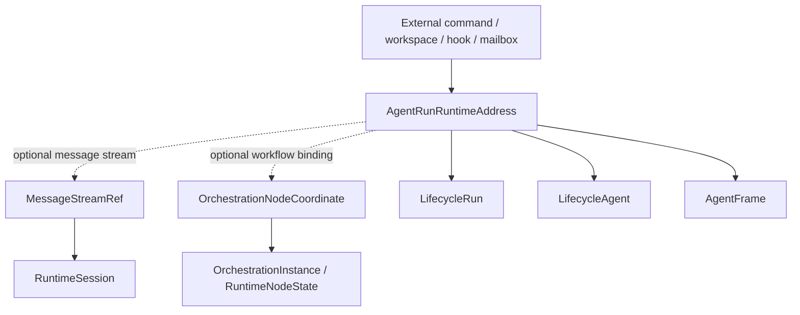

# Design

## Objective

将 runtime 入口从 session-first 收束为 AgentRun-first。

目标边界：

```text
External runtime/business API
  -> AgentRunRuntimeAddress
  -> AgentRun control-plane facts
  -> optional MessageStreamRef
  -> optional OrchestrationNodeCoordinate
```

RuntimeSession 只在 message stream / connector trace 语境中出现，不再作为业务入口或 ownership source。

## Target Concepts

```rust
pub struct AgentRunRuntimeAddress {
    pub run_id: Uuid,
    pub agent_id: Uuid,
    pub frame_id: Uuid,
}

pub struct MessageStreamRef {
    pub runtime_session_id: String,
}

pub struct OrchestrationNodeCoordinate {
    pub run_id: Uuid,
    pub orchestration_id: Uuid,
    pub node_path: String,
    pub attempt: u32,
}
```

命名可在实现时调整，但职责必须保持分离：

- `AgentRunRuntimeAddress`：业务 runtime address。
- `MessageStreamRef`：消息流 / transcript / connector trace。
- `OrchestrationNodeCoordinate`：node execution ownership。

## Mermaid View



## Audit Classification

Subagent review should classify each `runtime_session_id` / `session_id` usage into:

| Category | Keep session-first? | Examples |
| --- | --- | --- |
| Message stream / transcript | Yes | connector stream, transcript projection, compaction |
| Runtime business command | No | mailbox command, hook control, workspace runtime action |
| Resource / lifecycle surface | No | VFS/resource surface target |
| Orchestration node execution | No | artifacts, records, node status advance |
| Test fixture / adapter | Temporary | compatibility adapter, in-memory anchor repo |

## Migration Strategy

第一阶段不追求一次消灭所有 session APIs，而是建立入口分层：

1. Introduce address/ref types in application layer.
2. Add adapter functions from current `RuntimeSessionExecutionAnchor` to `AgentRunRuntimeAddress` + optional `MessageStreamRef`.
3. Make new projector / workspace APIs consume AgentRun-first address.
4. Move mailbox / hook / task effect APIs from session target to AgentRun target.
5. Rename or constrain remaining session-first APIs to message stream packages.

## Main Task Relationship

`agentrun-lifecycle-surface-projector` should not wait for this entire migration.

主任务只需要坚持：

- projector input is AgentRun-first.
- message stream is optional.
- node projection is orchestration-coordinate-owned.

本任务负责后续把更外围的 session-first API 拉回同一模型。
