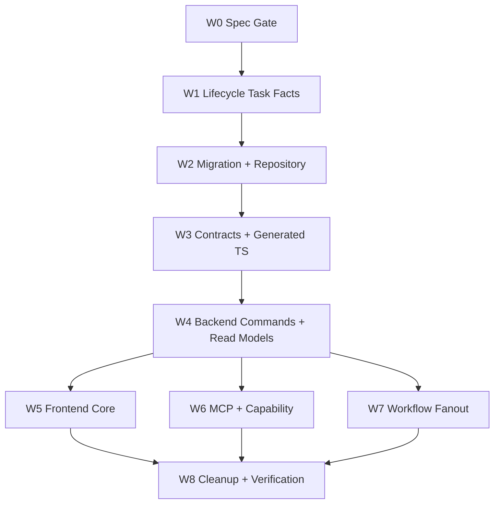

# Story / Task Subject Model Cleanup Work Items

## 管理原则

本目录用于父任务内的轻量工作包跟踪，不代表 Trellis child task。工作包是 subagent 扇出、交接和合流的最小管理单元。

主会话职责：

- 调度 DAG 依赖和并行窗口。
- 维护跨节点 contract、schema、spec 决策。
- 合并 subagent 结果并执行总体验证。
- 在工作包需要独立 owner 或跨多轮验收时，再升级为 Trellis child task。

subagent 职责：

- 只处理被分配的 `W*` 节点。
- 不跨节点修改 schema、contract 或 UI 边界，除非该节点文档明确授权。
- 结束时更新节点文档的状态、产出、风险和交接说明。

## 状态标记

- `pending`：尚未开始。
- `ready`：依赖已满足，可派发。
- `in_progress`：正在执行。
- `blocked`：依赖或决策阻塞。
- `done`：节点验收完成，可供下游消费。

## DAG



## 当前节点状态

| 节点 | 状态 | 可并行 | 跟踪文档 |
| --- | --- | --- | --- |
| W0 Spec Gate | done | 否 | `w0-spec-gate.md` |
| W1 Lifecycle Task Facts | done | 否 | `w1-lifecycle-task-facts.md` |
| W2 Migration + Repository | done | 否 | `w2-migration-repository.md` |
| W3 Contracts + Generated TS | done | 否 | `w3-contracts-generated.md` |
| W4 Backend Commands + Read Models | done | 否 | `w4-backend-commands-read-models.md` |
| W5 Frontend Core | done | 是 | `w5-frontend-core.md` |
| W6 MCP + Capability | done | 是 | `w6-mcp-capability.md` |
| W7 Workflow Fanout | done | 是 | `w7-workflow-fanout.md` |
| W8 Cleanup + Verification | done | 否，等待 W5/W6/W7 | `w8-cleanup-verification.md` |

## 派发模板

```text
Active task: .trellis/tasks/06-16-story-task-subject-model-cleanup

你是负责 W<N> 的实现 subagent。先阅读：
- .trellis/tasks/06-16-story-task-subject-model-cleanup/prd.md
- .trellis/tasks/06-16-story-task-subject-model-cleanup/design.md
- .trellis/tasks/06-16-story-task-subject-model-cleanup/implement.md
- .trellis/tasks/06-16-story-task-subject-model-cleanup/work-items/w<N>-*.md
- implement.jsonl 中与你节点相关的 spec / research

范围限于 W<N>。其它工作包的 contract、schema 或 UI 边界由对应节点负责；跨节点调整需要先回到主会话确认。
完成后更新 W<N> 跟踪文档中的状态、产出、风险和交接说明。
```
