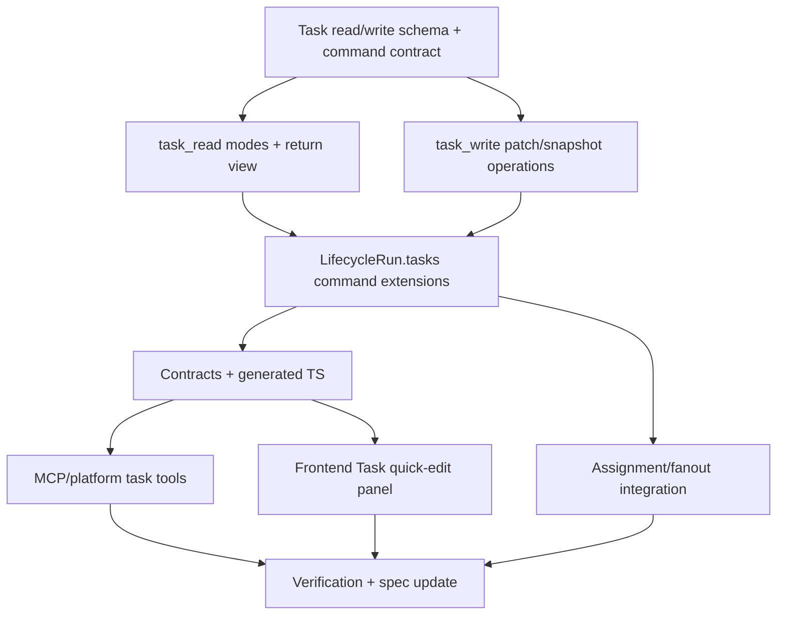

# 通用 Task 工具集执行规划

## 阶段 0：参考实现研究

- 读取 `references/codex`、`references/claude-code`、`references/pi-mono` 中清单 / plan / task 工具实现。
- 产出 `research/embedded-task-list-tool-review.md`。
- 研究结论必须明确 AgentDash 正式命名只有 Task，不得建议独立清单 entity/store，也不得建议业务代码出现 `Todo` 命名。
- 根据研究结果修订 `prd.md`、`design.md` 和本文件。

## 阶段 1：模型与 API 规划

- 先做工具数量审查：默认第一版只保留 `task_read` 和 `task_write`，新增工具必须有独立权限、审计或交互闭环理由。
- 定义 `task_read` 的 mode schema：`overview/list/detail/context/execution/projection`，每种 mode 明确默认字段、扩展字段、过滤、分页和 compact/full 输出。
- 定义 `task_read` 的完整 Task view schema，包括 details、context refs、Story/run linkage、assignment、execution summary 和 version。
- 定义 `task_write` 的 patch / snapshot mutation schema，状态推进只是 write operation，不单独拆工具。
- 定义工具如何直接读写 `LifecycleRun.tasks`。
- 定义审计事件进入 execution log / state change 的边界。
- 定义 agent-facing MCP / platform tool schema。
- 定义 API DTO 与 generated TS contract。

## 阶段 2：后端实现候选 DAG

可并行窗口：

- M1a 与 M1b 可在 M1 后并行。
- M4 与 M5 可在 M3 后并行。
- M6 可与 M4/M5 并行，但必须依赖 M2 的 command contract。

## 阶段 3：验证命令草案

- `cargo check --workspace`
- `pnpm run contracts:check`
- `pnpm run frontend:check`
- `pnpm run migration:guard`
- focused backend tests:
- task read overview/list/detail/context/execution/projection modes
- task write patch/snapshot/status/reorder/drop/context refs
- task split/merge/assign/fanout
  - permission scope checks
- focused frontend tests:
- Task status badge / list reducer
- AgentRun workspace Task quick-edit panel

## 实际会话验收

- 使用当前重构分支启动 `pnpm dev`。
- 打开前端，创建或进入可运行 AgentRun / Story 业务路径。
- 通过真实 Agent 工具调用创建/维护 Task。
- 在 AgentRun workspace 验证 Task 读回。
- 在 Story 页面验证 Task projection 来源和执行关系。
- 记录手动验收步骤、观察结果和限制。

## 进入实现

本任务作为 `06-16-story-task-subject-model-cleanup` 的业务验收闭环，在当前重构分支继续推进。底层实现和正式命名统一为 Task，第一版按 `task_read + task_write` 两工具落地。

## 实现记录

- 新增 `task` runtime capability 和 `ToolCluster::Task`，工具集固定为 `task_read` / `task_write`。
- `task_read` 支持 overview/list/detail/context/execution/projection mode。
- `task_write` 支持 patch / snapshot，并覆盖 create、patch、status、reorder、drop、context refs 写入。
- Task facts 继续写入 `LifecycleRun.tasks`；Story 只通过 projection 读回。
- 旧 Task Platform MCP scope 与 `/mcp/task/{task_id}` 路由退出 runtime 注入面。
- `companion_request(target=sub)` 支持 `payload.task_id`，会把 Task 上下文附加给 child companion，并在派发成功后写回 `assigned_agent_id`。

已执行验证：

- `cargo check -p agentdash-api`
- `pnpm run contracts:check`
- `pnpm run migration:guard`
- `pnpm run frontend:check`
- `cargo test -p agentdash-application task::plan`
- `cargo test -p agentdash-application capability::resolver`
- `cargo test -p agentdash-application session::post_turn_handler`

## 前端会话验收记录

时间：2026-06-17

启动方式：

- `pnpm dev`
- 前端：`http://127.0.0.1:5380`
- 后端 health：`http://127.0.0.1:3001/api/health`

验收路径：

- 从 Agent Hub 启动 `Pi Agent General` Project AgentRun。
- 在真实前端会话中要求 Agent 调用 `task_write` 创建/维护 Task，并调用 `task_read` 的 list/detail/projection 读回。
- 首轮会话完成后，Agent 最终读回 2 个 Task：`验收 Task A` 为 completed，`验收 Task B` 为 pending。
- 刷新 AgentRun 页面后，workspace Task Plan 面板能从 run projection 读回工具写入的 Task。

验收中补齐的工具语义：

- `task_write` patch operation schema 改为扁平 `op + fields`，使 `{ "op": "create_task", "title": "...", "status": "active" }` 这类 Agent 自然生成的参数能通过工具 schema 校验。
- `task_write` snapshot 对无 id 条目按当前 run 内唯一未归档标题 reconcile，避免 Agent 二次 snapshot 时追加同名 Task。
- snapshot 匹配到已有 Task 时会继续应用 status 推进，保证 snapshot 表达的状态事实进入 run task。
- mutating operation 的 `task_id` 支持 UUID 或当前 run 内唯一未归档标题；标题不唯一时要求改用 UUID，便于 Agent 在已读回列表后按标题完成短链路更新。

最终执行验证：

- `cargo check -p agentdash-api`
- `pnpm run contracts:check`
- `pnpm run frontend:check`
- `pnpm run migration:guard`
- `cargo test -p agentdash-application task::plan`
- `git diff --check`

限制记录：

- in-app browser 在最终短会话重试时对 contenteditable 输入出现 CDP/虚拟剪贴板不稳定；此前两轮真实前端 AgentRun 已覆盖 `task_write`/`task_read` 调用、projection 读回和 Task Plan 面板刷新。
