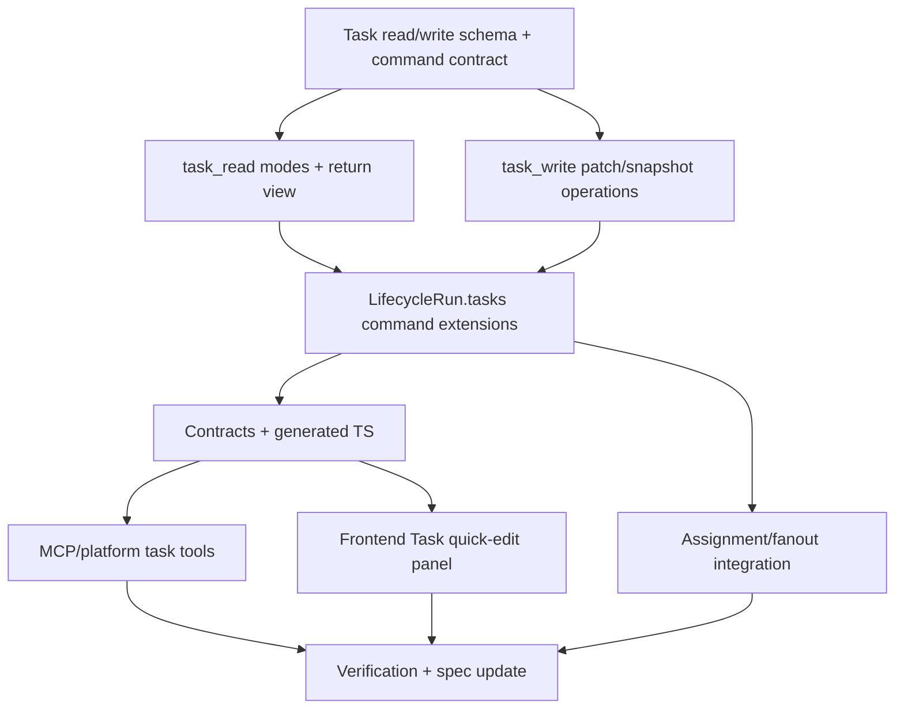

# 通用 Task 工具集执行规划

## 阶段 0：参考实现研究

- 读取 `references/codex`、`references/claude-code`、`references/pi-mono` 中清单 / plan / task 工具实现。
- 产出 `research/embedded-task-list-tool-review.md`。
- 研究结论必须明确 AgentDash 正式命名只有 Task，不得建议独立清单 entity/store，也不得建议业务代码出现 `Todo` 命名。
- 根据研究结果修订 `prd.md`、`design.md` 和本文件。

## 阶段 1：模型与 API 规划

- 先做工具数量审查：默认第一版只保留 `task_read` 和 `task_write`，新增工具必须有独立权限、审计或交互闭环理由。
- 定义 `task_read` 的 mode schema：`overview/list/detail/context/execution/projection`，每种 mode 明确默认字段、扩展字段、过滤、分页和 compact/full 输出。
- 定义 `task_read` 的完整 Task view schema，包括 details、context refs、Story/run linkage、assignment、execution summary 和 version。
- 定义 `task_write` 的 patch / snapshot mutation schema，状态推进只是 write operation，不单独拆工具。
- 定义工具如何直接读写 `LifecycleRun.tasks`。
- 定义审计事件进入 execution log / state change 的边界。
- 定义 agent-facing MCP / platform tool schema。
- 定义 API DTO 与 generated TS contract。

## 阶段 2：后端实现候选 DAG

可并行窗口：

- M1a 与 M1b 可在 M1 后并行。
- M4 与 M5 可在 M3 后并行。
- M6 可与 M4/M5 并行，但必须依赖 M2 的 command contract。

## 阶段 3：验证命令草案

- `cargo check --workspace`
- `pnpm run contracts:check`
- `pnpm run frontend:check`
- `pnpm run migration:guard`
- focused backend tests:
- task read overview/list/detail/context/execution/projection modes
- task write patch/snapshot/status/reorder/drop/context refs
- task split/merge/assign/fanout
  - permission scope checks
- focused frontend tests:
- Task status badge / list reducer
- AgentRun workspace Task quick-edit panel

## 实际会话验收

- 使用当前重构分支启动 `pnpm dev`。
- 打开前端，创建或进入可运行 AgentRun / Story 业务路径。
- 通过真实 Agent 工具调用创建/维护 Task。
- 在 AgentRun workspace 验证 Task 读回。
- 在 Story 页面验证 Task projection 来源和执行关系。
- 记录手动验收步骤、观察结果和限制。

## 进入实现

本任务作为 `06-16-story-task-subject-model-cleanup` 的业务验收闭环，在当前重构分支继续推进。底层实现和正式命名统一为 Task，第一版按 `task_read + task_write` 两工具落地。
