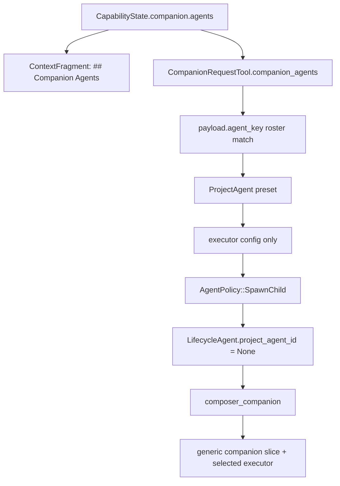
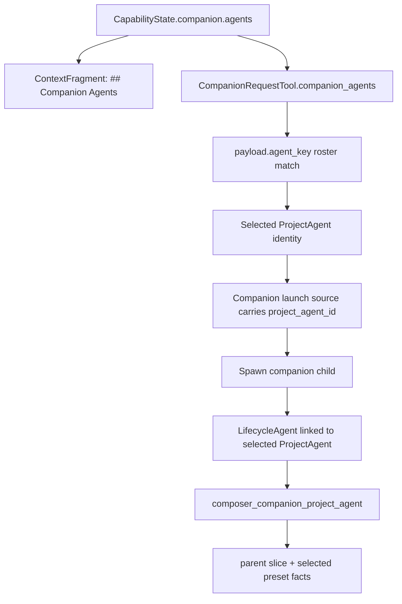

# Design

## Current Shape

当前实现已经把 companion roster 从工具 schema 收束到 `CapabilityState.companion.agents`。模型看到的 `## Companion Agents` 与 `CompanionRequestTool` 校验使用同一份 frame roster。

未收束的是 child launch：`payload.agent_key` 匹配 roster 后只转换为目标 ProjectAgent 的 executor config。dispatch 仍创建 `ExecutionSource::ParentAgent` + `AgentPolicy::SpawnChild` 的匿名 child agent，`LifecycleAgent.project_agent_id` 为空；child frame 通过 `CompanionLaunchSource` 走 `composer_companion`，能力来自 generic companion slice。



## Target Shape

`payload.agent_key` 应解析为 selected companion ProjectAgent identity。该 identity 进入 dispatch / launch / frame construction，child session 保留 parent-child companion 关系，同时具备 selected ProjectAgent 的运行身份和 preset facts。



## Companion Availability Model

### Data Model

Add a target-side field to `AgentPresetConfig`:

```rust
pub default_companion_enabled: Option<bool>
```

Naming can be finalized during implementation, but the semantic contract is:

- `true` means this ProjectAgent is included by default in sibling Agents' companion roster.
- `false` / absent means this ProjectAgent is not included by default and can only appear when a caller explicitly adds it.

Rename or replace caller-side `allowed_companions` with an additive field:

```rust
pub extra_companions: Option<Vec<String>>
```

The runtime roster for caller `A` is:

```text
all sibling agents where default_companion_enabled == true
UNION A.config.extra_companions
MINUS A itself
```

Entries are keyed by canonical ProjectAgent name / preset name, matching the existing `CompanionAgentEntry.name` contract.

No caller-side denylist is part of this model. A ProjectAgent decides whether it is generally available as a companion; a caller can only add non-default companions. Cases that require banning collaboration should be expressed by the caller's runtime operation surface, not by subtracting individual default companions.

### UI Model

- Each ProjectAgent config form exposes whether that Agent is default available as companion.
- The caller-side companion picker only lists sibling Agents where `default_companion_enabled != true`.
- Selecting items writes `extra_companions`, not a whitelist.
- Empty `extra_companions` means “no extra non-default companions”, not “all companions”.
- There is no UI affordance for excluding a default companion from a single caller.
- Agent cards and tooltips should describe canonical `agent_key` and default companion availability separately.
- AgentRun / companion dispatch UI should preserve selected ProjectAgent identity so the user can tell which companion agent was launched.
- Context/trace viewers should continue to show companion roster and roster delta only when authority allows dispatch.

## Launch Identity Model

`CompanionAgentEntry` currently carries `name`, `executor`, `display_name`. The tool can resolve the ProjectAgent by `project_id + name`, but launch contracts should carry stable identity after resolution:

```rust
pub struct CompanionLaunchSource {
    pub parent_session_id: String,
    pub selected_project_agent_id: Uuid,
    pub selected_agent_key: String,
    pub slice_mode: CompanionSliceMode,
    pub dispatch_prompt: String,
    pub workflow: Option<CompanionLaunchWorkflowSource>,
}
```

`companion_executor_config` should be derived inside the composer from selected ProjectAgent context, not passed as the only selected-agent fact.

Implementation can use one of two internal shapes:

- Add `AgentPolicy::SpawnCompanion { project_agent_id }` or equivalent dispatch plan support.
- Keep `SpawnChild`, then bind `LifecycleAgent.project_agent_id = selected_project_agent_id` before frame construction.

Preferred shape: add an explicit companion launch path or source metadata rather than hiding identity binding as an afterthought. The important invariant is that frame construction can route to a companion ProjectAgent composer with selected identity available.

## Frame Construction

Add or refactor companion compose so selected ProjectAgent context is resolved similarly to `composer_project_agent`:

- resolve selected ProjectAgent by project + id;
- build `ResolvedProjectAgentContext`;
- merge selected executor config with any explicit launch override if such override exists;
- apply parent context slice;
- apply selected ProjectAgent capability directives, skills, VFS grants, and workspace module visibility;
- keep companion-system skill / return-channel requirements.

The child should remain a companion child of the parent session, not become an independent top-level ProjectAgent run.

## Contracts To Preserve

- `CapabilityState.companion.agents` remains the roster source used by context, runtime delta, and tool validation.
- `CompanionAgentEntry.name` remains the canonical `payload.agent_key`.
- `companion_request(wait=true)` continues to create durable wait gates and resolve through `companion_respond`.
- Existing lineage / mailbox / system event surfaces should still identify the child as companion/subagent relation.
- Runtime operation-surface modeling should distinguish initiating collaboration from returning a child result. A parent Agent may be denied the ability to start new companion/subagent work, while a child companion must still retain the return-channel ability required to call `companion_respond`.

## Tool Model vs Operation Surface vs Runtime Guard

Current code couples two concepts:

- `ToolCapability` / `ToolCluster` decides which tools are exposed to a session. `CAP_COLLABORATION` currently maps to both `companion_request` and `companion_respond`.
- `PermissionGrantCompiler` compiles granted `ToolCapabilityPath` values back into tool capability directives, so permissions are expressed using the same path language as tool exposure.

The real model needs three layers:

- Tool exposure: whether a concrete tool is available to the model.
- Operation surface / affordance projection: whether startup context should advertise a higher-level operation, such as available companion agents.
- Runtime guard: whether a tool route is allowed for the current runtime role/topology when executed.

This coupling is too coarse for companion and for platform-owned built-in actions:

- `companion_request(target=sub)` is an initiation action that may need to be blocked by runtime role/topology.
- `companion_respond` is a return-channel action required for a child companion to finish its work.
- Treating both as one collaboration capability can remove the return channel when the intended policy only bans new subagent launch.
- If an Agent cannot dispatch subagents, owner bootstrap should not render `## Companion Agents`; otherwise the model is invited to use an operation that runtime policy forbids.
- Dynamic workflow / generated orchestration is a platform-owned built-in action that should be constrained by runtime role/topology, such as "main Agent only". This is not something a child Agent should request and elevate into.

Preferred direction for this task:

- Keep the tool model responsible for model-visible tool exposure.
- Add or formalize a runtime operation surface that upstream context projection and runtime guards both consume.
- Add a non-escalatable runtime guard layer for built-in tool routes that need final enforcement.
- Do not create permission-only tool capability keys just to work around this coupling unless the broader capability spec intentionally accepts tool capability paths as non-escalatable guard identifiers.
- Keep PermissionGrant for requestable/elevatable runtime capabilities. Tool guards are platform invariants and should not be unlockable through approval prompts.

Minimal operation / guard facts:

```text
companion.dispatch
  Operation surface: include companion roster in startup context.
  Runtime guard: allow companion_request(target=sub) / new child launch.

companion.respond
  Operation surface: child has a return channel to parent.
  Runtime guard: allow companion_respond when the child has a valid companion lineage/gate.

dynamic_workflow.author
  Operation surface: advertise dynamic workflow authoring/approval affordance.
  Runtime guard:
  Allowed only for main/root ProjectAgent sessions unless a future platform policy explicitly says otherwise.
```

Open implementation choice:

- Introduce first-class operation/guard IDs that context projection and tool execution can both check.
- Or extend frame capability state / context construction facts so `companion.dispatch` controls roster projection, while tool execution checks the same fact for `companion_request[target=sub]`.

Evaluation inputs should be runtime facts, not user approval state:

- `AgentSource` / launch source: ProjectAgent, Subagent, WorkflowAgent, Routine.
- parent-child lineage and active companion gate.
- selected tool route and payload target/type.
- active frame/run/session identity.

For companion roster generation:

- If `companion.dispatch` is not available for the caller, `CapabilityState.companion.agents` should be empty or the owner context composer should skip `companion_agents` projection.
- The preferred invariant is stronger: no companion roster should enter `CapabilityState.companion.agents` unless dispatch is available, because the same roster drives context, tool validation, and runtime deltas.
- `companion.respond` is not derived from the parent caller roster. It is granted by child lineage/gate facts during companion launch.

## General Authority Model

The cleaner model is to stop treating "tool capability" as the only authority primitive. Authority should be a small pipeline of facts and decisions:

```text
Actor
  who is acting: ProjectAgent, Subagent, WorkflowAgent, Routine, Human, Platform

Subject / Scope
  what execution surface the actor is in: project, run, frame, session, task, workflow node

Operation
  semantic action being attempted: companion.dispatch, companion.respond,
  dynamic_workflow.author, file.read, file.write, workspace_module.invoke

Resource
  object being acted on: companion ProjectAgent, VFS mount/path, workflow draft,
  workspace module operation, lifecycle gate

Authority Source
  why the actor may perform the operation:
  - static role policy
  - project/agent config
  - runtime topology / lineage
  - explicit grant
  - intrinsic system channel

Decision
  allow / deny / requires approval / hidden
```

This produces four distinct surfaces:

```text
Catalog
  All platform tools and operations the product knows how to perform.

Exposure
  Concrete tools made available to a model session.

Affordance
  Context and UI hints that advertise specific useful operations/resources.
  Example: "## Companion Agents" roster.

Execution
  Final runtime check before mutating state or launching work.
```

The rule is:

```text
Affordance must be a subset of allowed Operations.
Execution must re-check the same Operation.
Exposure may be broader than one Operation only when the tool has multiple routes.
```

### Authority Kinds

Use different authority kinds instead of overloading one capability list:

| Kind | Meaning | Escalatable | Example |
| --- | --- | --- | --- |
| Tool exposure | The model can call this tool shape | No, it is a projection result | `companion_request` is present |
| Operation authority | The actor can perform a semantic action | Depends on source | `companion.dispatch` |
| Static invariant | Platform rule that cannot be requested | No | subagent cannot author dynamic workflow |
| Runtime channel | Authority created by topology/lineage | No user escalation | child can `companion.respond` to its parent gate |
| Requestable grant | Temporary approval can add authority | Yes | platform grants a missing MCP/tool operation |

### Recommended Data Shape

Keep `ToolCapability` as an exposure/config input, but introduce an operation-level authority projection:

```rust
pub struct AuthorityState {
    pub operations: BTreeMap<String, OperationAuthority>,
}

pub struct OperationAuthority {
    pub status: AuthorityStatus,
    pub source: AuthoritySource,
    pub resources: AuthorityResourcePolicy,
}

pub enum AuthorityStatus {
    Allowed,
    Hidden,
    Denied,
    RequiresApproval,
}
```

The operation key is stable and semantic:

```text
companion.dispatch
companion.respond
dynamic_workflow.author
file.read
file.write
shell.execute
workspace_module.invoke
```

Tool descriptors can declare route-to-operation mapping, but they do not own the policy:

```text
companion_request target=sub -> companion.dispatch
companion_request target=human -> human.ask
companion_request target=platform + capability_grant_request -> capability.request_grant
companion_respond -> companion.respond
```

Context builders consume `AuthorityState`, not raw tool availability:

```text
AuthorityState.companion.dispatch == Allowed
  -> build companion roster
  -> expose companion candidates as affordance

AuthorityState.companion.dispatch != Allowed
  -> no companion roster
  -> target=sub is not advertised
```

Tool execution also consumes `AuthorityState`:

```text
companion_request(target=sub)
  -> check companion.dispatch
  -> validate selected companion roster entry
  -> launch child

companion_respond
  -> check companion.respond from child lineage/gate
  -> resolve gate
```

### Applying The Model

#### Companion Dispatch

- Tool exposure may include `companion_request`.
- `companion.dispatch` controls whether `target=sub` is available.
- The companion roster is an affordance generated only when `companion.dispatch` is allowed.
- `companion.dispatch` is not automatically inherited by child companions.

#### Companion Respond

- `companion.respond` is granted by runtime channel facts: child lineage, parent gate, dispatch id.
- It is not derived from the parent Agent's dispatch authority.
- A child companion can respond even if it cannot dispatch more children.

#### Human Route

- `human.ask` / `companion_request(target=human)` is not automatically available to companion child runs.
- A background companion should return to its parent through `companion.respond` instead of directly interrupting the user.
- Authority may open `human.ask` when the user explicitly enters the companion run or sends a message to that companion run, because the user has made that run an active interaction surface.
- Main/root ProjectAgent sessions may keep human route according to normal session interaction policy.

#### Dynamic Workflow

- `dynamic_workflow.author` is a static/topology invariant.
- Main/root ProjectAgent may have it.
- Subagents and ordinary companions should not gain it through PermissionGrant.
- The authoring affordance should be absent from subagent startup context.

#### Requestable Platform Grants

- Grants should add operation authority when the operation is explicitly requestable.
- Grants should not override static invariants.
- PermissionGrant is therefore one `AuthoritySource`, not the authority model itself.

### Design Consequences

- `AuthorityState` is upstream. `CapabilityState` is a downstream projection/crop of authority decisions into runtime surfaces.
- `CapabilityState.companion.agents` should be downstream of `companion.dispatch`, not merely downstream of `collaboration` tool exposure.
- Workspace module display/presentation is also downstream of authority. Module presentation should be available only to user-invoked main/root ProjectAgent sessions unless a future policy says otherwise; subagent identity should crop this capability before the model sees module affordances.
- A future `CapabilityState` may either embed an authority projection reference or be renamed/split so `tool`, `mcp`, `vfs`, `companion`, and `workspace_module` are projections from the same authority decision layer.
- Tool schemas can remain stable while tool descriptions/context affordances become authority-aware.
- Runtime checks should fail closed when an operation is not allowed, even if a stale tool call slips through.

### Frontend Projection Consequences

Frontend should not reconstruct authority rules from local heuristics. It should consume backend projections where possible:

```text
ProjectAgent config editor
  edits default companion availability and extra non-default companions.

Agent card / roster indicators
  display whether the agent is default companion-available and which callers added it as extra.

AgentRun / companion dispatch view
  displays selected ProjectAgent identity from launch/lineage metadata.

Context frame viewer
  renders companion roster only when backend context frame contains it.
```

Old UI copy such as "白名单模式：清空后回到默认（全部可用）" must be removed because empty caller-side list now means "no extra non-default companions".

### Authority To Capability Projection

The intended data direction is:

```text
Runtime facts
  -> AuthorityResolver
  -> AuthorityState
  -> CapabilityResolver / Surface Projectors
  -> CapabilityState + ContextBundle + UI affordances + Tool exposure
```

`CapabilityResolver` should not independently infer role/topology rules that belong to authority. Instead, it should consume authority decisions and crop downstream surfaces:

```text
AuthorityState.companion.dispatch != Allowed
  -> CapabilityState.companion.agents = []
  -> no companion_agents context fragment
  -> companion_request(target=sub) hidden from affordance and denied at execution

AuthorityState.workspace_module.present != Allowed
  -> workspace module presentation affordance is absent
  -> subagents do not see module display/present affordances
  -> workspace_module_present execution denies stale calls

AuthorityState.dynamic_workflow.author != Allowed
  -> no dynamic workflow authoring affordance
  -> generated orchestration author/launch route denies stale calls
```

This avoids every feature reimplementing "am I a main Agent or subagent?" locally.

### Main Agent vs Subagent Examples

| Operation | Main/root ProjectAgent | Subagent / companion child | Source |
| --- | --- | --- | --- |
| `companion.dispatch` | Allowed by ProjectAgent config/policy | Hidden/Denied by default | role/topology |
| `companion.respond` | Only if handling parent-owned gate | Allowed when child has valid companion gate | lineage/channel |
| `human.ask` | Allowed by active user session policy | Hidden/Denied by default unless user actively messages this companion run | active interaction surface |
| `workspace_module.present` | Allowed | Hidden/Denied by default | role/topology |
| `dynamic_workflow.author` | Allowed when policy enables it | Hidden/Denied by default | static invariant |
| `file.read` | Allowed by scoped VFS authority | Cropped by inherited/sliced VFS authority | resource policy |

## Migration Notes

Project is pre-release, so no compatibility fallback is needed. Migration should reshape existing config JSON where useful:

- target Agents can default `default_companion_enabled` according to the chosen default policy;
- old `allowed_companions` can be rewritten or dropped according to the new additive semantics;
- frontend examples, generated types and tests should stop describing white-list mode.

## Risks

- Binding `project_agent_id` to a child companion may make existing ProjectAgent queries show companion children unless query surfaces distinguish top-level run starts from companion children.
- Combining parent slice with selected ProjectAgent preset facts needs clear precedence to avoid accidentally granting broader tools than intended.
- The old `allowed_companions` name is semantically misleading under the new model; leaving it in place would invite future mistakes.
- If `companion_request` and `companion_respond` remain under one coarse collaboration permission, globally banning subagent/companion launch can accidentally remove the child result return channel.
- If non-escalatable guards are encoded only as tool capability path names, the project may keep confusing tool visibility, context affordances, requestable permissions, and platform invariants.
