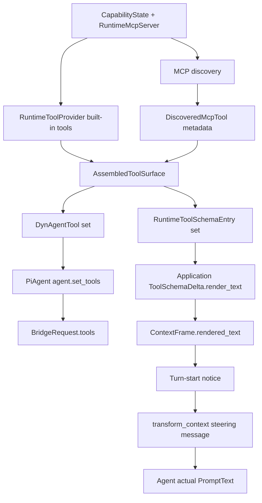

# PiAgent MCP ToolSchema 与 PromptText 能力上下文收束设计

## Scope

本设计只覆盖 PiAgent 主路径：

```text
RuntimeToolProvider / McpToolDiscovery
  -> session tool assembly
  -> executable DynAgentTool set
  -> ContextFrame ToolSchemaDelta PromptText
  -> turn-start notice
  -> HookRuntimeDelegate.transform_context
  -> Agent-visible messages
```

`BridgeRequest.tools` 保留为 provider bridge / tool execution 的结构化承载；平台上下文与能力审计以 application-owned ContextFrame PromptText 为标准可见路径。PiAgent 不拥有 ToolSchema 文本渲染职责。

## Current Built-in Tools Path

### Provider Composition

API bootstrap 构造 `SessionRuntimeToolComposer`，组合这些 runtime tool providers：

- `VfsRuntimeToolProvider`
- `WorkflowRuntimeToolProvider`
- `CollaborationRuntimeToolProvider`
- `TaskRuntimeToolProvider`
- `WorkspaceModuleRuntimeToolProvider`

### VFS Built-in Tools

`VfsRuntimeToolProvider` 调用 `VfsToolFactory::build_tools()`，根据 `CapabilityState` 生成：

- `mounts_list`
- `fs_read`
- `fs_glob`
- `fs_grep`
- `fs_apply_patch`
- `shell_exec`

这些工具先成为 `DynAgentTool` 执行实例，再由 `ToolDefinition::from_tool()` / `RuntimeToolSchemaEntry` 派生 schema 信息。

### Launch Assembly

```text
SessionRuntimeToolComposer.build_tools(context)
McpToolDiscovery.discover_tool_entries(...)
  -> assemble_tools_for_execution_context(...)
  -> context.turn.assembled_tools
```

PiAgent connector 当前继续执行：

```text
context.turn.assembled_tools
  -> agent.set_tools(...)
  -> AgentContext.tools
  -> BridgeRequest.tools
```

这条结构化路径负责 provider bridge 适配和工具调用执行。

PiAgent 在这条链路中的边界：

- 接收 application 准备好的 `assembled_tools`。
- replace-set 更新内部工具表。
- 将工具表交给 provider bridge / tool executor。
- 消费 application 通过 ContextFrame / transform_context 准备好的文本消息。

### Agent-visible PromptText Path

能力上下文热更走 application 文本路径：

```text
RuntimeContextUpdateFrame
  -> ToolSchemaDimensionDelta.render_text()
  -> ContextFrame.rendered_text
  -> enqueue_context_frames_for_transform_context(...)
  -> HookTurnStartNotice.content
  -> HookRuntimeDelegate.transform_context(...)
  -> AgentMessage::User steering message
```

这条路径是平台掌握 Agent 实际上下文与能力说明的标准路径。MCP 必须进入这条路径。

PiAgent 不在该路径中生成 PromptText；它只接收 transform 后的 messages。

## Current Boundary Mismatch

MCP discovery 当前返回 `DiscoveredMcpTool`：

```rust
runtime_name
server_name
tool_name
uses_relay
description
parameters_schema
tool
```

但 `assemble_tools_for_execution_context()` 只返回 `Vec<DynAgentTool>`。MCP provenance 在转成执行实例后丢失，后续 `ToolSchemaDimensionDelta` 只能从 `DynAgentTool -> ToolDefinition` 反推，并用 `platform_tool_descriptors()` 补 metadata。

这个策略能覆盖平台静态 catalog，但不能可靠覆盖 project MCP；结果是 MCP 执行实例可能已经进入 `agent.set_tools()`，但 Agent 可见 PromptText 里没有等价 ToolSchema 说明。

## Target Architecture

在 application tool assembly / context projection 边界引入 tool surface，使执行实例与 PromptText schema 同源生成。

建议模型：

```rust
pub struct AssembledRuntimeTool {
    pub tool: DynAgentTool,
    pub schema: RuntimeToolSchemaEntry,
}

pub struct AssembledToolSurface {
    pub tools: Vec<DynAgentTool>,
    pub schemas: Vec<RuntimeToolSchemaEntry>,
}
```

实现时可使用等价命名，但必须保持两个事实：

- `tools` 进入 `agent.set_tools()`，服务执行与 provider bridge。
- `schemas` 留在 application 层进入 `ToolSchemaDelta.render_text()`，服务 PromptText、ContextFrame、前端展示和 context usage projection。

## Metadata Contract

### Platform Built-in Tools

平台内嵌 tools 使用既有 `ToolDescriptor` 生成 metadata：

- `capability_key`: well-known capability key
- `source`: `platform:<cluster>`
- `tool_path`: `<capability>::<tool>`
- `context_usage_kind`: `system_tools`

### Platform MCP

平台 MCP 使用稳定 server namespace：

- `capability_key`: `workflow_management` / `story_management` / `relay_management`
- `source`: `platform_mcp:<scope>`
- `tool_path`: `<capability>::<tool>`
- `context_usage_kind`: `mcp_tools`

动态 server 后缀只服务 runtime routing，PromptText 使用稳定标识。

### Project MCP

Project MCP 使用 discovery metadata 直接生成 PromptText schema：

- `name`: MCP namespaced runtime tool name，例如 `mcp_code_analyzer_scan_repo`
- `description`: MCP tool description，缺省使用当前 MCP 工具默认描述
- `parameters_schema`: MCP discovery 返回的 sanitized schema
- `capability_key`: `mcp:<server_name>`
- `source`: `mcp:<server_name>`
- `tool_path`: `mcp:<server_name>::<tool_name>`
- `context_usage_kind`: `mcp_tools`

原因是 project MCP 的具体工具列表来自运行期 discovery，平台 catalog 不拥有这组事实。

## ContextFrame Contract

保留现有 `ToolSchemaDelta { added_tools }` section 作为统一结构化 section。

收束点：

- `ToolSchemaDelta.render_text()` 是 Agent 可见 PromptText 的权威工具定义文本，并由 application 层生成。
- 所有可见性变化统一使用 before / after schema key 差集输出新增 / 恢复 / 移除相关 schema。
- 初始能力注入使用 before=empty、after=current 的普通 delta；不引入单独 snapshot 语义。
- `McpServerDelta` 继续表达 server-level runtime surface 变化。
- `ToolSchemaDelta` 表达 Agent 可见 tool schema 文本变化。

schema key 推荐使用 `source + tool_path + name`，原因是 project MCP 和平台工具可能出现同名 runtime tool。

## Frontend Contract

前端保持 `McpServerDelta` 与 `ToolSchemaDelta` 两个 section：

- `MCP Servers`：server-level runtime surface 变化。
- `Tool Schema`：Agent 可见 PromptText 中的工具 schema 变化，包含平台内嵌工具、平台 MCP、project MCP。
- “Agent 实际原文” 展示 `ContextFrame.rendered_text`，其语义明确为 Agent 可见 PromptText。

## Data Flow



## Design Decisions

- 结构化 `BridgeRequest.tools` 保留，原因是 provider bridge 和 tool execution 仍需要机器可读 schema 与执行表。
- PromptText 由 application 生成，原因是平台需要全局掌握 Agent 实际上下文与能力说明，PiAgent 不应自行处理文本渲染。
- MCP discovery metadata 在 assembly 边界保留，原因是 project MCP 的工具事实只存在于 discovery 结果中。
- 前端不从 MCP server 名猜 tool schema，原因是 ToolSchema PromptText 必须由后端同一事实源派生。
- 初始能力注入与 runtime transition 共用同一个 delta producer，原因是“初始”只是从空集合到当前集合的普通可见性变化，单独建模会制造冗余分支。

## Architecture Anchor

```text
Application owns:
  Capability facts
  MCP provenance
  RuntimeToolSchemaEntry projection
  ToolSchemaDelta.render_text()
  ContextFrame rendering
  turn-start notice enqueue
  transform_context injection

PiAgent owns:
  executable tool table
  tool table refresh
  tool call execution
  approval/update handling
  provider bridge adaptation
```

收尾验收必须确认代码、测试与文档都遵守该锚点。

## Validation

- Rust unit tests 覆盖 built-in tools 与 project MCP schema 同源进入 assembly surface。
- Runtime transition tests 覆盖 project MCP schema 由 application delta producer 进入 `ContextFrame.rendered_text`。
- Initial capability tests 覆盖 before=empty、after=current 的普通 delta 路径。
- Connector tests 覆盖 PiAgent 不生成 ToolSchema PromptText，只消费 transform 后消息与工具表。
- Hook delegate tests 覆盖 `transform_context` 后的 steering message 包含 MCP ToolSchema PromptText。
- Frontend tests 覆盖 MCP server delta + ToolSchema delta 同卡展示，并验证 PromptText 展开内容包含 MCP 工具定义。
