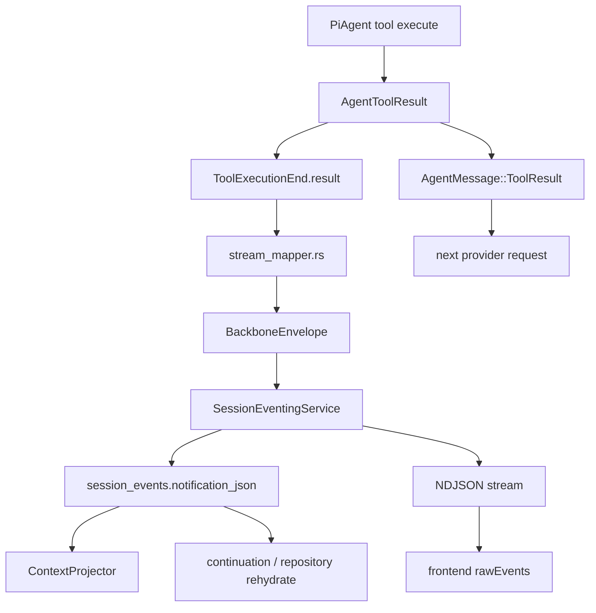
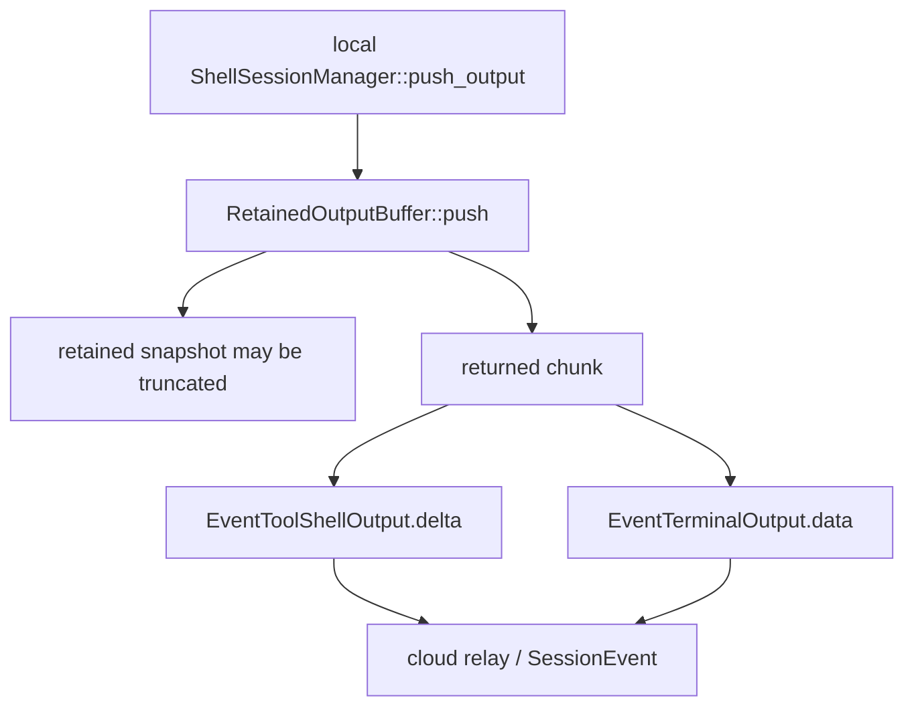
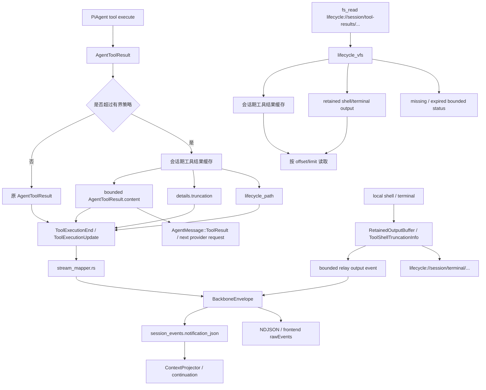

# PiAgent 工具结果有界化设计

## 设计目标

本任务的目标不是简单丢弃大工具返回，而是让 PiAgent 的会话事实流保持有界，同时保留一个可解释、可失效、可按需读取的大内容入口。

目标状态：

- `AgentToolResult` 进入模型上下文和事件流前先变成有界结果。
- `SessionEvent` / `BackboneEnvelope` 只保存模型实际看到的内容和小型裁切 metadata。
- 巨大原文进入会话期工具结果缓存，缓存允许随会话结束、TTL 或服务重启而失效。
- `shell_exec` / terminal 输出优先沿用本机侧 `RetainedOutputBuffer` / `ToolShellTruncationInfo` 语义。
- `lifecycle_vfs` 暴露 `session/tool-results` 与 `session/terminal` 读取入口。
- `fs_read` 仍是唯一面向模型的受控读取方式，继续使用 `offset/limit` 和 full-read 防御。
- ContextProjector / continuation / resume 不自动读取 lifecycle path，只恢复持久化的有界内容。

## 当前架构

当前 PiAgent 的工具结果主链路如下：



这条链路的问题是：只要 `AgentToolResult.content` 或 `details` 中出现巨大原文，模型上下文、Backbone、Postgres、NDJSON、前端和恢复投影都会被迫承载同一份大 payload。

`fs_read` 已有防御，但它是 reader 防御。当前缺口在 producer：

- 普通 PiAgent runtime tool / MCP tool 的 final `AgentToolResult`。
- `ToolExecutionUpdate.partial_result`。
- `shell_exec` final result。
- relay `EventToolShellOutput`。
- interactive terminal `EventTerminalOutput` / `PlatformEvent::TerminalOutput`。

terminal 路径还有一个具体绕过点：



`RetainedOutputBuffer` 保护的是 retained snapshot，不等于 live relay event 已经安全。

## 目标架构

目标架构保留“可读 ref”能力，但把它限定为会话期、可失效、受 `fs_read` 防御约束的 lifecycle 读取面。



关键点：

- `SessionEvent` 保存的是有界事实，不保存工具原文仓库。
- 会话期工具结果缓存是 runtime 辅助层，不是长期事实源。
- lifecycle path 是模型和 UI 后续读取大内容的地址，不代表该内容一定永久存在。
- ref miss / expired 是正常状态，返回有界说明。
- `fs_read` 不生产新的结果缓存；它只读取已有 lifecycle path。

## 数据形状

通用工具结果继续使用 `AgentToolResult`：

```json
{
  "content": [
    { "type": "text", "text": "bounded preview shown to model" }
  ],
  "is_error": false,
  "details": {
    "truncation": {
      "truncated": true,
      "original_bytes": 18422391,
      "inline_bytes": 65536,
      "omitted_bytes": 18356855,
      "policy": "head_tail"
    },
    "lifecycle_path": "lifecycle://session/tool-results/{item_id}/result.txt"
  }
}
```

`details.truncation` 是 MVP metadata 位置。它适合当前项目，因为：

- `AgentToolResult.details` 已经存在。
- `stream_mapper.rs`、continuation 和前端可以逐步消费，不需要第一阶段修改 Backbone 一等字段。
- 小型 metadata 能随 `SessionEvent` 持久化，resume 时不需要重新生成 preview。

`shell_exec` 沿用现有 details 风格：

- `type = "shell_exec"`
- `state`
- `exit_code`
- `session_id`
- `terminal_id`
- `next_seq`
- `truncated`
- `omitted_bytes`
- 可选 `lifecycle_path`

## lifecycle_vfs 读取面

新增或补齐的只读路径：

- `lifecycle://session/tool-results/{item_id}/metadata.json`
- `lifecycle://session/tool-results/{item_id}/result.txt`
- `lifecycle://session/terminal/{terminal_id}.metadata.json`
- `lifecycle://session/terminal/{terminal_id}.log`

约束：

- `metadata.json` 永远有界。
- `result.txt` / terminal log 只在实际内容仍可从会话期工具结果缓存或 retained shell/terminal 输出解析时可读。
- 读取大内容仍经 `fs_read`，因此 full read 继续受 256 KiB / 5000 行限制，分段读取使用 `offset/limit`。
- `session/tools` 保持扁平 item 列表，避免破坏现有 lifecycle session item 投影。
- lifecycle search 搜索 metadata / preview，不扫描完整 result body。

## SessionEvent 与上下文投影

Producer 侧有界化是主防线，因为它同时保护下一轮模型输入。`SessionEventingService` append 前的大小检查是兜底防线，用于捕获遗漏的 producer 路径。

投影与恢复规则：

- `ContextProjector` 使用持久化的 bounded `AgentToolResult`。
- continuation 从 bounded ThreadItem / SessionEvent 重建 tool result。
- repository rehydrate 不自动读取 lifecycle path。
- compaction summary 可以描述“输出已裁切，可通过 lifecycle_path 分段读取”，但不能把 result body 内联回上下文。

## 保留 Feature 与推迟事项

保留在本任务中的 feature：

- `AgentToolResult` final / update 有界化。
- `SessionEvent` bounded fact。
- 会话期工具结果缓存。
- `lifecycle_vfs` 下的 tool-results / terminal 读取入口。
- terminal live output 有界化。
- ref miss / expired 的有界状态。
- 上下文投影与会话恢复不自动读取 ref。

推迟到后续任务的事项：

- 长期 artifact 产品流程。
- 跨 Agent 通用协议。
- durable object store / 冷热分层。
- 前端完整输出浏览器。
- Backbone 一等 result-ref 字段。
- 云端数据库长期容量治理。

这些推迟项不是目标架构被否定，而是第一阶段没有必要用它们来解决当前的上下文和数据库防爆问题。
