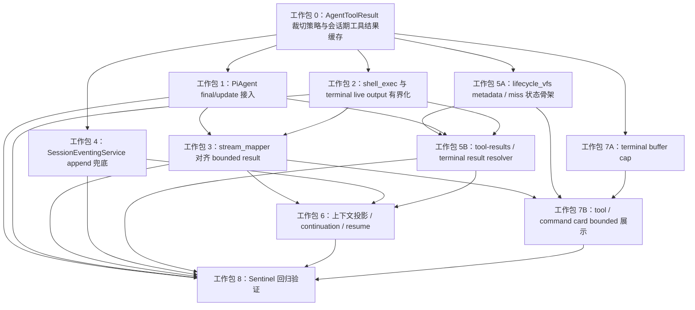

# PiAgent 工具结果有界化实施计划

## 目标

这份文档用于派发实现任务。第一阶段要完成的是现有链路防爆：PiAgent 模型上下文、`SessionEvent`、Postgres、NDJSON 和前端 stream 都不能再承载巨大工具/terminal 原文。

本计划保留 lifecycle ref 与会话期工具结果缓存能力；推迟长期 artifact、跨 Agent、完整输出 UI 和存储分层。

## 参考结论

Codex 值得借鉴：

- 在 process/tool collector 边界 cap 输出。
- live delta 也要 cap，不能只处理 final output。
- durable transcript 不保存高频 delta。
- resume 从 bounded persisted history 重建。

Claude Code 值得借鉴：

- 模型看到 preview/path，而不是完整大结果。
- Bash 输出由本机文件承载，通知只带状态和路径。
- resume 使用稳定 replacement 文本，避免 preview 漂移。

AgentDash 的取舍：

- `SessionEvent` 是跨后端事实流，因此只保存 bounded fact。
- 会话期工具结果缓存只服务当前 session / resume window，可失效。
- lifecycle path 是 VFS 读取入口，不是新的工具集。

## 命名规则

派发和实现使用项目已有边界命名：

- `AgentToolResult`
- `ToolExecutionEnd`
- `ToolExecutionUpdate`
- `AgentMessage::ToolResult`
- `BackboneEnvelope`
- `SessionEventingService`
- `ContextProjector`
- `continuation`
- `lifecycle_vfs`
- `fs_read`
- `shell_exec`
- `RetainedOutputBuffer`
- `ToolShellTruncationInfo`
- `CommandExecution.aggregated_output`
- `PlatformEvent::TerminalOutput`
- `details.truncation`
- `lifecycle_path`

新 helper 也按边界命名，例如 `AgentToolResult` truncation helper、`ToolShell` output bounding helper。

## 工作包 0：AgentToolResult 裁切策略与会话期工具结果缓存

目的：

提供一个最小公共能力：把 `AgentToolResult.content` 变成有界内容，把原始大文本放入会话期工具结果缓存，并在 `details.truncation` / `lifecycle_path` 中记录可恢复信息。

Ownership：

- `crates/agentdash-agent/src/agent_loop/tool_result.rs`
- `crates/agentdash-agent-types/src/runtime/tool.rs`，仅当 typed metadata 需要放到类型层。
- application/session 层新增会话期工具结果缓存服务。

入口：

- `AgentToolResult`
- `ContentPart::Text`
- `AgentMessage::tool_result_full`

实施：

1. 定义 final result 与 update result 的 inline byte cap。
2. 实现 UTF-8 安全 head/tail preview。
3. 生成 `details.truncation`：`truncated`、`original_bytes`、`inline_bytes`、`omitted_bytes`、`policy`。
4. 对超过 cap 的文本写入会话期工具结果缓存。
5. 为缓存条目生成 `lifecycle_path = lifecycle://session/tool-results/{item_id}/result.txt`。
6. 缓存 miss / expired 返回有界状态，不回退为原文。
7. 保留已有 `details` 字段，不覆盖 runtime trace、approval、shell details。

验收：

- 大文本 result 返回 valid UTF-8 preview。
- 原 sentinel 不出现在 bounded `content`。
- `is_error` 不改变。
- `details.truncation` 字段完整。
- 缓存可通过后续 lifecycle resolver 定位。

## 工作包 1：PiAgent final result / update result 接入

目的：

确保同一个 bounded `AgentToolResult` 进入模型上下文、AgentEvent 和 Backbone 映射。

Ownership：

- `crates/agentdash-agent/src/agent_loop/tool_call.rs`
- `crates/agentdash-agent/src/agent_loop/tool_result.rs`
- agent-loop focused tests

入口：

- `build_on_update`
- `execute_tool_calls`
- `finalize_executed_tool_call`
- `emit_tool_call_outcome`
- `emit_tool_result_message`
- `ToolCallPreparation::Immediate`
- `ApprovalResolution::Rejected`

实施：

1. 在 `finalize_executed_tool_call` 后、`emit_tool_call_outcome` 前裁切 final result。
2. `ToolCallPreparation::Immediate` 路径也经过同一裁切。
3. `ApprovalResolution::Rejected` 当前只走 `emit_tool_result_message`，需要补同一裁切。
4. `build_on_update` 在 `serde_json::to_value` 前裁切 partial result。
5. `ToolExecutionEnd.result` 与 `AgentMessage::ToolResult` 使用同一个 bounded result。
6. 保持 `tool_call_id`、provider `call_id`、tool name、args、`is_error` 不变。

验收：

- 大 final result 不进入 `ToolExecutionEnd`、`MessageEnd(ToolResult)`、下一轮 provider request。
- 大 partial result 不进入 `ToolExecutionUpdate.partial_result`。
- hook / runtime delegate 返回巨大替换内容时仍被裁切。
- approval rejected、invalid args、missing tool 路径仍返回错误语义。

## 工作包 2：shell_exec 与 relay terminal live output 有界化

目的：

修正 terminal live event 绕过 `RetainedOutputBuffer` 的问题。

Ownership：

- `crates/agentdash-local/src/shell_session_manager.rs`
- `crates/agentdash-relay/src/protocol/tool.rs`
- `crates/agentdash-relay/src/protocol.rs`
- `crates/agentdash-api/src/relay/ws_handler.rs`
- `crates/agentdash-application/src/vfs/tools/fs/shell.rs`

入口：

- `RetainedOutputBuffer::push`
- `ShellSessionManager::push_output`
- `RelayMessage::EventToolShellOutput`
- `RelayMessage::EventTerminalOutput`
- `ShellExecTool::execute`
- `shell_exec_result_text`
- `shell_exec_result_details`

实施：

1. `EventToolShellOutput.delta` 发送前有界化。
2. `EventTerminalOutput.data` 发送前有界化。
3. 沿用 `ToolShellTruncationInfo` 语义表达 `truncated` / `omitted_bytes`。
4. `shell_exec_result_text` 保持有界。
5. `shell_exec_result_details` 保留 `state`、`exit_code`、`session_id`、`terminal_id`、`next_seq`、`truncated`、`omitted_bytes`。
6. 如果 retained output 可读，生成 terminal lifecycle path。

验收：

- 单个超大 chunk 不进入 relay event / SessionEvent / NDJSON / rawEvents。
- 多个小 chunk 不线性放大 durable history。
- `CommandExecution.aggregated_output` 有界。
- interactive terminal 仍可实时显示，但 durable event 有界。

## 工作包 3：PiAgent stream_mapper 对齐 bounded result

目的：

让 Backbone ThreadItem 消费 bounded result，不重新放大内容。

Ownership：

- `crates/agentdash-executor/src/connectors/pi_agent/stream_mapper.rs`
- `crates/agentdash-executor/src/connectors/pi_agent/connector_tests.rs`

入口：

- `ToolExecutionEnd` branch
- `ToolExecutionUpdate` branch
- `decode_tool_result_to_content_items`
- shell `CommandExecution` mapping

实施：

1. DynamicToolCall / MCP / native tool content items 使用 bounded `AgentToolResult.content`。
2. shell `CommandExecution.aggregated_output` 使用 bounded output。
3. 尽可能保留 `details.truncation` 与 shell truncation details。
4. 更新“保留完整 update payload”的旧测试为 bounded 语义。
5. 第一阶段不强制新增 Backbone 一等字段。

验收：

- Dynamic / MCP / native final ThreadItem 不包含 sentinel。
- Shell final ThreadItem 保留 exit code / status / cwd。
- Update event 测试验证 bounded 内容。
- item id、entry_index、ordering 不变。

## 工作包 4：SessionEventingService append 兜底

目的：

保护 Postgres、NDJSON backlog 和前端 stream，防止遗漏 producer 路径。

Ownership：

- `crates/agentdash-application/src/session/eventing.rs`
- persistence tests，必要时触及 `crates/agentdash-infrastructure/src/persistence/postgres/session_repository.rs`

入口：

- `SessionEventingService::persist_notification_inner`
- `SessionEventStore::append_event`

实施：

1. append / broadcast 前测量 `BackboneEnvelope` 序列化大小。
2. 超 cap 时裁切已知 tool/terminal output 字段。
3. 保留 `turn_id`、`entry_index`、`tool_call_id`、update type 等索引信息。
4. 记录小型 diagnostic，说明 append 兜底介入。
5. 不把 DB schema rejection 作为唯一防线。

验收：

- synthetic oversized envelope 入库后低于 cap。
- sentinel 不进入 `notification_json`。
- 小事件语义不变。
- NDJSON backlog 返回 bounded event。

## 工作包 5：lifecycle_vfs tool-results / terminal 读取面

目的：

通过现有 `lifecycle_vfs` 暴露 tool result / terminal output 的受控读取入口。

Ownership：

- `crates/agentdash-application/src/vfs/provider_lifecycle.rs`
- `crates/agentdash-application/src/lifecycle/surface/journey/mod.rs`
- `crates/agentdash-application/src/lifecycle/surface/journey/session_items.rs`

入口：

- `LifecycleJourneyProjection::read_session_projection`
- lifecycle provider `session/*` read/list/search routes
- `session_item_projections`

实施：

1. 增加：
   - `session/tool-results/{item_id}/metadata.json`
   - `session/tool-results/{item_id}/result.txt`
   - `session/terminal/{terminal_id}.metadata.json`
   - `session/terminal/{terminal_id}.log`
2. `metadata.json` 从 bounded SessionEvent/details 生成。
3. `result.txt` 解析会话期工具结果缓存。
4. terminal log 解析 retained shell/terminal output。
5. 缺失或过期返回有界状态。
6. `fs_read` 继续负责 full-read 防御和 `offset/limit`。
7. `session/tools` 保持 flat list。
8. lifecycle search 搜 metadata/preview，不扫完整 body。

验收：

- metadata paths 可 list/read。
- result/log body 可按 `fs_read offset/limit` 读取。
- miss / expired 返回稳定有界状态。
- `session/events.json`、`session/items`、`session/tools`、`session/terminal` 不展开 sentinel。

## 工作包 6：上下文投影 / continuation / resume

目的：

确保恢复模型上下文时只使用 persisted bounded content。

Ownership：

- `crates/agentdash-application/src/session/context_projector.rs`
- `crates/agentdash-application/src/session/continuation.rs`
- `crates/agentdash-application/src/session/launch/planner.rs`
- `crates/agentdash-application/src/session/launch/preparation.rs`

入口：

- `ContextProjector::build_projected_transcript`
- continuation tool item extraction
- `RestoredSessionState.messages`

实施：

1. persisted bounded content 是 canonical transcript source。
2. 上下文投影、会话恢复和 compaction 不自动读取 lifecycle path。
3. resume 后 preview / lifecycle_path 文本保持稳定。
4. truncation metadata 可渲染成短说明，但不触发 result body 读取。

验收：

- 无 projection head 路径不含 sentinel。
- projection head + suffix 路径不含 sentinel。
- repository rehydrate 不含 sentinel。
- compaction 不内联 result body。

## 工作包 7：前端最小展示与 terminal buffer cap

目的：

前端展示 bounded output，并防止 terminal live buffer 无限增长。

Ownership：

- `packages/app-web/src/features/session/model/sessionStreamReducer.ts`
- `packages/app-web/src/features/session/model/useSessionFeed.ts`
- `packages/app-web/src/features/session/model/useTerminalStore.ts`
- `packages/app-web/src/features/session/model/sessionPlatformEventDispatcher.ts`
- `packages/app-web/src/features/session/ui/bodies/CommandExecutionCardBody.tsx`

入口：

- stream reducer item completion path
- `useTerminalStore.appendOutput`
- command execution card rendering

实施：

1. `rawEvents` 继续作为事实源，前提是后端已 bounded。
2. command/tool card 展示 bounded output 和 truncation 状态。
3. command status / exit code 保持可见。
4. terminal live buffer 加容量上限。
5. 完整输出展开 UI 留到后续任务。

验收：

- `rawEvents` 和 entries 不含 sentinel。
- command card 状态完整。
- terminal store cap 测试通过。
- 前端变更后 `pnpm run frontend:check` 通过。

## 工作包 8：Sentinel 回归验证

目的：

用唯一 sentinel 证明大输出不会穿透任何关键链路。

覆盖：

1. final `AgentToolResult`。
2. `ToolExecutionUpdate`。
3. `shell_exec` live output。
4. `shell_exec` final output。
5. interactive terminal durable event。
6. SessionEvent append / backlog。
7. lifecycle_vfs read。
8. ContextProjector / continuation / resume。

建议命令：

```powershell
cargo test -p agentdash-agent tool_result
cargo test -p agentdash-executor pi_agent
cargo test -p agentdash-application lifecycle
cargo test -p agentdash-infrastructure session_events
cargo test -p agentdash-local shell
pnpm run frontend:check
```

实现后按真实测试名收窄，不做无意义广泛测试。

## 并发派发有向图



## 派发波次

第一波只派发工作包 0。它必须先落下 `details.truncation`、`lifecycle_path` 和会话期工具结果缓存契约，否则后续工作包会各自发明 payload shape。

第二波可以并发：

- 工作包 1：PiAgent final/update 接入。
- 工作包 2：`shell_exec` 与 terminal live output 有界化。
- 工作包 4：`SessionEventingService` append 兜底。
- 工作包 5A：`lifecycle_vfs` metadata / miss 状态骨架。
- 工作包 7A：terminal live buffer cap。

第三波可以并发：

- 工作包 3：`stream_mapper` 对齐 bounded result。
- 工作包 5B：`tool-results` / terminal result resolver。
- 工作包 6：上下文投影、continuation、resume。
- 工作包 7B：tool / command card bounded 展示。

第四波派发工作包 8，做 sentinel 集成验证。工作包 8 可以提前准备测试骨架，但最终断言需要等前面 producer、event、lifecycle、projection、frontend 的形状稳定。

## 并发边界

- 工作包 1 和工作包 2 写集不同，可以并发。
- 工作包 4 是兜底层，可以和 producer 工作包并发，但不能替代 producer 裁切。
- 工作包 5A 可以先做 metadata/list/read/miss，不必等 `result.txt` resolver 完成。
- 工作包 7A 的 terminal buffer cap 不依赖 backend metadata shape，可以提前做。
- 工作包 3 需要等工作包 1/2 至少稳定 bounded result shape。
- 工作包 6 消费持久化后的 bounded event，必须等工作包 3/4/5B 的事件形状基本稳定。
- 工作包 8 最终通过必须最后确认。

## 开始实现前需要确认

- final result、update result、append safety 的具体 byte cap。
- `details.truncation` 是否作为第一阶段 metadata 位置。
- 会话期工具结果缓存的 TTL / 生命周期。
- `lifecycle_vfs result.txt` 是否必须第一阶段可读，还是先提供 metadata + miss 状态。
