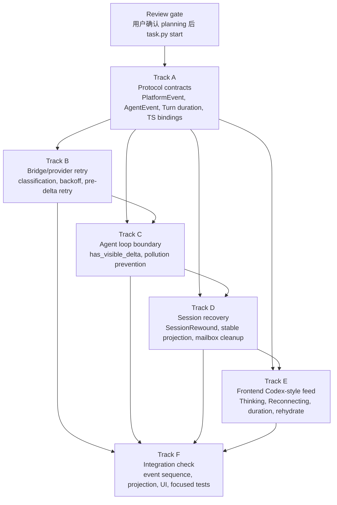

# Implementation Plan

## Phase 0: Planning Closure

- [x] 等待并审阅 subagent research：
  - `research/codex-turn-status.md`
  - `research/agentdash-stable-boundary.md`
  - `research/frontend-retry-feed.md`
- [x] 根据 research 更新 `design.md` 中的 pending assumptions。
- [ ] 用户评审并确认后再 `task.py start`。

## Parallel Execution Plan

本任务适合由主会话协调、多个 Trellis sub-agents 并行推进。并行单位按稳定接口和可独立验证的产物拆分，不按目录树隐式推断依赖。

Directed dependency graph:

| Track | Owner Role | Scope | Depends On | Deliverable | Verification |
| --- | --- | --- | --- | --- | --- |
| A. Protocol contracts | trellis-implement | 新增 `PlatformEvent::ProviderAttemptStatus`、`PlatformEvent::SessionRewound`、AgentEvent retry/status variants、Turn duration/TTFD 字段，生成 TS bindings。 | `design.md` event model | Rust protocol types + generated TS | protocol crate tests, TS compile |
| B. Bridge/provider retry | trellis-implement | BridgeError/provider classification、retry helper、OpenAI/Anthropic/Codex Responses bridge pre-delta retry、Retry-After/backoff/cancel-aware sleep。 | Track A enum names；可先用内部 draft types 并在 A 合并后对齐 | provider attempts emit classified status, no duplicate visible deltas | `cargo test -p agentdash-agent`, bridge/provider unit tests |
| C. Agent loop boundary | trellis-implement | `stream_assistant_response` 追踪 `has_visible_delta`，pre-delta retry 不写 assistant error，post-delta failure 进入 recovery path。 | Track A events；Track B classification | AgentEvent retry lifecycle, context pollution prevention | agent loop tests for before/after first delta |
| D. Session recovery | trellis-implement | stable-boundary projection、`SessionRewound` append、failed/lost/interrupted context exclusion、mailbox active/pause cleanup。 | Track A `SessionRewound`; Track C terminal/recovery signals | next AgentRun starts from clean context and composer can submit again | application/session tests |
| E. Frontend Codex-style feed | trellis-implement | `willRetry` neutral rendering、provider status system event、Thinking/Reconnecting UI、duration display、rewound full rehydrate。 | Track A generated TS bindings；Track D marker semantics | retry/reconnect not rendered as assistant/error pollution | app-web session tests |
| F. Integration check | trellis-check | 端到端检查事件序列、projection、frontend rendering、focused test command set。 | Tracks A-E integrated | checked implementation notes and fixes for spec drift | focused commands in Phase 6 |

Parallel ordering:

1. Track A starts first and should land early because every other track consumes event names and generated bindings.
2. Tracks B and D can begin immediately after A publishes draft type names; they touch mostly disjoint backend areas.
3. Track C starts once B exposes classification shape, but can develop visible-delta boundary tests in parallel.
4. Track E starts after A's TS bindings are generated and D's `SessionRewound` semantics are confirmed.
5. Track F runs after the first integration merge, then loops fixes back to the responsible track.

Sub-agent coordination rules:

- Each worker must state its owned files before editing and avoid reverting unrelated changes.
- Tracks that touch generated protocol bindings must coordinate through Track A; other tracks should not hand-edit generated TS.
- Cross-track dependency changes must be written back into `design.md` or this plan before implementation continues.
- Main session owns final integration, review gate updates, commit, and finish-work.

## Phase 1: Protocol And Event Contracts

- [ ] 在 agent/protocol 层定义 provider attempt status：
  - 新增一等 `PlatformEvent::ProviderAttemptStatus`。
  - 重新生成 TS bindings，前端 reducer 直接消费稳定类型。
- [ ] 定义 rollback/stable-boundary marker：
  - 新增一等 `PlatformEvent::SessionRewound`。
  - payload 包含 `discarded_turn_id`、`stable_event_seq`、`stable_turn_id`、`reason`、可选 replacement refs。
- [ ] 定义 AgentEvent retry/status variants：
  - provider connecting
  - provider connected waiting first delta
  - first visible delta / streaming
  - retry started
  - retry ended
  - retry exhausted / failed
- [ ] 扩展 `BridgeError` 或新增 provider error classification，包含：
  - retryable/fatal/aborted
  - HTTP status / provider code
  - retry_after_ms
  - safe_to_retry_before_visible_delta
- [ ] 补齐 Turn terminal duration payload：
  - `TurnExecution.started_at_ms`
  - terminal `completed_at_ms`
  - `duration_ms`
  - optional `time_to_first_delta_ms`
  - Codex `Turn.durationMs`
  - `turn_terminal` platform value 中的 duration diagnostics。

## Phase 2: Bridge / Provider Retry

- [ ] 抽出统一 retry helper：
  - max attempts 默认 3
  - exponential backoff
  - provider retry delay 优先
  - max server delay cap
  - cancel-aware sleep
- [ ] OpenAI Responses bridge 接入：
  - send failure
  - 429/5xx
  - transport error
  - empty stream before visible delta
- [ ] OpenAI Completions bridge 接入。
- [ ] Anthropic bridge 接入。
- [ ] OpenAI Codex Responses bridge 接入，保留 OAuth refresh / friendly error 语义。
- [ ] Provider stream 建立成功时发 connected/waiting first delta status。
- [ ] First visible delta 时记录 `time_to_first_delta_ms`，并发 streaming/succeeded 状态或本地更新 attempt state。

## Phase 3: Agent Loop Retry And Pollution Prevention

- [ ] 在 `stream_assistant_response` 内按 provider attempt 追踪 `has_visible_delta`。
- [ ] 首个 visible delta 前失败：
  - 发 retry status / `ErrorNotification(will_retry=true)`。
  - 不 emit assistant error message。
  - 不把暂态错误写入 `context.messages`。
  - sleep 后重新发起 provider request。
- [ ] 首个 visible delta 后失败：
  - 不 retry。
  - 进入 failed turn recovery path。
  - 不尝试继续拼接流。
- [ ] retry 成功：
  - 发 retry ended success。
  - prompt/run 等待整个 agent loop、工具调用、后续 turn settle。
- [ ] retry 耗尽：
  - 发 retry ended failure。
  - terminal failed，但模型上下文恢复到上一稳定边界。

## Phase 4: Session Stable Boundary And Recovery

- [ ] 明确 stable turn projection：
  - completed terminal 为 stable。
  - failed/lost/interrupted turn 的 provider-produced events 不进入下一次 model context。
- [ ] 修改 repository restore / continuation projection，使下一次 AgentRun 输入排除最后失败轮次。
- [ ] 修改 SessionMeta / projection refresh：
  - terminal failed/lost 后 workspace 状态回到可重新提交。
  - 保留 terminal diagnostic 供 UI 展示。
- [ ] 设计 rollback marker 或 stable-boundary marker：
  - 推荐追加事实，不物理删除 session_events。
  - 前端可据此刷新 snapshot 或修剪最后 turn display。
- [ ] repository restore / `ContextProjector` 读取 stable boundary：
  - completed terminal 为 stable。
  - failed/lost/interrupted + marker 后，排除 failed turn user/provider/tool/context events。
- [ ] AgentRun mailbox terminal policy：
  - terminal failed/lost/interrupted 写入恢复 marker 后，清理 active turn / runtime inflight 状态。
  - provider/runtime failure 诊断保留给 UI，但 composer / mailbox 恢复到可再次提交。
  - cancel/abort 不自动 retry，但下一次 provider request 不继承半截输出。
- [ ] 覆盖其它非连接问题导致会话炸掉的路径：
  - connector stream Err
  - join_handle Err
  - runtime delegate error
  - provider fatal error

## Phase 5: Frontend Codex-style UI

- [ ] `sessionStreamReducer` / `useSessionFeed` 消费 provider status：
  - waiting first delta -> Thinking/正在思考
  - retrying -> Reconnecting... attempt/max
  - retry exhausted -> system error event
- [ ] `systemEventPolicy` 将 provider retry/status 中需要展示的事件标记为 renderable system event。
- [ ] `ErrorNotification.willRetry=true` 不渲染为普通红色 error：
  - 可显示中性 retry strip/status。
  - feed boundary 为 neutral/soft，而不是 hard fatal error。
- [ ] turn segment 消费 `durationMs`，验证 completed/failed/interrupted 都能显示 elapsed。
- [ ] rollback/stable-boundary 后刷新 workspace snapshot 或修剪 rawEvents/display entries：
  - 第一版推荐 full rehydrate。
  - 后续可实现 reducer rewind + replay。
- [ ] 保持 assistant message 只来自模型输出，不混入 retry/reconnect 文案。

## Phase 6: Validation

- [ ] Rust unit tests：
  - retryable before first delta succeeds
  - retryable before first delta exhausts
  - error after visible delta does not retry
  - abort does not retry
  - fatal errors do not retry
  - failed turn excluded from next provider request
  - durationMs populated on terminal
- [ ] Executor connector tests：
  - stream mapper maps retry status to Backbone Error/platform event
  - `will_retry=true` intermediate error does not terminal turn
  - terminal failed includes duration diagnostics
- [ ] Application/session tests:
  - terminal failed clears active turn and allows next prompt
  - failed/lost/interrupted last turn is not restored into model context
  - NDJSON resume remains monotonic with rollback marker approach
  - mailbox pause/resume behavior matches provider retry/recovery policy
- [ ] Frontend tests:
  - retry status renders as system status, not assistant message
  - `durationMs` appears in turn segment
  - rollback/stable-boundary refresh removes failed partial turn display
  - `willRetry` error does not produce terminal failed UI.
- [ ] Focused commands:
  - `cargo test -p agentdash-agent`
  - `cargo test -p agentdash-executor pi_agent`
  - `cargo test -p agentdash-application session`
  - `pnpm --filter app-web test -- session`
  - `cargo run -p agentdash-agent-protocol --bin generate_backbone_protocol_ts` when protocol changes.

## Risky Files

- `crates/agentdash-agent/src/bridge.rs`
- `crates/agentdash-agent/src/agent_loop/streaming.rs`
- `crates/agentdash-agent/src/types.rs`
- `crates/agentdash-executor/src/connectors/pi_agent/stream_mapper.rs`
- `crates/agentdash-executor/src/connectors/pi_agent/bridges/*`
- `crates/agentdash-application/src/session/hub_support.rs`
- `crates/agentdash-application/src/session/continuation.rs`
- `crates/agentdash-application/src/session/eventing.rs`
- `packages/app-web/src/features/session/model/sessionStreamReducer.ts`
- `packages/app-web/src/features/session/model/useSessionFeed.ts`
- `packages/app-web/src/features/session/model/systemEventPolicy.ts`
- `packages/app-web/src/features/session/ui/SessionChatViewParts.tsx`

## Review Gate Before Start

- [ ] `design.md` references all subagent research outcomes.
- [ ] The user confirms append-only rollback marker + projection filter is acceptable instead of physical tail deletion.
- [ ] The user confirms the protocol direction: new first-class `PlatformEvent` variants for provider status and session rewind.
- [ ] Mailbox behavior after provider failure is settled: recovery marker restores the session to a state that can accept the next prompt.
- [ ] Test scope is accepted for this task size.
