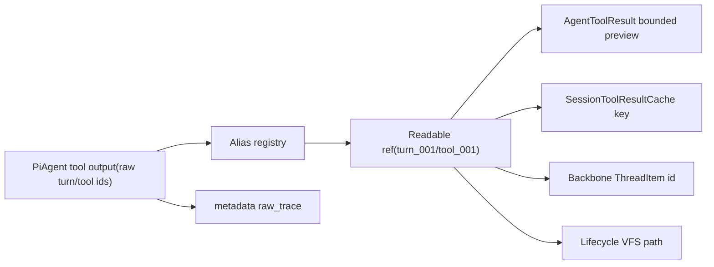

# PiAgent 可见 ID 统一降噪设计

## Design Principle

本任务不把长 ID 的问题交给 UI 折行解决。后端 producer 生成短 runtime address，Backbone、cache、VFS、continuation 和前端消费同一个短引用；raw id 只留在结构化 trace 中。这样模型上下文、session recall 和用户界面都天然安静。

## ID Classes

| 类别 | 作用 | 默认可见性 |
| --- | --- | --- |
| Readable alias | 用户、模型、ThreadItem、lifecycle path、VFS 文件面使用的短坐标 | 默认可见 |
| Raw trace | provider 对账、日志、事件索引、排查问题需要的原始 id | metadata / trace 可见 |

## Alias Model

| 对象 | alias | 示例 | raw 来源 |
| --- | --- | --- | --- |
| turn | `turn_ID` | `turn_001` | raw `turn_id` |
| tool result | `tool_ID` | `tool_001` | provider `tool_call_id` |
| command result | `cmd_ID` | `cmd_001` | shell/command tool call id |
| terminal | `term_ID` | `term_001` | raw `terminal_id` |
| message / reasoning / context | `msg_ID` / `reason_ID` / `ctx_ID` | `msg_001` | item id / lifecycle item id |

工具和命令是否区分 `tool_ID` / `cmd_ID` 由 ThreadItem 语义决定：`CommandExecution` 默认使用 `cmd_ID`，其它 dynamic/native tool result 使用 `tool_ID`。`ID` 使用三位起步的十进制序号，例如 `001`、`002`；超过 `999` 后自然扩展，不截断。

## Alias Registry Ownership

新增或扩展一个 session-scoped alias registry，归属于 session runtime composition，而不是 frontend。它需要被 PiAgent producer、stream mapper、tool result cache writer 和 lifecycle/journey surface 共享。

能力要求：

- 同一 session 内从 `turn_001`、`tool_001`、`cmd_001`、`term_001` 递增。
- 同一 raw id 重复解析时返回同一个 alias。
- 支持组合 ref：`ToolResultReadableRef { turn_alias, body_alias, item_id, lifecycle_path, raw_trace }`。
- 支持 raw trace metadata：raw turn id、raw tool call id、raw terminal id、provider/tool name、source event kind。
- 并发安全；PiAgent 工具可能并行产生 update/final。

## Tool Result Flow



### Path And ID Shape

Readable lifecycle path：

```text
lifecycle://session/tool-results/{turn_alias}/{body_alias}/result.txt
```

Readable VFS path：

```text
session/tool-results/{turn_alias}/{body_alias}/metadata.json
session/tool-results/{turn_alias}/{body_alias}/result.txt
```

ThreadItem id：

```text
{turn_alias}:{body_alias}
```

Cache key 推荐结构化为 `(session_id, item_id)`，其中 `item_id = "{turn_alias}:{body_alias}"`；VFS parser 负责把 path segments 转回同一个 item id，避免用字符串 split 在多处各自拼装。

### Metadata Shape

`SessionToolResultCacheMetadata` 或相邻 metadata DTO 需要表达：

- `session_id`
- `item_id`
- `turn_alias`
- `body_alias`
- `body_kind`：`tool_result` / `command_result`
- `lifecycle_path`
- `raw_turn_id`
- `raw_tool_call_id`
- `tool_name`
- `original_bytes`
- `stored_bytes`
- `created_at_ms`
- `expires_at_ms`

raw trace 字段用于诊断，不进入 bounded preview 主文本。

## Terminal Flow

Terminal visible ref 使用：

```text
lifecycle://session/terminal/{terminal_alias}.log
session/terminal/{terminal_alias}.metadata.json
```

terminal metadata 保留 raw `terminal_id`。journey surface 读取 terminal status 时，默认文本使用 `term_001` 风格 alias，raw id 放在 metadata JSON 字段中。

## Journey / Lifecycle Surface

需要同时修改两条读取面：

- `crates/agentdash-application/src/vfs/provider_lifecycle.rs`
- `crates/agentdash-application/src/lifecycle/surface/journey/{mod.rs,session_items.rs}`

`session/tool-results` 列表展示 `{turn_alias}` 目录，再进入 `{body_alias}`。`session/items` 和 `session/tools` 的文件名应使用 readable alias 或短 item id，内容中的 raw trace 只保留在结构化 JSON 字段。

## Continuation And Projection

projection/continuation 继续只消费 persisted bounded fact，不读取 full body。降噪后的 bounded text 本身已经带短 path，因此 continuation summary 直接继承短引用；如果 details 中包含 raw trace，渲染模型主上下文时过滤掉 raw trace 字段。

## Frontend Surface

前端遵守 generated / backend fact 作为来源：

- `boundedOutput.ts` 继续解析 `lifecycle_path`，测试改为短分段 path。
- `ToolOutputContentViewer.tsx` 与 `CommandExecutionCardBody.tsx` 默认展示短引用。
- 如需要查看 raw trace，应从 metadata/details 的结构化字段进入调试视图，不把 raw id 作为默认正文。
- `SessionMessageCard.tsx` 的换行处理可以保留为通用 UI 防护，但不是本任务的主要降噪机制。

## Spec Updates

实现完成后更新：

- `.trellis/spec/backend/session/pi-agent-streaming.md`
- `.trellis/spec/backend/session/context-compaction-projection.md`
- `.trellis/spec/cross-layer/backbone-protocol.md`

文档记录 readable alias 是用户/模型可见运行时地址的事实源；raw trace 留在 metadata，是为了保留诊断能力。
