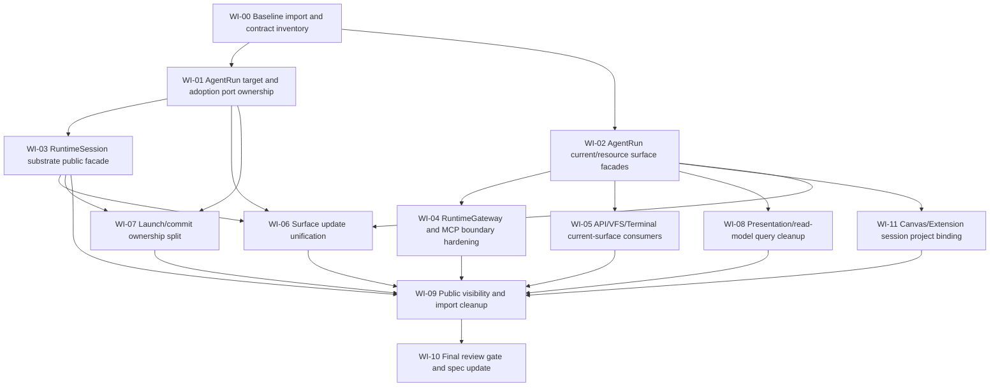

# 解耦并行 DAG

## Goal

把 AgentRun / RuntimeSession 解耦实施拆成可并行分发的工作项。每个 work item 都有独立追踪文档，后续实现 worker 只能领取一个明确 item 或一个无依赖冲突的 item set。

## Directed Graph

## Parallel Waves

| Wave | Items | Parallelism |
| --- | --- | --- |
| 0 | `WI-00` | Single baseline; must finish before production edits. |
| 1 | `WI-01`, `WI-02` | Parallel. One owns AgentRun target/adopter ownership, the other owns current/resource query facade DTOs. |
| 2 | `WI-03`, `WI-04`, `WI-05`, `WI-08`, `WI-11` | Parallel after dependencies. These touch different surfaces: RuntimeSession public facade, RuntimeGateway, API/VFS/Terminal route consumers, presentation read-models, Canvas/Extension Project binding guards. |
| 3 | `WI-06`, `WI-07` | Parallel only after `WI-01` and `WI-03`; coordinate around AgentFrame write/adoption semantics. |
| 4 | `WI-09` | Single integration cleanup after all migrations. |
| 5 | `WI-10` | Single final review gate. |

## Dispatch Rules

- Do not dispatch two workers to the same production file group unless their write sets are explicitly disjoint.
- `WI-01` owns AgentRun port/type ownership; other items must not create duplicate `AgentFrameRuntimeTarget` replacements.
- `WI-02` owns current/resource surface DTO shape; API and RuntimeGateway items consume its contract.
- `WI-04` must move gateway-facing AgentRun surface/MCP access contracts to `agentdash-application-ports`; this is inherited from the parent task and is not optional.
- `WI-11` owns Canvas/Extension Project/session binding guards so it can be dispatched independently from API/VFS/Terminal cleanup.
- `WI-09` is intentionally serial because it removes old imports and broad exports after all call sites are migrated.
- Every item must update its tracking doc before handoff: status, files touched, tests run, remaining blockers.

## Status Legend

- `pending`: not started.
- `ready`: dependencies completed and work can be dispatched.
- `in_progress`: assigned to worker.
- `blocked`: cannot proceed without upstream item or design decision.
- `review_ready`: implementation complete, awaiting final integration review.
- `done`: merged into task state and covered by gate checks.
