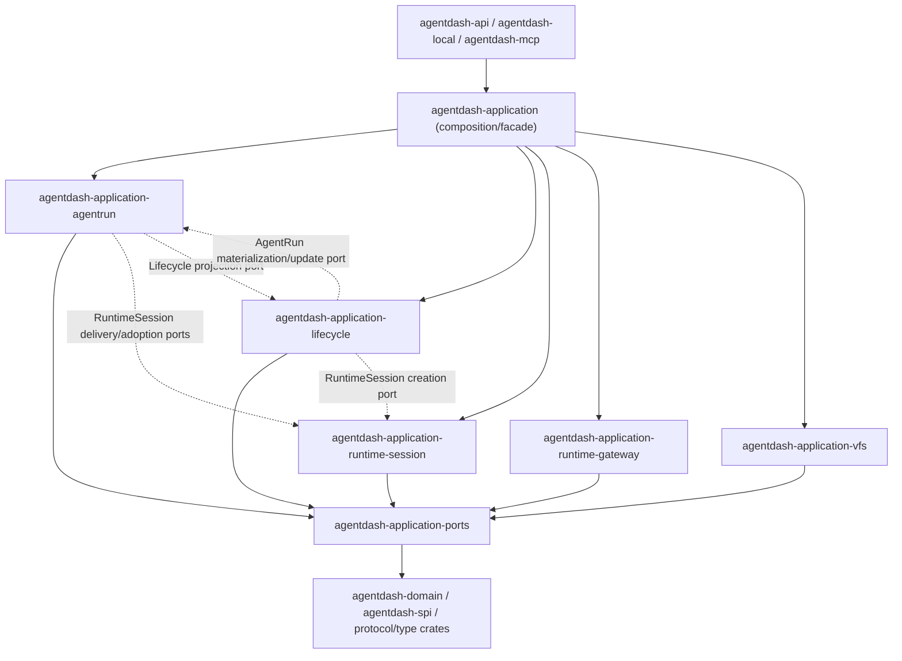

# Release application crate split 设计

## Position

当前任务已经从 crate split draft 升级为 `codex/release-crate-split-refactor` 分支的重构主轴。设计目标不是继续讨论是否拆分，而是把 application 内部边界改到可以被 Cargo crate graph 强制表达的状态。

核心判断：

- 物理 Cargo graph 是下一阶段的主要约束；继续在 monolithic module graph 里慢慢磨边界会延迟真正的拆分反馈。
- 后续先钉死 physical dependency contract，再 crates-first 物理移动，让 compiler 把剩余错误边暴露出来。
- 允许先创建目标 crates、搬文件并产生 compile errors，再按工作项修复；这个分支用于承载完整迁移。
- 高并发实现阶段以机械迁移为主：批量移动、批量替换、crate-level check 和 static grep gates 比逐点手工 import 更可靠。
- 波次收口由 check agents 执行，重点检查 forbidden Cargo edge、direct implementation import、重复 facade、错误链路、陈旧 test 锚定和 owner-assigned compile blockers。

物理依赖权威合同：

- `physical-dependency-contract.md`

该合同优先于临时 compile green。任何 repair 如果保留 forbidden edge，即使局部编译通过也不接受；任何红灯如果能归属到目标 crate owner 和 forbidden edge，可以作为 checkpoint 提交。

## Current Facts

### 已完成前置

- `AgentFrameRuntimeTarget` 已归 AgentRun。
- API current surface helper 已是 `agent_run_runtime_surface.rs`。
- RuntimeGateway MCP current-surface port 已在 `agentdash-application-ports`。
- RuntimeGateway MCP access 生产路径依赖 port，不依赖 AgentRun implementation。
- AgentRun current/resource surface query 已存在。
- Canvas / Extension runtime path Project guard 已部分落地。
- accepted launch 的 AgentFrame / Lifecycle writes 已进入 AgentRun launch commit adapter。

### 剩余硬边

| Edge | Cause | Boundary owner |
| --- | --- | --- |
| `session <-> agent_run` | RuntimeSession live hub/adoption/launch/mailbox/effective capability 仍直接串 AgentRun implementation | ports + RuntimeSession implementation adapter |
| `agent_run <-> lifecycle` | Runtime address / lifecycle projector / current frame resolver / AgentFrameBuilder / RuntimeSessionCreator 互相直连 | AgentRun surface ports + Lifecycle projection/materialization ports |
| `runtime_gateway -> mcp_preset/workspace` | setup actions 直接调 helper | `runtime_gateway_setup` ports |
| `api routes/helpers -> implementation DTO` | route/helper import AgentRun/VFS/session internals | AppState-owned facade handles + stable DTO |
| `vfs -> session/lifecycle/canvas` | generic VFS core 与 owner providers 混在一个 facade | VFS core late extraction + owner provider adapters |

## Target Graph



Dashed arrows are runtime wiring through ports; implementation crates remain independently movable because the connection is expressed as traits and DTOs.

Forbidden physical edges are listed in `physical-dependency-contract.md`; the most important ones are:

```text
runtime-session -> agentrun/lifecycle/application
agentrun -> lifecycle/runtime-session/application
lifecycle -> agentrun/runtime-session/application
runtime-gateway -> application/agentrun/lifecycle/runtime-session/vfs
vfs -> application/agentrun/lifecycle/runtime-session/runtime-gateway
ports -> any application implementation crate
```

## Crate Ownership

| Crate | Owns | Physical split rule |
| --- | --- | --- |
| `agentdash-application-ports` | pure DTO/trait/error for cross-application boundaries: AgentRun surface, RuntimeSession delivery/adoption, Lifecycle projection, RuntimeGateway setup, VFS runtime projection, launch envelope | Already active; every forbidden edge repair should prefer ports before adding implementation dependencies. |
| `agentdash-application-runtime-gateway` | action registry, actor/context admission, fixed session/setup providers, extension dynamic provider, tool adapter | Already extracted; must stay independent from monolithic application and other implementation owners. |
| `agentdash-application-runtime-session` | runtime session core/control/eventing/persistence, runtime registry/services, launch substrate after `FrameLaunchEnvelope`, turn processor/supervisor, continuation, terminal/tool result caches, lineage/projection | Move in Round 5A even if remaining frame close/capability-delta imports go red; repair through ports/composition in Round 5B. |
| `agentdash-application-agentrun` | current/resource surface, effective capability/admission, frame construction/update/launch commit, runtime surface update, mailbox/message delivery, workspace command/read model | Move in Round 5A; any direct Lifecycle/RuntimeSession implementation dependency becomes a repair blocker. |
| `agentdash-application-lifecycle` | dispatch/control ledger, subject association, orchestration activation/reducer/scheduler/materialization, terminal callback to reducer, lifecycle projection implementation | Move in Round 5A; AgentRun/RuntimeSession interaction must be ports or composition wiring. |
| `agentdash-application-vfs` | generic VFS core, path/types/provider/service/surface/summary/materialization/mutation/search/rewrite/fs tools | Move in Round 5A; owner providers and `VfsSurfaceResolver` stay outside. |

## Port Modules

| Port module | Purpose |
| --- | --- |
| `agent_run_surface` | `AgentRunRuntimeAddress`, current surface DTO/error/trait, resource surface DTO/error/trait, terminal/runtime placement DTOs. |
| `runtime_gateway_mcp_surface` | Existing reduced MCP current-surface DTO/trait for RuntimeGateway. |
| `runtime_session_delivery` | RuntimeSession creation request/result, delivery command refs, turn/message delivery traits. |
| `runtime_surface_adoption` | Active runtime adoption target/trait currently represented by AgentRun target + SessionHub adopter. |
| `frame_launch_envelope` | Launch-ready handoff traits/DTOs needed by RuntimeSession launch without depending on AgentRun implementation. |
| `lifecycle_surface_projection` | message stream ref, orchestration node evidence/projection, lifecycle mount projection trait. |
| `lifecycle_materialization` | Lifecycle dispatch/materialization facade used by AgentRun project-agent / workspace command surfaces. |
| `agent_frame_materialization` | AgentRun-owned frame construction/update boundary consumed by Lifecycle AgentCall materialization. |
| `runtime_gateway_setup` | MCP probe, workspace detect, detect-git, browse-directory, discover-by-identity backing traits. |
| `vfs_surface_runtime` | API/local implemented runtime projection facts consumed by VFS summary. |

## Reference Rules

### API / Local / MCP

- Route modules keep auth, DTO mapping, path parsing and error mapping.
- Bootstrap/AppState may instantiate concrete services and wire ports.
- Current/resource/runtime surface helpers consume AppState-owned facade handles.
- Presentation/debug read-models may expose trace/frame views, but they are separate from RuntimeGateway/current-surface DTOs.

### RuntimeGateway

- Gateway owns registry, action kind, actor/context validation, provider dispatch and action input/output validation.
- Session MCP providers consume `RuntimeSessionMcpAccess`; production access consumes `RuntimeGatewayMcpSurfaceQueryPort`.
- Setup providers consume `runtime_gateway_setup` backing ports.
- Extension providers consume Project installation / runtime transport ports and current surface admission results supplied by caller/facade.

### AgentRun

- Current surface query starts at `runtime_session_id`, follows `RuntimeSessionExecutionAnchor`, loads run/agent/current frame and returns closed DTO.
- DTOs carry both `launch_evidence_frame_id` and `current_surface_frame_id`; VFS/capability/MCP use current surface frame.
- Resource surface starts from current AgentFrame typed VFS and consumes Lifecycle projection through a port.
- Surface-changing modules submit typed update requests. AgentRun owns AgentFrame revision write, live adoption invocation and effective capability/admission.

### Lifecycle

- Lifecycle owns run/agent/control ledger, subject association, orchestration runtime, reducer and scheduler.
- Lifecycle creates or receives RuntimeSession delivery evidence through creation ports, then writes anchor and current delivery binding.
- AgentCall materialization consumes AgentRun frame materialization/update port instead of passing frame builder internals.
- Terminal callback resolves anchor/node coordinate and applies `OrchestrationRuntimeEvent` reducer.

### RuntimeSession

- RuntimeSession owns delivery/trace/turn/event stream/connector continuation/runtime registry/active turn/live sync.
- RuntimeSession implements delivery/adoption ports and consumes launch envelope/commit ports.
- Launch substrate consumes closed launch facts; frame construction and accepted launch control-plane writes are outside RuntimeSession implementation.

### VFS

- AgentRun resource surface is an AgentRun facade because it starts from current AgentFrame typed VFS and Lifecycle projection facts.
- Generic VFS core owns provider dispatch, path normalization, summary, materialization and mutation mechanics.
- Owner providers stay with their owner or adapters until dependency direction is clean.

## Parallel Lanes

| Lane | Work items | Parallel notes |
| --- | --- | --- |
| Manifest | `09-physical-crate-extraction-runtime`, `10-physical-crate-extraction-control-plane-vfs` | Single owner for workspace manifests and new crate skeletons. |
| Runtime | `04-runtime-session-substrate-boundary`, `09-physical-crate-extraction-runtime` | Move RuntimeSession first, then repair forbidden edges through ports. |
| VFS | `07-vfs-resource-surface-boundary`, `10-physical-crate-extraction-control-plane-vfs` | Move generic VFS core; owner providers stay outside. |
| Control Plane | `03-agentrun-surface-facade`, `05-agentrun-lifecycle-boundary`, `10-physical-crate-extraction-control-plane-vfs` | Move AgentRun/Lifecycle concurrently and repair mutual edges by ports/composition. |
| Facade/API | `06-api-consumer-facade-cleanup`, `08-public-visibility-cleanup` | Own `agentdash-application` facade and API/local/MCP bootstrap/import wiring. |
| Ports/Dead Paths | `01-ports-boundary-expansion`, `08-public-visibility-cleanup` | Add minimal missing contracts and delete obsolete path/test anchors. |

## Checkpoint Review Model

每个 wave 的 implement agents 只负责自己的文件所有权和最小 gate。主 session 在 checkpoint 派 check agents 做横向验证：

| Check agent | Timing | Focus |
| --- | --- | --- |
| `check-boundary-ports` | after Wave 1 | ports 是否保持纯 DTO/trait/error，是否引入 AppState、RepositorySet、builder、route DTO、concrete adapter。 |
| `check-import-graph` | after Wave 1 / Wave 2 | static rg gates；implementation imports 是否已转为 ports/facades。 |
| `check-dead-paths` | after every major import cleanup | 旧 helper、重复 facade、旧命名兼容壳、仅 test 锚定旧行为；给出删除/移动/port 化/保留 read-model 判定。 |
| `check-wave-readiness` | before Wave 3 and Wave 4 | 是否具备 RuntimeGateway/RuntimeSession 或 AgentRun/Lifecycle crate extraction 条件。 |
| `check-runtime-crates` | after Wave 3 | RuntimeGateway/RuntimeSession crates 是否仍依赖 monolithic application 或 implementation owners。 |
| `check-control-plane-crates` | after Wave 4 | AgentRun/Lifecycle 是否仍互相 implementation import。 |
| `check-final-contract` | final | cargo metadata、static gates、target crate checks、workspace check blockers。 |

## Extraction Waves

### Wave 0: Mainline Setup

- Branch created and bound to task.
- Work item files and manifests created.
- Current baseline commands captured.

### Wave 1: Ports Only

- Add named port modules.
- Keep implementations in existing crates.
- Use compile errors to expose DTO dependency shape early.

### Wave 2: Import Cleanup

- RuntimeGateway setup consumes ports.
- Lifecycle consumes RuntimeSession creation and AgentRun materialization ports.
- AgentRun consumes RuntimeSession delivery/adoption and Lifecycle projection ports.
- SessionHub/runtime builder consume launch/adoption/mailbox/effective-capability ports.
- API helpers consume facade handles.

### Historical Wave 3: Runtime Crate Extraction

- Extract RuntimeGateway.
- Extract RuntimeSession.
- Rewire API/local/MCP composition root.

### Historical Wave 4: Control Plane Extraction

- Extract AgentRun.
- Extract Lifecycle.
- Keep workflow runtime/reducer with Lifecycle unless a later design separates workflow definition/compiler.

### Historical Wave 5: VFS Core Extraction

- Extract generic VFS core after owner-specific providers are directional.
- Keep lifecycle/canvas/routine/skill providers with owners or adapter crates as needed.

### Round 5A: Crates-First Physical Split

- Create all remaining target crates.
- Move RuntimeSession, AgentRun, Lifecycle and VFS core files to target crates.
- Keep `agentdash-application` as composition/facade crate.
- Allow compile red after the checkpoint when failures are owner-assigned.

### Round 5B: Compiler-Driven Repair

- Fix forbidden physical edges by moving DTO/trait/error into ports.
- Move concrete adapter wiring to application/API composition roots.
- Delete stale compatibility shells and tests.
- Target crate checks are preferred over broad workspace tests.

### Round 5C: Integration And Contract Check

- Run dependency/static gates from `physical-dependency-contract.md`.
- Run target crate checks and then workspace check.
- Check agents classify remaining blockers by crate owner and forbidden edge.

## Static Gates

```powershell
cargo metadata --no-deps --format-version 1
rg -n "use crate::(mcp_preset|workspace)::" crates/agentdash-application/src/runtime_gateway -g '*.rs'
rg -n "crate::session::(plan|runtime_commands|types|hub|Session.*Service|LaunchCommand)" crates/agentdash-application/src/agent_run -g '*.rs'
rg -n "AgentFrameBuilder" crates/agentdash-application/src/lifecycle crates/agentdash-application/src/workflow/orchestration -g '*.rs'
rg -n "crate::lifecycle::.*AgentRunRuntimeAddress|crate::lifecycle::surface::surface_projector|resolve_current_frame_from_delivery_trace_ref" crates/agentdash-application/src/agent_run crates/agentdash-application/src/session -g '*.rs'
rg -n "AgentRunRuntimeSurfaceQuery::new|AgentRunRuntimeSurfaceQueryDeps|runtime_surface_query\\(" crates/agentdash-api/src -g '*.rs'
rg -n "agentdash_application::session::(construction|plan|types|hub)|agentdash_application::agent_run::frame|agentdash_application::vfs::ResolvedVfsSurfaceSource|agentdash_application::vfs::build_surface_summary" crates/agentdash-api/src crates/agentdash-local/src crates/agentdash-mcp/src -g '*.rs'
```

## Compile Gates

阶段提交可以红灯；每个 wave 的收敛点需要记录能跑到哪里：

```powershell
cargo check -p agentdash-application-ports
cargo check -p agentdash-application
cargo check -p agentdash-api
cargo check -p agentdash-local -p agentdash-mcp
cargo check --workspace
```

Targeted tests:

```powershell
cargo test -p agentdash-application runtime_gateway::mcp_access
cargo test -p agentdash-application runtime_gateway::session_actions
cargo test -p agentdash-application runtime_gateway::extension_actions
cargo test -p agentdash-application agent_run::runtime_surface
cargo test -p agentdash-application agent_run::runtime_surface_update
cargo test -p agentdash-application agent_run::permission_runtime_surface_update
cargo test -p agentdash-api agent_run_runtime_surface
```
