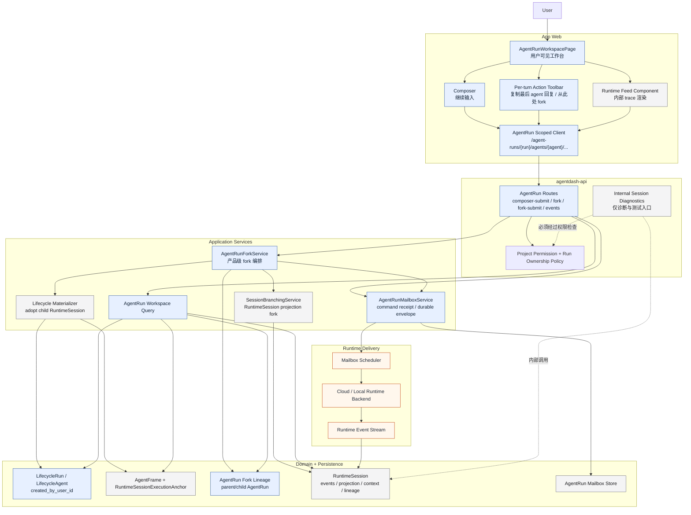

# AgentRun Fork And Session API Convergence Design

## Architecture Boundary

AgentRun 是用户可见控制面，RuntimeSession 是内部 runtime trace / projection / delivery target。

AgentRun fork 不是裸 `SessionBranchingService::fork_session` 的 HTTP 包装，而是一个 application use case：

1. 读取 parent AgentRun 当前 delivery RuntimeSession。
2. 基于 parent RuntimeSession 当前模型可见 head 创建 child RuntimeSession projection。
3. Materialize 新 AgentRun 控制面事实：LifecycleRun、LifecycleAgent、AgentFrame、RuntimeSessionExecutionAnchor、current delivery binding。
4. 写跨 Run fork lineage 和用户归属事实。
5. 将用户输入写入新 AgentRun mailbox，并由 scheduler 投递。

Session 模块继续拥有 context projection、compaction、runtime event stream、tool result cache、runtime control 等内部能力。对产品层可见的入口由 AgentRun API 承接。

Fork 有两种产品入口：

- 自动 fork submit：用户对自己没有 control ownership 的 AgentRun 继续输入时，系统保护父 Run，自动 fork 到新 AgentRun 后投递输入。
- 显式 fork from boundary：用户在任意可见 AgentRun，包括自己的 AgentRun 上，从某个稳定会话轮次创建探索分支。该入口可以不携带 initial input，创建后导航到新工作台等待用户继续输入。

## Current Fork Service Solidity Assessment

现有 `SessionBranchingService::fork_session` 足够作为 RuntimeSession projection fork primitive，但不够作为产品级 AgentRun fork service。

已经稳固的部分：

- 能解析 parent 当前模型可见 head、显式 message ref fork point 和 compaction fork point。
- 能拒绝超过当前 projection head 的 fork point。
- 能拒绝未完成 turn、assistant tool call 后但 tool result 前、以及未完整返回的 tool result 组。
- 能创建 child `SessionMeta`、写 `SessionLineageRecord`、提交 child 初始 model-context projection。
- Postgres `commit_compaction_projection` 自身在一个事务里追加 child fork event、写 compaction、segments 和 projection head。

仍不够稳固的部分：

- `fork_session` 的整体流程不是单一事务：child session 创建、lineage upsert 和 projection commit 分三段执行，失败时只做 best-effort delete child。由于 `session_lineage`、projection head 和 projection segments 都有 cascade / set-null 约束，这通常能清掉 child 侧事实，但它不是一个跨步骤的强一致提交边界。
- 当前 `/sessions/{id}/fork`、`/sessions/{id}/lineage`、`/sessions/{id}/projection/rollback` 没有先调用 `ensure_session_permission`，不适合作为用户可见 API surface。
- 裸 Session fork 不创建 `LifecycleRun`、`LifecycleAgent`、`AgentFrame`、`RuntimeSessionExecutionAnchor`、AgentRun mailbox envelope 或跨 Run fork lineage，因此 fork 后没有用户可见工作台和控制归属。
- RuntimePolicy 当前只能表达 `AttachExisting(Uuid)` / `ContinueCurrent(Uuid)`，不能直接 adopt `sess-*` runtime session id。
- 当前测试只覆盖基础 fork projection materialization 和 rollback head movement；还缺少 message boundary、tool-call boundary、compaction boundary、failure cleanup、route permission 和 AgentRun parent immutability 覆盖。

结论：产品实现应新增 `AgentRunForkService` 作为原子 use case owner；现有 `SessionBranchingService` 保留为内部 projection primitive，并由 AgentRunForkService 调用。

## Complete Target Scheme

### Core Decision

完整方案采用三层分工：

1. `AgentRunForkService` 是唯一产品级 fork use case owner，负责权限、幂等、用户归属、跨 Run lineage、AgentRun materialization、mailbox 和 API outcome。
2. `SessionBranchingService::fork_session` 只作为 RuntimeSession projection primitive，负责从 parent runtime trace 的稳定模型边界创建 child runtime trace。
3. `AgentRunMailboxService` 继续作为用户输入 durable delivery owner，fork submit 的 initial input 必须进入 child AgentRun mailbox，而不是直接写 runtime session。

### New Domain Facts

新增跨 Run fork lineage，不复用现有 `agent_lineages`：

```text
agent_run_lineages
- id uuid/text primary key
- parent_run_id
- parent_agent_id
- child_run_id
- child_agent_id
- relation_kind = "fork"
- fork_point_event_seq
- fork_point_ref_json
- parent_runtime_session_id
- child_runtime_session_id
- forked_by_user_id
- metadata_json
- created_at
```

原因：现有 `agent_lineages` 是同一 Run 内的 agent 控制树，repository 也是 `list_by_run(run_id)`。跨 Run fork 需要表达 parent run / child run 两端，不能把 child Run 的 agent 塞进 parent Run 的控制树。

`LifecycleRun` / `LifecycleAgent` 增加用户归属字段：

```text
lifecycle_runs.created_by_user_id text not null
lifecycle_agents.created_by_user_id text not null
```

`AgentRunCommandKind` 增加：

```text
agent_run_fork
agent_run_fork_submit
```

`AgentRunAcceptedRefs` 已能承载 child run / agent / frame / runtime session；fork receipt 的 `result_json` 需要额外存：

```json
{
  "outcome": "forked",
  "parent": {"run_id": "...", "agent_id": "...", "runtime_session_id": "..."},
  "child": {"run_id": "...", "agent_id": "...", "frame_id": "...", "runtime_session_id": "..."},
  "fork_point": {"event_seq": 123, "message_ref": {"turn_id": "...", "entry_index": 3}},
  "mailbox_message_id": "...",
  "redirect": {"run_id": "...", "agent_id": "..."}
}
```

### Materialization Boundary

新增 `AgentRunForkMaterializationPort`，由 infrastructure 用同一个 Postgres transaction 写入 child AgentRun 控制面事实：

```text
create lifecycle_runs child
create lifecycle_agents child
create agent_frames child initial frame
upsert runtime_session_execution_anchors child_runtime_session_id -> child run/agent/frame
create agent_run_lineages fork edge
set child current frame/delivery binding facts
```

RuntimeSession fork 仍先由 `SessionBranchingService` 提交，因为它拥有 projection 语义和 boundary 校验。随后 `AgentRunForkMaterializationPort` 在一个 transaction 内 adopt child RuntimeSession。若 materialization 失败，`AgentRunForkService` best-effort 删除 child RuntimeSession，并把 outer receipt 标成 terminal failed；若 cleanup 失败，receipt result/diagnostics 记录 orphan child runtime id，供内部诊断回收。

### Idempotency

fork use case 必须先 claim outer command receipt，再创建 child RuntimeSession：

```text
scope_kind = "agent_run_fork"
scope_key = "{current_user_id}:{parent_run_id}:{parent_agent_id}"
command_kind = agent_run_fork | agent_run_fork_submit
client_command_id = caller provided id
request_digest = current_user_id + parent refs + fork_point_ref/head + optional input + executor_config + backend_selection
```

重复请求：

- 如果 receipt accepted，直接从 accepted refs/result_json replay child refs、redirect 和 mailbox outcome。
- 如果 receipt terminal_failed，replay同一失败。
- 如果 receipt pending 且没有 accepted refs，返回 conflict / retryable in-progress，避免重复创建 child RuntimeSession。

### API Outcome

产品 API 使用 AgentRun scoped surface：

```text
POST /agent-runs/{run_id}/agents/{agent_id}/fork
POST /agent-runs/{run_id}/agents/{agent_id}/fork-submit
POST /agent-runs/{run_id}/agents/{agent_id}/composer-submit
```

`composer-submit` 的目标语义：

- 当前用户控制该 AgentRun：走现有 `AgentRunMailboxService.accept_user_message`，返回 `outcome = "accepted_current"`.
- 当前用户不控制该 AgentRun，但有 Project Use：走 `AgentRunForkService.fork_submit`，返回 `outcome = "forked"` 和 redirect child refs。
- 当前用户缺少 child creation permission：返回 forbidden，前端展示不可继续。

显式 fork API 不要求 initial input，成功后创建 child AgentRun 并导航过去，等待用户继续输入。

### Permission And Ownership

推荐初始策略：

- 读取 parent：Project `Use`
- 创建 child AgentRun / fork submit：Project `Use`
- 控制当前 AgentRun：`created_by_user_id == current_user.user_id` 或后续显式 control grant

这样可以保护 parent 不被非 owner 继续写，同时让所有项目成员都能参与对话。Project 配置和 Project 层资产修改由 `Configure` 单独控制，不和 AgentRun 使用权混在一起。

角色语义按两层解释：

| Role / Fact | Project capability | AgentRun capability |
| --- | --- | --- |
| Project Member | 可使用项目：查看 workspace/runtime trace、启动自己的 AgentRun、fork 可见 AgentRun；不可配置 Project 和 Project 层资产 | 对自己创建的 AgentRun 可原地继续；对别人创建的 AgentRun 继续输入时自动 fork 到自己名下 |
| Project Editor | 拥有 Member 能力，并可配置 Project / ProjectAgent / VFS / backend access / workflow / MCP preset / skill asset 等 Project 层资产 | 默认仍不静默改写别人 AgentRun；普通继续输入也走 fork |
| Project Owner | 拥有 Editor 能力，并可管理项目共享/成员 | 默认仍不静默改写别人 AgentRun；管理型 override 以后作为显式管理动作另设 |
| AgentRun Owner | `created_by_user_id == current_user.user_id` 的运行归属事实 | 可原地继续该 AgentRun；显式 fork 自己的 AgentRun 作为探索分支 |

Project Owner 不等于 AgentRun Owner。Project Owner 管的是项目协作和配置边界；AgentRun Owner 管的是某条会话/运行的继续写入权。这样 parent Run 的历史不会因为项目管理员或编辑者继续输入而被意外改写。

Project role / permission 应收敛为：

```text
ProjectRole: member | editor | owner
ProjectPermission: Use | Configure | ManageSharing
```

`Use` 是项目成员默认能力，包含查看项目、读取 AgentRun/runtime trace、启动自己的 AgentRun、fork 可见 AgentRun、继续自己的 AgentRun。`Configure` 才用于修改 Project 配置和 Project 层资产。当前 `viewer` 数据和文案应迁移为 `member`；当前 `Edit` 检查需要按 endpoint 审计，运行类 endpoint 迁到 `Use`，资产配置类 endpoint 保持 `Configure`。

### Runtime Surface And Session API Convergence

AgentRun scoped runtime endpoints 内部通过 current delivery anchor 解析 RuntimeSession：

```text
GET /agent-runs/{run_id}/agents/{agent_id}/runtime/events
GET /agent-runs/{run_id}/agents/{agent_id}/runtime/stream/ndjson
GET /agent-runs/{run_id}/agents/{agent_id}/runtime/context/projection
GET /agent-runs/{run_id}/agents/{agent_id}/runtime/context/audit
GET /agent-runs/{run_id}/agents/{agent_id}/runtime/control
POST /agent-runs/{run_id}/agents/{agent_id}/runtime/tool-approvals/{tool_call_id}/approve
POST /agent-runs/{run_id}/agents/{agent_id}/runtime/tool-approvals/{tool_call_id}/reject
```

`/sessions/*` 保留为内部 diagnostics 时，必须先通过 `RuntimeSessionExecutionAnchor` 做 Project 权限检查；产品前端不再直接调用。

### Frontend Interaction Contract

AgentRun workspace 获取 runtime feed 时只持有 AgentRun refs；session id 可以作为内部 trace ref 出现在 DTO 中，但不是路由或用户操作对象。

每个稳定大轮下方生成 `RoundActionModel`：

```ts
type RoundActionModel = {
  copyLastAgentReply: {
    text: string;
    enabled: boolean;
  };
  forkFromHere: {
    forkPointRef: { turn_id: string; entry_index: number };
    enabled: boolean;
    disabledReason?: string;
  };
};
```

复制按钮只复制当前大轮最后一小轮 agent 回复。fork 按钮传 `forkPointRef`，前端的 disabled state 只做体验优化，后端 `SessionBranchingService` 仍是权威校验者。

### Recovery And Diagnostics

fork service 记录阶段性 diagnostics：

```text
receipt claimed
runtime child forked
child AgentRun materialized
lineage written
initial mailbox accepted
schedule attempted
```

正常成功以 receipt accepted + accepted refs 为准。失败分三类：

- before runtime fork：无副作用，terminal failed。
- after runtime fork before materialization：best-effort delete child runtime；失败则记录 orphan runtime id。
- after materialization before mailbox：child AgentRun 已可导航，若是 explicit fork 可视为 accepted；若是 fork-submit initial input 失败，则 terminal failed 或 accepted-with-mailbox-failed 需由 API outcome 明确区分。推荐 explicit fork 与 fork-submit 拆 endpoint，降低这个歧义。

## Expected Architecture Diagram



## Data Model

### User Ownership

新增一等用户归属字段，建议最小集：

- `lifecycle_runs.created_by_user_id text`
- `lifecycle_agents.created_by_user_id text`

跨 Run fork lineage 补充：

- `agent_run_lineages.relation_kind = "fork"`
- `agent_run_lineages.parent_run_id`
- `agent_run_lineages.parent_agent_id`
- `agent_run_lineages.child_run_id`
- `agent_run_lineages.child_agent_id`
- `agent_run_lineages.parent_runtime_session_id`
- `agent_run_lineages.child_runtime_session_id`
- `agent_run_lineages.fork_point_event_seq`
- `agent_run_lineages.forked_by_user_id`
- `agent_run_lineages.fork_point_ref_json`

原因：Run 级 owner 支撑“我的工作台”列表和默认 fork 判断，Agent 级 owner 支撑未来同 Run 多 Agent 或 child agent ownership。跨 Run lineage 记录产品 provenance，Session lineage 保留 runtime projection 级 provenance。

### Runtime Session Adoption

现有 `RuntimePolicy::AttachExisting(Uuid)` 不能表达 `sess-*` 字符串 id。实现时需要选择一种收束方式：

- 推荐：新增 `RuntimePolicy::AdoptExistingRuntimeSession { session_id: String }`，并让 lifecycle materializer 写 anchor/current delivery。
- 备选：让 RuntimeSessionCreationPort 支持 caller-provided id，由 AgentRun fork service 先拿 AgentRun refs，再创建/fork runtime session。

推荐方案更贴合当前能力：SessionBranchingService 已能创建 child projection，AgentRun fork service 随后 adopt 这个 runtime trace。

## API Shape

### AgentRun Product API

新增或扩展 AgentRun scoped command：

```text
POST /agent-runs/{run_id}/agents/{agent_id}/fork
POST /agent-runs/{run_id}/agents/{agent_id}/fork-submit
```

或在现有：

```text
POST /agent-runs/{run_id}/agents/{agent_id}/composer-submit
```

中根据 command kind / ownership 自动分派。

响应需要包含：

- command receipt
- outcome
- parent AgentRun ref
- effective AgentRun ref
- redirect target when a new fork was created
- initial mailbox result for forked AgentRun
- fork point ref / event seq for UI confirmation and lineage display

### Session Internal Surface

`/sessions/*` 不再作为前端产品服务层入口。需要保留的 runtime feed/projection 能力迁移到 AgentRun scoped endpoint，例如：

```text
GET /agent-runs/{run_id}/agents/{agent_id}/events
GET /agent-runs/{run_id}/agents/{agent_id}/context/projection
GET /agent-runs/{run_id}/agents/{agent_id}/lineage
POST /agent-runs/{run_id}/agents/{agent_id}/tool-approvals/{tool_call_id}/approve
POST /agent-runs/{run_id}/agents/{agent_id}/tool-approvals/{tool_call_id}/reject
```

这些 AgentRun endpoints 内部解析 current delivery RuntimeSession，再调用 session service。这样前端不需要持有或拼接 Session product URL。

## Command Flow

### Existing Owner Submit

```text
composer-submit
-> resolve AgentRun context
-> check Project Use
-> check ownership/control
-> current user controls Run
-> existing AgentRunMailboxService.accept_user_message
```

### Fork Submit

```text
composer-submit or fork-submit
-> resolve parent AgentRun context
-> check Project Use
-> claim outer agent_run_fork_submit command receipt
-> resolve parent current delivery RuntimeSession
-> SessionBranchingService.fork_session(parent runtime session)
-> AgentRunForkMaterializationPort adopts child RuntimeSession into new LifecycleRun/LifecycleAgent/AgentFrame in one transaction
-> write AgentRun fork lineage in the same materialization transaction
-> write owner fields
-> create mailbox envelope on child AgentRun
-> schedule child mailbox
-> mark outer receipt accepted with child refs/result_json
-> return redirect/effective refs
```

### Explicit Fork From Boundary

```text
fork action on completed turn/message
-> frontend sends fork_point_ref from runtime feed projection
-> resolve parent AgentRun context
-> check Project Use
-> claim outer agent_run_fork command receipt
-> SessionBranchingService validates boundary and creates child RuntimeSession projection
-> AgentRunForkMaterializationPort adopts child RuntimeSession into new AgentRun owned by current user
-> write AgentRun fork lineage
-> no mailbox message unless caller supplied initial input
-> mark outer receipt accepted with child refs/result_json
-> return child AgentRun refs and navigate
```

## Permission Model

Initial implementation should split Project participation from Project configuration:

- Parent visibility and runtime trace read: Project `Use`
- AgentRun start / fork / fork-submit / continue own Run: Project `Use`
- Project / ProjectAgent / VFS / backend access / workflow / MCP preset / skill asset configuration: Project `Configure`
- Sharing / membership management: Project `ManageSharing`

The implementation should keep the permission check centralized so policy can later split `Use` into finer capabilities without changing route behavior.

Session internal routes, if retained, must resolve `RuntimeSessionExecutionAnchor` and apply Project permission before returning trace facts.

## Frontend Model

`SessionChatView` may remain an internal reusable trace/feed component, but product composition is `AgentRunWorkspacePage`.

Frontend work:

- Command state exposes fork submit availability / reason.
- Runtime feed renders a compact per-turn action toolbar after stable user/assistant rounds. Toolbar includes copy and fork actions, uses icon buttons with tooltips, and stays low-noise until hover/focus.
- Copy action builds a readable text payload from the last agent reply message within the current conversation round and writes it to clipboard.
- Fork action uses the round's stable `MessageRef` / turn boundary and calls AgentRun scoped fork API. It is disabled for streaming, active, or incomplete tool-call boundaries.
- Submit handler accepts response redirect target and navigates to new AgentRun.
- `services/session.ts` direct calls move behind AgentRun scoped services.
- User-facing labels use AgentRun, trace, runtime, context projection, or execution log instead of Session.

## Migration Notes

This is pre-release work. Database migrations should move the schema to the desired model directly and backfill existing rows with a deterministic value such as existing creator context or `"system"` when no user fact exists.

No long-term compatibility route should be preserved for product Session APIs. Internal test/debug routes can remain only when named and documented as internal diagnostics.

## Risks

- Orphan child RuntimeSession if fork projection succeeds but AgentRun adoption fails. Mitigation: implement one application service with clear pending/cleanup behavior and diagnostics.
- Cross-run fork represented as same-run AgentLineage. Mitigation: add AgentRun fork lineage instead of reusing `agent_lineages`.
- Duplicate forked Run on retry. Mitigation: command receipt digest includes parent refs, fork point, input, executor/backend selection and current user.
- Ambiguous copy action. Mitigation: default to the last agent reply in the current round and name that scope in the tooltip; add a separate later command if prefix/handoff copy is needed.
- Accidental parent mailbox mutation. Mitigation: tests assert parent mailbox/events unchanged after fork submit.
- Permission leakage through Session routes. Mitigation: session route audit and permission tests.
