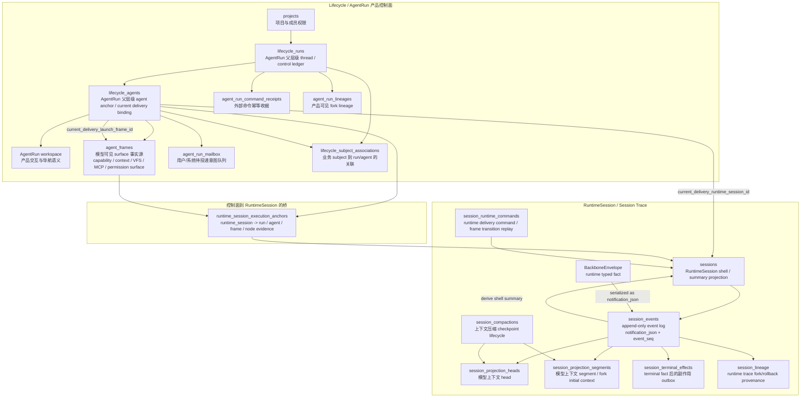
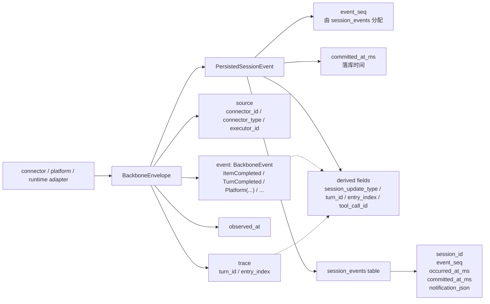
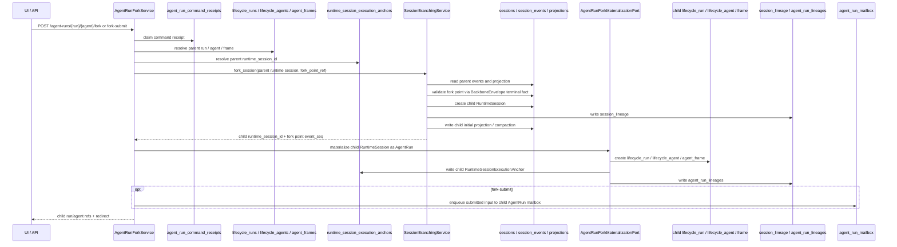
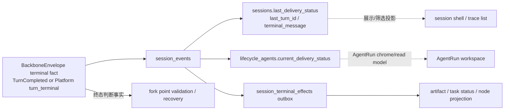

# AgentRun 与 RuntimeSession 仓储关系收口

## Goal

收束 Lifecycle/AgentRun 产品控制面、RuntimeSession 运行时事件面、BackboneEnvelope 事件事实、投影/read model 与跨层 anchor 的仓储边界，让后续 fork、消息投递、权限、恢复、诊断和前端展示都能明确回答：

- 哪一层是事实源。
- 哪一层只是索引、投影或缓存。
- 哪些重复是合理的工程投影。
- 哪些重复会形成第二事实源，需要清理或加边界校验。

本任务当前处于规划阶段。先沉淀 PRD，不直接进入实现；进入实现前需要补 `design.md` 和 `implement.md`。

## Background

当前讨论暴露出几个容易混淆的模型：

- 用户交互目标是 AgentRun workspace，而不是裸 RuntimeSession。
- RuntimeSession 是 runtime trace substrate，负责 turn/tool/event/projection/terminal effect/debug provenance。
- `LifecycleRun` / `LifecycleAgent` 是 AgentRun 的标准父层级与控制面父模型，不是历史命名偏差。AgentRun workspace 是挂在 Lifecycle Agent 上的产品交互语义。
- Lifecycle/AgentRun 控制面负责产品归属、权限、导航、命令幂等、mailbox、AgentFrame surface 和产品可见 lineage。
- `BackboneEnvelope` 是 RuntimeSession 事件的 typed fact 本体。
- `session_events` 是 append-only event log，只负责把 envelope 放入某个 RuntimeSession 的有序日志中。
- `PersistedSessionEvent` 是 envelope 落库后的视图：event log 坐标 + envelope + 从 envelope 派生的传输字段。
- `sessions.last_*`、`lifecycle_agents.current_delivery_*` 等字段是 shell/read model 投影，不能反向成为 terminal truth 或业务归属事实。
- `AgentFrame` row / adoption 与 effective surface transition 是两层语义：fork child 可以拥有 child-scoped frame copy；模型可见 context update 由 effective surface 变化驱动。

近期已经完成一处关键收口：`session_events` 持久化不再保存 `session_update_type / turn_id / entry_index / tool_call_id` flatten 列，repository 从 `notification_json` 中的 `BackboneEnvelope` 派生这些传输视图字段。

## Repository Map



## Event Fact Model



目标语义：

- `BackboneEnvelope` 表达 runtime typed fact。
- `session_events` 表达 durable ordering 和 event log partition。
- `PersistedSessionEvent` 表达 repository/API/NDJSON 使用的读模型。
- `session_update_type / turn_id / entry_index / tool_call_id` 是派生字段，不落成 durable event fact。
- terminal 判断必须读 typed envelope terminal fact，例如 `BackboneEvent::TurnCompleted` 或 platform `turn_terminal`。

## AgentRun Fork Flow



边界要求：

- `SessionBranchingService` 只负责 runtime projection fork。
- `SessionBranchingService` 不创建 `LifecycleRun`、`LifecycleAgent`、`AgentFrame`、mailbox message 或产品 lineage。
- `AgentRunForkService` / materialization port 才负责把 child RuntimeSession 变成产品可见 child AgentRun。
- `fork-submit` 的输入写入 child AgentRun mailbox，parent AgentRun mailbox 和 parent RuntimeSession event stream 保持不变。

## State And Projection Layers



目标语义：

- terminal fact 来自 terminal envelope。
- `sessions.last_delivery_status` 是 RuntimeSession shell/read model。
- `lifecycle_agents.current_delivery_status` 是 AgentRun workspace chrome/read model。
- terminal effect outbox 消费 terminal fact 后执行业务副作用，副作用失败不回滚 terminal event。

## Confirmed Duplicates And Boundary Decisions

| 关系 | 当前判断 | 收口要求 |
| --- | --- | --- |
| `session_events.notification_json` 与 `BackboneEnvelope` | 合理：JSON 是 envelope 的持久化形式 | 保持 envelope 为 runtime event fact 本体 |
| `session_events.session_id` 与 `BackboneEnvelope.session_id` | 可接受重复：表主键/partition 需要外层 `session_id` | append 边界校验二者一致 |
| `session_events.event_seq` 与 envelope | 不重复：event log 分配 durable ordering | 继续由 `session_events` 分配 |
| DB flatten 列与 envelope 中的 trace/type | 危险重复 | 已删除 durable flatten 列；后续保持派生视图 |
| `BackboneEnvelope.trace.turn_id` 与 payload 内 `turn.id/thread_id` | 可接受但危险：兼容 Codex payload 产生重复坐标 | 在 builder/append 边界集中校验一致性 |
| `sessions.last_delivery_status` 与 terminal envelope | 合理投影但容易误用 | shell/read model 只能展示/筛选，业务 terminal 判断回 envelope |
| `lifecycle_agents.current_delivery_*` 与 `RuntimeSessionExecutionAnchor` | 有重叠但职责不同 | current delivery 是当前指针；anchor 是 durable evidence 索引 |
| `session_lineage` 与 `agent_run_lineages` | 合理双层 lineage | runtime provenance 和产品 lineage 分层保留 |
| `agent_run_mailbox` 与 `UserInputSubmitted` event | 合理双层事实 | mailbox 是 intent；session event 是 runtime accepted fact |
| `AgentFrame` 与 RuntimeSession capability/cache | 合理投影 | AgentFrame 是 surface 事实源；RuntimeSession 只缓存执行期投影 |
| parent / child `AgentFrame` 内容等价 copy | 合理控制面投影 | fork child initial frame 表达 inherited baseline；ContextFrame emission 由 effective surface transition 驱动 |
| raw `/sessions/*` API 与 `/agent-runs/*` API | 产品入口重复风险 | raw session API 限定为内部诊断/trace；产品交互走 AgentRun scoped API |
| `LifecycleRun/LifecycleAgent` 与 AgentRun 产品语义 | 父子层级关系，不是命名错位 | Lifecycle 是 AgentRun 的标准父层级；AgentRun 产品交互挂在 Lifecycle Agent 上 |

## Requirements

### R1. 明确事实源分层

梳理并落实以下规则：

- Runtime event fact：`BackboneEnvelope.event` typed payload + envelope trace。
- Event ordering：`session_events.event_seq`。
- Model-visible context：`session_projection_heads` + `session_projection_segments`。
- Runtime terminal truth：terminal `BackboneEnvelope`。
- Product ownership / permission / navigation：Lifecycle control-plane parent repositories 与挂载其上的 AgentRun repositories。
- Runtime trace 到产品控制面的反查：`RuntimeSessionExecutionAnchor`。

### R2. 收束危险重复

需要评估并处理会产生第二事实源的重复：

- DB flatten event fields 重新出现的风险。
- `sessions.last_delivery_status` 被业务校验当 terminal truth 使用的风险。
- `lifecycle_agents.current_delivery_*` 与 anchor 边界不清的风险。
- envelope trace 与 payload 内 turn/thread 坐标漂移的风险。
- raw session API 被产品交互路径误用的风险。

### R3. 保留合理投影

以下重复属于合理工程投影，但必须有清晰消费边界：

- `sessions.last_*` 服务 session shell / trace list。
- `lifecycle_agents.current_delivery_*` 服务 AgentRun workspace current delivery chrome。
- `PersistedSessionEvent` 派生字段服务 API/NDJSON/frontend reducer/transcript restore。
- `session_lineage` 服务 runtime provenance。
- `agent_run_lineages` 服务产品可见 fork tree。
- `agent_run_mailbox` 表达未投递或待调度意图。
- `UserInputSubmitted` 表达 runtime accepted input fact。

### R4. 收束产品入口

AgentRun 产品交互必须以 AgentRun scoped endpoint 为入口，例如：

```text
/agent-runs/{run_id}/agents/{agent_id}/...
```

raw session endpoint 仅保留内部诊断、trace inspection、runtime projection 调试语义。

### R5. 建立一致性校验

需要在合适边界建立一致性校验或测试：

- append event 时，外层 `session_id` 与 envelope `session_id` 一致。
- envelope trace 与 payload 内 thread/turn 坐标一致。
- `session_events` schema 不重新引入 flatten fact columns。
- fork point 校验只读取 envelope terminal fact。
- current delivery 和 execution anchor 的写入/读取职责可测试。
- fork child initial `AgentFrame` 的 inherited baseline 语义可测试；ContextFrame 生成由 effective surface transition 判定，而不是由 frame row/id 或 RuntimeSession launch path 判定。

## Work Items

本任务不创建 child task；以下作为同一 Trellis 任务下的可追踪工作项。

1. 仓储边界审计
   - 枚举 Lifecycle/AgentRun 控制面、RuntimeSession trace、BackboneEnvelope、projection、read model、anchor 的仓储和调用路径。
   - 输出当前事实源关系表。

2. Session event / envelope 边界收口
   - 固化 `session_events` envelope-only schema。
   - 补充 append/read 边界一致性校验。
   - 防止 `session_update_type / turn_id / entry_index / tool_call_id` 回流为 DB fact。

3. Terminal truth 收口
   - 扫描业务校验中对 `sessions.last_delivery_status`、`lifecycle_agents.current_delivery_status` 的使用。
   - 将 terminal 判断迁回 terminal envelope 或明确的 terminal projection。

4. Current delivery 与 anchor 边界收口
   - 明确 `lifecycle_agents.current_delivery_*` 是 current pointer/read model。
   - 明确 `runtime_session_execution_anchors` 是 durable evidence 索引。
   - 补测试覆盖二者同步写入和历史查询边界。

5. Product API 与 diagnostic Session API 收口
   - 检查前端与 API 是否仍有产品主路径调用 raw session fork/lineage/rollback。
   - 保留 raw session API 的诊断描述，避免暴露为产品交互。

6. AgentRun fork / mailbox / lineage 流程复核
   - 确保 fork/fork-submit 写 child mailbox，不写 parent RuntimeSession。
   - 确保 product lineage 和 runtime lineage 各自落在正确仓储。
   - 明确 fork child initial `AgentFrame` 是 inherited baseline；复核 fork-submit 首轮 ContextFrame 只表达 effective surface transition。

7. 规格与测试补齐
   - 更新 `.trellis/spec/` 中的长期边界说明。
   - 补 repository/schema/application/API/frontend 测试，覆盖本任务的收口规则。

## Acceptance Criteria

- [ ] PRD 明确 Lifecycle 作为 AgentRun 父层级、AgentRun 产品交互层、RuntimeSession trace、BackboneEnvelope event fact、projection/read model、anchor/current delivery 的职责边界。
- [ ] `session_events` 的目标语义被固定为 event log + envelope 持久化，不承载派生 flatten fact。
- [ ] 所有 terminal 判断路径有明确事实源说明，并避免依赖 shell/read model 反推 terminal truth。
- [ ] `lifecycle_agents.current_delivery_*` 与 `runtime_session_execution_anchors` 的职责差异有设计说明和测试计划。
- [ ] raw session API 的产品边界被明确：只做诊断/trace，不作为产品交互入口。
- [ ] fork/fork-submit 的 runtime lineage、product lineage、mailbox、command receipt 写入关系被设计文档和测试覆盖。
- [ ] fork child initial `AgentFrame` 的 inherited baseline 语义被设计文档和测试覆盖；ContextFrame emission 由 effective surface transition 驱动。
- [ ] 实现前补齐 `design.md` 和 `implement.md`，并由用户确认后再 `task.py start`。

## Out Of Scope

- 不在本 PRD 阶段直接重命名数据库表。
- 不在未完成设计前批量删除 `sessions.last_*` 或 `lifecycle_agents.current_delivery_*`。
- 不在本阶段改变前端生成契约字段；派生字段是否从 API/NDJSON 移除需单独评估兼容范围和替代读法。

## Open Questions

- 是否要把 raw `/sessions/*` diagnostic endpoints 增加更强的内部标识或路由隔离，以避免产品层误用？
- `sessions.last_delivery_status` 是否只保留展示用途，还是后续彻底迁成独立 read model/view？
- envelope trace 与 payload 内 turn/thread 坐标一致性校验应落在 producer builder、eventing service，还是 repository append 边界？
