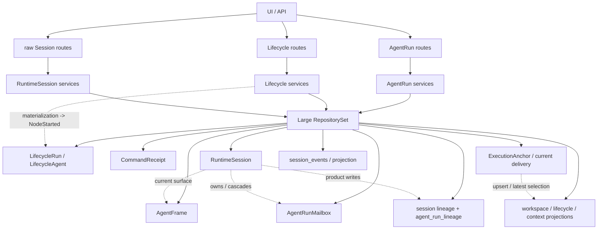
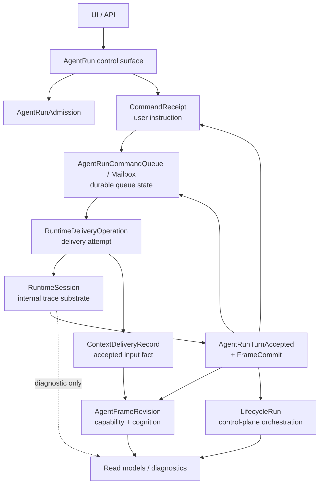
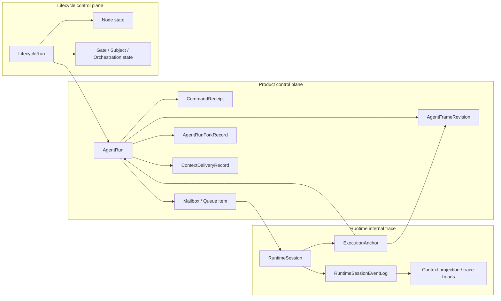
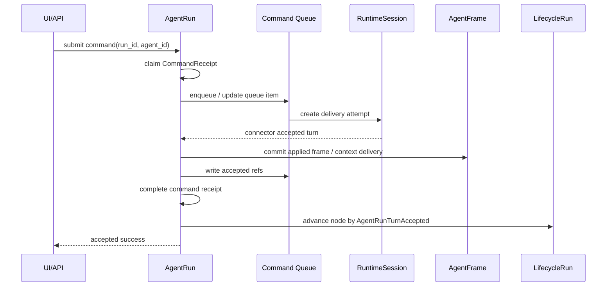

# 重构前后状态与收口检查

## Purpose

本文件用于回答三个问题：

1. 重构前项目处于什么架构状态。
2. 重构后目标状态是否足够简洁、清晰。
3. 最后收口时应以哪些检查目标判断这次大型重构是否完成。

本文件不替代 `decisions.md` 和 `work-items/`。`decisions.md` 是正式决策源；`work-items/` 是执行拆分；本文件是整体状态图和最终验收视角。

## 重构前状态

重构前的问题不是“概念太多”这么简单，而是不同性质的概念被做成了相似的仓储和服务依赖形状：

- 产品入口同时落在 `AgentRun`、`Lifecycle`、raw `RuntimeSession`。
- `RuntimeSession` 既像内部 trace，又承担 fork、rollback、delete、tool approval、title patch 等产品写控制面。
- mailbox 领域上表达 AgentRun 用户意图，但物理 owner 和执行路径混入 RuntimeSession。
- accepted turn、frame commit、mailbox receipt、Lifecycle node started 不是同一业务提交边界。
- `AgentFrame` 是能力事实源，但 runtime 路径仍能通过可变 visible refs、current frame 推断和多列 surface 形成旁路。
- fork baseline 同时从 session projection、runtime lineage、AgentRun materialization、receipt result cache 推导。
- projection、state、binding 命名混用，不可重建的 current pointer 被当成 projection 对待。
- 大 `RepositorySet` 泄漏到 application service，使每个 use case 都能临时拼出跨聚合动作。

### 重构前图示



这张图的问题是：任意 route 进入后都能通过大仓储集合触达大部分事实；RuntimeSession 既是内部执行轨迹，又像产品聚合；AgentRun、Lifecycle、RuntimeSession 之间没有稳定的单向控制流。

## 重构后目标状态

目标状态只有五个核心事实角色：

| 角色 | 职责 | 不能承担的职责 |
| --- | --- | --- |
| AgentRun | 产品一等聚合、用户工作区、单 Agent 会话身份、命令入口、fork 入口 | 不直接保存 runtime trace 细节 |
| LifecycleRun | 多 AgentRun control-plane ledger / orchestrator | 不重复 AgentRun workspace 事实 |
| AgentFrame | Agent 能力与认知状态的 append-only surface revision | 不由 RuntimeSession 原地 mutate 历史 revision |
| RuntimeSession | internal delivery stream、event log、connector turn、trace/debug | 不作为产品 URL、权限入口或用户写控制面 |
| Projection / Binding | read model 或不可丢失 current state | 不混用命名；参与决策的不可重建 projection 必须升格为 state/binding |

### 目标控制流



这张图的关键约束是：用户写入口只到 AgentRun；Lifecycle 是编排和账本；RuntimeSession 只在 delivery/trace 层出现；accepted boundary 才把 runtime 结果提交回 AgentRun 和 Lifecycle。

### 事实归属图



`Anchor` 是允许 RuntimeSession 反查控制面的 evidence 索引，但它不是 current delivery truth。current delivery 若参与决策，必须是明确的 AgentRun child binding/state，或者有可证明的重建策略。

### 提交边界图



如果 `FR`、`Q`、`AR` receipt 或 `LC` advance 失败，`accepted success` 不成立。这样可以消除 “RuntimeSession 已 accepted，但 AgentRun 产品事实丢失” 的旧状态。

## 重构前后对比

| 维度 | 重构前 | 重构后 |
| --- | --- | --- |
| 产品 identity | AgentRun、Lifecycle、RuntimeSession 混用 | AgentRun 是用户主入口，Lifecycle 是控制面，RuntimeSession 仅 trace |
| 用户命令 | receipt、mailbox、runtime command 多套状态机 | instruction -> queue item -> delivery attempt 三层事实 |
| Mailbox | 依附 AgentRun 语义，但受 RuntimeSession ownership 影响 | AgentRun-owned durable queue，物理可保留 child table |
| RuntimeSession | 内部 trace + 产品写控制面 | internal trace substrate + diagnostic read |
| Accepted boundary | runtime accepted 与 frame/current commit 分裂 | AgentRunTurnAccepted + FrameCommit 同一边界 |
| Lifecycle started | materialization 可推进 started | accepted turn 推进 started |
| AgentFrame | 基准事实源但存在 runtime 可变旁路 | append-only capability/cognition surface revision |
| ContextFrame | 多处构造输入事实 | ContextDeliveryRecord 或等价 accepted input fact |
| Fork baseline | session projection/runtime lineage/receipt cache 多源 | AgentRunForkRecord 单一 product fork fact |
| Projection | state、binding、read model 混名 | 每个 projection 声明可重建性；不可丢失则升格 |
| Permission | raw Session 路径可散落授权入口 | AgentRun/Lifecycle 控制面派生 trace 访问 |
| RepositorySet | 业务服务拿全量集合拼装 use case | RepositorySet 只在 composition root，业务层用窄 deps |
| 存储形态 | 独立表/JSONB/仓储常由历史实现决定 | 由事实所有权、锁、扫描、查询、重建需求决定 |

## 目标状态是否足够简洁

目标状态的简洁性来自删除旧组合，而不是压扁所有表：

1. 产品写入口只有一个主门：`AgentRun`。
2. 编排控制面只有一个账本：`LifecycleRun`。
3. 执行 trace 只有一个内部底座：`RuntimeSession`。
4. 能力判断只有一个事实源：`AgentFrame`。
5. 命令链路只有三层事实：instruction、queue item、delivery attempt。
6. fork 只有一个 product fact：`AgentRunForkRecord`。
7. 投影只有两类：可重建 read model，或被明确命名的 state/binding。
8. 仓储只有五种资格：independent fact source、parent-owned child fact、parent-owned child table、application port、runtime trace store。

这套目标不是“最少对象数”，而是“最少事实源数”。保留 child table、trace store、frame revision table 并不会破坏简洁性；真正要删除的是多入口、多事实源、多套状态机和大 service locator。

物理表同样接受删除驱动审查。如果一张表只是历史冗余、重复 projection、错误 ownership 下的缓存，或者没有独立查询和并发行为，它应该被删除、合并或降级为父聚合内部 storage。反过来，需要锁、claim、扫描、分页、恢复、审计或 append-only trace 的表应保留，即使它增加表数量。

## 最后收口检查目标

### C-001 Product identity check

所有用户可见写操作从 AgentRun scoped API 进入。前端 workspace 的主状态不依赖 raw `runtime_session_id`。raw Session surface 只保留 trace/debug/diagnostic 能力。

### C-002 Admission atomicity check

ProjectAgent start、AgentRun start、fork materialization 都通过 `AgentRunAdmission` 或等价用例原子创建初始 run/agent/frame/anchor/mailbox/receipt。API 层不调度首条消息。

### C-003 Command lifecycle check

任一用户命令都能画成：

```text
CommandReceipt -> Queue item / Mailbox -> DeliveryAttempt
```

每个状态字段只能归属到其中一层。

### C-004 Mailbox ownership check

Mailbox owner 是 `run_id + agent_id`。删除或轮换 RuntimeSession 不会删除 AgentRun durable user intent。保留物理表时，它被解释为 AgentRun child table，而不是独立产品聚合。

### C-005 Accepted boundary check

Runtime accepted success 必须同时完成 AgentRun accepted fact、frame commit/applied binding、mailbox accepted refs、command outcome、Lifecycle node advancement。任何一项失败都不能对外表现为 accepted。

### C-006 Lifecycle state check

Lifecycle materialization 只表达 prepared/allocated。`NodeStarted` 只由真实 `AgentRunTurnAccepted` 推进，terminal state 只由真实 terminal fact 推进。

### C-007 AgentFrame / ContextDelivery check

AgentFrame revision append-only，历史 revision 不被 runtime path 原地修改。ContextFrame emission 能追溯到唯一 `ContextDeliveryRecord` 或等价 accepted input fact。

### C-008 Fork baseline check

Product fork replay 读取 canonical `AgentRunForkRecord`。baseline 能精确定位 parent AgentRun、fixed turn/message boundary、child AgentRun、child baseline、fork owner。RuntimeSession lineage 不作为产品 lineage 的并列事实源。

### C-009 Projection rebuildability check

每个 projection/read model 都声明：

- 是否可重建。
- 从哪些 facts 重建。
- 是否参与业务决策。
- 若参与决策且不可丢失，为什么它是 state/binding。

### C-010 Permission check

产品权限从 AgentRun/Lifecycle control plane 判断。RuntimeSession trace 访问只能从控制面权限派生，不能反向成为产品授权入口。

### C-011 Repository dependency check

业务 service 不接收全量 `RepositorySet`。每个 use case 的 deps struct 都能说明自己需要哪些能力。跨聚合写入通过显式 command port / unit of work。

### C-012 Storage qualification check

每个保留或新增表都能回答：

- 它是 independent fact source、child table、embedded state、runtime trace store，还是 projection。
- 它为什么需要独立物理存储。
- 它的 owner、FK/cascade、索引、锁、扫描和重建策略是什么。
- 如果它曾被怀疑为冗余表，为什么不能删除、合并或降级。

### C-012B Redundant table cleanup check

每个被判定为冗余的物理表都必须有明确结论：

- 删除：canonical facts 足以重建或替代它。
- 合并：它与另一张表表达同一事实或同一 owner 下的重复状态。
- 降级：它仍需物理表能力，但只作为父聚合 child table，不再作为顶级仓储。
- 保留：它满足 D-016 / D-017 / D-019 的正向资格。

### C-013 End-to-end path check

最终至少用一条完整路径验证目标状态：

```text
start AgentRun
  -> enqueue user command
  -> delivery attempt
  -> RuntimeSession accepted
  -> AgentFrame / ContextDelivery commit
  -> Lifecycle node started
  -> workspace projection visible
  -> fork from fixed turn
  -> delete AgentRun cleanup
```

这条路径中产品层不得需要 raw RuntimeSession identity 才能继续。

## 收口判定

本轮重构可以收口的条件不是“所有文件都改完”，而是以下三个条件同时满足：

1. 从 UI/API 到 accepted turn 的主链路可以按目标控制流解释，没有第二条产品写入口。
2. 每个保留仓储和表都通过 D-016 / D-017 的资格审查。
3. 所有 `work-items/WI-*.md` 的 Acceptance 与本文件的 C-001 到 C-013 能逐项打勾。

若某个工作项完成后还需要说“这里暂时从 RuntimeSession 找一下”“这个 projection 现在也算事实源”“这个 service 先拿 RepositorySet 拼一下”，则该工作项没有真正收口。
