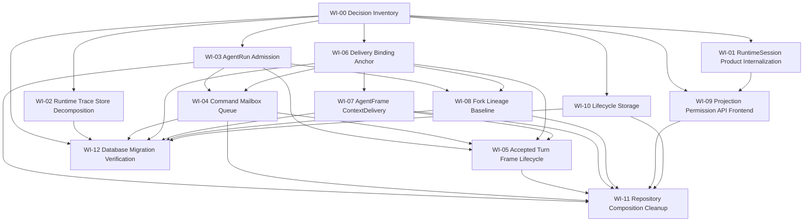

# 工作项索引

本目录把大型重构拆成可分发工作项。每个工作项都绑定正式决策编号和 research 输入，实施时可以独立分派，但必须遵守依赖顺序。

## Work Items

| ID | 文件 | 目标 | 依赖 | 可并行性 |
| --- | --- | --- | --- | --- |
| WI-00 | `WI-00-decision-inventory.md` | 锁定仓储/表/port 分类和使用点事实 | 无 | 必须最先完成 |
| WI-01 | `WI-01-runtime-session-product-internalization.md` | 删除 RuntimeSession 产品写入口和前端产品 identity 依赖 | WI-00 | 可与 WI-02、WI-09 设计并行 |
| WI-02 | `WI-02-runtime-session-trace-store-decomposition.md` | 拆分 SessionPersistence mega trait 和 runtime trace store 边界 | WI-00 | 可与 WI-01 并行 |
| WI-03 | `WI-03-agentrun-admission-boundary.md` | 建立 start/fork admission 原子边界 | WI-00 | WI-04 可先做设计，实施需对齐 |
| WI-04 | `WI-04-command-mailbox-queue.md` | 收敛 CommandReceipt / Mailbox / DeliveryOperation 三层事实 | WI-00, WI-03 | 可与 WI-06 设计并行 |
| WI-05 | `WI-05-accepted-turn-frame-lifecycle.md` | 合并 accepted turn、frame commit、lifecycle started 边界 | WI-03, WI-04, WI-06, WI-07 | 依赖较多，适合作为中段集成项 |
| WI-06 | `WI-06-delivery-binding-anchor.md` | 固化 anchor immutability 和 current delivery selection | WI-00 | 可与 WI-04、WI-07 设计并行 |
| WI-07 | `WI-07-agentframe-context-delivery.md` | 重建 AgentFrame surface 与 ContextDelivery 输入事实 | WI-00, WI-06 | WI-05 依赖其提交边界 |
| WI-08 | `WI-08-fork-lineage-baseline.md` | 以 AgentRunForkRecord 收束 product fork 和 lineage | WI-03, WI-06 | 可在 WI-04 后半段并行 |
| WI-09 | `WI-09-projection-permission-api-frontend.md` | 收敛 projection、permission、API/frontend product identity | WI-00, WI-01 | 可与 WI-02 并行 |
| WI-10 | `WI-10-lifecycle-storage-gates-subjects.md` | 评估 Lifecycle context/gates/subjects 的物理归属 | WI-00 | 可与 WI-02、WI-09 并行 |
| WI-11 | `WI-11-repository-composition-cleanup.md` | 删除业务层 RepositorySet/service locator 泄漏 | WI-03 到 WI-10 的边界稳定 | 后段 cleanup |
| WI-12 | `WI-12-database-migration-verification.md` | 统筹破坏式 migration、FK/cascade、迁移验证 | WI-00，各实施项 schema 方案 | 贯穿执行，最终收口 |

## Dependency Graph

## Execution Rule

每个工作项开始前必须确认：

- 对应 decision IDs 是否仍为 Accepted；若实现发现新事实，需要先回填 `decisions.md` 和 `inventory.md`。
- research 输入是否已有足够 file:line 证据。
- schema 变更是否已登记到 WI-12。
- 若工作项会改变公开 contracts/frontend product identity，需要同步 WI-09。

每个工作项完成时必须回填：

- 删除或内部化了哪些旧入口、旧字段、旧仓储组合。
- 保留的表或 port 为什么满足 D-016 / D-017。
- 验证命令和未覆盖风险。
