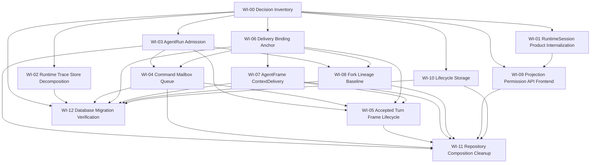

# 工作项索引

本目录把大型重构拆成可分发工作项。每个工作项都绑定正式决策编号和 research 输入，实施时可以独立分派，但必须遵守依赖顺序。

## Work Items

| ID | 文件 | 目标 | 依赖 | 可并行性 |
| --- | --- | --- | --- | --- |
| WI-00 | `WI-00-decision-inventory.md` | 锁定仓储/表/port 分类和使用点事实 | 无 | 必须最先完成 |
| WI-01 | `WI-01-runtime-session-product-internalization.md` | 删除 RuntimeSession 产品写入口和前端产品 identity 依赖 | WI-00 | 可与 WI-02、WI-09 设计并行 |
| WI-02 | `WI-02-runtime-session-trace-store-decomposition.md` | 拆分 SessionPersistence mega trait 和 runtime trace store 边界 | WI-00 | 可与 WI-01 并行 |
| WI-03 | `WI-03-agentrun-admission-boundary.md` | 建立 start/fork admission 原子边界 | WI-00 | WI-04 可先做设计，实施需对齐 |
| WI-04 | `WI-04-command-mailbox-queue.md` | 收敛 CommandReceipt / Mailbox / DeliveryOperation 三层事实 | WI-00, WI-03 | 可与 WI-06 设计并行 |
| WI-05 | `WI-05-accepted-turn-frame-lifecycle.md` | 合并 accepted turn、frame commit、lifecycle started 边界 | WI-03, WI-04, WI-06, WI-07 | 依赖较多，适合作为中段集成项 |
| WI-06 | `WI-06-delivery-binding-anchor.md` | 固化 anchor immutability 和 current delivery selection | WI-00 | 可与 WI-04、WI-07 设计并行 |
| WI-07 | `WI-07-agentframe-context-delivery.md` | 重建 AgentFrame surface 与 ContextDelivery 输入事实 | WI-00, WI-06 | WI-05 依赖其提交边界 |
| WI-08 | `WI-08-fork-lineage-baseline.md` | 以 AgentRunForkRecord 收束 product fork 和 lineage | WI-03, WI-06 | 可在 WI-04 后半段并行 |
| WI-09 | `WI-09-projection-permission-api-frontend.md` | 收敛 projection、permission、API/frontend product identity | WI-00, WI-01 | 可与 WI-02 并行 |
| WI-10 | `WI-10-lifecycle-storage-gates-subjects.md` | 评估 Lifecycle context/gates/subjects 的物理归属 | WI-00 | 可与 WI-02、WI-09 并行 |
| WI-11 | `WI-11-repository-composition-cleanup.md` | 删除业务层 RepositorySet/service locator 泄漏 | WI-03 到 WI-10 的边界稳定 | 后段 cleanup |
| WI-12 | `WI-12-database-migration-verification.md` | 统筹破坏式 migration、FK/cascade、迁移验证 | WI-00，各实施项 schema 方案 | 贯穿执行，最终收口 |

## Dependency Graph

## Execution Rule

每个工作项开始前必须确认：

- 对应 decision IDs 是否仍为 Accepted；若实现发现新事实，需要先回填 `decisions.md` 和 `inventory.md`。
- research 输入是否已有足够 file:line 证据。
- schema 变更是否已登记到 WI-12。
- 若工作项会改变公开 contracts/frontend product identity，需要同步 WI-09。

每个工作项完成时必须回填：

- 删除或内部化了哪些旧入口、旧字段、旧仓储组合。
- 保留的表或 port 为什么满足 D-016 / D-017。
- 验证命令和未覆盖风险。

## Parallel Dispatch Rule

并行派发以本索引的依赖图为第一约束，以实际写入路径为第二约束。满足以下条件时可以并行：

- 工作项依赖已经满足，且不会提前消费尚未提交的中间结构。
- 写入路径互不重叠，或者一个 worker 只写 `research/` / task artifact，另一个 worker 写代码。
- 两个 worker 不共享 migration 文件、contract/generated 文件、同一 public API surface 或同一 application service 构造函数。
- 主会话能为每个 worker 指定独立 check 范围，并在合流时按主题顺序提交。
- 每个 worker 的派发 brief 已声明锚定 WI、允许写入路径、互斥路径、验证命令和完成报告格式。
- check worker 的输入必须绑定单个已合流 diff；如果同一批次返回多个代码 diff，主会话先按主题分批 stage/commit，再派发对应 check。

## Parallel Batch Protocol

主会话按批次派发并行 worker，而不是让多个 worker 共享一个隐式任务面。每个批次包含：

- **Batch intent**：本批次要删除或收束的旧事实源 / 旧组合方式。
- **Worker matrix**：每个 worker 的 WI、角色、允许写入路径、只读上下文、互斥路径和验证命令。
- **Merge order**：返回后按哪个主题先检查、先提交；migration、generated contract、public API surface 始终由主会话串行合流。
- **Check placement**：实现 worker 返回后立即派 `trellis-check` 审同一 WI 的 diff；长链路工作在中段插入 check，不等最终全局 review。
- **Abort condition**：worker 发现需要触碰互斥路径、依赖未提交中间结构、或当前代码事实推翻工作项假设时，只回报发现，由主会话重新切分。

推荐并行形态：

- 一个实现 worker 写代码，另一个 research worker 只写 `research/` 或 migration ledger。
- 两个实现 worker 分别处理不同 crate / 不同 use case，且不触碰同一 public API、migration、generated contract 或 service constructor。
- 实现 worker 运行时，主会话只做只读准备或处理不重叠的已返回结果。

合流顺序：

- 先合流并检查代码 diff，再提交同一 WI 的主题 commit。
- research / task artifact 单独提交，除非它是对应代码 diff 的必要验收记录。
- 并行批次结束时工作区应回到 clean，再启动下一批次。

典型批次：

- WI-02 runtime store cleanup 与 WI-10 Lifecycle storage research 可以并行，因为前者写 runtime-session 构造，后者先清点 Lifecycle storage 使用点。
- WI-04 mailbox owner correction 与 WI-12 migration ledger 可以并行准备，但实际 migration 文件由主会话按提交顺序合流。
- WI-06 delivery binding 与 WI-08 fork lineage 需要在 current delivery 语义稳定后再并行，否则 baseline 和 current selection 会互相影响。
