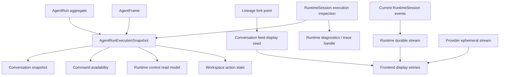

# Design

## Target Shape

AgentRun 是用户可见会话事实源；RuntimeSession 是 AgentRun 内部执行流；conversation feed 是 lineage display seed；runtime stream 是当前子会话的事件流。所有 UI / API 可见的“运行中、可发送、可取消、可分支、正在思考”状态都必须穿过 AgentRun execution / display snapshot，不能由 RuntimeSession 直接对外解释。AgentRun 前端 contract 只接收 AgentRun 用户状态和显式诊断信息两类数据；RuntimeSession meta / ref 不再混入用户状态模型。

## Source Boundaries

- `AgentRunExecutionSnapshot` is the single application-level active-state derivation for one AgentRun + agent.
- Inputs: AgentRun anchor, current runtime session id, AgentFrame availability, `SessionExecutionState`, terminal agent status, lifecycle membership needed for display.
- Outputs: execution status code, active / last turn ids, command availability, cancel availability, runtime control status, display reasons.
- `runtime_sessions.last_delivery_status` may remain as runtime-session recovery metadata or terminal historical summary. It cannot feed public active/running/cancelling decisions.
- RuntimeSession read APIs should expose execution inspection, event replay, and ephemeral stream input only. Runtime control read model should wrap AgentRun execution snapshot instead of recomputing policy from session metadata.
- AgentRun scoped `/runtime/control` should not delegate to a RuntimeSession-owned control plane for user-facing state. If the route remains, it is an AgentRun snapshot projection with RuntimeSession diagnostics attached, not a second status authority.
- `SessionRuntimeControlView` and `SessionShellDto` are valid only for a generic RuntimeSession diagnostic surface. AgentRun scoped services should return an AgentRun runtime state contract whose status fields are produced by `AgentRunExecutionSnapshot`.
- `delivery_trace_meta`, `runtime_session_ref`, and raw RuntimeSession ids may appear in AgentRun responses only as opaque stream targets or diagnostic trace handles. They are not imported into workspace runtime state as status, command availability, cancellation state, or fork readiness.

## Fork And Replay Contract

- Fork picks a fixed lineage slice: parent AgentRun, parent agent, source turn / fork marker, and child AgentRun target.
- Conversation feed returns inherited display entries for the lineage slice. These entries are display seed, not durable runtime events.
- The current implementation derives the child seed from `build_agent_context_envelope(parent_session_id)`. That is a model-context projection and can be affected by compaction and projection head policy. The target contract needs a stable display-history slice for fork UI inheritance, while model context can remain a separate runtime launch concern.
- Current child RuntimeSession durable replay starts from its own event seq cursor. `runtime_replay_start_seq` belongs only to the child runtime event lane.
- Provider status remains ephemeral. Its seq lane is independent from durable `event_seq` and from inherited display seed.

## Frontend State Contract

- Display state has three lanes:
  - inherited display seed entries from AgentRun conversation feed
  - durable RuntimeSession events keyed by runtime `event_seq`
  - ephemeral provider/status events keyed by ephemeral seq
- `lastAppliedSeq` tracks durable RuntimeSession events only.
- Composer helper and buttons consume command availability derived from the same AgentRun execution snapshot that powers status bars. A live turn terminal must refresh the workspace conversation snapshot so helper text does not keep a stale running reason.
- The thinking placeholder is rendered only from provider waiting state; missing provider waiting is treated as stream or cursor failure, not patched by UI heuristics.
- AgentRun pages and hooks consume AgentRun workspace / conversation / runtime-state contracts. A generic session runtime panel can remain as a diagnostic view, but it does not feed AgentRun composer, status bar, fork marker, command availability, or conversation readiness.

## Migration Direction

- Remove public active-state usage of `last_delivery_status` first.
- Keep runtime-session internal recovery usage distinct: startup recovery can scan stale running summaries, but public AgentRun state must not surface them as running after `inspect_session_execution_state` resolves them to terminal / interrupted / idle.
- Collapse user-facing runtime control, command availability, composer helper, workspace state, and fork readiness into AgentRun-layer snapshots before cleaning fields. This prevents deleting one stale path while leaving another RuntimeSession-derived state path alive.
- After references are isolated, either drop the column through migration or rename its semantic usage to terminal summary if a concrete read surface still needs it.
- Because the project is pre-release, no compatibility adapter or dual API path is required.

## Review Checkpoints

- Mid-check after backend active-state convergence: stale `last_delivery_status` cannot make any public AgentRun surface running, including `/agent-runs/:runId/agents/:agentId/runtime/control`.
- Mid-check after replay convergence: inherited display seed cannot affect durable cursor and provider waiting still renders.
- Final fact-source audit: search for `last_delivery_status`, `SessionRuntimeControlView`, `SessionShellDto`, `delivery_trace_meta`, `runtime_session_ref`, `session_meta`, `fetchSessionRuntimeControl`, and `fetchAgentRunRuntimeControl`; each AgentRun-path hit must be removed, converted to AgentRun snapshot usage, or isolated as explicit diagnostics / internal stream transport.
- Final cleanup check: search for removed fact paths, stale tests, and compatibility leftovers before full fmt/clippy/test.
