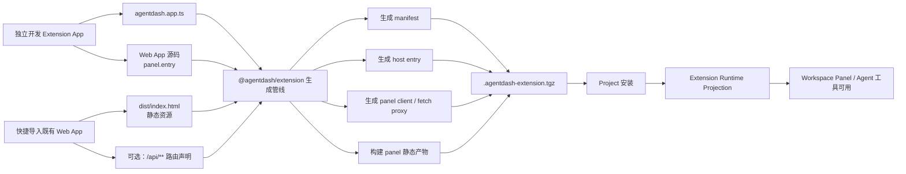
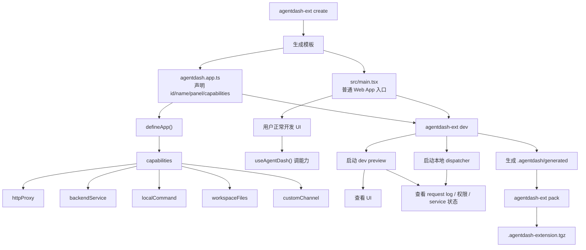
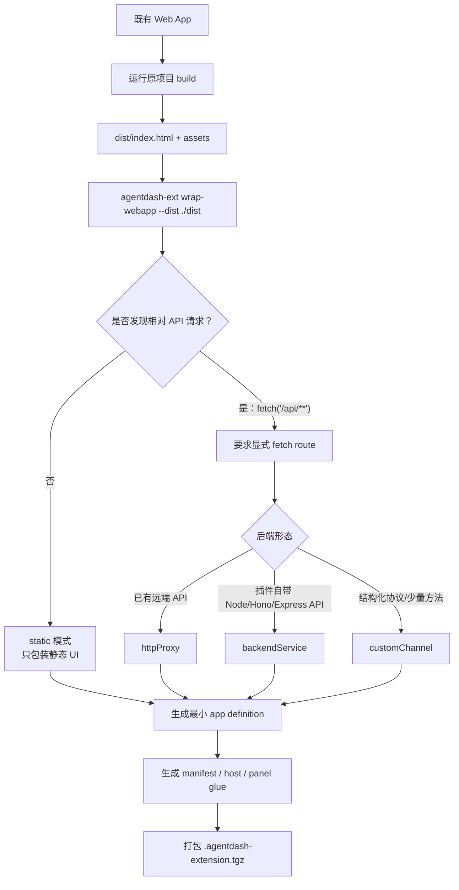
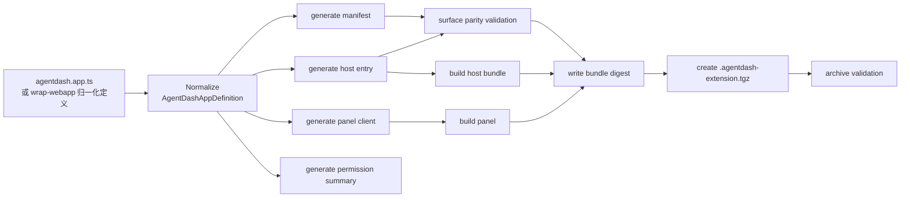
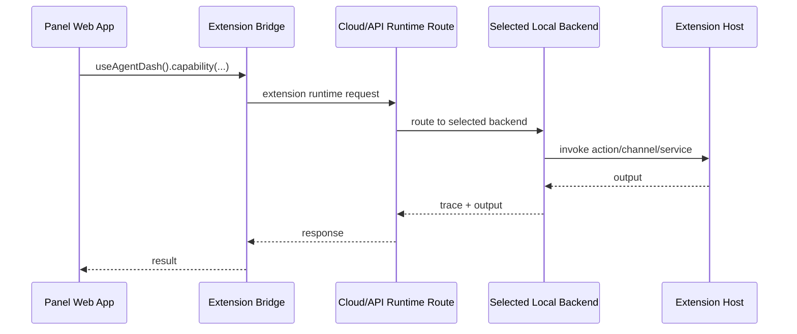
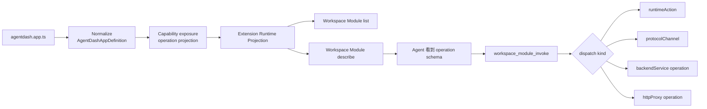
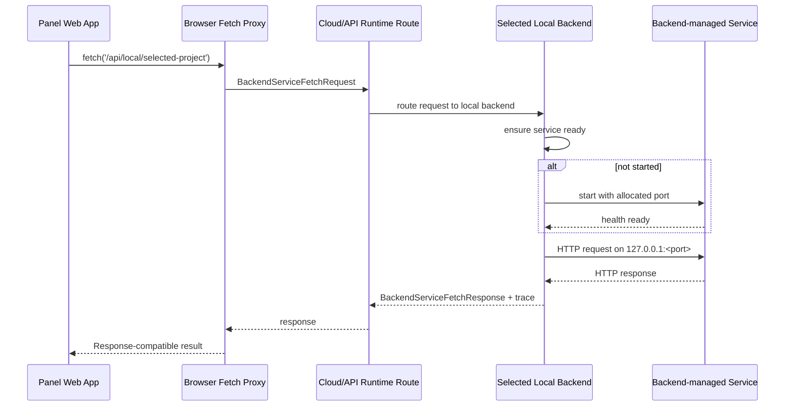

# Extension App 转化路径图示草案

本文是后续手册草案，用图示说明一个独立开发的 App 或既有 Web App 如何转化为 AgentDash 可安装 Extension。

## 1. 总览



要点：

- 用户只面对 `@agentdash/extension` 和 `agentdash-ext`。
- 独立开发从 `agentdash.app.ts` 开始。
- 快捷导入从已有 `dist` 开始。
- 两条路径最终都生成同一种 packaged extension artifact。

## 2. 独立开发路径



独立开发的心智：

```text
声明能力 -> 写 UI -> dev preview 调通 -> pack -> install
```

不要求用户手写：

- `agentdash.extension.json`
- `src/extension.ts`
- panel bridge glue
- runtime action / protocol channel manifest

## 3. 快捷导入既有 Web App



快捷导入分级：

| 模式 | 判断 | 处理 |
| --- | --- | --- |
| `static` | 只有静态 UI，无后端通信 | 直接包装 |
| `fetch-route` | 有 `/api/**` 等相对请求 | 要求声明 route 绑定 |
| `backend-service` | 自带长驻 Node/Hono/Express 服务 | 生成 `backendService` |
| `unsupported` | 依赖 SSR、未声明动态网络、Service Worker 等 | 报告阻塞原因 |

## 4. 生成与打包管线



不变量：

- 所有命令共用同一条 normalize/generate 管线。
- manifest 是生成物。
- host entry 是生成物或高级 escape hatch。
- surface validation 防止 manifest 与实际注册能力漂移。

## 5. Panel 调能力的运行路径



这条路径适用于：

- `httpProxy`
- `localCommand`
- `workspaceFiles`
- `customChannel`
- `backendService` 的 fetch route 入口

## 5b. Agent 发现与调用路径



约束：

- bridge 是 panel 的通信手段，不是 Agent 发现能力的事实源。
- Agent 可调用能力来自 capability 上的显式 exposure 标注，并由工具链投影为 Workspace Module operation。
- `fetch('/api/**')` 兼容路由默认只服务 panel，不自动暴露给 Agent。
- 要让 Agent 调 backend service，必须在对应 capability 上显式声明 exposure、description、input/output schema 与权限。

## 6. backendService 路径



`backendService` 的核心语义：

- 服务是 Extension artifact 的一部分。
- 端口只在本机 backend 内部存在。
- 云端不直接访问 `localhost`。
- 本机 backend 负责启动、端口、探活、转发、日志和清理。
- panel 保持原有 `fetch('/api/**')` 形状。

判断规则：

- 如果只是访问一个已经存在的 `localhost` endpoint，走 `httpProxy`，由当前本机 backend 发起请求。
- 如果服务代码随 Extension 一起分发，并需要 backend 拉起/探活/清理，才走 `backendService`。
- 判断标准是服务所有权和生命周期，不是 URL 是否包含 `127.0.0.1`。

## 7. 自带后端 Web App 对应路径

某类既有 Web App 属于：

```text
backend-service 模式
```

典型特征：

- UI 是 Vite/React，可构建为静态产物。
- 前端请求集中在 `fetch('/api/**')`。
- `/api` 依赖插件自带的 Node/Hono/Express 后端模块。
- 后端模块需要本机文件系统、用户目录配置、workspace 上下文或动态 localhost 端口。

推荐映射：

```ts
export default defineApp({
  id: "private-web-tool",
  panel: {
    entry: "src/main.tsx"
  },
  capabilities: {
    api: backendService({
      entry: "src/Server/Index.ts",
      routes: ["/api/**"],
      runtime: "node"
    })
  }
});
```

需要工具链支持：

- Vite base path 检测或重写。
- `/api/**` fetch route 到 `backendService`。
- backend 自动分配端口并注入服务。
- 权限摘要表达本机文件、用户目录、workspace 与 localhost 访问范围。
