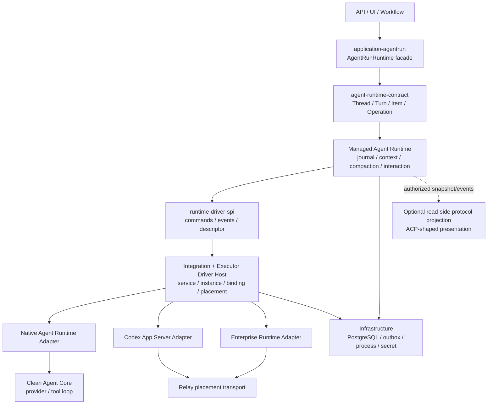
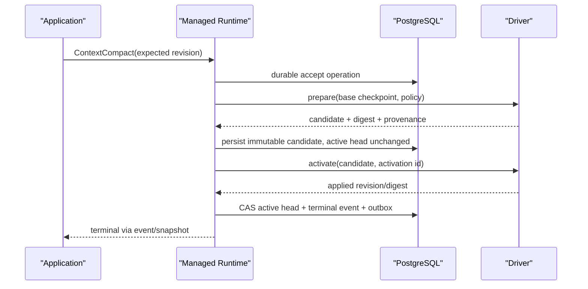

# Agent Runtime 架构收敛设计

## 1. 设计结论

本次重构不在既有 `AgentConnector`、`application-runtime-session` 和 Backbone 之上继续叠加抽象，而是按状态所有权重新建立四条主边界：

1. **Application / AgentRun facade**：拥有产品授权、AgentRun/Agent 关系、mailbox 与 UI command availability；不理解 driver、vendor protocol 或 compaction 内部阶段。
2. **Managed Agent Runtime**：拥有 canonical Thread/Turn/Item/Interaction/Operation、上下文构造、checkpoint、compaction、状态机、operation journal 与 terminal guarantee。
3. **Integration / Executor Driver Host**：拥有受信 Integration contribution、Agent service instance、driver factory、placement、binding、source ID mapping 与 adapter 调度；不拥有 AgentRun 产品语义或 context policy。
4. **Agent Core / 外部协议 Adapter**：Clean Agent Core只提供provider/tool loop等纯执行能力；Codex与企业执行协议只在各自adapter内终止。ACP不进入执行链，未来至多作为read-side projection vocabulary。

结构边界和事实源必须清晰，协议与能力组合保持可演进。Codex App Server是L4词汇与交互形状的首要执行参考；L2 ConversationRuntime由AgentDash-owned guarantees定义，不绑定ACP或其它特定协议。



## 2. 设计原则

### 2.1 先固定 ownership，再固定 protocol shape

- Thread/Turn/Item/Operation 的事实归 Managed Runtime。
- Agent service/driver/placement/binding 的事实归 Executor Driver Host。
- 数据库事务、CAS、outbox、secret 和 transport 归 Infrastructure。
- vendor DTO只归对应Adapter/Projection Integration。
- Application 只依赖 product facade 与 owned runtime contract。

具体 method 集、profile 组合和企业扩展可以随 Agent Core 协同演进；上述 ownership 与依赖方向不得因 adapter 差异反转。

### 2.2 业务 Agent Runtime 不是 infrastructure

上下文构造、message selection、tool surface、manual/automatic compaction、checkpoint activation、restore/fork semantics 都是 Agent conversation 业务规则。Infrastructure 只实现这些规则要求的 repository、transaction、CAS 与 migration。

### 2.3 Canonical contract AgentDash-owned，vocabulary Codex-shaped

目标合同使用 `Thread → Turn → Item`、双向 `Interaction`、accepted 与 terminal 分离、expected active turn、final item authoritative 等成熟词汇，但所有 ID、operation、event、error、checkpoint 和 schema 由 AgentDash 自己定义。Codex struct 不再被 type alias 或 re-export 为 canonical type。

### 2.4 Level 只做参考分类，profile 才是 admission 事实

L0-L4 用于快速描述一个 runtime 的典型形状，不作为 Rust trait 继承树，也不作为 UI 按钮的唯一判断。每条 command 都根据 bound capability profile 的 predicates 判断是否可执行。

### 2.5 没有真实 channel 就没有 capability

- 工具必须有 schema ingress、call、result、identity、policy、cancel/terminal channel。
- Context 必须有明确 authority、fidelity、revision 和 apply/activation guarantee。
- Approval/UserInput 必须有 durable request/response correlation。
- 把 schema、Skill 或 system-like 文本写进普通 prompt 只算 `PromptOnly`，不能作为可用能力。

### 2.6 失败必须收敛为 typed terminal

所有 accepted mutation 都有 durable Operation；Turn、Item、Interaction、Compaction 都有明确 terminal。EOF、driver generation 丢失或不可判定结果必须进入 `Lost`，不能默认为 Completed，也不能吞掉 persistence error。

## 3. Canonical 领域词汇

### 3.1 产品实体与运行时实体分离

| 概念 | 所有者 | 含义 |
| --- | --- | --- |
| `AgentRun` | Application | 用户可见的产品运行容器、授权和工作流关系 |
| `AgentRunRuntimeBinding` | Application | AgentRun 与 RuntimeThread 的产品映射 |
| `RuntimeThread` | Managed Runtime | 可恢复、可分叉的 logical conversation |
| `RuntimeTurn` | Managed Runtime | 一次 accepted 后必有 terminal 的 Agent 执行 |
| `RuntimeItem` | Managed Runtime | 输入、输出、tool/action、context change 等可独立结算对象 |
| `RuntimeInteraction` | Managed Runtime | Runtime 向 Host 发起并等待回答的 approval、user input、elicitation |
| `RuntimeOperation` | Managed Runtime | 所有 mutation 的 durable acceptance、幂等和恢复单位 |
| `RuntimeBinding` | Driver Host | Thread 与 service instance/driver generation/placement 的固定绑定 |
| `Driver*Id` | Driver Host / Adapter | Codex ThreadId、企业协议session id等source coordinate |

Codex与企业协议的Thread/Turn/Item/session ID映射为对应`Driver*Id`，不得直接成为AgentRun或canonical Runtime ID。未来ACP projection若编码RuntimeThreadId为SessionId，那只是外部read-model coordinate，不形成Driver binding。

### 3.2 核心 newtypes

```rust
RuntimeThreadId
RuntimeTurnId
RuntimeItemId
RuntimeInteractionId
RuntimeOperationId
RuntimeBindingId
RuntimeServiceInstanceId
RuntimeDriverGeneration

ContextCheckpointId
ContextCandidateId
ContextCompactionId
ContextRevision
ThreadSettingsRevision
ToolSetRevision

DriverThreadId
DriverTurnId
DriverItemId
DriverRequestId
```

这些 ID 不允许都退化为裸 `String` 后跨层传递。Adapter 负责 canonical/source mapping，expected-turn 比较永远使用 canonical `RuntimeTurnId`。

### 3.3 Thread、Turn、Item、Interaction

`RuntimeThread` 持有 lifecycle status、active turn、binding reference、settings/context/tool revisions、fork provenance 与 operation sequence。

`RuntimeTurn` 至少区分：

```text
Accepted -> Running -> Completed | Interrupted | Refused | LimitReached | Failed | Lost
```

`RuntimeItem` 的最小 canonical union：

```text
UserMessage
AgentMessage
ToolCall
SystemContextChange
ContextCompaction
```

Plan、Reasoning、CommandExecution、FileChange、Review、MultiAgent、Media 等通过 typed optional profile 扩展。Delta 只服务流式过程，final item 是 authoritative projection。

`RuntimeInteraction` 至少支持：

```text
CommandApproval
FileChangeApproval
PermissionApproval
UserInputRequest
McpElicitation
DynamicToolExecution
```

Interaction 是持久对象，不是进程内 callback。响应需要校验 Thread/Turn/Item scope、expected state 和 actor，并且最多 resolve 一次。

## 4. 公开接口设计

### 4.1 Application seam：`AgentRunRuntime`

```rust
trait AgentRunRuntime {
    async fn inspect(&self, target: AgentRunRef)
        -> Result<AgentRunRuntimeView, AgentRunRuntimeError>;

    async fn send_message(&self, command: SendAgentRunMessage)
        -> Result<Accepted<TurnAcceptance>, AgentRunRuntimeError>;

    async fn compact_context(&self, command: CompactAgentRunContext)
        -> Result<Accepted<CompactionAcceptance>, AgentRunRuntimeError>;

    async fn steer_active_turn(&self, command: SteerAgentRunTurn)
        -> Result<Accepted<SteerAcceptance>, AgentRunRuntimeError>;

    async fn interrupt_active_turn(&self, command: InterruptAgentRunTurn)
        -> Result<Accepted<InterruptAcceptance>, AgentRunRuntimeError>;

    async fn resolve_interaction(&self, command: ResolveAgentRunInteraction)
        -> Result<Accepted<InteractionAcceptance>, AgentRunRuntimeError>;

    async fn read_context(&self, query: ReadAgentRunContext)
        -> Result<AgentRunContextView, AgentRunRuntimeError>;

    async fn read_events(&self, query: ReadAgentRunEvents)
        -> Result<AgentRunEventPage, AgentRunRuntimeError>;
}
```

该 facade：

- 负责产品授权、AgentRun/Agent/Workspace 校验与 mailbox 语义；
- 将首次消息映射为 thread start + turn start，将后续消息映射为同一 thread continuation；
- 根据 Runtime snapshot 生成具名 command availability；
- 不持有第二套 runtime lifecycle，不直接选 Integration/connector，不解析 vendor event。

### 4.2 通用 seam：`AgentRuntimeGateway`

```rust
trait AgentRuntimeGateway {
    async fn execute(
        &self,
        command: RuntimeCommandEnvelope,
    ) -> Result<OperationReceipt, RuntimeExecuteError>;

    async fn snapshot(
        &self,
        query: RuntimeSnapshotQuery,
    ) -> Result<RuntimeSnapshot, RuntimeSnapshotError>;

    async fn events(
        &self,
        subscription: RuntimeEventSubscription,
    ) -> Result<RuntimeEventStream, RuntimeSubscribeError>;
}
```

三个入口保持 public surface 小而深：

- `execute` 先 durable accept，再异步产生 lifecycle outcome；同步返回不代表 turn/compact 成功。
- `snapshot` 返回 revisioned state、bound profile、availability、context fidelity 与 pending interactions。
- `events` 区分 authoritative durable events 与 transient presentation deltas。

`RuntimeCommand` 是 typed union，不提供 stringly `invoke(name, json)` 逃生口。核心 command family：

```text
ThreadStart / ThreadResume / ThreadFork
ThreadSettingsUpdate
TurnStart / TurnSteer / TurnInterrupt
InteractionRespond
ContextCompact
ToolSetReplace
```

Thread catalog/archive/delete 等产品管理操作可由 Application service 组合 repository 或作为独立 optional management interface，不强迫所有 driver 实现。

### 4.3 Driver seam

Driver SPI 只面向 Managed Runtime / Driver Host，不面向 Application：

```rust
trait AgentRuntimeDriver {
    async fn describe(&self, request: DriverDescribeRequest)
        -> Result<RuntimeDescriptor, DriverError>;

    async fn bind(&self, request: DriverBindRequest)
        -> Result<DriverBinding, DriverError>;

    async fn dispatch(
        &self,
        command: DriverCommandEnvelope,
        sink: DriverEventSink,
    ) -> Result<DriverDispatchReceipt, DriverError>;

    async fn inspect(&self, query: DriverInspectionQuery)
        -> Result<DriverInspection, DriverError>;
}
```

要求：

- unsupported 在 side effect 前返回 typed error；
- driver receipt 只代表 delivery/acceptance，不代表 business terminal；
- source event 必须携带 binding generation 与 source coordinates；
- adapter 只映射协议、ID、error 和 event，不决定 capability business policy；
- core lifecycle event 不允许用 arbitrary JSON extension 伪造。

## 5. Managed Agent Runtime 内部设计

### 5.1 内部模块

建议在一个有深度的 `agentdash-agent-runtime` crate 内使用内部模块，而不是为每个名词拆 crate：

```text
runtime/
  operation_journal
  thread_state
  turn_state
  item_state
  interaction_state
  context
    recipe
    materialization
    checkpoint
    compaction
  surface
    instructions
    tools
    workspace
    capability_pack
    hook_plan
  hooks
    coordinator
    invocation
    run_projection
    effects
  admission
  driver_orchestration
  projection
  recovery
```

### 5.2 Operation journal

所有 mutation 使用公共 metadata：

```rust
OperationMeta {
    operation_id,
    idempotency_key,
    expected_thread_revision,
    actor,
}
```

同一 Thread 的 mutation 获得单调 `operation_sequence`。数据库在一个事务内写入：

- operation accepted；
- command payload/reference；
- canonical state transition；
- durable event；
- outbox wake-up。

重复 idempotency key 返回同一 receipt；未知 driver side effect 不能盲目重发。没有 driver dedupe guarantee 时，crash 后将对应 Turn/Operation 收敛为 `Lost`。

### 5.3 Event 模型

权威事件至少包括：

```text
operation/accepted
operation/terminal
runtime/bindingEstablished
runtime/bindingLost
runtime/protocolViolation
thread/started|resumed|forked|statusChanged|settingsUpdated
turn/started|terminal
item/started|updated|terminal
interaction/requested|resolved|expired
thread/context/checkpointPrepared|checkpointActivated
thread/compaction/terminal
```

Token delta、reasoning delta、typing/progress 等可以走 transient stream，但最终 item、terminal、approval、binding 与 context head 必须先持久化。Broadcast lag 只允许影响 transient stream。

### 5.4 Context ownership

Managed Runtime 拥有以下对象：

- `ContextRecipe`：选择哪些 AgentRun/AgentFrame/MessageRef/Memory/Workspace/Capability facts；
- `MaterializedContext`：真正交付给 driver 的 channel-aware content；
- `ContextCheckpoint`：immutable、带 revision/digest/provenance 的持久快照；
- `ActiveContextHead`：每 Thread 当前已激活 checkpoint；
- `ContextFidelity`：PlatformExact、DriverExact、AgentReplay、EventProjected、Opaque；
- `ToolSetRevision` 与 `ThreadSettingsRevision`：checkpoint 的组成部分。

`thread/read` 读取 transcript/projection；`thread/context/read` 读取模型上下文保证。两者绝不能互相替代。

### 5.5 Compaction saga

Manual 与 automatic compaction 走同一状态机：



不变量：

- prepare 不修改 live canonical context；
- candidate 先持久化，active head 保持旧值；
- activation 使用稳定 activation ID，driver 必须幂等或可查询结果；
- head 更新按 base checkpoint/context revision CAS；
- driver 已应用但 CAS 前崩溃时，recovery 重查/重放同一 activation；
- activation 无法验证时 binding 进入 `Desynchronized`/`Lost`，禁止继续新 Turn；
- native opaque compact 只产生 telemetry，不推进 platform head，也不完成 common compact operation。

## 6. Integration 与 Executor Driver Host

### 6.1 插件模型

沿用项目已有 taxonomy：Integration 是受信、编译期、宿主级扩展。此次不引入 dylib/WASM、兼容层或 marketplace 认证体系。

`AgentDashIntegration` 不再返回 live mega connector，而是贡献轻量 definition + factory：

```rust
struct AgentRuntimeDriverContribution {
    definition: AgentServiceDefinition,
    factory: Arc<dyn AgentRuntimeDriverFactory>,
}
```

Integration definition 随 binary 编译；以下对象运行时可管理：

- `AgentServiceInstance`：endpoint/config/credential refs/health；
- `RuntimeOffer`：当前 instance 提供的 runtime variant/profile/placement；
- `RuntimeBinding`：一个 Thread 固定选择的 service instance、driver generation 和 placement；
- `SourceIdMap`：canonical/source coordinates；
- `DriverLease`：live process/connection ownership 与 generation fencing。

Host 状态模型保持精简：当前只持久化真实需要的 descriptor、service instance、配置/credential refs、健康状态与 binding；实现真实性由仓库内共享 behavior tests验证。长期跨版本治理在出现真实需求后再单独设计。

### 6.2 Definition、Instance、Binding

| 实体 | 生命周期 | 关键字段 |
| --- | --- | --- |
| `AgentServiceDefinition` | 编译期 contribution | stable key、title、config schema、credential slots、factory key |
| `AgentServiceInstance` | 管理员配置 | definition key、config、credential refs、enabled、health |
| `RuntimeOffer` | discovery 时生成 | instance、runtime reference class、capability profile、placement constraints |
| `RuntimeBinding` | Thread 创建时持久化 | instance、offer/profile digest、driver generation、placement、source IDs |

绑定默认 sticky。除显式 migration/rebind operation 外，一个 Thread 不因服务重启、registry 顺序或 health probe 自动换 driver。

### 6.3 Router

Router 只按 durable binding 路由，不再使用：

- connector type 分支；
- Composite connector capability OR；
- 广播 cancel/approval；
- 枚举顺序中的“第一个可用 connector”；
- 通过 live map 猜 session owner。

旧 generation event 必须被 fence/quarantine，不能推进新 binding 的状态。

### 6.4 Relay

Relay 是 placement transport adapter，不是 Agent service、ACP backend 或 executor：

```text
effective profile
  = service guarantee
  ∩ transport guarantee
  ∩ host policy
```

Relay 透明承载 AgentDash-owned Runtime Wire 的 typed command/receipt/event/descriptor，并提供 route、frame sequence、ack/replay、connection health。它不理解 compaction policy、tool business semantics 或 vendor DTO，也不能提升 service capability。

### 6.5 Agent Surface、RuntimeOffer 与绑定装配

平台期望能力与Agent service实际能力保持两条独立输入：

- Application product source adapters只读取AgentFrame、Workflow、Project、Story、Task、Workspace、Skill、MCP、Permission、Capability Pack与Hook等typed facts；
- Managed Runtime内部Business Agent Surface将这些facts编译为immutable `AgentSurfaceSnapshot`，包含ContextRecipe、InstructionPlan、ToolCatalogRevision、WorkspaceRequirement、HookPlanSnapshot以及逐项required/optional与semantic requirement；
- Integration Adapter通过`describe`报告source能力，Driver Host结合service instance、credential/health、transport guarantee与host policy归一为AgentDash-owned `RuntimeOffer`；
- Managed Runtime admission将`AgentSurfaceSnapshot`与`RuntimeOffer`逐项求交，生成`BoundAgentSurface`与sticky `RuntimeBinding`；
- Driver Adapter只materialize已绑定的surface，并返回revision/digest/per-contribution状态组成的`AppliedAgentSurface`回执。

`RuntimeBinding`持久化service instance、driver generation、placement、offer/profile digest、BoundAgentSurface digest与applied revision。required contribution无法满足或required apply未ack时返回typed incompatibility，不产生driver side effect，也不将PromptOnly、Observed或SteerApproximation提升为exact capability。

因此，平台拼装Agent实际能力的业务层位于`agentdash-agent-runtime::surface`；Application只是product fact adapter，Driver Host只提供/约束实际offer并路由driver，不解析业务Agent规则。完整crate拓扑与迁移地图见[`target-crate-shape.md`](./target-crate-shape.md)。

## 7. Runtime reference classes 与 capability profiles

### 7.1 参考类别

| 类别 | 参考形状 | 当前用途 |
| --- | --- | --- |
| L0 `TransportConnector` | 可靠 frame/byte channel，无 Agent lifecycle | Relay、stdio、WebSocket 内部 transport |
| L1 `TurnRuntime` | typed turn、ordered lifecycle、exactly-one terminal、typed failure | 一次性 workflow/activity 或不可恢复 Agent |
| L2 `ConversationRuntime` | L1 + durable binding + restart 后 continuation + 明确 read fidelity | driver-owned或platform-rehydrated多轮conversation |
| L3 `InteractiveRuntime` | conversation 上增加可验证的 approval、steer、interrupt 等交互子集 | coding/enterprise interactive Agent |
| L4 `ManagedThreadRuntime` | Codex-shaped完整 Thread/Turn/Item + AgentDash managed context/checkpoint 扩展 | Native 与可协同增强的企业 runtime |

这些类别不是 trait 继承，也不要求 L3 必然拥有 hot tools、L4 必然拥有 shell。具体 service 可以表现为“L2 conversation + approval + MCP，但无 steer”，由 profile 精确表达。

### 7.2 Typed profiles

目标 descriptor 至少拆分：

- `InputProfile`：text/image/audio/resource/skill/mention；
- `InstructionProfile`：system/developer/additional context 与 delivery fidelity；
- `ToolProfile`：schema ingress、invocation、result、approval、policy、progress、update boundary；
- `WorkspaceProfile`：cwd/root/VFS/mount/fs proxy/terminal/policy enforcement；
- `InteractionProfile`：approval/user input/steer/interrupt；
- `HookProfile`：逐trigger actions、execution site、semantic strength、failure policy、configuration boundary与acknowledgment；
- `ContextProfile`：authority、read fidelity、resume/fork/compaction/activation；
- `TelemetryConfigProfile`：usage、model、reasoning/config/status。

每个能力记录实现语义与 provenance：

```text
Native
HostAdaptedExact
HostAdaptedBoundary
Observed
PromptOnly
UnsupportedCurrent
```

`Evolvable` 是研发路线说明，不是运行时 capability。

### 7.3 Availability

Snapshot 返回：

```rust
CommandAvailability {
    command_kind,
    enabled,
    disabled_code,
    required_predicates,
    missing_predicates,
    implementation_provenance,
    semantic_strength,
}
```

示例：

- `context.compact` 要求 `managed_transactional + idempotent_activation_recovery`；
- `turn.steer` 要求 `active_turn_ordered`；
- `turn.interrupt` 区分 best-effort 与 acknowledged terminal；
- `tool.update` 只有 HotReplace 时即时可用，InitialOnly 显示新 Thread/重绑定后生效；
- `thread.fork` 区分 DriverNativeFork 与 ExactContextRevisionFork；
- `interaction.respond` 必须存在真实 pending durable Interaction；
- Capability Pack 的 required contribution 任一不满足时整体 incompatible，不静默部分生效。

UI 不再按 `Pi/Codex/Relay` 类型分支。

## 8. Codex App Server 作为 L4 参考 Adapter

### 8.1 吸收进 owned contract 的词汇

- Thread start/resume/fork/read；
- Turn start/steer/interrupt；
- typed UserInput；
- Item started/delta/completed，final item authoritative；
- client request / server request / notification 三向交互；
- accepted response 与 lifecycle terminal 分离；
- `expectedTurnId` 并发保护；
- approval、user input、MCP elicitation、dynamic tool call 统一映射为 Interaction/ToolCall；
- schema 同源生成和 typed error。

### 8.2 只留在 Codex Adapter 的表面

- rollout path/history precedence、loaded list、unsubscribe；
- raw Responses API item；
- account/rate limit/auth refresh；
- Codex config layers、apps/plugins/marketplace；
- vendor sandbox/Guardian/remote control/realtime/process/fs；
- `thread/rollback`、vendor error enum；
- 只有 ID 的 ContextCompaction 与 deprecated compact notification。

### 8.3 AgentDash 必须补齐

- durable RuntimeBinding 与 Operation；
- runtime descriptor/profile/fidelity；
- durable Interaction；
- `thread/context/read`；
- immutable ContextCheckpoint；
- compact prepare/persist/activate；
- settings/tool revisions 入 checkpoint；
- exactly-one Turn/Item terminal 与 `Lost`；
- per-thread durable sequence、CAS 与 protocol violation。

当前 Codex `thread/read` 只是 history projection，不是 model-visible context；`thread/compact/start` 空响应和只有 ID 的 compaction item 只能标为 `DriverNativeOpaque/Observed`。

### 8.4 首期 Codex adapter 改造

1. 删除 `to_fallback_text` 和 context prompt flatten；逐 variant 映射 structured input。
2. 映射 base/developer instructions、additional context、workspace roots。
3. 使用 `dynamic_tools` + `item/tool/call` 接 Platform Tool Broker。
4. approval/user-input/server request 进入 durable Interaction，删除自动接受、空答案与 unknown-null。
5. cancel 使用精确 turn interrupt，并等待 terminal；process kill 只作为 transport failure。
6. 显式声明 thread-static tool surface；没有 update ack 时不能假成功。
7. 只有实现 exact context extension 后才声明 managed compaction profile。

## 9. ACP 作为可选 read-side 会话投影

### 9.1 定位

ACP不进入Runtime Driver Host、不参与RuntimeBinding，也不声明L1/L2/L4。首期不实现ACP Driver或projection endpoint。若未来存在只能消费ACP的外部viewer，可将它作为canonical Runtime Snapshot/Event Stream之后的read-side protocol Integration：

```text
Managed Runtime journal/snapshot
  -> Application authorization + disclosure/redaction policy
  -> optional ACP Session Projection
  -> external ACP Client/viewer
```

### 9.2 可投影范围

ACP `session/update`可以弱投影：

- User/Agent message chunks；
- reasoning/thought chunks；
- ToolCall及其进度；
- Plan；
- 少量title/mode/config/usage presentation。

这些均是`HostAdaptedBoundary/Observed` read model，不是Runtime事实源。

### 9.3 无法承担的Runtime保证

ACP不能原生保真表达：

- Turn accepted/started/terminal及Failed/Lost；
- Operation、Binding、driver generation；
- durable Interaction；
- ContextCheckpoint、compaction、context fidelity/revision；
- durable event sequence、cursor、ack、gap与增量replay。

ACP也没有“订阅一个已有session变化”的标准方法；`session/load`只能全量history replay，不能替代event-log cursor。内部mapper即使从可靠journal读取，对外仍只能声明`BestEffortLive + RebuildableHistory`。

### 9.4 与Relay和Application的关系

Relay继续只承载AgentDash-owned Runtime Wire。ACP mapper位于最外缘，且必须在Application授权、reasoning/tool IO/file diff等字段脱敏之后运行。Projection connection断开、lag或映射失败不得改变RuntimeThread/Turn/Binding，也不建立第二个ACP事件仓库。

## 10. Hook 系统分层与 Agent 能力声明

### 10.1 总体定位

Hook是“统一业务计划、分布式执行点”的跨层子系统，不是应该整体塞入Application、Executor、Managed Runtime或Agent Core的单一物理模块：

```text
Workflow / Project / Story / Task / Capability Pack
  -> Business Agent Surface编译HookPlanSnapshot
  -> Managed Runtime绑定plan revision并编排Host-owned triggers
  -> Tool Broker执行brokered tool同步hooks
  -> Driver Host求交HookProfile并apply BoundHookPlan
  -> Native/Codex/Enterprise Adapter承接Agent inner-loop hooks
  -> Infrastructure提供Rhai、artifact、IPC、process、repository/outbox
```

删除独立Hook业务module后，source merge、matcher、failure policy、trace disposition与effect recovery会散回workflow、runtime、tool和adapter调用者，因此它值得保留为deep module。其外部interface应聚焦`compile/resolve plan`与`evaluate invocation`，内部Rhai、source precedence、rule ordering和effect schema不向Executor泄漏。

### 10.2 Canonical Hook对象

目标模型拆分：

```text
HookDefinition
  -> HookRequirement
  -> immutable HookPlanSnapshot
  -> BoundHookPlan / BoundHookRoute
  -> HookInvocation
  -> HookDecision
  -> HookRun + durable effects
```

- `HookDefinition`：静态trigger/matcher/handler/source/trust/failure policy。
- `HookRequirement`：某条rule要求的point、actions、timing、semantic strength与required/optional。
- `HookPlanSnapshot`：Business Agent Surface对所有来源求值后的immutable plan，包含AgentFrame revision、policy digest和source refs。
- `BoundHookPlan`：每条rule固定唯一execution route，防止Host与Codex native point重复执行。
- `HookRun`：一次真实调用的canonical lifecycle，关联Thread/Turn/Item/Interaction/ContextFrame/Operation。

AgentFrame revision持有HookPlan ref/digest/requirements；RuntimeBinding持有BoundHookProfile、materialization revision/artifact digest与driver generation。运行中不能只替换进程内HookRuntime snapshot。

### 10.3 Ownership与execution site

| Hook concern | Owner / execution site | 是否要求Agent inner-hook能力 |
| --- | --- | --- |
| Workflow/Project/Pack source merge、rule compile | Business Agent Surface | 否 |
| Thread/Turn admission、binding、canonical terminal、mailbox | Managed Runtime | 否 |
| Context checkpoint、managed compact、restore/fork validation | Managed Runtime | 否；driver-native opaque compact除外 |
| Brokered platform tool pre/post/approval/VFS | Platform Tool Broker | 否 |
| Provider request、Agent-native tool、internal subagent、stop candidate | Agent Core callback或Driver native | 是 |
| 已提交Runtime Event的异步reaction | Managed Runtime event reaction | 否 |
| Rhai/command evaluator、artifact/IPC/process、repository/outbox | Infrastructure adapter | 否 |

Executor/Driver Host不再持有完整`AgentFrameHookRuntime`或解析业务rule。它只拥有service HookProfile、binding求交、materialization/apply/revoke、artifact/source ID与generation fencing。

### 10.4 `HookProfile`不是布尔值

Agent/driver不得声明`supports_hooks=true`。RuntimeOffer逐HookPoint声明：

```rust
struct HookPointProfile {
    point: HookPoint,
    delivery: HookDelivery,
    timing: HookTiming,
    payload_fidelity: HookPayloadFidelity,
    decision_authority: HookDecisionAuthority,
    actions: BTreeSet<HookAction>,
    semantic_strength: HookSemanticStrength,
    acknowledgment: HookAcknowledgment,
}

enum HookDelivery {
    HostLifecycle,
    ToolBroker,
    DriverCallback,
    NativeArtifactProjection,
    Observed,
    SteerApproximation,
    Unsupported,
}

enum HookPlanUpdateBoundary {
    StaticService,
    Binding,
    ThreadStart,
    TurnStart,
    HotAcked,
}
```

`HookAction`至少区分Observe、AddContext、Block、RewriteInput、RewriteResult、RequestApproval、ContinueSameTurn、CancelCompaction、RefreshSurface与EmitEffect；`HookSemanticStrength`至少区分`ExactSynchronous`、`ExactDurableBoundary`、`BoundaryAdapted`与`ObservedOnly`。

Service offer只声明最大能力；binding求交生成BoundHookPlan；driver返回：

```text
HookPlanApplied {
  plan_revision,
  plan_digest,
  artifact_digest,
  per_point_status,
  effective_boundary,
}
```

required requirement无法满足时，AgentFrame/Capability Pack activation或Turn admission返回typed incompatibility，不退化成prompt、observer或steer。

### 10.5 callback、event与steer的强度

| 机制 | 能保证什么 | 不能保证什么 |
| --- | --- | --- |
| action前blocking DriverCallback | 同步block/rewrite/approval、明确failure policy | 需要Agent/driver真正暂停并等待decision |
| HostLifecycle/ToolBroker | 平台operation或brokered tool上的exact decision | 不覆盖Agent私有provider/tool/stop边界 |
| Observed event | audit、UI、metrics、post-action effect | 不能改变已发生动作 |
| callback + next-turn message | 下一boundary的ContextFrame/follow-up | 不是当前动作同步决策 |
| event + steer | 对未来行为的advisory修正 | 不能撤销tool/provider/compact；可能与terminal竞态 |
| acknowledged stop-candidate callback | same-loop ContinueTurn | 普通terminal后steer只能创建continuation/new Turn |

因此callback + steer可以实现AfterTurn观察、下一轮context、mailbox follow-up、auto-resume和部分advisory hook；不能冒充BeforeTool veto/rewrite/permission、BeforeProviderRequest改写、tool result同步改写、native compact cancel或security fail-closed。

### 10.6 Codex native Hook bridge

`references/codex`已提供十个native hook points：

```text
PreToolUse / PermissionRequest / PostToolUse
PreCompact / PostCompact
SessionStart / UserPromptSubmit
SubagentStart / SubagentStop / Stop
```

App Server提供`hooks/list`、`hook/started`与`hook/completed`，但没有`hooks/register`或通用Host decision RPC；当前真正可运行的是同步command handler，prompt/agent/async handler会被discovery跳过。Notifications只是observability，不能提供同步decision ingress。

首期Codex Adapter采用`NativeArtifactProjection`：

1. 生成AgentDash管理、按digest不可变的Codex plugin/capability artifact；
2. artifact内含`hooks/hooks.json`和一个统一bridge，而不是每条business rule生成一个脚本；
3. ThreadStart通过selected capability root绑定；
4. bridge把Codex native payload归一为带binding generation/plan revision/deadline的HookInvocation；
5. 平台Hook Engine按canonical rule order求值，bridge把单一HookDecision翻译回Codex stdout/exit contract；
6. `hook/started/completed`与canonical HookRun reconcile，不成为事实源。

优先使用Adapter拥有的隔离Codex home/plugin artifact，不直接覆盖用户项目`.codex/hooks.json`。直接写project配置会引入用户配置merge、linked worktree root/working cwd差异和多Thread revision串扰。

Codex `currentHash`只覆盖event/matcher/command config，不覆盖command引用脚本内容。AgentDash必须对manifest、bridge、event mapping、schema和adapter version计算自己的`ArtifactDigest`，使用digest路径和原子只读materialization；正式路径禁止`bypass_hook_trust`。

Codex首期plan update boundary声明为`Binding`或`ThreadStart/Resume`。在没有专用reload与applied ack测试前，文件发生变化不能返回hot-replace成功。长期若可修改Codex Core，actionful inner points优先演进为`DriverCallback`，无需把artifact bridge冻结为永久协议。

### 10.7 Codex触发点映射限制

- SessionStart/UserPromptSubmit可由Host优先执行；只有需要Codex-native context时才映射native point，避免双重执行。
- Brokered tool由Tool Broker执行hook；Codex-native tool映射Pre/PostToolUse。
- PermissionRequest可做native allow/deny，但不等于AgentDash任意自定义approval workflow。
- PreCompact只能cancel Codex native compact，不能提供AgentDash reserve/keep/custom summary或checkpoint activation。
- Stop可提供Codex same-loop continuation；它不是canonical SessionTerminal post-hook。
- SubagentStart只支持context injection，不能冒充BeforeSubagentDispatch veto。
- BeforeProviderRequest没有Codex原生等价点，除非修改Core增加DriverCallback。

### 10.8 持久化、错误与effect

- actionful HookRun、block/approval/context injection/completion gate和真实effect进入canonical Runtime journal；silent observer走ephemeral/drop。
- Hook模型内容生成带`hook_run_id`、definition/source provenance的durable ContextFrame；不再依赖进程内collect-and-clear notice队列。
- steer/follow-up/auto-resume通过durable mailbox effect/outbox投递；Hook不拥有第二套scheduler或消息队列。
- security/permission/tool admission与completion gate默认FailClosed；context enrichment可FailOpenWithDiagnostic；post-operation effect使用RetryDurableEffect。
- namespaced HookEffect在执行前解析为registered typed descriptor，携带schema/version、idempotency key、target authority、retry policy与payload digest。
- required bridge timeout/disconnect按plan policy使当前operation Failed/Lost或阻断；不能统一warning后返回空resolution。

## 11. Platform Tool Broker 与 Capability Pack

### 11.1 Tool Broker

Tool Broker 是 Managed Runtime/Capability 系统与外部 driver 之间的专门边界：

- 接收 protocol-neutral ToolCatalog revision；
- 为 direct callback 或 MCP façade 发布可用 tool schema；
- 每次调用重新校验 binding generation、capability、permission、VFS policy；
- 产生 canonical ToolCall Item/Interaction；
- 幂等处理 call ID、timeout、cancel 和 result；
- secret 只在 local credential/materialization boundary 解引用。

它不拥有 AgentRun workflow，也不执行 context compaction。

### 11.2 Capability Pack 展开

Capability Pack 无需成为所有外部协议都认识的 wire type。Business Agent surface 将 Pack 展开为：

- Skill contribution；
- Tool/MCP contribution；
- Workflow contribution；
- Permission/policy contribution；
- Hook contribution；
- Context contribution。

然后逐项匹配 bound profile。required contribution 缺失则 Pack incompatible；optional contribution 只有 manifest 明确可选时才能缺失。

## 12. Persistence 与事务模型

### 12.1 目标表

名称可在实现时按仓库数据库规范调整，但 ownership 如下：

| 表/聚合 | 作用 |
| --- | --- |
| `agent_runtime_thread` | canonical Thread、revision、status、active turn/context/settings/tool refs |
| `agent_runtime_operation` | command acceptance、idempotency、sequence、terminal |
| `agent_runtime_event` | durable authoritative journal |
| `agent_runtime_turn` | Turn projection 与 exactly-one terminal |
| `agent_runtime_item` | final Item projection；大 delta 可只入 event/blob |
| `agent_runtime_interaction` | pending/resolved/expired durable request |
| `agent_runtime_binding` | service instance、driver generation、placement、profile digest |
| `agent_runtime_source_id` | canonical/source ID mapping |
| `agent_context_checkpoint` | immutable checkpoint/candidate/provenance/digest |
| `agent_context_head` | 每 Thread active checkpoint + CAS revision |
| `agent_context_activation` | prepare/apply/recovery 状态 |
| `agent_hook_plan_snapshot` | immutable AgentFrame hook plan、requirements、source refs与digest |
| `agent_hook_run` | journal派生的actionful invocation/decision/terminal查询投影 |
| `agent_runtime_outbox` | driver dispatch 与 projection delivery |
| `agent_service_instance` | Integration runtime config/credential refs/health |

### 12.2 一致性边界

- operation accept、canonical state、durable event、outbox 同事务；
- event append 与 projection/head 更新同事务；
- active context head 使用 expected revision CAS；
- driver side effect 永远在数据库 commit 之后；
- driver event 先验证 binding generation、source mapping 和合法 state order，再写 journal；
- API/SSE 读取 durable cursor；broadcast 仅作优化。

### 12.3 Migration

项目未上线，不保留旧字段、旧 API 或双写兼容：

1. 新 migration 创建目标表、索引、唯一约束、foreign key 与 CAS revision。
2. 离线迁移可被可靠识别的 AgentRun/Agent/session identity、terminal messages 与 stable lineage。
3. 旧 active/live session、无法证明 context fidelity 的 projection、模糊 connector owner 不冒充可恢复绑定；迁移为明确 `Lost/LegacyUnverified` 后不允许继续，或在预研数据库中清理。
4. 从 authoritative message/event 重建 read projection；不迁移可丢 broadcast 状态。
5. 切换代码后同一 migration 序列删除旧 session runtime/checkpoint/head/connector 字段和表。
6. 不提供旧 schema runtime fallback，也不保留 dual-reader。

## 13. 目标 crate / package 归属

本节记录逻辑归属；最终物理crate名称、依赖方向、能力拼装对象与逐crate迁移地图以[`target-crate-shape.md`](./target-crate-shape.md)为准。

| 目标逻辑包 | 建议物理落点 | 说明 |
| --- | --- | --- |
| Runtime contract | 新 `agentdash-agent-runtime-contract` | dependency-light IDs/commands/events/profiles/errors/schema；不依赖 vendor/application |
| Runtime wire | 新 `agentdash-agent-runtime-wire`，直接替换旧`agentdash-agent-protocol` | owned request/response/event Rust/TS schema |
| Managed Runtime | 新 `agentdash-agent-runtime` | journal/state/context/compaction/interaction/admission/recovery |
| Business Agent Surface / Hook Engine | `agentdash-agent-runtime`内部deep module，业务source resolver作为application adapter | 编译AgentFrame/HookPlan/ToolCatalog；不依赖vendor DTO |
| AgentRun facade | `agentdash-application-agentrun` | product mapping，无独立 runtime state |
| Driver SPI | 重写`agentdash-integration-api` | contribution/factory/driver/descriptor/error |
| Driver Host | `agentdash-agent-runtime-host`，替换旧`agentdash-executor` | service/binding/router/placement/driver lifecycle |
| Clean Core | `agentdash-agent-core`，合并清理旧`agentdash-agent`与provider-neutral types | provider-neutral loop，不依赖 AgentDash lifecycle/Codex/projection |
| Native adapter | 新`agentdash-integration-native-agent` | Managed Runtime ↔ Clean Core |
| Codex adapter | 新`agentdash-integration-codex` | Codex app-server protocol终止 |
| Runtime conformance | 新`agentdash-agent-runtime-test-support` | reusable runtime/driver behavior harness |
| Optional ACP projection | read-side protocol Integration（首期不实现） | 只消费授权后的Runtime snapshot/events，输出lossy presentation |
| Remote placement | Relay/infrastructure | owned Runtime Wire transport |
| Persistence | infrastructure adapter crates | repository/transaction/outbox/CAS/migration |

避免为每个 internal service 建 crate。真正需要单独 crate 的理由只有：依赖方向、生成协议、受信 Integration contribution 或可替换 infrastructure adapter。

## 14. 既有模块处置

### 14.1 删除 `application-runtime-session`

该 crate 没有目标态对应物，按责任拆解：

- context/compaction/restore -> Managed Runtime；
- product projection -> Application；
- live registry/launch/driver lifecycle -> Executor Host；
- repository/transaction -> Infrastructure；
- tool surface -> Business Agent surface + Tool Broker。

迁完删除 crate、pass-through bridge 和重复 launch classification。

### 14.2 退役 `AgentConnector`

删除 mega trait、bool capabilities、default no-op、Composite OR、broadcast cancel 和 connector enum。`connector` 只允许用于 L0 transport 名词；可供业务选择的是 service offer/bound driver。

### 14.3 重建 protocol/backbone

- 删除 Codex DTO canonical alias 与 ACP content re-export；
- Runtime Wire 使用 AgentDash-owned types；
- Backbone 若保留，只作为 canonical Runtime Event 的 presentation/transport schema；
- AgentRun product event 与 Runtime lifecycle event 是不同事实源，只在 feed projection 层合并；
- Relay 不再套 `serde_json::Value` 转发 typed envelope。

### 14.4 清理 Agent Core

从 Core 移出：

- AgentDash lifecycle summary prompt；
- AgentFrame/MessageRef projection policy；
- runtime compaction policy interface；
- Codex protocol type；
- application hooks/delegates 的业务含义。

Core 保留 provider/tool loop、provider-neutral structured message/tool primitives、可取消执行与纯 summarization primitive。Runtime adapter 负责把业务 context/tool/hook contract 映射到 Core。

### 14.5 拆解旧 HookRuntime

- `agentdash-application-hooks`中的业务rule/source merge迁入Business Agent Surface deep module；读取workflow/project等product projection的部分保留为application source adapter。
- `AgentFrameHookRuntime`不再由Executor持有业务snapshot/pending queue/compaction fuse；HookPlan进入AgentFrame revision，HookRun/effect进入Managed Runtime journal/outbox。
- `HookTurnStartNotice`与pending action的模型内容迁为durable ContextFrame/pending context contribution；delivery迁为Mailbox effect。
- `HookRuntimeAccess` mega interface退役，替换为HookPlan resolver、HookInvocation evaluator和driver apply/notification三个窄seam。
- Rhai runtime、command runner、artifact/IPC/process timeout保留为Infrastructure adapter。
- Core delegate facets保留为provider/tool/stop等通用callback，不认识Workflow、Rhai、HookDefinition或repository。

## 15. 关键时序

### 15.1 新 Thread 与 Turn

```text
AgentRunRuntime.send_message
  -> authorize + resolve runtime requirements
  -> execute ThreadStart（若未绑定）
  -> Managed Runtime durable accept
  -> Driver Host select offer + persist binding
  -> Driver bind/start source thread
  -> canonical binding/thread events
  -> execute TurnStart with fixed context/settings/tool revisions
  -> durable accept + outbox
  -> driver dispatch
  -> ordered items/interactions
  -> exactly-one turn terminal
```

### 15.2 Driver restart

```text
driver connection lost
  -> fence generation
  -> active turn => Lost exactly once
  -> pending connection-scoped interactions => Cancelled/Lost
  -> binding => Suspended when continuation profile exists
  -> new generation initialize/describe
  -> resume/load same source thread
  -> verify continuity/profile
  -> binding Active
```

不能通过创建新 source thread + 拼 prompt 冒充 resume。

### 15.3 Tool call

```text
driver emits/calls tool
  -> validate binding generation + tool set revision
  -> persist ToolCall Item / optional approval Interaction
  -> Tool Broker applies policy/VFS/credential
  -> execute idempotently
  -> persist result terminal
  -> driver receives structured result
```

## 16. Conformance 策略

Conformance 是仓库内共享 behavior tests，不是证书系统。Descriptor 只能由通过测试的 adapter/service 配置产生。

### 16.1 Common invariants

1. mutation durable accept before driver side effect；
2. command idempotency 不产生重复 side effect；
3. 每 Thread mutation sequence 单调；
4. 每 accepted Turn 恰好一个 terminal；
5. 每 started Item 恰好一个 terminal；terminal 后 delta 非法；
6. EOF/driver loss 不映射 Completed；
7. final Item authoritative；
8. steer 校验 expected RuntimeTurnId；
9. interrupt accepted 不等于 terminal；
10. Interaction durable、最多 resolve 一次；
11. old generation event 被隔离；
12. `thread/read` 不冒充 `thread/context/read`；
13. native compact telemetry 不推进 context head；
14. candidate/activate/head CAS 三个 crash point 均可恢复；
15. tool/instruction/input 不支持时 typed reject，不 flatten/no-op；
16. effective profile 正确求 service/transport/policy 交集。
17. required HookRequirement只能绑定到满足point/action/timing/strength/failure policy的execution route；
18. 同一Hook rule在Host、Broker与driver native point中只有一个owner route，不重复执行；
19. HookPlan revision/materialization digest未获得匹配ack时，required Hook对应Turn不得dispatch；
20. actionful HookRun/effect crash replay幂等，silent observer不推进durable cursor。

### 16.2 Adapter-specific

- Native 是 managed context reference adapter；
- Codex验证structured input、instructions、dynamic tool callback、approval、user input、interrupt、source ID mapping，以及native hook artifact/trust/digest/decision translation；
- 可选ACP projection若未来实现，单独验证authorization/redaction、snapshot+tail去重、gap重建与只读性；它不属于Runtime driver conformance；
- Relay 验证 ordered replay、ack/cursor、disconnect Lost 与 service provenance 不变；
- Enterprise Remote 只声明已通过的 profile，不要求一次实现全部 L4。

## 17. 迁移顺序与切换策略

采用 tracer-bullet 纵切，不建立长期双轨：

1. 定义owned vocabulary、profiles、HookProfile与behavior test harness。
2. 建立Managed Runtime journal/thread/turn/item/interaction/context/HookRun persistence与recovery。
3. 建立Business Agent Surface的HookPlan/ToolCatalog编译、Tool Broker，以及Integration service/binding/driver host。
4. 将Native adapter打通为首条完整端到端路径，验证L4/compaction/inner-hook callback。
5. 重写Codex adapter，映射现有protocol强能力与native hook bridge，再决定exact context/DriverCallback扩展。
6. 将Relay重建为owned Runtime Wire placement transport。
7. AgentRun facade/UI切换到runtime snapshot/availability/events。
8. 删除旧connector、runtime-session、旧HookRuntime多事实源、Backbone双事实、旧表与硬编码composition。

每个阶段可以在 feature branch 内短暂存在编译迁移代码，但合入目标不保留兼容 facade、dual write 或 fallback。

## 18. 风险与处理

| 风险 | 处理 |
| --- | --- |
| Runtime contract union 变成新 god enum | public gateway 小而深；按 command family 内部分模块；vendor/admin surface不进入core |
| Integration Host 吞掉业务 runtime | Host 只拥有 service/binding/driver；context/admission/journal保持在Managed Runtime |
| Level 再次掩盖差异 | admission直接检查 typed profile predicate；level只展示/检索 |
| 外部 Agent feature 被 prompt 伪造 | PromptOnly 不驱动 availability；conformance 验证 callable/ack/fidelity |
| Codex巨大协议污染 core | 按 core/optional/admin/vendor四类筛选，DTO只在adapter |
| Hook系统重新形成跨层god module | 统一HookPlan语言，但按因果owner分站执行；Business policy、runtime state、driver translation、infrastructure mechanism分别归属 |
| callback/steer被误报为同步Hook | HookProfile逐point/action/timing声明，required gate拒绝BoundaryAdapted/ObservedOnly |
| Codex固定Hook脚本被替换而trust hash不变 | AgentDash自算完整ArtifactDigest、digest不可变路径、原子校验并禁用bypass trust |
| ACP projection被误当成可靠event stream | 首期不实现；未来只从canonical snapshot/events派生并声明BestEffort presentation |
| compaction 跨DB/driver事务 | candidate durable + idempotent activate + head CAS + recovery |
| Relay继续成为第二套runtime | 只承载owned wire；session/service facts留Host/Managed Runtime |
| 大规模迁移长期双轨 | 以Native纵切后按adapter切换；每个切换任务删除对应旧路径 |

## 19. 边界选择依据

- Codex被定位为reference execution adapter，原因是AgentDash与企业Agent Core可以协同演进；ACP只保留为潜在read-side presentation vocabulary。
- 外部 Agent 按实际 profile 接入，原因是 L1/L2 或部分 interactive 能力已经能承载许多有效产品场景；availability 需要诚实反映语义强度。
- Codex app-server 的 account/config/apps/process/fs 等管理面留在 Adapter/Integration 管理模块，原因是其变化与 Thread/Turn 状态机不同。
- Integration 采用受信编译期 contribution，运行时管理 service instance/config/credential/binding，原因是这与当前企业扩展和部署模型一致。

## 20. 完成态判据

当以下条件同时满足，架构收敛才算完成：

- Application 只经 AgentRun facade / Runtime contract 操作 Agent；
- context/compaction/journal 的唯一写者是 Managed Runtime；
- service/binding/driver/placement 的唯一写者是 Driver Host；
- Native/Codex/Enterprise Agent service都通过Integration contribution进入，无硬编码connector分支；
- Relay 只传 owned Runtime Wire；
- vendor DTO 不跨 adapter；
- capability/profile/availability 与 behavior tests一致；
- active context head、operation terminal、turn terminal在crash/restart后不分叉；
- 旧 `AgentConnector`、`application-runtime-session`、双 runtime relay 和旧 persistence schema 已删除。
