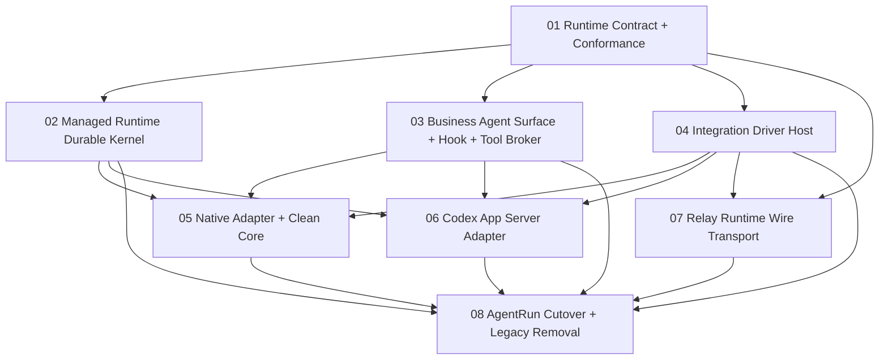

# Agent Runtime 架构重构实施计划

## 1. 实施策略

本次重构采用“公共合同与持久内核先行、Adapter 纵向切换、最后删除旧架构”的方式。允许在开发分支的短暂阶段使用编译迁移代码，但每个工作包完成时必须有唯一事实源，不保留兼容 facade、dual write、旧 schema fallback 或按 connector 类型分流。

父任务是唯一 Trellis lifecycle/branch/archive 单元；实际代码按父任务内 `workstreams/` 的八个可独立验收工作包实施。

## 2. 全局工程约束

- 所有新 contract 类型由 AgentDash own，不 re-export任何vendor DTO。
- canonical ID 使用 newtype；source ID 只存在 Driver Host/Adapter。
- mutation 必须 durable accept before side effect；terminal/event persistence error 必须传播并收敛状态。
- authoritative event 不走可丢 broadcast；transient delta 可以。
- descriptor/profile 由 behavior tests 支持，不接受 default no-op 或 capability 自报。
- migration 同步提交；不为旧数据库字段提供 runtime fallback。
- 切换某条路径时删除对应旧实现、硬编码 composition 与误导命名。
- 不触碰工作区中与本任务无关的既有修改。

## 3. 工作包 01：Runtime Contract、Wire 与 Conformance Harness

### 目标

建立 dependency-light 的 AgentDash-owned runtime vocabulary、wire schema、profile predicates、errors 与共享 behavior test harness，为后续所有模块提供唯一语言。

### 主要工作

- 定义 RuntimeThread/Turn/Item/Interaction/Operation/Binding/Checkpoint/Revision IDs。
- 定义 `AgentRuntimeGateway` 的 command/snapshot/event 类型。
- 定义 driver SPI 的 command/event/descriptor/error，不实现 concrete driver。
- 定义逐trigger `HookProfile`、`HookRequirement`、delivery mechanism与semantic strength。
- 建立 Input/Instruction/Tool/Workspace/Interaction/Lifecycle/Context/Telemetry profiles。
- 定义 CommandAvailability 与 semantic provenance。
- Rust contract 同源生成 TypeScript/JSON Schema；禁止 vendor type alias。
- 建立 common state-machine、terminal、unsupported、profile intersection conformance helpers。
- 重建 Runtime Wire envelope、request/response/notification 与 protocol violation。

### 验收

- contract crate 不依赖 application/domain repository/vendor protocol/transport。
- Thread/Turn/Item/Interaction/Operation ID 不可混用。
- unknown critical frame、unsupported command 与 malformed lifecycle 有 typed behavior。
- profile intersection、availability predicate 和 exactly-one terminal contract tests 通过。
- 旧 Backbone/vendor类型尚未删除时，也不能被新 contract 引用。

## 4. 工作包 02：Managed Runtime Durable Kernel、Context/Compaction 与 Hook Orchestration

### Depends On

- 01 Runtime Contract、Wire 与 Conformance Harness

### 目标

实现 Thread/Turn/Item/Interaction/Operation 的唯一状态机、持久 operation journal、context checkpoint/head、compaction saga、recovery 与 outbox。

### 主要工作

- 实现 `execute/snapshot/events` gateway。
- 建立 per-thread operation sequence、idempotency、expected revision admission。
- 实现 Turn/Item/Interaction exactly-one terminal 与 `Lost`。
- 实现 durable event journal、outbox、cursor read 和 transient stream 分离。
- 将 context recipe/materialization/checkpoint/head/restore/fork/compaction 迁入 Managed Runtime。
- 实现 candidate durable -> idempotent driver activation -> head CAS -> terminal 的 saga。
- 实现 driver generation fencing、late event quarantine 和 crash recovery workers。
- 实现revisioned HookPlan绑定、lifecycle trigger orchestration、actionful HookTrace/effect持久化与恢复；执行位置由bound HookProfile选择。
- 创建/迁移数据库表、约束、索引；删除该层被替代的旧 projection/head 写入路径。

### 验收

- operation accept、state、event、outbox 同事务。
- event append 与 active head/projection 不再分离。
- 三个 compaction crash point可恢复，live/restart context不分叉。
- persistence failure 不允许 Turn 假完成。
- `thread/read` 与 `thread/context/read` fidelity 明确分开。
- migration 在空库与代表性预研数据上均成功，旧 active 状态不会冒充可恢复。

## 5. 工作包 03：Business Agent Surface、Hook、Capability Pack 与 Platform Tool Broker

### Depends On

- 01 Runtime Contract、Wire 与 Conformance Harness

### 目标

把散落的 AgentFrame/context/tool/VFS/MCP/Skill/Hook surface 组装收敛成业务 Agent 模块，并为外部 Agent 提供真实 callable tool channel。

### 主要工作

- 定义immutable `AgentSurfaceSnapshot`，作为AgentFrame、Capability Pack与product facts编译后的期望surface与requirements聚合。
- 定义 ContextRecipe、ContextEnvelope、ToolCatalogRevision、WorkspaceRequirement。
- 将 AgentFrame 与 Capability Pack 展开为 Skill/Tool/MCP/Workflow/Permission/Hook/Context contributions。
- 将workflow/project/story/task/run hook sources编译为revisioned HookPlan与逐trigger requirements；Executor不解析业务规则。
- 将 tool assembly、context frame selection/delivery plan 从 application runtime session 迁出。
- 建立 Tool Broker direct callback 与 session-scoped MCP façade。
- 实现 tool identity、policy、permission、VFS、credential、timeout/cancel/idempotency。
- 实现 surface/profile compatibility 与 Pack required contribution admission。
- 将`AgentSurfaceSnapshot`与Driver Host提供的`RuntimeOffer`求交为`BoundAgentSurface`，固定逐项delivery route、semantic strength、revision与digest。
- 实现HostLifecycle、ToolBroker、DriverCallback、NativeArtifact、Observed与SteerApproximation delivery规划。
- AgentFrame revision持久化HookPlan ref/digest/requirements，移除仅替换live HookRuntime snapshot的采用方式。
- 明确 outer hooks、broker hooks、inner hooks 与 mailbox semantic strength。

### 验收

- 外部 driver 不再接收 `DynAgentTool` trait object、application delegate 或本地 VFS 对象。
- PromptOnly 不驱动 tool/Skill/system instruction availability。
- brokered tool call保留 Thread/Turn/Item/Tool/Binding generation 全坐标。
- MCP credential只在local/materialization boundary解引用。
- required Pack contribution缺失会typed incompatible，不静默降级。

## 6. 工作包 04：Integration Runtime Driver Host

### Depends On

- 01 Runtime Contract、Wire 与 Conformance Harness

### 目标

把 Agent service 变成受信 Integration contribution，建立 service definition/instance/offer/factory/binding/placement/router，并退役硬编码 connector discovery。

### 主要工作

- 改造 Integration API 为 `AgentRuntimeDriverContribution { definition, factory }`。
- 实现 AgentServiceDefinition、AgentServiceInstance、RuntimeOffer、RuntimeBinding、DriverLease、SourceIdMap。
- Driver `describe`经descriptor validation、service instance状态、transport guarantee与host policy归一为`RuntimeOffer`；Host不编译AgentFrame或Capability Pack。
- 实现配置 schema、credential slots/refs、health、driver generation 与 activation。
- Runtime Router 严格按 durable binding 分发。
- 实现 service/transport/host policy profile intersection。
- Native/Codex/Enterprise Remote 的 composition root改为 Integration contribution；具体 adapter 可由后续工作包完成。
- Driver descriptor逐trigger声明HookProfile与delivery mechanism，Host只做校验、求交和binding。
- Binding固定BoundHookPlan、plan/artifact digest、configuration boundary与per-point apply status；required route未ack时不dispatch。
- RuntimeBinding同时固定offer/profile digest、BoundAgentSurface digest与AppliedAgentSurface revision；Adapter只materialize已绑定surface。
- 删除 Composite capability OR、broadcast cancel/approval、first-live-session probe。

### 验收

- 新 Agent service 不修改 application/executor 硬编码分支即可注册。
- 同一 Integration 可贡献多个 service definition，一个 definition 可创建多个 instance。
- Thread binding sticky，旧 generation event 不推进状态。
- disabled/unhealthy/credential unavailable有 typed admission，且不产生 side effect。
- Relay 不再作为 Agent service identity。

## 7. 工作包 05：Native Runtime Adapter 与 Clean Agent Core

### Depends On

- 02 Managed Runtime Durable Kernel
- 03 Business Agent Surface 与 Tool Broker
- 04 Integration Runtime Driver Host

### 目标

将现有 Pi/Native 路径改造成统一 runtime contract 的 reference adapter，同时把 Agent Core 清理为 provider/tool-loop 核心。

### 主要工作

- Native Integration contribution/driver 适配 Thread/Turn/Item/Interaction/Context operations。
- 将 provider/tool-loop 与 AgentDash lifecycle/context/persistence 分离。
- Core 移除 Codex type、AgentDash summary prompt、runtime compaction policy 与 projection ownership。
- Native adapter应用 ContextEnvelope/ToolCatalog revision、runtime hook points、mailbox与approval。
- Native adapter将HookPlan映射到明确的Agent Core delegate facets，并返回applied revision/digest。
- 实现 exact context export/import、idempotent checkpoint activation 和 managed compaction。
- 以 Native 路径跑完整 L4/reference conformance。
- 切断 Pi connector旧入口及其 application runtime session依赖。

### 验收

- Clean Core 可在没有 AgentRun/repository/Codex/backbone 的测试中独立运行。
- Native Thread restart/fork/compaction保持 exact checkpoint/digest。
- active tool surface update有 revision/applied ack；不再 default `Ok(())`。
- before-provider/tool/stop等 inner hooks只有Native/profile支持时开放。
- 对应旧 connector与重复 context restore路径删除。

## 8. 工作包 06：Codex App Server Runtime Adapter

### Depends On

- 02 Managed Runtime Durable Kernel
- 03 Business Agent Surface 与 Tool Broker
- 04 Integration Runtime Driver Host

### 目标

用完整 Codex App Server Protocol 能力重写 adapter，将 vendor DTO限制在 adapter 内，并诚实声明 context/tool/interaction保证。

### 主要工作

- 对齐选定 `references/codex`/依赖版本，消除 Rust/npm protocol 漂移。
- 映射 Thread start/resume/fork/read、Turn start/steer/interrupt、Item lifecycle/delta。
- structured/multimodal UserInput 无损映射，删除 fallback text flatten。
- 映射 base/developer instructions、additional context、workspace roots/model/config。
- dynamic_tools + `item/tool/call` 接 Tool Broker。
- approval/user-input/MCP elicitation进入 durable Interaction；删除auto accept/empty/null。
- JSON-RPC/source IDs映射、terminal/Lost、protocol violation与generation fencing。
- native compaction只声明Observed/Opaque；如本阶段需要L4，增加exact context/prepare/activate扩展并与Codex Core协同实现。
- 将Codex支持的hook trigger按native config/script artifact materialize并验证applied digest；不支持的trigger只按Host/Broker/Observed/SteerApproximation真实强度声明。
- callback/steer近似不能冒充BeforeTool同步block、BeforeProvider改写或BeforeStop same-loop decision。
- 优先生成按digest不可变的Codex plugin/capability artifact与单bridge，通过selected capability root绑定；不覆盖用户项目`.codex/hooks.json`。
- AgentDash自行计算bridge/manifest/schema/adapter完整ArtifactDigest；Codex currentHash只作native trust证据，禁止正式路径使用bypass trust。
- `hooks/list`与`hook/started/completed`只用于apply evidence/reconcile；当前无register/Host decision RPC，只有sync command handler可声明可执行。
- 删除旧 Codex bridge 与 follow-up=fork/cancel=kill 等错误语义。

### 验收

- Codex protocol type不出adapter crate。
- 图片/typed input、instructions、dynamic tool callback、approval/user input均有端到端测试。
- interrupt等待canonical terminal，EOF不Completed。
- thread/read不宣称exact context，native compact不推进platform head。
- 未实现hot tool update时返回明确 boundary/rebind requirement，不假成功。

## 9. 工作包 07：Relay Runtime Wire Placement Transport

### Depends On

- 01 Runtime Contract、Wire 与 Conformance Harness
- 04 Integration Runtime Driver Host

### 目标

将 Relay 从第二套 session runtime/薄 prompt backend 收敛为 AgentDash-owned Runtime Wire 的透明 placement transport。

### 主要工作

- 传输 typed command/receipt/event/descriptor，不再嵌 `serde_json::Value` Backbone。
- 保持 canonical runtime coordinates、service provenance、binding generation。
- 实现 ordered frame sequence、ack/cursor/replay、disconnect/timeout、backpressure。
- local侧终止具体 Native/Codex/Enterprise adapter；cloud侧不重跑第二套SessionRuntime。
- transport descriptor参与 effective profile intersection。
- 删除 RelayPromptRequest、session sink owner猜测和缺失terminal producer路径。

### 验收

- Relay不拥有Agent service ID、context/tool业务语义或connector capability。
- authoritative events在lag/reconnect下不丢失，duplicate replay幂等。
- active turn断连exactly-one Lost；恢复只改变placement/binding health。
- remote路径与local路径使用同一Managed Runtime state machine。

## 10. 工作包 08：AgentRun Cutover、UI Availability 与 Legacy Removal

### Depends On

- 02 Managed Runtime Durable Kernel
- 03 Business Agent Surface 与 Tool Broker
- 04 Integration Runtime Driver Host
- 05 Native Runtime Adapter 与 Clean Agent Core
- 06 Codex App Server Runtime Adapter
- 07 Relay Runtime Wire Placement Transport

### 目标

让 Application/API/UI 全量切换到 AgentRunRuntime facade 与 runtime snapshot/events，删除旧 runtime-session、connector、protocol、persistence 和硬编码 composition。

### 主要工作

- 实现 AgentRunRuntime inspect/send/compact/steer/interrupt/resolve/read facade。
- AgentRun/AgentFrame mailbox/product receipt映射到canonical operation/thread。
- API/UI消费CommandAvailability、profile provenance、semantic strength与durable cursor。
- 删除按 executor/connector type 的UI/API分支。
- 删除 `application-runtime-session` crate、pass-through bridges、重复launch classification。
- 删除 AgentConnector/Composite、ConnectorCapabilities/default no-op。
- 删除 Backbone双事实、Relay薄prompt协议、旧表/字段与未使用migration。
- 更新 Trellis architecture/session/capability/backbone/runtime gateway specs。
- 跑 workspace质量门禁与关键端到端流程。

### 验收

- 生产 composition中不存在 Pi/Codex/Relay connector硬编码。
- Application 不依赖 driver/vendor/context repository内部类型。
- 所有按钮/命令从 bound profile + session state 推导。
- 搜索不到旧 runtime-session/connector capability/false success路径。
- 新数据库schema为唯一读写路径；无兼容层、双写或fallback。
- Native、Codex、Enterprise remote代表性E2E通过。

## 11. 父任务最终验收

父任务在所有工作包完成后执行一次全局依赖与状态事实源审计：

1. 用依赖图确认 application -> runtime -> driver host -> adapter/core 的方向没有反向依赖。
2. 用数据库与事件测试确认 Operation、Turn terminal、Interaction、Context head 的唯一写者。
3. 用 profile/conformance matrix核对每个 Integration service descriptor。
4. 用进程重启、Relay断线、compaction crash、duplicate command、late event 场景验证 recovery。
5. 用 `rg` 清点旧 connector、application runtime session、vendor DTO泄漏、untyped Value与default no-op。
6. 更新架构规范只记录最终职责与选择依据。

## 12. 并行建议

- 01 完成后，02/03/04 可并行。
- 02/03/04 稳定后，05/06 可并行；07可在01/04后提前开始transport skeleton，但最终E2E依赖Managed Runtime。
- 08 必须最后进行，负责唯一切换和彻底删除旧实现。

Adapter工作包之间不共享vendor DTO，只共享 owned contract 与 conformance harness，因此可以由不同Agent独立领取。

ACP不在首期实现计划中。若后续出现明确外部订阅需求，可在canonical Runtime Event Stream之上新增只读ACP projection adapter；它不参与Runtime binding、driver lifecycle或Relay authoritative transport。
