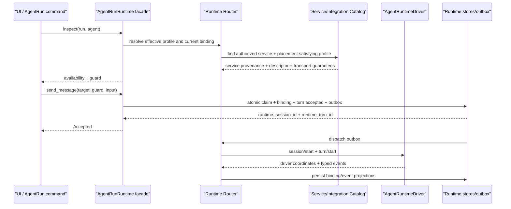
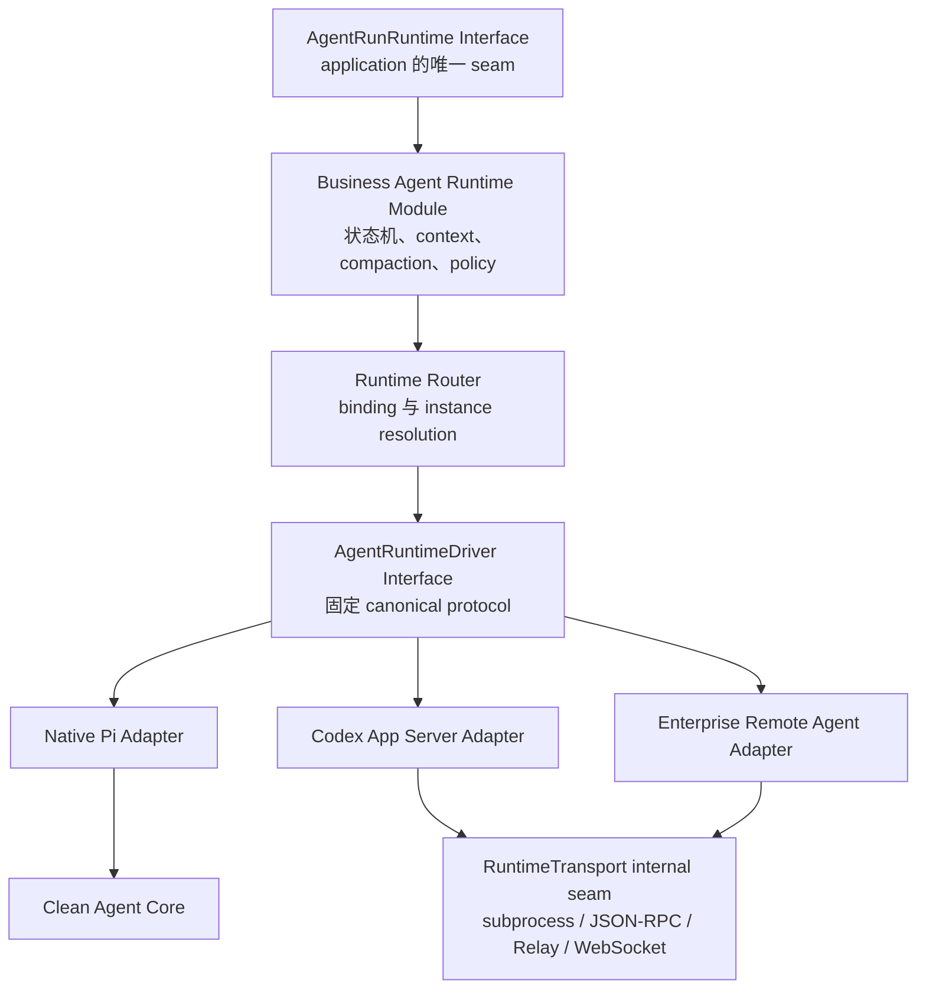

# DESIGN-IT-TWICE 方案：AgentRun-first Agent Runtime seam

> 方案定位：优先优化最常见的 AgentRun 调用方，使首次发送、续聊、运行中控制和上下文操作都通过具名、强类型的 AgentRun interface 完成。调用方不接触 connector、Integration instance、远端 session id、restore 策略或 compaction 内部状态机。
>
> 本方案刻意不同于两个极端：它不是只有一个 `execute(Command)` 的极小 interface，也不允许 Integration 任意注册 operation/schema 的最大插件扩展 interface。它选择一个稳定、由宿主拥有、覆盖 AgentRun 核心语义的中等宽度 interface，以换取默认路径最短、UI availability 最可信、跨 driver 行为最一致。

## 1. 问题空间与设计约束

### 1.1 当前调用方并没有一个真正的 Runtime seam

当前 application-agentrun 需要拼装或穿透多个浅 module：

- `crates/agentdash-application-agentrun/src/agent_run/runtime_session_boundary.rs:119-200` 将 session core、steering、eventing 等拆成多个 port/service，许多方法只是向下转发；
- `crates/agentdash-application-ports/src/launch/command.rs:11-21` 把 `HttpPrompt`、`LocalRelayPrompt`、`ContextCompaction` 等来源硬编码进 launch command；
- `crates/agentdash-application-agentrun/src/agent_run/delivery_runtime_selection.rs:1-250` 为每个控制用例重复解析 LifecycleRun、LifecycleAgent、AgentFrame、delivery binding、execution anchor 和 runtime session；
- `crates/agentdash-application-agentrun/src/agent_run/context_compaction_command.rs:145-260` 定义专用 runtime port，以维护 prompt 启动 compact-only turn，再轮询 manual request repository；
- `crates/agentdash-application-agentrun/src/agent_run/conversation_snapshot.rs:681-700` 主要从 execution state 推导 compact availability，steering 则通过另一个动态 bool补齐；
- `crates/agentdash-spi/src/connector/mod.rs:42-50` 的 `ConnectorCapabilities` 只有少数 bool；
- `crates/agentdash-integration-api/src/integration.rs:68-77` 让受信 Integration 直接返回 live `Arc<dyn AgentConnector>`，宿主再在 `crates/agentdash-api/src/integrations.rs:270-295` 调用 `list_executors()` 做全局 executor id冲突检查。

这些 seam 几乎逐项暴露了实现复杂性。按 deletion test 删除它们，复杂性不会集中消失，而会散回 AgentRun 各命令、SessionRuntime、connector 和 API/UI；说明当前抽象主要是 pass-through，没有形成足够 depth。

### 1.2 本方案必须满足的约束

1. AgentRun 最常见调用方只拥有 `run_id + agent_id + 用户输入`，不应知道 runtime session、executor session、Integration instance 或 driver。
2. “发送消息”应自动选择首次 start 或既有 session continuation；调用方不负责判断 resume、rehydrate 或 external thread resume。
3. compact、steer、interrupt、approval、read context 必须是稳定的一等业务操作，不能伪装成 prompt 或 JSON extension。
4. UI 不自己组合 capability bool 与 execution state；它读取 Runtime module 给出的 operation availability 和 stale guard。
5. Integration 是受信、编译期、宿主级扩展；明确不引入动态 dylib/WASM。此约束来自 `.trellis/tasks/06-04-plugin-extension-taxonomy/design.md:12,42-44,67-73`。
6. Extension 与 Capability Pack 仍是数据驱动安装内容，不能承载 native runtime code。
7. 运行期可以管理 Agent service instance、配置、credential refs、健康状态和 binding。无需重新编译即可接入的企业远端 Agent，通过宿主内置的通用 remote Agent protocol driver 与 wire protocol接入；企业 Agent仍是被发布、选择和绑定的service/driver，Relay不是它的Integration identity。
8. Native Pi、Codex、企业内部 Agent service都必须套入同一个宿主runtime lifecycle；Relay只透明承载该协议并贡献transport guarantee，不能被当作另一种Agent service能力。
9. 不支持的操作必须在产生副作用前返回 typed unavailable/unsupported；不 fallback、不静默 no-op、不退化为普通 prompt。
10. 项目尚未上线，迁移直接替换旧 interface、事件和数据库字段，不维护双轨。

### 1.3 DESIGN-IT-TWICE 中的定位

三类方案的差异不只是方法数量，而是 seam placement：

| 方向 | seam | 调用方承担的知识 | 主要代价 |
|---|---|---|---|
| 极小 command bus | `execute(RuntimeCommand)` | 必须理解大 command enum、状态机、binding 与错误阶段 | 类型表面小，真实 interface 仍很大；常见调用不自然 |
| 最大 Integration 扩展 | `invoke(operation_name, schema, payload)` | UI/application 要理解插件自定义操作和降级语义 | 灵活但核心 invariant 无法统一，容易回到 stringly protocol |
| **本 AgentRun-first 方案** | 具名 `AgentRunRuntime` interface | 只理解 AgentRun 的 7 类核心用例、guard 与 accepted/terminal 区分 | 中央 interface 较宽，新增一等语义需升级宿主 protocol |

本方案认为 AgentRun 的 start/continue/compact/steer/interrupt/approval/context 是产品稳定语义，不是插件扩展点。把它们明确写入 interface，反而能提高 depth：一个具名调用隐藏 selection、binding、restore、capability negotiation、driver mapping、事件持久化、并发控制和终态收口。

## 2. 推荐 seam：一个面向 AgentRun 的深 facade

### 2.1 Module 与 Interface

推荐 Module 名称：`agentdash-agent-run-runtime`。

它在 application-agentrun 与通用 Agent Runtime 之间建立唯一外部 seam。其 Interface 不是底层 app-server protocol，也不是 driver trait，而是 AgentRun 调用方真正需要的操作：

```rust
#[async_trait]
pub trait AgentRunRuntime: Send + Sync {
    async fn inspect(
        &self,
        target: AgentRunRef,
    ) -> Result<AgentRunRuntimeView, AgentRunRuntimeError>;

    /// 首次发送时创建并绑定 runtime session；已有 binding 时续聊。
    /// 调用方不选择 start/resume/rehydrate。
    async fn send_message(
        &self,
        command: SendAgentRunMessage,
    ) -> Result<Accepted<TurnAcceptance>, AgentRunRuntimeError>;

    /// running 时持久安排在 active turn 后执行；idle 时接受 maintenance turn。
    async fn compact_context(
        &self,
        command: CompactAgentRunContext,
    ) -> Result<Accepted<CompactionAcceptance>, AgentRunRuntimeError>;

    async fn steer_active_turn(
        &self,
        command: SteerAgentRunTurn,
    ) -> Result<Accepted<SteerAcceptance>, AgentRunRuntimeError>;

    async fn interrupt_active_turn(
        &self,
        command: InterruptAgentRunTurn,
    ) -> Result<Accepted<InterruptAcceptance>, AgentRunRuntimeError>;

    async fn resolve_approval(
        &self,
        command: ResolveAgentRunApproval,
    ) -> Result<Accepted<ApprovalAcceptance>, AgentRunRuntimeError>;

    async fn read_context(
        &self,
        query: ReadAgentRunContext,
    ) -> Result<AgentRunContextView, AgentRunRuntimeError>;

    async fn read_events(
        &self,
        query: ReadAgentRunEvents,
    ) -> Result<AgentRunEventPage, AgentRunRuntimeError>;
}
```

该 Interface 有八个入口，明显不是“极小接口”。但每个入口对应一个稳定、可独立授权和展示的 AgentRun 用例，调用方无需构造通用 command envelope 或理解 driver extension。它的 depth 来自每个入口背后隐藏的大量行为，而非减少方法名本身。

实时订阅可以是同一 Module 的 transport binding，例如 HTTP/SSE 将 `read_events(after_seq)` 循环/推送；不应把 live fanout 实现暴露给 AgentRun 调用方。若 Rust 内部确需 stream，可在 Interface 中增加 `subscribe_events(query)`，但事件类型必须与 `read_events` 完全相同。

### 2.2 默认调用路径

最常见 composer 提交路径只需：

```rust
let view = runtime.inspect(AgentRunRef { run_id, agent_id }).await?;

let accepted = runtime
    .send_message(SendAgentRunMessage {
        target: view.target,
        command_id: ClientCommandId::from(request.client_command_id),
        guard: view.commands.send_message.guard,
        input: request.input,
        actor: request.actor,
    })
    .await?;
```

调用方没有：

- connector/executor 字符串；
- Integration instance id；
- runtime session id；
- follow-up executor session id；
- `LaunchSource`；
- restore mode；
- context frames / delivery plan；
- driver capability 分支。

Module implementation 根据 binding 自动决定：

```text
没有 binding  -> 解析 AgentFrame runtime profile -> 选择 Integration instance
              -> 原子创建 binding + runtime session + accepted turn -> driver start

已有 binding  -> 读取 pinned instance/driver/protocol/guarantees
              -> 验证 continuation guarantee -> restore/resume -> accepted turn
```

这条路径故意不提供普通调用方的 `with_executor(...)`。运行目标属于 AgentFrame / project execution profile，Integration instance 选择属于 Runtime Router。用户显式切换 Agent 服务应先形成新的 AgentFrame revision或明确的 rebind/fork 用例，不能在某次 send 中偷偷改变 session owner。

### 2.3 start 与 continuation 为什么合并成 `send_message`

AgentRun 产品动作是“给这个 Agent 发消息”。首次 start 还是 continuation 是 binding 状态，不应成为每个调用方必须做的选择。

返回值仍显式告诉调用方实际路径：

```rust
pub struct TurnAcceptance {
    pub session_id: RuntimeSessionId,
    pub turn_id: RuntimeTurnId,
    pub disposition: TurnDisposition,
}

pub enum TurnDisposition {
    SessionStarted,
    SessionContinued,
    SessionRehydrated,
}
```

这样 interface 保持自然，诊断和测试又不会丢失实际语义。显式 fork 不是 send 的 option；它属于 AgentRun fork/materialization 用例，应创建新 AgentRun/binding 后再走默认 send。

### 2.4 Module 隐藏的 implementation

`AgentRunRuntime` 背后至少隐藏：

- AgentRun/AgentFrame/current delivery 的解析与校验；
- runtime profile 与授权策略；
- Integration Catalog、instance revision、credential refs、健康与 protocol negotiation；
- deterministic routing 与 durable binding；
- runtime/executor typed ID translation；
- context materialization、authority channel、tool/capability assembly；
- session start/resume/rehydrate/fork 的 driver 映射；
- command receipt、幂等 claim、transactional outbox；
- accepted/start/item/terminal event 状态机；
- compaction scheduling、summary/replacement、projection commit；
- approval/steer/interrupt 与 active turn 并发控制；
- EOF、driver crash、protocol violation 到 `Lost` 的收口；
- event page/live fanout 和 UI projection。

删除这个 Module，上述复杂性会重新散回所有 AgentRun 命令和 UI availability resolver，因此它满足 deletion test。

## 3. AgentRun-first 类型设计

### 3.1 Typed IDs

所有 ID 都使用 newtype，不允许跨命名空间比较裸 `String`：

```rust
pub struct AgentRunId(Uuid);
pub struct LifecycleAgentId(Uuid);
pub struct AgentFrameId(Uuid);
pub struct ClientCommandId(String);

pub struct RuntimeBindingId(Uuid);
pub struct RuntimeSessionId(Uuid);
pub struct RuntimeTurnId(Uuid);
pub struct RuntimeItemId(Uuid);
pub struct RuntimeCommandId(Uuid);
pub struct RuntimeEventId(Uuid);
pub struct RuntimeApprovalId(Uuid);
pub struct ContextSnapshotId(Uuid);
pub struct ContextCompactionId(Uuid);

pub struct IntegrationDefinitionId(String);
pub struct IntegrationInstallationId(Uuid);
pub struct AgentServiceInstanceId(Uuid);

pub struct DriverSessionId(String);
pub struct DriverTurnId(String);
pub struct DriverItemId(String);
```

`Driver*Id` 只存在于 executor implementation、binding/source coordinates 和诊断中。AgentRun application/UI 的 guard、command 和 event 主坐标只接受 `Runtime*Id`。

### 3.2 Target、guard 与 accepted response

```rust
pub struct AgentRunRef {
    pub run_id: AgentRunId,
    pub agent_id: LifecycleAgentId,
}

pub struct AgentRunCommandGuard {
    pub view_revision: u64,
    pub frame_id: AgentFrameId,
    pub binding_revision: Option<u64>,
    pub expected_active_turn_id: Option<RuntimeTurnId>,
}

pub struct Accepted<T> {
    pub command_id: RuntimeCommandId,
    pub client_command_id: ClientCommandId,
    pub accepted_at: DateTime<Utc>,
    pub value: T,
}
```

`Accepted` 只代表命令已经原子记录并将被执行，不代表 turn、interrupt、approval 或 compaction 已完成。最终结果只能来自 typed terminal event或后续 `inspect/read_events`。

guard 来自 `inspect`，统一替代各命令自行拼 snapshot id、active turn id和 runtime session id。若 view 已过期，Module 在任何 driver side effect 前返回 `Stale`。

### 3.3 具名 command

```rust
pub struct SendAgentRunMessage {
    pub target: AgentRunRef,
    pub command_id: ClientCommandId,
    pub guard: AgentRunCommandGuard,
    pub input: Vec<UserInputBlock>,
    pub actor: RuntimeActor,
}

pub struct CompactAgentRunContext {
    pub target: AgentRunRef,
    pub command_id: ClientCommandId,
    pub guard: AgentRunCommandGuard,
}

pub struct SteerAgentRunTurn {
    pub target: AgentRunRef,
    pub command_id: ClientCommandId,
    pub expected_turn_id: RuntimeTurnId,
    pub input: Vec<UserInputBlock>,
}

pub struct InterruptAgentRunTurn {
    pub target: AgentRunRef,
    pub command_id: ClientCommandId,
    pub expected_turn_id: RuntimeTurnId,
    pub reason: InterruptReason,
}

pub struct ResolveAgentRunApproval {
    pub target: AgentRunRef,
    pub command_id: ClientCommandId,
    pub approval_id: RuntimeApprovalId,
    pub expected_turn_id: RuntimeTurnId,
    pub decision: ApprovalDecision,
}

pub enum ApprovalDecision {
    Approve { scope: ApprovalScope },
    Reject { reason: Option<String> },
    Answer { answers: Vec<ApprovalAnswer> },
}
```

`CompactAgentRunContext` 不要求调用方选择 `next_turn` 或 `compact_only`。implementation 根据 active turn 状态决定：

- running：原子记录 `ScheduledAfterTurn(active_turn_id)`；
- idle/terminal：接受 maintenance compaction turn；
- starting/cancelling/lost：在副作用前返回 typed unavailable/conflict。

这比当前 application 自己创建 manual request、决定路径、启动 prompt、轮询 750ms 更有 depth 和 locality。

### 3.4 inspect 与 operation availability

```rust
pub struct AgentRunRuntimeView {
    pub target: AgentRunRef,
    pub view_revision: u64,
    pub execution: RuntimeExecutionView,
    pub binding: Option<RuntimeBindingView>,
    pub support: EffectiveRuntimeSupport,
    pub commands: AgentRunOperationAvailability,
    pub waiting_approvals: Vec<ApprovalView>,
    pub context: ContextHeadView,
}

pub struct OperationAvailability {
    pub state: AvailabilityState,
    pub guard: AgentRunCommandGuard,
    pub requirement: OperationRequirement,
}

pub enum AvailabilityState {
    Enabled,
    Disabled {
        code: AvailabilityCode,
        reason: String,
    },
}
```

UI 只使用 `state/code/reason/guard` 渲染按钮并提交命令；不自行判断 `level >= X` 或 capability bool。`support` 和 `requirement` 可以用于诊断、管理页和解释性 UI，但不是另一个业务事实源。

availability 由同一个 Module 结合以下事实计算：

- AgentRun/AgentFrame/ownership/authorization；
- execution state 和 active turn；
- 是否已有 binding；
- 新 session 是否存在符合 profile 的 healthy instance；
- binding固定的effective guarantees；该值是service guarantee、placement transport guarantee与host policy的交集；
- context ownership/fidelity；
- pending approval / compaction / interrupt；
- stale guard revision。

## 4. Integration definition、instance 与 runtime binding

### 4.1 继承项目 canonical taxonomy

本方案不把 Agent service 做成动态代码插件。项目既有 taxonomy 已确认：

- **Integration**：受信、编译期、宿主级、深集成；
- **Extension**：Project 级数据驱动工作台扩展；
- **Capability Pack**：Agent 级数据驱动能力捆绑；
- Shared Library：数据资产分发伞。

因此 Agent Runtime 是新的 `IntegrationKind::AgentRuntime`。一个受信 Integration contribution可注册native driver factory或通用remote Agent protocol driver factory；运行期创建、更新和禁用的是service instance，不是装载任意代码。由这些driver发布的Pi、Codex或企业Agent service descriptor才是Router选择的运行主体。

无需重新编译的企业内部 Agent 接入方式是：部署方编译进受信的通用 remote Agent protocol driver；企业用户创建企业 Agent service instance，配置 endpoint、credential refs 和所需 protocol。企业 Agent通过固定 AgentDash Runtime wire protocol发布自身service descriptor并表达能力，不把企业代码加载进宿主。Relay若参与，只改变该service的placement/transport，不创建另一种Agent service Integration。

### 4.2 Definition、Installation、Instance 的职责

```rust
pub struct AgentRuntimeIntegrationDefinition {
    pub id: IntegrationDefinitionId,
    pub version: SemVer,
    pub display: IntegrationDisplay,
    pub runtime_protocol_versions: VersionRange,
    pub instance_config_schema: JsonSchema,
    pub credential_slots: Vec<CredentialSlotDefinition>,
    pub isolation: DriverIsolationRequirement,
    pub declared_guarantee_ceiling: RuntimeGuarantees,
}

pub struct IntegrationInstallation {
    pub id: IntegrationInstallationId,
    pub definition_id: IntegrationDefinitionId,
    pub definition_version: SemVer,
    pub host_scope: HostScope,
    pub trust_record: TrustRecord,
    pub state: InstallationState,
}

pub struct AgentServiceInstanceRevision {
    pub instance_id: AgentServiceInstanceId,
    pub revision: u64,
    pub installation_id: IntegrationInstallationId,
    pub scope: InstanceScope,
    pub config: JsonValue,
    pub credential_refs: Vec<CredentialRef>,
    pub enabled: bool,
}
```

- Definition 是编译期 contribution 的稳定身份、配置 schema 与 guarantee ceiling，不包含凭据和用户配置。
- Installation 把受信 definition/version 固定到某个宿主部署，不代表一个可执行 Agent endpoint。
- Instance revision 是运行期可管理的 Agent service 配置。凭据只保存引用，由 credential broker在实例化 driver时按 scope解析。service identity与placement分开；同一个instance可以由本机registry发布为local service，也可以被cloud记录为remote placement下的同一service provenance。
- 配置更新产生 immutable revision。已有 runtime binding 固定旧 revision；新 binding 使用新 revision。

当前 `AgentDashIntegration::agent_connectors() -> Vec<Arc<dyn AgentConnector>>` 应替换为 definition/factory contribution：

```rust
pub trait AgentDashIntegration: Send + Sync {
    fn agent_runtime_integrations(
        &self,
    ) -> Vec<AgentRuntimeIntegrationContribution>;
}

pub struct AgentRuntimeIntegrationContribution {
    pub definition: AgentRuntimeIntegrationDefinition,
    pub factory: Arc<dyn AgentRuntimeDriverFactory>,
}
```

这仍是编译期静态装配。它只把 factory 注册到宿主，不创建 live connector，也不扫描全局 executor string ID。

### 4.3 Driver factory 与 descriptor

```rust
#[async_trait]
pub trait AgentRuntimeDriverFactory: Send + Sync {
    fn definition_id(&self) -> &IntegrationDefinitionId;

    async fn instantiate(
        &self,
        instance: ResolvedAgentServiceInstance,
        host: DriverHostContext,
    ) -> Result<Arc<dyn AgentRuntimeDriver>, DriverInitError>;
}

pub struct AgentServiceDescriptor {
    pub instance_id: AgentServiceInstanceId,
    pub instance_revision: u64,
    pub driver_fingerprint: String,
    pub negotiated_protocol: RuntimeProtocolVersion,
    pub targets: Vec<RuntimeTargetDescriptor>,
    pub guarantees: RuntimeGuarantees,
    pub health: RuntimeHealth,
}

pub struct RuntimePlacementDescriptor {
    pub host_id: RuntimeHostId,
    pub kind: RuntimePlacementKind,
    pub transport: TransportDescriptor,
    pub transport_guarantees: TransportGuarantees,
}
```

Definition 的 guarantee ceiling 是“这个编译期 adapter 最多可能实现什么”；descriptor 是 instance handshake 后的实际能力。最终 effective guarantee 是：

```text
(definition ceiling
 ∩ 当前 service driver/version 的 conformance certificate
 ∩ service instance handshake descriptor)
∩ placement transport guarantees
∩ host policy
```

driver不能通过自报bool绕过conformance，transport也不能提升service guarantee。某项guarantee没有被service证书、handshake、当前transport和host policy同时允许，就视为unsupported。本机registry发布service descriptor；cloud registry持久化同一definition/instance/driver provenance，并额外记录remote placement与transport guarantees，而不是把Relay包装成另一个service descriptor。

### 4.4 Durable runtime binding

```rust
pub struct AgentRuntimeBinding {
    pub id: RuntimeBindingId,
    pub target: AgentRunRef,
    pub session_id: RuntimeSessionId,

    pub instance_id: AgentServiceInstanceId,
    pub instance_revision: u64,
    pub definition_id: IntegrationDefinitionId,
    pub definition_version: SemVer,
    pub driver_fingerprint: String,
    pub protocol_version: RuntimeProtocolVersion,
    pub runtime_target_id: String,
    pub guarantees_hash: String,

    pub placement: RuntimePlacementDescriptor,
    pub effective_guarantees_hash: String,

    pub driver_session_id: Option<DriverSessionId>,
    pub state: RuntimeBindingState,
    pub revision: u64,
}
```

binding 是 AgentRun 与具体 Agent service instance 的 durable ownership 事实。它必须满足：

- 首次 accepted turn 与 binding 在同一事务建立；
- 一个 AgentRun current delivery 同时只有一个 current binding；
- continuation 永远使用 binding pinned instance revision和 protocol；
- driver source id和remote placement坐标可以变化/补全，但必须通过binding revision CAS，且不能改变service provenance；
- driver source id可以变化/补全，但必须通过 binding revision CAS；
- instance disable 后不接受新 binding；已有 binding不自动切换到其它 instance；
- installation 卸载在存在非终止 binding时应被拒绝，除非先显式关闭或执行可验证的 context export/import migration；
- definition upgrade 不静默升级现有 binding。新 definition version用于新 installation/instance revision；旧 binding若对应 implementation不可用，返回 `BindingUnavailable`，不 fallback。

### 4.5 最常见的 definition -> instance -> binding 路径



有binding的continuation路径跳过service reselection，只加载pinned instance revision和placement并验证二者仍可运行。remote transport可在不改变service provenance与effective guarantees的前提下重建连接；不能静默换成另一个Agent service。这样默认路径短且可预测，也避免CompositeConnector每次根据live session猜owner。

## 5. Driver 层级：清楚区分业务 facade、runtime driver 与 transport

### 5.1 推荐层级



建议退役现在的 `AgentConnector` 名称，因为它同时承担 discovery、runtime protocol、transport、session registry 和 capability provider，语义过宽。若保留“connector”一词，只用于 `RuntimeTransportConnector` 这类字节/连接层 implementation，不再作为 application-facing Agent 抽象。

### 5.2 Driver Interface

Driver seam 位于 business runtime 与具体 Agent 实现之间。它可以比 AgentRun facade更 protocol-oriented，但仍使用宿主固定 enum，而不是插件自定义 JSON operation：

```rust
#[async_trait]
pub trait AgentRuntimeDriver: Send + Sync {
    fn descriptor(&self) -> &AgentServiceDescriptor;

    async fn bind_session(
        &self,
        request: DriverSessionBind,
    ) -> Result<DriverSessionBinding, DriverError>;

    async fn dispatch(
        &self,
        command: DriverCommand,
    ) -> Result<DriverCommandAccepted, DriverError>;

    async fn read_context(
        &self,
        query: DriverContextQuery,
    ) -> Result<DriverContextSnapshot, DriverError>;

    async fn subscribe(
        &self,
        session: DriverSessionId,
        after: DriverEventCursor,
    ) -> Result<DriverEventStream, DriverError>;
}

pub enum DriverCommand {
    StartTurn(DriverTurnStart),
    SteerTurn(DriverTurnSteer),
    InterruptTurn(DriverTurnInterrupt),
    CompactContext(DriverContextCompact),
    ResolveApproval(DriverApprovalResponse),
    ReplaceTools(DriverToolSetReplace),
    CloseSession(DriverSessionClose),
}
```

`bind_session` 明确区分 start/resume/fork/rehydrate intent；`dispatch` 的 enum由宿主 protocol拥有。企业 Integration 可以选择只实现部分 command，但 unsupported 必须在 descriptor中可见，并在 dispatch 前由 Router拦截。

### 5.3 为什么 Driver 允许较小，而 AgentRun facade 不做极小 command bus

Driver 的调用方只有一个 Business Runtime Module，适合用固定 protocol enum集中 adapter mapping。AgentRun facade有多个产品调用方与 UI operation，需要具名方法提高可发现性、授权 locality和错误清晰度。

把两者都压成同一个 `execute(json)` 看似减少类型，实际上会迫使 application 学习 driver protocol；把两者都扩展为插件任意 operation，则无法保证 common lifecycle。两个 seam 服务不同调用方，因此 Interface 形状应该不同。

## 6. Level、Profile 与 Guarantee

### 6.1 三者不能互相替代

- **Guarantee**：单项能力的精确、可测试语义，是 availability 的权威输入。
- **Level**：严格递进的 conformance 摘要，便于人理解和粗筛；由宿主从 verified guarantees 推导，driver不能任意自报。
- **Profile**：宿主拥有的产品需求集合，用于 AgentFrame/runtime selection；不是 Integration 自定义 operation 集合。

### 6.2 严格递进 Level

```rust
pub enum RuntimeLevel {
    Turn,           // typed input + accepted/start + exactly-one terminal
    Conversation,   // + durable continuation after runtime/process restart
    Interactive,    // + expected-turn steer + protocol interrupt + approval round-trip
    ManagedContext, // + inspectable semantic context + durable projection compaction
}
```

Level 的判定必须严格：缺任何该级必需 guarantee，就只能落在更低级。某个 driver可能拥有少量高阶正交能力但仍不满足完整 level；这些能力仍显示在 guarantees中，不能因此提升 level。

例如 Codex adapter可能支持原生 compact notification，却没有可投影 snapshot和 durable replacement，它不能成为 ManagedContext；即使支持 steer，若 approval/interrupt terminal未闭环，也不能成为 Interactive。

### 6.3 宿主拥有的 Profile

```rust
pub enum AgentRuntimeProfile {
    SingleTurnV1,
    StatefulConversationV1,
    InteractiveConversationV1,
    ManagedConversationV1,
}
```

每个 profile 是 versioned guarantee predicates：

- `SingleTurnV1`：structured text input、exactly-one turn terminal；
- `StatefulConversationV1`：SingleTurn + durable executor resume或 semantic platform rehydrate；
- `InteractiveConversationV1`：Stateful + expected-turn steering、protocol interrupt terminal、approval round-trip；
- `ManagedConversationV1`：Interactive + platform-readable semantic context、exact replacement provenance、durable compaction projection。

AgentFrame 选择 profile；Router 选择满足 profile 的 instance。Integration不能注册一个名字相同但语义不同的 profile。

### 6.4 建议的 Guarantee 形状

```rust
pub struct RuntimeGuarantees {
    pub turn_lifecycle: TurnLifecycleGuarantee,
    pub input: InputGuarantee,
    pub session_continuity: SessionContinuityGuarantee,
    pub steering: SteeringGuarantee,
    pub interrupt: InterruptGuarantee,
    pub approval: ApprovalGuarantee,
    pub context: ContextGuarantee,
    pub compaction: CompactionGuarantee,
    pub tools: ToolUpdateGuarantee,
}

pub enum SessionContinuityGuarantee {
    OneShot,
    LiveProcessOnly,
    DurableExecutorResume,
    PlatformRehydrate { fidelity: RestoreFidelity },
}

pub enum SteeringGuarantee {
    Unsupported,
    ActiveTurn {
        expected_runtime_turn: bool,
        ordered_delivery: bool,
    },
}

pub enum InterruptGuarantee {
    Unsupported,
    ProcessAbortOnly,
    ProtocolInterrupt { terminal: TerminalGuarantee },
}

pub enum ApprovalGuarantee {
    Unsupported,
    RoundTrip {
        command: bool,
        file_change: bool,
        question: bool,
    },
}

pub enum CompactionGuarantee {
    Unsupported,
    NativeOpaque,
    DurableProjection {
        summary: SummaryGuarantee,
        boundary: ReplacementBoundaryGuarantee,
        atomic_head_advance: bool,
    },
}
```

`ProcessAbortOnly` 与 `NativeOpaque` 可以用于管理诊断或 adapter-specific动作，但不满足 AgentRun common `interrupt` / `compact_context` availability。common operation只暴露能兑现业务 invariant 的强 guarantee。

### 6.5 UI/application availability 映射

| AgentRun 操作 | 静态 guarantee | 动态状态 | 不满足时行为 |
|---|---|---|---|
| `send_message` 首轮 | Turn lifecycle exactly-once；输入形态受支持 | 存在授权且健康的 instance | `runtime_profile_unavailable`，不建 binding |
| `send_message` 续聊 | durable resume 或 semantic platform rehydrate | binding active、无 active turn | `continuation_unavailable` 或 `active_turn_conflict` |
| `compact_context` | `DurableProjection` | idle，或 running 可 durable schedule | `managed_compaction_unsupported` |
| `steer_active_turn` | expected-runtime-turn + ordered delivery | active turn id精确匹配 | `steering_unsupported` / `stale_active_turn` |
| `interrupt_active_turn` | protocol interrupt + exactly-one terminal | starting/running/cancelling 的目标 turn | `interrupt_unsupported`；不以 kill 模拟成功 |
| `resolve_approval` | 对应 approval kind round-trip | approval pending且属于目标 turn | `approval_kind_unsupported` / `approval_already_resolved` |
| `read_context` | inspect fidelity满足 query | binding/context head可读 | `context_fidelity_insufficient` |

UI 读取 Module 已计算的结果；application policy也调用同一 availability evaluator，不复制表格逻辑。

## 7. Context ownership、snapshot fidelity 与 read context

### 7.1 Context ownership 必须唯一

```rust
pub enum ContextOwnership {
    PlatformManaged,
    ExecutorManaged,
}
```

- `PlatformManaged`：AgentDash 的 context snapshot/head是 canonical；driver每轮消费平台 materialization。Native Pi应采用此模式。
- `ExecutorManaged`：外部 runtime拥有 canonical context；平台 transcript只是观测记录，不能假装等于可恢复 context。Codex app-server默认属于此模式。

不定义含糊的 `Hybrid`。若 executor能导出 snapshot，仍需明确谁能提交下一 revision。只有存在通过 conformance 验证的 transactional export/replace协议时，executor-managed driver才可兑现 `DurableProjection`。

### 7.2 Fidelity 不是一个 bool

```rust
pub struct ContextSnapshotGuarantee {
    pub inspect: ContextInspectFidelity,
    pub restore: ContextRestoreFidelity,
    pub provenance: ContextProvenanceFidelity,
}

pub enum ContextInspectFidelity {
    Unavailable,
    PresentationTranscript,
    SemanticStructured,
    CanonicalLossless,
}

pub enum ContextRestoreFidelity {
    None,
    SameDriverNative,
    CanonicalPortable,
}

pub enum ContextProvenanceFidelity {
    None,
    EventCutoff,
    ExactReplacementBoundary,
}
```

- `PresentationTranscript` 只适合 UI 展示，不能 resume/compact；
- `SemanticStructured` 保留 role/authority/content/tool call/result/order，可被同协议语义恢复；
- `CanonicalLossless` 还保留所有影响执行的 context channels、tool revision、source refs、compaction provenance；
- `SameDriverNative` 可以是 opaque snapshot，只能交还同一 driver/version，不等于 inspectable；
- common durable compaction要求 `ExactReplacementBoundary`。

### 7.3 read context Interface

```rust
pub struct ReadAgentRunContext {
    pub target: AgentRunRef,
    pub at: ContextRevisionSelector,
    pub minimum_fidelity: ContextInspectFidelity,
}

pub struct AgentRunContextView {
    pub session_id: RuntimeSessionId,
    pub snapshot_id: ContextSnapshotId,
    pub revision: u64,
    pub through_event_seq: u64,
    pub ownership: ContextOwnership,
    pub fidelity: ContextSnapshotGuarantee,
    pub materialized: Option<CanonicalContextDocument>,
    pub presentation: Option<ContextPresentation>,
    pub compaction_head: Option<ContextCompactionId>,
}
```

默认 UI 查询可以要求 `PresentationTranscript`；调试或迁移工具要求 `SemanticStructured/CanonicalLossless`。若 driver只提供 opaque native snapshot，Module不会把它伪装成 `materialized`，只在 binding diagnostics中显示“存在同 driver可恢复 snapshot”。

## 8. Durable compaction 设计

### 8.1 facade 语义

`compact_context` 的同步结果只是：

```rust
pub enum CompactionAcceptance {
    ScheduledAfterTurn {
        compaction_id: ContextCompactionId,
        after_turn_id: RuntimeTurnId,
    },
    MaintenanceTurnAccepted {
        compaction_id: ContextCompactionId,
        turn_id: RuntimeTurnId,
    },
}
```

completion/noop/failure 通过 typed event：

```rust
ContextCompactionStarted
ContextCompactionNoop { reason }
ContextCompactionCommitted {
    base_snapshot_id,
    new_snapshot_id,
    summary_ref,
    replacement_boundary,
    provenance,
}
ContextCompactionFailed { error }
```

### 8.2 事务与顺序

对于 PlatformManaged context：

1. command acceptance原子写入 command receipt、compaction aggregate和 schedule/maintenance turn；
2. Business Runtime从固定 `base_snapshot_id + revision` 计算 compaction candidate；core/driver不得先替换 live canonical context；
3. 持久化事务以 CAS 校验 base head，原子写入 summary/replacement、new snapshot、compaction committed event并推进 active head；
4. 只有事务成功后，live runtime切换到 committed snapshot；下一 provider call只能读取 committed head；
5. CAS冲突产生 typed `ContextRevisionConflict`，不覆盖更新、不回退 head；
6. projection commit失败时 compaction不能报告 Completed，原 head保持 active；
7. live runtime若无法采用已提交 snapshot，binding进入 `Desynchronized/Lost`，禁止继续 turn，避免内存与重启恢复分叉。

Native Pi 的 summary生成可由 clean core提供 pure candidate primitive，但调度、持久化和 head commit属于 Business Runtime Module。

对于 ExecutorManaged context：

- 只有 `NativeOpaque` 时，只能执行明确的 executor-native maintenance operation并记录 telemetry；common `compact_context` 不可用；
- 要支持 `DurableProjection`，driver必须提供经 conformance验证的 prepare/export/replace/commit或等价原子协议，并返回 exact boundary/provenance；
- `thread/compacted` 这种无 replacement provenance 的 notification不能推进平台 head。

### 8.3 不再需要 manual request 轮询

当前 `ManualContextCompactionRequest` 和 750ms轮询是 application 对 runtime状态机的间接观察。目标状态下：

- command、compaction aggregate、maintenance turn、typed events属于同一 Runtime Module；
- AgentRun receipt直接引用 `ContextCompactionId`；
- UI从 event/view读结果；
- 删除专用 `AgentRunContextCompactionRuntimePort`、maintenance prompt和轮询；
- compaction schedule在进程重启后仍由持久 command log恢复。

## 9. Commands、events 与并发不变量

### 9.1 Canonical events

```rust
pub struct RuntimeEventEnvelope {
    pub event_id: RuntimeEventId,
    pub session_id: RuntimeSessionId,
    pub turn_id: Option<RuntimeTurnId>,
    pub item_id: Option<RuntimeItemId>,
    pub sequence: u64,
    pub occurred_at: DateTime<Utc>,
    pub source: RuntimeEventSource,
    pub event: RuntimeEvent,
}

pub struct DriverCoordinates {
    pub instance_id: AgentServiceInstanceId,
    pub driver_session_id: Option<DriverSessionId>,
    pub driver_turn_id: Option<DriverTurnId>,
    pub driver_item_id: Option<DriverItemId>,
}
```

payload主坐标始终是 Runtime IDs；driver coordinates只是 source mapping。Backbone 可成为这套 notification/persisted event 的 wire形态，但不能继续直接复用 vendor structs或 `SessionMetaUpdate(key, value)` 表达核心事实。

### 9.2 顺序与 exactly-once invariant

1. 每个 runtime session 的 accepted commands按单调 `command_sequence` 排序；
2. 同一 session至多一个 active turn；
3. `TurnAccepted` 先于 driver side effect，`TurnStarted` 在 driver明确接受后产生；
4. 每个 accepted turn恰好一个 `Completed/Failed/Interrupted/Cancelled/Lost` terminal；
5. driver/transport EOF before terminal => `Lost`，绝不推断 Completed；
6. item start/update/terminal遵循同一单调 session event sequence；
7. steer 必须携带 `expected RuntimeTurnId`，Router依据 binding映射为 DriverTurnId；
8. interrupt acknowledgement不等于 terminal；command accepted后继续等待该 turn terminal；
9. approval response仅能 resolve一次，且 approval、session、turn三者必须匹配；
10. tools/context revision在 turn start拍快照；turn中改变通过有序 command/event表达，不能无声 mutate；
11. compact 与 normal turn不能并行推进同一 context head；running时 compaction只能 durable schedule在 terminal之后；
12. binding、turn accepted和 dispatch outbox同事务，避免“数据库认为未启动但 driver已启动”；
13. external event依 `event_id + driver cursor` 幂等 ingest，重复通知不产生第二 terminal；
14. command的 `ClientCommandId` 在 AgentRun target内唯一；同 id不同 payload返回 `IdempotencyConflict`。

### 9.3 send 与 mailbox 的关系

AgentRun mailbox仍属于 application产品语义。`send_message` 要求当下没有 active turn；若运行中收到普通用户消息：

- AgentRun mailbox决定排队，稍后调用 `send_message`；或
- 用户明确选择 promote/steer，且 availability允许时调用 `steer_active_turn`。

Runtime Module不自行把普通 send猜成 steer，因为两者对 transcript、input acknowledgement和模型时序的语义不同。

## 10. Failure semantics

### 10.1 发生 side effect 前的同步错误

```rust
pub enum AgentRunRuntimeError {
    NotFound { target: MissingTarget },
    Unauthorized { operation: AgentRunOperation },
    Stale {
        reason: StaleReason,
        current_view_revision: u64,
    },
    Unavailable {
        operation: AgentRunOperation,
        code: AvailabilityCode,
        required: OperationRequirement,
        offered: EffectiveRuntimeSupport,
    },
    Conflict {
        state: RuntimeExecutionState,
        active_turn_id: Option<RuntimeTurnId>,
    },
    BindingUnavailable {
        binding_id: RuntimeBindingId,
        instance_id: AgentServiceInstanceId,
        reason: BindingUnavailableReason,
    },
    IdempotencyConflict { client_command_id: ClientCommandId },
    Persistence { code: String, retryable: bool },
}
```

这些错误保证 driver尚未收到命令。特别是 unsupported profile、disabled instance、secret缺失、protocol不兼容、stale active turn 都必须在 acceptance事务前失败。

### 10.2 accepted 后的异步失败

一旦返回 `Accepted`，失败通过事件收口：

```rust
pub struct RuntimeFailure {
    pub code: RuntimeFailureCode,
    pub scope: FailureScope,
    pub retryable: bool,
    pub message: String,
    pub source: RuntimeFailureSource,
    pub driver_data: Option<JsonValue>,
}
```

- driver拒绝/启动失败 -> `TurnFailed`；
- transport断开/进程消失/critical payload解析失败 -> `TurnLost`；
- protocol interrupt成功 -> 等待 `TurnInterrupted`；
- compaction projection失败 -> `ContextCompactionFailed`，normal turn不得被误报成功；
- persistence在接收外部 event时失败 -> 停止 acknowledgement/推进 cursor，重试 ingest；不能吞错继续。

Application不会捕获 `ConnectorError::Runtime(String)` 再自行合成 terminal。terminal属于 Runtime Module单一事实。

## 11. Adapter 套用

### 11.1 Native Pi Integration

- Definition：`agentdash.native-pi`，受信编译期 Integration；
- Instance：provider/model/permission默认配置和 credential refs；
- Driver：in-process `NativePiRuntimeDriver`；
- Context：`PlatformManaged + CanonicalLossless + CanonicalPortable`；
- Compaction：`DurableProjection`；core只生成 candidate，不先 mutate live context；
- Level：目标应达到 `ManagedContext`；
- Adapter 下方调用 clean Agent Core。

### 11.2 Codex App Server Integration

- Definition：`openai.codex-app-server`，受信编译期 adapter；
- Instance：binary/npm版本、working policy、credential refs；
- Driver：将 canonical command映射到 ThreadStart/Resume/Fork、TurnStart/Steer/Interrupt、approval response和 ThreadCompactStart；
- Context：默认 `ExecutorManaged`；snapshot fidelity按真实 app-server能力协商；
- Compaction：若只能收到 `thread/compacted`，只声明 `NativeOpaque`；
- continuation必须使用 durable binding区分 resume与fork；
- Rust protocol crate与实际启动的 npm app-server版本必须由 Definition compatibility matrix和 handshake统一，不能继续各自硬编码不同版本；
- Level：完成 interrupt/approval/ID mapping前不能宣称 Interactive；无 exact snapshot/provenance不能宣称 ManagedContext。

### 11.3 Relay placement transport

Relay既不是Agent service Integration，也不是能力主体；它是现有Pi、Codex或企业Agent service的remote placement transport Adapter：

- 本机Agent Service Registry发布`AgentServiceDescriptor`，其中保留definition、instance revision、driver fingerprint、protocol和service guarantees；
- cloud registry持久化同一service provenance，并增加`RemotePlacement { backend_id, route, transport_descriptor }`，不能生成一个“Relay Agent”身份；
- Runtime Router选择的是`service descriptor + placement`，binding同时固定service provenance和remote placement；
- wire透明传输canonical runtime commands/events/typed IDs/binding coordinates，不重新定义薄prompt协议；
- cloud不再把`ExecutionTurnFrame`降为薄payload，本机也不重建第二套SessionRuntime语义；
- remote turn id通过binding显式映射；
- 最终bound profile/effective guarantees严格等于`service guarantees ∩ transport guarantees ∩ host policy`；Relay只能削弱，不能提升service能力；
- terminal必须由被放置的Agent runtime生产并透明传输；Relay EOF before terminal => Lost；
- transport可替换WebSocket/gRPC/in-memory loopback，但这些是内部seam，不进入AgentRun Interface。

### 11.4 企业内部自研 Agent

有两种受控方式：

1. 深度宿主集成：企业部署仓实现受信、编译期 `AgentDashIntegration` contribution和专用 DriverFactory；适用于需要宿主内资源、特殊认证或 in-process能力；
2. 无需重编译的远端接入：通过受信的通用remote Agent protocol driver创建企业Agent service instance，企业Agent实现固定wire protocol并向本机registry发布自己的service descriptor。它可以通过conformance suite证明Turn/Conversation/Interactive/ManagedContext中的某一级；经Relay发布到cloud时仍保持同一service provenance。

企业 Agent不能通过 runtime instance上传可执行 Rust/WASM，也不能自定义一个 common `operation_name`让 UI猜测含义。新业务操作若应成为 AgentRun通用语义，需要升级宿主 protocol；企业专有控制面留在 Integration管理/诊断界面，不混入 AgentRun core facade。

## 12. Dependency categories 与测试策略

按照 `codebase-design` 的 dependency categories：

| 依赖 | 类别 | seam / Adapter 策略 |
|---|---|---|
| guarantee匹配、availability、状态机、ID translation规则、context candidate算法 | In-process | 收进深 Runtime Module，直接通过 AgentRun Interface测试；不额外造 public port |
| Postgres command/event/binding/context/compaction store、transactional outbox | Local-substitutable | 使用真实本地数据库测试或完整 in-memory store Adapter；store seam保持 Module内部 |
| 企业自有远端 Agent service | Remote but owned | 固定runtime wire port位于Driver seam；生产用remote Agent protocol Adapter，测试用reference/in-memory Adapter |
| AgentDash cloud <-> local Relay placement | Remote but owned | transport port位于Driver下方internal seam；loopback测试typed frame透明性、ordering、terminal与transport guarantees，不赋予service能力 |
| Codex app-server、第三方 agent runtime | True external | 专用 Driver Adapter；用 fake JSON-RPC peer/mock验证映射与错误，不让 vendor type越过 seam |
| Native Agent Core | In-process | Native Driver内部依赖；通过 Runtime conformance和少量 core interface测试，不暴露给 application |
| Credential store/secret broker | Local-substitutable或部署 owned remote | DriverFactory接收 scoped `CredentialResolver` internal port；测试用 secret stand-in |

### 12.1 Interface 是测试表面

新的主测试应直接调用 `AgentRunRuntime`：

- 无 binding发送消息 -> 一次创建 binding和turn accepted；
- 第二次发送 -> continuation，不重复选择 instance；
- stale guard/重复 client command；
- capability不足时无 side effect；
- running compact durable schedule，重启后继续；
- compact CAS冲突与 projection事务；
- steer/interrupt/approval expected turn和exactly-once；
- disabled/upgraded instance不静默 reroute；
- read context fidelity gate；
- EOF -> Lost；
- event replay/live结果一致。

Service Driver conformance suite对Native、Codex fake和remote enterprise reference Adapter运行相同runtime协议案例；Transport conformance suite对Relay loopback验证typed frame透明性、ordering、ID correlation、terminal和断连语义。Service Level/Profile只能依据service suite生成，最终binding再与transport suite证书及host policy取交集。

当 facade测试覆盖后，应删除只验证 `SessionControlService` 向 port转发、专用 compaction port返回值等旧浅 module测试；replace，不在旧测试上再叠一层。

## 13. Depth、leverage、locality 评估

### 13.1 Depth

Interface 看起来比单 command bus宽，但调用方必须学习的事实很少：

- 一个 `AgentRunRef`；
- 一个 `inspect -> guard -> named command` 模式；
- accepted不等于terminal；
- event是最终事实。

调用方无需学习 Integration、driver、session restore、context ownership内部协议、compaction transaction或 vendor lifecycle，因此该 Module拥有较高 depth。

### 13.2 Leverage

同一个 implementation同时服务：

- HTTP composer；
- AgentRun mailbox scheduler；
- workflow/routine/companion投递；
- compact控制；
- workspace command availability；
- UI event/query；
- API tests和driver conformance。

一次修复 binding、guard、terminal或capability逻辑，所有调用方同时受益。

### 13.3 Locality

- start/continue判断集中于 Runtime Module；
- availability与执行验证共享同一 evaluator；
- Integration selection只在 Router；
- driver mapping只在对应 Adapter；
- compaction transaction只在 context runtime；
- typed event projection集中，不再让 application与前端各自解析 meta key。

这比把每个 use case各自做一个 port，或让 Integration提供任意 operation拥有更好的 locality。

## 14. 优势与代价

### 14.1 优势

1. 默认 AgentRun发送路径最短，start/continue自动完成；
2. UI获得最终 availability和guard，不复制 capability/state逻辑；
3. named methods让授权、错误和审计语义清晰；
4. Integration instance和driver完全隐藏，普通调用方不产生硬编码；
5. durable binding消除 CompositeConnector OR capability、广播 cancel和“第一个 live session”猜 owner；
6. context fidelity与compaction guarantee阻止外部 Agent被误认为Managed runtime；
7. 固定Driver protocol允许Native、Codex、企业Agent替换service Adapter，也允许Relay/WebSocket等替换placement transport Adapter；
8. 受信 Integration taxonomy保持不变，无动态代码加载风险；
9. accepted/terminal分离、outbox和exactly-one规则形成可验证失败语义；
10. Interface既是调用面也是测试表面。

### 14.2 代价

1. AgentRun facade有八个入口，不追求最小方法数；
2. 新增真正的一等 AgentRun操作需要中央 protocol/interface升级，企业 Integration不能自行扩展 common UI；
3. Module implementation较深，必须认真拆内部 seam和状态机，不能变成一个巨型文件；
4. `inspect -> guard -> command` 对UI通常是自然流程，但无界面调用方可能多一次读取或需要处理 `Stale`；
5. sticky binding不提供透明 failover；instance失效会显式阻塞现有session。这是为了上下文和会话正确性；
6. start/continue合并后，少数需要显式 fork/rebind的高级用例必须走单独AgentRun生命周期命令，不能塞进send option；
7. Host-owned profile限制了最大插件自由度，但换来了产品语义和conformance可比性。

## 15. 迁移影响与建议顺序

### 15.1 数据库 migration

需要新增或重塑：

- `integration_definitions` / installation记录（若definition由启动同步，可持久化可管理投影）；
- `agent_service_instances` 与 immutable `agent_service_instance_revisions`；
- credential refs关联，不保存secret值；
- `agent_runtime_bindings`：pinned instance/definition/driver/protocol/guarantee hash和driver coordinates；
- `runtime_commands` + transactional outbox；
- typed runtime event payload/version；
- canonical context snapshots/heads与compaction aggregate；
- approval records与command correlation。

现有 `session_meta.executor_session_id` 应迁移到 binding的 `DriverSessionId` coordinate；现有 manual compaction request并入 runtime command/compaction aggregate；generic `turn_terminal/context_compacted` meta迁移为 typed events。迁移完成后删除旧字段/表和旧读取路径，不双写。

### 15.2 实施顺序

1. 建立 typed IDs、AgentRun facade contract、operation availability和内存 reference implementation；
2. 建立 Integration definition/installation/instance revision、DriverFactory registry和durable binding migration；
3. 建立 canonical commands/events/errors、transactional outbox和exactly-one state machine；
4. 以 Native Pi Adapter打通 `inspect -> send -> events -> read_context`，把它作为 ManagedContext reference；
5. 将 durable compaction移入 Business Runtime，改为candidate + CAS commit，删除 manual prompt/polling；
6. 将 application-agentrun发送、steer、interrupt、approval、availability逐一切到 facade，并删除对应pass-through port；
7. 重写 Codex Driver，完成typed ID mapping、resume/interrupt/approval和真实guarantees；
8. 将Relay收敛为透明placement transport Adapter，wire直接传canonical protocol，local registry发布service descriptor，cloud保留同一service provenance与remote placement，删除薄Relay prompt DTO和双SessionRuntime；
9. 提供企业remote Agent protocol reference implementation、service descriptor发布示例与conformance kit；
10. 删除 `AgentConnector`、`CompositeConnector`、硬编码 connector/executor枚举、generic meta和前端双事实分支；
11. 运行 facade行为测试、driver conformance、database migration验证和前端contract check。

每一步完成后都删除被替代路径，避免 facade之下再包一层旧 `AgentConnector` 形成长期浅 wrapper。

## 16. 推荐结论

如果优化目标是“最常见 AgentRun 调用方最自然、默认路径最短”，推荐采用本方案：

- application只看到 `AgentRunRuntime` 的具名 interface；
- `send_message` 自动完成 start/continuation；
- `inspect`统一提供availability、guard和effective support；
- Integration是受信编译期definition/factory贡献，运行期管理service instance revision；
- 不重编译的企业Agent统一走受信通用remote Agent protocol driver与wire protocol，并作为独立service descriptor发布；
- durable binding固定instance/driver/protocol/guarantees，绝不静默reroute；
- Level用于摘要，Profile用于选择，Guarantee用于真实availability；
- Business Runtime拥有context和durable compaction，Driver只做canonical protocol Adapter；
- Native、Codex、企业Agent通过service conformance suite证明各自支持层级；Relay等placement transport通过独立transport conformance证明其不会破坏相应guarantee。

它牺牲了一部分接口极简和插件任意扩展性，但换来的 leverage 与 locality更符合 AgentRun 高频调用：调用方只表达“我想让这个 Agent 做什么”，而不是再次组装“这个 Agent Runtime 应该如何工作”。
