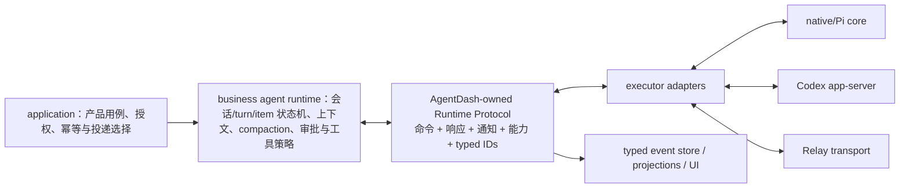

# Agent Runtime 协议、适配器与事件事实源调研

> 调研范围：`agentdash-agent-*`、`agentdash-executor`、`agentdash-application-*`、Relay、Backbone、前端会话投影，以及项目内已有架构规范和历史 compaction 设计。
>
> 本文只陈述当前代码事实、由事实支持的推论，以及面向本次大规模重构的建议。项目尚未上线，因此建议以单一正确模型直接替换旧实现，不设计兼容层或长期双轨。
>
> **范围更新（2026-07-10）：** 本文对`RemoteAcpBackend`误名的诊断仍有效，但首期不再建立ACP执行Adapter。ACP未来至多作为canonical Runtime snapshot/events之后的read-side presentation projection，见`acp-event-projection.md`。

## 1. 结论摘要

当前项目并不存在一套完整、统一、全双工的 Agent Runtime 协议。实际存在五组互相重叠但语义并不一致的接口：

1. application 层的产品命令与运行状态，例如启动 turn、取消、手动 compaction；
2. `AgentConnector` 的 Rust 内部调用面；
3. Backbone 的输出事件面；
4. Relay 的远端传输消息；
5. Codex app-server 的 JSON-RPC 协议。

这些接口没有共享同一个 session/turn/item 状态机，也没有共享同一组能力承诺。结果是：

- native Pi adapter 能拿到完整的 `ExecutionTurnFrame`，Codex adapter 只消费其中一小部分，Relay 则在云端到本机的传输中直接丢掉大部分字段；
- command 面拥有 compaction、steering、cancel、approval、tools update 等概念，但 event 面、capability 面和 transport 面没有对称表达；
- 平台 turn id、外部 executor turn id、Relay 两侧各自生成的 turn id 被放进相同字段或直接互相比对，ID 命名空间没有类型保护；
- application 通过通用 prompt 启动“上下文压缩”，但只有 Pi connector 将其解释为真正的 compaction；Codex 和 Relay 并不能兑现同一业务语义；
- Backbone nominally 是 canonical event，但终态和 compaction 仍依赖 `SessionMetaUpdate { key, value }` 这类 stringly-typed 旁路，前端也同时理解多套事实；
- Codex bridge 没有使用上游协议已经提供的 resume、interrupt、compact、approval 生命周期；Relay 则定义了 terminal 消息却没有发现正常生产者。

因此，问题不是“把几个 compaction 文件移动到 infra”即可解决。真正需要建立的是一条明确的运行时边界：



这里的关键判断是：

- **上下文投影、压缩策略、压缩后的替换边界与会话生命周期是业务 Agent Runtime 的职责，不是 application 编排细节，也不是 vendor adapter 的私有行为。**
- **executor 是协议适配层**：它把同一套 AgentDash Runtime Protocol 映射到 native core、Codex app-server 或远端 Relay，而不是为每个 executor 暴露一套隐含语义不同的 `prompt()`。
- **Backbone 应成为该协议的 typed notification/persisted-event 面**，不再作为另一套松散、只覆盖输出的协议。
- **“能力对齐”必须对齐语义保证，不是对齐方法名或布尔值。** 外部 Codex 原生 compact 若不能返回 summary、replacement boundary 和 provenance，就不能冒充平台可投影的 compaction。

## 2. 名义分层与真实依赖并不一致

项目规范给出的名义依赖顺序是：

`agentdash-agent-types -> agentdash-agent -> agentdash-spi -> agentdash-executor`

依据：`.trellis/spec/backend/directory-structure.md` 的 Agent 子系统说明。

但当前 Cargo 依赖揭示了另一种现实：

- `crates/agentdash-agent-types/Cargo.toml` 直接依赖 `codex-app-server-protocol`，通用类型层已经绑定 vendor wire type；
- `crates/agentdash-agent/Cargo.toml` 同时依赖 `agentdash-agent-types` 和 `agentdash-domain`，所谓 core 仍接触项目 domain；
- `crates/agentdash-spi/Cargo.toml` 依赖 agent types、domain 和 agent protocol；
- `crates/agentdash-executor/Cargo.toml` 反向依赖 `agentdash-application-ports`、SPI、domain、agent types、agent protocol，并可选依赖 agent core；
- `crates/agentdash-application-runtime-session/Cargo.toml` 又依赖 protocol/types/application ports/domain/relay/SPI；
- `crates/agentdash-application-agentrun/Cargo.toml` 在此之上继续承担 compaction 的命令和轮询行为。

这意味着“core / SPI / infra / application”的名字不能代表真正边界。尤其 `agentdash-agent-types` 和 `agentdash-agent-protocol` 已经将 Codex vendor 类型提升为平台类型，而 executor 又反向依赖 application port，形成了 ownership 倒置。

### 建议的依赖方向

建议最终收敛为以下单向关系；crate 名可以另定，但职责不能混合：

```text
agentdash-agent-runtime-protocol   # AgentDash 自有、无 application/domain/vendor 依赖
             ↑
agentdash-agent-core               # provider/tool loop 与纯算法原语
             ↑
agentdash-business-agent-runtime   # 会话/上下文/压缩/审批/工具策略和状态机
             ↑
agentdash-application-ports        # 产品用例调用 RuntimeControl
             ↑
agentdash-application              # 授权、幂等、投递与产品工作流

agentdash-executor                 # 实现 runtime protocol 的各 adapter；依赖协议与外部 SDK
agentdash-relay                    # 传输同一协议，不重新定义业务语义
```

如果内部 runtime 和外部 executor 都需要经过 executor 层对齐，那么 `business-agent-runtime` 可以由 native adapter 承载，但 application 面向的仍应是统一 `AgentRuntimeControl`；不能继续让 application 知道哪一个 connector 需要注入何种 delegate。

## 3. 当前协议实际上只统一了“部分输出事件”

### 3.1 Backbone 声称 canonical，但平台自有事件仍大量 stringly typed

`crates/agentdash-agent-protocol/src/backbone/event.rs:13-22` 将 Backbone 描述为 normalized canonical events，并在 `:24-67` 大量复用 Codex notification struct。平台扩展则位于 `backbone/platform.rs`。

关键问题：

- `crates/agentdash-agent-protocol/src/backbone/platform.rs:24-28` 使用通用的 `SessionMetaUpdate { key, value }`；
- compaction noop、failure、success 都由 Pi mapper 写入不同 key/value：`crates/agentdash-executor/src/pi_agent/stream_mapper.rs:1297-1405`；
- turn terminal 同样由 application 合成 `SessionMetaUpdate(key = "turn_terminal")`：`crates/agentdash-application-runtime-session/src/hub_support.rs:73-135`；
- eventing 再通过 key 和任意 JSON 识别 compaction：`crates/agentdash-application/src/eventing.rs:622-923`、`:1182-1190`；
- 前端同时识别 Codex `TurnCompleted` 和平台 `turn_terminal`：`packages/app-web/src/features/sessions/SessionChatViewModel.ts:14-18,71-94`、`packages/app-web/src/features/sessions/sessionStreamReducer.ts:204-219`。

这使得“canonical event”只在 enum 外壳层成立，关键业务事实仍隐藏在字符串和 JSON 中。编译器无法检查 compaction summary、boundary、terminal kind 等字段是否完整，也无法保证 producer/consumer 同步演进。

规范也已发生漂移：

- `.trellis/spec/cross-layer/backbone-protocol.md:3-7` 要求所有 connector 输出归一化到 Backbone；
- 同文件 `:101-109` 要求 platform event 结构化；
- 规范示例 enum（`:27-49`）没有当前代码中的 `ItemUpdated` 等变体。

### 3.2 AgentDash canonical types 实际是 Codex wire types

平台协议并非真正由 AgentDash 拥有：

- `crates/agentdash-agent-types/src/protocol.rs:1-22` 明确以 Codex types 为 canonical，并用 untagged union 将 `codex::ThreadItem` 和 native item 混合；
- `crates/agentdash-agent-protocol/src/backbone/user_input.rs:10-16` 直接把 Codex v2 `UserInput` alias 为平台 `UserInputBlock`；
- 同文件向内部 `ContentPart` 的转换中，remote image URL、Skill、Mention 等可能退化为文本；
- `backbone/event.rs:24-67` 直接复用 Codex notification payload。

这会把 vendor 的字段演进、ID 语义和 lifecycle 假设传播到应用、持久化和前端。`Cargo.toml:123` 当前将 Codex 固定在 `rust-v0.140.0`，`Cargo.lock:1855-1857` 锁到具体 commit；固定版本能稳定构建，但不能解决 ownership 错误。

建议将 Codex protocol 限制在 Codex adapter 内部。AgentDash 自有协议可以刻意采用类似 app-server 的 request/response/notification 形态，但类型、状态机和语义应由本项目拥有。Vendor payload 必须显式映射，不能 re-export 或 type alias。

### 3.3 command 面与 event 面不对称

`crates/agentdash-spi/src/connector/mod.rs:978-1086` 的 `AgentConnector` 提供：

- discover / live session；
- prompt；
- cancel / steer；
- approve / reject；
- tools update / session notification。

但它没有一套对应的 typed lifecycle：

- 没有 session start/resume/fork/close 的明确区分；
- 没有 turn accepted/started/terminal 的完整对称事件；
- 没有 compact command 和 compact result，compaction 被隐藏成 `ExecutionTurnMode` 再塞入 `prompt`；
- tool update 默认实现直接返回 `Ok(())`（`:1060-1086`），调用方无法区分“已生效”和“connector 静默忽略”；
- approval request 的声明存在于 `backbone/approval.rs`，但全局搜索未找到正常 producer；Codex bridge 也没有将 server request 转为该事件；
- `ConnectorError`（`:962-976`）主要是字符串型大类，无法承载 code、scope、retryable、source error data。

`ExecutionTurnFrame` 本身很丰富（`connector/mod.rs:224-353`）：包括 mode、hook runtime、capability state、runtime delegates、restore state、context frames、delivery plan、assembled tools。然而这不是 wire contract，只是进程内 struct，因此各 adapter 可以无声忽略字段。当前恰恰如此。

## 4. compaction 不是同一能力，只是共用了同一个入口

### 4.1 application 发起的是通用 prompt，不是 runtime compact 命令

手动压缩命令位于：

- `crates/agentdash-application-agentrun/src/context_compaction_command.rs:27-53`：命令与 outcome；
- `:82-140`：只依据 runtime execution state 判断，未检查所选 executor 的 compaction 能力；
- `:201-260`：通过 `LaunchCommand::context_compaction_input` 写入维护 prompt，并每 750ms 轮询请求状态。

UI 可用性也只基于模型、frame、runtime state：`crates/agentdash-application-agentrun/src/conversation_snapshot.rs:681-700`，没有 executor capability 条件。

启动规划器给每次 runtime 注入 `ManualContextCompactionDelegate`：`crates/agentdash-application-runtime-session/src/launch/planner.rs:173-196`；mode 在 `launch/plan.rs:325-338` 被标为 `ExecutionTurnMode::ContextCompaction`，最终所有 connector 仍统一调用 `connector.prompt(...)`：`launch/connector_start.rs:29-92`。

因此 application 认为它发出了“压缩”，SPI 实际只收到“特殊 mode 的 prompt”。只有 adapter 主动理解这个隐含约定，压缩才成立。

### 4.2 native Pi 能执行平台托管压缩

Pi 路径是当前唯一完整实现：

- `crates/agentdash-executor/src/pi_agent/connector.rs:663-688` 读取 mode，compact 时不发送普通 prompt parts；
- `:709-850` 组装 context frames、restore state、delegates 等完整 turn frame；
- `:870-875` 在 compact mode 调用 `agent.compact_context_only`，普通 turn 才调用 `agent.prompt`；
- `crates/agentdash-agent/src/compaction/mod.rs:1-4,100-230` 负责 cut point、summary 请求与 message replacement；
- `crates/agentdash-agent/src/agent_loop/streaming.rs:780-983` 负责 preflight、typed `AgentEvent` 与 runtime delegate callback；
- `crates/agentdash-executor/src/pi_agent/stream_mapper.rs:1286-1405` 将 AgentEvent 映射为 Backbone item/meta events；
- `crates/agentdash-application/src/eventing.rs:622-923` 再从 meta JSON 建立 compaction record、segments、head 和 context frame，并事务提交。

这一条链虽然功能完整，但 ownership 横跨 core、executor、application-runtime-session、application eventing：

- core 同时持有 provider loop 和项目所需的 replacement 语义；
- application-runtime-session delegate 直接依赖 domain repository 与 manual request store；
- executor 将业务结果降为 stringly meta；
- application eventing 再重建业务实体。

近期 compaction 规范正确强调了 structural maintenance turn、summary boundary 和冷维护时 repository rehydrate（`.trellis/spec/backend/context-compaction-projection.md:27-55,88-92`），但当前代码边界仍无法让其它 executor 复用同一保证。

### 4.3 Codex adapter 并没有执行这项 compaction

`crates/agentdash-executor/src/connectors/codex_bridge.rs` 的 prompt 路径没有读取 `context.turn.mode`。它每次启动一个新的 `npx codex app-server`，然后执行 ThreadStart/ThreadFork 和 TurnStart（主要流程位于 `:620-944`）。因此 application 发出的 maintenance prompt 在 Codex adapter 上仍是普通用户 prompt，而不是 `thread/compact/start`。

同时，虽然 Codex `rust-v0.140.0` 已经提供：

- `ThreadResumeParams`；
- `ThreadCompactStartParams` / `thread/compact/start`；
- `TurnInterruptParams`；

当前 bridge 的 import（`codex_bridge.rs:21-27`）及调用路径没有使用它们。当前只把 server 的 `thread/compacted` notification 映射成 `ExecutorContextCompacted` telemetry（`:526-533`）。历史调研已经确认该 notification 不提供平台 summary replacement 所需的完整 provenance，因此 `.trellis/spec/backend/context-compaction-projection.md:5` 将其限定为 executor telemetry 是正确的。

进一步后果：

- planner 注入的 `ManualContextCompactionDelegate` 只有 Pi adapter 会传给 agent core；Codex bridge 不消费 runtime delegates；
- application 创建的 manual compaction request 因而不会进入 native callback 所负责的 consumed/noop/failed/completed 生命周期；
- 命令轮询很可能只得到 `Launched`，随后产生一轮普通 assistant 输出，请求记录仍可能停留在 requested 状态。

这是高确定性结构问题，不应通过增加 Codex bridge 的特殊 if 分支草率修复。应先定义统一 compact command 的结果保证，再决定 Codex native compact 能否满足。

### 4.4 Relay 甚至不传输 compaction mode 与上下文计划

Relay prompt wire payload 位于 `crates/agentdash-relay/src/protocol/prompt.rs:17-37`，仅包含 session/followup/input/mount/working directory/env/executor/MCP。它不包含：

- `ExecutionTurnMode`；
- `ContextFrames`；
- context delivery plan；
- restored state；
- runtime delegates；
- capability state；
- assembled tools 与 VFS/tool policy。

云端 adapter 在 `crates/agentdash-application/src/relay_connector.rs:88-190` 将丰富的 `ExecutionContext` 投影成这份瘦 payload，丢失上述信息；本机 handler 再在 `crates/agentdash-application/src/local/handlers/prompt.rs:81-330` 创建一套新的本地 `SessionRuntime`。

因此 Relay 并不是把同一个 Agent runtime 远程化，而是把一条 prompt 请求送到另一套 application runtime 重跑。对于 compaction，这意味着云端的 mode、manual request 和 context projection contract 均不会被传过去。

### 4.5 需要区分两类压缩保证

建议协议显式区分：

1. `PlatformProjectionCompaction`：必须返回 summary、boundary、replacement refs/provenance，并能原子推进平台 context projection；
2. `NativeOpaqueCompaction`：只承诺 executor 自己缩短其上下文，平台只能记录 telemetry，不能据此推进 projection。

产品层若提供统一的“压缩上下文”动作，默认应该只面向第一类保证。若要让外部 Codex 与 native 真正对齐，需要扩展 Codex app-server 协议或 adapter 可用接口，使 compact 完成后能读取规范化 snapshot / replacement boundary；否则它只能作为另一项明确命名、能力可查询的 native operation，不能假装等价。

## 5. Codex bridge 的会话、取消、steering 与审批语义均未对齐

### 5.1 continuation 被实现为 fork，而不是 resume

application planner 会把已存的 executor session id 作为默认 follow-up：`crates/agentdash-application-runtime-session/src/launch/planner.rs:233-248`。

Codex bridge 对存在 follow-up id 的请求使用 `ThreadFork`（`codex_bridge.rs:285-301,881-913`），而不是 `ThreadResume`。于是普通 continuation 在外部 Codex 中实际具有 fork 语义。平台没有显式记录“沿用同一线程”和“从某线程分叉”之间的差异，后续 session binding 更难可信。

### 5.2 cancel 是杀进程，不是 turn interrupt

`codex_bridge.rs:66-88` 的 `CancelOnDrop` 会终止 app-server 进程；`cancel_session`（`:960-965`）只触发 cancellation token。它没有发送 Codex `turn/interrupt`，因此：

- executor 内部无法走完协议定义的 interrupted/terminal 生命周期；
- session continuity 与最后状态可能丢失；
- application 只能从进程/stream 结束猜测终态。

### 5.3 steering 比较了不同命名空间的 turn id

bridge 在 `:930-943` 把外部 Codex turn id 保存为 `active_turn_id`。而 application 传入的 `expected_turn_id` 是平台 turn id。`steer_session` 在 `:967-1009` 直接比较二者，然后再把外部 id用于 Codex steer。

这是高置信 ID namespace mismatch：两种 ID 没有类型区分，也没有一张 platform turn -> executor turn mapping，因此 capability 声称支持 steering 并不等于实际可可靠使用。

### 5.4 approval capability 与实际处理互相矛盾

bridge capabilities 在 `:578-587` 声称 cancel、steering、permission policy；但：

- server request handler 在 `:553-565` 对 command/file approval 自动接受，对 question 返回空答案；
- `approve_session` / `reject_session` 在 `:1012-1030` 明确 unsupported；
- Backbone 虽声明 `ApprovalRequest`，但未找到正常 producer。

因此用户审批既没有被提升成平台 typed request，也不能通过现有 response 方法闭环。自动接受行为还绕过了 application 的 policy/authorization 边界。

### 5.5 structured input 与 context channel 被压扁

`codex_bridge.rs:176-187` 使用 `PromptPayload::to_fallback_text()`，而 SPI 自己在 `connector/mod.rs:839-845` 说明该函数并非 delivery path。`context_frame_render.rs:3-22` 又把所有 frame 的 rendered text 拼进 user prompt，忽略 delivery metadata 以及 system/developer channel。

这与 Pi 的 `assemble_system_prompt`（`pi_agent/connector.rs:1166-1195`）形成明显差异：同一 `ExecutionTurnFrame` 在不同 adapter 上拥有不同 prompt authority 和结构化输入保证。

### 5.6 错误与未知消息处理过于宽松

- server notification 使用字符串 method match，并以 `if let Ok` 静默忽略 malformed payload（`:360-550`）；
- stdout 非法 JSON 直接 continue（`:763-766`）；
- JSON-RPC error response 只保留 message，丢失 code/data（`:774-777`）；
- unknown notification 仅 debug。

协议 adapter 可以容忍 vendor 扩展，但不能把“关键生命周期消息解析失败”当作不存在。至少需要按 method criticality 产出 typed protocol violation / lost terminal，并保留 source error data。

## 6. Relay 并未传输同一套 runtime，且终态闭环缺失

### 6.1 Relay 自己又定义了一套不完整协议

`crates/agentdash-relay/src/protocol.rs:34-85` 定义 prompt/cancel/steer 等 command；事件包括 session notification 与 runtime session state changed（`:406-426`）。但 session notification payload 是 `serde_json::Value`（`protocol/session_event.rs:3-9`），并未在 wire 边界保持 typed Backbone。

application ports 同时再定义一份 Relay transport contract：

- `crates/agentdash-application-ports/src/backend_transport.rs:66-115`：`RelayPromptTransport`；
- `:117-134`：另一份薄 `RelayPromptRequest`；
- `:165-198`：`RelaySessionEvent`、route、terminal kind。

也就是说 Relay wire 和 application port 不是 Runtime Protocol 的 transport binding，而是第三、第四套手工 DTO。

### 6.2 云端与本机各生成 turn id，却没有显式映射

云端 adapter 注册 cloud turn route 后调用 relay prompt，收到本机生成的 turn id却存入 `_turn_id` 并忽略：`crates/agentdash-application/src/relay_connector.rs:157-190`。

本机 handler 在 `local/handlers/prompt.rs:277-305` 启动本地 SessionRuntime 时生成自己的 turn id。因此至少存在：

- cloud platform turn id；
- local platform turn id；
- 可能存在的底层 executor turn id。

但 Relay 没有返回并持久化 typed mapping。cloud 发送 steering 时把 cloud expected turn id原样传到本机（`relay_connector.rs:289-315`，`local/handlers/prompt.rs:380-405`），本机 SessionControl 比对的则是 local active turn。由代码结构推断，steering 存在与 Codex bridge 类似的命名空间错配。

### 6.3 terminal message 有 consumer，但未找到正常 producer

Relay 协议定义 `EventRuntimeSessionStateChanged`，terminal kind 包含 Started/Completed/Failed/Cancelled（`protocol/session_event.rs:11-28`）。API 消费端位于 `crates/agentdash-api/src/relay/ws_handler.rs:646-683`。

全局检索未发现业务路径生产该事件；只发现 enum、测试和消费端。本机 forwarder 位于 `local/handlers/prompt.rs:493-535`，它持续转发 application session notification，但没有在终态产生 `EventRuntimeSessionStateChanged`，也没有在本地 turn terminal 后结束循环。

此外，本地转发的 `turn_terminal` notification 携带 local turn id；cloud ingestion 只在 terminal trace id等于 cloud turn id时接受终态（`crates/agentdash-application-runtime-session/src/launch/ingestion.rs:75-95`）。因此“依靠普通 notification 结束 cloud turn”也不成立。

这是一个高置信缺口：现有 Relay 单元测试通过手工注入 `RelaySessionEvent::Terminal` 验证 consumer，但未覆盖本机真实 producer 到云端 ingestion 的闭环。

### 6.4 stream EOF 被误判为 Completed

`launch/ingestion.rs:65-142` 在没有收到匹配 terminal event时，会把普通 stream close 当作 Completed（`:117-142`）。这会将：

- connector crash；
- app-server 被 kill；
- Relay backend disconnect；
- 协议解析失败后停止；

错误地记录为成功。正确协议应要求 exactly-one terminal notification；EOF before terminal 必须是 `Lost` 或 protocol failure，绝不能自动 Completed。

### 6.5 Relay 的“ACP”命名与实际能力不符

项目依赖 `agent-client-protocol`，但代码中实际用途主要是 re-export `ContentBlock` 等类型；标为 `RemoteAcpBackend` 的路径实质上是远程嵌套一套 AgentDash SessionRuntime，并非 ACP session runtime integration。

建议重构时直接以真实角色命名，例如 `RemoteAgentDashRuntime`。若未来确实支持 ACP，应另做一个实现 Runtime Protocol 的 ACP adapter，并通过 conformance suite 验证能力，而不是把 transport label 当作协议支持。

## 7. native、Codex、Relay 的当前实际保证对比

| 能力/语义 | Native Pi | Codex bridge | Relay 路径 |
|---|---|---|---|
| 读取完整 `ExecutionTurnFrame` | 是 | 部分字段 | 云端传输时大量丢失 |
| structured user input | 是 | 主要 flatten 为文本 | payload 有 input，但完整 delivery 语义丢失 |
| system/developer context channel | Pi 明确组装 | 全部拼为 user prompt | context frames 不传输 |
| repository restore | 显式支持 | 外部线程策略代替，未表达同一保证 | cloud state不传，本机重新构造 |
| session resume/fork 区分 | 平台内部可控 | continuation 一律 ThreadFork | 两侧各建 runtime，无稳定 binding |
| steering | connector 支持，但忽略 expected id检查 | platform/executor id错配 | cloud/local id错配 |
| interrupt/cancel | abort 并等待 runtime | kill process，未用 `turn/interrupt` | command 存在，终态闭环不完整 |
| platform projection compaction | 完整 | 不支持；只可接收 native telemetry | mode、delegate、projection contract 不传 |
| native opaque compaction | 可包装为平台结果 | 上游协议支持但 bridge未调用 | 未传 compact command |
| approvals | Pi connector 有 approve/reject | server request自动接受，response API unsupported | cloud connector unsupported |
| hot tool update | 实现 | 未见同等保证 | 未携带 assembled tools/update semantic |
| exactly-one terminal | application另行合成 | 依赖 mapper/EOF | terminal producer缺失；EOF可误判成功 |
| typed ID mapping | 无完整统一模型 | 缺失 | 缺失 |

这张表说明：当前 capability booleans 不能表达真正差异。

## 8. capability 模型本身不可信

`crates/agentdash-spi/src/connector/mod.rs:40-50` 的 capability 只有 cancel、steering、discovery、variants、model override、permission、source title 等布尔值，没有：

- context delivery/channel 保证；
- restore 与 session continuity；
- compact 类型与结果保证；
- approval round-trip；
- tool update acknowledgement；
- interrupt 的终态保证；
- structured input 支持等级；
- snapshot/import/export 能力。

更严重的是 composite connector 在 `crates/agentdash-executor/src/connectors/composite.rs:298-313` 对所有 connector 能力做 OR。这得到的是“集群中某个 connector 支持”，不是“当前选择的 executor/session 支持”。

同一 composite 的 session ownership 也不稳定：

- prompt 按 executor route（`:377-393`）；
- cancel 广播给全部 connector（`:395-410`），部分非 owner connector 返回 Ok 就可能造成假成功；
- approve/reject 逐个尝试（`:412-447`）；
- update/steer 按“第一个 live session”路由（`:450-500`），没有 durable session -> connector binding。

建议 capability 改为**按 executor definition 与已绑定 runtime session 查询的结构化支持声明**，并为每项能力描述 guarantee，而非 bool。例如：

```rust
enum CompactionCapability {
    Unsupported,
    NativeOpaque,
    PlatformProjection {
        returns_summary: bool,
        returns_boundary: bool,
        replacement_provenance: ReplacementGuarantee,
    },
}

enum InterruptGuarantee {
    Unsupported,
    ProcessAbortOnly,
    ProtocolInterrupt { terminal: TerminalGuarantee },
}
```

对于本项目最终正确状态，可以更严格：公开给业务层的 common operation 只保留满足业务 invariant 的强保证；弱保证留在 adapter-specific capability，不让 application 假设等价。

## 9. ID、生命周期与事实源问题

### 9.1 同一字段承载多种 ID 语义

Backbone envelope 只有字符串 `session_id` 和 trace `turn_id`：`crates/agentdash-agent-protocol/src/backbone/envelope.rs:7-23`。payload 内的 Codex thread_id/turn_id又可能保留外部值。

application 会先合成平台 `TurnStarted`：

- `crates/agentdash-application-runtime-session/src/launch/commit.rs:187-231`；
- `hub_support.rs:43-70`。

而 Codex native notification 内可能携带 source thread/turn，外层 envelope trace 仍是平台 turn id（`codex_bridge.rs` 的 `make_envelope` 约在 `:118-127`）。于是一个 event 同时含有两套坐标，却没有命名为 platform/executor source coordinate。

更明显的是 `UserInputSubmitted` 使用 `thread_id = session_id`（`hub_support.rs:16-41`），而 vendor item notification 的 `thread_id` 可能是外部 Codex thread id。相同字段名在 persisted stream 中不具备同一 invariant。

建议使用 newtype 和显式 source coordinates：

```text
RuntimeSessionId     # AgentDash 业务会话
RuntimeTurnId        # AgentDash 业务 turn
RuntimeItemId        # AgentDash 业务 item
ExecutorSessionId    # adapter/vendor session
ExecutorTurnId       # adapter/vendor turn
ExecutorItemId       # adapter/vendor item
```

绑定关系由 typed `SessionBound` / `TurnBound` 事件建立并持久化。任何 expected-turn 并发控制只接受同一命名空间的 ID。

### 9.2 turn terminal 有多套事实

当前至少有：

- Codex `TurnCompleted` notification；
- application 合成的 `SessionMetaUpdate("turn_terminal")`；
- Relay `RuntimeSessionStateChanged` terminal；
- stream EOF 的隐式 Completed；
- runtime execution state；
- 前端本地 reducer 推断的 failed/interrupted。

`hub_support.rs:137-187` 同时解析 generic meta 与 Codex TurnCompleted。`TurnTerminalKind` 还有 `Lost`（`:426-487`），但前端主要只处理 completed/failed/interrupted：`SessionChatViewModel.ts:14-18,71-94`；`useSessionFeed.ts:664-705` 对未知 terminal 的处理也不一致。

建议唯一事实为 typed `TurnTerminal`，满足：

- 每个 accepted turn **恰好一次**；
- `Completed / Failed / Cancelled / Interrupted / Lost` 明确区分；
- terminal payload 包含 runtime turn id、可选 executor coordinates、error/usage/final output refs；
- adapter/transport EOF before terminal => runtime 层合成 `Lost`，不是 Completed；
- projection、execution state、UI 全部消费这一事实，不再分别猜测。

### 9.3 compaction 也有多套事实

当前存在：

- core `AgentEvent::{ContextCompactionStarted, Noop, Completed, Failed}`：`crates/agentdash-agent/src/types.rs:38-83`；
- Pi mapper 的 item + generic meta；
- typed `ExecutorContextCompacted` telemetry；
- manual compaction request 状态；
- eventing 写入的 compaction record / segment / head；
- UI item 与 session meta。

建议 runtime protocol 定义一套 typed lifecycle，例如：

```text
ContextCompactionAccepted
ContextCompactionStarted
ContextCompactionNoop(reason)
ContextCompactionCommitted(summary, boundary, replacements, provenance)
ContextCompactionFailed(error)
```

其中只有 `Committed` 能推进平台 projection。`ExecutorContextCompacted` 是另一个明确的 adapter telemetry，不参与 projection。manual request 状态应由同一 lifecycle projection 得到，而不是 delegate 与 eventing 两处更新。

## 10. 目标 Runtime Protocol 应包含什么

建议建立一个 AgentDash-owned、Codex-app-server-style 的全双工协议。它不是复制 vendor enum，而是以本项目业务 invariant 为准。

### 10.1 command / response 面

至少包含：

- runtime/session
  - `session/start`
  - `session/resume`
  - `session/fork`
  - `session/close`
  - `session/capabilities/read`
- turn
  - `turn/start`
  - `turn/steer`
  - `turn/interrupt`
- context
  - `context/compact`
  - `context/snapshot/read` 或等价的 materialized context export/import contract
- approval
  - `approval/respond`
- tools
  - `tools/replace` / `tools/update`，带 revision 与 acknowledgement

每个 mutating command 应有 request id、runtime coordinates、expected revision/turn（若需要并发控制）、typed response。不能再用 `prompt()` 同时表达 normal turn、maintenance turn 和未来所有特殊控制。

### 10.2 notification / persisted event 面

至少包含：

- `SessionBound / SessionStateChanged`；
- `TurnAccepted / TurnStarted / TurnTerminal`；
- `ItemStarted / ItemUpdated / ItemTerminal`；
- `ApprovalRequested / ApprovalResolved`；
- `ToolsRevisionApplied`；
- typed compaction lifecycle；
- `RuntimeProtocolViolation` / `RuntimeLost`；
- executor telemetry，明确不改变业务 projection 的事件类别。

Backbone 可以直接成为这套 notification 的序列化与持久化形态。若保留 envelope，应显式区分 runtime coordinates 与 source coordinates，并让 trace 只承担 tracing，不再暗含业务主键。

### 10.3 error 面

建议错误至少含：

- `code`：稳定机器码；
- `scope`：session / turn / item / command / transport；
- `retryable`；
- `message`：面向开发或用户的文本；
- `source`：adapter/vendor 名称；
- `source_code/source_data`：保留 JSON-RPC 或远端错误信息；
- 相关 runtime/executor coordinates。

### 10.4 状态机 invariant

建议协议层和 conformance suite 强制：

- session start/resume/fork 三者互斥且语义不同；
- 一个 runtime turn 只能绑定一个 active executor turn；
- accepted turn 最终恰好一个 terminal；
- item started 后恰好一个 terminal，update 只能发生在中间；
- interrupt response 与 terminal 分离：收到 command acknowledgement 不代表 turn 已终止；
- compaction committed 必须携带 projection 所需的完整边界；
- tools update 必须返回 applied revision，不能 silent success；
- approval request 必须显式 resolve，adapter 不可未经 policy 自动接受；
- unknown 非关键 vendor notification 可作为 telemetry，关键 lifecycle payload malformed 必须使 turn Lost/Failed，而非静默跳过。

## 11. 目标模块职责

### 11.1 application-agentrun

只负责：

- 产品命令授权、幂等与状态前置条件；
- 选择 runtime/executor 与投递地点；
- 调用 `AgentRuntimeControl`；
- 将业务结果暴露给 API/UI。

不再负责：

- 用 prompt 模拟 compact；
- 轮询 compaction repository 推断 runtime outcome；
- 注入 executor-specific delegate；
- 重建 terminal 或 compaction payload。

### 11.2 business agent runtime

负责：

- session/turn/item 状态机；
- context frame 构造、authority/channel、materialization 和 projection；
- compaction policy、cut point、summary/replacement contract 与维护 turn；
- approval/tool policy；
- runtime capability negotiation；
- 把 core/provider 事件提升为 runtime protocol notification。

这是用户所说的“业务 Agent 层”。它应可被 native executor 承载，也能定义外部 executor 必须满足的协议保证。

### 11.3 agent core

只负责：

- provider model/tool loop；
- message/tool call mechanics；
- 无项目持久化依赖的纯算法或 stateless primitive，例如给定消息和 policy 计算候选 compact boundary、调用 summarizer；
- core-local event，不直接使用 Codex wire types、application repository 或 manual request。

最终是否把 compaction 算法 primitive 留在 core，可以根据测试便利决定；但“何时压、压后如何推进业务 projection、如何记录会话事实”必须属于 business runtime。

### 11.4 executor

负责：

- 将 AgentDash Runtime Protocol 映射到具体执行实现；
- 维护 runtime IDs 与 executor IDs 的 binding；
- vendor capability discovery；
- vendor event/error 的严格归一化；
- transport/process 生命周期。

Native adapter 调用 business runtime/core；Codex adapter 使用 ThreadStart/Resume/Fork、TurnStart/Steer/Interrupt、ThreadCompactStart 和 approval response；Relay adapter 只序列化同一 Runtime Protocol，不重新投影成薄 prompt DTO。

### 11.5 persistence/eventing

`crates/agentdash-application/src/eventing.rs:240-335,622-923` 当前同时承担 append、compaction 解析、context frame 派生、projection transaction、manual request lifecycle 等职责。建议拆成：

- typed event append / dedupe；
- runtime execution projection；
- context projection handler；
- compaction checkpoint transaction handler；
- UI/read-model projectors。

compaction transaction 本身仍应原子完成 record/segments/head 等写入，但输入应是 typed `ContextCompactionCommitted`，而不是 `SessionMetaUpdate` JSON。

## 12. 生成协议与前端验证的现状

Rust 到 TypeScript 的生成入口在：

- `crates/agentdash-contracts/src/generate_ts.rs:247-296`；
- 生成产物 `packages/app-web/src/generated/backbone-protocol.ts:61`；
- `contracts:check` 用于漂移检查。

这条生成链值得保留，但运行时 validator 过浅：`packages/app-web/src/generated/ndjson-stream-validators.ts:69-75` 只验证 event 是 object，并未验证 discriminant 与 payload。对于 typed runtime protocol，建议：

- Rust schema/TS types 同源生成；
- 每个 event discriminant 生成 runtime validator；
- unknown version/unknown event 有显式策略；
- 核心 lifecycle 缺字段立即报告协议错误，不进入 reducer；
- 去除前端对 stringly meta key 的业务分支。

## 13. 测试缺口与重构验收方式

当前测试分布不均：

- Pi connector/mapper 对 compaction、restore、cancel 有较多测试；
- Codex bridge 仅发现 source title 和 thread compact notification 映射等少量测试，没有 prompt/resume/cancel/steer/approval/compaction integration；
- Relay 测试会手工注入 terminal，但没有本机 producer -> wire -> cloud ingestion 的 loopback 验证；
- eventing 对 compaction boundary/commit/telemetry 有测试，但它们固化的是当前 stringly ingestion；
- 没有跨 adapter 的统一 conformance suite。

建议先定义可复用的 `AgentRuntimeConformance`，对以下 adapter 运行同一组用例：

1. native Pi in-process；
2. Codex bridge + fake app-server JSON-RPC peer；
3. Relay loopback（真实 local handler 与 cloud adapter）；

必须覆盖：

- start、resume、fork 的不同语义和 durable binding；
- structured input 与 system/developer context channel；
- normal turn accepted/start/item/terminal 顺序；
- compaction success/noop/failure 与 projection commit；
- native opaque compact 不推进 projection；
- steering 的 expected runtime turn 校验与 executor ID translation；
- interrupt acknowledgement 后最终 terminal；
- approval round-trip，拒绝未经 policy 的 auto-accept；
- tool revision update acknowledgement；
- malformed/unknown critical event；
- stream/process/transport EOF before terminal => Lost；
- exactly-one terminal；
- Relay 两侧 IDs 映射与 terminal producer；
- protocol round-trip、schema golden 与前端 runtime validation。

conformance suite 是本次重构最重要的安全网，因为“同名能力但保证不同”正是当前架构的核心问题。

## 14. 建议的重构顺序

项目未上线，建议每阶段建立新正确路径后直接删除旧路径，不保留 compatibility adapter。

### 阶段 A：冻结语义，建立自有 Runtime Protocol

- 建立 AgentDash-owned command/response/notification/error/ID/capability 类型；
- 明确 session/turn/item/compaction 状态机和 exactly-one terminal；
- 将 Backbone typed events 纳入该协议；
- 建立协议生成、runtime validators 与 conformance harness。

这一阶段先解决“什么才算支持”，避免边搬代码边继续复制旧隐含语义。

### 阶段 B：以 native Pi 打通第一条垂直切片

- 把 context construction、compaction orchestration、runtime delegates 的业务职责收敛进 business agent runtime；
- core 只保留 provider/tool loop 与纯 compaction primitive；
- Pi adapter 实现完整 protocol；
- eventing 改为消费 typed lifecycle；
- 删除 generic `context_compacted` / `turn_terminal` meta 事实。

Pi 是当前语义最完整的实现，适合作为 reference adapter。

### 阶段 C：重写 Codex adapter

- vendor types 只存在于 adapter；
- 正确映射 ThreadStart/Resume/Fork；
- cancel 改为 TurnInterrupt 并等待 terminal；
- 建立 platform/executor ID binding；
- server approval request 进入统一 approval lifecycle；
- structured input/context authority 不再统一 flatten；
- 使用 ThreadCompactStart 暴露 `NativeOpaque`；若能扩展取得 snapshot/replacement provenance，再升级为 `PlatformProjection`；
- critical parse failure 产出 typed protocol error/Lost。

完成后删除现有 `AgentConnector::prompt` 对 Codex 的隐式 mode 约定。

### 阶段 D：用同一协议重写 Relay

- 删除薄 `RelayPromptRequest` 和 `serde_json::Value` session notification；
- transport 直接承载 versioned Runtime Protocol frame；
- 明确 request correlation、runtime coordinates 与 source coordinates；
- 本机只运行被请求的 runtime command，不重新解释一份残缺 application command；
- terminal 由本机 runtime 正常生产并严格转发；
- cloud 不再生成与 local 无映射的第二套 turn 事实；
- 完整 loopback conformance 通过后删除旧 DTO 与 `RemoteAcpBackend` 误导命名。

### 阶段 E：清理 application 与 composite ownership

- application compaction command 改为调用 typed runtime control；
- capability 查询按所选 executor/session；
- 建立 durable session -> adapter binding，取消广播式 cancel/approve；
- 删除 `ManualContextCompactionDelegate` 对 application repository 的跨层依赖；
- 删除 frontend 对 raw vendor terminal 与 generic meta 的双事实处理。

### 阶段 F：数据库迁移与最终删除

若当前 session 表无法表达 runtime/executor ID binding、protocol revision、typed terminal/compaction projection，应做正式 migration。项目尚未上线，不保留旧字段同步写、fallback 读取或双格式 event。迁移完成后直接让代码、数据模型和协议只承认新事实。

## 15. 需要在架构评审中明确的决策

以下不是代码库还能回答的“调查问题”，而是重构前必须由团队确认的产品/架构选择：

1. 外部 executor 若只能做 opaque native compaction，产品 UI 是否展示为独立能力，还是完全不展示 common compact；
2. 是否愿意扩展 Codex app-server protocol，使其返回平台 projection 所需的 snapshot/boundary/provenance；
3. AgentDash Runtime Protocol 是内部 Rust contract + wire schema 共用一套定义，还是先定义 wire-neutral domain types再生成不同 transport binding；建议后者，但共享同一状态机与 conformance；
4. persisted event 是否直接采用 runtime notification，还是 notification 经过一个无损、typed 的 domain event mapping；无论选择哪种，都不应继续使用 generic meta key承载核心事实；
5. business agent runtime 是常驻 session actor，还是每 turn 可重建的 stateless orchestrator + repository；这会影响 resume、tool update、approval 与 Relay 的 transport shape。

这些决策不会改变本调研的核心结论：application 不应编排 compaction 内部过程，executor 不应以一条通用 prompt 隐藏不同运行时语义，Backbone/Relay/Codex/native 必须围绕同一个 AgentDash-owned lifecycle 对齐。

## 16. 优先级最高的缺陷清单

按架构风险排序：

1. **common compaction 对非 Pi executor 是虚假能力**：application 无 capability gate，Codex 忽略 mode，Relay丢 mode；
2. **Relay terminal 正常生产链缺失，EOF 又可被记为 Completed**；
3. **Codex 与 Relay steering 均存在 platform/executor 或 cloud/local turn ID namespace mismatch**；
4. **Codex continuation 被无差别映射为 fork，cancel 被映射为 kill process**；
5. **关键终态与 compaction 仍由 `SessionMetaUpdate(key, value)` 承载，多套事实源并存**；
6. **平台 canonical protocol 直接复用 Codex vendor types，导致 domain、persistence、frontend 被 vendor schema反向塑形**；
7. **Relay 把完整 `ExecutionTurnFrame` 投影成薄 prompt DTO，内部与远端能力无法对齐**；
8. **composite capability OR 与广播/猜测式 session ownership 造成 capability 和控制结果不可信**；
9. **approval request 没有 producer/response 闭环，Codex server request被自动接受**；
10. **前端 runtime validator 不验证 event discriminant/payload，无法守住新协议边界**。

建议把前四项作为 Runtime Protocol 和 conformance suite 的首批验收案例，而不是在旧接口上逐个打补丁。
