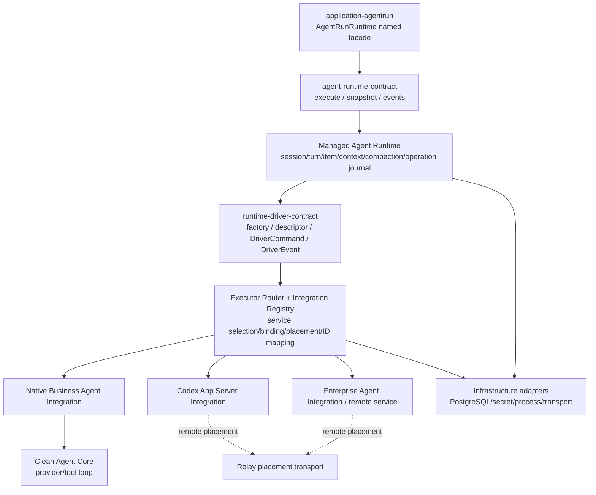

# Agent Runtime seam 三方案比较与推荐

> 本文按 `codebase-design` / DESIGN-IT-TWICE 要求，依次比较三套独立方案，再给出推荐组合。三套原始设计分别见：
>
> - `design-option-minimal-interface.md`
> - `design-option-extensible-integration.md`
> - `design-option-agentrun-first.md`

## 1. 方案一：Minimal Durable Operation Journal

### Interface

```rust
trait ManagedAgentRuntime {
    async fn execute(AgentCommandEnvelope) -> Result<OperationReceipt, ExecuteError>;
    async fn snapshot(AgentSnapshotQuery) -> Result<AgentRuntimeSnapshot, SnapshotError>;
    async fn events(AgentEventSubscription) -> Result<AgentEventStream, SubscribeError>;
}
```

### 最强之处

- module 的 durable success boundary 最清楚：mutation 的同步成功只代表 operation 已被持久接收，真实结果只能由 ordered event/snapshot给出。
- 所有 command 共用幂等 command id、revision expectation、transactional outbox、operation terminal和crash recovery，不再让turn/compact/approval各自发明时序。
- interface method极少，application不会直接依赖connector、driver、repository、projection row或vendor protocol。
- `snapshot` 同时给state revision、availability、binding、context fidelity和tool revision，availability与admission可由同一state machine产生。
- `events` 明确区分authoritative durable event和可丢transient delta；terminal、approval、binding、compaction绝不经过允许lag/drop的broadcast。
- compaction采用可恢复saga：candidate先durable、driver按activation id幂等应用、最后active head CAS并完成operation。这是三套方案中对数据库与live driver无法共享事务这一事实处理得最诚实的设计。

### 代价与风险

- 三个方法只是语法面积小；`AgentCommand`、`AgentRuntimeEvent`、snapshot和error的类型代数仍然很大。
- 对HTTP/UI等普通调用者不够自然：调用方必须理解create/start、operation receipt、event terminal与session binding。
- discovery、service selection和Integration admin必须在另一个module，否则会污染这三个入口。
- 若application直接构造`CreateSession { integration_instance_id, ... }`，Integration知识仍可能向上泄漏。

### 判断

这是最适合作为 **Business/Managed Agent Runtime 的稳定通用 interface** 的方案。它不应直接成为所有AgentRun handler的手写调用面，而应由application内的具名facade包装。

## 2. 方案二：Extensible Agent Runtime Integration Host

### Interface

```rust
trait AgentRuntimeGateway {
    async fn discover(RuntimeDiscoveryQuery) -> Result<Vec<RuntimeOffer>, RuntimeGatewayError>;
    async fn bind(BindRuntimeSession) -> Result<BindingAcceptance, RuntimeGatewayError>;
    async fn submit(RuntimeCommandEnvelope) -> Result<CommandAcceptance, RuntimeGatewayError>;
    async fn inspect(RuntimeInspectionQuery) -> Result<RuntimeInspection, RuntimeGatewayError>;
}
```

### 最强之处

- 对Integration生态所需对象区分最完整：编译期Integration definition、Agent service definition、service instance、runtime offer、placement、driver generation和session binding不再混成connector/executor字符串。
- 准确继承项目taxonomy：Integration是受信编译期宿主扩展；免重编译企业Agent实现统一wire protocol；Extension/Capability Pack不承载native driver代码。
- 版本拆分正确：Integration definition、config schema、AgentDash Runtime Contract、driver build、vendor protocol各自演进。
- capability不再是bool，而是level + host-owned profile + per-capability guarantee + conformance evidence；最终bound profile按service、placement transport和host policy求交。
- credential slot、config schema、factory activation、health、service provenance、remote placement和conformance在进入session前闭环，企业仓无需修改宿主wiring。
- 把Relay纠正为placement transport，不再作为Agent service/executor；local registry发布真实service provenance，cloud保持同一identity。

### 代价与风险

- Integration Host如果同时拥有definition/admin、binding/journal、Business Agent context/compaction/policy，会成为新的god module。
- `discover/bind/submit/inspect`仍要求AgentRun调用方理解offer、binding intent和runtime command；默认发消息路径不够短。
- namespaced `InvokeExtension`若进入common AgentRun seam，容易重建stringly escape hatch。扩展event可以用于展示/telemetry，但不能推进session/turn/context核心状态机；企业专有控制操作应留在Integration管理面。
- 方案中“L2 Interactive、L3 Stateful”的阶梯不符合常见依赖关系；conversation/recovery应先于interactive，具体正交差异仍交给profile。

### 判断

这是最适合作为 **Integration Catalog + Runtime Driver Host/Router** 的方案。definition/instance/factory/negotiation/conformance不能省略，但它们应位于Business Runtime下方或旁侧，不拥有AgentRun业务和managed context policy。

## 3. 方案三：AgentRun-first facade

### Interface

```rust
trait AgentRunRuntime {
    async fn inspect(AgentRunRef) -> Result<AgentRunRuntimeView, AgentRunRuntimeError>;
    async fn send_message(SendAgentRunMessage) -> Result<Accepted<TurnAcceptance>, AgentRunRuntimeError>;
    async fn compact_context(CompactAgentRunContext) -> Result<Accepted<CompactionAcceptance>, AgentRunRuntimeError>;
    async fn steer_active_turn(SteerAgentRunTurn) -> Result<Accepted<SteerAcceptance>, AgentRunRuntimeError>;
    async fn interrupt_active_turn(InterruptAgentRunTurn) -> Result<Accepted<InterruptAcceptance>, AgentRunRuntimeError>;
    async fn resolve_approval(ResolveAgentRunApproval) -> Result<Accepted<ApprovalAcceptance>, AgentRunRuntimeError>;
    async fn read_context(ReadAgentRunContext) -> Result<AgentRunContextView, AgentRunRuntimeError>;
    async fn read_events(ReadAgentRunEvents) -> Result<AgentRunEventPage, AgentRunRuntimeError>;
}
```

### 最强之处

- application/API/UI的默认路径最短：调用方只持有run + agent + input + guard，不知道session、driver、Integration instance或restore mode。
- `send_message`把首次start与已有binding continuation隐藏为实现细节，同时在acceptance中保留实际disposition供审计。
- `inspect`统一生成operation availability、disabled code、reason和stale guard，UI不再自己组合connector capability与execution state。
- named operations有良好的授权、审计、错误和可发现性locality；compact/steer/interrupt/approval不再通过prompt或任意JSON旁路。
- sticky binding、typed IDs和accepted/terminal分离均符合目标不变量。

### 代价与风险

- facade由AgentRun产品语义塑形，不能作为通用Runtime driver或企业Integration必须实现的contract。
- 八个入口会随AgentRun一等操作增长；如果直接放在最底层，wire与driver都被迫追随application use case。
- start/resume/fork在底层protocol仍必须显式互斥；只能由上层facade依据产品binding选择，不能在driver层合并成模糊send。
- facade内部若再保存一套state/receipt/event，会与Managed Runtime重复；它必须是无独立事实源的application adapter。

### 判断

这是最适合作为 **application-agentrun内部的深便利facade** 的方案。它可成为API/UI测试表面，但不能取代通用Runtime contract。

## 4. 横向结论

| 维度 | Minimal journal | Extensible host | AgentRun-first |
| --- | --- | --- | --- |
| 最合适调用者 | Business Runtime消费者 | Integration/driver管理与路由 | API/UI/AgentRun用例 |
| 公开method数量 | 3 | 4 | 8 |
| durable operation模型 | 最强 | 强 | 通过下层获得 |
| 默认调用自然度 | 中 | 中 | 最强 |
| 企业Integration完整度 | 需要配套module | 最强 | 隐藏，不适合作SPI |
| context/compaction原子性 | 可恢复activation saga最佳 | 完整但Host容易过宽 | 产品语义清楚 |
| 主要风险 | command/event代数过大 | 新god module/escape hatch | 产品语义污染底层contract |
| depth | 高 | 正确拆分后高 | 作为application facade时高 |
| leverage | 跨所有runtime operation | 跨所有service/placement | 跨所有AgentRun caller |
| locality | runtime状态机 | integration/driver生态 | 产品用例与availability |

三者并不应压成一个折中interface。它们服务的调用者、变化原因和不变量不同，正确做法是保留三条层次明确的seam。

## 5. 推荐组合架构



### 5.1 Seam A：AgentRun facade

- 位于application-agentrun，提供`inspect/send_message/compact/steer/interrupt/resolve/read`具名方法。
- 只把AgentRun授权、mailbox、product command receipt和当前AgentFrame需求映射为通用Runtime command/query。
- 不保存第二套runtime状态，不直接选择connector，不解析driver事件。
- `send_message`可隐藏start/continuation；fork/rebind仍是明确的AgentRun生命周期用例。

### 5.2 Seam B：Managed Agent Runtime

```rust
trait AgentRuntimeGateway {
    async fn execute(&self, command: AgentCommandEnvelope) -> Result<OperationReceipt, ExecuteError>;
    async fn snapshot(&self, query: AgentSnapshotQuery) -> Result<AgentRuntimeSnapshot, SnapshotError>;
    async fn events(&self, subscription: AgentEventSubscription) -> Result<AgentEventStream, SubscribeError>;
}
```

- 是application唯一依赖的通用Agent abstraction。
- 独占canonical Thread/Turn/Item/Interaction、operation journal、availability/admission、context recipe/materialization、tool surface、manual/auto compaction、checkpoint/head和terminal状态机。
- `CreateSession/BindRuntime`携带host-owned runtime profile/requirements和可选产品target intent；普通application不传connector id。
- authoritative facts先写journal，再投影给AgentRun/UI；transient delta可走独立observer channel。

### 5.3 Seam C：Integration/Driver Host

- `AgentDashIntegration`贡献轻量`AgentRuntimeDriverContribution { definition, factory }`，不再返回live `AgentConnector`。
- Integration definition是编译期受信贡献；Agent service instance/revision、config、credential refs、health和offers是运行期实体。
- 一个Integration可贡献多个Agent service definitions；一个service instance可发现多个runtime variants/offers。
- Executor Router按durable binding只路由owner driver；不再用Composite OR、广播cancel或“第一个live session”试探。
- Driver使用固定AgentDash-owned command/event/error合同；vendor protocol只存在于adapter。

### 5.4 Relay与placement

- Relay不是Agent service、driver或Integration，而是remote placement transport adapter。
- Local Integration registry发布Pi/Codex/企业Agent的原始service provenance与guarantees。
- Cloud持久化同一service identity，另记remote placement/transport descriptor。
- 最终bound profile为：

```text
service guarantees ∩ placement transport guarantees ∩ host policy
```

- Service driver conformance与transport conformance分开；transport只能保持或削弱能力，不能创造更高level。

## 6. 推荐支持类别与真实能力模型

`AgentConnector`业务名应退役。若保留connector一词，只表示L0 transport connector，不可供AgentRun选择。L1-L4是帮助人理解典型runtime形状的参考类别，不构成Rust trait继承树或永久协议等级：

| 类别 | 名称 | 参考形状 | 典型用途 |
| --- | --- | --- | --- |
| L0 | `TransportConnector` | 可靠建立frame/byte channel；没有Agent lifecycle | Relay/WebSocket/stdio内部adapter，不能被AgentRun选择 |
| L1 | `TurnRuntime` | typed turn、ordered lifecycle、exactly-one terminal、typed error | 一次性workflow/activity |
| L2 | `ConversationRuntime` | durable binding、restart后continuation、明确read fidelity | driver-owned或platform-rehydrated多轮conversation |
| L3 | `InteractiveRuntime` | conversation上具备一组可验证的approval/steer/interrupt交互能力 | coding/enterprise interactive Agent |
| L4 | `ManagedThreadRuntime` | Codex-shaped Thread/Turn/Item/Interaction，加AgentDash checkpoint/activation扩展 | Native与可协同增强的企业Runtime |

一个runtime可以是“L2 conversation + approval + MCP，但无steer/hot tools”。因此command admission和UI availability直接读取正交`CapabilityProfile`；类别只是从已验证guarantees得出的可读摘要，driver不能自报。

首期profile按语义面拆为`InputProfile`、`InstructionProfile`、`ToolProfile`、`WorkspaceProfile`、`InteractionProfile`、`HookProfile`、`ContextProfile`与`TelemetryConfigProfile`。HookProfile逐trigger表达delivery/action/timing/strength；它们都是typed guarantee predicates，不是Integration可随意注册同名不同语义的字符串标签。

## 7. 推荐compaction边界

Compaction完全属于Managed Agent Runtime，不属于infrastructure，也不属于Agent Core。Infrastructure只实现checkpoint/journal/outbox/CAS adapter；Core只提供provider/tool loop或一次性summarization primitive。

L4 compaction采用可恢复saga：

```text
accept CompactContext(expected context revision)
  -> 串行化context transition
  -> 由committed snapshot生成replacement candidate，live不变
  -> durable写candidate checkpoint，active head不变
  -> driver按activation_id幂等应用并返回digest/revision
  -> active head以base revision做CAS
  -> 同事务写ContextActivated + OperationSucceeded
  -> 之后才允许provider request/turn继续
```

driver已应用、head CAS前崩溃时，recovery按activation id查询/重放后完成CAS。无法提供幂等activation/query/recovery的driver不能声明L4。

`thread/compacted`等外部opaque事件只产生`NativeContextCompactionObserved` telemetry；不推进平台head、不完成common compact operation。要让Codex达到L4，扩展协议必须增加exact snapshot/replacement boundary/provenance与prepare/activate或等价可恢复合同。

## 8. 推荐protocol边界

- `agentdash-agent-runtime-contract`拥有canonical IDs、commands、receipts、snapshots、events、errors、levels/profiles。
- `agentdash-agent-runtime-wire`（可由现`agentdash-agent-protocol`彻底重建）定义versioned request/response/notification frames和Rust/TS schema，不type-alias Codex DTO。
- Driver source event先经Router验证generation、ID mapping和state order，再进入Managed Runtime journal；不直接把vendor notification当durable domain fact。
- Backbone收敛为typed Runtime Event的持久/传输presentation；AgentRun product control events保持独立事实源，API/feed层可以合并projection，但不混用enum。
- Relay直接承载同一wire frames，不再定义薄`RelayPromptRequest`或`serde_json::Value` notification。
- approval/user-input是durable request item + response command；unknown critical frame产生ProtocolViolation/Lost，不返回null或静默忽略。
- namespaced extension item/telemetry允许经schema注册用于企业展示，但不能伪造core lifecycle discriminant或推进context/terminal projection；企业专有管理operation不进入common AgentRun seam。

## 9. 推荐module归属

| 责任 | 目标module |
| --- | --- |
| AgentRun授权、mailbox、product receipt、产品workspace状态 | application-agentrun |
| canonical Thread/Turn/Item/Interaction、operation journal、availability/admission | managed-agent-runtime |
| context recipe/materialization、context query、snapshot/head、compaction policy/saga | managed-agent-runtime |
| Hook source merge/plan compile | Business Agent Surface |
| HookRun/outer lifecycle/context/mailbox effect | managed-agent-runtime |
| brokered tool pre/post/approval Hook | Platform Tool Broker |
| provider/native-tool/stop Hook translation | Native/Codex/Enterprise driver adapter |
| Agent service definition/instance/offer、factory、descriptor、binding/placement、source ID mapping | executor/integration driver host |
| provider/tool loop、provider-neutral structured IO | agent-core |
| Runtime Contract与wire schema | agent-runtime-contract / agent-runtime-wire |
| PostgreSQL transaction/CAS/outbox、secret、process、Relay/WebSocket | infrastructure adapters |
| Codex/vendor protocol映射 | Codex Integration driver adapter |
| Native Business Agent到Core映射 | Native Integration driver adapter |

现`application-runtime-session`没有目标态对应物：其conversation/context/compaction迁入Managed Runtime，product projection迁回application，live driver registry/launch adapter迁入executor host，PostgreSQL实现迁入infrastructure。迁完删除crate与pass-through bridges。

## 10. 保留与推翻

### 保留业务知识

- MessageRef boundary与checkpoint + raw suffix恢复；
- manual next-turn/idle maintenance语义；
- Platform projection compaction与native opaque telemetry的区分；
- AgentFrame/AgentRun product identity与delivery binding；
- generated Rust/TS contract链；
- Host Integration受信编译期taxonomy；
- runtime map、active turn、driver live state分离的原则。

### 推翻interface形状

- 旧`AgentConnector` mega trait与`ConnectorCapabilities` bool；
- `CompositeConnector` OR capability、广播cancel和试探approval；
- hardcoded Pi/Relay/Codex composition；
- `ExecutionContext`一次性泄漏application内部所有facts；
- special `ExecutionTurnMode::ContextCompaction`与maintenance prompt；
- manual compaction request多writer/750ms轮询；
- `SessionMetaUpdate(key, Value)`核心事件；
- Codex DTO作为canonical类型；
- Relay cloud/local双SessionRuntime与薄prompt DTO；
- 两套launch classification和query/execution context builder；
- event persistence错误吞掉、EOF=>Completed、authoritative broadcast可丢。

## 11. 收敛后的产品门槛

- 常规多轮AgentRun选择器要求conversation continuation guarantee；L1用于一次性workflow/activity。
- UI不按L2/L3/L4数字开放功能，而按bound profile逐项开放steer、interrupt、approval、tools、fork和context操作。
- common `compact_context`只在`managed_transactional + idempotent_activation_recovery`成立时开放；`NativeOpaque` compaction仅作为只读telemetry或adapter管理信息。
- L2由AgentDash-owned continuation/read guarantees定义，不绑定ACP；ACP首期不作为driver实现，未来至多作为read-side presentation projection。
- Codex可立即提供丰富Thread/Turn/Item/Interaction能力，但在exact context/activation补齐前不声明managed compaction。

这些门槛既保持当前产品语义诚实，也允许企业Agent Core通过增强driver/profile逐步获得更多能力，而无需打破模块边界。
