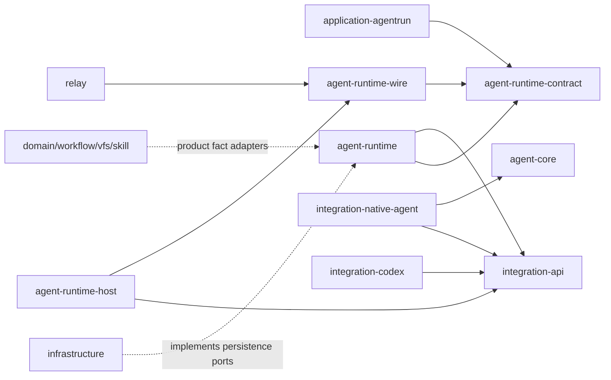
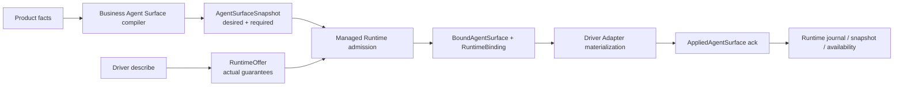

# Agent Runtime 重构目标 Crate Shape 与迁移地图

本文固定重构完成后的物理 crate 形状、依赖方向、能力拼装链路与既有逻辑迁移归属。主设计文档继续拥有状态机、协议和一致性细节；本文用于回答“代码最终放在哪里”和“当前模块迁到哪里”。

## 1. 最终调用链

```text
API / UI / Workflow
  -> Application / AgentRun facade
  -> Managed Agent Runtime
  -> Integration Driver Host
  -> Native / Codex / Enterprise Adapter
  -> Clean Agent Core 或外部 Agent
```

- Application 只理解产品授权、AgentRun、mailbox与UI command。
- Managed Agent Runtime拥有Thread/Turn/Item/Interaction、context、compaction、hook、tool与terminal业务事实。
- Driver Host拥有Integration、service instance、offer、binding、placement、lease与adapter生命周期。
- Adapter终止具体执行协议并把source coordinates映射为canonical coordinates。
- Agent Core只提供provider/tool loop、取消、streaming与纯summarization primitive。
- Infrastructure只提供数据库事务、CAS、outbox、process、script、IPC、artifact与secret机制。

Compaction policy、checkpoint、上下文替换和恢复语义属于Managed Agent Runtime；只有原子持久化与migration属于Infrastructure。

## 2. 目标物理结构

```text
crates/
  agentdash-agent-runtime-contract/       # canonical commands/events/profiles/errors/IDs
  agentdash-agent-runtime-wire/           # cross-process envelope/framing/schema
  agentdash-agent-runtime/                # managed business runtime
  agentdash-agent-runtime-test-support/   # runtime/driver conformance harness

  agentdash-integration-api/              # trusted contribution + Driver SPI
  agentdash-agent-runtime-host/           # service/binding/router/placement/driver lifecycle
  agentdash-integration-native-agent/     # Runtime <-> Clean Core
  agentdash-integration-codex/            # Runtime <-> Codex App Server
  agentdash-first-party-integrations/     # first-party contribution aggregation only

  agentdash-agent-core/                   # provider-neutral agent loop

  agentdash-application-agentrun/         # product facade
  agentdash-application/                  # product use cases and source adapters
  agentdash-domain/                       # product domain
  agentdash-application-workflow/
  agentdash-application-vfs/
  agentdash-application-skill/
  agentdash-application-lifecycle/
  agentdash-application-extension-gateway/ # renamed non-Agent extension gateway
  agentdash-application-ports/            # product ports only

  agentdash-platform-spi/                 # non-Agent platform SPI after cleanup
  agentdash-infrastructure/               # persistence/process/script/secret adapters
  agentdash-relay/                        # Runtime Wire placement transport
  agentdash-contracts/                    # API/UI/product DTO
  agentdash-api/                          # cloud composition root and transport adapters
  agentdash-local/                        # local composition root and local placement
```

未来若实现ACP read-side projection，再增加`agentdash-integration-acp-projection`；首期不创建该crate。

### 2.1 新建、替换与删除

| 当前crate | 目标动作 |
| --- | --- |
| `agentdash-agent` | 重命名并清理为`agentdash-agent-core` |
| `agentdash-agent-types` | 删除，按所有权拆入Runtime Contract、Managed Runtime或Core |
| `agentdash-agent-protocol` | 由`agentdash-agent-runtime-wire`直接替换 |
| `agentdash-executor` | 重命名并重写为`agentdash-agent-runtime-host` |
| `agentdash-application-runtime-session` | 拆解后删除 |
| `agentdash-application-hooks` | 拆解后删除 |
| `agentdash-spi` | 清理Agent runtime内容后重命名为`agentdash-platform-spi` |
| `agentdash-application-runtime-gateway` | 重命名为`agentdash-application-extension-gateway`，避免与Agent Runtime Gateway混淆 |
| `agentdash-integration-api` | 保留名称，重建contribution/factory/driver interface |
| `agentdash-first-party-integrations` | 保留为first-party contributions聚合，不承载具体adapter实现 |
| `agentdash-application-agentrun` | 保留并收窄为产品facade |
| `agentdash-domain` | 保留产品实体，迁出Runtime状态 |
| `agentdash-infrastructure` | 保留并实现Runtime/Host outbound ports |
| `agentdash-relay` | 保留名称，重建为纯placement transport |

## 3. 依赖方向



强制依赖约束：

- Runtime Contract不依赖Application、Domain repository、vendor DTO或transport。
- Agent Core不依赖AgentDash Domain、Runtime Contract、Codex、Relay或Application。
- Managed Runtime不依赖具体Agent Core、Codex、Relay、HTTP或WebSocket。
- AgentRun facade不依赖Driver、Adapter、Core或Infrastructure。
- 只有composition root可以同时看到Runtime、Host、Integration和Infrastructure的concrete implementation。

## 4. 平台Agent能力拼装与Runtime定义

平台侧“希望给Agent什么”和执行侧“Agent实际上能做什么”是两条独立输入，不能提前合成一个自报式`AgentRuntimeDefinition`。

### 4.1 四个canonical对象

| 对象 | Owner | 含义 |
| --- | --- | --- |
| `AgentSurfaceSnapshot` | Managed Runtime / Business Agent Surface | 平台根据AgentFrame、Capability Pack和产品事实编译出的期望surface与requirements |
| `RuntimeOffer` | Integration Driver Host | 某Agent service instance经过service、transport与host policy约束后实际可兑现的能力 |
| `BoundAgentSurface` | Managed Runtime admission | `AgentSurfaceSnapshot`与`RuntimeOffer`求交后的可执行定义，包含每项contribution的route与semantic strength |
| `AppliedAgentSurface` | Driver Adapter回执，Runtime持久化 | Adapter实际materialize/apply并ack的revision、digest与per-contribution状态 |

`RuntimeBinding`持久化service instance、driver generation、placement、offer/profile digest、`BoundAgentSurface` digest和applied revision。这样service声称、平台期望、admission结果与真实应用结果不会混成一个布尔能力集合。

### 4.2 平台期望能力编译

Application中的product source adapters读取：

- Agent与AgentFrame；
- Workflow/Project/Story/Task/Run；
- Workspace/VFS/mount；
- Skill、MCP与platform tools；
- Permission与policy；
- Capability Pack；
- Hook definitions；
- memory、guidelines与其它context facts。

这些adapter只返回typed product facts/contributions，不构造driver DTO。`agentdash-agent-runtime`内部的Business Agent Surface负责：

1. 展开Capability Pack；
2. 合并并排序各来源contribution；
3. 编译`ContextRecipe`、`InstructionPlan`、`ToolCatalogRevision`、`WorkspaceRequirement`、`HookPlanSnapshot`；
4. 为每项contribution标记required/optional、delivery fidelity和semantic requirement；
5. 生成immutable、revisioned、digest-addressed `AgentSurfaceSnapshot`。

因此“平台拼装Agent能力”的业务层位于`agentdash-agent-runtime::surface`，Application只是事实Adapter，Driver Host不是拼装者。

### 4.3 Agent service实际能力归一化

Integration Adapter通过`describe`报告vendor/source能力。Driver Host完成：

1. 校验descriptor与conformance证据；
2. 解析service instance配置、credential availability与health；
3. 与placement transport guarantee和host policy求交；
4. 归一成AgentDash-owned `RuntimeOffer`。

`RuntimeOffer`按Input、Instruction、Tool、Workspace、Interaction、Hook、Context、Telemetry/Config profile精确描述能力及provenance，不使用`supports_tools`、`supports_hooks`之类布尔值。

### 4.4 Admission、绑定与materialization



Managed Runtime admission逐项求交：

- required contribution无法满足时返回typed incompatibility，不产生driver side effect；
- optional contribution只有manifest明确可选时才可省略；
- PromptOnly、Observed或SteerApproximation不能满足Exact requirement；
- 每条tool、instruction、workspace、context与hook contribution固定唯一delivery route；
- binding默认sticky，运行时不会因registry顺序或health变化自动换driver；
- Adapter未返回applied ack前，相应command availability不能标记为可用。

Adapter只把`BoundAgentSurface`翻译为Native Core输入、Codex capability/plugin artifact、MCP façade或企业Agent协议；它不重新解释产品policy。

## 5. 既有逻辑迁移地图

### 5.1 `agentdash-application-agentrun`

- 保留AgentRun/Agent/Workspace授权、mailbox、产品command receipt与Thread映射。
- `context_compaction_command`只保留产品授权和command映射；状态决策、compact-only与terminal迁入Managed Runtime。
- 删除750ms轮询与compact-only占位prompt。
- execution/delivery/capability/terminal状态改为Runtime snapshot与availability投影。
- frame builder拆为Application product fact adapter与Runtime surface compiler。
- connector选择改为durable RuntimeBinding。

### 5.2 `agentdash-application-runtime-session`

- eventing、operation/terminal、projection与recovery迁入Managed Runtime。
- context projector、checkpoint、transcript restore与context frames迁入`agent-runtime::context`。
- manual/auto compaction delegate与failure fuse迁入`agent-runtime::context::compaction`。
- live registry、connector launch与driver lifecycle迁入Runtime Host。
- tool assembly迁入Business Agent Surface与Tool Broker。
- repository interface由Runtime拥有，PostgreSQL adapter留在Infrastructure。
- title等产品projection回到Application。
- 迁完删除整个crate与重复launch classification。

### 5.3 `agentdash-application`与相邻产品crates

- Project/Story/Task/Workflow/VFS/Skill repository读取保留为product source adapters。
- context contribution merge、prompt/surface组装迁入Managed Runtime。
- execution context与UI query context不再分别构造；UI读取Runtime Context View。
- `application-ports`删除runtime-session、connector与transport泄漏，只保留产品ports。

### 5.4 `agentdash-agent`与`agentdash-agent-types`

- agent loop、provider/tool primitives、streaming、cancel、token estimation与纯summarization保留并合入`agentdash-agent-core`。
- AgentDash summary prompt、Lifecycle index、AgentFrame/MessageRef projection、Runtime compaction delegate与Hook业务含义移出Core。
- provider-neutral类型合入Core；Runtime类型迁入Runtime Contract/Managed Runtime；vendor类型迁入Adapter。
- Core不再依赖`agentdash-domain`。

### 5.5 `agentdash-executor`

- 删除`AgentConnector` mega trait、default no-op、bool capabilities、Composite OR与广播cancel/approval。
- registry/router/binding/placement/lease/generation fencing迁入`agentdash-agent-runtime-host`。
- Pi connector、stream mapper与provider bridges迁入`agentdash-integration-native-agent`。
- Codex bridge/config/protocol mapping迁入`agentdash-integration-codex`。
- context rendering改为Runtime materialization与Adapter translation，不再组装业务projection JSON。

### 5.6 Protocol、SPI与Integration

- `agentdash-agent-protocol`中的canonical vocabulary进入Runtime Contract，framing进入Runtime Wire，vendor surface进入对应Adapter，product feed进入Contracts/API projection。
- 删除`SessionMetaUpdate { key, value }`式runtime escape hatch，改为typed lifecycle event。
- `agentdash-spi::connector/context/hooks/session_persistence`分别被Integration API、Managed Runtime与Runtime persistence ports替代。
- 清理后剩余platform扩展能力改名为`agentdash-platform-spi`。
- `agentdash-integration-api`只定义contribution/factory/driver/descriptor/error，不返回live mega connector。

### 5.7 Hook

- source merge、matcher、rule ordering、HookPlan编译进入Business Agent Surface。
- actionful HookRun、effect、mailbox follow-up进入Runtime journal/outbox。
- brokered tool hooks进入Tool Broker。
- inner-loop hooks进入Native/Codex/Enterprise Adapter或Core callback。
- Rhai、command runner、artifact、IPC、timeout与secret进入Infrastructure。
- `supports_hooks`由逐point `HookProfile`替代。

### 5.8 Persistence、Relay与composition roots

- Infrastructure新增operation/event/thread/turn/item/interaction/binding/checkpoint/head/activation/hook/outbox/service instance adapters。
- Relay只承载Runtime Wire route、sequence、ack/replay与connection health，不理解Agent业务。
- API只做HTTP/SSE、授权和AgentRun facade调用；不直接构造SessionLaunch或concrete Runtime repository。
- Local只负责本地placement、进程、tools、terminal、filesystem、MCP与Relay client；不拥有第二套session lifecycle。

## 6. 数据迁移结果

目标表包括：

```text
agent_runtime_thread
agent_runtime_operation
agent_runtime_event
agent_runtime_turn
agent_runtime_item
agent_runtime_interaction
agent_runtime_binding
agent_runtime_source_id
agent_context_checkpoint
agent_context_head
agent_context_activation
agent_hook_plan_snapshot
agent_hook_run
agent_runtime_outbox
agent_service_instance
```

- 旧runtime session identity与stable lineage可验证时迁为Runtime Thread。
- 旧events用于重建canonical journal/read projection。
- compaction/head/segment只有provenance与fidelity可证明时才迁为checkpoint/head。
- manual compaction request迁为Runtime Operation。
- delivery binding迁为RuntimeBinding。
- 模糊active session/live connector owner不冒充可恢复状态，标记Lost/LegacyUnverified或在预研库清理。
- 切换后删除旧session/checkpoint/head/connector表与字段，不保留dual write、dual reader或runtime fallback。

## 7. 完成态判据

- Application只通过AgentRun facade与Runtime Contract操作Agent。
- Business Agent Surface是平台能力拼装的唯一业务编译器。
- RuntimeOffer是Agent service实际能力的唯一归一化描述。
- BoundAgentSurface/RuntimeBinding固定每项能力的delivery route、semantic strength、revision与digest。
- Native、Codex与企业Agent只通过Integration API加入，不修改Application硬编码分支。
- Core、Runtime、Host、Adapter、Infrastructure之间不存在vendor或产品类型逆向泄漏。
- `application-runtime-session`、旧HookRuntime、AgentConnector、Backbone双事实与stringly runtime event完成删除。
