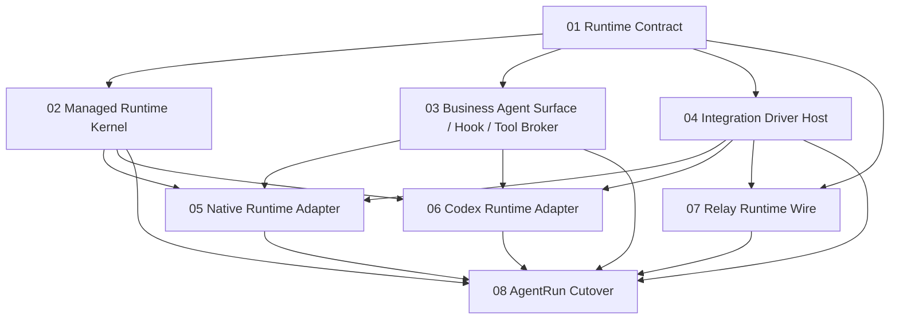

# Agent Runtime 重构工作包

本目录用于在单个 Trellis 父任务内管理可独立实施、验证和交接的工作包。各工作包保留自己的 `prd.md`、`implement.jsonl` 与 `check.jsonl`，但不包含 `task.json`，因此不会作为独立任务进入顶层任务列表和归档。

## 依赖顺序

## 工作包索引

| 工作包 | 目标 |
| --- | --- |
| [01-runtime-contract](./01-runtime-contract/prd.md) | AgentDash-owned Runtime Contract、Wire、profiles 与 conformance |
| [02-managed-runtime-kernel](./02-managed-runtime-kernel/prd.md) | durable operation/state/context/compaction/hook orchestration |
| [03-business-agent-surface](./03-business-agent-surface/prd.md) | AgentFrame、Capability Pack、HookPlan、Tool Broker 与 workspace surface |
| [04-integration-driver-host](./04-integration-driver-host/prd.md) | Integration service、driver factory、binding、placement 与 descriptor |
| [05-native-runtime-adapter](./05-native-runtime-adapter/prd.md) | Native reference adapter 与 Clean Agent Core |
| [06-codex-runtime-adapter](./06-codex-runtime-adapter/prd.md) | Codex App Server、native hook projection 与 interaction adapter |
| [07-relay-runtime-wire](./07-relay-runtime-wire/prd.md) | Runtime Wire placement transport |
| [08-agentrun-cutover](./08-agentrun-cutover/prd.md) | Application/API/UI切换和旧架构删除 |

## 管理约束

- 依赖必须写在每个工作包的 `Depends On` 中，目录顺序只提供阅读便利。
- 工作包被领取前，应读取本目录 PRD、父任务 `design.md`/`implement.md` 和自己的上下文清单。
- 父任务是唯一 Trellis lifecycle/branch/archive 单元；工作包完成状态在父任务 `implement.md` 中维护。
- ACP Agent Driver 不属于首期工作包。ACP 只保留为可选 Runtime Event projection协议研究，是否实现由后续真实外部订阅需求决定。
