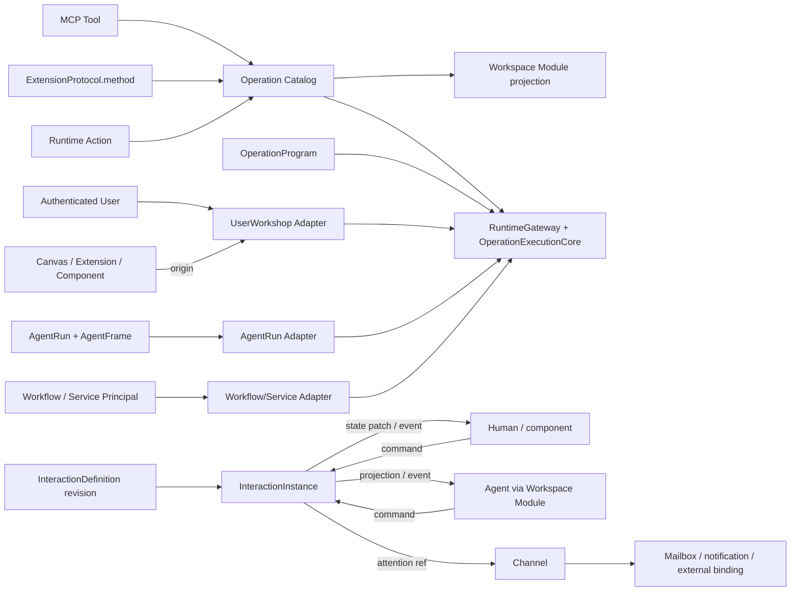

# Design · Workspace Module 通用双工交互系统

## 1. 推荐架构



核心决策：

- 统一可调用行为叫 `Operation`，不以 MCP、Extension channel 或 transport 作为执行模型。
- 短生命周期、有界、无 LLM 的组合叫 `OperationProgram`。
- 人与 AI 共享的运行状态属于 `InteractionInstance`。
- Canvas 是一种 `InteractionDefinition` authoring format 与 presentation schema，不是 runtime instance、renderer lease 或 tab state。
- Extension 贡献 component definition；首版任意代码组件运行在隔离 iframe 中。
- Workspace Module 是 Agent capability projection；RuntimeGateway 是 actor-neutral 执行主链；User workshop 与 AgentRun 通过不同 adapter 进入同一 Gateway；AgentFrame 只属于 AgentRun adapter；RuntimeSession 不进入目标 contract；Channel 是异步通信 rail。

## 2. Canonical Operation

### 2.1 Descriptor 与引用

建议建立 actor-neutral descriptor：

```text
OperationDescriptor {
  operation_ref,
  input_schema,
  output_schema,
  effect_summary,
  required_capabilities,
  actor_visibility,
  execution_policy,
  provenance,
  dispatch
}
```

provider adapters 可来自 MCP tool、ExtensionProtocol method、Runtime Action 或 host operation。Workspace Module 只把 canonical descriptor 组织为 Agent-facing module/operation，不作为另一个重复 provider。`operation_ref` 必须显式携带 provider identity/version；不能只按一个全局字符串首个命中。

Workspace Module 可以按 module/category 为 Agent 描述这些 operations，但 operation catalog 与 dispatch 仍由各 provider 的事实源生成。

### 2.2 RuntimeGateway OperationExecutionCore

RuntimeGateway 保持 actor-neutral admission/dispatch 主入口，并在内部收束 direct invocation 与 OperationProgram step 共用的 execution core：

```text
resolve actor context
  -> resolve current effective Operation surface
  -> input/schema/effect validation
  -> capability + runtime policy admission
  -> invoke provider with child cancellation token
  -> output schema + size/result-ref handling
  -> trace/audit/finalize
```

浏览器或 operation caller 不提交 Session、Backend、workspace root 等 authority IDs。可信 application adapter 从认证用户、Project access、InteractionAttachment、Extension installation 或 AgentFrame 解析 authority/scope；preflight 与 surface handle 都不是授权凭证，执行每一步仍需重新 admission，避免 TOCTOU。

Agent loop 特有的 `before_tool_call/after_tool_call`、assistant message 与用户审批不下沉给 Canvas/User actor。`operation_program_run` 在 Agent 看来仍是一个外层 tool call：preflight 生成确定的 definition/effect manifest digest，外层对整份 effect manifest 做审批；step core 只允许执行 manifest 内的 operation，并逐步重验当前 capability、schema、limits、取消与 trace。需要交互式逐步批准的 operation 不进入同步 MVP。

### 2.3 Session-independent RuntimeInvocationEnvelope

内部 invocation 按五个正交维度组装：

```text
RuntimeInvocationEnvelope {
  principal,            // 谁：User / AgentRunAgent / WorkflowNode / ExtensionInstallation
  scope,                // 在哪里：Project / InteractionInstance / Workspace binding
  origin,               // 从哪里触发：Canvas / ExtensionPanel / ComponentEvent / AgentTool
  operation_ref + input,
  authority_revision,   // 本次 admission 所依据的 grant/surface revision
  trace_context         // 可选关联 AgentRun / Interaction / UI surface，不含 authority
}
```

规则：

- `Canvas`、`ExtensionPanel` 和 component 都是 origin，不是安全 principal。用户点击时 principal 是 authenticated User；Extension 自治执行时必须使用具备显式 grant 的 `ExtensionInstallation` service principal。
- `RuntimeSurfaceResolver` 根据 principal + scope 生成 actor-specific Operation surface；AgentRun adapter 从 AgentFrame 读取 effective surface，UserWorkshop adapter 从用户/Project/Interaction access 生成 surface。
- UserWorkshop 只是 application adapter，不是新的持久 Session/aggregate。MCP、Extension 与 RuntimeAction 的 standalone surface 从 Project grants、workspace binding、installation 与 provider readiness 生成；AgentFrame 是 AgentRun 消费该能力面的 projection，不是 User surface 的来源。
- `RuntimePlacementResolver` 在 admission 后根据 Operation provider、Project/workspace binding 与在线执行器选择 cloud/local placement；RuntimeSession 和客户端 backend_id 都不参与 placement authority。
- discovery 返回的 surface handle/revision 只服务稳定 UI 与 diagnostics；invoke 时重新解析授权，不能把 opaque handle 当 capability token。
- trace 可以记录 AgentRun、InteractionInstance、Canvas、Extension component 等 correlation，但没有必填 runtime_session_id。

## 3. OperationProgram

### 3.1 定位

`OperationProgram` 是独立 headless capability，Canvas、Agent、Workflow 都只是调用者。名称不用 `ProtocolProgram`，因为 target 可以是 MCP tool、Workspace Module operation 或 runtime action。

它负责单一当前上下文内的同步、有界 JSON DAG：不调用 LLM、不创建 AgentRun、不包含 human gate、不后台运行、不承担跨会话恢复。Workflow 继续负责长生命周期、后台恢复、多 Agent、审批与阶段调度，并可将一个 program 作为 node。

### 3.2 最小 IR

```json
{
  "version": 1,
  "steps": [
    {
      "id": "discover",
      "operation_ref": "mcp://github/search_issues",
      "input": { "query": "is:open label:bug" }
    },
    {
      "id": "render",
      "depends_on": ["discover"],
      "operation_ref": "workspace-module://reports/render",
      "input": {
        "items": { "$ref": "/steps/discover/output/items" }
      }
    }
  ],
  "output": { "$ref": "/steps/render/output" },
  "limits": {
    "timeout_ms": 30000,
    "max_steps": 16,
    "max_parallelism": 4,
    "max_output_bytes": 65536
  }
}
```

MVP 约束：

- 只支持顺序与显式 DAG；禁止 cycle、loop 与动态 step generation。
- 数据流只使用 JSON Pointer `$ref`，不执行字符串模板或任意表达式。
- fail-fast；已完成副作用不会被描述成自动回滚。
- 不提供自动 retry/compensation；需要时由 operation 自身幂等合同或 Workflow 处理。
- definition limits 与服务端 hard limits 取更小值。

### 3.3 Preflight 与同步执行

```text
OperationProgramDefinition
  -> preflight
ValidatedOperationProgram(definition_digest + effect_manifest_digest)
  -> run
SynchronousExecution(root_trace + caller cancellation token)
  -> inline output preview / result ref / audit
```

Agent-facing MVP 只有两个入口：

- `operation_program_preflight`：解析 inline definition 或 asset ref，返回 diagnostics、advisory resolution、effect/capability summary、definition/effect manifest digest，不产生副作用。
- `operation_program_run`：校验 definition/effect manifest digest，从当前 AgentFrame 重新解析 surface 并逐 step admission；在有界调用内返回受限 output preview/result ref。

外层 AgentTool/HTTP request 的 cancellation token 是 root token，step 使用 child token；取消时停止调度并传播到 provider。每次 run 建立 root trace，step trace 以 root 为 parent。大结果进入统一 result store，inline 只保留受限 preview。并行必须由 DAG 与 `max_parallelism` 控制。

`get/cancel` API、durable execution/step records 与短后台运行属于后续异步模式；不能在同步 MVP 中预先制造第二套 job runtime。

### 3.4 与 Canvas 的关系

Canvas 可以：

- 作为 program 的编辑/可视化 authoring surface；
- 在 component event binding 中引用 program；
- 显示 execution state/result；
- 让 Agent 创建或修改 program definition。

Canvas iframe 的任意 JS 不作为可信 program IR，也不能成为 server-side Agent executor。

## 4. 通用 Interaction 模型

| 对象 | 权威职责 |
| --- | --- |
| `InteractionDefinitionRevision` | 版本化 layout/source/component refs/program bindings/initial state schema；Canvas 是一种 kind |
| `ExtensionComponentDefinition` | logical component contract 与 package asset entry，不含 resolved installation/artifact identity 或 runtime state |
| `InteractionInstance` | pinned definition revision、canonical state revision、command/event log、status |
| `InteractionAttachment` | 把 User/AgentRun 接到 instance，持有 role 与 capability projection |
| `AgentFrame` | 某个 Agent 的不可变 effective runtime surface revision：capability/context/VFS/MCP/execution profile/visibility projections |
| `RuntimeAccessAdapter` | 将 User workshop、AgentRun、Workflow 或 Extension service principal 解析为内部 invocation envelope |
| `ExecutionPlacement` | invocation admission 后解析出的 cloud/local/provider execution target，不参与业务 identity |
| `PresentationState` | per-user/client tab、layout 与 focus 偏好 |
| `RendererLease` | browser frame/generation/heartbeat；刷新可替换，不拥有业务状态 |

RuntimeSession 当前仍承载部分 turn/delivery/trace plumbing，但目标设计不从它解析 authority、Operation surface、placement 或 Interaction identity，并最终删除这条依赖。AgentRun 是否影响 instance lifetime 由待确认的 owner/lifetime policy 决定。AgentFrame 保存某个 Agent revision 的 effective runtime surface，包括 capability、context、VFS、MCP、execution profile 与 interaction/module visibility projection；它只供 AgentRun adapter 使用，不是 User workshop 或 Canvas/Extension 的前置对象，也不保存 InteractionInstance canonical state 或 Canvas definition body。

### 4.1 双工 command/event

```text
InteractionCommand {
  command_id,
  attachment_ref,
  actor,
  expected_revision,
  command_type,
  payload
}
  -> schema + role/capability + reducer admission
  -> append InteractionEvent + audit
  -> state revision + 1
  -> publish event/patch to attachments and renderer leases
```

人和 Agent 使用同一 application use case：

- UI/component：`get_state / command / subscribe`
- Agent/Workspace Module：`interaction.get_state / interaction.command / interaction.wait_events`

MVP 使用 expected revision + conflict，不先引入 CRDT。component local hover/focus/draft 可留在 iframe；会影响业务或需被 Agent 观察的状态必须通过 typed command 写入 instance。Agent 只看到 descriptor 明确声明的 `agent_projection`，不默认读取整份表单/秘密字段。

### 4.2 Channel 边界

Interaction service 自己拥有 command schema、state revision、event ordering 与 persistence。只有需要异步唤醒、外部参与者或 mailbox handoff 时，才通过独立 attention binding 向 Channel 投递引用：

```text
AttentionRequested {
  interaction_instance_ref,
  event_ref,
  target,
  summary
}
```

Channel 不成为本地 UI 与 Agent command 的中转总线，也不保存 canonical interaction state/event body。

### 4.3 Definition、Attachment 与 Gateway 的协作

```text
Canvas / InteractionDefinitionRevision
  -> instantiate -> InteractionInstance
  -> attach User -> UserWorkshop Adapter -> RuntimeGateway
  -> attach AgentRun -> AgentFrame revision -> AgentRun Adapter -> RuntimeGateway
  -> open UI -> PresentationState + RendererLease
```

边界规则：

- 修改 Canvas source/layout/component binding 会产生新的 definition revision，不直接修改运行中 instance state。
- 创建或恢复 instance 时固定 definition revision；state/command/event 由 instance 自己维护。
- 给 Agent 新增或撤销 attachment/capability 时产生新的 AgentFrame revision；普通 interaction state 变化不重写 AgentFrame。
- Agent 发起 command 时，AgentRun adapter 从当前 AgentFrame/attachment 组装 invocation；用户从 Canvas/Extension 发起 command 时，UserWorkshop adapter 从认证用户与 Project/attachment 组装 invocation。两者进入同一 RuntimeGateway。
- 用户关闭 tab 或浏览器刷新只改变 PresentationState/RendererLease；Gateway invocation 不要求创建或查找 RuntimeSession。
- definition 升级、instance lifetime 与 AgentRun 结束后的保留策略分别由显式产品规则决定，不能从 session/tab 状态推断。

## 5. Extension Component ABI

### 5.1 Descriptor

```text
ui_components[] {
  component_key,
  contract_version,
  renderer: { kind: iframe, entry },
  props_schema,
  events_schema,
  state_projection_schema,
  slots,
  sizing,
  sandbox_profile
}
```

Canvas definition 保存：

```text
component_contract_ref
slot/layout
props bindings
state projection binding
event -> interaction command / OperationProgram binding
```

definition revision 不保存 installation ID、backend ID 或可变 URL，只保存带 contract version requirement 的逻辑 component ref。实例化时由 Project installation authority 解析到 exact package/artifact digest，并只在 `InteractionInstanceRuntimeBinding` 中固定 resolved artifact；definition 与 instance 不重复保存运行态 authority。

### 5.2 Runtime protocol

每个 component instance 使用宿主创建的 `MessageChannel`：

- Host → component：initialize、props/state projection、event binding result、theme/locale、dispose。
- Component → host：ready、resize、typed event、diagnostic。
- props/events/output 双向 JSON Schema validation。
- MessagePort/renderer lease、rate/size limits 与 trace 均为 component-instance scoped；业务权限只存在于宿主 event binding。
- component 看不到 Project/session/backend/workspace root 等宿主 authority 字段。

安全基线：iframe 不使用 `allow-same-origin`；独立 CSP 默认禁止任意网络，业务能力只能由宿主 event binding 触发；不以全局 `postMessage("*")` 作为长期协议。

### 5.3 Renderer 选择

MVP 只实现 isolated iframe component renderer，以复用现有 artifact serving 与任意 framework 能力并建立清晰隔离。Schema-driven host primitives 可作为平台组件贡献进入相同 descriptor/catalog；Web Components/ESM 只在以后有明确 trusted/signed tier 与 capability 模型时评估，不进入首个切片。

## 6. 递进验证切片

不要用一个 demo 同时验证三个新系统，按以下顺序建立独立证据：

### Slice A · Program-only

- 两个可测试 Operation 组成同步 DAG。
- AgentRun adapter 与 standalone UserWorkshop adapter 分别调用同一 inline definition；UserWorkshop 路径没有 AgentRun、AgentFrame 或 RuntimeSession。
- 验证 effect manifest 审批、step capability revalidation、root cancellation、parallel limit、trace 与 result ref。
- 不引入 InteractionInstance 或 Extension component。

### Slice B · Interaction-only

- 普通 Canvas 静态 preview 与 attached runtime preview 分离，消除旧 endpoint 断链。
- 从第一天起只建立一套 canonical `InteractionDefinitionRevision`，Canvas source 直接迁入该 revision，不先建临时 Canvas revision。
- 建立 revisioned `InteractionInstance` 与 User/AgentRun attachment。
- 先用 host-owned `approval-card` 验证 Human command → state/event → Agent observe/command → renderer patch，以及 renderer 重建与 Gateway access re-resolution。
- 不引入第三方 component 或 program event binding。

### Slice C · Component composition

- Extension manifest 贡献 isolated iframe component `demo.approval-card`。
- component 只能发 `decision_changed` typed event；宿主 binding 将其唯一映射为 `decision.set` command。
- 验证 artifact resolution/pinning、CSP/MessageChannel、schema、sizing、unavailable state。
- 在基础闭环稳定后，再让一个 host event binding 引用 Slice A 的 OperationProgram。

这些切片都不包含拖拽编辑器、CRDT、marketplace、任意服务端脚本、Channel command bus 或完整 Workflow 集成。

## 7. 已确认产品决策

已确认把 `OperationProgram` 定义为独立、actor-neutral、可版本化的资产/合同；MVP 同时接受 inline definition，避免一开始强制持久化。Canvas 只是 author/trigger/presentation consumer，Agent 与 Workflow 也能引用同一 program。

已确认 RuntimeSession 不进入目标架构。Canvas、Extension panel/component 通过 UserWorkshop adapter 在没有 AgentRun/AgentFrame/RuntimeSession 时访问 RuntimeGateway；AgentRun 通过自己的 AgentFrame adapter 访问同一 Gateway。Session correlation 在迁移期只作为可选 trace evidence，最终删除。

如果只把它做成一次性的 Agent batch tool，首期更小，但 Canvas component event 之后仍需另建 action-binding 事实源，最终会出现第二套 program identity/version/审计模型。

下一项依次讨论 InteractionInstance 默认 owner/lifetime、Agent write policy、definition 并发与 Extension upgrade migration。

## 8. Review Gate

进入实现前需要确认：

- OperationProgram 是一等独立合同，同步 MVP 可 inline（已确认）。
- RuntimeGateway 的 principal/scope/origin/placement/trace 五个维度与 RuntimeSession 脱钩；standalone Canvas/Extension 路径不创建 AgentRun/AgentFrame/RuntimeSession（已确认）。
- RuntimeGateway 内的 `OperationExecutionCore` 是所有 actor 的共同 schema/capability/execute 路径；Agent 特有 hook/approval 留在外层 tool call。
- Canvas definition、InteractionInstance、Attachment、Presentation 与 RendererLease 明确分离。
- component MVP 使用 descriptor + isolated iframe + scoped MessageChannel。
- Interaction command/event 与 Channel message/delivery 不合并。
