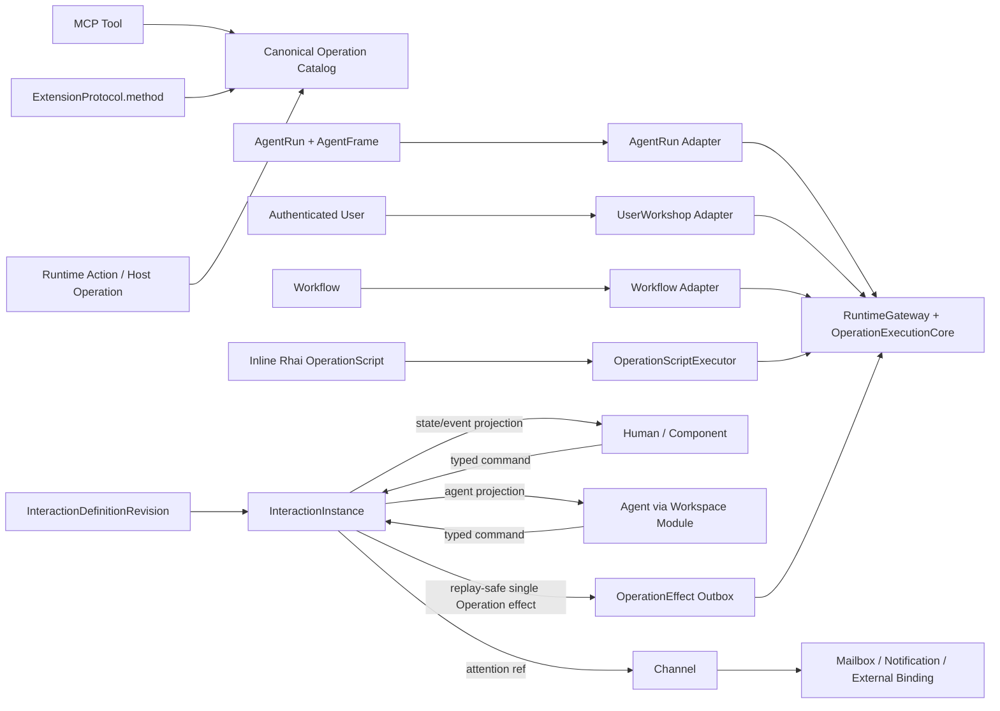

# Design · Workspace Module 通用双工交互系统

## 1. 目标架构



核心边界：

- `Operation` 是所有可调用能力的统一描述和执行单位。
- `OperationScript` 是一次性的 inline Rhai 脚本执行能力，用于组合 Operations 并处理 JSON 结果；它不是 asset、job、Workflow 或 Interaction state。
- `InteractionInstance` 是 Human/Agent 共享 state/revision/command/event 的唯一事实源。
- Canvas 是 `InteractionDefinitionRevision(kind=canvas)` 的 source/presentation authoring format，不是独立 aggregate 或 runtime instance。
- Extension 贡献 Component + Operation；不贡献 Interaction reducer。
- Workspace Module 只做 Agent-facing projection；RuntimeGateway/OperationExecutionCore 承担 actor-neutral admission/dispatch。
- AgentFrame 只服务 AgentRun adapter；RuntimeSession 不进入目标 authority/scope/placement/Interaction contract。
- Channel 只承担 attention/message/delivery。

## 2. Canonical Operation 与 RuntimeGateway

### 2.1 Operation descriptor

```text
OperationDescriptor {
  operation_ref,              // provider-qualified identity + version
  input_schema,
  output_schema,
  effect_summary,
  required_capabilities,
  actor_visibility,
  execution_policy,
  replay_policy,             // non_replayable / idempotent / replay_safe
  readiness,
  provenance,
  dispatch
}
```

Provider adapters 可来自 MCP tool、ExtensionProtocol method、Runtime Action 或 host operation。Workspace Module 只按 module/category 组织 descriptor，不创建另一套 provider identity、schema 或 dispatch。

`operation_ref` 必须携带 exact provider identity/version；Extension protocol 不再按全局 key 首个命中。discovery、preflight、direct invoke 与 OperationScript nested invoke 使用同一个 actor-specific catalog。

### 2.2 Runtime invocation envelope

```text
RuntimeInvocationEnvelope {
  principal,            // User / AgentRunAgent / WorkflowNode / ExtensionInstallation
  scope,                // Project / InteractionInstance / Workspace binding
  origin,               // Canvas / ExtensionPanel / ComponentEvent / AgentTool / Workflow
  operation_ref,
  input,
  authority_revision,
  trace_context
}
```

规则：

- Canvas/Extension/Component 是 origin，不是 security principal。
- 用户操作使用 authenticated User principal；Extension 自治行为使用具备显式 grant 的 Installation service principal。
- AgentRun adapter 从 AgentFrame/effective capability 解析 surface；UserWorkshop adapter 从用户、Project、Interaction access 与 installation facts 解析 surface。
- `RuntimePlacementResolver` 在 admission 后根据 provider、Project/workspace binding 与在线执行器选择 cloud/local placement；客户端 backend id 和 RuntimeSession 不参与 placement authority。
- discovery handle/revision 只服务 UI 稳定性与 diagnostics；invoke 时重新解析 authorization/admission。

### 2.3 OperationExecutionCore

direct invocation 与 OperationScript nested invoke 共用：

```text
resolve current actor surface
  -> resolve exact OperationDescriptor
  -> input schema/effect validation
  -> capability + actor policy + runtime admission
  -> resolve placement
  -> invoke provider with child cancellation token
  -> output schema/size/result-ref handling
  -> trace/audit/finalize
```

Agent loop 的 message/tool hook 与 outer tool approval 留在 Agent adapter。任何 adapter 都不能绕过 common core 直接调用 provider。

## 3. OperationScript

### 3.1 定位

`OperationScript` 解决的问题是：Agent 能像受控 REPL 一样即时编写脚本，串行或批量调用多个 Operations，并使用普通脚本控制流对中间 JSON 结果做筛选、聚合和清理。

它只在一次 caller request 内运行：

- 不持久化 script asset 或 execution job。
- 不调用 LLM、不创建 AgentRun、不包含 human gate。
- 不后台运行、不跨请求保存变量、不承担恢复。
- 不自动 retry、compensation 或 rollback；已经完成的副作用保持真实。
- Workflow 可以把一次 OperationScript 执行作为 node，但复用同一 executor。

### 3.2 外部合同

```text
OperationScriptInput {
  language: "rhai_v1",
  host_api_version: 1,
  source,
  input,
  allowed_operations: [OperationRef...],
  limits?: {
    timeout_ms,
    max_operation_calls,
    max_parallelism,
    max_output_bytes
  }
}
```

`allowed_operations` 是本次 script 可调用面的显式 manifest。script 中的 `ops.invoke()`/`ops.invoke_all()` 只能使用 manifest 内的 exact ref；preflight 解析当前 descriptor、capability/effect/replay summary，并生成 execution plan digest。V1 不允许 allowed manifest 包含 OperationScript 自身，避免递归 evaluator。

preflight 返回短期 opaque token，绑定 `language/host_api_version + source_digest + input_digest + descriptor/effect_manifest_digest + normalized_limits + principal/scope + expiry`。run 对任一不匹配都拒绝，并在每个 nested invoke 重新读取当前 surface，避免 approval substitution 与 TOCTOU。

入口：

- `operation_script_preflight`：编译 Rhai、校验 host surface/allowed Operations/limits，返回 diagnostics、execution plan digest、effect/capability/replay summary 和短期 plan token；不产生副作用。
- `operation_script_run`：消费同一 plan token，生成 ephemeral `script_execution_id`，在 caller cancellation/timeout 内返回 JSON output 或 scoped result ref，以及 root/child trace、已执行 call evidence 和 bounded diagnostics。

### 3.3 Engine boundary

Application 定义：

```text
OperationScriptExecutor
  -> OperationScriptEngine port
  -> OperationScriptHostCall port
```

Infrastructure 首个 adapter 复用现有 `RhaiScriptRuntime` 的 AST cache、JSON bridge 和 sandbox limits：max operations、call levels、string/array/map size。OperationScript executor 额外控制 wall-clock timeout、Operation call count、parallelism、result bytes 和 root cancellation。

Rhai evaluation 是同步 CPU work，RuntimeGateway invocation 是异步 I/O。adapter 因此在有 `max_concurrent_scripts` admission 的专用 worker pool 中运行 execution-scoped evaluator，通过有界 request/response host-call bridge 把调用交回 Application async executor；Tokio core worker 不直接阻塞等待 Operation。

现有 `RhaiScriptRuntime` 可复用 limits、JSON bridge 与 AST cache 设计，但不能把带固定 helper closure 的全局 Engine 直接当作 OperationScript singleton。目标 adapter 使用 evaluator factory：共享已验证 AST/cache 与 sandbox profile，每次 execution 注入自己的 `ops` capability object、cancellation/deadline/progress hook 和 call counters。Rhai 纯 CPU loop 通过 progress hook 响应取消；等待中的 host call 通过 bridge cancellation 唤醒。

Rhai helper surface 至少包括：

- `ops.invoke(operation_ref, input)`：一次受控 Operation 调用，Rhai 语义为隐式等待。
- `ops.invoke_all(calls)`：受 `max_parallelism` 限制的 structured concurrency，保持输入顺序返回逐项 structured result。
- Rhai 自身 array/map/filter/control-flow 能力用于结果变换。

engine port 不把 Rhai AST、Dynamic 或 engine-specific error 暴露给 Application contract。以后增加 JavaScript sandbox 时只新增 adapter/`language` implementation，不改变 Canvas、Agent、Workflow 或 OperationExecutionCore。

OperationScript 不自动 replay。网络中断或取消无法证明 provider outcome 时返回 `outcome_unknown` call evidence；调用方不得把整个 script 当作安全 retry 单元。large result ref 继承 principal/scope/capability 与 TTL，不能作为跨 owner bearer token。

### 3.4 Canvas / Agent / Workflow 复用

- Agent 直接向 tool 提交 inline source。
- Canvas definition/source 可以保存 `.rhai` 文件或 inline source；Canvas JS/component event 通过 host bridge 把整段 source + input 交给 UserWorkshop adapter。
- iframe 不解释 Rhai，也拿不到 Operation credentials/placement facts。
- Workflow 以 inline source 调用 executor，durable source 由 Workflow definition 自己持有。
- script source 随 Canvas 保存时只是 Canvas definition source，不产生独立 OperationScript identity。

## 4. Interaction 模型

### 4.1 对象与所有权

| Object | Authority |
| --- | --- |
| `InteractionDefinition` | stable authoring asset identity、owner/scope、current revision pointer |
| `InteractionDefinitionRevision` | immutable V1 contract versions、SourceBundle digest、layout/component/resource slots/script bindings/initial state schema |
| `InteractionDefinitionLineage` | publish/copy/promote 的 exact source definition revision 与 actor/time |
| `InteractionInstance` | pinned definition revision、canonical state revision、command/event log、status |
| `InteractionAttachment` | User/AgentRun 对 instance 的 role 与 capability projection |
| `InteractionRuntimeBinding` | instance/attachment scoped authorized resource refs、exact component artifact digest 与 provider refs |
| `OperationEffectIntent` | command transaction 产生的 replay-safe 单 Operation durable outbox |
| `PresentationState` | per-user/client tab、layout、focus 偏好 |
| `RendererLease` | browser frame/generation/heartbeat；可重建，不拥有业务状态 |

Owner/lifetime：

- Personal definition → User-owned instance。
- Project definition → Project-owned instance。
- AgentRun 永远只是 optional attachment。
- tab、renderer、AgentRun、RuntimeSession 结束不删除 instance。
- explicit close + retention policy 管理 instance；默认不从 delivery/renderer 状态推断销毁。

### 4.2 V1 definition / source contract

```text
InteractionDefinitionRevision {
  definition_format_version: 1,
  interaction_contract_version: 1,
  source_bundle: {
    kind: "canvas_v1",
    entry_file,
    sandbox_profile,
    import_map,
    files,
    source_digest
  },
  state_schema,
  command_descriptors,
  resource_slots,
  component_refs,
  operation_script_bindings
}
```

`SourceBundle` 是随 revision 不可变的 authoring value；数据库可以用 revision child rows/object storage 实现，但 domain contract 只暴露 normalized bundle + digest。VFS 不修改旧 revision：一次 changeset 携带 base revision，对 create/write/delete/rename 归一化后原子创建新 source bundle/revision。

平台 command handler 固定版本化 identity，例如 `state_patch_v1`、`instance_close_v1`。`interaction_contract_version=1` 的既有 instance 永远使用 V1 语义；未来增加 V2 handler/reader 与显式迁移，不覆盖 V1 行为。

### 4.3 Definition concurrency

Definition 使用 immutable revision + optimistic CAS：

```text
save_definition_changeset(definition_id, base_revision, source_changeset)
  -> base matches current: create revision N+1
  -> base stale: conflict(current_revision, bounded diff metadata)
```

Human editor draft 留在客户端；Agent 的每次 VFS changeset 也以 base revision 保存。一个 changeset 可以包含多个文件 mutation，避免半个 rename/copy 被发布为不同 revision。没有独立 durable draft aggregate、CRDT 或实时协同编辑。

### 4.4 Typed command 与 state transition

```text
InteractionCommand {
  command_id,
  instance_ref,
  attachment_ref,
  actor,
  expected_revision,
  command_key,
  payload
}
  -> schema + actor policy + role/capability + idempotency + CAS
  -> platform-owned deterministic state transition
  -> append InteractionEvent + audit
  -> state revision + 1
  -> publish state/event projection
```

Actor policy 对 Agent 只有：

- `direct`：Agent 与 Human 都可以在各自 role/capability 允许时执行。
- `human_only`：Agent 不能提交 canonical command；只能向 Channel 发送非权威 suggestion/attention，Human 查看后重新提交正式 command。

Interaction 不拥有 proposal/approval/request lifecycle。PermissionGrant 继续只管理 capability grant，LifecycleGate 继续只管理 wait/result，Channel/Mailbox 继续只管理 delivery。

Canonical state transition 由 Interaction service 在服务端拥有：

- V1 通用 mutation 固定为 `state_patch_v1`：payload 是有界 JSON Patch，只允许 `add/remove/replace`，path 必须命中 definition command descriptor 的 JSON Pointer allowlist。
- patch 前校验 input schema/expected revision/actor policy，patch 后校验完整 state schema、patch count 与 state bytes；command idempotency、event、state revision 和 audit 在同一事务提交。
- 其它平台行为使用封闭且版本化的 typed handler，例如 `instance_close_v1`；新增 handler 需要明确不变量和 contract version。
- 不建设 generic handler registry、declarative reducer DSL 或 arbitrary script reducer。
- Extension component 不能执行 canonical reducer。

Component event binding 只有 schema validation + payload pass-through：目标要么是一个 exact platform command descriptor，要么是一个即时 Operation/OperationScript action。binding 不执行服务端表达式、字段 transform 或 reducer；需要不同 payload 的 component 由其事件合同或 Canvas host code 构造目标 command payload。

Agent 只看到 definition 声明的 `agent_projection`，不默认读取秘密字段或整份表单。

### 4.5 External effect boundary

即时 Operation/OperationScript action 与 canonical command 是两条显式路径：即时 action 返回结果/partial-call evidence，但不自动写 Interaction state，也不自动 replay。

当 canonical command 必须可靠触发外部副作用时，state transaction 可以同时写一个 `OperationEffectIntent`：

```text
OperationEffectIntent {
  effect_id,                 // command-derived stable idempotency identity
  interaction_instance_ref,
  command_id,
  exact_operation_ref,
  input,
  principal_scope,
  status,
  attempt_evidence
}
```

只有 descriptor 声明 `idempotent/replay_safe` 的单 Operation 可进入 outbox；dispatcher 每次 replay 仍进入 OperationExecutionCore。复杂多步可靠执行通过单个 `workflow.start` 类 Operation 进入 Workflow。OperationScript 不进入 durable effect outbox，因其多步 partial side effects 不能在通用层承诺 replay safety。

### 4.6 Channel boundary

Interaction service 拥有 command schema、state revision、event ordering 和 persistence。需要异步唤醒、外部参与者或 Agent mailbox handoff 时，向 Channel 投递：

```text
AttentionRequested {
  interaction_instance_ref,
  event_ref,
  target,
  summary
}
```

Channel 不成为 local UI/Agent command bus，不保存 canonical state/event body。

## 5. Extension Component ABI

### 5.1 Existing behavior reuse

当前 Extension runtime actions、protocol methods 和 backend services 全部作为 canonical Operation providers 保留。第三方复杂业务状态仍由 Extension 自己的 Operation/backend service 拥有；Interaction 只保存 host-owned shared state、refs 或声明的 projection。

### 5.2 Component descriptor

```text
ui_components[] {
  component_key,
  contract_version,
  renderer: { kind: iframe, entry },
  props_schema,
  events_schema,
  state_projection_schema,
  slots,
  sizing,
  sandbox_profile
}
```

Interaction definition 保存 logical component contract ref、layout/slot、props/state projection binding，以及 event → platform command / OperationScript binding。Definition 不保存 installation id、backend id 或可变 URL。

### 5.3 Runtime protocol and security

- 每个 component instance 使用宿主创建的 scoped MessageChannel。
- Host → component：initialize、props/state projection、binding result、theme/locale、dispose。
- Component → host：ready、resize、typed event、diagnostic。
- props/events/output 进行 JSON Schema validation。
- iframe 不使用 `allow-same-origin`；独立 CSP 默认禁止任意网络。
- component 看不到 Project/session/backend/workspace root，也不能直接 invoke generic Operation 或 reducer。

### 5.4 Artifact pinning / upgrade

- InteractionInstance 固定 definition revision。
- 实例化时 Project installation authority 把 logical component ref 解析为 exact package/artifact digest，并写入 runtime binding。
- Extension 安装升级只供新 definition revision/new instance 使用；existing instance 不自动 re-resolve。
- 当前任务不建设通用 state/schema migration engine。需要新版本时创建新 definition revision 和新 instance。
- referenced old artifact 在 instance 存续期间保持可寻址；installation disable 时 existing instance structured unavailable，不静默切换新 artifact。
- artifact repository/cache 以 exact digest 为地址并跟踪 runtime binding 引用；安装升级不能覆盖仍被 instance 引用的 artifact，清理只发生在引用和保留策略均允许之后。

## 6. Canvas 最终替换

目标模型不保留独立 Canvas aggregate/persistence authority：

| Current | Target |
| --- | --- |
| `Canvas` + `canvases/canvas_files/canvas_bindings` | `InteractionDefinition(kind=canvas)` + immutable V1 revisions/SourceBundle |
| personal/project Canvas scope | definition owner/scope |
| Canvas source update whole overwrite | atomic VFS changeset + definition revision CAS |
| publish/copy/unpublish lineage fields | exact `InteractionDefinitionLineage` + catalog archive status |
| Canvas runtime data binding metadata | definition resource slot + instance/attachment `InteractionRuntimeBinding` |
| AgentRun Canvas attach/present | InteractionAttachment + Workspace Module projection |
| Canvas runtime snapshot | definition authoring preview 或 InteractionInstance runtime view |
| Canvas interaction latest snapshot | InteractionInstance canonical state/event |
| frame_id/generation | RendererLease |
| Canvas module/presentation identity | `canvas:{definition_id}` / `canvas://{definition_id}` authoring preview |
| shared runtime module/presentation identity | `interaction:{instance_id}` / `interaction://{instance_id}` |
| Canvas Extension promotion | 从 exact definition revision 构建 package artifact |

### 6.1 Identity 与 authoring/runtime 分层

- `InteractionDefinition.id` 是稳定资产身份，revision/source digest 是不可变内容身份；VFS mount id 只是 authoring adapter identity。
- `InteractionInstance.id` 是共享运行态身份；AgentRun attachment、browser renderer lease 和 Workspace tab 都只引用它。
- Definition preview 可以渲染 source/initial state 并通过 UserWorkshop 运行即时 Operation/OperationScript，但不伪装成 canonical shared instance。
- 需要共享/恢复/Agent command 的场景显式创建或打开 InteractionInstance。

### 6.2 Personal / Project distribution 与 lineage

- Personal publish 读取 exact source revision，创建或 CAS 更新独立 Project-owned definition revision，并记录 `published_from_definition_revision`、actor/time。Project 版本不会跟随 Personal current revision 静默变化。
- copy-to-personal 从 exact source revision 创建新的 User-owned definition；后续 source、instances 和 publication lifecycle 独立。
- unpublish/archive 从 Project catalog 移除 definition，但被 InteractionInstance、Extension artifact 或 lineage 引用的 revision/source bundle 保持可寻址；真正清理由引用与 retention 决定。
- Extension promotion 只消费 exact definition revision/source bundle，生成 artifact 后不再读取 definition current pointer。

### 6.3 Resource binding

- Definition revision 声明 logical resource slots：alias、schema/content type、access mode、required/optional；source 只引用 slot，不保存 backend path/secret/capability。
- `InteractionRuntimeBinding` 将 slot 绑定到 authorized `ResourceRef`。Project/instance binding 可供共享 runtime 使用；attachment-local binding 只服务对应 actor 的 preview/projection，不能自动进入 shared canonical effect。
- 每次读取或 Operation 调用仍重新 authorization；binding revision/handle 不是 bearer capability。生成到 VFS 的 `bindings/*` 文件保持只读 projection。

### 6.4 Initial migration

因为没有需保留的生产存量，新增 migration 直接创建最终 Interaction schema并删除旧 Canvas/runtime snapshot/state 表与约束；fixtures、seed、examples 和 tests 按新模型重建。没有 data backfill、旧 decoder、legacy route 或 fallback。

## 7. V1 之后的兼容与迁移

首次替换只写 V1 数据，因此不需要旧 Canvas decoder；但最终 schema 与 wire contract 从第一天保存显式 discriminator：

- definition format、interaction command/state handler、OperationScript dialect/host API、component contract 和 OperationRef 都有稳定 version。
- instance 固定 definition revision/interaction contract version；runtime binding 固定 artifact/resource refs。
- future breaking change 以 V2 reader/handler/new revision/new instance 引入。需要延续既有实例时，编写显式、可审计的 V1→V2 migration；不按 JSON 字段存在性猜测版本。
- archived definition revision、source bundle、artifact 与 V1 handler 的保留期由实际引用决定。清理前必须证明没有 live instance、lineage、artifact 或 audit 引用。
- additive wire change 仍遵守 generated contracts 和 schema validation；不会借“同为 V1”改变已有字段语义。

## 8. End-to-End Acceptance Scenarios

### OperationScript

- AgentRun 与 standalone UserWorkshop 分别运行同一 inline Rhai source。
- script 调用两个 Operations，对第一个结果 filter/map 后构造第二个 input，最终清理输出。
- 验证 plan token binding、manifest、nested admission、capability revocation、worker admission、CPU/host-call timeout/cancel、call/parallel/output limits、root/child trace 与 scoped result ref。

### Interaction

- Human command → canonical state/event → Agent observe → Agent direct command → renderer patch/rebuild。
- human-only command 被 Agent 拒绝；Agent 只能发送 attention，Human 随后提交正式 command。
- `state_patch_v1` path/schema/size/revision validation、definition changeset CAS、instance reload、多 tab lease 与 explicit close/retention 可验证。
- replay-safe OperationEffectIntent 在 state commit 后可恢复执行；非 replay-safe 或多步脚本不会进入该 outbox。

### Component composition

- Extension isolated iframe component 发 typed event。
- Host binding 唯一映射为平台 command 或 OperationScript。
- 验证 component schema/CSP/MessageChannel、artifact pinning、installation disable unavailable 与新 version/new instance。

### Canvas distribution / resources

- Personal definition publish、Project unpublish、copy-to-personal 与 Extension promotion 全部固定 exact source revision/lineage。
- authoring preview 与 Interaction runtime 使用不同 module/presentation identity；shared VFS read-only、resource slot binding 和 attachment-local binding authority 可验证。

## 9. Review Gate

- OperationScript 是 ephemeral inline Rhai capability，无独立 asset/job/REPL persistence。
- OperationScript executor async、Rhai `rhai_v1` 同步语义、execution-scoped `ops` capability 与 bounded structured concurrency 已固定。
- RuntimeGateway principal/scope/origin/placement/trace 与 RuntimeSession 脱钩。
- Interaction owner/lifetime、direct/human-only、`state_patch_v1`、OperationEffectIntent 与 definition/source changeset CAS 已固定。
- Extension 只贡献 Component + Operation，不贡献 reducer；instance exact artifact pin，无自动升级/state migration。
- Canvas 独立 aggregate/runtime snapshot/state 通过新 migration 与代码清扫整体删除。
- Canvas distribution/lineage、resource binding、VFS、promotion 和 authoring/runtime public identity 在新模型中有完整落点。
- 所有持久化/调用合同携带 V1 discriminator；future breaking change 通过 V2 与显式 migration 演进。
- Workspace Module 只做 projection；Interaction command/event 与 Channel message/delivery 不合并。
- 父任务 `work-items/` 统一覆盖完整实现、spec、migration 和最终残留验证。
