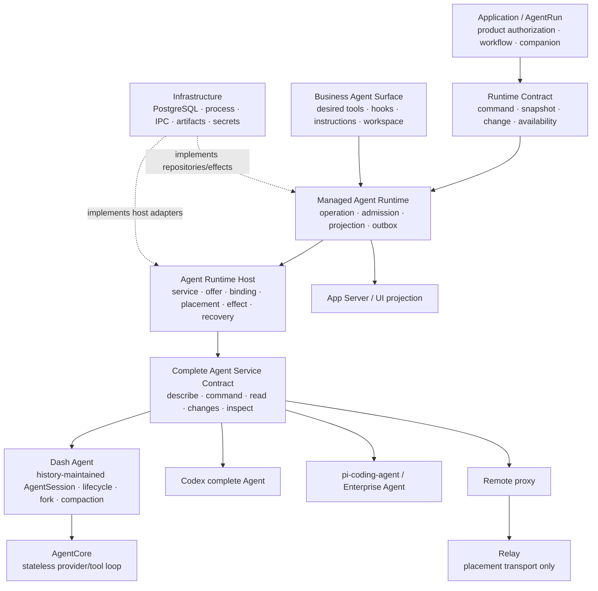
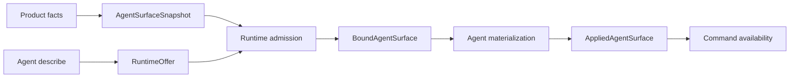
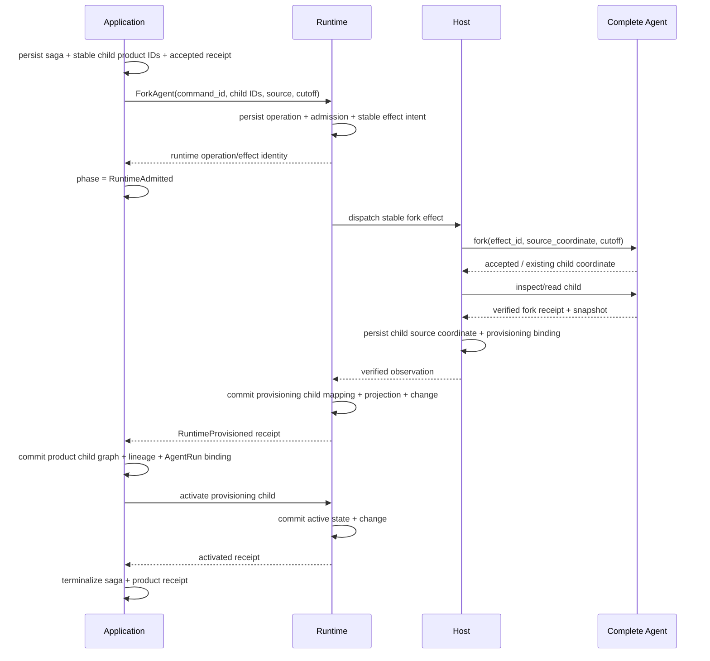
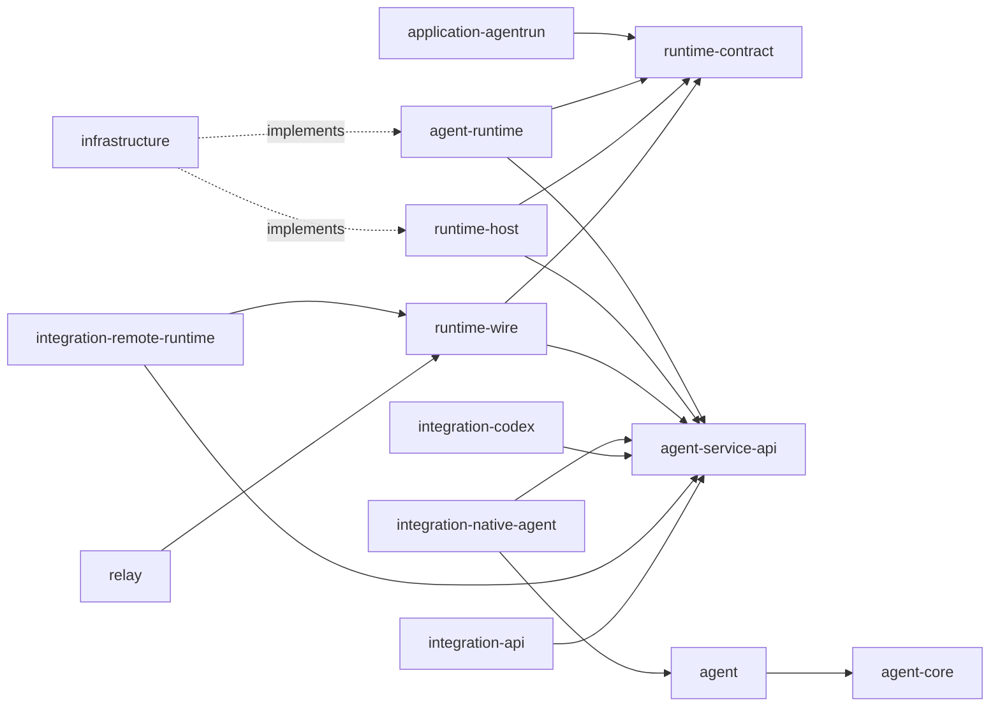
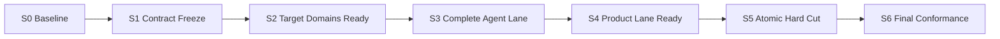

# Agent Runtime 最终架构收敛设计

## 0. Review 结论

当前 07-17 规划不能直接作为本分支的最终实施方案，但其问题定义和部分机制可以保留。

| 设计部分 | 评估 | 最终处理 |
| --- | --- | --- |
| 07-10 统一 Managed Agent Runtime 外层 | 正确且当前分支已建立主要骨架 | 作为不可删除的顶层边界继续完成 |
| RuntimeOffer / AgentSurface / Binding / Host | 正确 | 保留并扩展到完整 Agent service capability |
| 将 Native、Codex、Remote 统一成低层 `AgentExecutionPort` | 抽象层级过低 | 提升为 Complete Agent Service seam |
| 单一平台 `AgentSession` aggregate 拥有全部会话与协调事实 | 不满足 owner 边界 | 拆成 Runtime State、Host coordination、完整 Agent state |
| typed Turn、effect identity、generation fence、snapshot/change/outbox | 机制正确 | 分配给 Runtime、Host 或 Dash Agent 的真实 owner |
| 通用平台 context/compaction kernel | 只适用于 Dash Agent | 下放 Dash Agent；外部 Agent 通过能力合同接入 |
| 删除 `RuntimeJournalFact` 事实混合 | 正确 | 改用 owner-specific state + Runtime platform change |
| Fork 从 repository copy/journal cutoff 完成 | 不适用于完整外部 Agent | 改为 platform saga + native Agent fork |
| crate 清理 | 07-10 尚未完成 | 纳入本任务最终验收 |

最终不是删除 Runtime，而是在 Runtime 下方补出此前缺失的完整 Agent 边界：

```text
Application / AgentRun
  -> Managed Agent Runtime
  -> Agent Runtime Host
  -> Complete Agent Service
      -> Dash Agent -> AgentCore
      -> Codex
      -> pi-coding-agent / Enterprise Agent
      -> Remote Agent proxy
```

## 1. 第一性原理

### 1.1 必须存在的四类事实

#### 平台产品事实

AgentRun、LifecycleRun/Agent、Frame、Companion relation、权限、Workflow、Task、Workspace
等是 AgentDash 产品事实。它们不因底层 Agent 实现替换而改变。

#### 平台 Runtime 事实

平台需要一个跨所有 Agent 实现稳定的 command、operation、availability、
normalized snapshot/change、surface admission 和 AgentRun mapping 合同。否则
Application/UI 会重新依赖 vendor 分支。

#### 完整 Agent 事实

一个完整 Agent 必须能独立维护自己的 history、fork、context/compaction 和运行
lifecycle。Codex、pi-coding-agent、Dash Agent 均属于此类；平台不能把它们降成一次
provider call。

#### Execution coordination 事实

service instance、offer、binding、placement、generation、lease、effect delivery 和
unknown-outcome recovery 是 Host coordination。它们既不是产品状态，也不是 Agent
history。

### 1.2 Session 定义

`Session` 只表示完整状态由有序 history 唯一维护和重建的对象。

```text
AgentSessionState = fold(AgentHistory)
```

- 输入通过形成 history contribution 改变 Session；
- fork 是 history tree 分叉；
- compaction 是保留 provenance 的 history 变换；
- resume 是从 history 恢复；
- active/terminal 等 Session 内状态只有在 history 中存在对应事实时才成立；
- projection/index 只用于读取性能，可删除后从 history 重建。

operation、mailbox、surface、binding、credential、placement、lease、effect、
recovery ledger 和平台业务状态不能进入 Session，也不能使用 Session 命名。

### 1.3 最小复杂度原则

新增模块只允许由以下理由产生：

1. 需要阻止错误依赖方向；
2. 是可替换实现的稳定 seam；
3. 需要独立生成/传输协议；
4. 是 infrastructure adapter 边界；
5. 拥有独立事务或恢复事实。

无法满足其中任一条件的 pass-through crate/module 应被相邻 owner 吸收。

## 2. 目标架构



### 2.1 Application / AgentRun

Application 负责：

- AgentRun 与产品 graph；
- 权限、Workflow、Task、Workspace、Companion 产品关系；
- product command receipt；
- 为 Runtime Surface 提供 typed product facts。

Application 不读取 Agent 内部 repository，不选择 concrete Agent，不解析 vendor event。

### 2.2 Managed Agent Runtime

Runtime 是所有 Agent 实现的统一平台外层，负责：

- Runtime command 与 operation；
- idempotency、expected revision、availability；
- `AgentSurfaceSnapshot` 编译与 admission；
- AgentRun ↔ Runtime ↔ opaque Agent coordinate mapping；
- durable command delivery intent；
- normalized platform snapshot/change/outbox；
- platform consistency 和 recovery orchestration；
- Tool Broker 的平台 policy/effect 路由。

Runtime 不拥有外部 Agent 的 history/context，不实现所有 Agent 共用的 compaction
algorithm。

### 2.3 Agent Runtime Host

Host 负责：

- trusted service definition/contribution；
- service instance、credential reference、health；
- `RuntimeOffer`；
- sticky `RuntimeBinding`；
- placement、driver generation、source coordinate；
- `BoundAgentSurface` materialization 与 `AppliedAgentSurface` evidence；
- lease、effect delivery、inspect/reconcile。

Host 不编译产品 Surface，不解释 Agent history，也不写 Runtime projection entity。

### 2.4 Complete Agent Service

这是完整 Agent 的可替换边界。Dash Agent、Codex、企业 Agent 和 remote proxy 均实现同一
有限合同，但通过 capability/fidelity 表达支持程度。

### 2.5 Dash Agent

Dash Agent 是 AgentDash 自有完整 Agent，负责：

- history-maintained `AgentSession`；
- history tree、resume、fork、navigation；
- input/turn/tool/history lifecycle；
- context construction、compaction、retry/continuation；
- 与 AgentCore 的调用；
- 自己可证明的 snapshot/change。

Dash Agent 不是 Managed Agent Runtime。它与 Codex 是 Complete Agent seam 下的同级
实现。

### 2.6 AgentCore

AgentCore 接受显式 context、tools、provider、callbacks、cancel token 和一次输入，产生
typed stream/output。每次调用的完整状态由参数和返回值表达；它不访问 durable
repository。

## 3. Ownership 矩阵

| Fact | Write owner | Durable source | Runtime 权限 | Read projection |
| --- | --- | --- | --- | --- |
| AgentRun / Frame / Companion | Application | product tables | typed product fact read | Application query |
| Runtime operation/idempotency | Managed Runtime | runtime operation tables | owner | Runtime snapshot/change |
| Runtime pending delivery | Managed Runtime | runtime command/effect intent | owner | operation availability |
| desired Agent Surface | Managed Runtime | immutable surface snapshot | owner | bound/applied surface view |
| service offer/binding/placement | Host | host tables | admission/reconcile request | Runtime binding view |
| effect/lease/generation | Host | host ledger | correlate by stable ID | health/recovery view |
| external Agent history/context | concrete Agent | Agent-native store | finite command + read | normalized projection |
| Dash AgentSession | Dash Agent | ordered Agent history | Complete Agent command/read | Dash snapshot/change |
| Dash command queue/execution saga | Dash Agent service, outside Session | Dash execution tables/history-linked ledger | inspect only | Agent activity/receipt |
| AgentCore loop state | AgentCore invocation | none beyond explicit input/output | none | typed output stream |
| normalized conversation | Managed Runtime | projection tables + source revision | owner of platform projection only | Application/UI snapshot |
| platform change tail/outbox | Managed Runtime | change/outbox tables | owner | SSE/App Server/UI |
| protocol notification/feed | projection adapter | rebuildable/read-side store | read only | client payload |

### 3.1 Authority tags

Runtime projection 中每个 section 必须带 authority/fidelity：

```rust
enum ProjectionAuthority {
    PlatformOwned,
    AgentAuthoritative,
    Derived,
}

struct ProjectionSource {
    authority: ProjectionAuthority,
    source_revision: Option<String>,
    fidelity: SemanticFidelity,
    observed_at: Timestamp,
}
```

`AgentAuthoritative` 表示该 section 来自完整 Agent；平台持久化它是为了稳定产品读取，并
不获得反向写权限。

## 4. 公共合同

### 4.1 Application ↔ Runtime Contract

`agentdash-agent-runtime-contract` 只定义平台公共语言：

```rust
trait AgentRuntimeGateway {
    async fn execute(
        &self,
        command: RuntimeCommandEnvelope,
    ) -> Result<RuntimeCommandReceipt, RuntimeError>;

    async fn read(
        &self,
        query: RuntimeReadQuery,
    ) -> Result<RuntimeSnapshot, RuntimeError>;

    async fn changes(
        &self,
        after: RuntimeChangeCursor,
    ) -> Result<RuntimeChangePage, RuntimeError>;
}
```

Runtime command 表达 AgentDash 产品意图，不包含 vendor source ID、driver generation
或 AgentCore callback。

### 4.2 Host ↔ Complete Agent Service Contract

建立 dependency-light 的 `agentdash-agent-service-api`：

```rust
trait CompleteAgentService {
    async fn describe(&self) -> Result<AgentServiceDescriptor, AgentServiceError>;

    async fn create(
        &self,
        command: CreateAgentCommand,
    ) -> Result<AgentCommandReceipt, AgentServiceError>;

    async fn resume(
        &self,
        command: ResumeAgentCommand,
    ) -> Result<AgentCommandReceipt, AgentServiceError>;

    async fn fork(
        &self,
        command: ForkAgentCommand,
    ) -> Result<ForkAgentReceipt, AgentServiceError>;

    async fn execute(
        &self,
        command: AgentCommandEnvelope,
    ) -> Result<AgentCommandReceipt, AgentServiceError>;

    async fn read(
        &self,
        query: AgentReadQuery,
    ) -> Result<AgentSnapshot, AgentServiceError>;

    async fn changes(
        &self,
        query: AgentChangesQuery,
    ) -> Result<AgentChangePage, AgentServiceError>;

    async fn inspect(
        &self,
        identity: AgentEffectIdentity,
    ) -> Result<AgentEffectInspection, AgentServiceError>;

    async fn apply_surface(
        &self,
        command: ApplyBoundAgentSurface,
    ) -> Result<AppliedAgentSurfaceReceipt, AgentServiceError>;

    async fn revoke_surface(
        &self,
        command: RevokeBoundAgentSurface,
    ) -> Result<AgentCommandReceipt, AgentServiceError>;
}
```

这里的 trait 是逻辑合同；同进程实现可直接调用，Remote 经 wire transport 实现。合同
要求 snapshot read 和 effect inspect；ordered change tail 根据 profile 可选。

`execute` command vocabulary 至少包括：

- `SubmitInput`
- `Steer`
- `Interrupt`
- `RequestCompaction`
- `ResolveInteraction`
- `Close`

create/resume/fork 独立是因为它们改变 source coordinate/binding，不能伪装成已绑定
对象上的普通 dispatch。

Fresh create 可携带 `Option<InitialAgentContextPackage>`。这是 create effect 的一部分，
不是创建后的普通 input；receipt 与 `inspect(effect_id)` 必须返回 applied package
digest、delivery fidelity 和 source Agent coordinate。若 external Agent 需要多次 native
调用才能完成 create + context apply，adapter 在 Complete Agent seam 内持久化同一
create effect 的小型 saga，直到 package 可验证后才返回 applied。Runtime 不观察或编排
这些 vendor steps。

### 4.3 Agent ↔ Host reverse callbacks

Agent-native Tool/Hook 必须仍穿过 Complete Agent seam：

```rust
trait AgentHostCallbacks {
    async fn invoke_tool(
        &self,
        call: AgentToolInvocation,
    ) -> Result<AgentToolResult, AgentHostCallbackError>;

    async fn invoke_hook(
        &self,
        call: AgentHookInvocation,
    ) -> Result<AgentHookDecision, AgentHostCallbackError>;
}
```

`ApplyBoundAgentSurface` 固定 callback route/endpoint、binding generation、tool/hook
revision 与 semantic deadline。每个 reverse call 携带 stable effect identity、
Runtime/Agent Turn/Item coordinate、idempotency key 和 deadline。Blocking/mutating Hook
的 decision 是 typed allow/deny/replace/effect，不使用 observation 模拟。

Remote proxy 将 callback 编码为双向 Runtime Wire request/response；request sequence、
ack/replay、duplicate result 和 generation fence 与正向 command 使用同一 transport
guarantee。

### 4.4 Receipt 与 observation

```text
Runtime Operation
  -> Host EffectIdentity
  -> Agent CommandReceipt(Accepted | Rejected | AlreadyApplied | Unknown)
  -> Agent Snapshot/Change/Inspection
  -> Runtime Operation terminal
```

Agent receipt 只证明 Agent 接受了什么；Runtime 只有在观察到满足合同的 terminal 或
inspect 结果后才能提交相应 platform terminal。

### 4.5 Snapshot 与 source change

所有 Complete Agent 必须提供可对账 snapshot。source change 支持分为：

- `OrderedDurableTail`：可按稳定 cursor 追增量；
- `OrderedLiveStream`：进程活跃期间有序，重启后需 snapshot reconcile；
- `SnapshotOnly`：Runtime 周期/命令后读取 snapshot；
- `ObservationOnly`：只能作为低保真 telemetry，不能驱动 required canonical field。

Runtime 自己始终提供 durable platform change tail。source change 等级只影响 Runtime
如何更新 projection，不改变 Application reconnect 合同。

## 5. Capability 与 Surface

### 5.1 四个对象

| Object | Owner | Purpose |
| --- | --- | --- |
| `AgentSurfaceSnapshot` | Runtime Surface compiler | 平台期望交付的 immutable requirements |
| `RuntimeOffer` | Host | 某 service instance 的实际能力与约束 |
| `BoundAgentSurface` | Runtime admission | 逐项求交后的 route/fidelity/revision |
| `AppliedAgentSurface` | Agent adapter + Host evidence | 实际 materialize 的 digest/ack/status |

### 5.2 Profile facets

Profile 至少按以下 facet 独立描述：

- lifecycle：create/resume/close；
- input：text/structured/multimodal；
- fork：cutoff kinds、lineage、native durability；
- command：submit/steer/interrupt/interaction；
- context：opaque/read snapshot/typed revision/exact apply，以及 initial package 的
  contribution kinds、delivery fidelity 与 applied-digest evidence；
- compaction：Agent-owned/native、exact managed、observed、unsupported；
- tools：prompt declaration、broker callback、native dynamic update；
- hooks：逐 HookPoint 的 timing/blocking/mutation/effect；
- changes：durable tail/live/snapshot-only；
- telemetry/config。

### 5.3 Semantic strength

不同 facet 使用适合自身的 typed strength，而不是一个万能 bool。公共比较关系只表达
“能否满足 requirement”：

```text
Unsupported < Observed < Approximation < Exact
```

并非所有 facet 都允许中间等级。例如 fork required 时只接受与 cutoff contract 匹配的
Exact；PromptOnly/Approximation 不能形成 fork lineage。

### 5.4 Admission



required contribution 不满足时，Runtime 在任何 Agent side effect 前返回 typed
incompatibility。只有 applied evidence 与 bound revision/digest 一致后，对应 command
才进入 available。

### 5.5 Tool 与 Hook causal route

每个 contribution 只能选择一个 route：

- Runtime Tool Broker；
- Agent-native callback/tool registry；
- Host lifecycle effect；
- immutable prompt/context delivery；
- observation only。

Bound surface 固定 route。工具调用或 Hook 触发不得广播给多个 owner 后再去重。

## 6. Managed Runtime State

### 6.1 Runtime aggregate

Runtime aggregate 使用 `Runtime State`/`Runtime Thread` 命名，不使用 Session：

```text
RuntimeState
  identity
  product_mapping
  desired_surface_revision
  bound_surface_revision
  binding_ref + generation
  operations
  pending_delivery
  normalized_projection
  projection_source_revision
  consistency
  change_revision
```

### 6.2 正交状态机

#### Operation

```text
Accepted -> DispatchPending -> AgentAccepted -> Succeeded
                                     \-> Failed
                                     \-> Lost
Accepted -> Rejected
```

#### Delivery effect

```text
Pending -> Claimed -> Applied
                  \-> Retryable
                  \-> Unknown -> Inspecting -> Applied | Retryable | Lost
```

#### Projection consistency

```text
Current | Reconciling | Stale | Lost
```

#### Binding

```text
Unbound | Binding | Active | Rebinding | Lost | Closed
```

这些状态通过 stable ID 相关联，但不合并为巨型 enum。Agent 内部 active Turn 不由 Runtime
worker claim 推断；它来自 Agent snapshot/change 并带 source fidelity。

### 6.3 Runtime transaction

一次 Runtime 事务只原子提交平台事实：

- operation transition；
- pending delivery/effect intent；
- normalized projection change；
- Runtime change/outbox；
- platform mapping/consistency。

它不试图与外部 Agent repository 原子提交。跨边界通过 idempotent identity +
inspect/reconcile 收敛。

## 7. Host coordination

### 7.1 RuntimeOffer

Host 把 service descriptor、instance config、credential availability、health、placement
transport 和 host policy 归一为 `RuntimeOffer`。Offer 记录 provenance，不接受 adapter
自报后未经验证的能力。

### 7.2 Binding

`RuntimeBinding` 固定：

- Runtime coordinate；
- service definition/instance；
- source Agent coordinate；
- placement；
- driver generation；
- offer/profile digest；
- Bound/Applied surface revision/digest；
- lifecycle state。

Binding 默认 sticky。health 变化不自动换 Agent；rebind 是显式 recovery operation。

### 7.3 Effect ledger

Effect identity 至少包含 Runtime operation、binding、generation、command kind 和 stable
attempt family。相同 identity 重投必须返回 AlreadyApplied/同一 receipt；新 generation
不得接受旧 observation。

### 7.4 Remote

Remote proxy 实现 Complete Agent Service；Relay 只传输 typed command/receipt/change/
inspect frame、sequence、ack 和 replay。Relay 不拥有 Agent identity、history 或 surface
policy。

## 8. Dash Agent 设计

### 8.1 内部分层

```text
Dash Agent
  agent_session/        # history + fold + fork/compaction history semantics
  lifecycle/            # command admission、queue、continuation、execution saga
  context/              # history -> provider context materialization
  tools/                # bound tool callback integration
  service/              # Dash public API / adapter-facing boundary
  -> AgentCore
```

`lifecycle` 与 `service` 属于完整 Agent，但不是 `AgentSession`。它们可以持久化 command
ledger、queue、effect 和 retry state；这些状态不得改变 Session 内容，只有形成新的
history entry 后才改变 Session projection。

### 8.2 Agent history

Dash Agent history 使用 append-only tree：

```text
AgentHistory
  root
  branches
  head
  entries:
    InitialContextInstalled
    InputAccepted
    TurnStarted
    ItemStarted / ItemCompleted
    AgentOutput
    ToolCall / ToolResult
    InteractionRequested / Resolved
    CompactionStarted / Applied / Failed
    TurnCompleted / Failed / Interrupted
    Closed
```

确切 entry vocabulary 可在实现时收窄，但所有 `AgentSession` 状态都必须由 history fold
产生。history entry 与 Runtime platform change 是不同事实域。

### 8.3 AgentCore API

```rust
async fn run_agent_loop(
    input: CoreInput,
    context: CoreContext,
    tools: ToolCallbacks,
    provider: Provider,
    callbacks: CoreCallbacks,
    cancel: CancellationToken,
) -> Result<CoreOutput, CoreError>;
```

Core 不持有 `Agent` mutex、queue、session ID、Runtime delegate、AgentDash summary policy
或 durable tool result cache。调用者负责把 Core output 写成 history。

### 8.4 Core 替换

Dash Agent 对 AgentCore 的依赖通过窄 loop interface。未来替换其它 AgentCore 时，只要
满足显式输入/输出/tool callback/cancel 语义，就不影响 Runtime 或 AgentRun。

## 9. Codex 与其它完整 Agent

### 9.1 Codex

Codex adapter 映射：

- Runtime create/resume/fork → Codex thread lifecycle；
- submit/steer/interrupt/compact → Codex command；
- thread/read → Agent snapshot；
- App Server notification → Agent change/observation；
- source ThreadId/TurnId → Host source coordinate；
- capability/config/plugin/dynamic tools → Applied surface evidence。

Codex ThreadStore/history 是 source recovery authority。Runtime projection 只服务
AgentDash 产品读取。当前没有 exact context read/apply 时，profile 必须声明
Opaque/Observed，不得复用 Dash Agent ContextRevision。

### 9.2 pi-coding-agent / Enterprise Agent

它们直接作为 Complete Agent 实现接入，不经过 Dash Agent 或 AgentCore。pi-mono 本次是
ownership 参考，不在本任务新增 adapter。

### 9.3 Native/Dash adapter

`agentdash-integration-native-agent` 是 Runtime service contract 与平台中立 Dash Agent
API 的 anti-corruption adapter。它负责 source coordinate、surface translation 和
service profile，不拥有第二套 history。

## 10. Fork

### 10.1 Common cutoff

公共保证以 completed Turn boundary 为最低 exact cutoff，因为它可以与 Codex
`lastTurnId` 和 Dash Agent history Turn 对齐。Item/entry/source cursor cutoff 是独立
capability；UI/API 只能提供 Bound surface 声明 Exact 的 cutoff，不做向前/向后取整。

```rust
enum AgentForkPoint {
    Head,
    CompletedTurn { turn_id: AgentTurnId },
    Item { item_id: AgentItemId },
    SourceCursor { value: OpaqueCursor, digest: Digest },
}
```

### 10.2 Fork saga

Fork saga 的唯一 durable owner 是 Application/AgentRun。`AgentRunForkSaga` 预分配
child LifecycleRun/Agent/Frame/AgentRun IDs，并保存 product command ID、source、
immutable cutoff、Runtime operation/effect identity、Agent child coordinate、Host
binding、Runtime child coordinate 和每阶段 receipt。

```text
Requested
  -> RuntimeAdmitted
  -> AgentForkPending
  -> AgentForkApplied
  -> RuntimeProvisioned
  -> ProductGraphCommitted
  -> RuntimeActivated
  -> Succeeded

Requested..RuntimeProvisioned -> Failed
any post-dispatch uncertain phase -> Reconciling -> next phase | Lost
```



Host 只在 Runtime effect intent durable 后调用 Agent。Application 调用 Runtime
返回未知时，以 deterministic command ID/read operation 找回同一 effect；Agent fork
返回未知时，Host 只 inspect 同一 effect identity。已创建 child 但平台尚未映射时，
inspect 必须返回相同 child coordinate。

Product graph 在 Agent/Host/Runtime provisioning 均可验证后才对产品提交；Runtime child
在 product graph commit 后显式激活。任意 restart 由 Application saga worker读取 phase
和各 owner 的 inspect/read 继续，不执行同步 delete compensation。

无法验证的 post-dispatch 结果进入 `Lost`，并保留已知 Agent child coordinate、
effect identity、Runtime/Host references 和预分配 product IDs；相同 product command
不得创建第二个 child。

### 10.3 Dash Agent fork

Dash Agent fork 从 immutable history cutoff 创建独立 child branch/head，并返回
source/child history digest。当前 Native 产品 fork 必须接入此路径，不能只创建空
binding。

### 10.4 Companion

Companion command 必须显式选择：

- `CompanionSliceMode::Full` → `ForkParentHistory`：调用完整 Agent exact fork；
- `Compact / WorkflowOnly / ConstraintsOnly` → `FreshWithContextPackage`：创建新
  Agent 并提交相应 typed context package。

`FreshWithContextPackage` 在 Complete Agent seam 上编译为平台中立合同：

```rust
struct InitialAgentContextPackage {
    package_id: AgentContextPackageId,
    schema_version: AgentContextSchemaVersion,
    mode: InitialContextMode,
    contributions: Vec<InitialContextContribution>,
    digest: Digest,
}

enum InitialContextMode {
    Compact,
    WorkflowOnly,
    ConstraintsOnly,
}

enum InitialContextContribution {
    CompactSummary {
        summary: ContextSummary,
        provenance: ContextProvenance,
    },
    WorkflowContext {
        state: WorkflowContextPayload,
        provenance: ContextProvenance,
    },
    ConstraintSet {
        constraints: ConstraintSetPayload,
        provenance: ContextProvenance,
    },
}

struct ContextProvenance {
    authority: ContextAuthorityKind,
    source: ContextSourceCoordinate,
    revision: ContextSourceRevision,
    digest: Digest,
}
```

Application 负责把 Companion slice 编译成该通用 package；service API 不出现
`Companion`、AgentRun ID 或 vendor DTO。`ContextSourceCoordinate` 是 service-owned
opaque typed coordinate，`authority` 至少区分 Agent history/snapshot、Workflow 与
Constraint，避免把平台 projection revision 冒充 Agent history revision。

Package 不携带 Workspace/VFS、Tool、Hook、credential 或 capability grant；这些属于
`AgentSurfaceSnapshot -> BoundAgentSurface -> AppliedAgentSurface`。Complete Agent
profile 对每个 contribution kind 声明：

- `TypedNative`：Agent 原生保留 typed contribution 与 provenance；
- `CanonicalRendered`：adapter 用版本化 canonical renderer 安装 immutable initial
  context，并回执 renderer version + rendered digest；
- `Unsupported`。

产品 surface 为每个 slice 声明允许的最低 fidelity。`CanonicalRendered` 只能在该
requirement 明确允许时 admission，不能冒充 typed native state。

`CreateAgentCommand.initial_context` 原子携带 package；create receipt/inspect 返回
package digest、applied fidelity 和 source coordinate。Runtime 在 evidence 到达前保持
child provisioning、不可激活。Companion 派发任务随后作为首个 `SubmitInput`；它只表示
交互输入，不能承担 initial context 安装。Dash Agent 把 package 写为首批
`InitialContextInstalled` history contribution；external adapter 必须在自己的 source
authority 中提供等价、可 inspect 的 create effect。

`adoption_mode` 只控制 child result 的回传/等待方式，与 history 创建正交。Runtime
不从 prompt 文本推断 fork，也不允许裁剪模式先继承完整 history 再隐藏。

## 11. Compaction

### 11.1 Complete Agent capability

```text
CompactionCapability
  AgentOwnedNative
  ExactContextRevision
  ObservedOnly
  Unsupported
```

- `AgentOwnedNative`：Runtime 发 command，Agent 自己维护 history/context replacement；
- `ExactContextRevision`：Agent 接受并可验证 typed candidate/apply；
- `ObservedOnly`：只投影 Agent 自发 compaction，不支持平台 command；
- `Unsupported`：admission 不提供 compaction。

### 11.2 Dash Agent history semantics

Dash Agent compaction 把旧 history prefix 变换为带 provenance 的 summary/history entry：

```text
source history revision
  -> CompactionStarted
  -> candidate(summary + retained suffix + provenance)
  -> CompactionApplied(new history revision)
  -> CompactionCompleted
```

AgentSession 的新状态仍由新 history 唯一重建。candidate generation、provider effect、
retry/unknown outcome 属于 Dash lifecycle/effect ledger，不是 Session field。

### 11.3 Manual compaction

- idle 时可开始独立 maintenance activity；
- normal Turn active 时 command durable queued；
- queued 不创建 Turn/Item；
- 当前 Turn terminal 后由 Dash lifecycle 原子选择下一 command；
- compaction active 时新输入进入 Dash command inbox，不 steer 进 maintenance Turn；
- success 后保持 idle，不隐式创建 Agent Turn。

### 11.4 Automatic overflow A/B/C

```text
A: Agent Turn fails with recoverable context overflow
B: independent ContextCompaction activity
C: independent continuation input/Turn
```

- A、B、C ID 独立；
- A 创建 durable continuation intent；
- B terminal commit 只解除/终结 dependency，不创建 C；
- lifecycle 独立 promotion 后才形成 C history entries；
- B clean Failed 时 C exactly-once Failed，其他无依赖 command 可继续；
- B Lost 时 C blocked/Lost，Dash execution consistency 阻塞 promotion；
- duplicate effect、reclaim、restart 不复制 B/C。

### 11.5 Codex compaction

Codex 自己执行 native compaction。Adapter 映射可证明的
`ContextCompaction item/started → item/completed`、Turn terminal 和 read snapshot。
Runtime 不安装平台生成的 ContextRevision，除非未来 Codex profile 提供 exact apply。

### 11.6 Protocol projection

App Server protocol 使用同一 item identity：

```text
turn/started
item/started(ContextCompaction)
item/completed(ContextCompaction)
turn/completed
```

失败时输出 error + failed/lost terminal。前端从 item lifecycle 展示 running/succeeded/
failed，不固定 completed。

## 12. Change、Journal 与 reconnect

### 12.1 Runtime platform change

Runtime transaction 写 normalized state 后产生 `RuntimeChange`：

```text
RuntimeChange
  runtime_coordinate
  revision
  operation_id?
  source_revision?
  authority
  typed delta
  recorded_at
```

change 是平台 state commit 的结果，不是把所有 Agent 内部 event 重新命名后的 universal
journal。

### 12.2 RuntimeJournalFact cutover

`RuntimeJournalFact` 拆分：

- platform operation/binding/projection → normalized Runtime tables/change；
- Host delivery/recovery → Host ledger；
- Dash Agent history → Dash history repository；
- external Agent history → source Agent；
- UI/App protocol presentation → Runtime change 下游 projection；
- analytics/audit/search → 独立消费者。

### 12.3 reconnect

```text
client(cursor)
  -> Runtime changes(after cursor)
  -> if available: apply
  -> if gap: Runtime snapshot(revision) + changes(after revision)
```

source Agent change gap 由 Runtime/Host 通过 Agent snapshot reconcile，产生新的 platform
projection revision。Application 不直接处理 vendor cursor。

### 12.4 normalized projection

projection 可持久化完整 Turn/Item/Interaction 以支持 UI、search、AgentRun feed 和稳定
ID，但：

- 标注 source revision/fidelity；
- 不用于外部 Agent resume/fork/context；
- 不把未验证 observation 提升为 authoritative；
- source reconcile 可以 rebased platform projection，但必须产生 typed change。

## 13. Persistence 与事务

### 13.1 目标 schema 分区

#### Product

```text
agent_run
agent_run_lineage
agent_run_fork_saga
lifecycle_*
agent_frame
companion_*
```

#### Managed Runtime

```text
agent_runtime_thread
agent_runtime_operation
agent_runtime_pending_command
agent_runtime_projection
agent_runtime_turn_projection
agent_runtime_item_projection
agent_runtime_interaction_projection
agent_runtime_change
agent_runtime_outbox
agent_runtime_surface_snapshot
```

#### Host

```text
agent_service_instance
agent_runtime_offer
agent_runtime_binding
agent_runtime_source_coordinate
agent_runtime_effect
agent_runtime_lease
```

#### Dash Agent

```text
dash_agent_session
dash_agent_history_entry
dash_agent_history_branch
dash_agent_command
dash_agent_effect
dash_agent_change
```

`dash_agent_session` 名称合法，因为其业务状态只由 history fold 维护；command/effect 表
显式位于 Session 外。

#### External Agent projection

不复制 vendor internal schema。Runtime projection 表记录 normalized view、source
coordinate、revision、fidelity 和 observation evidence。

### 13.2 Transaction boundaries

| Transaction | Atomic facts |
| --- | --- |
| Product fork request | saga + preallocated child IDs + accepted product receipt |
| Product fork commit | child graph + product lineage + AgentRun binding + saga phase |
| Runtime | operation/pending intent/projection/change/outbox |
| Host | binding/source coordinate/effect/lease/generation |
| DashAgentCommit | command/effect settlement + history append/head CAS + derived projection/change + next continuation intent |
| External Agent | vendor/native transaction，不与平台 DB 假装原子 |

跨 transaction 使用 stable identity、receipt、inspect 与 reconciliation。数据库外 effect
永远在 durable intent 之后发生。

### 13.3 Migration

项目未上线，由 W8 独占一个正式 forward migration 完成 hard cut。W2/W3 在此之前只提交
domain/repository contract、in-memory behavior 和最终 schema/constraint specification，
不创建随后需要 W8 重写的正式 migration。

最终 migration：

1. 创建最终分区表与约束；
2. 切换 Runtime/Host/Dash Agent repository；
3. 切换 adapters 与 projection；
4. 切换 Application/API/UI；
5. 删除旧 journal、connector、SPI、duplicate context/session 表；
6. 验证生产 composition 只引用最终路径。

不迁移无法证明 provenance/fidelity 的旧开发状态；预研数据可清理。

## 14. Crate 目标拓扑

```text
crates/
  agentdash-agent-core/                  # pure loop
  agentdash-agent/                       # Dash Agent middle layer
  agentdash-agent-service-api/           # Complete Agent seam/profile/receipt/snapshot

  agentdash-agent-runtime-contract/      # Application <-> Runtime
  agentdash-agent-runtime/               # unified platform Runtime
  agentdash-agent-runtime-host/          # service/binding/placement/effect
  agentdash-agent-runtime-wire/          # cross-process runtime/service framing
  agentdash-agent-runtime-test-support/  # conformance harness

  agentdash-integration-api/              # broader trusted integration API; reuses service API
  agentdash-integration-native-agent/     # Dash Agent adapter
  agentdash-integration-codex/            # Codex adapter
  agentdash-integration-remote-runtime/   # Complete Agent remote proxy
  agentdash-first-party-integrations/     # contribution aggregation

  agentdash-application-agentrun/
  agentdash-application/
  agentdash-domain/
  agentdash-platform-spi/
  agentdash-infrastructure/
  agentdash-relay/
  agentdash-contracts/
  agentdash-api/
  agentdash-local/
```

### 14.1 依赖 DAG



### 14.2 Crate actions

| Current | Action | Reason |
| --- | --- | --- |
| `agentdash-agent` | 内容清理为 Core 后迁到 `agentdash-agent-core`；名称留给新 Dash Agent 中层 | 恢复 Core/Agent 两层 |
| `agentdash-agent-types` | 删除并按 owner 拆分 | 当前是跨层类型桶 |
| `agentdash-agent-service-api` | 新建 | Host 与完整 Agent 的稳定替换 seam |
| `agentdash-agent-runtime-contract` | 保留并收窄 | Application ↔ Runtime 合同 |
| `agentdash-agent-runtime` | 保留 | 统一平台 Runtime |
| `agentdash-agent-runtime-host` | 保留 | 独立 coordination/recovery owner |
| `agentdash-agent-runtime-wire` | 保留；framing/codegen 共享，Runtime/Agent 业务 DTO 分 module | Relay 与 Remote Complete Agent 有真实跨进程消费者 |
| `agentdash-integration-api` | 保留 broader enterprise contract；Agent runtime 部分改依赖/re-export service API | 仍有 auth/directory/external/integration 扩展点 |
| `agentdash-agent-protocol` | 拆分后删除 | 混合 Backbone/vendor/product/runtime vocabulary |
| `agentdash-executor` | 迁空后删除 | Host 与 adapters 已拥有执行职责 |
| `agentdash-spi` | 移出 Agent 内容并迁名 `agentdash-platform-spi` | 只保留非 Agent 平台 SPI |
| `agentdash-application-hooks` | 迁空后删除 | Surface/Tool Broker/Agent-native hook 各有 owner |
| `agentdash-application-runtime-session` | crate 已删除；清理 Application/API/contracts/SPI/Relay/gateway 中残留 `RuntimeSession*` 语义 | platform state 不满足 history-maintained Session 定义 |
| `agentdash-application-runtime-gateway` | 迁名 extension gateway | 避免与 Agent Runtime seam 混淆 |
| `agentdash-agent-runtime-test-support` | 保留并收窄为共享 conformance harness | Native/Codex/Remote 共用行为测试是独立理由 |

### 14.3 Negative dependency gates

- Core 不得依赖 `agentdash-*` 的 Runtime/Product/Infrastructure crate；
- Dash Agent 不得依赖 Runtime/Host/Application/vendor crate；
- service API 不得依赖 Application/Domain repository/Infrastructure/vendor DTO；
- Runtime 不得依赖具体 Agent/adapter/Relay；
- Host 不得依赖 Product Domain；
- Application 不得依赖 service API、Host、Dash Agent、Codex；
- vendor DTO 只能存在对应 integration crate；
- composition root 以外不得同时依赖 Runtime concrete、Host concrete 和 adapter concrete。

## 15. 实施切片

本任务采用“合同与物理边界先行，target lane 独立验证，最后原子 hard cut”的顺序。
Current → Target 全景图、功能连续性矩阵、S0–S6 gate 和完整派发流程以
[`transition-architecture.md`](transition-architecture.md) 为规范性迁移设计。

1. 固定 Runtime Contract、Complete Agent Service API、profile 与 conformance；
2. 拆出 AgentCore，建立 Dash Agent history-maintained AgentSession；
3. 收敛 Runtime platform state/change 与 Host effect/binding；
4. Native adapter 切到 Dash Agent，补全真实 Fork/Compaction；
5. Codex/Remote 切到 complete Agent seam；
6. Surface/Tool/Hook 逐项 capability/apply；
7. AgentRun/Fork/Companion/API/UI 切到新 snapshot/change；
8. schema hard cut、删除旧 crates/interfaces；
9. dependency/conformance/recovery/E2E 总验收。

实施过程区分三种互不等价的结构：

| Structure | Purpose | Unit |
| --- | --- | --- |
| Workstream | 需求、依赖和验收追踪 | W1–W9 |
| Dispatch bundle | 粗粒度 subagent ownership 和纵向交付 | Platform Runtime、Dash/Native、External Agents、Product/Protocol、Hard Cut、Final Conformance |
| Stable checkpoint | 可提交、可交接且真实功能路径成立的集成状态 | S0–S6 |



S0–S4 中的 target code 通过 direct tests、conformance harness 和隔离 composition
验证。任何会改变默认 caller、crate identity、production composition、正式
repository/schema、canonical generated contract 或 legacy deletion 的修改，均由原
bundle owner 形成经过独立检查的 activation-ready change set，并在 S5 一次集成。

S5 的 integration ownership 不取代领域 owner：Platform Runtime 负责最终
contract/Runtime/Host/Surface，Dash/Native 负责 Dash Agent/Core/Native，External
Agents 负责 Codex/Remote，Product/Protocol 负责 AgentRun/Companion/API/UI；Hard Cut
只拥有 migration、workspace/composition、集成与删除热点。S5 稳定结果中只有一条
production path、一个事实 owner 和一套 canonical schema/contract。

实施只使用主会话内嵌 subagent 工具，不建立 Trellis channel。除 Cargo/lockfile、正式
migration、production composition、canonical generated contracts、breaking public
contracts 和最终 legacy deletion 等共享热点需要串行 ownership 外，各 bundle 可围绕
完整纵向结果自行调整模块粒度。详细 context、验证命令、handoff 和 finding 路由见
`implement.md`。

## 16. 验证设计

### 16.1 Contract

- command/ID 类型不可混用；
- capability requirement/offer 求交；
- required apply ack；
- surface apply/update/revoke；
- Agent-native Tool/Hook reverse callback、deadline、decision 与 remote replay；
- unsupported/approximation 不冒充 exact；
- receipt/inspect unknown outcome；
- snapshot-only 与 durable change tail profile。

### 16.2 Runtime/Host

- operation/effect idempotency；
- stale generation quarantine；
- bind/rebind/lease/recovery；
- platform snapshot+change reconnect；
- source snapshot reconcile；
- projection authority/fidelity；
- effect 任意 crash point。
- Fork provisioning/activation 与 Application saga inspect。

### 16.3 Dash Agent/Core

- AgentSession 全状态由 history replay 重建；
- 删除 projection/index 后 replay 等价；
- command/effect/mailbox 字段不会进入 Session；
- DashAgentCommit 原子提交 effect settlement、history append/head/change 与 continuation；
- Core 无 repository/Runtime/Product 依赖；
- fork branch digest；
- manual/automatic compaction A/B/C；
- tool loop/cancel/streaming。

### 16.4 Adapter

- Dash/Codex/Remote 同一 Complete Agent contract conformance；
- Codex thread/read/fork/compact/interrupt/interaction；
- Native 产品 fork 真实继承 history；
- source change gap/snapshot reconcile；
- capability descriptor 有行为证据。

### 16.5 Product/Protocol/UI

- AgentRun direct/fork/reconnect；
- Companion fork vs fresh context；
- Fork saga 每个 phase/crash boundary；
- ancestor retention；
- completed Turn 与 optional Item cutoff；
- App Server Turn/Item/Compaction 顺序；
- UI cursor gap、availability、running/failed compaction；
- 不读取 presentation journal 推导 command/recovery。

### 16.6 Deletion

通过 `cargo metadata`、`rg` 和 schema inspection 证明：

- 旧 crate/trait/table/field 无生产引用；
- RuntimeJournalFact 不存在；
- AgentConnector/default capability 不存在；
- platform `RuntimeSession*` delivery/live/capability/DTO/event 残留不存在；
- Application 不依赖 Agent implementation；
- Core 可独立构建测试；
- 生产 composition 只有最终路径。

## 17. 风险与控制

| Risk | Control |
| --- | --- |
| Runtime projection 被误作外部 Agent source truth | authority/fidelity 字段 + adapter conformance + negative tests |
| platform DB 与 Agent native state 无法原子 | stable effect identity + inspect/reconcile |
| fork 创建 orphan child | Application-owned durable saga + preallocated IDs + provisioning/activation + native inspect |
| Native fork 继续空历史 | Dash history fork integration test |
| Session 再次成为状态桶 | history replay property test + schema/module ownership gate |
| capability bool 失真 | per-facet profile + applied evidence |
| tool/hook 双执行 | unique Bound route + effect identity |
| compaction 被平台统一算法绑死 | Agent-owned capability + Dash/Codex separate conformance |
| crate 重命名只做 facade | dependency negative gates + old crate deletion |
| journal 删除导致 UI/reconnect 回归 | Runtime snapshot/change tracer bullet before cutover |

## 18. 被拒绝的边界

### 单一 Hosted AgentSession

平台状态和外部 Agent 内部状态具有不同写 owner、事务和恢复事实，不能由同一 repository
transaction 统一。

### Driver-only seam

Codex/pi-coding-agent 是完整 Agent，不是无状态 provider executor。低层 driver seam 会迫使
Runtime 复制其 history/context。

### Runtime owns all compaction

只有 Dash Agent 能保证 exact ContextRevision apply；外部完整 Agent 应保留自己的
history transformation。

### Runtime projection reconstructs Agent

normalized projection 的 fidelity 取决于 Agent capability，无法替代 Agent-native store。

### 一个 universal capability enum

Fork cutoff、Hook blocking、Tool callback、change durability 的语义不可用同一 bool/level
准确表达，必须按 facet 建模。

## 19. 完成定义

本分支只有在以下条件全部成立时完成架构收敛：

1. 统一 Runtime 外层覆盖所有 Agent；
2. Complete Agent service seam 成为 Host 唯一执行边界；
3. Dash Agent 与 AgentCore 物理分层；
4. `AgentSession` 只包含 history-maintained state；
5. Runtime/Host/Agent/Application 各有唯一事实 owner；
6. Fork、Compaction、Tool、Hook、Change 通过 capability 和 conformance 证明；
7. RuntimeJournalFact 与旧 connector/SPI/protocol/crate 完成删除；
8. Application/UI 只依赖 Runtime Contract；
9. migration 后只有最终 schema；
10. Native、Codex、Remote、Fork/Companion、Compaction、reconnect 和 recovery 验收通过。
