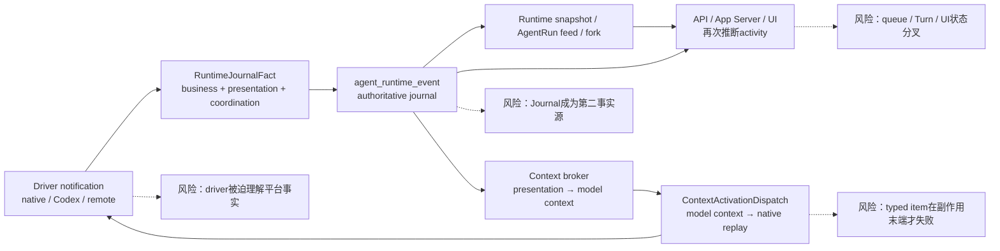
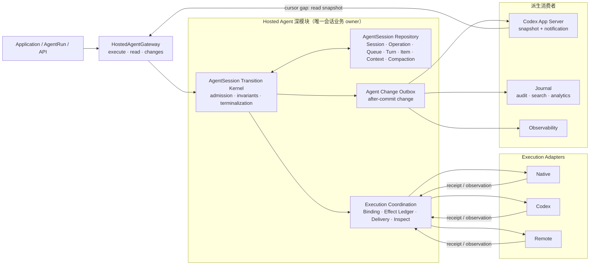
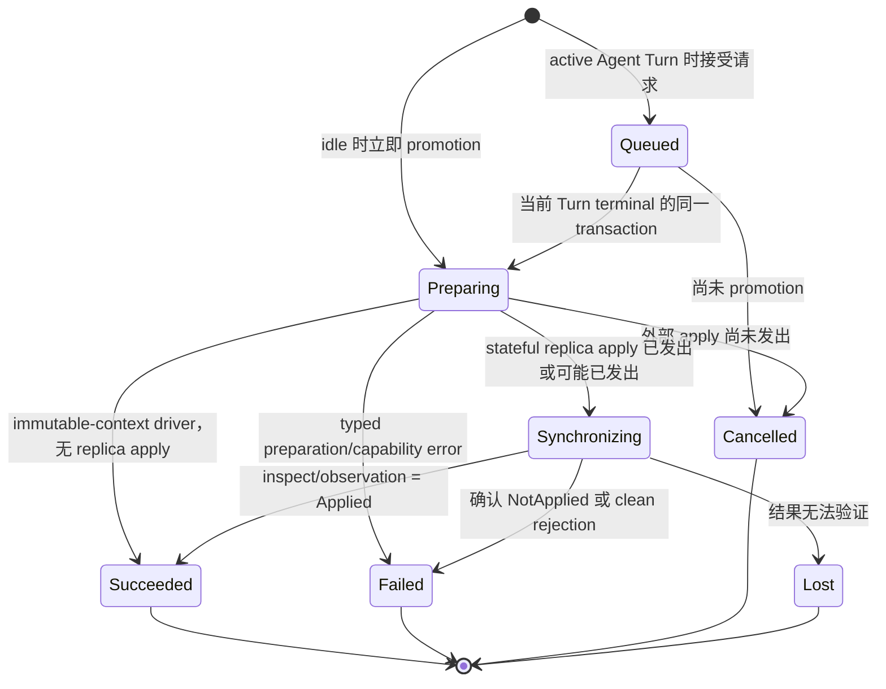
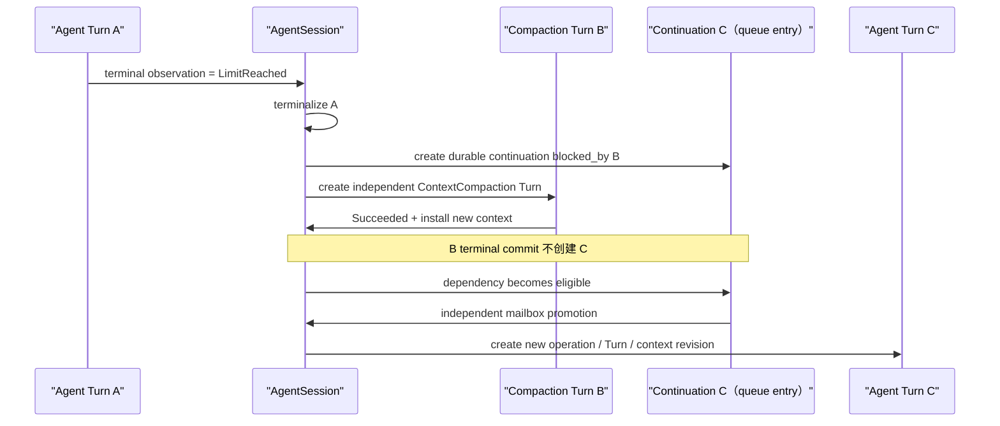

# Hosted Agent 状态机、压缩与协议投影收敛设计

## 0. 设计结论

本任务不在现有 Runtime journal 上继续修补状态，而是以破坏性 hard cut 建立一个平台拥有、内聚且可恢复的 `Hosted Agent` 深模块。

最终只有 `AgentSession` aggregate 拥有会话业务事实：

- Session identity、lifecycle 与 execution consistency；
- Operation durable acceptance 与 idempotency；
- Mailbox / queue admission、dependency 与 promotion；
- Turn、Item、Interaction 生命周期；
- model-visible ContextRevision、checkpoint 与 compaction；
- active execution slot 与 command availability。

Runtime、Host、durable worker、binding 与 effect ledger 都是 Hosted Agent 内部的 execution coordination。Native、Codex、Remote driver 都是 `AgentExecutionPort` 的 adapter，只返回 receipt/observation，不生产 Agent entity、presentation fact 或 journal fact。

Journal、Codex App Server Protocol notification、audit、analytics 和搜索索引只消费 Agent 已提交的 `AgentChange`。它们可以持久化自己的投影，但不能参与 Session read、command admission、fork、context materialization、compaction、terminalization 或 recovery。

本设计明确推翻当前分支中“`RuntimeJournalFact` 是 Thread/Turn/Item/Context 唯一事实源”的前提，也不把权威性转交给某个外部 driver。平台托管的 Agent 才是业务 owner。

## 1. 第一性原理与不可删除事实

### 1.1 基本事实

| 编号 | 不可删除的事实 | 必须存在的机制 |
| --- | --- | --- |
| F1 | 一个 Session 的 active Turn、Item、模型上下文和 terminal 结果必须由同一个 owner 提交 | `AgentSession` aggregate + repository transaction |
| F2 | 异步请求在进程退出后仍需知道是否已接受、排队或终结 | Operation 与 queue entry |
| F3 | 外部 dispatch 可能超时、重复、进程崩溃或返回未知结果 | stable effect identity、delivery lease、inspect、generation fence、`Lost` |
| F4 | 模型实际看到的历史必须在写入时具备 typed 语义 | `ContextRevision` 与 typed model contribution |
| F5 | 压缩会替换未来执行所使用的上下文，但不会改写已经发生的业务历史 | immutable Session entities + 新 ContextRevision/head |
| F6 | UI/协议既要断线恢复，也要实时增量 | authoritative snapshot revision + committed change tail |
| F7 | 自动 overflow 后是否继续是一个独立、durable 的业务请求 | continuation queue entry 与 dependency |
| F8 | driver 的 native session 可能是 stateful replica，但不是平台会话真相 | execution binding/replica convergence，不是第二套 transcript |

### 1.2 可以删除的重复事实

以下状态都能从更基本的 durable fact 唯一派生，不应独立持久化：

- UI 意义上的 `Idle`、`Running`、`Compacting`、`Blocked`；
- 只为展示而持久化的 activity enum；
- worker `Pending/Claimed/Retrying` 对应的业务 phase；
- API 在请求返回时推断的 `launched_compaction_turn`；
- 前端固定为 `completed` 的 context compaction status；
- 通过 presentation journal 重新解释得到的 context transcript；
- 通过 journal sequence 拼接和重新编号得到的 fork history。

### 1.3 深模块目标

Hosted Agent 的外部接口应隐藏 repository、worker、driver、compaction engine 与 protocol projection。Application 只需要回答三类问题：

1. 执行一个 Agent command，并获得 durable operation receipt；
2. 读取某个 revision 的 authoritative Agent state；
3. 订阅某个 revision 之后的 committed change。

模块越深，跨层调用越少，Application 越不需要知道 Runtime 的内部恢复阶段。

## 2. 领域语言与所有权

### 2.1 术语

- **Hosted Agent**：平台托管 Agent 会话与执行的深模块。
- **Agent Session**：Hosted Agent 的业务 aggregate；一个完整会话的唯一 owner。
- **Agent Command**：请求 Agent 改变状态的 typed intent。
- **Agent Operation**：Agent 对 command 的 durable acceptance、idempotency 与 terminal result。
- **Mailbox Entry**：尚未获得 active execution slot 的 durable request；可表达 dependency。
- **Agent Turn**：一次获得 Session active slot 的 typed activity，kind 至少为 `Agent` 或 `ContextCompaction`。
- **Agent Item / Interaction**：Turn 下的业务实体。
- **Context Revision**：某次执行使用的 immutable、typed、model-visible context。
- **Compaction**：从一个 ContextRevision 生成并安装新 revision 的 Agent-owned transition。
- **Execution Effect**：Agent transaction 产生、需由 driver/host 执行的稳定副作用。
- **Execution Observation**：adapter 对 effect 的已应用、未应用、失败或未知观察。
- **Agent Change**：Agent transaction 提交后发布的有序变更，不是 aggregate 的唯一存储。
- **Journal**：消费 Agent Change 的投影模块；面向审计、搜索、分析或协议交付。

### 2.2 权威性矩阵

| 状态/事实 | 权威 owner | 权威存储 | 写入者 | 可读取者 | 明确不承担 |
| --- | --- | --- | --- | --- | --- |
| Session lifecycle | AgentSession | `agent_session` | Hosted Agent transition | Application、projector | driver、Journal 不可改变 |
| execution consistency | AgentSession | `agent_session` | effect settlement/recovery transition | admission、UI projection | binding enum 不可替代 |
| active Turn slot | AgentSession | `agent_session.active_turn_id` | admission/terminal transaction | command availability | worker claim 不代表 active |
| Operation | Hosted Agent | `agent_session_operation` | command acceptance/terminal transition | API、queue、UI | protocol event 不代表 acceptance |
| Mailbox/dependency | Hosted Agent | `agent_session_queue_entry` | acceptance/admission/terminal transition | scheduler、read model | API 内存队列不参与 |
| Turn/Item/Interaction | AgentSession | normalized entity tables | Agent transition | Session read、context、projector | Journal/driver 不可直接写 |
| Context head/revision | AgentSession | context tables | Agent transition | dispatch、fork、read | presentation replay 不参与 |
| Compaction | AgentSession | `agent_session_compaction` | Agent transition | admission、read、projector | API/worker 不推断 phase |
| Binding/generation | Hosted Agent 内部 Host | `agent_execution_binding` | binding transition | effect validation、diagnostics | 不表示 Session activity |
| Effect delivery | Hosted Agent 内部 Runtime | `agent_execution_effect` | Agent transition + delivery settlement | worker、recovery | claim/lease 不是业务状态 |
| Driver receipt/observation | execution adapter 输入 | settlement metadata/telemetry | adapter + Agent validator | transition kernel | 不直接形成 Agent entity |
| Agent Change | Hosted Agent | `agent_change_outbox` | 与 Agent transaction 同提交 | protocol、Journal、analytics | 不用于重建权威 aggregate |
| App Server notification | protocol projector | projection transport/store | change consumer | clients | 不参与 read/admission/recovery |
| Audit/analytics/search | Journal/projector | 各自 projection store | change consumer | 产品/运维查询 | 不接管 Agent 业务 |

## 3. 目标架构

### 3.1 当前循环 ownership 与风险



当前错误不是单一 mapper 漏了一个 variant，而是这条循环把 presentation 记录重新当成模型上下文，并在 activation side effect 边界才验证 typed item。任何局部补 variant 都会保留循环事实源和状态分叉。

### 3.2 收敛后的边界



这张图表达三个关键边界：

1. Application 不再调用 Runtime journal、worker repository 或 driver；
2. driver observation 必须经过 Agent transition kernel 才能成为业务提交；
3. Journal 与协议都在提交之后消费 change，删除它们不会破坏 Agent。

## 4. 外部与内部接口

### 4.1 Application 唯一 seam

```rust
#[async_trait]
pub trait HostedAgentGateway {
    async fn execute(
        &self,
        command: AgentCommandEnvelope,
    ) -> Result<AgentOperationReceipt, AgentExecuteError>;

    async fn read(
        &self,
        query: AgentQuery,
    ) -> Result<AgentReadResult, AgentReadError>;

    async fn changes(
        &self,
        subscription: AgentChangeSubscription,
    ) -> Result<AgentChangeStream, AgentSubscribeError>;
}
```

语义约束：

- `execute` 成功只表示 Agent transaction 已 durable acceptance，不承诺 effect 已完成；
- 同一 `operation_id` + 同一 command fingerprint 幂等返回原 receipt；
- 同一 `operation_id` + 不同 fingerprint 返回 typed conflict；
- `read` 只读取 Agent repository，并返回 `agent_revision`；
- `changes` 只返回已提交的 change；它不能推进状态；
- change cursor gap 返回 typed gap，调用方必须重新 `read`；
- Application 不得到 repository、worker command、driver command 或 native thread handle。

### 4.2 Agent command

首期 command 至少包括：

```text
CreateSession
StartAgentTurn
SteerActiveAgentTurn
CancelOperation
RequestContextCompaction
SubmitInteractionResponse
CloseSession
ForkSession
```

内部 observation/timeout/recovery 不伪装成外部 command，使用受保护的 transition entry：

```text
SettleExecutionObservation
SettleEffectDeliveryFailure
InspectExecutionEffect
PromoteMailbox
RecoverSession
```

所有 entry 最终进入同一个 transition kernel，共享 revision CAS、generation fence 和不变量验证。

### 4.3 Driver port

```rust
#[async_trait]
pub trait AgentExecutionPort {
    async fn dispatch(
        &self,
        effect: AgentExecutionEffect,
    ) -> Result<AgentExecutionReceipt, AgentExecutionTransportError>;

    async fn inspect(
        &self,
        query: AgentExecutionInspection,
    ) -> Result<AgentExecutionObservation, AgentExecutionTransportError>;
}
```

adapter 返回 provider-neutral observation：

```text
Accepted { source_operation_id? }
Applied { source_revision?, outputs... }
NotApplied
Rejected { typed_reason }
Failed { typed_reason, retryability }
Unknown { evidence }
```

source session/turn/item IDs 只是 binding coordinate。adapter 不返回 `RuntimeJournalFact`、不构造 Agent Turn/Item、不决定 operation terminal，也不写 repository。

## 5. AgentSession aggregate 与正交状态

### 5.1 Session 根状态

```text
AgentSessionLifecycle = Open | Closed
AgentExecutionConsistency = Synchronized | Desynchronized | Lost
active_turn_id = Option<TurnId>
agent_revision = monotonic u64
context_head_revision_id = ContextRevisionId
```

不新增 persisted `Ready/Idle/Running/Compacting`。Application activity 由根状态与 active Turn kind 派生：

| 条件 | 派生 activity |
| --- | --- |
| `Closed` | `Closed` |
| `Lost` 或 `Desynchronized` | `Blocked` |
| `active_turn=None` 且可 admission | `Idle` |
| active Turn kind=`Agent` | `Running` |
| active Turn kind=`ContextCompaction` | `Compacting` |

### 5.2 Turn 与子实体

```text
AgentTurnKind = Agent | ContextCompaction
AgentTurnStatus = Active | Succeeded | Failed | Cancelled | Lost
AgentItemStatus = Started | Completed | Failed | Cancelled | Lost
InteractionStatus = Pending | Submitted | Expired | Cancelled
```

Turn terminal 时必须满足：

- 不存在 `Started` item；
- 不存在 `Pending` interaction；
- operation terminal 与 Turn terminal 在同一 transaction 对齐；
- `active_turn_id` 在同一 transaction 清除或交给被选中的下一个 Turn；
- terminal change 排在子 Item terminal change 之后。

### 5.3 Operation

```text
AgentOperationStatus =
    Accepted
  | Queued
  | Running
  | Succeeded
  | Failed
  | Cancelled
  | Lost
  | Rejected
```

Operation 记录 accepted command、fingerprint、request actor、created revision、terminal result，并可关联 queue entry 与 Turn。它不重复保存 compaction phase 或 effect delivery phase。

`Rejected` 只用于需要 durable idempotent 记录的 command rejection；纯校验错误可以不建立 operation。具体规则在 contract 工作包中统一。

### 5.4 Queue / mailbox

```text
QueueEntryStatus = Pending | Promoted | Succeeded | Failed | Cancelled | Lost
QueueEntryKind = AgentTurnRequest | ContextCompactionRequest | ContinuationRequest
Dependency = None | BlockedByCompaction(CompactionId)
```

Queue 只回答“哪个已接受请求尚未获得执行权”。一旦 promotion，真实业务生命周期由 Turn/Compaction/Operation 接管。`Queued` 不创建伪 Turn 或伪 Item。

### 5.5 Compaction

```text
CompactionStatus =
    Preparing
  | Synchronizing
  | Succeeded
  | Failed
  | Cancelled
  | Lost
```

- `Preparing`：读取 typed ContextRevision、生成候选、新 revision 与必要 effect；尚未产生不可逆外部 apply；
- `Synchronizing`：仅 stateful driver replica 需要；apply 已发出或可能已发出，必须通过 observation/inspect 收敛；
- terminal：`Succeeded | Failed | Cancelled | Lost`。

排队状态属于 Operation/Queue，不重复出现在 Compaction。只有 promotion 并创建真实 ContextCompaction Turn 后才创建 Compaction entity。

### 5.6 Binding 与 effect

```text
BindingStatus = Unbound | Active | Desynchronized | Lost | Closed
EffectDeliveryStatus = Pending | Leased | AwaitingObservation | Settled
EffectSettlement = Applied | NotApplied | Failed | Unknown
```

Binding 描述 execution replica；Session consistency 描述业务 admission。二者不合并，但 transition kernel 强制：

- active effect 的 generation 必须等于 current binding generation；
- stale observation 只记录 telemetry，不能写 Agent entity；
- binding `Lost` 必须使 Session consistency 进入 `Lost`；
- binding `Desynchronized` 在恢复成功前阻止新 promotion；
- worker lease/attempt 只影响 delivery，不自动改变 Agent operation。

## 6. 组合不变量

每次 Agent transaction 必须验证：

1. 一个 Open Session 最多一个 `active_turn_id`；
2. active Turn 必须存在、属于同一 Session 且 status=`Active`；
3. 一个 Session 最多一个 nonterminal Compaction，包括 queued request 与 active Compaction；
4. queued compaction 不存在 Turn/Item；active compaction 必须有 `Turn(kind=ContextCompaction)` 和一个同 ID 语义关联的 `ContextCompaction` item；
5. active Agent Turn 不接受 steer 到 compaction Turn；compaction Turn 不可 steer；
6. context head 只能从 command acceptance 时冻结的 expected revision CAS 到候选 revision；
7. Compaction `Succeeded`、context head、Item/Turn/Operation terminal 在同一 transaction；
8. stateful replica 仍可能未知时不得把 Compaction 标为 `Succeeded` 或 `Failed`，只能 `Synchronizing` 或 `Lost`；
9. operation、queue entry、Turn、Compaction 与 effect identity 均有稳定唯一键，重复 settlement 不复制实体；
10. Session `Desynchronized|Lost|Closed` 时不 promotion mailbox；
11. automatic continuation 只能在依赖的 Compaction `Succeeded` 后成为 eligible；
12. manual Compaction success 不创建 continuation；
13. Compaction terminal transaction 不创建后继 Agent Turn；
14. Turn terminal 与下一 queue promotion 必须在同一 Session revision 串行决策，不能暴露无保护的空窗；
15. `AgentChange` 与 state mutation 同 transaction 写 outbox，change order 由 `agent_revision + ordinal` 唯一决定。

## 7. Command admission 与排队

### 7.1 StartAgentTurn

- Session healthy 且无 active Turn：同 transaction 创建 Running operation、Agent Turn、初始 user Item、typed ContextRevision reference 和 dispatch effect；
- 有 active Agent Turn：
  - 若 command 明确是 steer 且 driver capability 允许，形成 steer effect；
  - 否则 durable 进入 mailbox；
- 有 active ContextCompaction Turn：只能进入 mailbox，不可 steer；
- `Desynchronized|Lost|Closed`：typed rejected/blocked。

### 7.2 RequestContextCompaction

- 无 active Turn、Session healthy：同 transaction 创建 operation、ContextCompaction Turn/Item、Compaction=`Preparing`，并产生 preparation work/effect；
- active Agent Turn：创建 operation + queue entry=`Pending`，receipt=`Queued`；
- active ContextCompaction 或已有 queued compaction：
  - 相同 operation/idempotency key 返回原 receipt；
  - 不同请求返回 typed `CompactionAlreadyPending`；
- `Desynchronized|Lost|Closed`：typed rejected；
- queued 阶段不发布 `turn/started`、`item/started`。

### 7.3 Turn terminal 与 promotion

普通 Turn terminal transaction 的决策顺序固定：

1. terminalize child Item/Interaction；
2. terminalize Turn 与 operation；
3. 计算 automatic overflow continuation/compaction；
4. 选择唯一 eligible queue entry；
5. 若选中 queued compaction，在同一 transaction 创建 ContextCompaction Turn/Item/Compaction 与 preparation effect；
6. 否则保持 active slot 空闲；
7. 写 ordered AgentChange。

任何 worker 或 API 都不能在步骤 2 与 5 之间单独抢占。

## 8. 普通 Agent Turn

普通 Turn 的主链：

```text
command accepted
  → Operation Running
  → Turn(kind=Agent, Active)
  → initial Item committed
  → execution effect dispatched
  → observations become Agent Items/Interactions
  → all child entities terminal
  → Turn + Operation terminal
  → queue admission decision
```

driver stream 不能直接推送 presentation fact给前端。每个 observation 先通过 transition kernel：

1. 校验 session/binding/generation/effect；
2. 将 provider payload 映射为 Agent-owned typed entity；
3. 在一个 Agent transaction 中写 entity、effect settlement 和 change；
4. projector 再生成 Codex-shaped notification。

未知 typed observation 在边界立即 typed fail 或进入 capability mismatch terminal，不可保存为通用 presentation 后再由 context replay 猜测。

## 9. 压缩 tracer bullet

### 9.1 压缩生命周期



图中的 `Queued` 是 Operation/Queue 状态，不是 `agent_session_compaction.status`。Compaction entity 从 `Preparing` 才存在。

### 9.2 typed ContextRevision

每个 committed Agent Item 在写入时必须具有以下二选一分类：

```text
ModelContribution::Typed(...)
ModelContribution::NotModelVisible { reason }
```

`ContextRevision` 保存按稳定 Item/Interaction identity 组成的 materialized model input，不从 App Server presentation item 反向解析。所有 driver 在 dispatch 之前声明 capability；无法表示的 typed contribution 在 preparation/dispatch 边界立即失败，不允许拖到 Native activation replay。

压缩输入固定为 `source_context_revision_id`，输出为新的 immutable `candidate_context_revision_id`。成功只 CAS 更新 `context_head_revision_id`，原业务 Turn/Item 不被删除或改写。

### 9.3 stateless / explicit-context driver

优先让每个 execution effect 显式携带 immutable `ContextRevision`。此时：

1. preparation 生成 candidate revision；
2. Agent transaction CAS context head；
3. terminalize Compaction Item/Turn/Operation；
4. 写 changes；
5. 下一次独立 Turn dispatch 使用新 revision。

不需要持久化 `Activating` 或 driver transcript replay。

### 9.4 stateful replica driver

只有 driver 必须维护 native conversation replica 时才进入 `Synchronizing`：

1. Agent 创建 stable `ApplyContextRevision` effect；
2. delivery 可能返回 accepted，但这不等于业务成功；
3. `Applied` observation 触发 Agent terminal transaction；
4. timeout/crash 后用相同 effect identity `inspect`；
5. `Applied` → Succeeded；
6. `NotApplied` / clean rejection → Failed；
7. 永远无法验证 → Lost，并阻断 Session。

不创建第二套 transcript mapper。adapter 接收 Agent-owned typed context，负责一次性编码为 native request；adapter 的 native history 只作为 replica。

### 9.5 手动压缩

- active Agent Turn 时允许 durable `Queued`；
- promotion 后创建独立 Compaction Turn B；
- success 只释放 active slot；
- 不创建 continuation；
- 若无其他 eligible mailbox，Session 派生为 Idle；
- 后续用户请求由新的 command 独立创建 Turn。

### 9.6 automatic overflow：A / B / C



Identity 与 transaction 要求：

- A、B、C 的 Turn ID 全部不同；
- continuation C 在 B 开始前已 durable 存在；
- B 的 terminal commit 只 terminalize B 并解除 dependency；
- 只有单独的 mailbox promotion transaction 才创建 C；
- manual compaction 永远没有 C；
- 不使用“压缩成功自动开 Turn”的通用 hook。

### 9.7 automatic failure

- B 在外部 apply 前 clean `Failed`：
  - B Item/Turn/Operation terminal；
  - 与 B 绑定的 continuation C exactly-once terminalize `Failed`；
  - 不创建 Agent Turn C；
  - Session consistency 保持 `Synchronized`；
  - 其他没有 dependency 的 mailbox entry 可继续。
- B `Cancelled`：
  - automatic continuation exactly-once `Cancelled`；
  - manual compaction没有 continuation。
- B `Lost`：
  - continuation进入 `Lost`/blocked；
  - Session consistency=`Lost`（或先 `Desynchronized`，最终 recovery 决策为 Lost）；
  - 所有 mailbox promotion 阻塞；
  - 必须由明确 recovery/repair command 解除，不自动重试旧 context。

## 10. 取消、迟到结果与 Lost

| 当前阶段 | Cancel 结果 | 原因 |
| --- | --- | --- |
| Operation/Queue=`Queued` | 原子移除 eligibility，Operation/Queue=`Cancelled` | 尚无 Turn/effect |
| Compaction=`Preparing` 且 apply 未发出 | Item/Turn/Compaction/Operation=`Cancelled` | 无不可逆外部结果 |
| Compaction=`Synchronizing` | 不直接 terminalize；返回 `CancellationPendingSettlement` | apply 可能已经生效 |
| terminal | 幂等返回既有 terminal | 防止重复终结 |

进入 `Synchronizing` 后收到 cancel：

1. 标记 cancellation intent 供 UI 展示，但不改变 compaction truth；
2. inspect effect；
3. `Applied` 仍以 Succeeded 收敛；
4. `NotApplied` 可 Cancelled；
5. Unknown 最终 Lost。

所有 observation 带 stable effect identity、binding generation 与 expected Agent revision。迟到/重复/stale observation 不覆盖新 generation，也不复制 Item。它们只能幂等返回已 settlement 或记录 telemetry。

## 11. Effect delivery 与恢复

### 11.1 Effect ledger

`agent_execution_effect` 至少保存：

- `effect_id`、`session_id`、`operation_id`、`turn_id`；
- `effect_kind` 与 immutable payload/reference；
- `binding_id`、`binding_generation`；
- delivery status、attempt、lease owner/deadline；
- receipt coordinate；
- settlement、last observation、created/updated revision。

业务 retryability 由 transition kernel决定并写入 effect settlement decision。durable worker 只执行：

```text
claim → dispatch/inspect → submit observation → ack/release/dead-letter
```

worker 不根据 transport error 自行 terminalize operation，也不把 claim state投影为 Session phase。

### 11.2 Recovery decision

重启或 lease 到期后：

| 证据 | 决策 |
| --- | --- |
| effect 尚未 dispatch | 使用相同 effect ID 重新 dispatch |
| driver receipt 证明 accepted，结果可 inspect | inspect 后 settlement |
| observation 证明 Applied | 幂等提交 Agent terminal/state change |
| observation 证明 NotApplied | 按 typed failure/cancel policy terminal |
| generation stale | 丢弃对 Agent state 的写入，保留诊断 |
| driver 不支持 inspect 且 dispatch 是否应用未知 | Session/operation/turn=`Lost` |

禁止“为了继续运行”猜测成功、重放不同 effect ID 或回退旧 context。

## 12. Agent Change、Journal 与 App Server Protocol

### 12.1 Agent Change

每个 Agent transaction 增加 `agent_revision`，并写零到多个 ordered change：

```text
SessionChanged
OperationAccepted / OperationQueued / OperationTerminal
TurnStarted / TurnCompleted
ItemStarted / ItemCompleted
InteractionRequested / InteractionResolved
ContextHeadChanged
ExecutionConsistencyChanged
```

Change payload 包含稳定 entity identity 和足以构造增量 notification 的数据，但不承担完整 aggregate replay。outbox retention/gap 是正常情况。

### 12.2 reconnect

客户端/AgentRun reconnect 流程：

1. `read(SessionSnapshot)` 得到 revision R 与完整 authoritative entity snapshot；
2. 订阅 `changes(after_revision=R)`；
3. change 按 `(agent_revision, ordinal)` 应用；
4. cursor gap、retention cutoff 或 reducer mismatch 时丢弃局部 projection，重新读取 snapshot；
5. 不扫描 Runtime journal 补洞。

### 12.3 fork

`ForkSession` 以稳定 Session revision 或 Turn/Item cutoff 为输入，由 Agent repository 创建新 Session：

- 复制/引用 immutable entity/context revision；
- 保留 canonical IDs 或明确记录 lineage；
- 创建新的 Session identity 与 revision；
- 不拼接 presentation records；
- 不重新编号 visible sequence；
- fork operation 与新 Session 创建在可验证 transaction 中。

### 12.4 Codex App Server Protocol 投影

平台 Agent item vocabulary 与 Codex v2 语义同构，但不是 vendor DTO 的类型别名。projector 映射 Agent Change：

| Agent commit | App Server notification |
| --- | --- |
| Compaction Turn 创建 | `turn/started` |
| ContextCompaction Item 创建 | `item/started` |
| Context head + Item terminal | `item/completed` |
| Turn terminal | `turn/completed` |
| typed failure/lost | error notification + failed/lost `turn/completed` |

顺序要求：

```text
turn/started
  < item/started
  < item/completed 或 error
  < turn/completed
```

queued compaction 没有 fake Turn notification，可通过 operation/queue read model展示“已排队”。所有 notification 都在 Agent commit 之后发布；重复投递使用 `(session_id, agent_revision, ordinal, projection_kind)` 幂等。

`ContextCompaction` item 的进行中/终态来自 Agent entity wrapper/父 Turn status。不要为了增加状态而修改 upstream Codex item payload，也不要让前端把 item type 固定解释为 completed。

### 12.5 Journal 删除测试

架构测试必须能替换 Journal consumer 为 no-op，然后证明：

- Session read/resume/fork；
- command admission/availability；
- typed context materialization；
- compaction与 continuation recovery；
- snapshot + live protocol projection；

全部正常。对代码执行 negative search，Session 业务路径不得调用 `journal_records_after`、`RuntimeJournalRecord` 或 presentation cursor。

## 13. 最终持久化模型

通过单个 forward migration（预计 `0084_hosted_agent_session_cutover.sql`）直接到达最终 schema：

| 表 | 关键职责/约束 |
| --- | --- |
| `agent_session` | lifecycle、consistency、active_turn_id、context_head、revision；active FK/一致性由 transaction验证 |
| `agent_session_operation` | operation ID/fingerprint 唯一、command、status、terminal result |
| `agent_session_queue_entry` | pending request、priority/order、dependency、promotion status |
| `agent_session_turn` | session + turn ID 唯一、kind、status、operation link、context revision |
| `agent_session_item` | stable item identity、typed payload、model contribution、status、ordinal |
| `agent_session_interaction` | interaction lifecycle 与 response |
| `agent_session_context_revision` | immutable typed materialization、parent/source、token metadata |
| `agent_session_context_checkpoint` | context revision 与 stable entity cutoff |
| `agent_session_compaction` | source/candidate revision、active phase、terminal、turn/operation link |
| `agent_execution_binding` | adapter/session coordinate、generation、replica consistency |
| `agent_execution_effect` | stable effect、delivery、receipt、settlement |
| `agent_change_outbox` | revision-ordered after-commit publication |

数据库约束至少包括：

- operation idempotency uniqueness；
- 每 Session 一个 active Turn；
- 每 Session 一个 nonterminal queued/active compaction；
- queue order 与 dependency FK；
- effect identity uniqueness；
- context revision immutable 与 head FK；
- change `(session_id, revision, ordinal)` uniqueness；
- terminal status所需 timestamp/result consistency；
- binding generation monotonic。

PostgreSQL 与 in-memory repository 必须实现同一 behavior suite，不允许为了测试便利省略 transaction/invariant。

### 13.1 migration 策略

项目未上线，采用 hard cut：

1. 新建最终表和约束；
2. 删除 `agent_runtime_event` 及其 authoritative journal reader/writer；
3. 删除由旧 projection 驱动的 context、fork、terminal 与 API state 表/列；
4. 删除旧 compaction/runtime state 残留；
5. 更新 sqlx query/generated schema；
6. 不 backfill 历史开发数据，不双写，不保留兼容 view/read path；
7. migration 测试从前一 migration版本升级并验证最终约束。

若 migration 编号在实施前已被其他工作占用，使用实施时的下一个编号，但仍保持单次 hard cut。

## 14. 各层改造边界

### 14.1 Contract / wire

- 用 Agent-owned command/query/change/entity contract 替换 Runtime journal contract；
- 删除 `RuntimeJournalFact`、`RuntimeJournalRecord`、driver facts envelope；
- 为 execution observation、effect inspection、typed model contribution 建立 provider-neutral contract；
- wire 只承载 command/receipt/observation/change，不承载 adapter-produced presentation。

### 14.2 Hosted Agent kernel

- 建立 `AgentSession` aggregate、transition kernel 与统一 admission；
- 把 operation、queue、Turn/Item/Interaction、Context/Compaction 放在同一 revision/transaction；
- 建立 in-memory behavior reference implementation；
- 删除业务层对 worker claim/journal sequence 的依赖。

### 14.3 Infrastructure / Runtime Host

- PostgreSQL repository 和 migration；
- effect ledger、binding generation、durable delivery/inspect；
- driver event ingress 只提交 observation；
- worker 只按 settlement decision处理 delivery。

### 14.4 Native/Codex/Remote adapter

- 实现同一 `AgentExecutionPort` conformance；
- 声明 typed context/interaction/steer/cancel/inspect capability；
- Codex adapter 复用 App Server native session能力时仍不向上暴露 vendor truth；
- Native replay 不再读取 presentation item，接受 Agent typed ContextRevision；
- unknown typed contribution 在 dispatch前失败。

### 14.5 AgentRun / API / App protocol

- AgentRun 通过 `HostedAgentGateway` execute/read/changes；
- feed、fork、terminal、context read model 不再读取 Runtime journal；
- API receipt 明确 Accepted/Queued/Running/terminal，不推断 launched Turn；
- projector从 Agent Change 输出 Codex-shaped lifecycle；
- product/application events 若不是 Agent Session 事实，保留在独立产品 feed。

### 14.6 Frontend

- snapshot + change tail 驱动统一 session reducer；
- activity 从 active Turn kind/consistency 派生；
- queued compaction、active compaction、failed/lost 都有明确状态；
- `contextCompaction` card 不再固定 completed；
- cursor gap 重新读取 snapshot；
- 移除从 API timing、journal gap 或 item type 猜测状态的逻辑。

## 15. 直接删除或替换清单

实施不得为以下旧结构建立 compatibility facade：

- authoritative `RuntimeJournalFact` / `RuntimeJournalRecord`；
- driver envelope 中的 `facts: Vec<RuntimeJournalFact>`；
- `agent_runtime_event` 作为 Session 事实存储；
- `journal_records_after` 驱动 Session/context/fork/terminal；
- `AgentRunJournalService` 对 parent prefix 的拼接与 sequence 重编号；
- `SessionMetaUpdate("context_compacted")` 驱动 context projection；
- prior journal scan 驱动 terminal rewind；
- `ContextActivationDispatch` 对 presentation typed item 的二次 replay；
- API `scheduled_next_turn` / `launched_compaction_turn` timing inference；
- persisted duplicate activity state；
- worker release/reclaim 推断业务 retry；
- stale `SessionCompactionStatus` 与已删除 schema 对应 SPI；
- 前端 `contextCompaction => completed` 固定映射；
- producer public `append_presentation` 越过 Agent boundary 写 Session feed；
- Runtime/AgentRun/workspace conversation 各自维护的重叠 execution status。

删除前以新 behavior tests 锁定最终语义，删除后通过 compile error 驱动所有调用方完成 hard cut。

## 16. 失败与风险矩阵

| 风险 | 目标收敛 | 验证 |
| --- | --- | --- |
| unsupported typed item 直到 activation 才失败 | commit 时 typed contribution；dispatch前 capability gate | cross-adapter parity suite |
| compaction accepted 后普通 Turn 抢占 | active slot + queue promotion同一 Agent transaction | PostgreSQL 并发测试 |
| worker 无限 release/reclaim | transition先写 retry/terminal decision | crash/reclaim test |
| effect 已应用但数据库未知 | stable effect + inspect；不可验证即 Lost | fault injection |
| journal consumer 延迟/丢失 | snapshot + change tail；gap reread | reconnect/gap test |
| duplicate/stale driver event 改写实体 | effect/generation/revision fence | conformance test |
| B success 自动创建 C | continuation独立 promotion transaction | A/B/C identity + transaction test |
| clean failure 形成 recovery loop | continuation exactly-once Failed，无旧 context promotion | automatic failure test |
| binding 与 Session health 分叉 | transition kernel组合不变量 | state matrix test |
| hard cut 跨 crate 爆炸半迁移 | 工作包依赖、negative gate、最终集成包 | compile/test/rg gate |

## 17. 验证设计

### 17.1 Contract behavior suite

同一组用例运行在 in-memory 与 PostgreSQL：

- operation idempotency/fingerprint conflict；
- active slot exclusivity；
- queue order、dependency 与 atomic promotion；
- compaction singleton；
- context head CAS；
- effect identity/generation fence；
- child-before-parent terminal；
- change order 与 revision；
- cancellation、duplicate/late observation；
- Lost 后 admission block。

### 17.2 Compaction tracer bullet

覆盖：

1. idle manual success → B terminal → Idle，无后续 Turn；
2. active Turn + manual request → Queued，无伪事件；
3. Turn terminal transaction 原子 promotion B；
4. active B 时新消息只进 mailbox；
5. automatic A `LimitReached` → B → independent C；
6. B clean Failed → continuation Failed exactly once，无 Turn C；
7. B Lost → continuation Lost/blocked，全部 promotion 停止；
8. Preparing cancel 与 Synchronizing cancel/inspect；
9. duplicate worker claim、重启、stale observation 不复制实体。

### 17.3 协议顺序

对 snapshot 和 notification 同时断言：

- `turn/started < item/started < item/completed/error < turn/completed`；
- 所有通知只在 commit 后可见；
- duplicate outbox delivery不重复 reducer entity；
- cursor gap 后 snapshot 与持续 tail收敛；
- queued compaction没有 fake Turn；
- failed/lost contextCompaction card保持真实终态。

### 17.4 删除与 negative gate

实施结束时应使以下搜索在业务路径归零：

```text
RuntimeJournalFact
RuntimeJournalRecord
journal_records_after
append_presentation
launched_compaction_turn
scheduled_next_turn
```

若某个名称仅存在于 migration 删除语句或历史测试说明，应逐项人工确认，不用兼容 wrapper 消除 compile error。

## 18. 被拒绝的替代方案

### 18.1 只增加 `Compacting` Thread enum

拒绝。它把短期 activity、长期 lifecycle 与 execution consistency压进一个枚举，仍无法解决 queue、Turn/Item、context、effect 和 journal ownership。

### 18.2 Runtime journal event sourcing

拒绝。当前 union 同时包含 Agent business、presentation 和 execution coordination，导致 write owner 不唯一，并让 context/fork/read依赖投影。

### 18.3 Agent state 与 authoritative Journal 双写

拒绝。双重事实源需要 conflict resolution；Journal failure 还会反向影响已经完成的 Agent transaction。

### 18.4 driver-owned conversation

拒绝。Codex/Remote native session 可作为 replica，但不同 adapter不能分别定义平台 command admission、continuation和failure semantics。

### 18.5 在现有 journal 上包 Agent facade

拒绝。只要 read/context/fork/recovery 仍需 journal replay，facade 就没有改变 seam。

### 18.6 保留旧接口逐步双轨迁移

拒绝。项目未上线且本分支本来就是重构分支。双写、fallback reader、兼容 DTO 和旧 schema view只会延长状态机并存时间。

### 18.7 Compaction success 自动启动 continuation

拒绝。B terminal 与 C start 是两个不同请求、Operation 与 Turn；耦合会错误影响 manual compaction，并破坏队列公平性与可观察 transaction边界。

## 19. Hard-cut 实施顺序

1. 冻结领域语言、Agent contract、transition invariants 与 behavior suite；
2. 建立 AgentSession aggregate、in-memory/PostgreSQL repository 和 forward migration；
3. 建立 effect/binding/observation coordination，切断 driver facts；
4. 建立 authoritative read/change/fork，并把 Journal降为 consumer；
5. 完成 typed ContextRevision、compaction、queue/continuation tracer bullet；
6. 切换 AgentRun/API/App Server/frontend，删除旧 projection推断；
7. 做 recovery、conformance、negative deletion 与全链路集成。

工作包 3（execution coordination）和工作包 4（read/change/journal decoupling）在 contract/repository落地后可并行；compaction依赖 execution coordination，应用切换依赖 authoritative read/change 与 compaction；最终清理必须在所有调用方切换后执行。

## 20. 完成定义

本架构只有在以下条件同时满足时才算收敛：

- Application 只通过 Hosted Agent boundary执行、读取和订阅；
- AgentSession repository 是唯一 Session 业务权威；
- driver 只提交 receipt/observation；
- worker 只负责 effect delivery；
- Journal 删除测试通过；
- PostgreSQL 与 in-memory behavior suite一致；
- compaction A/B/C、manual、failure、cancel、Lost 全部有确定 terminal；
- App Server snapshot + notification在断线、重复与 gap下收敛；
- 旧 Runtime journal/state/projection接口与 schema 已删除；
- 不存在兼容、双写、fallback 或第二套会话状态机。
