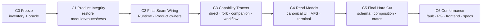

# Agent Runtime 最终收敛与收尾计划

> 状态：执行中
>
> 当前阶段：完成 S4 Product Lane，随后重新形成 S5 唯一 production path，最后执行
> S6 Final Conformance
>
> Product 控制面 oracle：`58c537b7`（`c3cc58b9^`）

## 1. 分支最终要交付的系统

这个分支的目标不是完成一次局部 Runtime 改名，而是得到一套可长期维护、可替换 Agent
实现且保留完整 AgentDash 产品能力的最终架构：

```text
Product / API / UI / Workflow
  -> AgentRun 与其它 Product application services
  -> Managed Agent Runtime
      command · operation · admission · normalized projection · change
  -> Agent Runtime Host
      service instance · offer · binding · placement · effect · recovery
  -> Complete Agent Service
      -> Dash Agent -> AgentCore
      -> Codex
      -> Remote / Enterprise Agent
```

同时保持两条正交的产品读取链：

```text
Agent conversation
  Complete Agent source
    -> Runtime canonical conversation history
    -> agentdash-agent-protocol
    -> features/session reducer / renderer

Product state
  AgentRun / Companion / Workflow / Workspace / Canvas / Terminal / Lifecycle
    -> Product repositories and projections
    -> Product API / feeds / VFS
```

终态有五个核心性质：

1. 所有 Agent 实现都经过同一 Managed Runtime 外层；
2. Complete Agent 自己拥有 history、fork、compaction 和 lifecycle；
3. Dash Agent 的 `AgentSession` 只由 ordered history 维护，AgentCore 是无隐藏持久状态的
   loop machine；
4. AgentDash Product state 不进入 AgentSession，也不进入 conversation protocol；
5. 每项能力只有一个 production caller、一个执行 owner、一个 durable authority 和一个
   canonical consumer contract。

## 2. 当前完成度评估

| Area | 当前状态 | 收尾判定 |
| --- | --- | --- |
| Runtime Contract / Service API / Wire | target contracts 已建立 | 保留；补最终 consumer 与 conformance |
| Managed Runtime / Host | operation、binding、effect、projection、change 基础已建立 | 保留；核验唯一 production composition |
| Dash Agent / AgentCore | 两层 crate 已存在，history/Core 目标基础已建立 | 保留；补 production Native registration 与真实 tracer |
| Codex Complete Agent | service、registration、native fork/read/compact 基础已存在 | 保留；补 production interaction/presentation parity |
| Remote Complete Agent | proxy、wire、registration 基础已存在 | 保留；核验真实 placement caller |
| First-party registration | 当前 builtin 只明确注册 Codex | 补 Dash/Native；Remote 由真实 placement 配置注册 |
| Fork | Product target saga 与 Agent service seam 已存在 | 补 production repository/coordinator/activation/recovery tracer |
| Companion | target fork/fresh component 仅有 recording repository/tests | 恢复完整 Product 业务并接 production saga/channel/tool |
| Compaction | Dash/Codex owner 模型已建立 | 补 Product command、canonical lifecycle 与恢复 tracer |
| Tool / Hook | final Broker/Host callback 基础已建立 | 恢复 Product catalog/effects composition，证明唯一 route |
| Canonical conversation | protocol owner、source projectors、Runtime carrier 已恢复 | 收窄 protocol owner并跑 07-12 parity |
| Frontend Session | reducer/renderer 已恢复 | 补真实 feed、interaction、terminal 与 reconnect tracer |
| Lifecycle VFS | canonical provider 已建立并注册 VFS kernel | 把 lifecycle mount materialize 到 AgentRun surface |
| VFS surface | final Product resolver/route 已恢复 | 补真实 read/list/search tracer |
| Workspace / Canvas / Terminal / Wait | 源码或 projection 部分存在，route/composition 不完整 | 恢复入口并接 final Product owners |
| Routine / Frame Construction | Product 实现需要从 oracle 恢复 | 恢复业务语义并接 AgentRun/Surface |
| Workflow AgentCall | durable dispatch 基础存在 | 核验 production route、receipt 与 recovery |
| Persistence | `0084` 与多数 final repositories 已建立 | 补 Product runtime paths并审计最终约束 |
| Crate topology | Core/Agent/Service/Runtime/Host/Wire 已存在；旧 executor/hooks 已移除 | 删除 orphan `agent-types`，收窄 protocol/SPI |
| Legacy vocabulary | universal journal fact 已归零；旧 protocol/session vocabulary 仍有真实消费者 | 迁移 Product consumer 后再删除 |

当前结论：

```text
S1 Contracts            complete enough to retain
S2 Target domains       complete enough to retain
S3 Complete Agent lane  implementation-ready, production proof incomplete
S4 Product lane         incomplete
S5 Production hard cut  partially activated, not a stable checkpoint
S6 Final conformance     not started
```

因此收尾关键路径不是继续做零散 crate 删除，而是先闭合 S4 的 Product 纵向路径，再完成
一次有 replacement evidence 的 S5，最后集中做 S6。

## 3. 收尾关键路径



### C0 — Freeze

输出：

- 当前 HEAD 与单分支工作树；
- `58c537b7` Product 控制面、composition、route 与 behavior oracle；
- Product capability inventory；
- final owner mapping；
- replacement/deletion manifest 模板。

退出条件：

- 未提交的实验性重写归零；
- 所有后续改动都能归属某条纵向产品路径；
- 不再以文件是否参与编译判断业务是否存在。

### C1 — Product Integrity

从 oracle 恢复并重新挂载：

- Companion；
- Frame Construction；
- Routine；
- Canvas、Capability、Runtime Tools、Gate Wait、Wait Activity；
- Companion Gate、Routine、Canvas、Workspace Module、Terminal、AgentRun Workspace /
  Runtime Trace routes；
- AppState 中对应 Product services、workers、tool contributions 和 convergence；
- 能证明产品规则的原 tests。

恢复目标是业务语义和产品入口。旧 Runtime/Journal/Session 依赖只作为 compile ledger，
在 C2 替换。

退出条件：

- Product modules、routes、composition 和 tests 均重新进入真实构建图；
- 每个编译断点都映射到一个 final owner；
- 业务规则、权限、payload、gate/adoption 和用户可见副作用有 oracle/test 证据。

### C2 — Final Seam Wiring

按下表替换恢复代码的依赖 seam：

| Product need | Final owner |
| --- | --- |
| Agent create / resume / input / control | AgentRun Product command -> Runtime Contract |
| Full Companion history inheritance | exact Runtime / Complete Agent Fork |
| Fresh Companion context | Create + `InitialAgentContextPackage` + first SubmitInput |
| Companion relation / channel / gate / adoption / result | Product repositories |
| Collaboration tool | Runtime Tool Broker -> Product Companion command |
| MCP dynamic tools | MCP discovery/executor -> Runtime Tool Broker typed catalog -> Host callback |
| Routine / Workflow AgentCall | AgentRun Product command |
| Instructions / tools / hooks / workspace | Agent Surface -> Bound/Applied Surface |
| VFS permissions | AppliedResourceSurface |
| Conversation history | Runtime canonical conversation history |
| Terminal state | Product terminal control/projection |
| Lifecycle artifacts | Lifecycle owner + canonical history mount |
| Reconnect | Runtime snapshot revision + durable change tail |

退出条件：

- Application 不依赖 concrete Agent、Host 或 vendor DTO；
- Agent business 不读取 Product repositories；
- conversation history 与 Product state 保持两条独立读模型；
- 每项 Tool/Hook/Companion effect 有唯一 causal route。

### C3 — Complete Agent 与产品能力闭环

按同一 production composition 验证：

1. Dash/Native、Codex 和可配置 Remote 注册为 Complete Agent；
2. Runtime 根据 offer/surface/applied evidence 逐项 admission；
3. direct input 经 Host effect 到 Agent-owned history，再回 Runtime change；
4. Fork 经 Product saga、Runtime intent、Host effect、native fork、child mapping、
   Product graph commit 与 explicit activation；
5. Companion Full 复用 exact fork；fresh modes 原子应用 initial context 后再提交首个
   input；
6. Workflow AgentCall 和 Routine 只通过 AgentRun Product command；
7. Compaction 由 Dash/Codex 各自执行，平台只发 command并投影可证明结果；
8. Tool/Hook callback 经 Host route、deadline、idempotency 和 generation fence 往返。
9. MCP tool schemas来自Broker可执行catalog，同一catalog负责surface declaration与实际
   execution；MCP server metadata 不进入Agent context。

退出条件：

- direct、Fork、Companion、Workflow、Routine、Compaction、Tool/Hook 都有 production
  tracer；
- unknown outcome 通过同一 effect identity inspect/reconcile；
- Fork/Companion restart 不创建第二个 child。

### C4 — Product read models

闭合以下 consumers：

- canonical Session feed/reducer/renderer/tool/interaction cards；
- Runtime snapshot/change reconnect 与 cursor gap reload；
- Lifecycle VFS exact `events.json` 与 derived indexes；
- AgentRun workspace/runtime trace；
- Workspace Module presentation；
- Canvas state/promotion/diagnostics；
- Terminal control/projection；
- Wait/gate/mailbox/result。

Lifecycle mount 必须在 AgentRun AppliedResourceSurface materialization 时写入；VFS kernel
从 mount metadata 解析 Product target，再查询 canonical Runtime history。

退出条件：

- API/UI/VFS 不从 journal replay、worker timing 或 generic JSON 猜业务状态；
- canonical conversation 完整保持 07-12 family、identity、payload、ordering、
  nullable/omitted 与 side-effect parity；
- Product feeds 不进入 conversation protocol。

### C5 — Final Hard Cut

Hard Cut 只处理已经通过 C1–C4 的 owner replacements：

本任务的重构对象是 Agent Runtime 内核及其旧 owner。Application/Product 领域不属于
Hard Cut 对象；Companion、Frame、Routine、Workflow、Workspace、Canvas、Terminal、
Wait、Lifecycle 的业务规则、route、worker、权限、gate、mailbox 与用户可见行为只允许
把旧 Runtime seam 适配到最终 Runtime Contract、Product projection、
AppliedResourceSurface 与 canonical history。

删除 module export、route mount、AppState composition 或 Product caller 不构成
legacy zero-consumer evidence。只有同一生产 caller 已接入 final replacement，且产品
tracer 证明前向路径成立后，旧 Runtime implementation/repository/schema/crate 才进入
deletion manifest。

- final migration 与 repository activation；
- production composition / registry；
- canonical generated roots；
- Cargo workspace / lockfile；
- crate identity 与 dependency DAG；
- 旧 implementation、schema 与生成产物删除。

每个 deletion candidate 必须记录：

```text
Legacy:
Target replacement:
Production callers:
Composition:
Repository/schema:
Projection/consumer:
Behavior tracer:
Negative evidence:
```

主要候选：

- platform `RuntimeSession*` delivery/live/capability vocabulary；
- universal journal persistence/readers；
- Complete Agent Host 已替代的 connector/driver/executor；
- Tool Broker / AgentHostCallbacks 已替代的 Hook execution owner；
- orphan `agentdash-agent-types`；
- protocol 中 Product/Runtime/journal vocabulary；
- Relay legacy Agent transport variants；
- SPI Agent delegate/re-export；
- 旧 schema tables/fields/indexes。

退出条件：

- production 只有 final Runtime/Host/Complete Agent path；
- 每个 durable fact 只有一个 writer；
- `agentdash-agent-protocol` 只拥有 canonical conversation；
- Product state 有自己的 contract/feed；
- old owner negative gates 归零。

### C6 — Final Conformance

最终集中验证：

- Contract/profile/admission；
- Dash history replay、fork、compaction、Core purity；
- Native/Codex/Remote Complete Agent conformance；
- Runtime/Host effect、lease、generation、inspect/reconcile；
- Product Fork/Companion/Workflow/Routine；
- Tool/Hook unique route；
- canonical protocol/frontend parity；
- VFS/Workspace/Canvas/Terminal/Wait；
- PostgreSQL CAS/idempotency/outbox/restart；
- dependency and legacy negative gates。

退出条件：

- 所有 PRD AC 有代码或测试证据；
- `.trellis/spec/` 与最终 owner/依赖方向一致；
- task checklist、dispatch status 与 Git commits 对齐；
- 形成 S6 checkpoint。

## 4. Product capability tracer matrix

| Capability | Command owner | Durable owner | Read consumer | Required tracer |
| --- | --- | --- | --- | --- |
| Direct AgentRun | Product -> Runtime | Runtime + Agent | Session UI | input -> output -> reconnect |
| Fork | Product saga | Product/Runtime/Host/Agent 各自事实 | child AgentRun/UI/VFS | crash boundary + exact child |
| Companion Full | Product Companion | Product relation + fork saga | channel/mailbox/UI | exact fork + result adoption |
| Companion fresh | Product Companion | Product relation + create saga | channel/mailbox/UI | context digest + first input |
| Workflow AgentCall | Workflow Product | workflow + AgentRun receipts | workflow/lifecycle | restart-safe terminal |
| Routine | Routine Product | routine trigger + AgentRun receipt | routine/API | trigger -> terminal |
| Compaction | Complete Agent | Agent history | canonical Session | Dash/Codex lifecycle |
| Tool/Hook | Broker/Host callback | Runtime/Host effect | Agent + audit projection | deadline/replay/fence |
| Workspace/Canvas | Product modules | Product repositories | Product API/UI | CRUD + presentation |
| Terminal/Wait | Product control | Product terminal/mailbox | API/UI | control + terminal convergence |
| Lifecycle VFS | Product surface | Lifecycle + Runtime history | VFS | mount + events/list/search |
| Reconnect | Runtime | Runtime snapshot/change | API/UI | tail + cursor gap |

## 5. Crate 收尾

### 最终保留

- `agentdash-agent-core`
- `agentdash-agent`
- `agentdash-agent-service-api`
- `agentdash-agent-runtime-contract`
- `agentdash-agent-runtime`
- `agentdash-agent-runtime-host`
- `agentdash-agent-runtime-wire`
- `agentdash-agent-runtime-test-support`
- `agentdash-agent-protocol`
- `agentdash-agent-protocol-codegen`
- `agentdash-integration-api`
- Native / Codex / Remote integration crates
- Product/Application/Domain/Infrastructure/API/Relay crates
- `agentdash-platform-spi`
- `agentdash-application-extension-gateway`

### 收尾动作

- 物理删除已无 workspace consumer 的 `agentdash-agent-types` 目录；
- 将 canonical protocol crate 的 Backbone/Product/Runtime vocabulary 迁到对应 Product /
  Runtime owner；
- 清理 Platform SPI 中已经由 Service API、Tool Broker、Host callback 接管的 Agent
  delegate；
- 保持 executor、application-hooks、runtime-session、旧 runtime-gateway crate 缺席；
- 用 `cargo metadata` 和 dependency negative tests固定最终 DAG。

## 6. Stable checkpoints

| Checkpoint | 内容 | 必须通过 |
| --- | --- | --- |
| C0 | 收尾 inventory 与 oracle | clean tree + complete manifest |
| C1 | Product modules/routes/tests 恢复 | affected crates compile |
| C2 | final seam wiring | dependency gates + focused behavior |
| C3 | Agent/Product capability closure | production direct/fork/companion/workflow tracers |
| C4 | canonical/Product read models | UI/VFS/terminal/reconnect tracers |
| C5 | schema/composition/crate hard cut | PG + metadata + negative gates |
| C6 | final conformance/spec | full directed gate + final review |

每个 checkpoint 通过后立即提交。实现过程在当前目录与当前分支完成；subagent 只按能闭合
完整纵向结果的粗粒度任务派发。

## 7. 当前下一步

1. 提交本收尾规划 checkpoint；
2. C1：从 `58c537b7` 恢复 Product modules、routes、composition 和 tests；
3. 对恢复后的编译断点生成 final seam ledger；
4. C2：优先闭合 Companion/Frame/Routine，再闭合 Workspace/Canvas/Terminal/Wait；
5. 衔接 Lifecycle mount materialization；
6. 进入 C3 production tracers。
