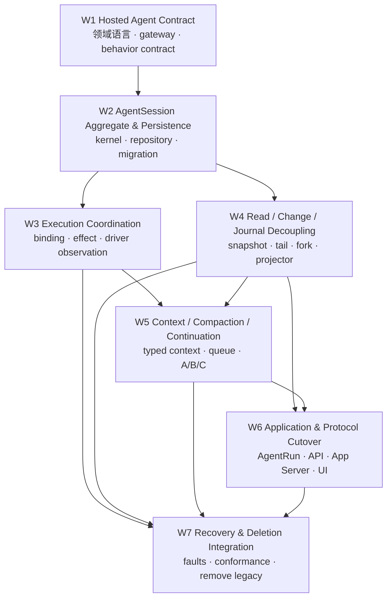

# Hosted Agent 状态机与压缩重构实施计划

## 0. 执行入口

本文件是后续执行方的总控清单。开始实现前必须：

1. 审阅并接受父任务 `prd.md` 与 `design.md`；
2. 确认当前分支包含本规划提交且工作区没有被本任务错误纳入的并行修改；
3. 使用 `task.py start 07-17-agent-runtime-compaction-state-protocol-review` 将父任务从 `planning` 切到 `in_progress`；
4. 每次只领取依赖已完成的工作包；
5. 读取父任务和该工作包的 `prd.md`、`implement.jsonl`、`check.jsonl`；
6. 先写/更新该切片的 behavior tests，再做 hard cut；
7. 不建立 compatibility、双写、旧 reader 或 fallback。

父任务是唯一 Trellis lifecycle/branch/archive 单元。`workstreams/` 是可独立领取、验证和交接的执行包，不创建额外 `task.json`。

## 1. 依赖图



允许的并行度：

- W3 与 W4 可在 W2 完成后并行；
- adapter conformance 可在 W3 内按 Native/Codex/Remote 分文件 ownership并行；
- W6 的 frontend reducer 可在 API/protocol contract冻结后并行，但不得自行发明状态；
- W7 必须在所有调用方已切换后执行最终删除与全链路检查。

## 2. 工作包总表

| 状态 | 工作包 | 依赖 | 可验收输出 |
| --- | --- | --- | --- |
| [ ] | [W1 Hosted Agent Contract](workstreams/01-hosted-agent-contract/prd.md) | 无 | 领域 contract、统一 gateway/command/query/change、provider-neutral observation、behavior suite skeleton |
| [ ] | [W2 AgentSession Aggregate & Persistence](workstreams/02-agent-session-aggregate-persistence/prd.md) | W1 | transition kernel、in-memory/PostgreSQL repository、hard-cut migration、数据库约束 |
| [ ] | [W3 Execution Coordination](workstreams/03-execution-coordination/prd.md) | W1、W2 | binding/effect ledger、worker delivery、driver adapter observation conformance |
| [ ] | [W4 Read / Change / Journal Decoupling](workstreams/04-read-change-journal-decoupling/prd.md) | W1、W2 | snapshot+tail、fork、outbox/projector、Journal no-op 删除测试 |
| [ ] | [W5 Context / Compaction / Continuation](workstreams/05-context-compaction-continuation/prd.md) | W1、W2、W3、W4 | typed ContextRevision、manual/automatic A-B-C、cancel/failure/Lost、atomic queue promotion |
| [ ] | [W6 Application & Protocol Cutover](workstreams/06-application-protocol-cutover/prd.md) | W4、W5 | AgentRun/API/App Server/frontend全量切换、真实 compaction lifecycle |
| [ ] | [W7 Recovery & Deletion Integration](workstreams/07-recovery-deletion-integration/prd.md) | W1–W6 | fault/restart/conformance、negative gates、旧 journal/state/schema删除、最终质量门禁 |

### 2.1 需求追踪

| 工作包 | 主要 Requirements | 主要 Acceptance Criteria |
| --- | --- | --- |
| W1 | R8、R11–R13、R16、R23–R25 | AC2、AC7、AC11–AC13、AC16、AC23 |
| W2 | R5–R7、R11–R19、R23、R25 | AC2、AC5、AC11–AC14、AC16–AC18 |
| W3 | R4–R7、R14、R18–R19、R24 | AC4–AC5、AC11、AC16–AC18、AC21、AC23 |
| W4 | R3、R6、R11、R13、R17、R23、R25 | AC3、AC5、AC11、AC13–AC18、AC22 |
| W5 | R1–R5、R7、R9–R10、R13–R22 | AC1–AC5、AC9–AC21 |
| W6 | R3、R6–R7、R9–R10、R13、R15、R17、R20–R25 | AC3、AC5、AC9–AC10、AC13–AC15、AC17、AC19–AC22 |
| W7 | R1–R25 | AC1–AC23 |

## 3. W1 — Hosted Agent Contract

### 实施

- [ ] 冻结 `CONTEXT.md` 与 `design.md` 中的领域术语；禁止继续把 Hosted Agent、Runtime、driver、Journal互称。
- [ ] 在 Agent-owned contract 中定义 stable IDs、Session/Operation/Queue/Turn/Item/Interaction/Context/Compaction/Effect/Change。
- [ ] 定义 `HostedAgentGateway::execute/read/changes` 和 typed errors。
- [ ] 定义 provider-neutral `AgentExecutionPort::dispatch/inspect`、receipt/observation 与 capability descriptor。
- [ ] 定义 `agent_revision + ordinal` change ordering、cursor gap 与 snapshot query。
- [ ] 定义 command fingerprint/idempotency语义。
- [ ] 建立 repository-neutral behavior suite接口与 fixture DSL，供 W2–W5 共用。
- [ ] 删除 contract/wire 中 driver-produced `RuntimeJournalFact` 的入口；允许暂时保留无法编译的调用方待相邻包同步切换，但不得增加 adapter。

### 检查

- [ ] contract 不依赖 infrastructure、AgentRun、driver implementation 或 vendor DTO。
- [ ] entity/change/observation type 的 owner 从命名和 module boundary 可判断。
- [ ] behavior suite 能表达 active slot、queue、compaction、effect 与 change order。

### 定向验证

```powershell
cargo test -p agentdash-agent-runtime-contract
cargo test -p agentdash-agent-runtime-wire
cargo run -p agentdash-agent-runtime-contract --bin generate_agent_runtime_contracts -- --check
cargo run -p agentdash-agent-runtime-wire --bin generate_agent_runtime_wire -- --check
```

## 4. W2 — AgentSession Aggregate 与 Persistence

### 实施

- [ ] 实现少量正交 state types 与一个 AgentSession transition kernel。
- [ ] 实现 command acceptance、operation、queue、Turn/Item/Interaction、revision 与 change outbox transaction。
- [ ] 实现 active slot、terminal child、idempotency、queue order、context head CAS、compaction singleton等不变量。
- [ ] 实现 in-memory repository，作为 behavior suite 的快速 adapter。
- [ ] 建立 PostgreSQL normalized repository。
- [ ] 增加实施时下一个 migration（设计预计 `0084_hosted_agent_session_cutover.sql`），创建最终表并删除 authoritative runtime event/state schema。
- [ ] 更新 sqlx/query/generated schema 与 migration guard。
- [ ] 为 PostgreSQL 并发事务建立真实数据库测试；使用隔离 data root 或串行 embedded PostgreSQL启动。

### 检查

- [ ] in-memory 与 PostgreSQL 跑同一 behavior suite。
- [ ] active Turn、nonterminal compaction、operation/effect identity、change order有数据库约束或可证明的锁/CAS。
- [ ] repository 读取不需要 Journal cursor。
- [ ] migration 没有 backfill、兼容 view、双写 trigger 或旧 schema fallback。

### 定向验证

```powershell
pnpm migration:guard
cargo test -p agentdash-agent-runtime
cargo test -p agentdash-infrastructure agent_session
cargo test -p agentdash-infrastructure agent_runtime
```

## 5. W3 — Execution Coordination

### 实施

- [ ] 用统一 `agent_execution_binding` 和 `agent_execution_effect` 取代专用 driver/activation旁路状态。
- [ ] worker 仅实现 claim/dispatch-or-inspect/submit-observation/ack-or-release。
- [ ] transition kernel 决定 retryability、terminal与Session consistency。
- [ ] 为 stale generation、duplicate receipt/observation、late result 建立 fence。
- [ ] 把 Native、Codex、Remote adapter 切到 `AgentExecutionPort`。
- [ ] 每个 adapter 声明 typed context、interaction、steer、cancel、inspect capability。
- [ ] Native 不再 replay presentation typed item；Codex adapter 不再返回 Runtime/presentation facts。
- [ ] 明确 stateful replica才使用 inspect/convergence；优先 explicit immutable context。

### 检查

- [ ] driver contract/wire/schema 中不存在 `RuntimeJournalFact`。
- [ ] adapter 无 repository写入能力。
- [ ] worker claim/retry 不作为 Session/Operation phase。
- [ ] unknown external result收敛为 `Lost`，不猜测、不换 effect ID 重放。

### 定向验证

```powershell
cargo test -p agentdash-agent-runtime-host
cargo test -p agentdash-integration-native-agent
cargo test -p agentdash-integration-codex
cargo test -p agentdash-integration-remote-runtime
cargo test -p agentdash-infrastructure agent_runtime_worker
```

## 6. W4 — Authoritative Read、Change 与 Journal 解耦

### 实施

- [ ] `HostedAgentGateway::read` 从 AgentSession repository返回 authoritative snapshot。
- [ ] 建立与 Agent transaction 同提交的 `agent_change_outbox`。
- [ ] 实现 `changes(after_revision)`、retention cutoff 与 typed cursor gap。
- [ ] 实现 snapshot R + tail 的 reconnect contract。
- [ ] 实现 stable Session revision/Turn/Item cutoff 的 Agent-owned fork。
- [ ] Journal、protocol、audit/search consumer 改为只消费 Agent Change。
- [ ] 产品级非 Agent events进入独立 feed，不提供 public `append_presentation` 绕过 Agent。
- [ ] 增加 Journal no-op/delete architecture test。

### 检查

- [ ] read/resume/fork/context/terminal/admission不调用 journal。
- [ ] consumer failure不回滚或阻塞已提交的 Agent transaction。
- [ ] cursor gap 只触发 snapshot reread，不触发 journal全量 replay。
- [ ] fork 不拼接 parent records、不截断或重编号 presentation sequence。

### 定向验证

```powershell
cargo test -p agentdash-agent-runtime snapshot
cargo test -p agentdash-application-agentrun session_read
cargo test -p agentdash-application-agentrun fork
cargo test -p agentdash-infrastructure agent_change_outbox
```

## 7. W5 — Context、Compaction 与 Continuation

### 实施

- [ ] 每个 Agent Item commit 时写 typed `ModelContribution` 或明确 `NotModelVisible`。
- [ ] materialize immutable `ContextRevision`，dispatch effect引用明确 revision。
- [ ] 实现 `Preparing → Synchronizing? → Succeeded|Failed|Cancelled|Lost`。
- [ ] 实现 queued manual compaction，不提前创建 Turn/Item。
- [ ] 普通 Turn terminal transaction 原子选择 queued compaction并创建 B。
- [ ] active compaction期间所有新 user message只进入 mailbox。
- [ ] 实现 manual success → Idle，不创建 continuation。
- [ ] 实现 automatic A LimitReached → durable continuation C blocked by B → B → 独立 promotion C。
- [ ] 实现 clean Failed、Cancelled 与 Lost 对 continuation的 exactly-once terminal规则。
- [ ] 实现 Preparing cancellation；Synchronizing通过 inspect收敛。
- [ ] 实现 context capability gate，删除 `ContextActivationDispatch` presentation replay。

### 检查

- [ ] A/B/C ID、Operation、Turn与transaction边界全部独立。
- [ ] B terminal transaction 不包含 C start。
- [ ] queue entry `Queued` 没有 fake Turn/Item/change。
- [ ] success 时 context head、Compaction/Item/Turn/Operation在一个 Agent transaction terminal。
- [ ] clean failure后无 recovery loop，Lost 后全部 promotion阻塞。

### 定向验证

```powershell
cargo test -p agentdash-agent-runtime compaction
cargo test -p agentdash-agent-runtime continuation
cargo test -p agentdash-infrastructure compaction
cargo test -p agentdash-infrastructure context_revision
```

## 8. W6 — Application、App Server Protocol 与 Frontend Cutover

### 实施

- [ ] AgentRun 只通过 Hosted Agent execute/read/changes。
- [ ] 删除 AgentRun journal feed/fork/context/terminal reconstruction。
- [ ] API 返回 durable operation receipt/queued/terminal，不推断 compaction Turn是否已启动。
- [ ] 从 Agent Change投影 Codex App Server `turn/started → item/started → item/completed/error → turn/completed`。
- [ ] queued compaction只通过 operation/queue read model展示。
- [ ] frontend reducer以 snapshot + change tail作为唯一 Session execution projection。
- [ ] activity从 active Turn kind + Session consistency派生。
- [ ] contextCompaction card展示 started/succeeded/failed/cancelled/lost。
- [ ] cursor gap清空增量projection并重新 read snapshot。
- [ ] 重新生成 Rust/TypeScript contracts，删除旧字段与消费者。

### 检查

- [ ] protocol notification只在 Agent commit后发布且幂等。
- [ ] 同一 compaction Item 的 started/completed identity稳定。
- [ ] UI 不从 API timing、worker status、journal gap或 item type猜业务状态。
- [ ] manual success没有新 Agent Turn；automatic C只在独立 promotion后出现。

### 定向验证

```powershell
cargo test -p agentdash-application-agentrun
cargo test -p agentdash-api agent_runtime
pnpm contracts:generate
pnpm contracts:check
pnpm --filter app-web typecheck
pnpm --filter app-web test -- sessionStreamReducer
pnpm --filter app-web test -- useSessionFeed
pnpm --filter app-web test -- SessionChatViewParts
```

## 9. W7 — Recovery、Conformance、旧架构删除与最终集成

### 实施

- [ ] 注入 dispatch前崩溃、dispatch后无回包、observation提交前崩溃、lease reclaim、进程重启。
- [ ] 验证 Applied/NotApplied/Unknown 与 generation变化的收敛。
- [ ] 对 Native/Codex/Remote 跑同一 driver conformance。
- [ ] 对 in-memory/PostgreSQL 跑同一 Agent behavior suite。
- [ ] 运行 Journal no-op/delete test。
- [ ] 删除所有旧 Runtime journal/state/interface/schema/protocol路径。
- [ ] 删除 cutover残留类型、repository、migration-era SPI 与 generated字段。
- [ ] 执行 negative search并逐个审计残留。
- [ ] 做全链路 compaction tracer bullet，包括 UI snapshot/reconnect。
- [ ] 更新 `.trellis/spec/`，把最终 contract 写成可执行原则。

### Negative gates

```powershell
rg -n "RuntimeJournalFact|RuntimeJournalRecord|journal_records_after|append_presentation|launched_compaction_turn|scheduled_next_turn" crates packages
rg -n "context_compacted" crates packages
rg -n "ContextActivationDispatch" crates packages
```

除 migration 删除语句或明确的历史测试 fixture 外，业务路径结果应为零。不得通过重命名 wrapper保留相同 ownership。

### 最终定向门禁

```powershell
pnpm migration:guard
pnpm test-support:guard
pnpm contracts:check
cargo test -p agentdash-agent-runtime-contract
cargo test -p agentdash-agent-runtime
cargo test -p agentdash-agent-runtime-host
cargo test -p agentdash-infrastructure
cargo test -p agentdash-application-agentrun
cargo test -p agentdash-integration-native-agent
cargo test -p agentdash-integration-codex
cargo test -p agentdash-integration-remote-runtime
cargo test -p agentdash-api
pnpm --filter app-web check
```

只有上述定向门禁稳定后，才运行一次仓库既有的综合门禁：

```powershell
pnpm check:quick
```

不要在小步迭代中反复运行 workspace 全量测试。若 VS Code/rust-analyzer持有 Cargo build directory锁，先观察并等待；不要终止并行会话。若 workspace `cargo fmt --all` 因本机 reference checkout 缺失而失败，对本任务 Rust 文件使用同 toolchain 的定向 `rustfmt --edition 2024`，并记录实际原因。

## 10. 每个工作包的交接模板

领取者完成工作包时在本文件对应 checkbox 更新状态，并记录：

```text
Workstream:
Commit(s):
Changed ownership/boundary:
Behavior tests:
Commands run:
Known remaining dependency:
```

检查者必须重新读取父任务 `prd.md`、`design.md` 与该工作包 PRD，重点检查跨层 data flow，而不是只看局部测试通过。

## 11. 风险控制与恢复点

本项目不做 runtime兼容/rollback；“恢复点”只指 Git 上可审查的实现批次：

1. W1 contract freeze；
2. W2 authoritative repository/migration；
3. W3 driver observation cut；
4. W4 read/change cut；
5. W5 compaction tracer bullet；
6. W6 application cutover；
7. W7 legacy deletion。

每一批必须在自己的 behavior test通过后提交。若后续发现设计缺陷，回到父任务 planning 修订契约，再修改尚未完成的包；不要重新引入旧 journal reader来临时保持运行。

## 12. 最终验收

- [ ] `prd.md` AC1–AC23 均有测试或代码证据；
- [ ] 七个工作包全部完成并经过独立 check；
- [ ] Hosted Agent boundary 是 Application唯一会话 seam；
- [ ] AgentSession repository 是唯一会话事实源；
- [ ] driver/worker/Journal均通过删除或替身测试证明其边界；
- [ ] manual、automatic A/B/C、queue、cancel、failure、Lost 与 reconnect均通过；
- [ ] migration、generated contracts、Rust、frontend定向门禁通过；
- [ ] negative gates无业务残留；
- [ ] `.trellis/spec/` 已更新为最终设计；
- [ ] 最后一次全范围 Trellis check通过后，才归档父任务。
