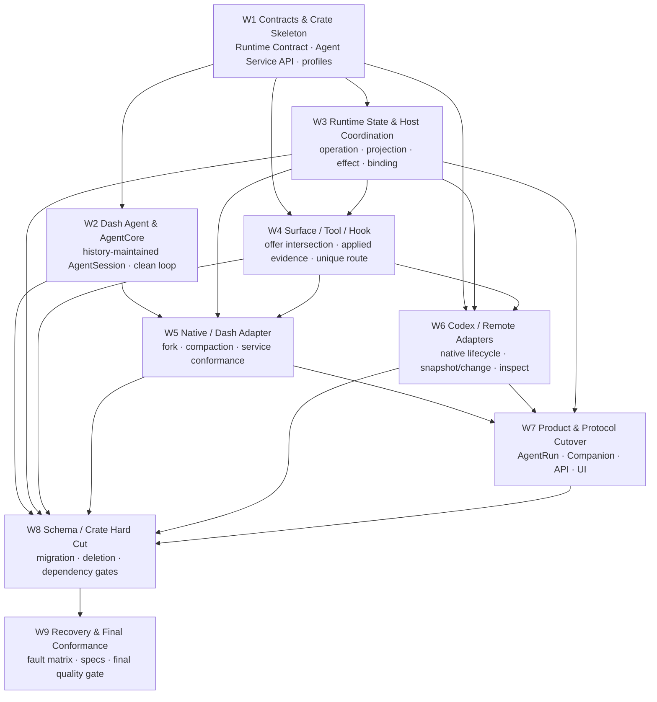

# Agent Runtime 最终架构收敛实施计划

## 0. 执行入口

本任务已完成 W7/S4 Product lane、S5 final activation 与 S6 final conformance 的
关键路径；完整状态评估和阶段出口以
[`final-convergence-closeout.md`](./final-convergence-closeout.md) 为准。

首次开始实现前的规划 gate 为：

1. 用户审阅并批准 `prd.md`、`design.md`、`transition-architecture.md`、本文件与
   manifests；
2. PRD 完成 convergence pass，Open Questions 清零；
3. `implement.jsonl`、`check.jsonl` 只保留最终设计适用的 context；
4. 明确每个粗粒度 dispatch bundle 的 ownership zone 与共享热点；
5. 由主会话运行 `task.py start`，再通过当前会话内嵌协作工具派发 implement/check
   subagent，不建立 Trellis channel；
6. 每个工作包以 behavior/conformance test 证明边界，不建立 compatibility、dual write、
   fallback 或只改名的 facade。

父任务是唯一 Trellis lifecycle/branch/archive 单元。`workstreams/README.md` 只提供并行
验收索引；依赖关系以本文件为准，安全迁移边界和派发协议以
`transition-architecture.md` 为准。

Product 控制面以 `58c537b7`（`c3cc58b9^`）和既有行为测试为 oracle；恢复时保留业务规则，只把旧
RuntimeSession/journal/Backbone seam 适配到最终 owner。

## 1. 依赖图



并行原则：

- W2 与 W3 可在 W1 contract freeze 后并行；
- W4 可在 W1 profile 与 W3 ownership 稳定后开始；
- W5/W6 的最终完成与独立 check 以 W1/W3/W4 通过为 gate；同一 Dash/Native bundle
  可以在 contract milestone 后先完成 W2 和 contract-only W5 工作，但不得在 Platform
  checked revision 之前产出 W5 activation-ready 结果；
- W7 只在 Native/Codex contract 行为稳定后切产品路径；
- W8 负责唯一 hard cut，不能在各工作包各保留一套旧入口；
- W9 是独立检查与恢复验证，不承担未完成实现。

### 1.1 Workstream、dispatch bundle 与 stable checkpoint

W1–W9 是需求、依赖与验收清单，不要求一个 workstream 对应一个 subagent 或一次提交。
实施按完整纵向结果粗粒度派发：

| Dispatch bundle | Covered workstreams | Stable output |
| --- | --- | --- |
| Platform Runtime | W1 + W3 + W4 | contract milestone、Runtime/Host/Surface target lane、activation set |
| Dash / Native | W2 + W5 | Dash Agent/Core/Native target lane、真实 fork/compaction、activation set |
| External Agents | W6 | Codex/Remote complete-agent conformance、activation set |
| Product / Protocol | W7 | AgentRun/Companion/API/App Server/UI target lane、activation set |
| Hard Cut | W8 | S5 migration/composition/workspace/deletion integration |
| Final Conformance | W9 | S6 fault matrix、negative gates、最终 specs |

Platform Runtime 与 Dash/Native 可在 contract milestone 后并行；Dash/Native 的最终 check
与 activation-ready 结果必须基于 Platform Runtime checker 固定的 revision。Product /
Protocol 在 Native 与 External Agents 的 target contract 行为稳定后开始。

Stable checkpoint 是可提交和交接的集成边界：

| Checkpoint | Required state |
| --- | --- |
| S0 Baseline | 当前 direct/fork/Companion/compaction/tool-hook/reconnect 路径证据已记录 |
| S1 Contract Freeze | additive contract、profile、wire 与 conformance skeleton 独立通过 |
| S2 Target Domains Ready | Dash/Core、Runtime/Host、Surface target domains 在隔离 composition 可验证 |
| S3 Complete Agent Lane | Native、Codex、Remote 均通过 Complete Agent conformance |
| S4 Product Lane Ready | AgentRun、Companion、API/UI target caller 在隔离 composition 通过 |
| S5 Atomic Hard Cut | final Runtime seam/schema/composition 激活，随后只删除已被替代的旧 Runtime implementation |
| S6 Final Conformance | recovery、fault matrix、negative gates、最终 specs 全部通过 |

S0–S4 不提前改变 production path。每个 Runtime/Agent bundle 把 production activation
部分保留为经过自身 checker 审阅的 activation component 与 consumer/deletion manifest；
Product bundle 只证明既有业务通过 final seam 完整可用，不提供 Product deletion
candidate。Wave 4 在同一冻结 revision 上组合 activation-ready change set。S5 由原
Runtime/Agent owner 维护自身领域修改，Hard Cut owner 串行集成 Cargo/lockfile、正式
Runtime migration、production composition、canonical generated contracts 和最终
legacy Runtime deletion。单个 component 不引入只为独立编译存在的反向依赖或兼容
shim。完整 wave、slot 和返工路由见 `transition-architecture.md` §12。

## 2. 工作包总表

| 状态 | 工作包 | Depends On | 独立验收输出 |
| --- | --- | --- | --- |
| [ ] | W1 Contracts & Crate Skeleton | 无 | dependency-light contracts、IDs、profile/fidelity、wire、conformance skeleton |
| [ ] | W2 Dash Agent & AgentCore | W1 | history-only AgentSession、Dash lifecycle、pure Core、replay/fork/compaction tests |
| [ ] | W3 Runtime State & Host Coordination | W1 | Runtime projection/change、operation/effect、Host binding/recovery、persistence ports |
| [ ] | W4 Surface / Tool / Hook | W1、W3 | desired/offer/bound/applied、unique route、Tool Broker/Hook profile |
| [ ] | W5 Native / Dash Adapter | W2、W3、W4 | Complete Agent conformance、真实 product fork、Dash compaction |
| [ ] | W6 Codex / Remote Adapters | W1、W3、W4 | Codex native lifecycle、Remote proxy、snapshot/change/inspect conformance |
| [ ] | W7 Product & Protocol Cutover | W3、W5、W6 | AgentRun/Fork/Companion/API/App Server/UI snapshot+change |
| [ ] | W8 Schema / Crate Hard Cut | W2–W7 | forward migration、旧 crate/interface/schema 删除、最终 Cargo DAG |
| [ ] | W9 Recovery & Final Conformance | W8 | crash/restart matrix、negative gates、spec 同步、最终门禁 |

### 2.1 需求追踪

| Work | Requirements | Acceptance |
| --- | --- | --- |
| W1 | R1–R3、R9–R10 | AC1–AC4、AC15–AC18 |
| W2 | R1、R4、R7、R10 | AC2、AC6、AC9–AC10、AC18 |
| W3 | R1、R4–R5、R9、R11 | AC5–AC6、AC12、AC14、AC19 |
| W4 | R3、R8 | AC4、AC11 |
| W5 | R2–R8 | AC3–AC11 |
| W6 | R2–R5、R7–R9 | AC3–AC7、AC9、AC11–AC13 |
| W7 | R5–R9 | AC7–AC8、AC12–AC13 |
| W8 | R1、R9–R11 | AC12、AC14、AC17–AC19 |
| W9 | R1–R11 | AC1–AC21 |

## 3. W1 — Contracts & Crate Skeleton

### Ownership

- `crates/agentdash-agent-runtime-contract/**`
- new `crates/agentdash-agent-service-api/**`
- `crates/agentdash-agent-runtime-wire/**`
- `crates/agentdash-agent-runtime-test-support/**`
- only the new contract/wire/test-support workspace Cargo entries and generated schemas

### Implement

- [ ] 收窄 Runtime Contract 为 Application ↔ Managed Runtime command/read/change。
- [ ] 建立 Complete Agent service API：
  `describe/create/resume/fork/execute/read/changes/inspect/apply_surface/revoke_surface`。
- [ ] 定义 stable Runtime/Agent/source/effect IDs，禁止 ID string 互换。
- [ ] 定义 receipt、unknown outcome、snapshot、source change level、inspection。
- [ ] 定义 per-facet capability/profile 与 semantic fidelity。
- [ ] 定义 Fork cutoff kinds、compaction mode、Tool/Hook route。
- [ ] 定义 `InitialAgentContextPackage` 的 typed variants、provenance/revision/digest、
  create receipt/inspect evidence，以及 `TypedNative/CanonicalRendered/Unsupported`
  fidelity；service API 不出现 Companion/Product/vendor DTO。
- [ ] 定义 `AgentSurfaceSnapshot`、`RuntimeOffer`、`BoundAgentSurface`、
  `AppliedAgentSurface` 的 contract ownership。
- [ ] 定义 `AgentHostCallbacks::invoke_tool/invoke_hook` reverse contract，包含
  binding generation、Turn/Item/effect identity、deadline、idempotency 与 typed
  Hook decision。
- [ ] Runtime Wire 定义 reverse callback request/result/decision、ack/replay 与
  generation fence。
- [ ] Runtime Wire 同时承载 Runtime gateway 与 remote Complete Agent frame，但 framing
  与业务 DTO 分层。
- [ ] 建立 Runtime repository、Agent service、adapter profile 的 conformance fixture。
- [ ] 增加 dependency/feature negative tests。

### Check

- [ ] service API 不依赖 Application/Domain repository/Infrastructure/vendor DTO。
- [ ] Runtime Contract 不依赖 service implementation、Host 或 transport。
- [ ] snapshot mandatory、source changes capability-graded、platform changes mandatory。
- [ ] exact requirement 不被 observed/approximation 满足。
- [ ] Fork、Hook、Tool 不使用 bool capability。
- [ ] Agent-native Tool/Hook 不需要 adapter-specific bypass API。

### Verify

```powershell
cargo test -p agentdash-agent-runtime-contract
cargo test -p agentdash-agent-service-api
cargo test -p agentdash-agent-runtime-wire
cargo test -p agentdash-agent-runtime-test-support
cargo run -p agentdash-agent-runtime-contract --bin generate_agent_runtime_contracts -- --check
cargo run -p agentdash-agent-runtime-wire --bin generate_agent_runtime_wire -- --check
```

## 4. W2 — Dash Agent & AgentCore

### Ownership

- current `crates/agentdash-agent/**`
- target `crates/agentdash-agent-core/**`
- Dash Agent-specific tests

W2 不修改 Runtime/Host/Application/adapter 生产代码。
`agentdash-agent` → Core/Dash 的物理 move 由 W2 独占；W8 不再移动这两个 crate。
`agentdash-agent-types` 仅作为 source inventory 读取，其最终目录删除由 W8 独占。

### Implement

- [ ] 将当前低层 loop、provider/tool primitives、streaming、cancel 和纯 summarization
  迁入 `agentdash-agent-core`。
- [ ] AgentCore 所有状态由显式 input/context/callback/output 表达。
- [ ] 新 `agentdash-agent` 建立 Dash Agent 中层。
- [ ] 建立 ordered history tree、branch/head、entry identity 和 history fold。
- [ ] `AgentSessionState = fold(AgentHistory)`；projection/index 可删除重建。
- [ ] fresh create 在同一 `DashAgentCommit` 写入 `InitialContextInstalled` history
  contribution 与 package digest；首个 `SubmitInput` 形成独立后续 history entry。
- [ ] command inbox、execution/effect/retry ledger 位于 Session 外。
- [ ] 实现 create/resume/fork/read/change 的 Dash public API。
- [ ] 实现 history-derived Turn/Item/Interaction lifecycle。
- [ ] 实现 Dash context materialization 与 compaction history transformation。
- [ ] 实现 manual compaction 与 automatic A/B/C lifecycle。
- [ ] 将 Core/Dash-owned 类型从 `agentdash-agent-types` 迁入最终 owner，但不建立
  re-export/shim；其它 legacy consumers 由其所属工作包切换，W8 在零消费者后删除 crate。
- [ ] 定义 `DashAgentCommit`，原子提交 command/effect settlement、history append/head
  CAS、derived projection/change 与下一 continuation intent。
- [ ] 删除 Runtime delegate、AgentRun/vendor DTO、platform tool result cache ownership。

### Check

- [ ] 清空 projection/index 后 history replay 得到等价 AgentSession。
- [ ] 任一 Session field 都能指向产生它的 history entry/fold rule。
- [ ] operation/mailbox/binding/effect/lease/platform fact 不存在于 Session schema。
- [ ] Core 无 durable repository、Runtime Contract、Product Domain、Codex、Relay 依赖。
- [ ] Dash Agent 不依赖 Managed Runtime/Host/Application/vendor crate。
- [ ] A/B/C identity 和 terminal rules 符合 design §11。
- [ ] crash 不会在 effect settlement 后丢失/重复 history contribution。

### Verify

```powershell
cargo test -p agentdash-agent-core
cargo test -p agentdash-agent
cargo tree -p agentdash-agent-core
cargo tree -p agentdash-agent
```

## 5. W3 — Runtime State & Host Coordination

### Ownership

- `crates/agentdash-agent-runtime/**`
- `crates/agentdash-agent-runtime-host/**`
- Runtime/Host persistence ports and their Infrastructure adapters
- final schema/constraint specification；正式 migration 由 W8 独占

### Implement

- [ ] 用 Runtime State 取代 universal AgentSession 设计。
- [ ] 实现 platform operation、idempotency、expected revision、pending delivery。
- [ ] 实现 authority-aware normalized projection、snapshot、durable change/outbox。
- [ ] source change gap 通过 Complete Agent snapshot reconcile。
- [ ] Host 保持 service instance/offer/binding/source coordinate/placement/generation/lease。
- [ ] 实现 stable effect identity、dispatch、inspect、unknown outcome reconciliation。
- [ ] worker claim/retry 只实现 delivery，不决定 Agent terminal。
- [ ] Runtime/Host transaction 通过 stable identity 关联，不伪装跨 Agent 原子。
- [ ] 拆分 `RuntimeJournalFact` internal/presentation usage，切到 owner-specific ports。
- [ ] in-memory 跑完整 Runtime/Host behavior suite；PostgreSQL suite 由 W8/W9 在唯一
  final migration 上运行。
- [ ] 不新增会被 W8 重写/合并的正式 migration。

### Check

- [ ] Runtime table/type 不使用 Session 命名。
- [ ] Runtime projection 不用于 external Agent resume/fork/context。
- [ ] stale generation/duplicate/late observation 不能推进 projection。
- [ ] Runtime transaction 只提交平台 facts；Host transaction 只提交 coordination。
- [ ] snapshot+platform change 在 source snapshot-only 情况下仍可 reconnect。

### Verify

```powershell
cargo test -p agentdash-agent-runtime
cargo test -p agentdash-agent-runtime-host
```

## 6. W4 — Surface / Tool / Hook

### Ownership

- Runtime Surface compiler modules
- Host offer/apply evidence modules
- Tool Broker modules
- Hook plan/profile/materialization modules
- corresponding product fact adapters

### Implement

- [ ] Product facts 编译 immutable `AgentSurfaceSnapshot`。
- [ ] Agent descriptor/instance/transport 归一 `RuntimeOffer`。
- [ ] 实现逐 contribution required/optional/route/fidelity intersection。
- [ ] Host/adapter materialize 后记录 `AppliedAgentSurface` digest/evidence。
- [ ] Complete Agent 只通过 `apply_surface/revoke_surface` materialize bound surface。
- [ ] Agent-native Tool/Hook 只经 `AgentHostCallbacks` reverse channel；remote 路径使用
  Runtime Wire request/decision/result。
- [ ] command availability 依赖 applied revision。
- [ ] Tool Broker 拥有平台 tool policy、permission、effect 和 callback。
- [ ] Agent-native tool/hook 留在完整 Agent；Dash 通过 callback 注入 Core。
- [ ] Hook 按 HookPoint/timing/blocking/mutation/effect 建模。
- [ ] 每项 contribution 固定唯一 causal route。
- [ ] 保留 `agentdash-application-hooks` 的 Product presets、workflow policy 与 effects，
  只把 Runtime callback execution 迁到 Surface/Tool Broker/Agent-native owner。

### Check

- [ ] required 缺失在 side effect 前 typed reject。
- [ ] PromptOnly/Observed 不满足 Exact。
- [ ] tool/hook effect 不会 Runtime/Agent 双执行。
- [ ] Host 不编译 Product Surface，adapter 不重新解释 product policy。
- [ ] applied ack revision/digest mismatch 时 command 不 available。
- [ ] blocking/mutating Hook deadline、duplicate/replay、stale generation 有 typed behavior。

### Verify

```powershell
cargo test -p agentdash-agent-runtime surface
cargo test -p agentdash-agent-runtime tool
cargo test -p agentdash-agent-runtime hook
cargo test -p agentdash-agent-runtime-host offer
cargo test -p agentdash-agent-runtime-host binding
```

## 7. W5 — Native / Dash Adapter

### Ownership

- `crates/agentdash-integration-native-agent/**`
- Dash service adapter tests
- Native-specific composition wiring

### Implement

- [ ] 将 Native adapter 从低层 Runtime driver 改为 Complete Agent service adapter。
- [ ] 映射 Bound surface 到 Dash Agent tools/instructions/hooks/context。
- [ ] Dash Agent history/snapshot/change 映射为 service contract。
- [ ] fresh create 将 `InitialAgentContextPackage` 原子映射为 Dash Agent history，并
  回执 applied digest/fidelity；package apply 前不暴露 active child。
- [ ] 产品 fork 调用 Dash Agent exact history fork，返回 child coordinate/digest。
- [ ] Companion Full 在 exact history fork 后、Activate 前应用 Product 持久化的
  selected child AgentFrame/surface/profile；禁止把 parent platform profile 当成
  history 的一部分继承。
- [ ] 删除“新 source binding + 空 history”的 product fork 路径。
- [ ] manual/automatic compaction 由 Dash Agent 执行，Runtime 只观察/投影。
- [ ] source effect inspect 支持 AlreadyApplied/NotApplied/Unknown。
- [ ] Native adapter 不生成 Runtime entity/journal fact。
- [ ] 完整运行 service conformance 与当前 fork regression。

### Check

- [ ] current fork 6/6 regression 继续通过。
- [ ] child history 在 ancestor binding/journal 删除后独立恢复。
- [ ] source projection 不存在第二套 history mapper。
- [ ] AgentCore 不接触 Runtime/Host ID。
- [ ] exact fork/compaction capability 均有 behavior evidence。

### Verify

```powershell
cargo test -p agentdash-integration-native-agent
cargo test -p agentdash-application-agentrun fork_
cargo test -p agentdash-integration-native-agent native_fork
cargo test -p agentdash-integration-native-agent compaction
```

## 8. W6 — Codex / Remote Adapters

### Ownership

- `crates/agentdash-integration-codex/**`
- `crates/agentdash-integration-remote-runtime/**`
- adapter-side `references/codex` alignment tests
- Relay Runtime Wire usage, not Relay core ownership

W5 与 W6 不共享 vendor DTO 或 adapter files。

### Implement

- [ ] Codex contribution 实现 Complete Agent service。
- [ ] create/resume/fork/read/submit/steer/interrupt/compact/interaction 映射 App Server。
- [ ] Codex ThreadStore/history 保持 source recovery authority。
- [ ] exact context read/apply 不存在时 profile 标记 Opaque/Observed。
- [ ] Codex/Remote 对 initial package 声明真实 `TypedNative/CanonicalRendered/
  Unsupported` fidelity；多步 source create/apply 使用同一 stable effect 与 inspect，
  不把普通首个 input 伪装成 package evidence。
- [ ] `thread/fork(lastTurnId)` 返回 verified child coordinate/receipt。
- [ ] App Server notification 映射 source change；重连 gap 使用 thread/read reconcile。
- [ ] dynamic tools、Hook、configuration boundary 返回真实 applied evidence。
- [ ] Remote proxy 通过 Runtime Wire 实现同一 service contract。
- [ ] Relay 只处理 typed sequence/ack/replay/health。
- [ ] 删除 adapter-produced `RuntimeJournalFact`。

### Check

- [ ] Codex DTO 不出 adapter crate。
- [ ] Runtime 不复制 Codex context/head 作为 source truth。
- [ ] SnapshotOnly/LiveStream/DurableTail profile 与真实行为一致。
- [ ] EOF/断连/unknown result 不假 Completed。
- [ ] remote duplicate replay 幂等，stale generation 被 fence。

### Verify

```powershell
cargo test -p agentdash-integration-codex
cargo test -p agentdash-integration-remote-runtime
cargo test -p agentdash-relay runtime_wire
cargo test -p agentdash-agent-runtime-test-support codex
```

## 9. W7 — Product & Protocol Cutover

### Ownership

- `crates/agentdash-application-agentrun/**`
- Companion modules
- Agent Runtime API/routes/stream projection
- generated frontend contracts and Agent UI state/components

### Implement

- [ ] 以 `58c537b7` 建立 Product capability/file/route/composition/test oracle；
  Companion、Frame Construction、Routine、Workspace、Canvas、Terminal、VFS、Wait、
  Capability、Workflow 与 AgentRun commands 均有恢复条目。
- [ ] 恢复 Product 源码、routes、AppState composition 和测试；业务条件、权限、
  payload、gate/adoption 与用户可见副作用保持 oracle 语义。
- [ ] 为恢复代码建立旧 seam → final owner compile ledger；适配只发生在依赖边界，
  不重新实现 Product 领域。
- [ ] AgentRun 只通过 Runtime Contract execute/read/changes。
- [ ] Application/AgentRun 建立唯一 durable `AgentRunForkSaga` repository/table/state
  machine，预分配 child product IDs。
- [ ] Fork 按 `Requested → RuntimeAdmitted → AgentForkApplied → RuntimeProvisioned →
  ProductGraphCommitted → RuntimeActivated → Succeeded` 推进。
- [ ] product graph、Host binding/source coordinate、Runtime provisioning/activation 分属
  各自 transaction；saga 保存每阶段 identity/receipt。
- [ ] post-dispatch unknown 只 inspect/reconcile 同一 effect；Lost 保存已知 child
  coordinate 并禁止第二次 fork。
- [ ] common exact cutoff 使用 completed Turn；Item/source cutoff 由 capability gate。
- [ ] AgentRun lineage 保存 product lineage 与稳定 child Runtime/Agent mapping。
- [ ] Companion `Full` 映射 exact `ForkParentHistory`；
  `Compact/WorkflowOnly/ConstraintsOnly` 映射 `FreshWithContextPackage`。
- [ ] Application 把 fresh slices 编译为平台中立 `InitialAgentContextPackage`：
  compact summary/workflow context/constraint set 均携带 authority/revision/digest
  provenance；Workspace/VFS/Tool/Hook/capability 仍走 Surface。
- [ ] package 由 fresh create 原子携带，Runtime 验证 applied digest/fidelity 后才激活
  child；派发任务随后作为首个普通 `SubmitInput`，两者使用不同 receipt/测试。
- [ ] `adoption_mode` 只控制 child result 回传/等待，不改变 history 创建方式。
- [ ] visible history 读取 child Runtime projection，不拼 ancestor current journal。
- [ ] API 返回 operation receipt/availability，不推断 Agent internal phase。
- [ ] App Server protocol 只从 Runtime committed change 投影。
- [ ] UI 使用 Runtime snapshot + platform change tail。
- [ ] compaction item 显示 started/completed/failed/lost。
- [ ] cursor gap 重新读取 snapshot，不全量 journal replay。
- [ ] Lifecycle VFS 通过显式 `LifecycleHistoryQueryPort` 读取
  `AgentRunProductProjectionQueryPort`，`session/events.json` 原样暴露 canonical
  conversation history，messages/tools/writes/summaries/turns 仅作为可重建索引。
- [ ] 注册真实 `LifecycleMountProvider`；conversation 路径不读取 journal/旧 session
  表，fork child 不拼 ancestor history；node artifacts/records 继续读取 Lifecycle
  自有事实。
- [ ] 恢复 Routine、Workspace Module、Canvas、Terminal、Wait、Capability/Runtime
  Tools、AgentRun workspace/runtime trace 的 production routes 与 composition，并分别
  接 Product repositories、Runtime Surface/Tool Broker、AppliedResourceSurface、
  terminal projection 和 canonical Runtime history。
- [ ] 恢复旧 Hook presets 所表达的 Companion result、gate wake、context inheritance、
  lifecycle advance 等 Product effect；这些 effect 落到明确 Product command/callback
  owner 后，旧脚本引擎才满足删除条件。

### Check

- [ ] Product capability parity inventory 中每一项均有 route/tool caller、application
  behavior、final owner、projection consumer 和 tracer evidence。
- [ ] Application 无 Host/service/Dash/Codex 依赖。
- [ ] 需要 fork 的 product path admission 要求 exact fork。
- [ ] Companion fork 与 fresh context 有不同 command/receipt/test。
- [ ] 不允许 Complete Agent API 出现 Companion/Product DTO，不允许
  `SubmitInput` 或不可追踪 prompt 代替 initial package apply evidence。
- [ ] protocol identity/order 与 Runtime change commit 一致。
- [ ] UI 不从 worker/journal/API timing 猜 activity。
- [ ] Lifecycle VFS provider、Product projection query 与 production composition 有
  tracer test，删除旧 journal reader 后仍能读取 exact canonical records。
- [ ] 每个 Fork crash boundary 重启后继续同一 saga/child。

### Verify

```powershell
cargo test -p agentdash-application-agentrun
cargo test -p agentdash-api agent_runtime
cargo test -p agentdash-application companion
pnpm contracts:generate
pnpm contracts:check
pnpm --filter app-web typecheck
pnpm --filter app-web test -- sessionStreamReducer
pnpm --filter app-web test -- useSessionFeed
```

前端现有文件名含 Session 时，只有其状态确由 history 维护才保留；否则在 W8 迁名。

## 10. W8 — Schema / Crate Hard Cut

S5/W8 的完整收尾顺序见
[`final-convergence-closeout.md`](./final-convergence-closeout.md)。Hard Cut 的
零消费者证据来自 replacement、production caller、composition、persistence、
projection 与 behavior tracer 的共同闭合。

W8 的正式 deletion 入口由以下阶段共同构成：

1. C0：冻结 Product behavior oracle 与 capability inventory；
2. C1：恢复 Product 源码、route、composition 与 tests；
3. C2：把 Product 代码适配到 final owners；
4. C3/C4：Product capability 与 read-model tracers 全部通过；
5. C5：只删除 replacement manifest 证据完整的 legacy implementation。

### Ownership

- workspace `Cargo.toml` / lockfile
- final migration and schema guard
- W8-owned legacy crate directory deletions；不移动 W2-owned Agent/Core
- composition roots
- generated contracts after cutover

### Implement

- [ ] 为每个 deletion candidate 建立 replacement manifest：target implementation、
  callers、composition、repository/schema、projection、behavior tracer、negative
  evidence。
- [ ] 以 Product capability inventory 审核 activation history；Product 能力归 W7，
  具备完整 replacement evidence 的 legacy implementation 归 W8。
- [ ] Consolidate final forward migration，建立 Product/Runtime/Host/Dash/external projection
  分区、`agent_run_fork_saga`、DashAgentCommit 与 callback/effect constraints。
- [ ] 生产 composition 切到唯一 final repositories/services。
- [ ] 验证 W2 已完成 `agentdash-agent`/`agentdash-agent-core` 最终物理 shape；W8 不再
  移动或重写其文件树。
- [ ] 删除 `agentdash-agent-types`。
- [ ] 将 `agentdash-agent-protocol` 收窄为 canonical App Server standard families +
  AgentDash typed extensions 的 dependency-light 唯一 owner；迁出 Backbone
  platform/product event、Runtime internal state、journal carrier 与 Codex transport
  私有 DTO。
- [ ] 固定 `agentdash-agent-protocol-codegen`（或等价的同 owner 生成入口）同时生成并
  校验 Rust/TypeScript canonical roots、schema lock、freshness 与 parity，禁止 Codex
  私有 generator 和 Product contract 形成第二套 owned conversation language。
- [ ] 删除 connector 版 `agentdash-executor`。
- [ ] 将 `agentdash-spi` 清理/迁名为 `agentdash-platform-spi`。
- [ ] 验证 `agentdash-application-hooks` 只拥有 Product hook policy/effect compilation，
  production composition 通过 typed plan/callback 接入 Runtime；若仍有 Runtime callback
  execution，再按 replacement manifest 迁出对应实现。
- [ ] `agentdash-application-runtime-session` 保持物理缺席；删除
  `agentdash-application-ports`、API、contracts、SPI、Relay/gateway 中平台
  `RuntimeSession*` delivery/live/capability/DTO/event 残留。
- [ ] 迁名 `agentdash-application-runtime-gateway` 为 extension gateway。
- [ ] `agentdash-integration-api` 的 Agent 模块依赖/re-export service API；Host/adapters
  直接依赖 service API。
- [ ] 保留 runtime-wire 的共享 framing/codegen 与 test-support 的跨 adapter conformance
  harness；删除其中无消费者的旧 facade/module。
- [ ] 删除旧 journal/state/context/connector/hook 表、字段、trait、generated DTO。
- [ ] 更新 Cargo DAG 与 composition，无 temporary facade。

### Check

- [ ] 每个物理删除都能引用完整 replacement manifest；缺少任一 evidence 的条目不进入
  deletion diff。
- [ ] Companion、Routine、Workflow、Workspace、Canvas、Terminal、VFS、Wait、
  Lifecycle 与 canonical Session 产品行为没有因 crate/path 删除而消失。
- [ ] 每个 crate 都有 design §1.3 的独立理由。
- [ ] migration 无兼容 view、dual write、fallback 或旧数据 backfill。
- [ ] W8 是唯一正式 migration owner；W2/W3 没有需要改写的历史 migration。
- [ ] 生产代码只读取最终 schema。
- [ ] `cargo metadata` 依赖方向符合 design §14。
- [ ] old crate path/type/module 搜索为零或只存在 migration 删除语句。

### Verify

```powershell
pnpm migration:guard
pnpm test-support:guard
cargo metadata --format-version 1
cargo test -p agentdash-infrastructure migrations
cargo test -p agentdash-infrastructure agent_runtime
```

## 11. W9 — Recovery & Final Conformance

### Ownership

- conformance/fault tests
- dependency/negative gates
- `.trellis/spec/` final contract updates
- no new production feature ownership

### Implement / Check

- [ ] 注入 fork 各 durability boundary crash。
- [ ] 注入 effect dispatch 前/后、receipt 丢失、inspect unknown、lease reclaim、restart。
- [ ] Native/Codex/Remote 运行同一 Complete Agent conformance。
- [ ] initial package conformance 覆盖 typed-native/canonical-rendered/unsupported
  admission、digest/renderer version、unknown create outcome 与首个 input ordering。
- [ ] Runtime in-memory/PostgreSQL 运行同一 behavior suite。
- [ ] Dash Agent history replay/property/fork/compaction suite。
- [ ] Tool/Hook unique route 与 applied evidence suite。
- [ ] AgentHostCallbacks in-process/remote reverse call、deadline、duplicate、replay 与
  stale generation suite。
- [ ] Runtime snapshot/change cursor gap/reconcile suite。
- [ ] AgentRun direct/fork/multi-fork/Companion/reconnect E2E。
- [ ] App Server/UI compaction lifecycle E2E。
- [ ] 更新 specs 只记录最终职责和选择依据。
- [ ] 执行 negative search、定向门禁和一次最终综合门禁。

### Negative gates

```powershell
rg -n "RuntimeJournalFact|RuntimeJournalRecord|journal_records_after|append_presentation" crates packages
rg -n "AgentConnector|ConnectorCapabilities|ContextActivationDispatch" crates packages
rg -n "agentdash-agent-types|agentdash-executor" Cargo.toml crates
rg -n "agentdash_application_hooks" crates/agentdash-api crates/agentdash-infrastructure
rg -n "RuntimeJournal|JournalFact|JournalRecord|ExecutorSessionBound|ControlPlaneProjectionChanged|WorkspaceModulePresentationRequested|PtyTerminalStateChanged" crates/agentdash-agent-protocol
rg -n "RuntimeSession|runtime_session" crates/agentdash-application-ports crates/agentdash-application crates/agentdash-api crates/agentdash-contracts crates/agentdash-spi crates/agentdash-relay crates/agentdash-application-runtime-gateway
rg -n "Session" crates/agentdash-agent-runtime crates/agentdash-agent-runtime-host
```

`Session` 搜索只允许出现在 vendor/source 引用、迁移删除、历史 test fixture 或明确证明
history-maintained semantics 的 Dash Agent 内部；Runtime/Host 业务类型结果应为零。
`BackboneEvent`、`BackboneEnvelope` 与 `PlatformEvent` 是 07-12 canonical conversation
owner 的稳定类型名，不按名称判定为旧 journal；协议门禁只搜索已经迁出到 Product、
Runtime 或 journal owner 的具体 carrier/variant。

### Directed quality gate

```powershell
pnpm migration:guard
pnpm test-support:guard
pnpm contracts:check
cargo test -p agentdash-agent-core
cargo test -p agentdash-agent
cargo test -p agentdash-agent-service-api
cargo test -p agentdash-agent-runtime-contract
cargo test -p agentdash-agent-runtime
cargo test -p agentdash-agent-runtime-host
cargo test -p agentdash-integration-native-agent
cargo test -p agentdash-integration-codex
cargo test -p agentdash-integration-remote-runtime
cargo test -p agentdash-application-agentrun
cargo test -p agentdash-infrastructure
cargo test -p agentdash-api
pnpm --filter app-web check
```

定向门禁稳定后只运行一次：

```powershell
pnpm check:quick
```

VS Code/rust-analyzer 占用 Cargo lock 时等待共享缓存。若 `cargo fmt --all` 因本机缺失
reference checkout 失败，对本任务文件使用同 toolchain 定向 rustfmt，并记录原因。

## 12. Peer checkpoint evidence

每个 implementation peer 完整负责 research、design、implementation 与 focused
verification。形成 checkpoint 时报告：

```text
Outcome:
Production path:
State authorities:
Shared hotspots touched:
Behavior tracers:
Commands verified:
Remaining external boundary:
Commit:
```

各 peer 直接处理自己发现的缺口，并与其它 peer 共同闭合跨结果接缝。C6 再按完整目标
执行一次 Final Conformance，不为局部 diff 建立独立 checker/handoff 流水线。

## 13. Stable review checkpoints

本项目不做 runtime rollback。可接入父任务稳定分支的审查边界只有：

1. S0 baseline；
2. S1 additive contract freeze；
3. S2 target domains ready；
4. S3 complete Agent lane ready；
5. S4 product lane ready；
6. S5 atomic hard cut；
7. S6 final conformance/spec。

每个 checkpoint 必须只有一条 production route、一个事实 owner 和一套 canonical
schema/contract，并重新运行真实 tracer bullets。最了解路径的当前 peer 直接完成所需
修复，直到 checkpoint 前向成立。

## 14. Final acceptance

- [ ] PRD AC1–AC21 均有代码或测试证据；
- [ ] C0–C6 的纵向结果、focused verification、Final Conformance 与 S0–S6 稳定边界
  均完成；
- [ ] Runtime 是所有 Agent 的唯一平台外层；
- [ ] Complete Agent service 是 Host 的唯一 Agent seam；
- [ ] Dash Agent 与 AgentCore 物理、依赖和测试分层；
- [ ] AgentSession 全状态由 history replay；
- [ ] Fork/Companion/Compaction/Tool/Hook/Change/Recovery 通过矩阵；
- [ ] RuntimeJournalFact 与旧 crates/interfaces/schema 删除；
- [ ] migration/generated contract/Rust/frontend 门禁通过；
- [ ] `.trellis/spec/` 与最终实现一致；
- [ ] 用户审阅最终结果后才归档父任务。
