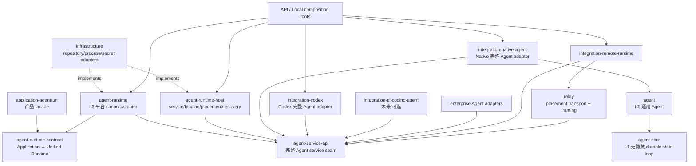

# Research: pi-mono AgentCore 与 AgentDash crate 收敛

- Query: 研究 `references/pi-mono` 的 AgentCore / Agent / 完整 Agent host 边界，对照 AgentDash 当前 crate 拓扑、07-10 final design 与 07-17 待 review design，给出保留统一 Agent Runtime 外层、补齐自有 Agent 通用中层的目标 DAG 与逐 crate 收敛建议。
- Scope: mixed
- Date: 2026-07-17

## Findings

### 1. 结论摘要

1. **pi 的低层事实边界很清楚，但 `packages/agent` 整包并不等于纯 Core。** `agent-loop.ts` 是调用方提供 Context、输入、配置、tools 后运行并返回增量 message/event 的低层 loop；同包的 `Agent` 是进程内有状态 wrapper；新 `AgentHarness` 又进一步拥有 session persistence、resource resolution、operation locking、tree navigation 与 compaction。这三个层次必须分开阅读。
2. **AgentDash 当前缺少独立的通用 Agent 中层。** 07-10 final design 把旧 `agentdash-agent` 直接净化成 `agentdash-agent-core`，然后由 Managed Runtime 直接拥有 context/compaction/Thread/Turn 等语义（`target-crate-shape.md:5-23,40`）。这在 Core 与平台 Runtime 之间没有留下类似 pi `AgentHarness` / `pi-coding-agent::AgentSession` 的通用 Agent 生命周期层。
3. **07-17 design 修正了 journal 权威和状态原子性问题，但把这个缺层继续吸收到单一 Hosted `AgentSession` aggregate。** 它明确让该 aggregate 同时拥有 Operation/Mailbox、Turn/Item/Interaction、Context/Compaction，并把 Native、Codex、Remote 都定义为 execution adapter（`prd.md:7-9,62-68`; `design.md:7-20`）。这适合描述 AgentDash 自有 Agent 的一部分状态机，却不能成为 Codex、pi-coding-agent、企业 Agent 的共同内部内核。
4. **正确拓扑不是删除 07-10 的统一 Runtime 外层，而是补齐它的下方层次。** Application 仍只面对 AgentDash-owned Runtime contract；统一 Runtime 仍拥有平台 canonical contract、surface/tool/hook/profile、平台 admission、binding 与 recovery。其下通过“完整 Agent service” seam 连接实现：Native 实现内部为 `AgentCore -> Agent`，Codex / pi-coding-agent / 企业 Agent 则整体替换 Native 的 `Agent + 自有 host`，不要求采用相同内部拆分。
5. **07-17 的状态应按权威范围拆开，而不是只换名字。**
   - Runtime 平台 aggregate：平台 Session identity、Operation/idempotency、mailbox/admission、normalized Turn/Item/Interaction projection、surface、binding generation、effect/receipt、change/outbox 与 recovery。
   - 完整 Agent service：真实 agent history/tree/fork、model-visible context、compaction 算法与生命周期、retry/steer/follow-up、工具调用内循环。
   - Native Agent 中层：上述完整 Agent service 的 AgentDash 自有实现；它可以拥有自己的 typed context revision、compaction transition 与 repository ports。
   - AgentCore：只执行 provider/tool loop、streaming/cancel 与纯 summarization primitive；不认识 Runtime、Surface、Hook、Workspace、Companion、binding 或 durable Session。

### 2. pi-mono 的真实模块边界

#### 2.1 `packages/ai`：Provider / model / stream 基础，不是 Agent Session

- `references/pi-mono/packages/ai/package.json:2-4,59-70`：本地参考包为 `@earendil-works/pi-ai` `0.80.10`，依赖 provider SDK 与 schema 库，不依赖 agent/coding-agent。
- `packages/ai/src/types.ts:309-313` 定义 `StreamFunction`，`:382-419` 定义消息，`:444-453` 定义 Tool 与 LLM Context。
- `packages/ai/src/models.ts:75-119` 是 Provider contract，`:123-189` 是 model 描述，`:218-227` 的 `ModelsImpl` 只维护 provider/auth/model registry；它不是会话历史。
- `packages/ai/src/session-resources.ts:1-14` 的 “session resources” 只是 provider 资源清理 hook，不能据文件名推断它拥有 conversation session。

#### 2.2 `packages/agent` 的低层 loop：可作为 AgentCore 对照

- `packages/agent/package.json:2-4,31-35`：包名虽叫 `pi-agent-core`，但当前版本除 `pi-ai` 外还含 harness 所需的 ignore/YAML 依赖。
- `packages/agent/src/agent-loop.ts:31-53` 的 `agentLoop(prompts, context, config, ...)` 全部输入由调用方显式传入；`:103-117` 复制输入 Context/messages，并只返回本轮新增 messages。
- `packages/agent/src/agent-loop.ts:155-177` 的 current context、config、pending steering 都是单次调用局部状态，不是隐藏 durable session。
- `packages/agent/src/agent-loop.ts:288-301` 在 provider 边界执行 context transform、message conversion，并以 system prompt/messages/tools 组装 LLM Context。
- `packages/agent/src/agent-loop.ts:413-427` 执行工具调用；`:621-629` 的 before-tool callback 也是显式 config dependency。
- `packages/agent/src/types.ts:140-169` 定义 caller-supplied `AgentLoopConfig`，`:398-406` 的 `AgentContext` 只有 system prompt、transcript、tools，`:415-430` 是 lifecycle/message/tool event。

因此，可复用 AgentCore 的判断标准应是：**一次运行的完整因果输入可由 Context + current input + model/provider + tools/config 表达，运行只产生 message/event/result；进程退出后不需要找回隐藏状态才能解释结果。**

#### 2.3 同包 `Agent` wrapper：便利的进程内状态，不应误写成无状态 Core

- `packages/agent/src/types.ts:322-347` 的 `AgentState` 已包含 messages、tools、model、thinking level 及 streaming transient state。
- `packages/agent/src/agent.ts:171-198` 的 `Agent` class 持有 `_state`、steering/follow-up queue 和 active run。
- `packages/agent/src/agent.ts:424-429` 暴露 state snapshot；`:527-539` 在收到 message event 时更新内部 transcript。

这层可作为低层 loop 的 ergonomic wrapper，但它还不是 durable history/fork/compaction Agent。AgentDash 若保留类似 wrapper，应位于 Core crate 内并明确是可丢弃的运行期便利状态，或直接由中层 Agent 包装。

#### 2.4 `AgentHarness`：pi 正在形成的通用 Agent 中层

- `packages/agent/docs/agent-harness.md:3` 明确称其为 low-level loop 之上的 orchestration layer，拥有 session persistence、runtime configuration、resource resolution、operation locking 和 extension-facing mutation。
- `packages/agent/src/harness/types.ts:334-420` 定义 append-only tree entry（message、model/thinking/tools change、compaction、branch summary、custom、label 等）；`:422-427` 定义由活动分支派生的 SessionContext。
- `packages/agent/src/harness/types.ts:441-479` 分别定义 SessionStorage 与 SessionRepo；memory 和 JSONL 实现位于 `harness/session/memory-*` 与 `jsonl-*`。
- `packages/agent/src/harness/session/session.ts:137-175` 的 Session 读取 branch 并构造 context；`:203-307` 追加 message/model/thinking/tools/compaction/custom/label/name；`:318` 起支持 tree navigation。
- `packages/agent/src/harness/types.ts:494` 定义 `idle | turn | compaction | branch_summary | retry` phase。
- `packages/agent/src/harness/agent-harness.ts:157-185` 持有 phase/session，`:315` 从 Session 构造 Context，`:466-490` 持久化 emitted messages/pending writes，`:565` 直接调用 low-level `runAgentLoop`，`:686-728` 执行 compaction，`:732-825` 执行 tree navigation。
- `packages/agent/docs/agent-harness.md:210-218` 说明结构变更只允许 idle，并明确 auto-compaction/retry decision point 尚未实现。
- `packages/agent/docs/durable-harness.md:9-24,42-81` 说明 harness 本身无法让 JavaScript tools/hooks 等运行依赖完全 durable；durable session log 与 host 重建运行依赖应分开，并要求显式 async restore。

这正是 AgentDash 需要补齐的中层形状：**Agent 语义拥有 history/fork/compaction/lifecycle 与 persistence contract；平台提供工具、资源和 durable adapter，但不因此取得 Agent 语义所有权。**

#### 2.5 `pi-coding-agent`：完整 Agent 与其自有高层 host 的联合实现

- `packages/coding-agent/package.json:2-4,41-44`：`pi-coding-agent` `0.80.10` 依赖 `pi-agent-core`、`pi-ai`、`pi-tui`，描述本身即包含 coding tools 与 session management。
- `packages/coding-agent/src/core/session-manager.ts:781-802` 把 session 定义为 append-only JSONL tree，拥有 branching/context resolution；`:988-1116` 追加各种 entry；`:1189-1214` 构造 branch/context；`:1289-1549` 提供 branch/reset/fork/create/open/list。
- `packages/coding-agent/src/core/agent-session.ts:284-374` 的 `AgentSession` 同时持有 low-level Agent、SessionManager、settings，以及 queue、compaction/retry/bash、extension、tools/resources 等完整运行状态。
- `packages/coding-agent/src/core/agent-session.ts:574-620` 持久化 Agent events，`:1102` 起处理 prompt，`:1323-1343` 处理 steer/follow-up，`:1771-2175` 处理 explicit/auto compaction，`:2209` 起绑定 extensions，`:2434-2569` 构造 tools/resources/runtime，`:2614` 起重试，`:2836-3010` tree navigation。
- `packages/coding-agent/src/core/extensions/types.ts:304,439,550-810,1167,1477` 的 extension contract 覆盖上下文、工具、session/agent lifecycle、extension API/factory；`resource-loader.ts:38-45,159` 加载 extensions、skills、prompts、themes、agent files 和 system prompt resources。
- `packages/agent/docs/models.md:793,860,938` 明确当前 coding-agent 尚未使用 AgentHarness，仍由旧 AgentSession 驱动 low-level Agent；未来 harness adoption 仍是迁移项。

所以 pi 的现状不是整齐的三个发布包，而是：

```text
pi-ai
  -> low-level agent loop                  # 清晰 Core
  -> AgentHarness（新通用 Agent 层）       # 已实现主要骨架，仍在迁移

pi-coding-agent
  -> legacy AgentSession + SessionManager  # 完整 Agent + coding host，当前生产路径
  -> extensions/resources/TUI/CLI
```

对 AgentDash 的启示是借用**边界和所有权**，不是照搬其当前 package 名称或迁移中的重复实现。

### 3. AgentDash 当前代码事实

#### 3.1 Core 与中层职责目前混在 `agentdash-agent` / `agent-types`

- `crates/agentdash-agent/src/lib.rs:1-39` 同时导出 Agent、loop、compaction、naming、tools、event stream 与 `AgentRuntimeDelegateSet`。
- `crates/agentdash-agent/src/agent.rs:93` 的 `Agent` 是有状态 engine；`:489` 构造 AgentContext。
- `crates/agentdash-agent/src/agent_loop.rs:90-123` 的 config 已含 runtime delegates、tool refs 与 hooks；`:213-223` 的默认 compaction 路径直接报错 “context compaction is owned by the managed Agent Runtime”。这是平台 ownership 反向进入 Core 的直接证据。
- `crates/agentdash-agent-types/src/runtime/delegate.rs:22-101,116` 定义 RuntimeCompaction、ContextTransform、ToolPolicy、TurnBoundary、ProviderObserver 与 delegate set。`agent-types/src/lib.rs:38-40` 将其作为通用类型公开，说明当前 types crate 也混合了 Core 与平台 Runtime。

#### 3.2 统一 Runtime 外层已经存在，而且是应保留的 07-10 基础

- `crates/agentdash-agent-runtime-contract/src/command.rs:120-193` 定义 canonical Runtime commands；`snapshot.rs:18-44` 定义平台 snapshot；`gateway.rs:42` 定义 Application-facing `AgentRuntimeGateway`。
- `crates/agentdash-agent-runtime/src/model.rs:23-53,69-101` 持有 Runtime Turn/Item/Interaction/Operation/Thread 状态。
- `crates/agentdash-agent-runtime/src/gateway.rs:21,401,1342` 是 ManagedAgentRuntime、driver observation ingestion 与 Runtime gateway 实现。
- `crates/agentdash-agent-runtime/src/surface.rs` 编译 Bound Agent Surface；`tool_broker.rs:973,1489` 提供 PlatformToolBroker 与 SessionToolMcpFacade；这些是正确的 L3 平台职责。
- `crates/agentdash-agent-runtime-host/src/model.rs:35,70,143,196,245` 分别定义 service instance、offer、binding、source coordinate 与 driver lease；`host.rs:135` 的 IntegrationDriverHost 负责 service/placement 生命周期。这个 aggregate 与 conversation projection 所有权不同，保持独立模块是合理的。
- `crates/agentdash-integration-api/src/agent_runtime.rs:131,143,309,386,451,503,533,544` 已有 service definition/placement、surface/context/tool/hook broker、driver factory 和 contribution，是完整 Agent service seam 的可用基础。

#### 3.3 当前 seam 仍把完整 Agent 降成“Runtime journal fact 生产器”

- `crates/agentdash-agent-runtime-contract/src/driver.rs:121-138` 的 `DriverEventEnvelope` 直接携带 `Vec<RuntimeJournalFact>`；`:211-225` 的 `AgentRuntimeDriver` 因此暴露的是 Runtime 内部事实形状，而不是完整 Agent service 的 command/read/change contract。
- `crates/agentdash-agent-runtime/src/gateway.rs:401` 接收该 envelope，Runtime tests 大量用 `driver_facts` 构造 canonical state。
- `crates/agentdash-integration-codex/src/driver.rs:155-160` 自己维护 Codex sessions；`:399-423` 直接调用 `thread/fork`/resume 并启动 App Server pump；`:596` 却因 Codex compaction opaque 而声明它不能满足 “canonical managed compaction”。这正说明 seam 在强迫完整 Codex Agent 服从 AgentDash 自有 compaction 内核。
- `crates/agentdash-integration-native-agent/src/driver.rs:377-378,505-519` 的 NativeThread 自己持有 `Mutex<Agent>`、构造 Agent 并注入 runtime delegates；Native adapter 正在替代缺失的中层 AgentSession。

#### 3.4 07-10 的物理基础已落地，但旧拓扑清理与中层并未完成

已落地的基础（仅按当前代码事实，不以 archive 状态作为完成证明）：

- runtime contract、managed runtime、runtime host、runtime wire 已存在；
- Native、Codex、Remote adapter 与 service definition/offer/binding/lease 已存在；
- Business Surface、Tool Broker、Hook/Context coordination、Runtime repository/workers 与数据库 migrations 已存在；
- Relay 已有 runtime wire stream/ack/placement 模块（`crates/agentdash-relay/src/runtime_wire.rs:16-131`）。

仍未完成或方向需修正：

- 07-10 `target-crate-shape.md:66-74` 计划的 agent→core、agent-types 删除、protocol→wire、executor→host、hooks/session crate 删除、SPI 清理、extension gateway 重命名均未完成；
- 当前 `agentdash-agent-protocol/src/lib.rs:1-68` 同时承载 Backbone、生成 Codex v2、AgentDash Codex-shaped facade、thread item 与 projection，不是纯 wire；
- `agentdash-application-agentrun/Cargo.toml` 仍直接依赖 agent、agent-types、agent-protocol、agent-runtime、runtime-contract 与 SPI；`agent_run/runtime_session_boundary.rs:126,170,199,303` 仍保留四组旧 RuntimeSession ports；
- `agentdash-spi/src/session_persistence.rs:297,317,351,430,465` 仍保留 SessionMeta、ExecutionStatus、RuntimeCommand、PersistedSessionEvent、SessionCompactionStatus；`connector/mod.rs:38,208` 仍有旧 ExecutionSession/Turn frame；
- `agentdash-application-hooks` 仍是独立平台 hook policy crate；
- `agentdash-application-runtime-gateway/src/runtime_gateway/provider.rs:10` 与 `gateway.rs:11` 实际是 extension/setup/action gateway，名称仍与 Agent Runtime 混淆；
- `agentdash-executor/src/lib.rs:1-9` 只剩 Codex config 与 MCP discovery/re-export substrate，新的 runtime-host 是另加的 crate，并非对旧 crate 的完成替换；
- 最重要的是，目标结构中没有新的 `agentdash-agent` 通用中层，Native history/fork/compaction/lifecycle 仍由 Runtime + adapter 拼接。

### 4. 正确的状态所有权分层

统一 Runtime 外层与完整 Agent 实现都可以有 “Session/Turn” 概念，但必须用权威范围区分，不能再声称只有一个跨所有实现的 aggregate。

| 状态范围 | 权威 owner | Runtime 可以做什么 | Runtime 不应做什么 |
| --- | --- | --- | --- |
| 平台 Session/AgentRun identity、授权、Operation/idempotency、mailbox/admission | Unified Agent Runtime | 原子接受平台命令、排队、取消、发布 platform change | 把外部 Agent 的内部 queue/retry 当作自己的 hidden state |
| normalized Turn/Item/Interaction presentation | Unified Agent Runtime | 维护 AgentDash contract 的稳定 ID、状态与 snapshot/change projection | 以 presentation journal 反推 model-visible history/context |
| desired/bound Surface、tool/hook/profile、Workspace/Companion contribution | Unified Agent Runtime + Host | 编译有限词汇、能力匹配、版本/digest、callback brokerage | 把 Product/Workspace/Hook DTO 泄漏进 Core 或外部 Agent 内部模型 |
| service instance、offer、binding、placement、lease、generation、effect receipt/recovery | Runtime Host | 选择与恢复完整 Agent service，做 generation fencing/reconciliation | 接管 Agent history/fork/compaction 算法 |
| history tree、fork cutoff、model-visible context、compaction、retry/steer/follow-up、tool loop lifecycle | 完整 Agent implementation | 通过 service seam 提供 command/read/change/capability；Native 可 durable | 被统一 Runtime 的 transition kernel 重建或覆写 |
| provider/tool loop 临时状态 | AgentCore | 接受完整显式输入并输出事件/结果 | 持久化 Session、认识平台 binding/surface/hook/workspace |

对 compaction 的切分尤其重要：

- Runtime 拥有 `RequestCompact` 这一平台 operation 的 admission、idempotency、delivery、normalized activity/projection 与 recovery receipt；
- 完整 Agent implementation 拥有 cut point、summary prompt、history/context revision、overflow retry/continuation 与实际 compaction lifecycle；
- Native Agent 可采用 07-17 设计中的 typed ContextRevision、AgentSession transaction、compaction state machine，但这些应落在 Native 的通用 Agent 中层；
- Codex/pi-coding-agent 通过 capability-gated native compact/fork/read/subscribe 实现 seam；Runtime 不要求它们返回 AgentDash 内部 Compaction entity 或 context-head CAS；
- Runtime recovery 使用 service snapshot revision/change tail/inspect receipt 对账，不能从 `RuntimeJournalFact` 重放生成外部 Agent 的内部会话。

### 5. 目标 crate DAG

建议保留少量、各自有深模块价值的 crate；不要为每个 DTO、port、projection 再拆 crate。



依赖约束：

1. `agent-core` 不依赖任何 AgentDash platform crate、runtime contract、service API、Domain、SPI、Codex 或 Relay。
2. `agent` 只依赖 `agent-core` 与 provider-neutral support；它定义 history/fork/compaction/lifecycle 与 repository/tool/resource ports，不依赖 AgentDash platform vocabulary。
3. `agent-service-api` 是完整实现边界，不能依赖 Native `agent`/`agent-core`，也不能要求所有实现暴露相同内部 state machine。
4. `agent-runtime` 依赖 platform contract 与 service API，不依赖 Native/Codex/Remote concrete adapter。
5. 只有 composition roots 同时看到 Runtime/Host/Infrastructure 与具体 adapter。
6. Surface/Hook/Workspace/Companion 通过 service API 的有限、versioned、capability-gated vocabulary 传递；Core 只看到最终 instructions/tools/context callbacks。

### 6. 逐 crate 目标动作

| 当前 crate | 目标动作 | 理由 |
| --- | --- | --- |
| `agentdash-agent` | **重命名/净化为 `agentdash-agent-core`** | 保留 loop、provider/tool primitive、stream/cancel、纯 summarization；移出 durable/session/runtime delegate。 |
| 新 crate `agentdash-agent` | **新增一个深模块 crate** | 这是遗漏的 L2；拥有 Native 通用 history/tree/fork/compaction/retry/steer/follow-up、AgentSession 生命周期及 persistence ports。 |
| `agentdash-agent-types` | **删除并按 owner 合并** | message/tool/context 进 Core；session/tree/compaction 进 Agent；platform command/profile 进 Runtime contract/service API。 |
| `agentdash-agent-runtime-contract` | **保留并收窄** | 只做 Application↔Unified Runtime 的平台 canonical command/snapshot/change/profile/error；移出 driver trait、journal fact 与 vendor DTO。 |
| `agentdash-agent-runtime` | **保留统一外层并内部重分层** | 保留平台 aggregate、surface/tool/hook/profile/admission、normalized projection/effect/recovery；Native history/context/compaction 语义下沉到新 Agent。 |
| `agentdash-agent-runtime-host` | **保留** | service instance/offer/binding/placement/lease 是独立 aggregate 与部署边界，规模和所有权足以成为 crate。 |
| `agentdash-integration-api` | **重命名并重建为 `agentdash-agent-service-api`** | 把当前 contribution/broker/factory 基础提升为完整 Agent service command/read/change/capability seam；“Integration” 名称过泛。 |
| `agentdash-agent-runtime-wire` | **合并** | canonical service wire DTO 合入 `agent-service-api::wire`，route/sequence/ack/framing 合入 Relay；当前约 500 LOC 的独立 crate 没有额外业务 owner。 |
| `agentdash-agent-protocol` | **拆分后删除** | Codex vendor schema 进 codex adapter；平台 contract 进 runtime-contract；service vocabulary 进 service-api；API/UI projection 进 contracts。 |
| `agentdash-agent-runtime-test-support` | **并入 integration/conformance tests** | 测试 helper 不需要成为生产依赖图中的长期小 crate；若多个外部仓库需消费再独立发布。 |
| `agentdash-integration-native-agent` | **保留并改成高 seam adapter** | 依赖新 `agent`，实现完整 Agent service；不再把 RuntimeCompactionDelegate 注入 Core。 |
| `agentdash-integration-codex` | **保留并改成完整 Agent adapter** | Codex App Server 自己拥有 session/fork/compact；adapter 只归一化 service command/read/change/capability。 |
| `agentdash-integration-remote-runtime` | **保留并收窄** | 作为完整 Agent service 的 remote proxy，不拥有第二套 canonical Agent state。 |
| `agentdash-executor` | **拆解后删除** | MCP discovery 迁入 platform tool/setup owner；Codex config 进 adapter；不要与已存在的 runtime-host 并存。 |
| `agentdash-spi` | **拆解，原则上删除 mega crate** | session/connector/hook/runtime 类型回到 Agent、Runtime、service API owner；只有确实跨模块的非 Agent plugin SPI 才另保留 `platform-spi`。 |
| `agentdash-application-agentrun` | **保留并收窄** | 只依赖 runtime-contract，做产品授权、AgentRun/mailbox/UI command mapping；删除旧 RuntimeSession boundary 与 concrete runtime/core 依赖。 |
| `agentdash-application-hooks` | **拆解后删除** | platform hook source/policy/compiler 进 Runtime surface；effect runner/secret/process 进 Infrastructure；adapter-native hook 进对应 integration。 |
| `agentdash-application-runtime-gateway` | **重命名 `agentdash-application-extension-gateway`** | 现代码是 extension/setup/action gateway，不是 Agent Runtime。 |
| `agentdash-infrastructure` | **保留并去 concrete 反向依赖** | 实现 Agent/Runtime/Host repository 与 process/secret ports；不直接依赖 Native adapter 或 Core 业务实现。 |
| `agentdash-relay` | **保留** | 它还承载 terminal/MCP/extension 等协议；Agent service wire 作为其中一个 placement transport 模块，不应删除整个 Relay。 |

### 7. 对 07-10 与 07-17 的审查结论

#### 7.1 07-10 final design：继承外层，修正下层

应继承：

- `target-crate-shape.md:5-23` 的 Application → Runtime → Host → adapter 总调用方向；
- `:99-105` 的 contract/core/runtime/concrete adapter 依赖约束；
- `:107-180` 的 desired Surface → Offer → Bound/Applied Surface 分层；
- `:243-248` 的 Infrastructure/Relay/composition root 职责；
- `:280-287` 的平台能力编译、service offer/binding 与 adapter 可替换性完成条件。

必须修正：

- `:13,20,40,92` 只画出 Clean Core，没有 Native 完整 Agent 中层；
- `:17,23,195-199,213-215` 把 history/context/compaction 的通用 Agent 语义整体搬进 Managed Runtime；
- `:66` 的 “旧 agent 直接变 core” 本身没有错，但必须同时新增新的 `agentdash-agent`，不能让 Runtime/Native adapter 填补空洞；
- 原 DAG 的 Native `adapter -> core` 应改为 `adapter -> agent -> core`；Codex/pi/企业仍是 `adapter -> complete external Agent`，不经过 Native Agent/Core。

#### 7.2 07-17 design：保留 hard-cut 原则，拆开 aggregate 权威范围

应保留：

- 删除 Runtime journal 作为 Session/command/context/fork/recovery 权威；
- driver 不再返回 `RuntimeJournalFact`；
- 平台 operation/mailbox/admission、binding generation、effect receipt 与 normalized projection 要有明确原子性；
- snapshot revision + change tail、stable identity、outbox 与 recovery fencing；
- 对 Native 实现建立 typed context、compaction/fork 行为测试。

必须重写：

- `prd.md:7` / `design.md:7-16` 的“唯一 AgentSession aggregate 同时拥有全部 Session/Turn/Item/Interaction/Operation/Mailbox/Context/Compaction”；
- 把 Codex/Remote/Native 都称为同一 AgentExecutionPort 下的 execution adapter；
- 让 AgentDash Runtime 的 context head、compaction transition kernel 成为所有完整 Agent 的内部权威；
- 用 Codex notification 驱动 AgentDash 自有 aggregate，或反过来要求 Codex 返回 AgentDash Compaction entity。

建议将 07-17 拆为两份设计：

1. **Unified Runtime canonical outer**：平台 operation/admission/mailbox、normalized projection、surface/binding/effect/recovery、journal cutover。
2. **Native Agent implementation**：通用 AgentSession、history/fork/context/compaction/retry/tool lifecycle 与 durable repository。

两者通过完整 Agent service seam 验证；Codex/pi-coding-agent 只需通过相同 seam conformance，不继承 Native transition kernel。

### 8. Genuine user decisions

架构方向已经由目标约束决定，真正仍需用户选择的只有：

1. **命名选择**：推荐把当前低层重命名为 `agentdash-agent-core`，把新中层使用最自然的 `agentdash-agent`；若不接受 crate rename，也可用 `agentdash-agent-engine`，但不能继续用一个名字同时指低层 loop 与完整 Agent。
2. **完整 Agent seam 的扩展策略**：推荐稳定有限 canonical vocabulary + capability profile + namespaced opaque extension payload。用户需决定首版是否只纳入 Native/Codex 共同交集，还是同时承诺 pi-coding-agent/企业 Agent 所需的 extension namespace。
3. **Runtime Host 是否长期独立部署/版本化**：当前 service/binding/lease 所有权支持独立 crate；若确认永远与 Runtime 同进程同版本，可合入 `agent-runtime::host` 进一步减少 crate。现有 remote placement 证据倾向继续保留。
4. **pi-coding-agent 的本期范围**：可以只把它作为 service seam conformance oracle，也可以本期新增真实 adapter；这影响实施范围，不改变 DAG。

数据库兼容不是决策点：项目未上线，可直接用 forward migration 建立正确 schema，并在完成切换后删除 journal/legacy session 表和对应 SPI；无需双写、fallback 或兼容字段。

### 9. Files found

- `references/pi-mono/packages/ai/src/{types.ts,models.ts,session-resources.ts}` — Provider/model/stream/tool 基础与非 conversation 的 provider resource cleanup。
- `references/pi-mono/packages/agent/src/{agent-loop.ts,types.ts,agent.ts,index.ts}` — low-level loop、状态 wrapper 与公开 exports。
- `references/pi-mono/packages/agent/src/harness/**` — 通用 Session tree、repo/storage、AgentHarness、compaction/branch summary。
- `references/pi-mono/packages/agent/docs/{agent-harness.md,durable-harness.md,models.md}` — harness ownership、durability 边界与 coding-agent 迁移状态。
- `references/pi-mono/packages/coding-agent/src/core/{agent-session.ts,session-manager.ts,resource-loader.ts}` — 完整 coding Agent lifecycle/session/resources。
- `references/pi-mono/packages/coding-agent/src/core/{compaction,extensions}/**` — coding-agent 自有 compaction 与 extension host。
- `.trellis/tasks/archive/2026-07/07-10-agent-runtime-architecture-convergence/{design.md,target-crate-shape.md}` — 原始 final target 与 crate migration map。
- `.trellis/tasks/07-17-agent-runtime-compaction-state-protocol-review/{prd.md,design.md,implement.md}` — 当前待 review 的 Hosted Agent 单 aggregate 方案。
- `crates/agentdash-agent*` — 当前 Core/types/protocol/runtime contract/runtime/host/wire 的实现事实。
- `crates/agentdash-integration-{api,native-agent,codex,remote-runtime}` — service contribution、Native/Codex/Remote adapter。
- `crates/agentdash-application-{agentrun,hooks,runtime-gateway}` — 产品 facade、旧 RuntimeSession boundary、hook 与 extension gateway。
- `crates/agentdash-{spi,executor,infrastructure,relay}` — legacy shared SPI、残余 executor、持久化/worker/composition、placement/其他 relay protocols。

### 10. External references and versions

- 本地 pinned external reference：`references/pi-mono` 包版本均为 `0.80.10`（`packages/ai/package.json:3`、`packages/agent/package.json:3`、`packages/coding-agent/package.json:3`）。
- 参考仓库 package metadata 指向 `https://github.com/earendil-works/pi.git`（`packages/agent/package.json:46-49`）。
- 本次结论以 workspace 中的 pinned source/docs 为准，未用在线 upstream 替换本地版本事实。

### 11. Related specs

- `.trellis/spec/backend/architecture.md:24-55,65,91` — 当前 Runtime/Host/Adapter/Core baseline 与 composition 约束；其中 Core/Runtime 两端描述需要补中层 Agent。
- `.trellis/spec/backend/directory-structure.md:11-30,52-75` — 当前物理 crate 目录与依赖描述；后续应按目标 DAG 更新。
- `.trellis/spec/cross-layer/runtime-wire.md` — Remote placement、wire ownership 与 Local/Relay 边界。
- `.trellis/workflow.md` — 本次 research 写入与 task 生命周期规则。

## Caveats / Not Found

- `python ./.trellis/scripts/task.py current --source` 返回没有 active task；本研究路径由父任务明确指定为 `.trellis/tasks/07-17-agent-runtime-compaction-state-protocol-review`，因此未猜测其他目录。
- 07-10 archive 的 `task.json` 状态与旧 research 不作为当前实现事实；“已落地/未落地”只根据当前代码、Cargo metadata 与 final `target-crate-shape.md` 对照得出。
- pi `AgentHarness` 仍是迁移中实现：auto-compaction/retry decision point 尚未完成，coding-agent 生产路径仍使用旧 AgentSession。它证明的是正确的所有权边界，不是可直接移植的完成品。
- 本研究没有运行行为测试或数据库 migration；目标是模块边界、依赖与状态权威审查。
- 未发现必须维持旧 API/schema 的上线兼容约束；应按项目声明采用 hard cut + forward migration。
