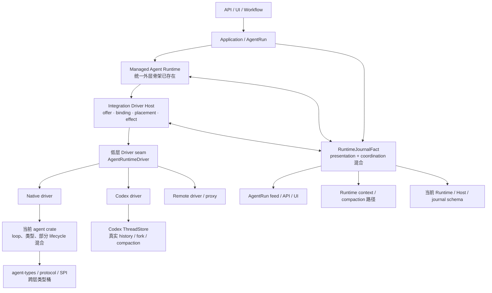
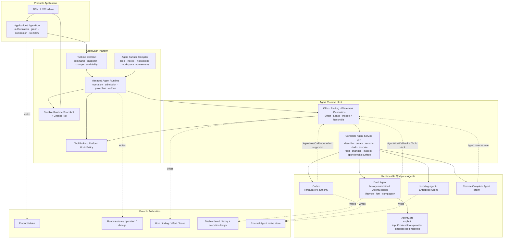
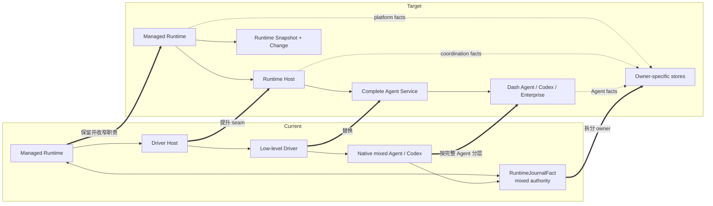
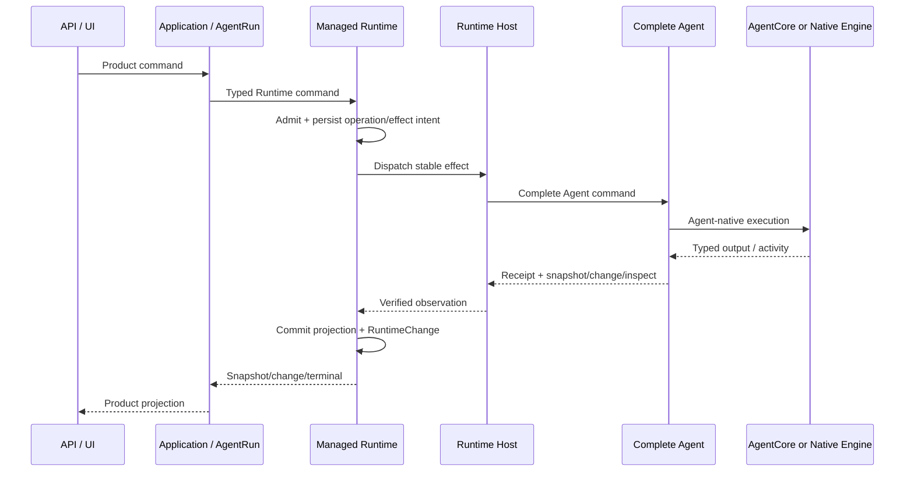
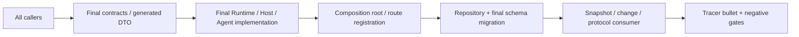
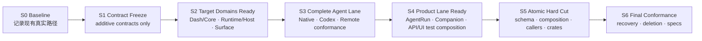
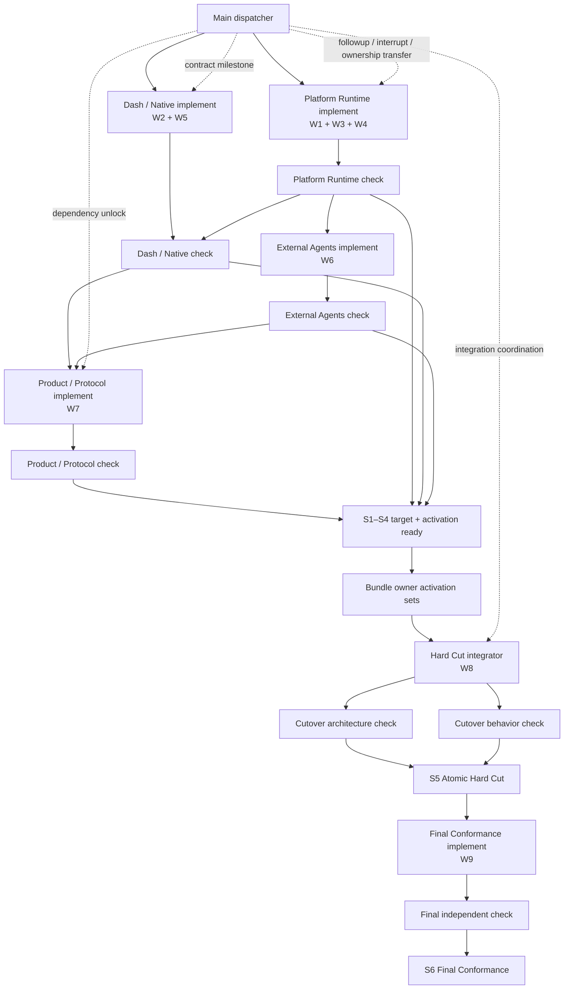
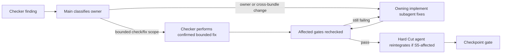

# Agent Runtime 架构全景与安全迁移边界

> 状态：已确认的规范性迁移设计。架构图、S0–S6 稳定边界、粗粒度内嵌 subagent
> 派发与返工路由已回填到 `prd.md`、`design.md`、`implement.md` 和 manifests。

本文的 **production path** 指当前分支在正常 composition、`pnpm dev` 和非隔离集成测试中
实际选择的默认业务路径，不表示项目已经上线。

## 1. 结论

目标设计不是替换 07-10 已建立的统一 Runtime，而是在它下方补齐“完整 Agent”边界，
并把当前混在 Runtime journal、driver、Agent crate 与 Application ports 中的事实交还给
唯一 owner。

安全完成该重构需要同时接受三个执行概念：

1. **W1–W9 workstream 是需求、依赖与验收分解。**
2. **Dispatch bundle 是粗粒度 subagent ownership 和发挥空间。**
3. **Stable checkpoint 是可以提交、交接并保证完整功能路径成立的集成单元。**

三者不能机械地一一对应。实现 bundles 可以先完成 W1–W7 target code 和 direct
conformance，但任何
会改变 production caller、crate identity、composition root、repository 或 protocol 的
部分，都必须等关联修改组成完整 cutover bundle 后，才能成为 stable checkpoint。

每个 stable checkpoint 都必须满足：

- production composition 只有一条真实执行路径；
- 同一 durable fact 只有一个写 owner；
- 当前激活路径的 caller、contract、implementation、repository 与 read projection 同时
  可用；
- 关键 tracer bullet 可端到端运行；
- 不依赖 compatibility facade、production dual registration、dual write/read 或
  fallback 维持中间状态。

## 2. 当前架构



当前分支已有的重要基础：

- Application → Managed Runtime → Host → Adapter 的统一外层；
- RuntimeOffer、Surface、Binding、Placement、Lease、Effect/Recovery 骨架；
- Codex 原生 thread fork/read/compaction；
- Native checkpoint/history fork primitive；
- typed Turn、stable effect identity、generation fence、snapshot/change/outbox 等机制。

当前结构性问题：

| 位置 | 当前状态 | 为什么不能作为终态 |
| --- | --- | --- |
| Host 下方 | Native/Codex/Remote 被压成低层 driver | Codex、Dash Agent 实际拥有完整 lifecycle/history |
| Native Agent | loop、类型和部分生命周期混合 | 无法得到纯 Core 与可替换完整 Agent 两层 |
| Runtime journal | presentation、coordination、fork/context 输入混用 | 多 owner 事实无法由一个 log 正确恢复 |
| Native 产品 fork | 可创建 child binding，但未接真实 history import | 产品 lineage 与 Agent history lineage 不一致 |
| Capability | 仍有低保真/默认能力遗留 | 无法证明 Tool、Hook、Fork 等语义是否真实支持 |
| Session 命名 | 平台 delivery/live/operation 状态仍使用 Session | 这些状态无法只由 history 重建 |
| Crates | types/protocol/executor/SPI/hooks 等职责重叠 | 依赖方向和替换边界仍不稳定 |

## 3. 目标架构



### 3.1 三层 Agent 关系

```text
平台层：Managed Runtime + Host
  统一管理 command、capability、surface、binding、effect、projection、recovery

完整 Agent 层：Dash Agent / Codex / pi-coding-agent / Enterprise Agent
  独立维护 Agent lifecycle、history、fork、context/compaction

AgentCore 层：仅存在于 Dash Agent 内部
  一次显式输入到显式输出的 provider/tool loop，无隐藏 durable state
```

Dash Agent internal transition/history kernel 只属于 Dash Agent，不是 Managed Runtime
的一部分，也不是 Codex、pi-coding-agent 或所有 Complete Agent 必须复制的内部状态机。

### 3.2 `Session` 的唯一合法边界

```text
AgentSessionState = fold(AgentHistory)
```

因此：

- input 通过写入 history 改变 Session；
- fork 是 history tree 分支；
- compaction 是带 provenance 的 history transform；
- resume 是从 history 恢复；
- operation、mailbox、surface、binding、credential、placement、lease、effect 和平台
  recovery 不属于 Session。

### 3.3 状态写 owner

| Fact | 唯一写 owner | Durable authority | 其它层如何使用 |
| --- | --- | --- | --- |
| AgentRun / Companion / Workflow / Frame | Application | Product tables | Runtime 只读取 typed product facts |
| Runtime operation / availability / normalized projection | Managed Runtime | Runtime tables + change/outbox | Application 通过 Runtime Contract 读取 |
| Offer / binding / placement / generation / effect | Host | Host ledger | Runtime admission/reconcile |
| Dash Agent history / fork / compaction | Dash Agent | Ordered Agent history | Complete Agent snapshot/change |
| Codex/Enterprise history | Concrete Agent | Agent-native store | adapter 读取并归一 |
| AgentCore loop | AgentCore invocation | 无 durable store | Dash Agent 写回 history |
| UI feed | Projection adapter | 可重建 read side | 只消费 committed Runtime change |

## 4. Current → Target 差异



| 维度 | Current | Target |
| --- | --- | --- |
| 统一外层 | 已存在 Managed Runtime | 保留，成为所有 Agent 的唯一平台外层 |
| Host seam | 低层 driver factory/driver | Complete Agent Service |
| Dash 自有 Agent | agent crate 混合 loop/类型/lifecycle | Dash Agent → AgentCore |
| Codex | 完整能力藏在 driver 后 | 直接作为 Complete Agent |
| Runtime state | journal-centric 混合事实 | operation/projection/change + owner-specific stores |
| Session | 被平台 delivery/live 等状态滥用 | 只用于 history-maintained Agent state |
| Fork | Codex 原生；Native 产品路径未接 history | platform saga + exact Agent-native fork |
| Compaction | Runtime/Dash 责任混合 | Complete Agent capability；Dash/Codex 各自拥有 |
| Tool/Hook | adapter/default capability 容易失真 | Surface requirement × Offer × Applied evidence |
| Reconnect | presentation journal 参与恢复 | Runtime snapshot revision + durable change tail |
| Crates | types/protocol/executor/SPI 职责重叠 | contract/runtime/host/agent/core/adapter 单向 DAG |

## 5. 必须持续成立的功能路径

重构是否安全不能只看局部 crate tests，必须持续证明一条真实纵向路径：



### 5.1 最小 tracer bullet

每个 stable checkpoint 至少证明：

1. 创建/恢复 AgentRun；
2. 提交一个普通 input；
3. Agent 产生 Turn/Item/output；
4. Runtime 提交 normalized snapshot/change；
5. Application/UI 能按 revision 读取结果；
6. restart/reconnect 后能从正确 authority 恢复。

以下能力在其 owner 被修改的 checkpoint 增加专项 tracer bullet：

- Fork：product saga → Runtime intent → Host effect → native fork → child activation；
- Companion：Full exact fork；其它模式 fresh create + initial context package + first input；
- Compaction：Dash exact history transform / Codex native mapping；
- Tool/Hook：AgentHostCallbacks 往返、deadline、effect correlation；
- Remote：sequence/ack/replay/generation fence；
- Cursor gap：snapshot reload，不从 presentation journal 重建。

## 6. 安全迁移的第一性原则

### 6.1 Stable checkpoint 的定义

Stable checkpoint 是满足以下条件的 commit/review boundary：

```text
caller
  -> public contract
  -> active implementation
  -> active repository/schema
  -> committed projection/change
  -> consumer
```

链上的任一环仍指向旧模型时，相关修改只是“target implementation ready”，不是 stable
checkpoint。

### 6.2 构建与激活分离

- **Build target lane**：实现新 contract、domain、adapter 与 projection，通过 direct
  construction、in-memory repository 和 conformance harness 验证。
- **Activate target lane**：切换 production composition、API route、repository/schema、
  generated contracts 与所有 callers。

target lane 在激活前不接收 production traffic，因此不会形成 production dual path。
hard cut 后旧 lane 同时失去 composition、caller 和 schema 访问，避免半切换。

### 6.3 Cutover unit

一次会改变 production path 的 cutover 必须同时覆盖：



这些修改可以由不同粗粒度 dispatch bundle 覆盖，但只有整个 cutover bundle 通过后才
形成稳定 checkpoint。这样无需用兼容 facade 或双写来跨越缺口。

### 6.4 Activation-ready change set

`activation_ready` 表示 owner 已经冻结 base revision、owned files、预期 diff、consumer
清单和验证命令。它可以保存在专用 cutover worktree/branch，或由原 owner 在 S5 窗口
重新应用；在进入 S5 之前不写入当前 stable branch 的 production composition。

该 change set 不是兼容实现，也不是第二条运行路径。发生 rebase/conflict 或 gate failure
时由原 owner 更新，W8 只重新集成和验证。

## 7. Stable checkpoint 序列



### S0 — Baseline

| 项目 | 要求 |
| --- | --- |
| Active production path | 当前 Runtime → Driver Host → Native/Codex driver |
| 固定证据 | 当前 fork 6/6、普通 input/output、Runtime feed/reconnect、关键 schema |
| 输出 | entrypoint/consumer inventory、baseline commands、已知能力矩阵 |
| 稳定边界 | 未改变任何 production owner 或 route |

### S1 — Contract Freeze（W1）

| 项目 | 要求 |
| --- | --- |
| 改动 | 新 Runtime Contract、Complete Agent Service API、profile、wire、conformance skeleton |
| Active production path | 仍为 current path |
| 激活范围 | 仅 dependency-light 类型和测试；不注册新 production service |
| 退出证据 | contract/codegen tests、dependency negative tests、baseline tracer bullet 继续通过 |

### S2 — Target Domains Ready（W2 + W3 + W4）

| 项目 | 要求 |
| --- | --- |
| 改动 | Dash Agent/Core、Runtime/Host target state、Surface/Tool/Hook target model |
| Active production path | 仍为 current path |
| 验证方式 | direct construction、in-memory repository、history replay/property、surface admission |
| 稳定边界 | target code 不写 production DB，不被 production composition 选择 |
| 物理 crate 注意 | W2 交付 target-domain code 与一份由 W2 拥有、已评审但尚未激活的 S5 crate/API activation patch |

W2 的完成需要区分两个状态：

- `target_ready`：Dash Agent/Core 目标代码和独立测试完成，current production path 仍成立；
- `activation_ready`：所有 Agent/Core physical move、public API cut 和 consumer impact
  已冻结为 Dash/Native bundle-owned change set，可由 S5 原样集成。

W8 对 W2 的依赖表示这两个 deliverable 都已 ready，并不把 Agent/Core 文件 ownership
移交给 W8，也不要求 activation patch 在 S2 提前进入 production path。

### S3 — Complete Agent Lane Ready（W5 + W6）

| 项目 | 要求 |
| --- | --- |
| 改动 | Native/Dash、Codex、Remote 实现 Complete Agent contract |
| Active production path | 仍为 current path |
| 验证方式 | test composition 直接装配 Host + target adapters，运行同一 conformance |
| 必须证明 | create/resume/fork/read/inspect、initial package、surface apply、callback、unknown outcome |
| 稳定边界 | adapter target implementation 尚未与旧 driver 同时注册为 production route |

### S4 — Product Lane Ready（W7）

| 项目 | 要求 |
| --- | --- |
| 改动 | AgentRun、Fork saga、Companion、API/App Server/UI target projection |
| Active production path | 仍为 current path |
| 验证方式 | isolated cutover composition + target repositories + contract fixture 或写入临时目录的 test-only generated output |
| 必须证明 | direct/fork/Companion/reconnect E2E，snapshot/change ordering，cursor gap |
| 稳定边界 | production API route、UI source 与仓库 canonical generated artifacts 均尚未切换，旧 journal 也尚未删除 |

S4 的 generated output 不能覆盖仓库唯一 canonical artifacts。S4 只验证相同 schema 输入
可以产生 target DTO，并把生成 diff 作为 S5 输入；canonical Rust/TypeScript artifacts
只在 S5 与 production callers 一次切换。

### S5 — Atomic Hard Cut（W8 integration checkpoint）

S5 不是单一 crate 的局部修改，而是由 Platform Runtime、Dash/Native、External Agents、
Product/Protocol 与 Hard Cut 五个 bundle 共同形成的唯一 production cutover。

Hard Cut 的 integration ownership 不覆盖其它 bundle：legacy/final contract、Runtime/
Host/Surface 由 Platform Runtime bundle 负责；Agent/Core/Native 由 Dash/Native 负责；
Codex/Remote 由 External Agents 负责；Product/API/UI 由 Product/Protocol 负责。Hard Cut
负责 final migration、workspace/composition、deletion gate 和 bundle 集成；若 gate
暴露生产实现缺口，修改返回对应粗粒度 bundle owner。

| 同一 bundle 内完成 | 原因 |
| --- | --- |
| final forward migration + repository implementation | 代码与 schema 必须读取同一模型 |
| Platform Runtime-owned final contract/wire activation + legacy cleanup | 防止新旧 contract 同时残留或由 Hard Cut agent 越权修改 |
| Dash/Native-owned Agent/Core physical crate/API activation + all consumer switches | Agent/Core 与 Native consumers 同 bundle 切换，避免断开的 imports |
| production composition / service registry 切换 | 保证只有 Complete Agent route 被选择 |
| Application/API/UI caller 与 canonical generated contract 切换 | 消费者不能继续读取旧 projection，S4 test output 不成为第二套 DTO |
| RuntimeJournalFact/legacy ports/crates 删除 | consumer 为零后立即消除第二事实链 |
| direct + fork + reconnect + callback tracer bullets | 证明切换的是完整路径而非局部编译 |
| negative searches / cargo metadata / migration guard | 证明旧 production path 已不存在 |

S5 的稳定结果只有一种：所有 production callers 指向 final Runtime/Host/Complete Agent
路径。未通过任一 gate 的 worktree 不形成 checkpoint，也不通过兼容层维持“半完成”状态。

### S6 — Final Conformance（W9）

| 项目 | 要求 |
| --- | --- |
| Active production path | final path only |
| 验证 | crash/restart/duplicate/stale generation/cursor gap/unknown outcome/PostgreSQL |
| 删除证明 | old crate/path/type/table/field 无生产引用 |
| 文档 | specs 与最终实现一致，只记录最终 owner 和选择理由 |
| 稳定边界 | Final Conformance 对边界清晰的小缺口经 main 确认后自修；跨 bundle 或改变核心语义的缺口回到 owning bundle |

## 8. Work package 与稳定边界

下表继续保留 W1–W9 作为 requirement/acceptance coverage；实际 subagent 派发按 §12 的
粗粒度 bundles，不要求逐行创建 agent。

| Work | 文件/职责 owner | 局部完成证据 | 可以独立形成 checkpoint 吗 | Production activation |
| --- | --- | --- | --- | --- |
| W1 | contracts/wire/test skeleton | contract、codegen、dependency tests | additive 部分可形成 S1 | final activation/legacy cleanup patch 在 S5 |
| W2 | Dash Agent / AgentCore files | replay、fork、compaction、Core purity | target-ready 部分可形成 S2 | Dash/Native-owned crate/API activation set 在 S5 |
| W3 | Runtime/Host target state | in-memory behavior、effect/recovery | target model 可独立验证 | final repository/schema 在 S5 |
| W4 | Surface/Tool/Hook | admission、applied evidence、unique route | 可直接验证 | production binding 在 S5 |
| W5 | Native/Dash adapter | Complete Agent + real fork conformance | test composition checkpoint | production registry 在 S5 |
| W6 | Codex/Remote adapters | native mapping、snapshot/inspect/wire | test composition checkpoint | production registry 在 S5 |
| W7 | Product/protocol target lane | AgentRun/Companion/API/UI E2E | isolated composition checkpoint | caller/route switch 在 S5 |
| W8 | migration/Cargo/composition/deletion | full cutover bundle | 是，S5 核心 | S5 |
| W9 | fault/conformance/spec | full matrix + negative gates | 是，S6 | final path only |

## 9. 关键能力的连续性矩阵

| 能力 | S0–S4 保持的 current evidence | S5 必须出现的 target evidence | 路径断裂判定 |
| --- | --- | --- | --- |
| 普通 input/output | 当前 Native/Codex tracer bullet | Complete Agent command→RuntimeChange E2E | caller 成功但无 authoritative terminal/change |
| Fork | 当前 6/6 + Codex native fork | durable saga + Native history fork + Codex thread/fork | child 只有 product/binding、没有可恢复 Agent lineage |
| Companion | 当前 dispatch 行为记录 | Full exact fork；其余 initial package + first input | 用 prompt 冒充 fork/package 或 child 无稳定 mapping |
| Compaction | 当前 Dash/Codex 行为测试 | Dash history transform + Codex native activity projection | Runtime 复制外部 Agent context authority |
| Tool/Hook | 当前 broker/hook tests | Bound route + Applied evidence + AgentHostCallbacks | 同一 contribution 被双执行或 required capability 假成功 |
| Reconnect | 当前 feed/reconnect tests | Runtime snapshot revision + durable change tail | 需要 replay presentation journal 才能恢复 |
| Recovery | 当前 effect/retry tests | stable identity + inspect/reconcile + generation fence | unknown outcome 创建第二 effect/child |

## 10. S5 前的强制 Gate

### Contract/consumer gate

- Runtime Contract、Agent Service API 与 generated DTO 已冻结；
- 所有 production callers 的 target 修改都在 cutover bundle；
- target adapters 已通过同一 conformance harness；
- Application 不依赖具体 Agent/Host/service implementation。

### Persistence gate

- final schema、constraints、repository 与 composition 属于同一 bundle；
- W2/W3 只提供 schema contract/in-memory behavior，W8 是唯一正式 migration owner；
- PostgreSQL 与 in-memory behavior suite 使用同一最终语义；
- DashAgentCommit、Runtime operation/change、Host effect 各自在自己的 transaction 内闭环。

### Functional gate

- direct input/output；
- Native/Codex fork；
- Companion 两类创建方式；
- Dash/Codex compaction；
- Tool/Hook callback；
- snapshot/change reconnect；
- crash/unknown-outcome recovery。

### Deletion gate

- old consumer inventory 为零；
- old production route 无 composition registration；
- old repository/table/field 无生产读写；
- old crates/traits/DTO 无生产引用；
- 删除后重新运行 tracer bullets，而不是只运行 negative search。

## 11. 已确认的核心执行约束

以下规则是最终实施约束：

> Workstream 不等于 subagent，也不等于 stable checkpoint。粗粒度 implementation
> bundles 覆盖并验证 W1–W7 target lane；所有会改变 production path 的 caller、
> contract、crate identity、composition、repository/schema、projection 和 deletion，
> 由各 bundle owner 提供已评审 activation set，并在 S5 集成激活。

这样可以同时满足：

- 不引入兼容层、fallback 或 production 双路径；
- target 实现可以在切换前被完整验证；
- 每个可交接 checkpoint 都保持实际功能路径成立；
- crate/schema/protocol 不会出现“先删 owner，后补 consumer”的断裂窗口。

## 12. Multi-agent 派发流程

### 12.1 角色

| Role | Responsibility | Write authority |
| --- | --- | --- |
| Main dispatcher | 冻结父合同、解锁依赖、分配 ownership、维护 dispatch ledger、集成 checkpoint、向用户升级决策 | task artifacts、integration coordination、最终提交 |
| Implement subagent | 完成一个粗粒度纵向 bundle，可在 bundle 内调整内部拆分和文件范围 | brief 中的 ownership zone 与经 main 授权的共享热点 |
| Check subagent | 独立检查整个 bundle 的完整 data flow、依赖方向与稳定边界；经 main 确认后自修边界清晰的问题并复跑 affected gates | brief 授权的 check/fix scope；跨 bundle 或核心语义变更需重新分配 ownership |
| Hard Cut integrator | 在 S5 staging worktree 集成各粗粒度 bundle activation sets | W8-owned migration、workspace/composition、deletion files |
| W9 conformance owner | 增加 fault/conformance tests 与最终 specs | W9-owned tests/specs |
| User | 产品语义、风险边界与最终开始/收敛批准 | 不处理仓库可回答的实现事实 |

主会话始终保留 dispatcher 身份，不领取大块生产代码。这样能够持续观察跨包依赖、阻止
越权修改，并在 checker 发现跨 owner 缺口时把问题路由回真正 owner。

### 12.2 内嵌 subagent 组织

派发只使用当前会话内嵌的协作工具：

| Operation | Tool |
| --- | --- |
| 创建 bounded implement/check agent | `spawn_agent` |
| 复用已有 agent 处理返工或 activation patch | `followup_task` |
| 向运行中的 agent 补充低优先级约束 | `send_message` |
| 等待任一 agent mailbox/final result | `wait_agent` |
| 方向错误时立即停止当前 turn | `interrupt_agent` |
| 检查 slot、running/completed/errored 状态 | `list_agents` |

不创建 Trellis channel、外部 worker process 或 channel event log。每个 subagent 使用稳定
task name：

```text
main
platform_runtime_impl / platform_runtime_check
dash_native_impl / dash_native_check
external_agents_impl / external_agents_check
product_protocol_impl / product_protocol_check
hard_cut_impl / cutover_architecture_check / cutover_behavior_check
final_conformance_impl / final_conformance_check
```

Implement 使用内嵌 `trellis-implement` agent type，check 使用独立的
`trellis-check` agent type。Main 直接读取 subagent final/mailbox result，并把 checkpoint
状态和 handoff 摘要写入 task-local `dispatch-status.md`；该文件是实施期协调记录，不是
新的业务事实源。

当前并发预算按 **1 个 main + 最多 3 个 subagent** 安排。Subagent 结束或进入不再需要
上下文的阶段后释放 slot；同一时间不为等待依赖的包占用 active slot。

所有内嵌 subagent 共享文件系统。Main 的每份 brief 写明粗粒度 ownership zone，并要求：

- 不回退或覆盖其它会话/agent 已有修改；
- bundle 内可自行重排模块、补齐调用方、测试和必要 supporting files；
- 发现 bundle 外依赖时向 main 申请临时 ownership transfer，避免两个 agent 同时编辑；
- 除非 main 明确授权，不再向下派生子 agent。

只对以下共享热点设置严格串行 ownership：

- workspace `Cargo.toml` / lockfile；
- 正式 database migrations；
- production composition roots / service registry；
- canonical generated Rust/TypeScript contracts；
- 跨 bundle 公共 contract 的 breaking change；
- legacy crate/path 的最终删除。

其它文件以完整纵向结果为目标，不预先把边界切到函数或单文件粒度。

### 12.3 Context injection

Implement subagent 至少接收：

- 父 `prd.md`、`design.md`、`implement.md`；
- 本文确认后形成的 stable-boundary 规范；
- bundle 覆盖的全部 `workstreams/<id>/prd.md`；
- 根 manifest 与 bundle 内各工作包 `implement.jsonl` 的并集；
- ownership zone、共享热点当前 owner、base revision 与前置 checkpoint；
- 当前已经通过的 baseline/tracer-bullet 命令。

Check subagent 至少接收：

- 同一父 artifacts 与 stable-boundary 规范；
- 根 manifest 与 bundle 内各工作包 `check.jsonl` 的并集；
- implement subagent 的 handoff；
- bundle diff scope 与实际触碰的共享热点；
- 已运行命令和未运行命令；
- 当前 checkpoint 必须保持的 production tracer bullet。

Implement 与 check 使用不同 subagent/session，以保持判断独立。Checker 发现问题后先
报告 owner、影响路径、复现证据与所需 gate；main 确认范围后，checker 可以直接修复
局部、确定且不改变跨 bundle 合同/状态权威的问题，并复跑 affected gates。需要补齐大块
实现、改变公共合同或跨越 ownership zone 的 finding 仍路由到 owning bundle。

### 12.4 派发图



### 12.5 Wave schedule

#### Wave 0 — Start 与 baseline

Main 在用户批准实施后：

1. 运行 `task.py start`；
2. 冻结父 artifacts 与 manifests；
3. 初始化 task-local `dispatch-status.md`；
4. 通过 `list_agents` 确认 slot，并记录可复用 subagent；
5. 记录 base revision、工作区已有修改和 ownership inventory；
6. 运行 S0 baseline tracer bullets；
7. baseline 未通过时先定位既有失败，不派发依赖这些路径的重构。

#### Wave 1 — Foundation bundles

- Slot A：`platform_runtime_impl`，覆盖 W1 + W3 + W4；
- Slot B：`dash_native_impl`，覆盖 W2 + W5；
- Slot C：按实际进展用于独立 checker，不固定给第三个 implement bundle。

`platform_runtime_impl` 可以自行决定 contracts、Runtime/Host、Surface/Tool/Hook 的内部
实现顺序，但需在 Complete Agent contract 达到可消费 milestone 时主动通知 main。Main
把 milestone 和变更摘要发给 `dash_native_impl`，后者无需等待整个 Platform bundle 完成
才继续 Native service 接入。

Slot C 可在该 milestone 启动 `platform_runtime_check`，先独立核验 additive contract
slice 并形成 S1；Platform bundle 全部完成后再用 `followup_task` 让同一 checker 终核
W1/W3/W4 的完整纵向路径。这样保留 contract gate，但不增加新的细粒度 agent 边界。

`dash_native_impl` 同时拥有 Dash Agent/Core 与 Native adapter，能够在一个纵向 bundle
内处理 crate API、真实 fork、compaction 和 adapter consumer，避免 W2/W5 之间的人为
handoff。

任一 bundle 完成后释放其 implement slot，再派独立 `platform_runtime_check` 或
`dash_native_check`。Checker 按整个 bundle 验证，不要求每个内部 work package 单独产生
一份交接。

Dash/Native 可以在 Platform contract milestone 后提前开发，但其最终
`dash_native_check` 与 `activation_ready` 必须基于 `platform_runtime_check` 已固定的
Platform revision。若 Platform 终核后仍有 contract/Host/Surface 变更，Main 先向
Dash/Native 发 `followup_task` 完成 affected update，再执行最终 check。

#### Wave 2 — External Agents 与 bundle checks

- Platform Runtime contract/check 通过后，空闲 slot 启动 `external_agents_impl`（W6）；
- Dash/Native 可继续实现或进入独立 check；
- External Agents 同时处理 Codex 与 Remote，因为二者共享 Complete Agent conformance、
  source authority/fidelity 和 wire 边界；
- `external_agents_check` 通过后，Platform、Dash/Native、External 三个 bundle 都达到
  target-ready。

W1–W6 的 workstream checklist 仍逐项验收，但不会为了对应编号强制切换 subagent。

#### Wave 3 — Product / Protocol bundle

- 启动 `product_protocol_impl`，覆盖 W7 的 AgentRun、Fork saga、Companion、API、
  App Server 和 UI；
- 该 agent 可沿完整产品 data flow 自行调整模块粒度，不把 backend/frontend 再拆成多个
  互相等待的小 agent；
- 完成后由独立 `product_protocol_check` 检查 direct/fork/Companion/reconnect E2E；
- 另一个空闲 slot 可做只读 cutover-readiness audit，核对 consumer inventory、schema
  diff、canonical generated contract diff 和所有 bundle activation checklist；
- checks 通过后形成 S4，并冻结 S5 base revision。

#### Wave 4 — Activation-ready freeze

- Main 收齐 Platform Runtime、Dash/Native、External Agents 与 Product/Protocol 的
  handoff，确认每份 activation set 都基于同一冻结 revision；
- 对 contract/schema/generated output、composition、Cargo/lockfile 与 legacy deletion
  建立共享热点 inventory，逐项指定 S5 owner 和集成顺序；
- affected bundle checker 签认 activation set；局部确定问题可经 main 确认后自修，跨
  bundle 或领域实现缺口路由回原 owner；
- 本 wave 只冻结和验证 cutover 输入，不改变 production composition 或默认 caller。

#### Wave 5 — S5 staging integration

S5 使用专用 cutover staging worktree/branch，内嵌 subagent 在 brief 指定的同一 staging
workdir 内按 ownership 工作，避免尚未通过 gate 的中间提交改变当前 stable branch。

1. Main 冻结 base revision，以及 Platform Runtime、Dash/Native、External Agents、
   Product/Protocol 四个 bundle 的 activation set；
2. 复用原 implement subagent，最多三路并行完成或刷新 activation change set；
3. `hard_cut_impl` 只集成 bundle change sets，并实现 W8-owned migration、
   workspace/composition/deletion；
4. 集成中若某个 owner 文件冲突或 gate 失败，main 使用 `followup_task` 把精确问题发回
   原 implement subagent；
5. bundle owner 修正并由对应 checker 复核后，Hard Cut agent 重新集成；
6. integrator 结束后，并行派
   `cutover_architecture_check` 与 `cutover_behavior_check`：前者检查 ownership、依赖、
   schema/deletion，后者检查真实 tracer bullets、recovery 与 protocol；
7. 两个 checks 和 full S5 gates 都通过后，main 才把 staging tip 作为一个 stable
   checkpoint 接入父任务
   branch。

S5 staging 内部可以有便于 review 的 owner commits，但这些中间 commits 不单独成为对外
稳定边界；stable branch 只接收完整通过的 S5 tip。

#### Wave 6 — Final Conformance

- `final_conformance_impl` 覆盖 W9，增加 fault/conformance tests 并同步最终 specs；
- `final_conformance_check` 从父 AC、negative gates、PostgreSQL、Rust、frontend 与真实
  tracer bullets 做独立终核；
- Final Conformance checker 可经 main 确认后自修局部、确定的问题；跨 bundle、公共合同
  或状态权威缺口由 main 路由回 owner；
- owner 修复后重新经过 owning check 与 W9 affected gates；
- 全部通过后形成 S6，main 执行 finish-work、提交与最终汇报。

### 12.6 Handoff contract

每个 implement subagent 的 final handoff 必须包含：

```text
Bundle:
Covered workstreams:
Base revision:
Ownership zone:
Shared hotspots touched:
Files/modules changed:
Boundary changed:
Target-ready evidence:
Activation-ready change set:
Production route changed: yes/no
Migration/schema impact:
Behavior/conformance tests:
Current tracer bullet:
Commands run / not run:
Remaining dependency:
Known findings:
```

Checker 输出：

```text
Result: pass / fixed-and-pass / needs-owner-fix
Finding owner:
Broken invariant or path:
Evidence:
Required fix:
Self-fix scope:
Affected checkpoint:
Commands verified:
```

没有 `Activation-ready change set` 的 bundle 不能进入 S5 readiness；没有 independent
check 的 change set 不能被 Hard Cut integration 接收。

### 12.7 Finding 与返工路由



路由规则：

- contract/Runtime/Host/Surface/Tool/Hook（W1/W3/W4）→ Platform Runtime bundle；
- Dash Agent/Core/Native adapter（W2/W5）→ Dash/Native bundle；
- Codex/Remote（W6）→ External Agents bundle；
- AgentRun/Companion/API/UI（W7）→ Product/Protocol bundle；
- migration/workspace/composition/deletion（W8）→ Hard Cut bundle；
- fault harness/spec consistency（W9）→ Final Conformance bundle。

局部、确定且不改变公共合同/状态权威的 finding，经 main 确认 scope 后由 checker 自修。
跨 bundle finding 由 main 拆成少量明确 fix brief，按依赖顺序派发；Hard Cut agent 不以
集成身份越过其它 bundle 的核心 ownership。若两个 bundle 共同变更能显著降低往返，
main 可以显式把共享热点临时转交给 checker 或其中一个 implement agent，完成并复核后
再释放 ownership。
