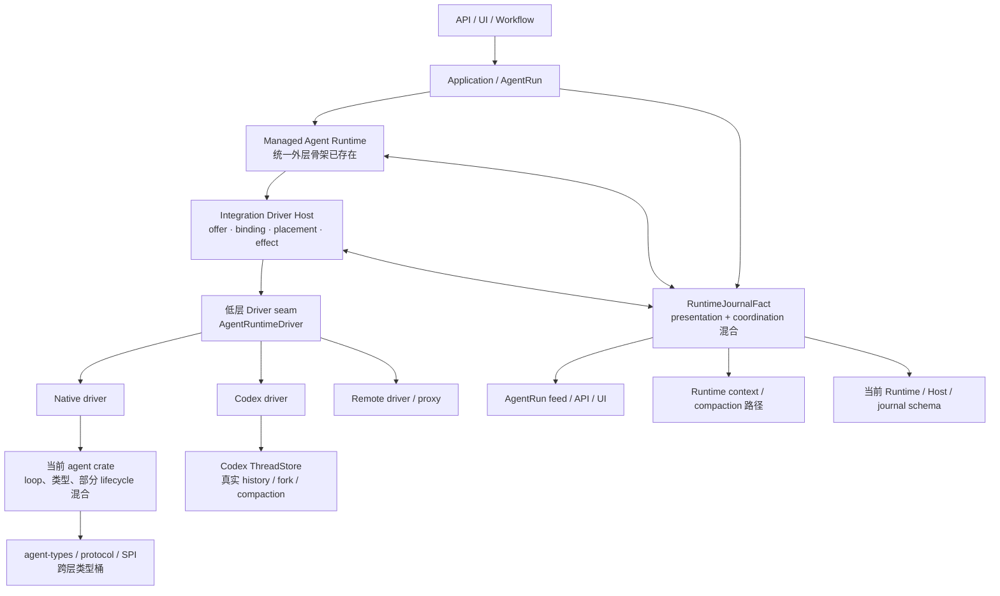
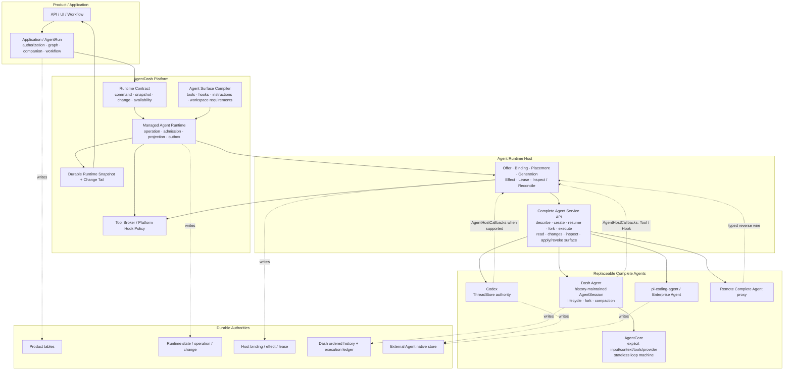
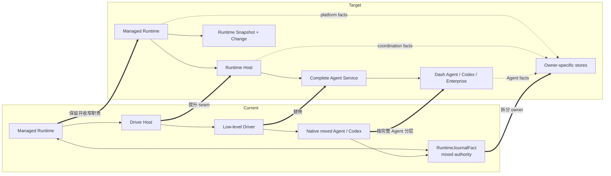
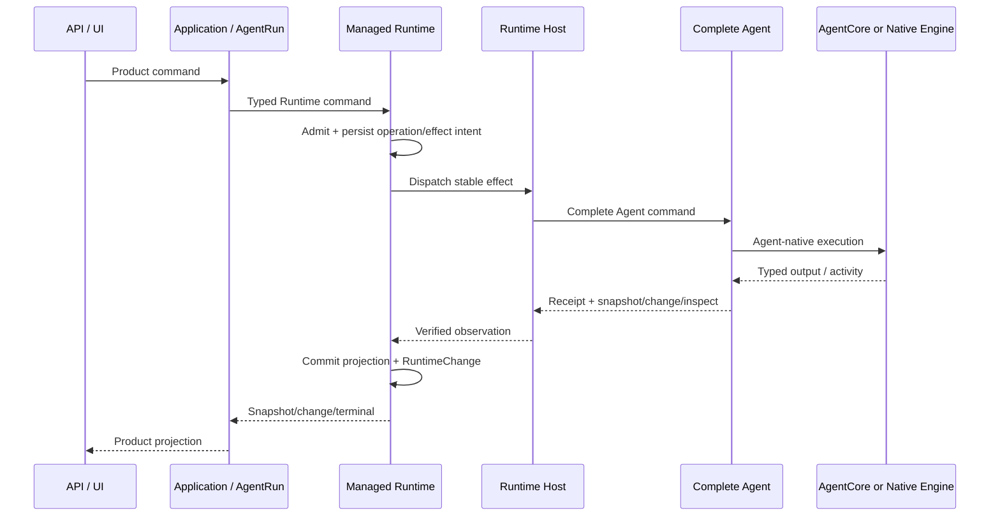
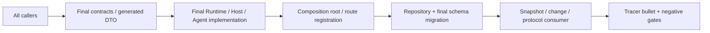
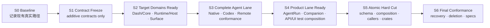
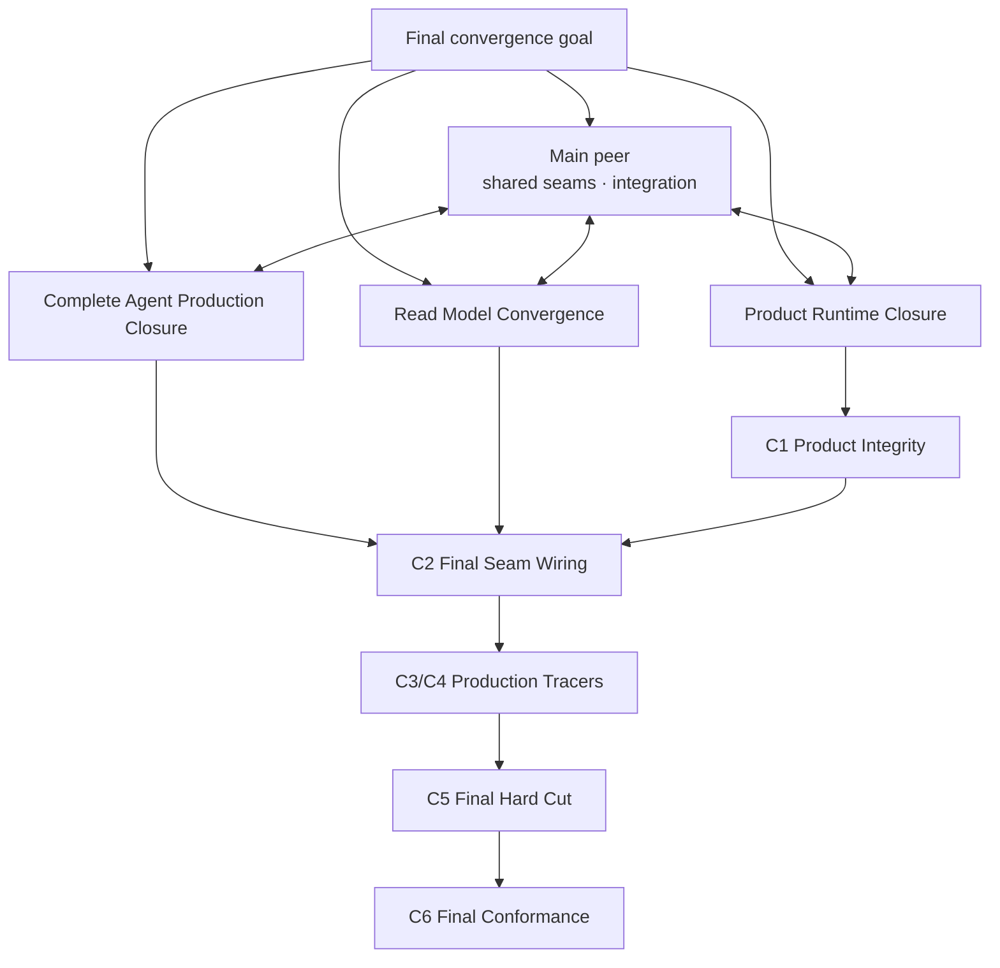

# Agent Runtime 架构全景与安全迁移边界

> 状态：已确认的规范性迁移设计。架构图、S0–S6 稳定边界、粗粒度内嵌 subagent
> 派发与返工路由已回填到 `prd.md`、`design.md`、`implement.md` 和 manifests。

本文的 **production path** 指当前分支在正常 composition、`pnpm dev` 和非隔离集成测试中
实际选择的默认业务路径，不表示项目已经上线。

## 1. 结论

目标设计不是替换 07-10 已建立的统一 Runtime，而是在它下方补齐“完整 Agent”边界，
并把当前混在 Runtime journal、driver、Agent crate 与 Application ports 中的事实交还给
唯一 owner。

安全完成该重构需要同时接受三个执行概念：

1. **W1–W9 workstream 是需求、依赖与验收分解。**
2. **Dispatch bundle 是粗粒度 subagent ownership 和发挥空间。**
3. **Stable checkpoint 是可以提交、交接并保证完整功能路径成立的集成单元。**

三者不能机械地一一对应。实现 bundles 可以先完成 W1–W7 target code 和 direct
conformance，但任何
会改变 production caller、crate identity、composition root、repository 或 protocol 的
部分，都必须等关联修改组成完整 cutover bundle 后，才能成为 stable checkpoint。

每个 stable checkpoint 都必须满足：

- production composition 只有一条真实执行路径；
- 同一 durable fact 只有一个写 owner；
- 当前激活路径的 caller、contract、implementation、repository 与 read projection 同时
  可用；
- 关键 tracer bullet 可端到端运行；
- 不依赖 compatibility facade、production dual registration、dual write/read 或
  fallback 维持中间状态。

## 2. 当前架构



当前分支已有的重要基础：

- Application → Managed Runtime → Host → Adapter 的统一外层；
- RuntimeOffer、Surface、Binding、Placement、Lease、Effect/Recovery 骨架；
- Codex 原生 thread fork/read/compaction；
- Native checkpoint/history fork primitive；
- typed Turn、stable effect identity、generation fence、snapshot/change/outbox 等机制。

当前结构性问题：

| 位置 | 当前状态 | 为什么不能作为终态 |
| --- | --- | --- |
| Host 下方 | Native/Codex/Remote 被压成低层 driver | Codex、Dash Agent 实际拥有完整 lifecycle/history |
| Native Agent | loop、类型和部分生命周期混合 | 无法得到纯 Core 与可替换完整 Agent 两层 |
| Runtime journal | presentation、coordination、fork/context 输入混用 | 多 owner 事实无法由一个 log 正确恢复 |
| Native 产品 fork | 可创建 child binding，但未接真实 history import | 产品 lineage 与 Agent history lineage 不一致 |
| Capability | 仍有低保真/默认能力遗留 | 无法证明 Tool、Hook、Fork 等语义是否真实支持 |
| Session 命名 | 平台 delivery/live/operation 状态仍使用 Session | 这些状态无法只由 history 重建 |
| Crates | types/protocol/executor/SPI/hooks 等职责重叠 | 依赖方向和替换边界仍不稳定 |

## 3. 目标架构



### 3.1 三层 Agent 关系

```text
平台层：Managed Runtime + Host
  统一管理 command、capability、surface、binding、effect、projection、recovery

完整 Agent 层：Dash Agent / Codex / pi-coding-agent / Enterprise Agent
  独立维护 Agent lifecycle、history、fork、context/compaction

AgentCore 层：仅存在于 Dash Agent 内部
  一次显式输入到显式输出的 provider/tool loop，无隐藏 durable state
```

Dash Agent internal transition/history kernel 只属于 Dash Agent，不是 Managed Runtime
的一部分，也不是 Codex、pi-coding-agent 或所有 Complete Agent 必须复制的内部状态机。

### 3.2 `Session` 的唯一合法边界

```text
AgentSessionState = fold(AgentHistory)
```

因此：

- input 通过写入 history 改变 Session；
- fork 是 history tree 分支；
- compaction 是带 provenance 的 history transform；
- resume 是从 history 恢复；
- operation、mailbox、surface、binding、credential、placement、lease、effect 和平台
  recovery 不属于 Session。

### 3.3 状态写 owner

| Fact | 唯一写 owner | Durable authority | 其它层如何使用 |
| --- | --- | --- | --- |
| AgentRun / Companion / Workflow / Frame | Application | Product tables | Runtime 只读取 typed product facts |
| Runtime operation / availability / normalized projection | Managed Runtime | Runtime tables + change/outbox | Application 通过 Runtime Contract 读取 |
| Offer / binding / placement / generation / effect | Host | Host ledger | Runtime admission/reconcile |
| Dash Agent history / fork / compaction | Dash Agent | Ordered Agent history | Complete Agent snapshot/change |
| Codex/Enterprise history | Concrete Agent | Agent-native store | adapter 读取并归一 |
| AgentCore loop | AgentCore invocation | 无 durable store | Dash Agent 写回 history |
| UI feed | Projection adapter | 可重建 read side | 只消费 committed Runtime change |

## 4. Current → Target 差异



| 维度 | Current | Target |
| --- | --- | --- |
| 统一外层 | 已存在 Managed Runtime | 保留，成为所有 Agent 的唯一平台外层 |
| Host seam | 低层 driver factory/driver | Complete Agent Service |
| Dash 自有 Agent | agent crate 混合 loop/类型/lifecycle | Dash Agent → AgentCore |
| Codex | 完整能力藏在 driver 后 | 直接作为 Complete Agent |
| Runtime state | journal-centric 混合事实 | operation/projection/change + owner-specific stores |
| Session | 被平台 delivery/live 等状态滥用 | 只用于 history-maintained Agent state |
| Fork | Codex 原生；Native 产品路径未接 history | platform saga + exact Agent-native fork |
| Compaction | Runtime/Dash 责任混合 | Complete Agent capability；Dash/Codex 各自拥有 |
| Tool/Hook | adapter/default capability 容易失真 | Surface requirement × Offer × Applied evidence |
| Reconnect | presentation journal 参与恢复 | Runtime snapshot revision + durable change tail |
| Crates | types/protocol/executor/SPI 职责重叠 | contract/runtime/host/agent/core/adapter 单向 DAG |

## 5. 必须持续成立的功能路径

重构是否安全不能只看局部 crate tests，必须持续证明一条真实纵向路径：



### 5.1 最小 tracer bullet

每个 stable checkpoint 至少证明：

1. 创建/恢复 AgentRun；
2. 提交一个普通 input；
3. Agent 产生 Turn/Item/output；
4. Runtime 提交 normalized snapshot/change；
5. Application/UI 能按 revision 读取结果；
6. restart/reconnect 后能从正确 authority 恢复。

以下能力在其 owner 被修改的 checkpoint 增加专项 tracer bullet：

- Fork：product saga → Runtime intent → Host effect → native fork → child activation；
- Companion：Full exact fork；其它模式 fresh create + initial context package + first input；
- Compaction：Dash exact history transform / Codex native mapping；
- Tool/Hook：AgentHostCallbacks 往返、deadline、effect correlation；
- Remote：sequence/ack/replay/generation fence；
- Cursor gap：snapshot reload，不从 presentation journal 重建。

## 6. 安全迁移的第一性原则

### 6.1 Stable checkpoint 的定义

Stable checkpoint 是满足以下条件的 commit/review boundary：

```text
caller
  -> public contract
  -> active implementation
  -> active repository/schema
  -> committed projection/change
  -> consumer
```

链上的任一环仍指向旧模型时，相关修改只是“target implementation ready”，不是 stable
checkpoint。

### 6.2 构建与激活分离

- **Build target lane**：实现新 contract、domain、adapter 与 projection，通过 direct
  construction、in-memory repository 和 conformance harness 验证。
- **Activate target lane**：切换 production composition、API route、repository/schema、
  generated contracts 与所有 callers。

target lane 在激活前不接收 production traffic，因此不会形成 production dual path。
hard cut 后旧 lane 同时失去 composition、caller 和 schema 访问，避免半切换。

### 6.3 Cutover unit

一次会改变 production path 的 cutover 必须同时覆盖：



这些修改可以由不同粗粒度 dispatch bundle 覆盖，但只有整个 cutover bundle 通过后才
形成稳定 checkpoint。这样无需用兼容 facade 或双写来跨越缺口。

### 6.4 Activation-ready change set

`activation_ready` 表示 owner 已经冻结 base revision、owned files、预期 diff、consumer
清单和验证命令。所有实现直接在当前任务目录和分支共享工作；通过 ownership 协调避免
同时编辑同一热点，并在功能路径闭合后及时形成 checkpoint。

该 change set 不是兼容实现，也不是第二条运行路径。发生 rebase/conflict 或 gate failure
时由原 owner 更新，W8 只重新集成和验证。

## 7. Stable checkpoint 序列



### S0 — Baseline

| 项目 | 要求 |
| --- | --- |
| Active production path | 当前 Runtime → Driver Host → Native/Codex driver |
| 固定证据 | 当前 fork 6/6、普通 input/output、Runtime feed/reconnect、关键 schema |
| 输出 | entrypoint/consumer inventory、baseline commands、已知能力矩阵 |
| 稳定边界 | 未改变任何 production owner 或 route |

### S1 — Contract Freeze（W1）

| 项目 | 要求 |
| --- | --- |
| 改动 | 新 Runtime Contract、Complete Agent Service API、profile、wire、conformance skeleton |
| Active production path | 仍为 current path |
| 激活范围 | 仅 dependency-light 类型和测试；不注册新 production service |
| 退出证据 | contract/codegen tests、dependency negative tests、baseline tracer bullet 继续通过 |

### S2 — Target Domains Ready（W2 + W3 + W4）

| 项目 | 要求 |
| --- | --- |
| 改动 | Dash Agent/Core、Runtime/Host target state、Surface/Tool/Hook target model |
| Active production path | 仍为 current path |
| 验证方式 | direct construction、in-memory repository、history replay/property、surface admission |
| 稳定边界 | target code 不写 production DB，不被 production composition 选择 |
| 物理 crate 注意 | W2 交付 target-domain code、W2-owned physical/API activation component，以及冻结的跨 owner consumer/deletion manifest |

W2 的完成需要区分两个状态：

- `target_ready`：Dash Agent/Core 目标代码和独立测试完成，current production path 仍成立；
- `activation_component_ready`：Agent/Core physical move、public API cut、真实 Core
  consumers 和所有其余 consumer 的最终 owner/deletion 要求已冻结；该 component 不用
  临时 Application → Core 依赖维持独立可构建；
- `activation_ready`：Wave 4 将 W2 component 与 W7 target caller、W8 legacy deletion
  component 基于同一冻结 revision 组成不可拆分集合，并由对应 checkers 共同签认。

S2 退出要求 `target_ready + activation_component_ready`。W8 对 W2 的依赖不把
Agent/Core 文件 ownership 移交给 W8，也不要求完整 combined activation set 在 W7
之前伪装成可独立激活；完整 `activation_ready` 是 Wave 4 进入 S5 的 gate。

### S3 — Complete Agent Lane Ready（W5 + W6）

| 项目 | 要求 |
| --- | --- |
| 改动 | Native/Dash、Codex、Remote 实现 Complete Agent contract |
| Active production path | 仍为 current path |
| 验证方式 | test composition 直接装配 Host + target adapters，运行同一 conformance |
| 必须证明 | create/resume/fork/read/inspect、initial package、surface apply、callback、unknown outcome |
| 稳定边界 | adapter target implementation 尚未与旧 driver 同时注册为 production route |

### S4 — Product Lane Ready（W7）

| 项目 | 要求 |
| --- | --- |
| 改动 | AgentRun、Fork saga、Companion、API/App Server/UI target projection |
| Active production path | 仍为 current path |
| 验证方式 | isolated cutover composition + target repositories + contract fixture 或写入临时目录的 test-only generated output |
| 必须证明 | direct/fork/Companion/reconnect E2E，snapshot/change ordering，cursor gap |
| 稳定边界 | production API route、UI source 与仓库 canonical generated artifacts 均尚未切换，旧 journal 也尚未删除 |

S4 的 generated output 不能覆盖仓库唯一 canonical artifacts。S4 只验证相同 schema 输入
可以产生 target DTO，并把生成 diff 作为 S5 输入；canonical Rust/TypeScript artifacts
只在 S5 与 production callers 一次切换。

当前 Complete Agent / Runtime 的 target components 已经先行激活；S4 仍需闭合
Companion、Routine、Workspace/Canvas/Terminal、Lifecycle VFS、Wait、Capability 与
canonical UI consumer 的完整 Product tracer。当前实施按
[`final-convergence-closeout.md`](./final-convergence-closeout.md) 的 C0–C6
关键路径收尾；Product parity 通过后认定 S4 并进入正式 S5。

### S5 — Atomic Hard Cut（W8 integration checkpoint）

S5 是 Agent Runtime 内核的唯一 production cutover，而不是 Application/Product
重构。Platform Runtime、Dash/Native 与 External Agents 提供 final Runtime/Complete
Agent activation；Product/Protocol 只提供既有业务已经正确适配 final seam 的保真证据；
Hard Cut 只集成并删除已经被上述 Runtime target 完整替代的旧 Runtime implementation。

Hard Cut 的 integration ownership 不覆盖其它 bundle：legacy/final contract、Runtime/
Host/Surface 由 Platform Runtime bundle 负责；Agent/Core/Native 由 Dash/Native 负责；
Codex/Remote 由 External Agents 负责；Product/API/UI 由 Product/Protocol 负责。Hard Cut
负责 final migration、workspace/composition、deletion gate 和 bundle 集成；若 gate
暴露生产实现缺口，修改返回对应粗粒度 bundle owner。

S5 的删除对象只能来自冻结的 replacement manifest。manifest 的每一项必须同时列出
target implementation、全部 production caller、composition registration、final
repository/schema、read projection、behavior tracer 和 old-symbol negative evidence。
Product capability、route、module 或 caller 的缺席不构成 replacement。

| 同一 bundle 内完成 | 原因 |
| --- | --- |
| final forward migration + repository implementation | 代码与 schema 必须读取同一模型 |
| Platform Runtime-owned final contract/wire activation + legacy cleanup | 防止新旧 contract 同时残留或由 Hard Cut agent 越权修改 |
| Dash/Native-owned Agent/Core physical crate/API activation + all consumer switches | Agent/Core 与 Native consumers 同 bundle 切换，避免断开的 imports |
| production composition / service registry 切换 | 保证只有 Complete Agent route 被选择 |
| Application/API/UI 适配 final seam 与 canonical generated contract | Product 业务保持原 owner 和行为，只替换 Runtime 接入点 |
| RuntimeJournalFact/legacy ports/crates 删除 | consumer 为零后立即消除第二事实链 |
| direct + fork + reconnect + callback tracer bullets | 证明切换的是完整路径而非局部编译 |
| negative searches / cargo metadata / migration guard | 证明旧 production path 已不存在 |

若 S5 审计发现 Product 能力尚无 target replacement，先从切换前 oracle 恢复原业务源码、
route、composition 与测试，再只把旧 Runtime/Journal/Session 依赖机械适配到最终 owner。
这一恢复属于补齐未完成的 S4，不在 Hard Cut 内重新实现 Product 领域。

S5 的稳定结果只有一种：所有 Runtime production callers 指向 final
Runtime/Host/Complete Agent 路径，同时 07-10 前已有的 Product 能力和 07-12 canonical
presentation 全部可用。只有七类 replacement evidence 完整的旧 Runtime 实现才能物理
删除；Application/Product 模块本身不进入 manifest。

### S6 — Final Conformance（W9）

| 项目 | 要求 |
| --- | --- |
| Active production path | final path only |
| 验证 | crash/restart/duplicate/stale generation/cursor gap/unknown outcome/PostgreSQL |
| 删除证明 | old crate/path/type/table/field 无生产引用 |
| 文档 | specs 与最终实现一致，只记录最终 owner 和选择理由 |
| 稳定边界 | Final Conformance 对边界清晰的小缺口经 main 确认后自修；跨 bundle 或改变核心语义的缺口回到 owning bundle |

## 8. Work package 与稳定边界

下表继续保留 W1–W9 作为 requirement/acceptance coverage；实际 subagent 派发按 §12 的
粗粒度 bundles，不要求逐行创建 agent。

| Work | 文件/职责 owner | 局部完成证据 | 可以独立形成 checkpoint 吗 | Production activation |
| --- | --- | --- | --- | --- |
| W1 | contracts/wire/test skeleton | contract、codegen、dependency tests | additive 部分可形成 S1 | final activation/legacy cleanup patch 在 S5 |
| W2 | Dash Agent / AgentCore files | replay、fork、compaction、Core purity | target-ready + physical activation component 可形成 S2 | W2 component 与 W7 caller/W8 deletion 在 Wave 4 组成 activation set |
| W3 | Runtime/Host target state | in-memory behavior、effect/recovery | target model 可独立验证 | final repository/schema 在 S5 |
| W4 | Surface/Tool/Hook | admission、applied evidence、unique route | 可直接验证 | production binding 在 S5 |
| W5 | Native/Dash adapter | Complete Agent + real fork conformance | test composition checkpoint | production registry 在 S5 |
| W6 | Codex/Remote adapters | native mapping、snapshot/inspect/wire | test composition checkpoint | production registry 在 S5 |
| W7 | Product/protocol target lane | AgentRun/Companion/API/UI E2E | isolated composition checkpoint | caller/route switch 在 S5 |
| W8 | migration/Cargo/composition/deletion | full cutover bundle | 是，S5 核心 | S5 |
| W9 | fault/conformance/spec | full matrix + negative gates | 是，S6 | final path only |

## 9. 关键能力的连续性矩阵

| 能力 | S0–S4 保持的 current evidence | S5 必须出现的 target evidence | 路径断裂判定 |
| --- | --- | --- | --- |
| 普通 input/output | 当前 Native/Codex tracer bullet | Complete Agent command→RuntimeChange E2E | caller 成功但无 authoritative terminal/change |
| Fork | 当前 6/6 + Codex native fork | durable saga + Native history fork + Codex thread/fork | child 只有 product/binding、没有可恢复 Agent lineage |
| Companion | 当前 dispatch 行为记录 | Full exact fork；其余 initial package + first input | 用 prompt 冒充 fork/package 或 child 无稳定 mapping |
| Compaction | 当前 Dash/Codex 行为测试 | Dash history transform + Codex native activity projection | Runtime 复制外部 Agent context authority |
| Tool/Hook | 当前 broker/hook tests | Bound route + Applied evidence + AgentHostCallbacks | 同一 contribution 被双执行或 required capability 假成功 |
| Reconnect | 当前 feed/reconnect tests | Runtime snapshot revision + durable change tail | 需要 replay presentation journal 才能恢复 |
| Recovery | 当前 effect/retry tests | stable identity + inspect/reconcile + generation fence | unknown outcome 创建第二 effect/child |

## 10. S5 前的强制 Gate

### Contract/consumer gate

- Runtime Contract、Agent Service API 与 generated DTO 已冻结；
- 所有 production callers 的 target 修改都在 cutover bundle；
- target adapters 已通过同一 conformance harness；
- Application 不依赖具体 Agent/Host/service implementation。

### Persistence gate

- final schema、constraints、repository 与 composition 属于同一 bundle；
- W2/W3 只提供 schema contract/in-memory behavior，W8 是唯一正式 migration owner；
- PostgreSQL 与 in-memory behavior suite 使用同一最终语义；
- DashAgentCommit、Runtime operation/change、Host effect 各自在自己的 transaction 内闭环。

### Functional gate

- direct input/output；
- Native/Codex fork；
- Companion 两类创建方式；
- Dash/Codex compaction；
- Tool/Hook callback；
- snapshot/change reconnect；
- crash/unknown-outcome recovery。

### Deletion gate

- old consumer inventory 为零；
- old production route 无 composition registration；
- old repository/table/field 无生产读写；
- old crates/traits/DTO 无生产引用；
- 删除后重新运行 tracer bullets，而不是只运行 negative search。

## 11. 已确认的核心执行约束

以下规则是最终实施约束：

> Workstream 不等于 subagent，也不等于 stable checkpoint。粗粒度 implementation
> bundles 覆盖并验证 W1–W7 target lane；所有会改变 production path 的 caller、
> contract、crate identity、composition、repository/schema、projection 和 deletion，
> 由各 bundle owner 提供已评审 activation set，并在 S5 集成激活。

这样可以同时满足：

- 不引入兼容层、fallback 或 production 双路径；
- target 实现可以在切换前被完整验证；
- 每个可交接 checkpoint 都保持实际功能路径成立；
- crate/schema/protocol 不会出现“先删 owner，后补 consumer”的断裂窗口。

## 12. Multi-agent 派发流程

当前执行以 `final-convergence-closeout.md` 的 C0–C6 为唯一前向流程。多 Agent 只用于并行
闭合完整纵向结果，不把设计决策集中到 main，也不把实现拆成逐项 handoff/check 流水线。

执行模型：

```text
Main + up to 3 peer implementation owners
  -> 共享最终目标、架构不变量与当前分支
  -> 每个 owner 自主完成 research / design / implementation / focused verification
  -> owner 间直接协调共享热点
  -> 在 C1–C6 真实纵向 checkpoint 做一次整体验收
```

当前三个并行结果：

| Peer owner | 完整结果 |
| --- | --- |
| Product Runtime Closure | Product modules/routes/composition/tests 恢复并接 final seams |
| Complete Agent Production Closure | Native/Codex/Remote、Runtime/Host 与核心 capability production path |
| Read Model Convergence | canonical conversation、Lifecycle VFS、frontend/Product read models 与 crate convergence |

Main 同时作为一线实现者处理共享 composition、migration、Cargo/generated roots、跨结果
接缝与最终 tracer，不充当逐步骤审批者。每个 owner 可以依据代码事实扩大文件范围、修订
局部设计并完成必要测试；只有产品语义确实不明确或同一热点正在并发写入时才需要协调。

### 12.1 角色

| Role | Responsibility | Write authority |
| --- | --- | --- |
| Main peer | 直接实现共享热点与跨层接缝，维护真实进度并形成 checkpoint | 当前任务分支全部文件；与其它 peer 即时协调同一热点 |
| Product Runtime peer | 自主闭合 Product application 到 Runtime/Product owners 的完整路径 | 为完成该纵向结果所需的全部文件 |
| Complete Agent peer | 自主闭合 Runtime/Host/Native/Codex/Remote production path | 为完成该纵向结果所需的全部文件 |
| Read Model peer | 自主闭合 canonical/Product read models、VFS、frontend 与相关物理收敛 | 为完成该纵向结果所需的全部文件 |
| Final conformance peer | 在 C6 从最终目标做一次全局 fault/conformance/spec 验收 | tests/specs 与经协调的直接修复 |
| User | 产品语义、风险边界与最终开始/收敛批准 | 不处理仓库可回答的实现事实 |

四个 implementation peers 共享同一目标和决策权。各自从代码与契约直接得出实现方案，
完成后自行运行 focused verification；跨结果接缝由最先遇到问题且具备上下文的 peer
直接修复或与相关 peer 协作完成。

### 12.2 内嵌 subagent 组织

派发只使用当前会话内嵌的协作工具：

| Operation | Tool |
| --- | --- |
| 创建 bounded implement/check agent | `spawn_agent` |
| 复用已有 agent 处理返工或 activation patch | `followup_task` |
| 向运行中的 agent 补充低优先级约束 | `send_message` |
| 等待任一 agent mailbox/final result | `wait_agent` |
| 方向错误时立即停止当前 turn | `interrupt_agent` |
| 检查 slot、running/completed/errored 状态 | `list_agents` |

不创建 Trellis channel、外部 worker process 或 channel event log。每个 subagent 使用稳定
task name：

```text
main
product_runtime_closure
complete_agent_production_closure
read_model_convergence
final_conformance
```

每个 peer 直接承担实现与 focused verification。Main 与 peers 把 checkpoint 状态和实际
证据写入 task-local `dispatch-status.md`；该文件是实施期协调记录，不是新的业务事实源。
C6 再启动一次面向完整目标的 final conformance，而不是为每个局部 diff 创建 checker。

当前并发预算按 **1 个 main + 最多 3 个 subagent** 安排。Subagent 结束或进入不再需要
上下文的阶段后释放 slot；同一时间不为等待依赖的包占用 active slot。

所有内嵌 subagent 共享文件系统。Main 的每份 brief 写明粗粒度 ownership zone，并要求：

- 不回退或覆盖其它会话/agent 已有修改；
- 围绕完整结果自行研究、设计、重排模块、补齐调用方、测试和 supporting files；
- 发现跨结果依赖时直接与相关 peer 协调，具备上下文的一方继续完成；
- 同一共享热点发生并发编辑时即时告知并决定先后顺序。

只对以下共享热点设置严格串行 ownership：

- workspace `Cargo.toml` / lockfile；
- 正式 database migrations；
- production composition roots / service registry；
- canonical generated Rust/TypeScript contracts；
- 跨 bundle 公共 contract 的 breaking change；
- legacy crate/path 的最终删除。

其它文件以完整纵向结果为目标，不预先把边界切到函数或单文件粒度。

### 12.3 Context 与决策权

每个 peer 至少接收并自行完整阅读：

- `prd.md`、`design.md`、`transition-architecture.md`、`implement.md`；
- `final-convergence-closeout.md`；
- 相关 archived task 与 specs；
- 当前 HEAD、工作树和 production tracer evidence。

brief 只固定最终结果、架构不变量和共享分支事实，不预先决定文件清单、内部实现顺序或
技术细节。Peer 对纵向结果拥有完整决策权，并负责把发现直接落实为实现和验证。

### 12.4 派发图



### 12.5 Forward execution

所有 peers 同时从 C0 的共同事实出发：

1. Product peer 形成 C1 Product Integrity；
2. Complete Agent peer 与 Read Model peer 并行形成各自 C2 production seams；
3. Main 同步处理共享 composition、migration、Cargo/generated roots 与跨结果接缝；
4. C1/C2 路径可运行后共同执行 C3/C4 production tracers；
5. Product、Agent、read models 均完整后执行 C5 final hard cut；
6. C6 使用一个完整目标驱动的 Final Conformance 收口。

同一 peer 持续负责自己发现的问题直到纵向结果成立。只有共享热点互斥写入需要短暂串行，
不存在按 workstream 编号轮流交接的执行顺序。

### 12.6 Checkpoint evidence

每个 peer 在形成 checkpoint 时只报告能够继续前向集成的事实：

```text
Outcome:
Production path:
State authorities:
Shared hotspots changed:
Behavior tracers:
Commands verified:
Remaining external boundary:
Commit:
```

checkpoint 的判断基准是完整用户路径能否运行，而不是内部 workstream 数量或 handoff
文档数量。Peer 在实现过程中发现缺口时直接处理；需要另一个结果的真实依赖时，双方共享
上下文并共同闭合接缝。

### 12.7 Final verification

Focused verification 由各 peer 随实现完成。C1–C5 的整体验收由 main 与当前有上下文的
peers共同运行；C6 再启动一次完整 Final Conformance，覆盖：

- architecture/dependency direction；
- state authority 与 persistence；
- direct/Fork/Companion/Workflow/Routine/Compaction/Tool/Hook；
- canonical conversation 与 Product read models；
- PostgreSQL fault/restart；
- frontend、VFS、Terminal、Wait；
- crate/schema/protocol negative gates。

发现问题时由最了解该路径的当前 peer 直接修复并复跑 affected tracer。流程始终沿
C0–C6 前进，不为局部 finding 新建层层审批或细粒度派发结构。
