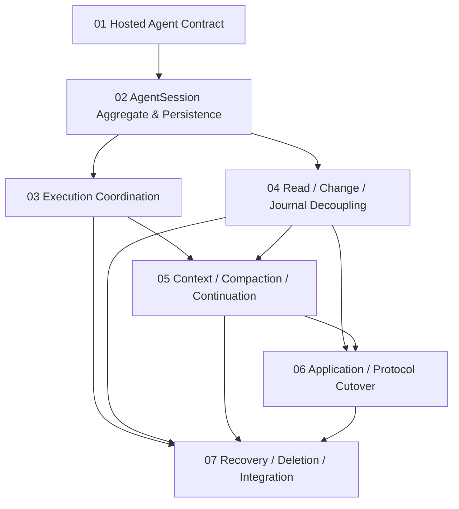

# Hosted Agent 收敛工作包

本目录把父任务拆为七个可独立领取、检查和交接的工作包。它们共享父任务的需求与技术设计，但各自拥有明确的 scope、依赖和验收结果。

工作包没有 `task.json`，不形成第二套 Trellis lifecycle。父任务是唯一 branch、status、archive 单元；进度更新在父任务 `implement.md`。

## 依赖

## 索引

| 工作包 | 结果 |
| --- | --- |
| [01-hosted-agent-contract](01-hosted-agent-contract/prd.md) | Agent-owned contract、统一 gateway、driver observation 与 behavior suite |
| [02-agent-session-aggregate-persistence](02-agent-session-aggregate-persistence/prd.md) | aggregate、transition kernel、in-memory/PostgreSQL 与 migration |
| [03-execution-coordination](03-execution-coordination/prd.md) | binding/effect/delivery/inspect 与三个 adapter |
| [04-read-change-journal-decoupling](04-read-change-journal-decoupling/prd.md) | authoritative snapshot、change tail、fork、Journal 降级 |
| [05-context-compaction-continuation](05-context-compaction-continuation/prd.md) | typed context、manual/automatic compaction、A/B/C、cancel/failure/Lost |
| [06-application-protocol-cutover](06-application-protocol-cutover/prd.md) | AgentRun/API/App Server/frontend hard cut |
| [07-recovery-deletion-integration](07-recovery-deletion-integration/prd.md) | fault recovery、conformance、旧架构删除和最终门禁 |

## 领取规则

- 先读父任务 `prd.md`、`design.md`、`implement.md`，再读工作包 PRD 与两个 JSONL。
- `Depends On` 未完成的工作包不得通过临时 compatibility绕开依赖。
- 多 agent并行时必须声明文件/module ownership，不覆盖工作区已有修改。
- 每个工作包先通过自己的定向测试并接受 check，再允许依赖方开始。
- schema、contract 与 generated output由拥有该工作包的执行者统一修改，避免并行写同一生成文件。
- 最终实现不保留 Runtime journal双写、旧 API fallback、旧 reducer或迁移数据兼容。
