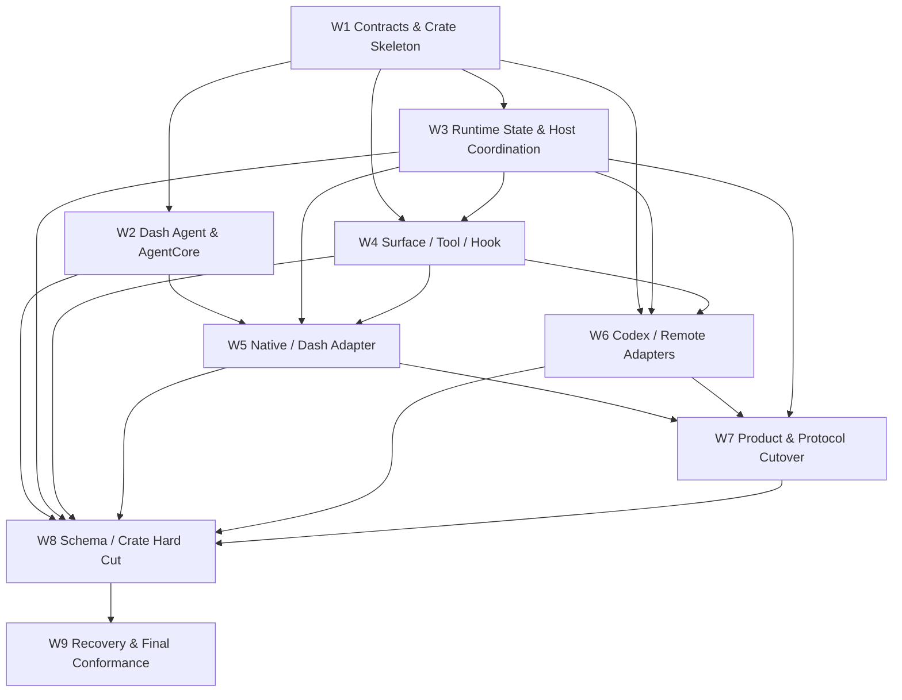

# Agent Runtime 收敛工作包

本任务使用一个父 Trellis lifecycle，并在 `implement.md` 中维护九个可独立追踪、验证和
交接的验收工作包。W1–W9 不等于九个 subagent，也不等于九个 stable checkpoint。此目录
不创建虚假的子任务链接；真正的依赖、ownership、验证命令和交接模板均以父
`implement.md` 为准，Current → Target 与 S0–S6 安全迁移边界以
[`transition-architecture.md`](../transition-architecture.md) 为准。

## Dependency index

## Dispatch rules

- 领取前读取父任务 `prd.md`、`design.md`、`transition-architecture.md`、
  `implement.md` 及 manifests。
- 内嵌 subagent 按 Platform Runtime（W1/W3/W4）、Dash/Native（W2/W5）、External
  Agents（W6）、Product/Protocol（W7）、Hard Cut（W8）和 Final Conformance（W9）
  粗粒度 bundle 派发，不建立 Trellis channel。
- implement/check 使用不同内嵌 subagent 以保持判断独立；check 发现问题后，经主会话确认
  scope 可直接自修局部、确定的问题并复跑 affected gates，跨 bundle 或核心语义变更再
  路由回 owner。
- 每个 subagent 声明粗粒度 ownership zone，不覆盖并行会话修改；除共享热点外，可围绕
  完整纵向结果自行调整文件与模块粒度。
- Depends On 未完成时不以 compatibility/fallback 绕开。
- Cargo/lockfile、正式 migration、production composition、canonical generated
  contracts、breaking public contract 与最终 legacy deletion 使用串行 ownership。
- bundle 通过定向 behavior/conformance tests 和独立 check 后才提供 target-ready 与
  activation-ready handoff；只有满足完整 gate 的 S0–S6 checkpoint 可接入稳定分支。
