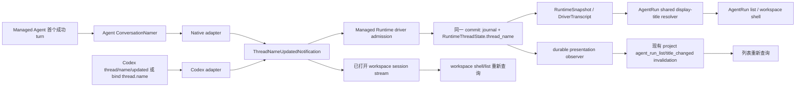

# Managed Agent 会话名称标准事件与 Runtime 投影设计

## 1. 设计结果

本任务把“会话自动总结标题”建模为 Agent conversation name，而不是 AgentRun
workspace 属性。canonical result 只有一个：

```rust
BackboneEvent::ThreadNameUpdated(
    codex_app_server_protocol::ThreadNameUpdatedNotification {
        thread_id,
        thread_name,
    },
)
```

事件进入 Managed Runtime 的 immutable presentation journal，并在同一 commit 中归约到：

```rust
RuntimeThreadState {
    thread_name: Option<String>,
    // ...
}
```

AgentRun 不接管生成业务，也不复制该值到 Lifecycle domain；它只在查询时组合：

```text
显式 Lifecycle workspace title
  > Runtime thread name
  > “新会话”
```

## 2. 不变量

1. 自动名称的业务 owner 是 Agent。
2. 自动名称的 durable/current-state owner 是 Managed Runtime。
3. 显式 workspace 标题的 owner 是 Lifecycle AgentRun domain。
4. Project Agent 名只表达 Agent identity。
5. `thread/name/updated` 是唯一自动名称结果事件；所有 adapter 使用同一 payload。
6. Runtime journal record 与 Runtime current projection 原子提交。
7. 投影失效通知不承载标题值，不是第二事实源。
8. Runtime、AgentRun、frontend 都不调用标题模型。
9. 不解释旧 `SourceSessionTitleUpdated`，不做双读、双写或旧事件回填。

## 3. 各层所有权

| 层 | 拥有 | 不拥有 |
| --- | --- | --- |
| `agentdash-agent` | 命名提示词、输入选择、LLM completion、输出规范化 | Backbone/Codex DTO、Runtime/AgentRun ID、持久化 |
| Native/Codex adapter | source lifecycle、标准 DTO 映射、binding generation fence | 展示优先级、Runtime 当前态、Lifecycle workspace title |
| Managed Runtime | immutable journal、顺序、当前 `thread_name`、snapshot/replay | 名称生成算法、AgentRun 展示 |
| AgentRun application | runtime binding 选择、display title composition、投影失效映射 | 自动名称写入、标题 LLM |
| Lifecycle domain | 用户/产品显式 workspace 标题 | Agent conversation name |
| Frontend | 查询、展示、失效后重新读取 | 标题事实、标题生成、来源推断 |

## 4. 端到端数据流



### 4.1 Managed Agent 主链

1. Runtime 接受 Native turn 并正常驱动 Agent Core。
2. Native event pump 收到成功的 `AgentEnd`，保留本轮新增 user/assistant canonical
   messages。
3. 主 turn 的 active fences 清理后，terminal 立即发给 Runtime。
4. 若 Runtime 恢复读取表明当前 name 为空，Native thread 抢占一次 naming gate，异步
   调用 Agent 层 `ConversationNamer`。
5. `ConversationNamer` 使用同一个已解析 `LlmBridge`，发起独立、无工具、不写回正文
   history 的 completion。
6. Native adapter 把成功字符串映射成标准
   `ThreadNameUpdatedNotification`，通过同一 `DriverEventSink` 作为 binding-level durable
   presentation 发给 Runtime。
7. 该 envelope 的 `operation_id/source_turn_id/source_item_id` 均为 `None`，因为会话名
   是 thread metadata，且允许在首 turn terminal 后到达；`binding_id`、`generation`、
   `source_thread_id` 必须完整保留。

### 4.2 Codex 次链

1. Codex 实时 `thread/name/updated` strict decode 为 pinned vendor DTO，再 strict
   transcode 为仓库 owned DTO。
2. Adapter 直接产生 `BackboneEvent::ThreadNameUpdated(value)`，不转换 payload。
3. bind/read 返回的 `/thread/name` 使用同一 DTO 合成一次 bootstrap presentation：
   - JSON 存在字符串：`Some(name)`；
   - JSON 显式为 `null`：`None`；
   - 字段缺失：没有观察到名称事实，不合成事件。
4. bootstrap 与 live event 使用同一 reducer；不比较 `thread.preview`，不增加
   `source=codex`。

## 5. 标准协议收敛

### 5.1 Backbone

`agentdash-agent-protocol` 从 generated owned 模块 re-export
`ThreadNameUpdatedNotification`，并在 `BackboneEvent` 的“资源/状态”分组加入：

```rust
ThreadNameUpdated(codex::ThreadNameUpdatedNotification)
```

删除：

```rust
PlatformEvent::SourceSessionTitleUpdated { ... }
```

随后统一再生成 Rust schema/TypeScript contracts。前端只能看到 generated
`thread_name_updated` Backbone variant。

### 5.2 Thread identity

标准事件中的 `threadId` 保留 producer/source protocol identity：

- Codex 使用真实 Codex thread ID；
- Native 使用 Native binding 的 `source_thread_id`。

Runtime 的 canonical thread、presentation thread 与 AgentRun 坐标仍由
`RuntimeJournalRecord` carrier 保存，不把这些 ID 写进标准 payload。

Driver ingress 对 `BackboneEvent::ThreadNameUpdated` 增加保护：

```text
notification.thread_id == DriverEventEnvelope.source_thread_id
```

不匹配时记录 critical protocol violation/quarantine。replay 时 reducer 同样按当时
投影中的 source binding identity 校验，避免跨 thread 名称污染。

### 5.3 `None` 和字符串规则

- `thread_name=None`：显式清除 Runtime 当前 name。
- `Some(name)`：事件 body 原样保存；Runtime reducer 只拒绝违反协议不变量的值，不改写
  immutable body。
- Managed Agent producer 在产生事件前负责 trim、去掉包裹引号/Markdown title marker、
  收敛为单行，并把输出限制为最多 22 个 Unicode 字符。
- Codex producer 的标准值不由 AgentDashboard 二次截断；UI 自己做视觉 ellipsis。
- 空白 `Some` 是 producer protocol violation，不被当作 `None`。

## 6. Agent 层命名模块

### 6.1 深模块接口

在 `agentdash-agent` 中增加 provider-neutral 模块，接口保持窄：

```rust
pub struct ConversationNamingInput {
    pub messages: Vec<AgentMessage>,
}

pub struct ConversationName(String);

pub struct ConversationNamer {
    bridge: Arc<dyn LlmBridge>,
}

impl ConversationNamer {
    pub async fn generate(
        &self,
        input: ConversationNamingInput,
    ) -> Result<ConversationName, ConversationNamingError>;
}
```

`ConversationName` 构造时执行单行、非空和长度约束。它是 Agent 内部 value object，不是
wire/event contract。

### 6.2 Prompt 与模型请求

`ConversationNamer` 使用：

- 固定 system instruction：根据对话目标生成简洁、可区分的会话标题，只输出标题；
- 本轮 canonical user input 与最终 assistant message；
- `tools = []`；
- 当前 Native Agent 已解析的 provider/model/credential bridge；
- 不含 workspace、run、project、Agent identity 等外层信息。

名称调用与主 Agent loop 隔离：

- 不调用 `Agent::prompt`；
- 不修改 `AgentState.messages`；
- 不触发 runtime tools/hooks；
- 名称 token usage 不混入主 turn 的 Runtime usage presentation；
- 名称失败不改变主 turn 已成功的 terminal。

### 6.3 Trigger 与 one-shot gate

`NativeThread` 增加内存状态：

```text
Present(name) | Idle | InFlight
```

初始化值来自 driver context broker 返回的 Runtime current name。

触发条件：

1. 本轮 authoritative terminal 为 completed；
2. 本轮存在 canonical user message 和最终 assistant message；
3. 当前状态为 `Idle`。

状态转换：

```text
Idle --claim--> InFlight
InFlight --sink committed--> Present(name)
InFlight --generation stale--> task ends; recovery reads new projection
InFlight --LLM/sink transient failure--> Idle
```

同一进程内不允许并发调用。crash 后不持久化 `InFlight`；新 generation 从 Runtime
`thread_name` 恢复：

- 已提交事件：读到 `Some`，不会重复生成；
- 未提交事件：读到 `None`，未来成功 turn 可重新尝试。

这利用 canonical projection 和 generation fence，不增加 naming-job table。

### 6.4 Fork/Resume

- Resume 恢复同一个 Runtime current name。
- Runtime thread fork 不复制 parent `thread_name`；新 thread 由自己的标准事件决定。
- Codex fork 若在 bind result 中返回 name，则由 bootstrap 标准事件建立新 thread
  projection。
- Lifecycle 层是否继承显式 workspace title 保持其既有产品规则，与 conversation name
  无数据复制。

## 7. Runtime journal 与 current projection

### 7.1 状态与 snapshot

增加：

```rust
RuntimeThreadState::thread_name: Option<String>
RuntimeSnapshot::thread_name: Option<String>
DriverTranscript::current_thread_name: Option<String>
```

`RuntimeSnapshot` 是 AgentRun 的读取入口；`DriverTranscript.current_thread_name` 是
Native cold bind/rebind 的恢复入口。两者都从同一个 RuntimeThreadState 字段复制，不各自
扫描或推断。

### 7.2 Reducer

`RuntimeThreadState::apply_journal_fact` 对 presentation 分两类处理：

1. `BackboneEvent::ThreadNameUpdated`：
   - 验证 source thread identity；
   - 将 `thread_name` 设为 notification value；
   - 不进入 terminal item transcript。
2. terminal `ItemCompleted`：
   - 维持既有 transcript indexing。

其他 presentation 继续不改变 current state。

事件按 durable sequence 应用，因此 last accepted event wins。没有“时间戳比较”或
adapter 自行判断新旧；binding generation admission 先拒绝真正的旧 producer。

### 7.3 原子提交

Driver ingress 当前已在构造 `RuntimeJournalRecord` 时调用 state reducer，然后用一个
`RuntimeCommit` 写入：

- projection JSON；
- immutable journal records；
- 其他同 batch write-set。

名称事件沿用该路径，不新增 `RuntimeEvent::TitleUpdated`，也不新增独立 title table。
如果 commit 失败，journal 与 projection 都不可见；如果成功，snapshot 与 replay
一致。

### 7.4 数据迁移

当前 `agent_runtime_thread.projection` 是序列化的 JSONB。新增下一号 migration（当前
基线为 `0082_runtime_thread_name_projection.sql`）：

```sql
UPDATE agent_runtime_thread
SET projection = jsonb_set(
  projection,
  '{thread_name}',
  'null'::jsonb,
  true
)
WHERE NOT (projection ? 'thread_name');
```

同一 migration 清除旧自动链路在 Lifecycle domain 留下的非显式事实：

```sql
UPDATE lifecycle_agents
SET workspace_title = NULL,
    workspace_title_source = NULL
WHERE workspace_title_source IN ('auto', 'codex');
```

`source` 仍表示 fork 等产品流程对显式标题的继承，不清除。随后更新 migration
registry/fixture 期望。迁移只把数据收敛到新所有权，不从旧
`SourceSessionTitleUpdated` journal 或 Lifecycle title 反向回填 Runtime name。

## 8. AgentRun 展示组合

### 8.1 共享 resolver

在 `agentdash-application-agentrun` 暴露纯函数，由列表和 workspace shell 共用：

```rust
resolve_agent_run_display_title(
    workspace_title: Option<&str>,
    workspace_title_source: Option<&str>,
    runtime_thread_name: Option<&str>,
) -> AgentRunDisplayTitle
```

返回：

| 条件 | `value` | `source` |
| --- | --- | --- |
| 非空 workspace title | trimmed title | 原显式 source；缺失时 `workspace` |
| 否则非空 Runtime name | trimmed name | `runtime_thread` |
| 两者都无 | `新会话` | `pending` |

Project Agent label 不传入 resolver。

### 8.2 List query

`AgentRunListRuntimeSummaryModel` 增加 `thread_name`。`agent_facts` 先执行
`runtime.inspect`，再用 Lifecycle explicit title 与 snapshot name 计算 `fact.title`。

API list contract 可以继续只返回 resolved `title`；runtime summary 是否对前端公开
`thread_name` 由现有 summary contract同步生成。为了可诊断性和一致性，本设计保留
`runtime.thread_name` 字段，但前端不得自己重算优先级。

### 8.3 Workspace shell

workspace runtime selection 把选中的 `RuntimeSnapshot.thread_name` 传到 shell builder，
再调用同一个 resolver。已有 `display_title/title_source` wire 字段保持：

- `display_title` 是 resolved value；
- `title_source` 是 presentation provenance，不是可写标题事实。

lineage/child reference 继续读取各自 resolved title，不另外回退 Agent label。

## 9. 提交后刷新

### 9.1 Runtime durable presentation observer

在 Runtime ports 增加通用的 committed-presentation observer SPI；输入是已经提交的
`RuntimeJournalRecord` 与 reducer 计算出的 `projection_changed` 标记，不定义标题
payload。Gateway 在 apply 前后比较 current projection，把标记随 durable publication
保留，并且只在 commit 成功、presentation 已发布后调用 observer。

生产 composition 注册 `AgentRunThreadNameProjectionNotifier`：

1. 只过滤标准 `BackboneEvent::ThreadNameUpdated`；
2. `projection_changed=false` 时不发失效通知；
3. 用 runtime thread anchor/current binding 解析 `run_id + agent_id`；
4. 读取 Lifecycle run 得到 `project_id`；
5. 调用现有 `ProjectProjectionNotificationPort` 发布：

```text
projection = agent_run_list
reason = title_changed
runtime_thread_id = current thread
```

observer 位于数据库事务之后。它的通知是 loss-tolerant invalidation hint：失败记录诊断，
不把已经成功的 Runtime commit 回报成失败，也不重写标题事实。生产构造必须显式注册，
相关 composition test 锁定该要求。

### 9.2 Frontend

- Project AgentRun list store 已支持 `projection=agent_run_list` 后重查，补充
  `reason=title_changed` 回归即可。
- AgentRun workspace journal 会收到标准 `thread_name_updated`。control-plane planner
  对该 Backbone variant 产生：

```text
refreshWorkspaceState = true
refreshAgentRunListReason = "thread_name_updated"
```

- 前端不从 notification payload 直接 patch shell；统一重新读取后端 resolver 结果，
  这样显式 workspace title 的优先级不会在客户端分叉。

## 10. 并发、失败与恢复矩阵

| 场景 | 结果 |
| --- | --- |
| 主 turn 成功、命名慢 | turn 先 terminal；名称稍后独立提交 |
| 首 turn 失败/中断 | 不触发命名 |
| 同 thread 第二个 turn 在命名中完成 | `InFlight` 阻止第二次调用 |
| 命名 LLM 失败 | 主 turn 不受影响；状态回 `Idle`，未来成功 turn 可重试 |
| 命名完成前 driver rebind | 旧 generation 结果 quarantine；新 driver 从 Runtime 读取 |
| commit 成功、进程随后崩溃 | replay 得到 name；不会重新生成 |
| 相同 name 重复通知 | journal 可审计，projection 值不变，不发重复列表失效 |
| `threadName=None` | projection 清除；展示回到 explicit title 或“新会话” |
| Codex bind name 与随后 live event 相同 | 同一 reducer 幂等，最终值一致 |
| source `threadId` 与 envelope 不匹配 | critical protocol violation，不改变 projection |
| project invalidation 发布失败 | canonical name 仍成功；记录诊断，下一次查询读到正确值 |
| 显式 workspace title 存在 | Runtime name 仍保存，但 resolver 始终展示显式 title |

## 11. 代码影响面

### Protocol / generated contracts

- `crates/agentdash-agent-protocol/src/lib.rs`
- `crates/agentdash-agent-protocol/src/backbone/event.rs`
- `crates/agentdash-agent-protocol/src/backbone/platform.rs`
- schema/codegen tests 与 `packages/app-web/src/generated/**`

### Agent / adapters

- `crates/agentdash-agent/src/conversation_naming.rs`（新增）
- `crates/agentdash-agent/src/lib.rs`
- `crates/agentdash-integration-native-agent/src/driver.rs`
- `crates/agentdash-integration-native-agent/tests/native_driver.rs`
- `crates/agentdash-integration-codex/src/mapping.rs`
- `crates/agentdash-integration-codex/src/driver.rs`
- Codex mapping/driver tests

### Runtime / persistence

- `crates/agentdash-agent-runtime/src/model.rs`
- `crates/agentdash-agent-runtime/src/gateway.rs`
- `crates/agentdash-agent-runtime/src/ports.rs`
- `crates/agentdash-agent-runtime-contract/src/snapshot.rs`
- `crates/agentdash-integration-api/src/agent_runtime.rs`
- `crates/agentdash-infrastructure/src/persistence/postgres/runtime_repository.rs`
- `crates/agentdash-infrastructure/src/persistence/postgres/agent_runtime_context_broker.rs`
- `crates/agentdash-infrastructure/migrations/0082_runtime_thread_name_projection.sql`
- Runtime interface/replay/repository/context-broker tests

### AgentRun / API / frontend

- `crates/agentdash-application-agentrun/src/agent_run/**` 的共享 resolver、workspace query、
  runtime binding lookup/notifier
- `crates/agentdash-application/src/agent_run_projection.rs`
- `crates/agentdash-application/src/agent_run_list.rs`
- `crates/agentdash-application-ports/src/project_projection_notification.rs`
- `crates/agentdash-infrastructure/src/agent_runtime_composition.rs`
- `crates/agentdash-api/src/app_state.rs` 与 contract mapping tests
- `packages/app-web/src/features/agent/agent-run-list-state-store.test.ts`
- `packages/app-web/src/features/agent-run-workspace/model/controlPlaneModel.ts`
- 对应 frontend tests/generated contract checks

### Cleanup

- 删除 `crates/agentdash-application-ports/src/workspace_title.rs` 及 module export（确认无显式
  用户重命名调用者后）。
- 删除 Lifecycle domain 中仅服务旧自动写入优先级的 `update_workspace_title` /
  `title_source_priority`；保留显式标题字段与 fork 的 `user/source` 所有权。
- 删除所有 `SourceSessionTitleUpdated` 引用。
- 不恢复 `AgentRunWorkspaceTitleAdapter`、RuntimeSession title service 或 SessionMeta
  title 事件。

## 12. 验证策略

### Unit

- ConversationNamer：prompt 构造、空工具、规范化、空/多行/超长输出、bridge failure。
- Codex mapping：`Some`、`None`、缺失 bind field、标准 payload 无损。
- Runtime reducer：set/replace/clear、source ID mismatch、duplicate same value。
- shared title resolver：三档优先级、空白处理、source。

### Integration

- Native 首个成功 turn：terminal 先到、随后一条 binding-level durable name event。
- Native concurrent/rebind：single in-flight、stale generation 拒绝、cold bind 不重复调用。
- Runtime commit/replay/Postgres roundtrip：journal 与 projection 一致，重启后 name 保留。
- Codex bind + live：两条路径进入同一 reducer。
- AgentRun list/workspace：snapshot name 生效，explicit title 优先，Agent label 不当 title。
- committed observer：只在 name 语义变化后发布现有 `agent_run_list/title_changed`。

### Cross-layer

- generated Rust schema 与 TypeScript union 中存在 `thread_name_updated`，不存在
  `source_session_title_updated`。
- project event 触发 list refresh。
- session standard event 触发 workspace/list requery。
- frontend type-check 和定向 tests 通过。

## 13. 直接切换策略

1. 先在同一变更中加入标准 Backbone variant 和 Runtime projection。
2. Codex mapping 与 Native producer 同时切到标准事件。
3. AgentRun query 同时改读 Runtime snapshot。
4. 删除自有事件、WorkspaceTitle 自动写入 port 和所有旧调用点。
5. 执行 JSONB projection migration 与 generated contract 更新。
6. 不保留 feature flag、双事件发布、旧 payload reader 或 Agent-name title fallback。
