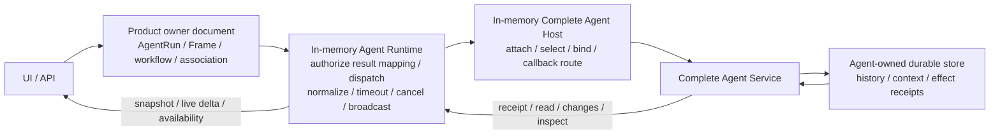

# Agent Runtime 持久化职责与事实边界清理设计

## 1. Design Thesis

系统只需要两个 durable 端点：

1. Product 保存产品业务定义与 Agent source 关联；输入只存在于同步 API handoff；
2. concrete Complete Agent 保存实际 source、history 与 effect outcome。

Agent Runtime 与 Complete Agent Host 位于两个 durable 端点之间。它们的职责是解释、协调、路由
和实时传输，不是建立第三个 durable workflow engine。

“跨重启可恢复”由稳定 identity 加两端 authority 实现：

```text
Product request / stable client identity
  -> deterministic Agent command/effect identity
  -> Complete Agent accept/execute
  -> Complete Agent read/changes/inspect
  -> Product association / UI presentation
```

中间层不持久化同一 command/effect 的副本。

## 2. Target Ownership Model

| Concern | Durable owner | Process-local owner | Recovery |
| --- | --- | --- | --- |
| AgentRun/LifecycleAgent/Frame/workflow/lineage | Product | Application service | Product owner document |
| AgentRun 到 Agent source 的稳定关联 | Product | Runtime resolver | Product association |
| 当前用户输入 | 无 durable owner | API/dispatcher | Agent 接收前保留在当前请求 |
| native source/history/context/fork | concrete Agent | Complete Agent service | Agent `read/changes` |
| command/create/fork/surface effect | concrete Agent | Complete Agent service | Agent `inspect(effect_id)` |
| service definition/configuration | Integration/config owner | live catalog | 启动/连接时 materialize |
| live attachment/offer/placement/incarnation | 无 | Host live catalog | 重新 attach/describe/verify |
| binding route/lease/generation/callback route | 无 | Host | 重新 bind/apply；未知旧 route 拒绝 |
| normalized snapshot | 无 | Runtime read adapter | 重新读 Agent snapshot |
| live delta/broadcast | 无 | Runtime stream adapter | 断线后重新读 snapshot |
| Tool/Hook effect receipt | 实际 Tool/Hook owner | callback handler | handler idempotency/inspect |
| Product presentation cache | 可选、非权威 | Application/UI | 丢弃并重建，永不 gate |

## 3. Target Dependency Direction



Product 依赖平台中立的 Agent query/command port，不直接依赖 Dash/Codex DTO。Runtime/Host 可以保留
crate 与 typed interfaces，但其 repository ports 从生产路径移除。

## 4. Command Handoff

### 4.1 Stable identity

Product/API 从以下坐标确定性派生 command identity：

```text
schema identity
+ AgentRun target
+ client_command_id
+ command kind/payload digest
```

Runtime 从 command identity 确定性派生 Complete Agent effect identity。相同输入重试必须命中同一
Agent effect；不同 payload 复用 client id 必须 typed conflict。

### 4.2 同步交接

```text
Product authorize + resolve association
  -> Runtime memory map command
  -> Host select current live service
  -> Agent inspect(effect_id)
     Applied/Accepted -> return existing receipt
     NotApplied       -> execute same effect
     Unknown          -> typed pending/unavailable
  -> Agent receipt
  -> API returns accepted/rejected
```

API 不在 Agent 接收前返回 durable accepted，因此不需要 Product claim 或 Runtime pending queue。
HTTP 响应丢失由调用者重试同一 client id。

Product 不提供离线输入队列或后台补投递。Agent 不可用时当前请求返回 typed unavailable，调用者
使用同一 client id 重试。

## 5. Lifecycle and Recovery

### 5.1 Create

Product 在发起 Create 前保存必要的 AgentRun/Frame/profile intent，并派生稳定 create effect id。
Complete Agent applied inspection 必须包含 source coordinate 与 initial context evidence。崩溃窗口：

- dispatch 前：重试 inspect 得到 NotApplied，再 create；
- create 后回包前：inspect 返回 Applied Create source；
- Product association commit 前：同一 Product input/recovery entry 再次 inspect 并提交 association。

Host 不保存 create effect history。

### 5.2 Fork

Product fork intent 保存 parent/child Product identity、cutoff 与稳定 effect id。Complete Agent
inspection 返回 child source 和 history digest。Product graph commit 只写 Product lineage 与
child association；Agent fork history 留在 Agent store。

### 5.3 Surface

- desired business surface 来自 Product AgentFrame；
- offer 来自当前 Complete Agent descriptor；
- bound surface 是进程内求交结果；
- applied surface 是 concrete Agent receipt/inspection。

Host 可在每次 attach/rebind 时重新编译并 idempotent apply。Product 不保存 Host generation 或
applied digest；Runtime 不保存 surface snapshot。

### 5.4 Host restart

Host restart 生成新 incarnation，重新 materialize live services。旧 callback route 与 attachment
在新进程不存在，默认拒绝。已有 Product association 通过 Complete Agent source coordinate 和
当前 integration selection 重新 attach/read；需要 surface 的命令先确保当前 surface applied。

不提升或持久化一个跨重启 Host generation；新 incarnation 本身就是 live fence。

## 6. Read and Streaming

### 6.1 Snapshot

Application 读取：

1. Product owner document，构建 AgentRun shell、Frame、workflow、title 与权限；
2. 通过 Runtime query adapter 调用 Complete Agent `read`；
3. 在内存中 normalize Agent snapshot；
4. 将 optional Agent presentation 合并到 Product shell。

Agent 不可用时返回 Product shell 与 typed unavailable diagnostic。不得返回 projection drift。

### 6.2 Live delta

Agent-native execution callback/change stream进入内存 broadcaster：

```text
provider/Core delta
  -> concrete Agent callback
  -> Complete Agent live change
  -> Runtime normalize
  -> connection-scoped broadcast
  -> UI
```

live delta 不落 Runtime DB。Complete Agent 在适当边界把 durable history 写入自己的 source store。
断线重连重新 `read` authoritative snapshot；如果 Agent 支持 ordered durable tail，可从 Agent
cursor 增量读取。

### 6.3 Presentation cache

如性能测量证明需要缓存，缓存必须：

- 由 Agent source revision 标识；
- 可随时删除并重建；
- cache miss/stale 退化为 Agent read；
- 不参与 command/list/workspace/delete gate；
- 不产生独立 durable outbox。

本任务默认不建立持久缓存。

## 7. Reverse Callback

Host 在内存中保存当前 route、binding context、deadline 与 handler handle。callback invocation
携带 stable idempotency key：

```text
Agent callback
  -> Host validates current route/incarnation/source
  -> actual Tool/Hook handler invoke(idempotency_key)
  -> handler-owned receipt
  -> Host returns result
```

Host 在 handler 返回后、Agent 收到前崩溃时，Agent 使用同一 callback identity 重试，handler 返回
既有 receipt。若 handler 没有幂等 receipt，则修复 handler owner；不增加通用 Host callback DB。

## 8. Storage Convergence

### 8.1 删除 Runtime durable state

概念删除：

```text
agent_runtime_state_revision
agent_runtime_source_projection
agent_runtime_source_identity
agent_runtime_source_change
agent_runtime_projection
agent_runtime_thread_binding
agent_runtime_operation
agent_runtime_idempotency
agent_runtime_pending_command
agent_runtime_change
agent_runtime_outbox
agent_runtime_surface_snapshot
```

同时删除 repository、validator 中仅服务 append-only durable history 的规则、Product change
delivery worker、consumer cursor/claim 及 `ManagedRuntimeGateway::changes` 的 durable 语义。

Runtime 公共 read 可以保留 snapshot/page DTO，但数据源改为即时 Agent read/changes。

### 8.2 删除 Host/Callback durable state

概念删除：

```text
agent_runtime_host_revision
agent_runtime_callback_revision
Host binding/effect/lease/callback normalized mirrors
Host provisioning/recovery history
callback reservation/outcome history
```

Integration/configuration 中确属稳定配置的 service definition/profile/credential ref 保留在其真实
owner；current attachment/offer/availability 不落库。

### 8.3 收口 Product local documents

Product 保留：

- LifecycleRun/LifecycleAgent；
- AgentFrame history/surface；
- workflow/lineage；
- Complete Agent source association。

Product 删除：

- Runtime projection/change/outbox 消费状态；
- Agent execution operation/terminal 副本；
- Host binding/generation/applied evidence；
- command claim、pending input/outbox、mailbox/background delivery；
- 只为跨表级联或 JOIN 建立的局部全局表。

AgentFrame 与 Product binding 的最终物理形态优先并入 LifecycleAgent/AgentRun owner JSONB，但实施前
必须先收口 repository seam 为 owner-scoped access，避免跨 owner 全局 frame lookup。

### 8.4 收口 Dash Agent store

Dash source canonical document包含其 native history/context/branch/command/effect/change fold state。
删除由该文档机械展开的 relational mirrors 与每次 load drift verification。

Create 前 effect 可使用独立 `effect_id -> Agent effect record` 存储，因为此时尚无 source；
source 创建后该记录仍属于 Complete Agent service，不属于 Product。

## 9. Revision Model

保留：

- Product owner document CAS revision；
- Complete Agent source revision/change cursor；
- Tool/Hook effect owner 的 receipt version；
- command-specific expected coordinate，例如 active turn、interaction、fork cutoff。

删除：

- generic Product/API `expected_revision`；
- persisted Runtime projection revision；
- persisted Host graph revision；
- availability `decided_at_revision` 作为 command gate；
- Product/Runtime/Host 之间的 cross-owner revision equality；
- derived snapshot stale 作为 List/Workspace 错误。

## 10. Migration Strategy

项目未上线，采用 hard cut：

1. 先在代码中建立不依赖 Runtime/Host repository 的完整 production tracer bullet。
2. 同一开发分支内原子切换 command/read/stream/recovery composition；不保留双轨 production
   reader/writer。
3. 使用下一个可用 forward migration：
   - 清理 Runtime/Host/Callback durable documents 和 mirrors；
   - 清理 Product change delivery、command claim、pending input 与 command recovery saga；
   - 收口 Product owner-local Frame/binding；
   - 清理 Dash repository mirrors；
   - 删除无法证明的开发态 pending/intermediate state。
4. 更新 readiness 与 migration guard，验证空库和已执行 0094 的开发库。

不修改旧 migration，不提供兼容 reader、fallback 或数据回填猜测。

## 11. Implementation Slices

### Slice A — Contract and tracer bullet

先建立一条不使用持久 Runtime projection 的真实 Dash 路径，证明 input、live delta、history read、
reconnect 和真实 failure diagnostic。

### Slice B — Command and lifecycle recovery

将普通 command、Create、Fork、SurfaceApply 改为 stable effect + Agent inspect；移除 Runtime/Host
effect ledger 依赖。

### Slice C — Runtime/Host memory cutover

替换 production composition，删除 repository ports/workers/revision gates。

### Slice D — Product owner cleanup

删除 command claim/pending input/mailbox delivery；把 source association、Frame/binding 收回
Product owner document；List/Workspace 使用 optional Agent presentation。

### Slice E — Agent store cleanup

删除 Dash relational mirrors，保留 Agent-owned source/effect authority并验证 fork/compaction/restart。

### Slice F — Migration and spec convergence

执行 schema hard cut、production composition/crash matrix、前后端契约更新和最终 spec 收敛。

每个 Slice 完成时最终 production 路径只能有一个 owner；不得以渐进迁移为由保留长期 dual write。

## 12. Rejected Designs

- **继续修 Runtime reconciler/outbox SQL**：只能让第三事实源暂时同步，不消除重复 authority。
- **保留 Runtime JSONB 但删除 mirrors**：仍保留 Product、Runtime、Agent 三套 command/history
  状态机。
- **把 Dash history 放入 AgentRun JSONB**：跨 bounded context 合并事实，破坏 Product/Agent
  分层。
- **Host 持久化 old route/tombstone**：未知旧 route 默认拒绝即可，历史表没有业务价值。
- **所有状态都从 Product 推导**：Product 无权推导 Agent native execution outcome，必须读取
  Complete Agent。
- **UI 只读 live stream**：断线后无法恢复；snapshot authority 必须来自 Agent。
- **用更多 revision/digest 证明一致**：跨 owner equality 不能创造原子性，只会制造 drift gate。

## 13. Deliberate Product Semantics

Product 明确不承诺 Agent 离线时的异步可靠输入投递。API 只在 Complete Agent 明确接收后报告
成功；Agent 不可用时返回 typed unavailable，调用者以同一 client id 重试。

这个语义允许彻底删除 Product claim/pending/mailbox delivery、Runtime pending 与 Host effect
三层中间账本。未来若产品重新提出离线队列，应作为新的 Product feature 和独立任务设计，不能在
本任务中保留隐藏扩展点。

## 14. Cold Host Resolution and UI Terminal Convergence

`AgentRunProductRuntimeBinding` 是恢复当前进程路由的完整事实输入：它同时固定 Product target、
concrete Agent source、service identity、immutable AgentFrame、execution profile 与 credential
scope。Product read、live subscription、command 和 fork snapshot 统一把完整 binding 交给
`AgentRunCompleteAgentResolverPort::resolve`；resolver 先 materialize 当前 Host route，再原子返回
`CompleteAgentService + AgentBindingGeneration`。因此 Host attachment/catalog 始终是可丢弃进程态，
冷启动不需要 durable Host registry。

UI 使用两条单向 presentation lane：live event 只承载当前连接中的低延迟 partial；authoritative
snapshot 承载 durable terminal。同步 command 完成后立即重读 snapshot，断连重连也执行相同读取。
没有 assistant item 的 failed/interrupted turn 仍保留为 terminal-only segment，并直接展示
concrete Agent history 中的错误信息。

平台 `ThinkingLevel` 是稳定语义层级，不是 Provider wire literal。Provider adapter 负责确定性编码；
Codex Responses 把平台最低非零档 `minimal` 编码为其原生最低档 `low`，profile 与 source identity
保持不变。

## 15. Fork Product Selection Boundary

普通 Fork 由 concrete Agent 产生稳定 child source 与 association；Product graph 只提交子
LifecycleRun/LifecycleAgent/AgentFrame/lineage，随后直接激活同一个 concrete Agent binding。显式
选择新的 ProjectAgent 或 execution profile 时，Product 才物化 selected child frame，并要求
Complete Agent 执行一次 Rebind 后再 Activate。这个分支以 `child_product_selection` 这一条 typed
intent 判定，Saga 的 `next_step` 与 runtime operation acceptance 共享相同条件，因此重启恢复不会
引入额外 binding lookup、伪物化或第二条执行路径。
