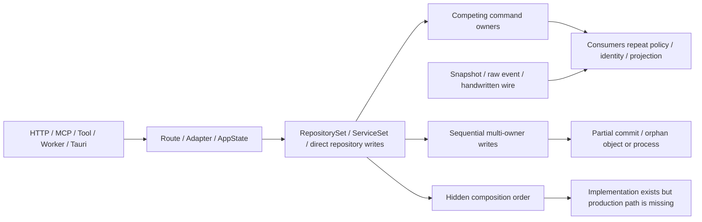
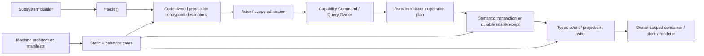
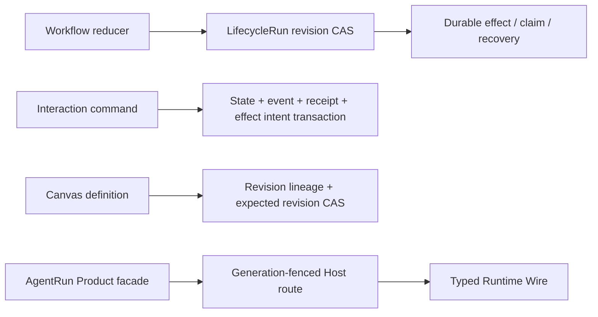

# Architecture Stability Ledger

> Status: planning baseline  
> Owner: parent task `07-26-module-coupling-stable-boundary-review`  
> Rule: Target 不等于 Proven。只有行为证明、production composition、old path absence 和 blocking gate
> 同时闭合，边界才能晋升为 Proven。

## 这份账本回答什么

这份文档持续回答四个问题：

1. 重构前，正常变化为什么会穿透多个模块；
2. 重构后，谁成为唯一 owner，哪些 consumer 不再理解其内部实现；
3. 哪些行为已经由可执行证据证明，而不是只存在于设计图；
4. 尚未证明、仍可能打碎主链的边界在哪里。

它是审阅与进度视图，不替代 Rust/TypeScript contract、migration、machine architecture manifest、
测试或 CI 权威。

## 状态定义

| 状态 | 含义 |
| --- | --- |
| `baseline` | current production 路径和风险已取证 |
| `contracted` | Behavior Boundary Contract、target owner和proof obligations已批准 |
| `cutover` | 新owner已接管，但proof/旧路径/gate尚未全部闭合 |
| `proven` | target behavior、错误行为拒绝、production reachability、old path absence、blocking gate全部成立 |
| `blocked` | 缺产品决策、外部状态或关键证据，不能继续晋升 |

不使用主观“稳定性分数”或百分比；状态由证据条件决定。

## Current Architecture



当前不稳定点不是“模块之间存在依赖”，而是入口、owner、transaction、recovery和consumer解释没有通过
一条可强制的合同闭合。

## Target Architecture



Target 图表达设计合同；只有对应 Stability Delta 行晋升为 `proven`，该边才进入 Proven 图。

## Proven Architecture

当前 planning baseline 只确认以下“应保留的正确核心”，不代表其外围边界已经闭合：



- Workflow 外围仍有 broad update writer，因此完整 LifecycleRun boundary仍是 `baseline`。
- Interaction effect worker尚未 production 装配，因此完整 Interaction effect boundary仍是 `baseline`。
- Proven 图只用于保护这些正确核心不被机械拆散。

## Stability Delta

| ID / Boundary | Before | Target | Proven evidence | Consumer knowledge removed | Blocking gate | Status |
| --- | --- | --- | --- | --- | --- | --- |
| BND-01 Operational admission | public diagnostics暴露arbitrary fields；workspace setup接受无scope backend/root；Relay token在URL | operator diagnostics port；actor-scoped workspace capability；header credential | 待 child proof | route/transport不再自行把authentication当authorization | entrypoint/admission + redaction/credential tests | `baseline` |
| BND-02 LifecycleRun command | executor CAS与Task/terminal/Hook broad update竞争；Task入口policy分裂 | 唯一 typed `LifecycleRunCommandStore` + actor-aware Task command | 待 child proof | HTTP/MCP/Runtime/Companion不再读改整份run | CAS/concurrency/cross-entry gate | `baseline` |
| BND-03 Project sharing | last-owner invariant在route中check-then-write | transaction-owned `ProjectGrantCommandPort` | 待 child proof | route不再解释grant set invariant | DB concurrency invariant | `baseline` |
| BND-04 Project/asset retirement | Project/Story/inline/object/AgentRun/Host/cache分步删除且无统一receipt | Project semantic retirement plan + DB transaction + durable revoke/cleanup adapters | 待 child proof | Project owner不再枚举所有repository；adapter不再各建delete saga | data-owner/retirement/failure replay gate | `baseline` |
| BND-05 Asset operations | Agent+MCP、Mount+inline、Extension publish/upload/install可见半成品 | validated `AssetOperationPlan` + semantic tx/receipt | 待 child proof | route/Shared Library不再按repository顺序推进 | transaction/failure injection gate | `baseline` |
| BND-06 Lifecycle dispatch / Routine | dispatch跨多repo；cron无occurrence identity，多实例可重复触发 | dispatch transaction/outbox；durable trigger occurrence + distributed claim | 待 child proof | scheduler/route不再拥有执行幂等状态 | multi-instance/restart/replay gate | `baseline` |
| BND-07 Effect/convergence reachability | Interaction worker、Gate terminal convergence未装配；Companion先resolve后delivery失败 | required worker contributions + durable handoff/convergence receipt | 待 child proof | handler不再route-local构造未配置service | composition freeze + worker reachability | `baseline` |
| BND-08 Runtime composition/tool lease | deferred tool按源码顺序install；definition相同保留旧executor/credential | frozen subsystem；generation/surface-scoped immutable catalog lease + revoke | 待 child proof | AppState/consumer不再理解install顺序或client lifetime | completeness/rebind/revoke gate | `baseline` |
| BND-09 Foundation/application direction | Platform SPI泄漏Agent实现；Infrastructure混合persistence/composition；RepositorySet扩散 | dependency-light contract、纯persistence adapter、subsystem handles | 待 child proof | routes/use cases不再依赖concrete/repository bag | dependency/public-owner/source gate | `baseline` |
| BND-10 Frontend occurrence/store owner | snapshot数组位置冒充live sequence；raw event和iframe直接写foreign store | feed-owned delta；typed dispatcher；workspace-scoped presentation port | 待 child proof | App/renderer/feature不再重新解释owner事件或target | frontend owner + vertical E2E gate | `baseline` |
| BND-11 Generated/IPC/path | JSON bigint不诚实、live decoder浅、Tauri手写、MCP placement shape不同、view猜OS path | owned wire + generated decoder/client + lossless envelope + typed path | 待 child proof | service/view不再重建DTO、枚举或path grammar | contract DAG/codec/packaged matrix | `baseline` |
| BND-12 Agent Runtime observation/lifecycle/encoding | source context DTO穿透Product/UI；item终态由consumer推理；nested scalar靠字段路径补丁 | canonical AgentObservation + Runtime-owned context fence + typed item terminal + schema-recursive codec | [07-29 Agent Runtime收束](../archive/2026-07/07-29-agent-runtime-cross-layer-state-convergence/implement.md)：A0-A4行为测试、old-path absence与`agent-runtime:guard` | Product/API/UI不再构造source query、复制observation或从item body猜终态；transport不再手写字段路径 | `agent-runtime:guard` + `contracts:check`进入PR quick/full gate | `proven` |

## Module → Work Package → Invariant Coverage

当前为 planning family-level baseline；`convergence-plan.md` 在创建 child task前必须扩展到每个实际
work package和production入口。

| Module family | Planned work package owners | Behavior invariants |
| --- | --- | --- |
| API routes / MCP servers | admission、Story/Workflow/Task command、use-case seams | 多入口汇入同一actor-aware command owner |
| Project/Workspace/Assets | Project grant、semantic retirement、asset operation、context document | owner/inline/object写入原子或可重放，删除不产生半状态 |
| Workflow/Lifecycle/Task | LifecycleRun command store、dispatch transaction、Task authorization | revision/CAS、stable command id、并发事实不互相覆盖 |
| Routine/Companion/Gate/Interaction/Channel | occurrence、delivery/convergence worker、effect worker、channel outbox | 多实例唯一触发，effect/唤醒可恢复且production可达 |
| AgentRun/Runtime/Host/Hook | frozen composition、generation tool lease、exact Hook outcome | binding/generation/surface一致，旧executor与callback不可继续使用 |
| VFS/Terminal/Relay/Local | VFS adapter split、terminal semantic launch、bounded command lanes | Cloud admission/Local physical effect分权，孤儿和HOL可恢复 |
| Persistence/Migration | data owner、semantic transactions、migration range/effective schema | 每个fact有owner/read/retire，CI检查真实PR range |
| Frontend stores/features | live delta、Project dispatcher、Workspace presentation、Terminal port | snapshot不反推occurrence，foreign feature不直接写owner store |
| Generated/Tauri/Desktop | generator DAG、runtime codec、IPC/path package | Rust wire单源，跨端shape和path可roundtrip |
| Quality gates/specs | architecture harness、G0-G9、release attestation | guard不silent skip，required path不能绕过 |

## Boundary Proof Contract

每个 child task 创建 `boundary-proof.md`，至少记录：

```text
Anchors
  finding / production path / change trigger / invariant / owner / blast-radius claim

Behavior dispositions
  preserve / correct / remove

Behavior matrix
  entrypoint + actor + scope
  success + error
  concurrency + idempotency
  restart + reconnect + replay
  transaction + external effect
  consumer projection

Executable proof
  characterization/regression
  owner/contract tests
  failure injection
  multi-writer/multi-instance recovery
  production composition reachability
  representative vertical E2E
  old-path absence
  blocking negative gate
```

## Ledger 更新协议

1. child task 在产品修改前提交 `boundary-proof.md` 的 anchors、contract和proof obligations。
2. child task完成局部验证后保持状态 `cutover`，不能直接把本账本改成 `proven`。
3. 父任务运行跨任务 integration、production composition、old-path absence和change simulation。
4. 父任务更新 Stability Delta、Module Coverage、Current/Target/Proven图和evidence index。
5. blocking gate未启用或旧producer仍存在时不得晋升。
6. 每个 wave结束发布账本快照，列出新增proven、仍未证明和下一wave前置。

## Change Simulation

最终必须至少验证：

- 新增一个 Project-owned table/object时，data owner/retirement gate要求在唯一owner内闭合；
- 新增一个 HTTP/MCP/Tool/worker入口时，必须映射既有capability/command owner；
- 新增一个 Runtime Tool executor或credential generation时，只改变catalog owner/adapter；
- 新增一个 Project/Agent live event variant时，只改变generated contract和唯一dispatcher；
- 新增一个 Tauri command或path style时，由Rust manifest/typed contract驱动client和platform matrix。

Simulation的判据是预期修改面和失败门禁，不是diff行数更少。

## Evidence Index

- [后端三路交叉收敛](research/backend-cross-audit-synthesis.md)
- [后端入口覆盖基线](research/backend-entrypoint-coverage-index.md)
- [业务资产审计](research/backend-business-assets.md)
- [控制编排审计](research/backend-control-orchestration.md)
- [执行与系统装配审计](research/backend-execution-composition.md)
- [前端与跨层审计](research/frontend-crosslayer-coupling.md)
- [依赖图与演化审计](research/repo-dependency-churn.md)
- [架构门禁可实施性](research/architecture-enforcement-feasibility.md)
- [Agent Runtime纵向边界证明](../archive/2026-07/07-29-agent-runtime-cross-layer-state-convergence/implement.md)

## 当前未证明项

- Identity Directory企业可见性产品合同；
- Permission最终由Product durable facade或Runtime approval拥有；
- Project retirement后concrete Agent source/effect的hard-delete或retention合同；
- AgentRun partial launch是否所有入口都保证自动重试；
- GitHub branch protection中的required check实际配置。

这些项目必须保持显式，不因目标图完整而隐去。
