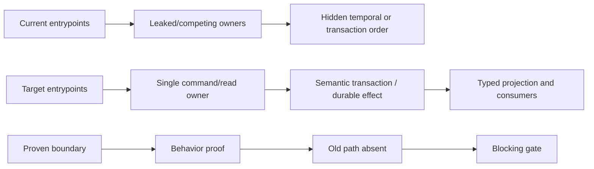

# 模块耦合与稳定边界全量评估设计

## 评估对象

本任务评估的是“变化能否被稳定边界吸收”，不是单纯评估文件大小、依赖数量或抽象层数。一个模块即使
依赖很多，只要它是明确的 composition root、只依赖窄合同且不持有第二份业务事实，也可能是合理设计；
一个文件即使很小，只要它重新解释别的 owner 的状态、复制协议或依赖隐式装配顺序，也属于高风险耦合。

Agent Runtime / AgentRun 重构只作为已知事故回放样本。全局风险排序必须先由统一审计标准产生，不能由
该样本预设结论。

## 仓库覆盖面

| 面 | 必须覆盖的边界 |
| --- | --- |
| 产品与领域 | Project / Backend / Workspace、Story / Task / Canvas、Shared Library / Asset、Workflow / Lifecycle / Routine、Companion / Channel、Permission / Capability |
| Agent 执行 | AgentRun facade、Business Surface、Agent Runtime、Host、Service API、Wire、Native / Codex / Remote Integration、Hook、VFS / Tool |
| 持久化与入口 | Domain repository、Application port/use case、Infrastructure、PostgreSQL / SQLite / migration、API、MCP、Relay、Local、Tauri、Extension Host |
| 前端与跨层 | generated contracts、services / mappers、Zustand stores、stream reducer/effect、feature view model、views/ui packages、Web / Desktop app composition |

## 后端全业务审计分面

后端不再由单个横向审计代表。全业务逻辑按变化原因拆成三个独立研究面：

| 研究面 | 业务域 | 重点 |
| --- | --- | --- |
| 业务资产与所有权 | Project、Backend、Workspace、Story、Task、Canvas、Shared Library、Skill、MCP、Extension、Workspace Module | aggregate owner、CRUD/发布/安装/删除、授权、跨聚合事务、object storage、投影 |
| 控制编排与协作 | Workflow、Lifecycle、Routine、Companion、Channel、Interaction、Permission、Capability | command/state owner、reducer、gate/wait、派发、审批、恢复、重复 policy |
| 执行与系统装配 | AgentRun、Runtime、Hook、VFS/Tool、Terminal、API、MCP、Relay、Local、Tauri、Persistence/Composition | product/execution 分权、transport、composition completeness、跨进程恢复、adapter seam |

每个研究面都必须覆盖 route/application/domain/persistence/composition，而不是只检查所属目录。

## Use-case Coverage Ledger

最终 `business-coupling-matrix.md` 的最小记录单位是 production command/query：

| 字段 | 含义 |
| --- | --- |
| capability / use case | 用户或系统意图，不使用当前 route/function 名冒充业务边界 |
| entrypoints | HTTP、MCP、Tool、worker、startup、relay/local command |
| authorization owner | 谁决定 actor 是否可执行 |
| command owner | 谁接受意图并生成幂等/并发坐标 |
| read owners | 读取了哪些 canonical aggregate/document/service |
| write owners | 修改了哪些 aggregate/document/store/object |
| transaction / effect | 哪些写必须原子，哪些外部副作用走 outbox/receipt/recovery |
| public contract | input/output/error/event/projection 的 owner |
| consumers | backend、frontend、local/desktop、worker、integration |
| recovery | retry、replay、disconnect、restart、partial failure 如何收敛 |
| gates | unit、contract、integration、composition、migration、E2E、negative test |
| coupling verdict | necessary cohesion、authority leak、direction、protocol、temporal、data-shape 等 |

Coverage 以 production entrypoint ledger 为基准；没有进入 router/worker/tool catalog/composition 的代码
单列为 reachability gap，不能和真实业务路径混算。

## 评估模型

每个候选边界按六个问题审计：

1. **Authority**：谁拥有 canonical fact、状态迁移、identity 与 generation；是否存在第二 producer 或第二套状态解释。
2. **Direction**：依赖是否朝向稳定合同；domain/application/infrastructure/interface、cloud/local、product/runtime/driver 的方向是否倒置。
3. **Contract**：接口是否表达调用方需要的业务意图；是否泄漏 owner document、vendor DTO、repository set、raw JSON 或内部状态机。
4. **Locality**：一个合理的业务变化需要修改哪些 owner、协议、mapper、store 和 renderer；是否能在单一模块内闭合。
5. **Composition**：必需依赖、注册顺序、route、callback、registry 和 provider 是否显式；删除一条装配线时测试能否失败。
6. **Recovery**：snapshot、event、outbox、projection、cache、live overlay 和 migration 的职责是否清楚；重启、断线、重放后是否仍由同一事实收敛。

## 证据等级

结论按以下顺序取证：

1. production producer / consumer、状态写入、协议转换和 composition root；
2. 会在边界错误时失败的测试、migration guard、contract drift check；
3. git 共变、连续修复、revert 和任务历史；
4. `.trellis/spec/` 声明。

Spec 用于判断期望边界，但不能单独证明实现已经符合。Git 热点用于发现候选，不能单独证明过度耦合。

## 规划研究收敛出的必审主线

并行研究已经证明最终报告不能只围绕 Agent Runtime，至少要完整交叉验证以下六类当前候选：

1. **Admission / command authority / concurrency**
   - `/api/diagnostics` 位于 public router 并直接返回 arbitrary tracing fields，没有字段级脱敏；
   - 无 Project scope 的 `/workspaces/detect-git` 可向指定 Backend 发起 Git 探测；
   - Task HTTP 写复用 `Use` 可见性并走无 revision 的 LifecycleRun 整行 update，MCP/runtime 又有
     不同 policy/producer；
   - Project 最后 owner invariant 在 route 中 check-then-write，可被并发撤销/降级击穿；
   - Story HTTP 与 MCP、Project assets route 与 Shared Library 各自拥有重复 mutation producer；
   - Codex OAuth operation 事实保存在 API 进程内全局 map，无法跨重启/多实例恢复；
   - Local/Cloud Backend WebSocket 将 backend credential 放在 query URL，扩大日志/trace 暴露面。
2. **跨聚合 authority / transaction**
   - Project 删除逐 repository 提交且 object artifact 无删除端口；
   - Story 删除先删 canonical record 后 append event；
   - Shared Library AgentTemplate+MCP、Mount+inline、Extension publish/upload/install 缺少语义事务；
   - Project Agent/VFS Mount 先删除 inline content 再删除 owner，失败时内容已经丢失。
3. **Foundation 依赖方向**
   - `agentdash-platform-spi` 依赖并 re-export concrete `agentdash-agent`；
   - `agentdash-infrastructure` 同时承载 persistence、application adapter、integration 与
     production composition；
   - 聚合 `agentdash-application` 在纵向 crate 拆分后仍同时作为 re-export facade 和真实实现。
4. **Temporal / composition contract**
   - Runtime Product tools 先注册 deferred placeholder、后 install 真 service，缺少 freeze/completeness gate；
   - Workflow executor 使用 LifecycleRun CAS，但 terminal、Task、Hook log 等生产 writer 仍走无 revision
     broad update；Lifecycle dispatch 又跨多个 repository 提交且无完整 stage receipt；
   - Routine cron 每个 API 实例独立触发且没有 durable occurrence/lease；
   - Interaction effect dispatcher、Gate terminal convergence worker 没有 production 装配；
   - Companion human response 先 resolve gate，再调用未配置 delivery，可能返回失败但 gate 已关闭；
   - dynamic Runtime tool catalog 以 definition equality 代替 executor/credential lease identity，重绑
     时可继续使用旧 MCP transport，且没有 unbind/revoke；
   - Terminal route 先产生 Local PTY 再提交 Product projection，失败后 central inventory 无法发现孤儿；
   - Local 单 WebSocket 把控制面与慢命令混在 inline lane，后台任务又没有并发上限；
   - 前端从可收缩的 snapshot 数组下标反推 live occurrence，真实 source sequence 在 transport 后丢失。
5. **Generated / wire contract**
   - Agent live NDJSON 缺少完整 generated runtime decoder；
   - 通用 HTTP generator 把 JSON integer 声明成 `bigint`，service 再局部修正；
   - Tauri Rust command/DTO 与 TypeScript client 手工镜像；
   - Hook plan 声明 trigger action 上界，而 surface/Driver 只支持子集，真实 outcome contract 不精确；
   - direct/relay MCP 对同一工具返回完整结构与拼接字符串两种 shape；
   - route-local Project Agent/File Picker/Browse/Terminal DTO 绕过统一 generated contract。
6. **Scope / projection owner**
   - Extension/Canvas 绕过 workspace-scoped presentation port直接写全局 tab store；
   - Project raw event 由 App、feature 和 store 多处解释；
   - Shared Directory Browser 在 contract 无 path flavor 时自行按 Windows grammar 解释远端路径。
7. **架构治理自身的 drift**
   - active spec、README 与后台进程 guard 仍引用已删除 crate；
   - guard 对不存在 root 静默跳过且未接入质量门禁；
   - PR/cloud image/desktop gate 未闭合 generated、IPC、live effect 与跨平台 path 合同。

这些是最终报告的强制核验清单，不是预先确定的最终结论。每项仍要按 production reachability、
测试门禁、历史 residual 状态和合理内聚反例复核后再定级。

## 纵向样本

为避免只做水平依赖图，最终报告至少抽取以下代表性纵向链路：

- Project / Backend / Workspace 访问与执行落点；
- Workflow / Lifecycle / AgentCall 执行与产品投影；
- AgentRun 创建、输入、工具、终态、恢复与 UI；
- Canvas / Workspace Module / Extension Runtime；
- VFS address、provider、materialization 与本机执行；
- Permission / Capability / Surface / Tool Broker；
- Shared Library / Skill / Project Asset 分发；
- 至少一条非 Agent 场景的 frontend CRUD / stream 状态链。

每条链路必须标注 canonical owner、command/admission、projection、transport、persistence、UI owner 和测试门禁。

## 风险分类

| 等级 | 判定 |
| --- | --- |
| P0 | 同一事实有竞争 owner，可能造成错误状态、重复副作用、不可恢复数据或跨租户/权限错误 |
| P1 | 一类正常变化会系统性穿透多个独立模块，或关键 composition / protocol 边界无法由测试守护 |
| P2 | 边界含混、mapper/DTO/逻辑重复或模块过厚，已显著提高维护成本，但当前有明确单一事实源 |
| P3 | 局部组织与命名问题；不构成稳定边界风险，只作为附录或不纳入整改主线 |

最终结论必须同时说明耦合的种类：authority、temporal、protocol、data shape、composition、persistence、
UI projection 或 build-time coupling。

## 产物

- `research/backend-global-coupling.md`
- `research/frontend-crosslayer-coupling.md`
- `research/repo-dependency-churn.md`
- `research/history-and-existing-reviews.md`
- `research/backend-business-assets.md`
- `research/backend-control-orchestration.md`
- `research/backend-execution-composition.md`
- `research/backend-entrypoint-coverage-index.md`
- `research/backend-cross-audit-synthesis.md`
- `research/architecture-enforcement-feasibility.md`
- `boundary-inventory.md`：全仓模块、owner、入口、出口和守护门禁矩阵。
- `module-coupling-review.md`：综合结论、当前/目标边界图、风险清单和整改波次。
- `business-coupling-matrix.md`：后端 production use-case coverage ledger 与跨层 consumer 矩阵。
- `architecture-enforcement.md`：长期依赖、contract、transaction、composition、reachability 和恢复门禁。
- `convergence-plan.md`：可执行 work package graph、依赖顺序、验证和后续 Trellis 子任务树。
- `architecture-stability-ledger.md`：持续维护的 current → target → proven 架构稳定性账本。
- 每个后续 child task 的 `boundary-proof.md`：该工作项独立的行为边界合同与可执行证明。

最终报告需要显式区分：

- 已证实的实现问题；
- 合理但高度连接的 composition / contract 边界；
- 只在历史版本存在、当前已收敛的问题；
- 证据不足、需要后续实验或测试才能确认的风险。

## 目标边界建议的约束

- 项目未上线，建议直接面向正确终态，不保留旧 API、旧 schema 或双写兼容层。
- 建议先移动 authority 和状态迁移，再收窄读取/协议，最后调整目录和命名；目录移动不能冒充边界收敛。
- 任何拆分都要给出新的 owner、合同、依赖方向和失败门禁；只提出“拆文件/加 facade”不算目标设计。
- 后续整改任务按稳定边界拆分，不按当前大文件或 crate 机械拆分。

## 目标边界模型

目标不是让模块彼此“少依赖”，而是让每条依赖都只携带下游真正需要的稳定信息：

```text
HTTP / MCP / Worker / Runtime Tool / Tauri
                  │
                  ▼
        Capability Command / Query Handle
        - actor + scope + operation identity
        - intent-owned input/output/error
                  │
                  ▼
          Domain owner / reducer / plan
                  │
          semantic ports only
                  ▼
 Persistence / Object / Relay / Integration adapters

Cloud / Local / Desktop composition roots
  └─ construct complete subsystem handles, then freeze

Rust owned wire contract
  └─ generated codec → frontend dispatcher → owner-scoped store/read model → renderer
```

边界级 invariant：

1. **一个事实一个 owner**：只有 canonical owner 能生成 identity/generation 和状态迁移；projection、
   transport、cache、renderer 只能携带或索引该坐标。
2. **一个意图一个 command boundary**：HTTP、MCP、Tool、worker 可以是多个入口，但必须汇入同一
   authorization/command owner，不分别编排 repository。
3. **跨 owner 写入有语义提交者**：同数据库用 transaction port；数据库与 object/process/relay
   混合副作用使用 durable intent/receipt/claim/replay，不靠调用顺序制造“最终一致”。
4. **adapter 不拥有产品决策**：PostgreSQL、Relay、Tauri、vendor integration 只实现 owned contract；
   placement、availability、permission、recovery policy 留在相应 application/domain owner。
5. **composition 完整后才能发布**：subsystem builder 在 `freeze()` 前验证 required bindings；
   route、worker、registry 和 callback 只接收不可再半初始化的 handle。
6. **wire 只从 owner 投影一次**：Rust contract 生成真实 JSON/IPC shape 与 runtime decoder；service、
   store 和 view 不重新枚举 owner enum、补默认 identity 或猜 path grammar。
7. **读模型不反推 occurrence/command state**：snapshot 用于查询，live delta 携带自己的 occurrence
   coordinate；UI availability 来自 typed projection，不从局部 absence、数组位置或旧 event 推断。
8. **物理拆分服从变化原因**：若两个实现共享同一事务、reducer 或恢复 identity，应保持内聚；只有
   authority、合同或变化原因不同才拆 crate/package。

### 后端 subsystem handle

后端最终以业务能力暴露不可变 subsystem handle，而不是全量 `RepositorySet`/`ServiceSet`：

- handle 公开 command/query port、typed event/projection port 和 health/readiness；
- concrete repository、integration client、registry 只在 builder 内可见；
- 一个 route 若需要两个 subsystem，必须调用显式 application orchestration command，而不是从
  AppState 取两套 repository 自行组合；
- Local/MCP 直接依赖需要的 capability contract，不再经聚合 application compatibility facade。

### 跨端执行边界

- Cloud 拥有 actor、Project/Product command admission 和 durable business fact；
- Local/Desktop 拥有本机 process、filesystem、terminal、extension host 等执行资源；
- Relay/Wire 拥有 command/event envelope、operation identity、ack/timeout/disconnect 语义，不拥有
  Project/Workflow/AgentRun 状态迁移；
- driver/vendor DTO 在 integration adapter 内结束，Product/Runtime/Frontend 只消费项目自有合同。

该分权允许一次执行链跨进程，但不会让每个进程各自维护一份“现在应该是什么状态”的事实。

## Behavior Boundary Proof Model

重构是否有效不以改动规模、crate 数、文件移动、编译通过或单测数量判断。每个 work package 的完成式为：

```text
Effective Boundary Refactor
  = target behavior proven
  + incorrect/retired behavior rejected
  + production composition reachable
  + old producer/consumer path absent
  + recurrence blocked by required gate
```

任何一项缺失，ledger 状态最多是 `cutover-incomplete`，不能标记 `proven`。

### 需求锚点

每个 work package 必须同时锚定：

| Anchor | 内容 |
| --- | --- |
| Finding | 当前 production symbol、调用链、测试/migration/composition证据 |
| Change trigger | 哪类正常变化会穿透边界或触发错误 |
| Behavioral invariant | 完成后对 actor、状态、事务、副作用、恢复和 consumer 必须成立的事实 |
| Target owner | 唯一 command/read/projection/transport/persistence owner |
| Blast-radius claim | 哪些模块/consumer以后不再需要理解 owner 内部实现 |
| Proof obligation | 哪些自动测试、negative fixture、composition gate能证明上述声明 |

没有这六类 anchor 的“拆 crate、加 facade、整理目录、统一类型”不能成为独立 work package。

### Behavior Boundary Contract

每个 `boundary-proof.md` 至少包含以下场景矩阵：

| 字段 | 要求 |
| --- | --- |
| behavior disposition | `preserve`、`correct` 或 `remove`；characterization 不得把错误现状误固化成兼容要求 |
| entrypoint / actor / scope | HTTP、MCP、Tool、worker、Relay/Tauri及其真实授权坐标 |
| precondition / action | canonical fact、revision/generation、输入意图和operation identity |
| success outcome | output、committed state、event/projection、external receipt |
| failure outcome | authorization、validation、conflict、partial failure的可观察结果 |
| concurrency / idempotency | stale writer、duplicate command、multi-instance claim的唯一收敛结果 |
| restart / reconnect / replay | commit前后退出、receipt丢失、lease过期、transport重连后的收敛结果 |
| consumer contract | backend/frontend/local/desktop看到的typed shape和owner coordinate |
| retired behavior | 旧producer、fallback、mapper、route、broad update或未装配路径如何被硬删除 |

### Boundary Proof 层级

每个工作项按风险选择完整证明，不允许只跑局部 happy path：

1. **Characterization**：记录 current 行为；对已知错误使用会在旧实现失败的 regression fixture。
2. **Owner/contract test**：typed reducer、actor matrix、input/output/error 和 expected revision/generation。
3. **Transaction/failure injection**：第 N 步失败、receipt丢失、duplicate claim、rollback/readback。
4. **Concurrency/recovery**：多 writer、多 instance、restart/reconnect/replay。
5. **Production composition reachability**：真实 router/tool/worker/builder/desktop manifest；删除装配线必失败。
6. **Representative vertical E2E**：从真实入口到 canonical fact、projection和最终consumer。
7. **Old-path absence**：AST/dependency/registration/contract search证明旧producer和第二解释者为零。
8. **Blocking negative gate**：复发旧依赖、旁路、缺binding或错误shape时required CI失败。

高风险边界的 2～8 必须全部具备。低风险纯物理整理可以复用上游 proof，但仍要证明 production
consumer只走新路径。

### 模块验证责任

最终计划维护 `module → work package → behavior invariant → proof owner` 矩阵：

- 一个模块可以参与多个边界，必须逐项列出，不能整体标记“已重构”；
- 一个 boundary只能有一个 integration owner，多个 adapter task不能各自宣布全链完成；
- 跨任务共享 AppState、migration、generated contract 或 frontend dispatcher 时，父任务指定串行
  integration checkpoint；
- change simulation 用新增 owner fact、entrypoint、tool executor、event variant、Tauri command 等
  代表性变化验证目标爆炸半径，而不是只比较重构前后文件数量。

## Architecture Stability Ledger

`architecture-stability-ledger.md` 是父任务维护的可视化审阅面，不替代 code、machine manifest或测试
权威。并行 child task先写自己的 `boundary-proof.md`；父任务在集成复核后更新 ledger，避免多人争写。

账本至少包含：

1. **Current architecture map**：真实 entrypoint、owner、旁路、重复解释、事务/恢复缺口。
2. **Target architecture map**：唯一 command/read/projection owner、允许依赖和composition。
3. **Proven architecture map**：只展示已有行为证明、old path absence和blocking gate的边。
4. **Stability Delta**：逐边界说明具体更稳妥在哪里，而不是给主观分数。
5. **Module coverage**：所有 production module/entrypoint对应的work package、proof和状态。
6. **Evidence index**：测试命令、fixture、CI run、manifest digest、migration和child proof链接。
7. **Unproven / blocked**：尚缺产品决策、行为测试或production composition的边界，禁止被绿色图遮蔽。

每个 Stability Delta 条目使用：

| Boundary | Before | Target | Proven evidence | Consumer knowledge removed | Gate | Status |
| --- | --- | --- | --- | --- | --- | --- |
| stable ID | 当前owner泄漏/爆炸半径 | 新owner/contract/recovery | child proof + tests + composition | 不再需要理解实现的consumer | required gate | baseline/contracted/cutover/proven |

账本顶部维护三张同构图：



只有 `Proven evidence + Consumer knowledge removed + Gate` 三列都闭合，才允许把图中的边从 Target
提升到 Proven。

## Architecture Enforcement System

防复发机制不是一组互不关联的脚本，而是一套从架构权威生成检查的系统：

```text
Boundary Manifest / Owner Ledger
  ├─ crate + package dependency rules
  ├─ public contract owner + generator DAG
  ├─ route/tool/worker reachability ledger
  ├─ aggregate + table + object-storage owner ledger
  ├─ composition required bindings
  └─ frontend dispatcher / desktop IPC / path semantics
         ↓
Generated guards + negative fixtures
         ↓
PR quick / contract / desktop / deployment gates
         ↓
Failure points to owner, violated edge and allowed remediation
```

至少包含以下门禁：

1. `cargo metadata` 与 package manifest layer allowlist，禁止 foundation → implementation 和
   persistence → use-case/integration。
2. source/public API ownership gate，禁止 compatibility re-export、业务 use case 接收全量
   `RepositorySet` 或 route 消费 Postgres concrete。
3. production entrypoint/admission gate，HTTP、MCP、Tool、worker、Relay/Tauri command 必须映射到
   capability、actor/scope policy 和唯一 command/query owner；无 scope actor 或 route-local write owner
   必须失败。
4. mutation concurrency / semantic transaction ledger，canonical document 写必须声明 revision/CAS
   规则；跨 aggregate/object side effect 必须声明 command port、transaction/outbox 与
   failure-injection suite。
5. generated contract DAG manifest，所有 output 有唯一 owner、typed runtime decoder、拓扑和 digest。
6. production reachability/completeness gate，router、tool catalog、worker、registry、callback 和 deferred
   binding 必须在 freeze 前闭合；删除一条装配线时测试失败。
7. migration/schema owner ledger，table/document/object 有 repository、authoritative reader、retention/
   deletion contract，不允许 write-only/orphan fact。
8. frontend owner-scoped dispatcher 和 store access rule，raw event/iframe/renderer 不直接修改别的
   feature owner store。
9. Tauri/Relay/HTTP/path 等跨端合同使用 generated manifest、decoder 和 platform matrix test。

每个 guard 自身必须有“合法 fixture 通过、非法 fixture 必然失败、引用不存在 owner/root 时失败”的
self-test，避免 guard 随重构静默缩小覆盖面。

### 权威输入与实现形态

机器清单只拥有“谁负责什么、允许哪些边、哪些 production 元素必须被分类”，不能复制业务 DTO、
状态机或 schema。实际类型、DDL 和 composition 仍由各自代码 owner 持有；检查器必须双向核对
“声明能解析、实现无漏项”。

| 权威输入 | 它拥有的事实 | 派生检查 |
| --- | --- | --- |
| Cargo/pnpm manifest + `architecture/packages.json` | workspace 成员的 layer、subsystem、允许依赖方向 | production/dev graph、foundation implementation leak、package private-source import |
| Rust public modules + `architecture/public-owners.json` | public contract 的唯一 owner 与允许 re-export | compatibility facade、implementation type 泄漏、同名 owner 冲突 |
| router/tool/worker/Tauri registration + `architecture/capabilities.json` | 所有 production intent 必须映射到哪个 command/query owner | 未分类入口、旁路 repository、MCP/worker 自建状态迁移 |
| migration DDL + `architecture/data-owners.json` | table/document/object prefix 的 aggregate owner、retention 和删除/恢复责任 | orphan/write-only fact、Project retirement 漏项、无 object cleanup contract |
| generator entrypoint + `architecture/contracts.json` | generated output 的 owner、输入、输出、依赖和 runtime codec | 重复输出、DAG 环、顺序漂移、decoder/fixture 缺失 |
| subsystem composition builder | required binding、callback、registry、worker 和 freeze 条件 | 半初始化 AppState、deferred service、删除装配线仍能通过 |
| TS import graph + `architecture/frontend-owners.json` | store/dispatcher/presentation port owner | raw event 多处解释、feature 直接改别的 owner store、app 私有源码跨包引用 |
| `architecture/exceptions.json` | 暂时例外的 owner、架构理由、删除条件和期限 | wildcard、过期、目标已不存在或无对应任务时失败 |

建议由一个 repository-owned architecture harness 统一加载这些权威输入并输出
`rule → violated edge/owner → evidence → remediation`；具体行为合同仍由 Rust/TypeScript integration
tests 验证。harness 的扫描根从 workspace manifest 推导，不维护会在 crate 删除后静默过期的路径数组。

### Gate 分层

| Gate | 必跑规则 | 设计目的 |
| --- | --- | --- |
| architecture self-test | 每条规则的 valid/invalid/missing-root fixtures | 先证明 guard 真能失败，避免“有脚本等于有门禁” |
| PR quick | dependency/public owner、RepositorySet/route concrete、entrypoint classification、generated drift | 在普通结构改动时尽早阻断边界倒退 |
| contract | generator DAG、Rust fixture ↔ decoder、event exhaustiveness、Tauri manifest parity | 让协议变化停在唯一 contract owner |
| integration | semantic transaction failure injection、composition freeze、worker/recovery replay、effective schema owner | 守住跨聚合与运行期稳定边界 |
| desktop/local | Tauri packaged invoke、Relay command matrix、Windows/UNC/POSIX path | 守住 cloud/local/desktop 语义一致性 |
| deployment | 复用 contract/integration digest，而非只检查镜像或 compose 形状 | 防止发布路径绕过可执行边界合同 |

发现的既有违规不建立永久 baseline allowlist，也不以 warning/ratchet 作为完成状态。某条规则若暂时
无法全仓通过，就在负责消除该类违规的 work package 内完成 hard cut，并在同一 package 末尾启用为
blocking gate；计划阶段可以先实现 self-test，但不能把未启用脚本计作防复发完成。

现有 migration guard 需要先区分本地 `staged` 与 CI `base..head` 模式；CI 无 staged diff、base ref
无法解析或 migration root 缺失时必须失败。effective DDL table inventory、readiness 与 data owner
ledger 双向核对，停止手写 57 张 required table 的第二份事实清单。

### 变更时的边界协议

每个后续任务在 PRD/设计中必须声明：

- 被修改的 capability、canonical owner 和稳定 public contract；
- 新增或删除的依赖边及其变化原因；
- 受影响的 production entrypoint、persistent fact、projection 和 recovery path；
- 应失败的 negative fixture，以及该 fixture进入哪个 gate；
- 完成后预计无需再理解该实现细节的 consumer 列表。

这不是要求每次变化同步更新一份手工架构文档，而是要求 architecture harness 根据 diff 给出 owner/
gate 影响清单；只有真正改变 owner 或允许边时才修改 machine manifest，并在任务中解释新的稳定理由。

## 稳定边界安全重构协议

每个后续 work package 使用同一五阶段协议：

1. **Characterize**：固定真实 production path、成功/失败/恢复行为和现有 consumer。
2. **Move authority**：先建立唯一 owner、semantic port、transaction/operation identity，不移动 UI 外壳冒充完成。
3. **Migrate consumers**：按 ledger 迁移 API、worker、tool、frontend、local/desktop 与 tests。
4. **Hard delete**：删除旧 producer、旧 projection、旧 mapper、旧 route 和 fallback，不保留双轨。
5. **Negative gate**：加入会在旧路径、反向依赖、缺装配、第二 producer 复发时失败的自动检查。

进入下一 work package 前必须验证本边界的 production composition 与代表性纵向闭环，而不是只验证
被修改 crate 的局部单测。
