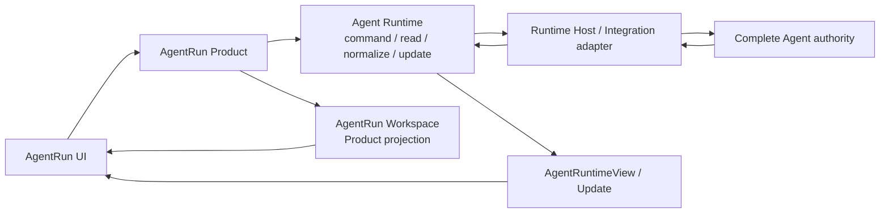

# Agent Runtime View 单一状态链路设计

## 1. Design Thesis

系统保留两个业务 aggregate：

1. AgentRun Product：拥有产品身份、AgentFrame、资源配置、流程和 Complete Agent association；
2. concrete Complete Agent：拥有 source、history、execution、context、effect 与 change。

Agent Runtime 位于两者之间，是 Application 可见的进程内 seam。它解析 Product association，
调用隐藏的 Complete Agent authority，并向上提供 normalized command/read/update interface。
它不形成第三个 durable aggregate。

前端只建立一条 `AgentRuntimeConnection`。该 module 从 Agent Runtime view/update 合同维护当前
AgentRun target 的可重建 read model，并向 Feed、Composer 和 Interaction UI 提供 selectors。

## 2. Canonical Language

| 术语 | 含义 | 可见范围 |
| --- | --- | --- |
| AgentRun | Product aggregate 与用户工作坐标 | Product、Application、UI |
| Agent Runtime | command/read/update 的进程内平台 seam | Application；UI 通过 AgentRun route 间接消费 |
| Complete Agent | source/history/execution 的事实 owner | Runtime Host 与 Integration adapter 内部 |
| `AgentRuntimeView` | Agent Runtime 从 Complete Agent authority normalize 的可重建 read model | Application、API、UI |
| `AgentRuntimeConnection` | baseline、update lane、gap/reconnect 与 live overlay 的连接 module | 前端实现 |
| AgentRun Workspace | Product shell、Frame、resource、lineage 和 Workspace Module 组合视图 | Application、UI |

删除或替换以下误导性术语：

- `RuntimeSession`：会制造新的公开 aggregate；
- `ManagedRuntimeSnapshot`：`Managed` 来自已删除的 Runtime aggregate 设计，`Snapshot` 容易暗示
  Runtime 持有事实；
- `AgentRuntimeFeed`：实际是 Agent Runtime view/update connection。

## 3. Ownership and Dependency Direction



Runtime view 与 Product Workspace 可以在页面组合，但不能复制彼此的 owner facts：

- Runtime view 拥有当前 read model 中的 execution、active turn、interactions、command
  availability 与 canonical conversation；
- Workspace 拥有 Product shell、Frame、resource surface、model configuration、waiting items、
  subject/lineage 和静态 composer command binding；
- Workspace 的加载、刷新或失败不能改变 Runtime view；
- Runtime update 不重载整个 Workspace，只有明确的 Product/resource invalidation 才刷新对应
  Product projection。

## 4. Agent Runtime Contracts

### 4.1 Baseline

将 application-facing `ManagedRuntimeSnapshot` 硬切为 `AgentRuntimeView`。核心结构为：

```rust
pub struct AgentRuntimeView {
    pub thread_id: RuntimeThreadId,
    pub view_revision: RuntimeProjectionRevision,
    pub captured_at_ms: u64,
    pub lifecycle: AgentRuntimeLifecycleStatus,
    pub execution: AgentRuntimeExecutionView,
    pub interactions: Vec<AgentRuntimeInteraction>,
    pub operations: Vec<AgentRuntimeOperation>,
    pub source_binding: Option<AgentRuntimeSourceBindingEvidence>,
    pub authority: AgentRuntimeProjectionAuthority,
    pub fidelity: AgentRuntimeProjectionFidelity,
    pub command_availability:
        BTreeMap<AgentRuntimeCommandKind, AgentRuntimeCommandAvailability>,
    pub conversation: Vec<CanonicalConversationRecord>,
}

pub struct AgentRuntimeExecutionView {
    pub status: AgentRuntimeExecutionStatus,
    pub active_turn_id: Option<RuntimeTurnId>,
    pub latest_turn_id: Option<RuntimeTurnId>,
}
```

Complete Agent adapter 从 source state 显式填充 `AgentSnapshot.execution.active_turn_id`；
Runtime 从同一次 read 机械投影 `execution`。Runtime 与调用方都不扫描 conversation records
推断运行状态。

application-facing `ManagedRuntime*` 词汇统一改为 `AgentRuntime*`；`RuntimeThreadId` 等稳定坐标
保持不变。crate 名 `agentdash-agent-runtime-contract` 保持，因为它描述的确是 Agent Runtime seam。

### 4.2 Live update

当前 `AgentLiveEvent` 继续作为 Runtime 以下的 Complete Agent process-local transport，但不能直接
暴露给 UI。Runtime 对上输出：

```rust
pub struct AgentRuntimeUpdate {
    pub lane_sequence: RuntimeU64,
    pub view_revision: RuntimeProjectionRevision,
    pub execution: AgentRuntimeExecutionView,
    pub command_availability:
        BTreeMap<AgentRuntimeCommandKind, AgentRuntimeCommandAvailability>,
    pub interactions: Vec<AgentRuntimeInteraction>,
    pub presentations: Vec<CanonicalConversationRecord>,
}
```

要求：

- Complete Agent process-local live event 只负责唤醒 Runtime update lane；Application gateway
  收到事件后立即读取同一 source 的 authoritative Agent snapshot，并把其中的 control state 与
  本次 presentation record 组合成一个 update；
- `lane_sequence` 只负责当前连接内排序和去重，不伪装成 durable revision；
- reconnect、gap 或 lane replacement 必须重新读取 `AgentRuntimeView`；
- baseline read 是恢复合同；terminal presentation 会再触发一次 authoritative view convergence，
  用于覆盖 durable record 早于紧随其后 snapshot 可见的边界；
- frontend 不从 presentation event type 推断 execution 或 command availability。

`AgentLiveEvent` 不向 API/UI 暴露，也不携带 control。Application gateway 的 authoritative read
才是 update 中 execution、interaction 与 command availability 的来源；不得在 API/前端扫描
`turn_started`。

### 4.3 Routes

AgentRun-scoped API 使用：

```text
GET  /agent-runs/{run_id}/agents/{agent_id}/runtime/view
GET  /agent-runs/{run_id}/agents/{agent_id}/runtime/updates
POST /agent-runs/{run_id}/agents/{agent_id}/runtime/commands
```

项目未上线，旧 `/runtime/snapshot` 与 presentation-only `/runtime/live` 直接删除，不保留别名、
双轨或 fallback。

## 5. Frontend Deep Module

`AgentRuntimeConnection` 是唯一外部 seam：

```ts
type AgentRuntimeConnectionState = {
  target: AgentRunRuntimeTarget;
  lifecycle: "connecting" | "connected" | "reconnecting" | "closed";
  view: AgentRuntimeView | null;
  error: Error | null;
};

type AgentRuntimeConnection = {
  state(): AgentRuntimeConnectionState;
  subscribe(listener: () => void): () => void;
  refresh(): Promise<void>;
  execute(command: AgentRuntimeCommand): Promise<AgentRuntimeOperationReceipt>;
  close(): void;
};
```

React 层只提供 selectors：

- conversation selector：canonical records 与 ephemeral overlay；
- control selector：execution、active turn、command availability；
- interaction selector：pending interaction；
- connection selector：loading/reconnecting/error。

同一 target 只允许一个 connection owner。`useSessionStream` 不再创建第二条 feed connection；
`SessionChatView` 不再保存控制副作用 cursor。

Product/Task/title 等非 Runtime side effects 如仍需消费 presentation updates，必须按当前 update lane
的 `lane_sequence + presentation_id` 去重，并只产生 typed owner invalidation。它们不得修改 Runtime
control view。

## 6. Workspace and Composer

### 6.1 Workspace contract split

从 Workspace response 删除：

- `conversation.execution`；
- 动态 `conversation.commands[].enabled`；
- Runtime active turn 和 cancel availability 的副本；
- 由 Runtime snapshot identity 生成的 stale guard。

Workspace 保留或重组为静态 Product composer support：

```text
ownership
model_config
command_bindings(command_id -> AgentRuntimeCommandKind)
keyboard/placement/requires_input/executor_config_policy
waiting_items
resource_surface
diagnostics
```

`command_bindings` 是 Product UI command 与 Runtime command kind 的声明式映射，不推断执行状态。
最终 enabled 状态由 `AgentRuntimeView.command_availability` 机械选择。

### 6.2 Composer

- 发送/停止语义只读取 Runtime control selector；
- 停止按钮条件为 Runtime execution 处于可中断状态且 `interrupt` availability 为 available；
- Workspace background refresh 不再影响按钮；
- command submit/interrupt 通过 `AgentRuntimeConnection.execute`；
- 输入清理只处理本地 composer state，不触发 Runtime/Workspace refresh。

## 7. Reconnect and Ordering

1. 连接建立前读取 authoritative `AgentRuntimeView`；
2. 建立 update lane；
3. update 按 lane sequence 归约 control 与 presentation；
4. terminal presentation 可以触发 connection owner 的 baseline convergence，但 control 已随同一
   update 到达，不等待 history event 驱动；
5. reconnect/gap 关闭旧 lane、读取新 baseline，再建立新 lane；
6. 旧 lane 和旧 target update 由 generation/target fence 拒绝；
7. history 收缩只改变 conversation selector，不改变 execution/control selector。

## 8. Rejected Designs

- 新增 `RuntimeSession` aggregate：重复 AgentRun 与 Agent Runtime 语言。
- 前端公开 `CompleteAgentView`：泄漏 Runtime 以下的事实 owner 和 adapter 概念。
- 继续用 `turn_started`/`turn_completed` 刷新 Workspace：presentation 反向驱动 control。
- 只把数组下标换成 `AgentLiveEvent.sequence`：仍然让 presentation-only transport承担控制同步，
  且 sequence 会在进程重启后重置。
- 保留 Workspace execution 作为 fallback：形成第二状态 owner。
- 恢复 durable Runtime journal/change aggregate：违背已完成的 persistence authority 收口。

## 9. Compatibility and Migration

- 项目未上线，采用 contract hard cut，不提供兼容 DTO、route alias、dual read 或 fallback。
- 预计不修改数据库 schema，因此默认无数据库 migration。
- 如果实施中发现当前 API contract 持久化到 JSONB owner document，必须先确认字段 owner；只有
  实际 schema 变化才使用新的 forward migration，不修改既有 migration。

## 10. Risks

- Runtime update 的原子 observation 可能要求同时修改 Codex、Native 与 Remote Complete Agent
  adapter；这是本任务最高风险。
- Workspace command set 当前混合 Product presentation 与 Runtime availability，拆分时必须保持
  model requirement、ownership、keyboard 和 executor policy。
- `AgentRuntime*` 全量硬切会产生较大机械 diff；必须先修改 source contract，再统一生成 TS/schema，
  禁止手改生成物。
- title、Task、Workspace Module 等 typed side effects 仍需稳定 live identity，不能随控制链删除而
  丢失。
