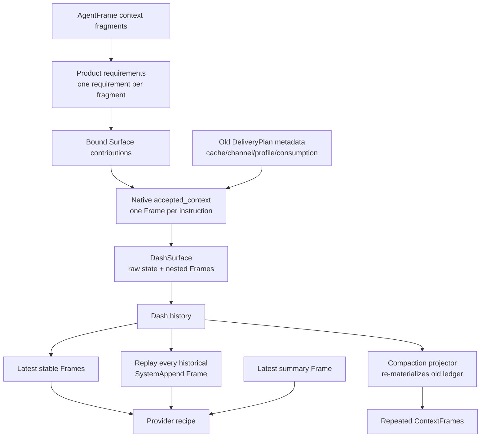
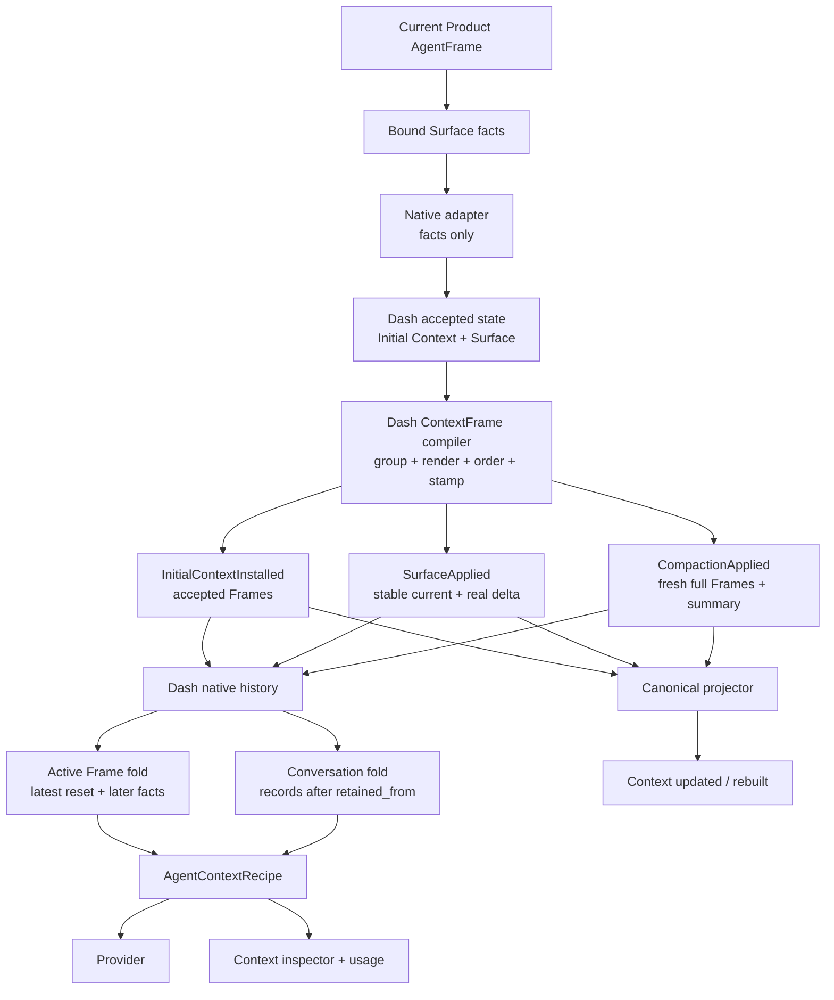

# ContextFrame 编译与压缩重建设计

## 1. 设计结论

ContextFrame不是上游context contribution的包装，也不是canonical conversation record。
它是Complete Agent已经接受并真正放入system context的一个语义单元。

本设计同时修正两个问题：

1. 正常流程按Agent语义编排Frame，而不是按来源逐条生成；
2. 成功压缩从当前accepted state重新编译一批新Frame，成为新的active baseline。

```text
accepted Initial Context + accepted Surface
  -> one Dash ContextFrame compiler
  -> semantic Frames actually consumed by Agent
  -> accepted History fact
  -> provider / inspector / canonical presentation
```

conversation始终走独立record lane。压缩通过`retained_from`裁剪provider message prefix，
并用Compaction Summary Frame映射被压缩历史。

## 2. Frame粒度

### 2.1 Stable semantic Frames

同一个active context中，以下stable kind各自最多一个Frame：

| Frame kind | 聚合内容 |
| --- | --- |
| `Identity` | intrinsic identity、Project Agent persona、agent prompt |
| `UserContext` | 当前操作者相关system context |
| `Environment` | workspace、VFS说明、runtime policy等环境来源 |
| `SystemGuidelines` | constraints、instructions、project guidelines |
| `AssignmentContext` | workflow、story、task及其他assignment来源 |
| `MemoryContext` | 以文本形式进入system context的memory来源 |

一个kind下可以有多个来源，但来源只作为有序fragments存在于Frame内部。Frame数量不随
contribution数量增长。

### 2.2 Transition Frame

一次Surface transition最多产生一个`CapabilityStateDelta` Frame，其中聚合：

- capability keys；
- tool schemas与tool paths；
- MCP、VFS、skills；
- memory inventory；
- companion agents、channels、workspace modules。

正常更新表达`previous → current`；首次接纳与压缩重建表达`empty → current`。

### 2.3 Occurrence Frames

`CompactionSummary`按发生事实保留，不按kind合并。它表达一次确定的历史映射，而非stable slot。
同理，未来若确有其他Agent消费的occurrence context，也必须以真实投递事实建模，不能因为kind相同
就覆盖。

## 3. main-reference取舍

main-reference值得继承的是语义聚合：

- 一个Identity Frame包含多个identity fragments；
- 一个Guidelines Frame包含多个来源section；
- 一个Capability Frame包含多个变化维度；
- Agent可见文本从同一结构化内容派生。

不继承它的`ContextFramePayload`对象族与`ContextDeliveryPlan`管线：

- 每个Frame kind一个builder/trait实现会把编排重新拆散；
- DeliveryPlan、cache policy、model channel、connector profile服务于已删除的
  RuntimeSession/Connector；
- 当前Dash provider不执行这些metadata，保留它们只会制造虚假状态。

目标是一个深编译模块，而不是恢复一组Frame builder和delivery planner。

## 4. 清理前架构



这里有三次边界泄漏：

1. upstream contribution粒度泄漏成Frame粒度；
2. Native adapter拥有Agent accepted Frame编排；
3. connector metadata被借来决定Dash history fold。

## 5. 清理后架构



没有新增Context snapshot、generation、ledger、batch或repository。发生边界继续由现有History
payload表达。

## 6. Dash ContextFrame Compiler

### 6.1 Module ownership

编译器移动到`agentdash-agent::dash`内部。Native integration只负责：

- 把Bound Surface payload转换成Dash instructions/tools；
- 调用Dash apply API；
- 把已接受的Dash history facts投影成backbone events。

Native不再预填`DashSurface.context_frames`，也不决定Frame分组、排序或delivery语义。

### 6.2 Use-case interface

不引入公开trait、planner或DTO，只暴露四个crate-internal use-case入口：

```rust
compile_initial_context(installation)
compile_surface_update(installation, current_surface, previous_surface)
compile_surface_revoke(installation, previous_surface)
compile_compaction_rebuild(installation, current_surface, summary)
```

它们共享一套内部流水线：

```text
collect accepted system sources
-> classify stable semantic kind
-> group by kind
-> preserve source order as fragments
-> compute capability sections
-> render exact Agent-visible text from content
-> stamp occurrence ID/status/time
-> canonical Vec order
```

调用方只表达发生了哪种accepted fact，不参与Frame内部编排。

### 6.3 Initial Context与Surface共同编译

Surface stable Frame必须同时读取当前Initial Context：

- Initial workflow与Surface assignment来源进入同一个Assignment Frame；
- Initial constraints与Surface guidelines进入同一个SystemGuidelines Frame；
- Surface更新后的stable Frame仍包含Initial来源，不会因按kind替换而丢失。

Initial Context中的Compaction Summary是独立occurrence Frame，不重复塞进每次Surface event。

### 6.4 Generic fragment section

当前Surface输入只提供`slot/label/order/source/content/context_usage_kind`这类通用fragment，
没有足够事实构造Environment、UserContext或ProjectGuidelines的旧专用section。

因此stable文本Frame统一使用一个通用fragment section：

```rust
ContextFrameSection::ContextFragments {
    fragments: Vec<RuntimeContextFragmentEntry>,
}
```

Frame kind负责表达Identity/Environment/Guidelines等语义，section负责保留来源与正文。删除当前
生产路径不使用的`Identity`、`AssignmentContext`、`Environment`、`UserPreferences`、
`ProjectGuidelines`与`UserContext` section，避免同一fragment模型复制到多个变体。

真正拥有typed事实的capability、memory inventory与compaction summary继续使用现有typed sections。
`rendered_text`严格从有序fragments/typed sections生成。

## 7. Accepted History Facts

Frame属于“本次Agent接受了什么”，而不是Initial Context或Surface来源对象的内嵌属性：

```rust
HistoryPayload::InitialContextInstalled {
    installation: InitialContextInstallation,
    context_frames: Vec<ContextFrame>,
}

HistoryPayload::SurfaceApplied {
    surface: DashSurface,
    context_frames: Vec<ContextFrame>,
}

HistoryPayload::SurfaceRevoked {
    surface: DashSurface,
    context_frames: Vec<ContextFrame>,
}

HistoryPayload::CompactionApplied {
    compaction_id: CompactionId,
    context_revision: ContextRevision,
    context_frames: Vec<ContextFrame>,
    retained_from: Option<HistoryEntryId>,
}
```

对应地：

- `InitialContextInstallation`只保留accepted source contributions；
- `DashSurface`只保留accepted instructions/tools/current state；
- History event保存该occurrence真正进入Agent上下文的Frames；
- `CompactionState`从`context_frames`中读取唯一summary，不再复制`summary_frame`。

这没有增加实体，只把Frame从错误的current-state嵌套位置移到正确的accepted occurrence上。

## 8. ContextFrame协议收缩

当前Complete Agent真正需要的核心是：

```rust
ContextFrame {
    id,
    kind,
    delivery_status,
    rendered_text,
    sections,
    created_at_ms,
}
```

`ContextDeliveryStatus`只保留生产上真实存在的`AppliedBeforePrompt`与
`AppliedToCompactedContext`，用于区分正常apply与compaction rebuild。排序由编译器产出的
accepted Vec保证，前端与provider都不得自行按旧phase metadata重排。

top-level `ContextFrameSource`也删除：生产路径只有`RuntimeContextUpdate`，真实provenance已经存在
于fragment/typed section与所属History occurrence中，保留固定枚举只增加第二套来源描述。

删除旧RuntimeSession planner残留：

- `ContextDeliveryPlan`、`ContextDeliveryTarget`、`ContextDeliveryEntry`；
- `ContextDeliveryMetadata`及delivery phase/order；
- `ContextCachePolicy`、cache key/revision；
- `ContextModelChannel`；
- `ContextAgentConsumption`及`SystemAppend/AuditOnly/Ignore`；
- `ContextConnectorProfile`；
- 固定值`ContextFrameSource`；
- 无生产语义的`phase_node`、`apply_mode`、delivery channel、message role；
- 只存在于旧fixture的Frame kind/section。

`frontend_label`由Frame kind直接映射。usage category同样从kind派生。

History event提供replace/append/reset语义：

- `SurfaceApplied/SurfaceRevoked`用payload中的stable Frames替换整个stable slot集合，
  因而被删除的kind不会残留；
- `SurfaceApplied`中的`CapabilityStateDelta`追加；
- `SurfaceRevoked`中的current-to-empty `CapabilityStateDelta`追加；
- `CompactionApplied`整体reset；
- `SurfaceRevoked`清除Surface scope。

所以active fold不再依赖connector metadata。

## 9. Normal ContextFrame Flow

### Initial install

1. Dash接受Initial Context source facts。
2. 编译器聚合其workflow/constraint来源。
3. `InitialContextInstalled`原子保存来源与accepted Frames。
4. projector原样发布这些Frames。

### Surface apply

1. Dash拿到current Initial Context、previous Surface与new Surface。
2. 编译器从Initial + current Surface生成每个stable kind的一个完整Frame。
3. capability部分生成`previous → current`的一个Delta Frame。
4. `SurfaceApplied`原子保存new Surface与本次accepted Frames。
5. active fold用stable Frames按kind替换，并追加Delta Frame。
6. projector比较previous/current stable semantic content，只发布真实变化；Delta按发生事实发布。

### Surface revoke

Surface revoke不再构造`agent_consumption=Ignore`的假ContextFrame。compiler从Initial Context与
previous Surface生成：

- Initial-only stable Frame集合；
- 一个`previous → empty`的CapabilityStateDelta。

`SurfaceRevoked`原子保存这些真正重新应用的Frames。active fold替换整个stable slot集合并追加
移除delta；canonical presentation原样发布它们，不把audit提示伪装成Agent输入。

## 10. Compaction Reset

Compaction成功时，编译器以`previous_surface=None`从当前Initial Context + current Surface重建：

```text
one stable Frame per current semantic kind
+ one empty-to-current CapabilityStateDelta
+ existing Initial occurrence context still required by active state
+ this CompactionSummary
```

所有本次重建Frame：

- 使用包含`compaction_id`的新occurrence ID；
- `delivery_status = AppliedToCompactedContext`；
- 使用本次accepted time；
- sections与rendered text来自同一次编译；
- 按compiler canonical order写入`CompactionApplied.context_frames`。

编译过程不读取旧`SurfaceApplied` delta ledger。

History fold验证：

- compaction active且尚未apply；
- Frame ID唯一、顺序canonical；
- 全部Frame属于当前rebuild occurrence；
- 存在且仅存在一个当前compaction的Summary section；
- summary、source digest、`retained_from`与`context_revision`一致。

只有随后的`CompactionCompleted`成功出现，该批Frames才成为active reset。

## 11. Active Frame Fold

| History fact | Active Frame effect |
| --- | --- |
| `InitialContextInstalled` | 安装initial Frames |
| `SurfaceApplied` | 用payload替换整个stable slot集合；CapabilityStateDelta追加 |
| `SurfaceRevoked` | 用Initial-only stable集合替换；current-to-empty delta追加 |
| successful `CompactionApplied + Completed` | 用payload Frames整体替换active baseline |

读取时定位latest successful compaction：

- 存在：从其`context_frames`开始，只fold其后的Surface facts；
- 不存在：从Initial install开始fold；
- failed/lost/cancelled或applied未completed：不改变baseline；
- 下一次successful compaction再次整体替换。

删除`accepted_surface_append_frames()`对会话起点的全历史扫描。

## 12. Conversation与Tools

conversation fold保持独立：

```text
latest successful compaction.retained_from
-> InputAccepted / AgentOutput / ToolCall / ToolResult
-> provider native messages
```

- 被压缩prefix不进入下一轮Agent context；
- retained suffix不转换为ContextFrame；
- canonical timeline继续投影原始records。

tools保持机器合同：

- current accepted Surface生成provider `tools[]`；
- 同一Surface由Frame compiler生成模型可读Tool Schema section；
- recipe组合两者，但不建立重复owner。

## 13. Projection与前端

### Normal update

`InitialContextInstalled`与`SurfaceApplied` projector只发布payload中的accepted Frames。Surface
stable comparison使用聚合后的semantic content，不再用单个instruction identity。

### Compaction reset

`CompactionApplied`直接：

```rust
accepted_context_events(&context_frames)
```

不调用recipe materializer，不重新扫描history。

### UI

- 保持backend accepted Vec的事件顺序，不使用已删除的delivery phase/order重排；
- 同一Frame展开多个fragments/typed sections；
- 批次含`AppliedToCompactedContext`时显示“上下文已重建”；
- 其他accepted批次显示“上下文已更新”；
- 不按kind、revision或文本隐藏重复。

如果后端违反“一stable kind一个Frame”，UI应如实暴露，测试在compiler边界失败，而不是前端去重。

## 14. Persistence Migration

旧Dash source JSONB同时存在：

- `DashSurface.context_frames`与`InitialContextInstallation.context_frames`嵌套形状；
- `CompactionApplied.summary_frame`；
- 带旧delivery planner metadata的ContextFrame。

这些数据无法通过字段改名得到可信的新accepted occurrence。采用预研期hard migration：

1. 找出所有`dash_complete_source`及其`lifecycle_agents.runtime_binding`。
2. 同事务清除Product binding和未终态Mailbox中的旧source/generation delivery evidence。
3. 清理不兼容的Dash source/effect。
4. 由正常Product provisioning重建新source。
5. runtime只反序列化新History payload与新ContextFrame协议，不提供双读或fallback。

## 15. Validation

### Compiler

- 多个Identity/Guidelines/Environment来源各自产生一个Frame、多个有序fragments。
- Initial workflow/constraints与Surface来源正确合并。
- `previous=None`生成完整capability/tool/memory/skill/MCP/VFS/companion sections。
- `previous=Some`只生成真实delta。
- rendered text严格由sections/fragments派生。

### History fold

- `S1 → S2 → compact`淘汰旧Delta链。
- `compact → S3`保留full baseline并追加`S2 → S3`。
- revoke、第二次compact、restart与fork结果确定。
- applied未completed、failed、lost、cancelled不reset。

### Vertical equivalence

```text
CompactionApplied.context_frames
  == canonical ContextFrameChanged batch
  == AgentContextRecipe.frames
  == provider Frame input
```

同时断言：

- recipe messages只含`retained_from`后的conversation；
- structured tools等于current Surface；
- usage不含旧Frame和被压缩records；
- protocol/frontend不存在旧DeliveryPlan metadata与parser fallback；
- audit-only事件不产生ContextFrame。

## 16. 风险

| Risk | Control |
| --- | --- |
| 聚合时破坏来源顺序 | 以accepted fragment order加稳定tie-break做compiler测试 |
| Surface stable替换丢失Initial来源 | Surface compiler强制输入current Initial Context并做纵向测试 |
| normal delta被reset逻辑清空 | `compact → later Surface update`测试锁定boundary |
| reset Frames与current tools漂移 | 同一current Surface编译并在provider capture中比较 |
| projector再次自行推导成员 | payload与canonical batch exact equality测试 |
| 协议清理漏掉旧fixture假消费者 | production-use inventory + TS/Rust compile gate |
| migration形成悬空binding | owner-invariant与正常reprovision集成测试 |
