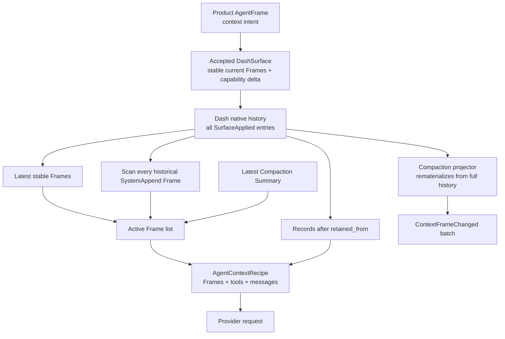
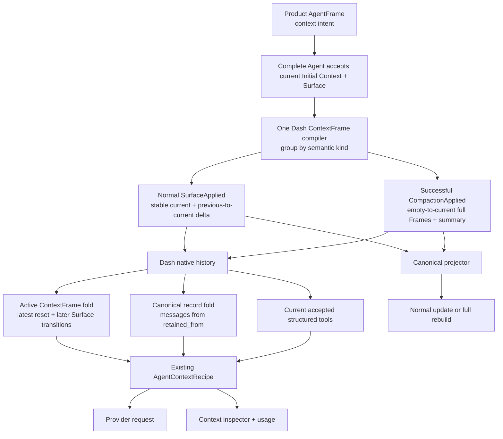

# ContextFrame 压缩重建架构基线

## 1. 事实边界

### ContextFrame lane

- `ContextFrame`包含 kind、delivery status/channel/metadata、`rendered_text`与typed sections，
  是 concrete Agent已经接纳的系统级上下文投递事实。
- Initial Context与`DashSurface`都在Agent native history中保存最终accepted ContextFrames。
- Capability、Tool Schema、Skill、MCP、VFS、Memory与Companion state已由
  `CapabilityStateDelta` sections表达；首次物化使用`empty → current`，正常revision使用
  `previous → current`。

### Conversation lane

- 用户输入、助手输出、ToolCall与ToolResult由`HistoryPayload`独立保存。
- `materialize_session_context_from_state()`从`retained_from`开始把这些records恢复为provider
  native messages。
- Context inspector的recipe本来就分别返回Frames、tools与messages，因此conversation不需要
  ContextFrame包装。

## 2. 当前实现证据

| 位置 | 当前事实 |
| --- | --- |
| `crates/agentdash-agent-protocol/src/backbone/context_frame.rs:11-28` | `ContextFrame`已经具备完整delivery与typed section载体 |
| `crates/agentdash-integration-native-agent/src/accepted_context.rs:17-39` | Surface Frame物化接收`current + previous` |
| `crates/agentdash-integration-native-agent/src/accepted_context.rs:17-109` | 每个instruction独立生成Frame；除Identity外都错误使用AssignmentContext section |
| `crates/agentdash-infrastructure/src/complete_agent_product_provisioning.rs:1115-1153` | AgentFrame fragment逐条映射为Surface instruction |
| `crates/agentdash-integration-native-agent/src/accepted_context.rs:115-175` | capability Frame按previous/current生成，并声明`SystemAppend` |
| `crates/agentdash-agent/src/dash/history.rs:64-93` | Initial Context与DashSurface都保存accepted ContextFrames |
| `crates/agentdash-agent/src/dash/history.rs:201-206` | `CompactionApplied`目前只保存一个`summary_frame` |
| `crates/agentdash-agent/src/dash/service.rs:3191-3250` | active Frames由latest stable、initial、append ledger与summary拼接 |
| `crates/agentdash-agent/src/dash/service.rs:3253-3277` | append ledger扫描全部历史Surface，直到revoke才清空 |
| `crates/agentdash-agent/src/dash/service.rs:3582-3746` | Frame fold与conversation record fold在同一recipe中保持不同类型 |
| `crates/agentdash-agent/src/dash/store.rs:143-231` | compaction apply/completed在同一次Dash commit中落盘 |
| `crates/agentdash-integration-native-agent/src/canonical_projection.rs:195-212` | compaction projector重新从history物化整批Frames |
| `packages/app-web/src/features/session/ui/ContextFrameStream.tsx:35-55` | 前端只排序并完整展示后端声明的连续Frame批次 |

## 3. 当前架构

问题是压缩成功没有保存“reset后新接受的Frame集合”。因此active recipe和projector只能继续读取
压缩前的append ledger；界面如实显示了这份错误的后端事实。

同时，正常路径把每个upstream fragment物化为一个Frame，导致同一Agent语义被来源边界切碎；
Native adapter因此错误拥有了Complete Agent的Frame编排。

## 4. 目标架构

目标结构没有新增domain entity：

- 正常更新仍是`SurfaceApplied`；
- reset仍是`CompactionApplied + CompactionCompleted`；
- 系统上下文仍是`ContextFrame`；
- conversation仍是原有history records；
- query仍使用现有`AgentContextRecipe`。

变化只是让`CompactionApplied`保存它真正接受的完整Frame序列，并让active fold从最近一次成功reset
开始读取；同时把同类来源聚合到Frame内部，并让accepted Frames归属History occurrence而非
Initial Context/Surface来源对象。

## 5. 正常更新与reset的统一规则

用`F(S)`表示从empty物化Surface `S`的完整Frame，用`Δ(A,B)`表示正常更新delta：

| 发生事实 | Active system context |
| --- | --- |
| 首次接纳`S1` | semantic-stable(`Initial + S1`) + `F(S1)`中的完整capability Frame |
| 正常更新到`S2` | semantic-stable(`Initial + S2`) + 已投递链 + `Δ(S1,S2)` |
| 成功压缩`C1` | fresh semantic-stable(`Initial + S2`) + `F(S2)` + Summary(`C1`) |
| 压缩后更新到`S3` | semantic-stable(`Initial + S3`) + `F(S2)` + `Δ(S2,S3)` + Summary(`C1`) |
| 再次成功压缩`C2` | fresh semantic-stable(`Initial + S3`) + `F(S3)` + Summary(`C2`) |

因此正常delta保留Agent在当前context内真实经历的更新；压缩发生时才清除旧链并重建当前全量状态。

## 6. 结论

1. retained conversation继续属于record层，不进入ContextFrame。
2. `CompactionApplied`必须成为reset Frame批次的事实源。
3. Frame compiler必须聚合Initial Context与Surface，同一stable kind最多一个Frame。
4. main-reference只复用语义聚合，不恢复已删除RuntimeSession的DeliveryPlan管线。
5. compaction调用与正常Surface相同的compiler，只把previous设为empty。
6. provider/query/usage从latest successful reset开始归约；canonical projector直接发布accepted
   payload。
7. 前端只根据现有delivery status区分“更新”与“重建”，无需过滤重复数据。
