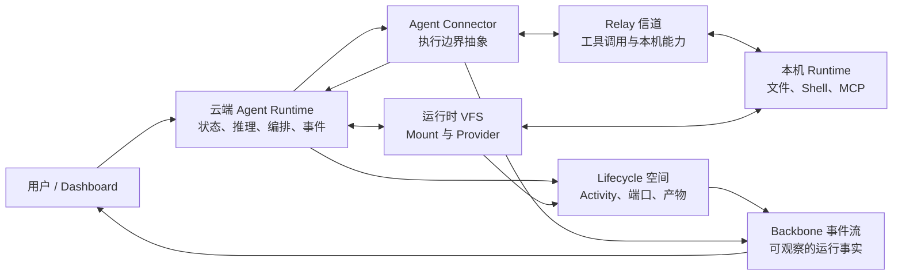
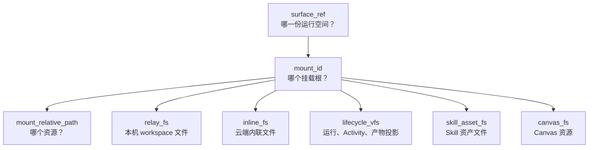
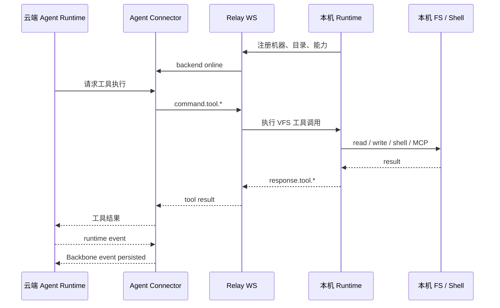
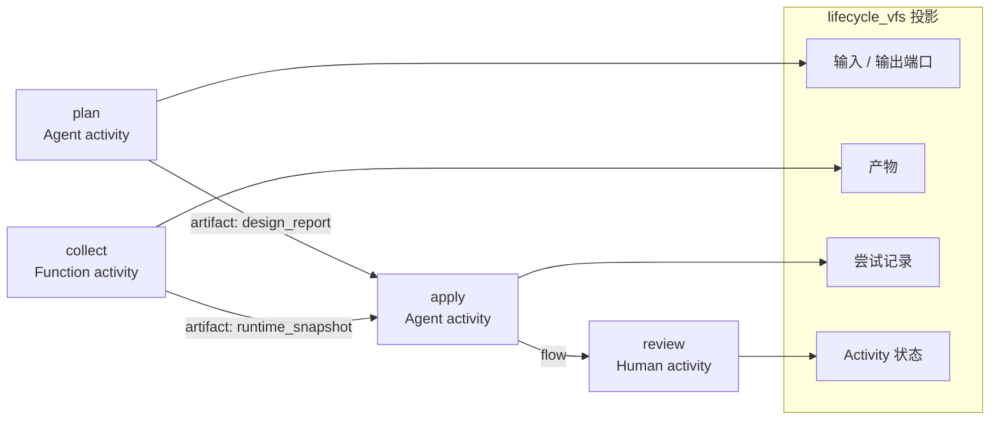

# AgentDash


**AgentDash 是面向 AI Agent 运行过程的空间化控制平面。**

它不是“把很多 Agent 放进一个列表”的看板，而是把 Agent 的工作过程放进一套可寻址、可观察、可恢复的运行空间里。

```text
VFS 空间决定 Agent 在哪里读写。
Agent Connector 把云端 Agent Runtime 接到不同执行边界。
Relay 信道让工具调用安全抵达本机。
Lifecycle 空间把多步骤工作变成端口、产物和事件。
```

## 运行时形态



## 为什么需要它

| 普通 Agent Runner | AgentDash |
| --- | --- |
| 在某个目录里启动 CLI | 每轮执行前构建运行空间 |
| 把文件当成本机路径 | 通过 VFS mount 暴露资源 |
| 把日志当作副产物流出 | 把 Backbone event 持久化为运行事实 |
| 靠约定串联步骤 | 通过端口和产物推进 lifecycle 状态 |
| 云端和本机边界含混 | 云端持有状态真相，本机负责实际执行 |

`Project` 和 `Story` 是有用的产品入口，但不是核心假设。真正稳定的中心是 **云端 Agent Runtime + Agent Connector + VFS + Relay + Lifecycle + 事件流**。

## VFS 空间

AgentDash 让所有运行时资源拥有同一种地址形态：

```text
surface_ref / mount_id / mount_relative_path
```



关键点：UI、API、云端 Agent tool、MCP adapter 和 Lifecycle activity 都说同一种 mount 语言。

## Agent Connector

AgentDash 的核心执行主体是云端 Agent Runtime。Connector 层负责把同一份 `ExecutionContext` 投影到不同执行边界，而不是让产品主线绑定到某一种 Agent 进程形态。


外部 Agent 可以被接入，但它只是 Connector 的一个适配方向。AgentDash 更重要的能力，是在云端 Agent Runtime 内直接使用 VFS、Lifecycle、Runtime Gateway 和事件流。

## Relay 信道

云端拥有状态和 Agent Runtime，本机拥有机器资源。Relay 是工具调用抵达本机的边界，不是产品中心。



## Lifecycle 空间

Lifecycle 不是任务清单，而是一张带有显式数据流的可执行 activity graph。



所有推进都以事件形式进入 `LifecycleEngine`。Agent、Function、Human activity 都不直接改写运行状态。

## 产品界面

| 界面 | 展示内容 |
| --- | --- |
| Agent 工作台 | 云端 Agent Runtime、Live session、执行状态、运行时事件流 |
| Assets | Lifecycle 模板、VFS mount、Skill、MCP preset、Canvas 资产 |
| Lifecycle 编辑器 | Activity graph、端口、Transition、运行状态 |
| VFS 浏览器 | 本机、云端、资产、Lifecycle 空间中的挂载资源 |
| 本机 Runtime 设置 | 机器身份、可访问目录、Relay 健康状态、本机能力 |

## 其它能力

这些能力围绕运行时主链展开，但不是 README 的叙事中心：

| 能力 | 用途 |
| --- | --- |
| Shared Library / Marketplace | 管理可复用的 Agent、Workflow、Skill 等资产来源 |
| MCP Preset | 为 Session / Agent Runtime 组织外部工具入口 |
| Canvas | 承载可运行的前端资产和可视化结果 |
| Routine | 用定时、Webhook 或插件事件触发运行过程 |
| Hook Runtime | 在执行边界注入约束、上下文、完成判定和后续动作 |
| Desktop Shell | 通过 Tauri 托管 Dashboard 与本机 Runtime 管理面 |

## 运行主链

```mermaid
flowchart LR
    Command["LaunchCommand"]
    Plan["SessionConstructionPlan"]
    Exec["LaunchExecution"]
    Context["ExecutionContext"]
    Connector["Agent Connector"]
    Runtime["Agent / Function Runtime"]
    Events["BackboneEnvelope"]
    UI["Dashboard"]

    Command --> Plan --> Exec --> Context --> Connector --> Runtime --> Events --> UI
```



查询视图和真实 Agent 启动应来自同一份 construction facts。

## 代码地图

```text
crates/
  agentdash-application      Session、VFS、Lifecycle、Runtime Gateway
  agentdash-api              REST、NDJSON、WebSocket endpoint
  agentdash-relay            云端 / 本机共享 Relay 协议类型
  agentdash-local            本机 Runtime、工具、MCP、Shell / 文件
  agentdash-executor         Agent Connector 与执行适配
  agentdash-agent-protocol   Backbone 事件协议
  agentdash-agent            云端 Agent Runtime

packages/
  app-web                    Web Dashboard
  app-tauri                  桌面端壳
  core / ui / views          共享前端包
```

## 运行

```bash
pnpm install
pnpm dev
```

`pnpm dev` 会编译 Rust binary，然后依次启动云端后端、本机 runtime 和 Web Dashboard。

| 服务 | 地址 |
| --- | --- |
| Cloud API | `http://127.0.0.1:3001` |
| Web Dashboard | `http://127.0.0.1:5380` |

Rust 后端修改后需要完整重启。

## 检查

```bash
pnpm run check
```

常用分项：

```bash
pnpm run backend:check
pnpm run backend:test
pnpm run frontend:check
pnpm run frontend:test
```

## 延伸阅读

- [VFS 访问契约](.trellis/spec/backend/vfs/vfs-access.md)
- [VFS 本机物化](.trellis/spec/backend/vfs/vfs-materialization.md)
- [Session 启动主链](.trellis/spec/backend/session/session-startup-pipeline.md)
- [Activity Lifecycle](.trellis/spec/backend/workflow/activity-lifecycle.md)
- [Lifecycle Edge 契约](.trellis/spec/backend/workflow/lifecycle-edge.md)
- [Backbone Protocol](.trellis/spec/cross-layer/backbone-protocol.md)
- [Relay Protocol](docs/relay-protocol.md)

## License

MIT
