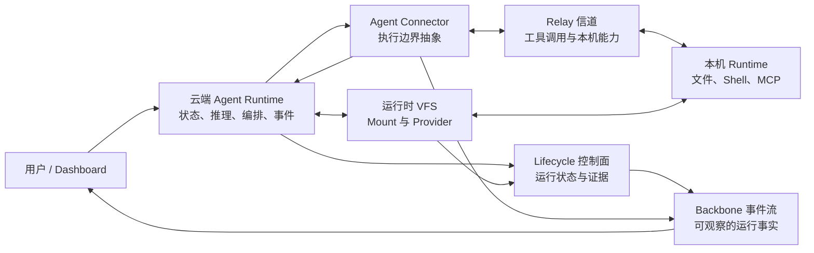
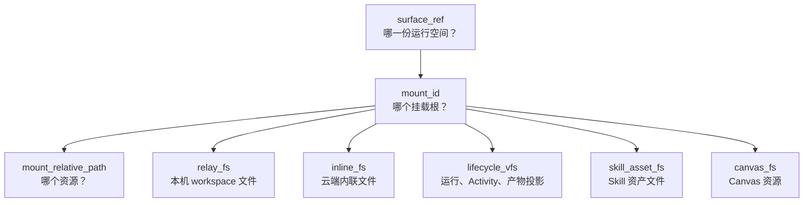
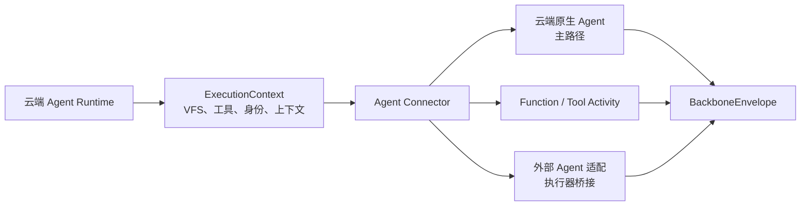
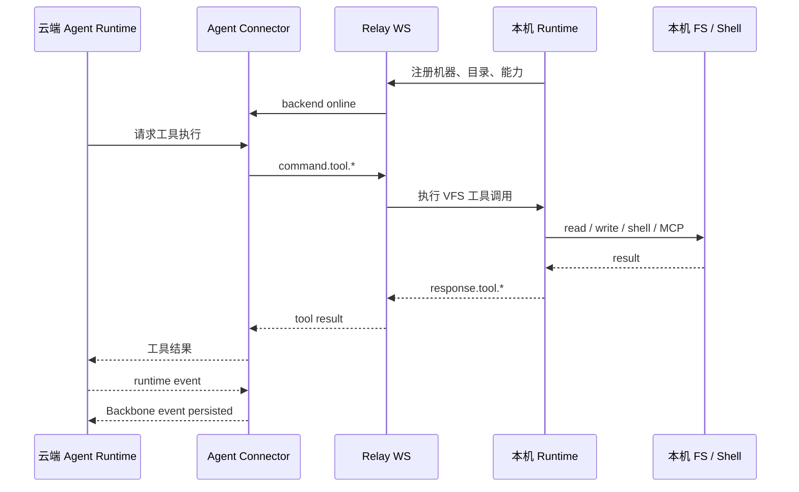
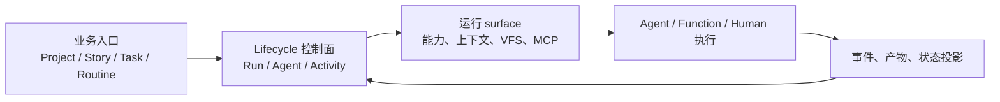

# AgentDash


**AgentDash 是面向 AI Agent 工作生命过程的 Lifecycle 控制面。**

它不是“把很多 Agent 放进一个列表”的看板，也不是把会话记录包装成项目管理工具。AgentDash 把业务对象、运行拓扑、运行空间和事件证据收敛成可寻址、可观察、可恢复的控制面。

## 运行时形态



## 为什么需要它

| 普通 Agent Runner | AgentDash |
| --- | --- |
| 从会话或日志倒推业务归属 | 业务入口先进入 Lifecycle 控制面 |
| 把 session 当成任务状态真相 | 控制面记录状态，事件流提供证据 |
| 每次启动临时拼 prompt / tools | 运行前生成稳定的上下文和能力投影 |
| 靠列表顺序串联步骤 | 复杂 SOP 展开成显式 Activity graph |
| 本机路径和工具直接暴露给 Agent | 通过 VFS、MCP 和 capability projection 进入运行空间 |
| 云端和本机边界含混 | 云端持有控制面事实，本机负责物理执行 |

`Project`、`Story`、`Task`、`Routine` 都是有用的业务入口，但它们不拥有 runtime truth。真正稳定的中心是 **Lifecycle 控制面、运行 surface、Connector 投递和事件流**。

## 核心模块概览

| 模块 | 为什么存在 | 边界 |
| --- | --- | --- |
| Lifecycle 控制面 | 记录一次工作的业务归属、运行状态、Agent / Activity 和事件证据 | 不等同于聊天 session，也不是任务清单 |
| AgentRun 工作台 | 让用户、Agent 和子 Agent 面向同一运行身份协作 | `RuntimeSession` 只承载消息流和 connector trace |
| Runtime Surface / Frame | 在启动期把身份、guidelines、VFS、能力、SkillAsset 和上下文投影成执行空间 | 投影服务本次执行，不替代控制面事实 |
| VFS / Surface Projector | 统一本机、云端、资产、Lifecycle、Skill、Canvas 等资源地址 | UI、API、tool、MCP adapter 使用同一种 mount 语言 |
| Connector / Runtime Gateway | 把运行 surface 投递到云端 Agent、Function / Tool Activity 或外部执行适配器 | Connector 不拥有业务状态 |
| Backbone 事件流 | 承载 runtime facts、工具调用、上下文用量、压缩和 UI reducer 所需的观察事实 | 事件是证据，不是业务对象本身 |
| Story / Task Subject | Story 管主题和上下文；Task 管 `LifecycleRun.tasks` 内的 run-scoped 计划项 | 二者不拥有 runtime truth |
| Asset / Workspace Module | Workflow、MCP Preset、Skill、VFS Mount、Canvas、Extension 等进入 runtime surface 的来源 | 资产定义能力，运行时由控制面投影和裁切 |
| Permission / Backend Access | 管理 Project 授权、本机 backend 可用性、能力授权和 extension runtime 权限 | 授权事实由控制面与 permission grant 表达 |

## VFS 空间

AgentDash 让所有运行时资源拥有同一种地址形态：

```text
surface_ref / mount_id / mount_relative_path
```



关键点：UI、API、云端 Agent tool、MCP adapter 和 Lifecycle activity 都说同一种 mount 语言。

## Agent Connector

AgentDash 的核心执行主体是云端 Agent Runtime。Connector 层负责把运行 surface 和 launch projection 生成的 `ExecutionContext` 投影到不同执行边界，而不是让产品主线绑定到某一种 Agent 进程形态。



外部 Agent 可以被接入，但它只是 Connector 的一个适配方向。AgentDash 更重要的能力，是在云端 Agent Runtime 内直接使用 VFS、Lifecycle、Runtime Gateway 和事件流。

## Relay 信道

云端拥有状态和 Agent Runtime，本机拥有机器资源。Relay 是工具调用抵达本机的边界，不是产品中心。



## Lifecycle 控制面

Lifecycle 不是任务清单，也不等同于单条聊天会话。它记录一次工作生命过程：谁发起、运行到哪里、当前 Agent 使用哪份能力和上下文、哪些事件构成执行证据。

普通 Agent 会话不需要强行制造工作流图；复杂 SOP 可以展开为显式 Activity graph。两者都回到同一套控制面，因此 Dashboard、API、取消、恢复、审计和业务投影不需要从 session 标题或日志内容倒推归属。

查询视图和真实 Agent 启动来自同一份控制面事实。启动期可以生成 `ExecutionContext` 等投递投影，但它们服务本次执行，不替代 Lifecycle 对业务归属、运行状态和事件证据的表达。



## 产品界面

| 界面 | 展示内容 |
| --- | --- |
| Agent 工作台 | ProjectAgent、Draft AgentRun、AgentRun Workspace、运行状态、mailbox、Task 状态、lineage 和运行时事件流 |
| Story / Subject 视图 | 面向主题、上下文和运行投影的管理入口；执行事实回到 Lifecycle / AgentRun |
| Assets | Workflow、Marketplace、Canvas、MCP Preset、Skill、VFS Mount、Extension 等项目级资产 |
| Routine | 定时、Webhook 或插件事件触发的自动化入口，绑定 ProjectAgent 和运行模板 |
| Lifecycle 编辑器 | Workflow / Activity graph、端口、edge、能力、注入、Hook rules 和运行状态 |
| Workspace Panel | AgentRun 右侧运行空间，承载 Context、Inspector、Canvas、VFS、Terminal 和 Extension tab |
| Project 设置 | Project 基础信息、Backend Access、Workspace binding、VFS 资源、Workspace Modules、共享、模板和 clone |
| Settings / 本机 Runtime | 系统、用户和 desktop-only 本机 runtime 设置；包含机器身份、可访问目录、Relay 健康状态和本机能力 |

## 其它能力

这些能力围绕运行时主链展开，但不是 README 的叙事中心：

| 能力 | 用途 |
| --- | --- |
| Shared Library / Marketplace | 管理可复用的 Agent、Workflow、Skill、MCP、VFS Mount、Extension 等资产来源与安装状态 |
| Extension / Workspace Module | 让项目安装的扩展贡献 UI entry、runtime operation、Workspace Panel tab 和 Agent 可发现能力 |
| MCP Preset / MCP Server | MCP Preset 组织 runtime surface 的外部工具入口；`agentdash-mcp` 提供协议入口 |
| Canvas | 承载可运行的前端资产、可视化结果和可提升为 Extension 的模块 |
| Task 工具集 | `task_read` / `task_write` 让 Agent 维护 `LifecycleRun.tasks`，UI、Story projection 和 agent-facing 工具同源 |
| Permission Grant | 管理 Project、Backend、能力申请和 extension runtime 权限的授权事实 |
| Backend Access | 管理项目可使用的本机 backend、workspace inventory、执行 lease 和 runtime health |
| Hook Runtime | 在执行边界注入约束、上下文、完成判定和后续动作 |
| Contract Generation | Rust contract crate 生成前端 TS DTO，并通过 `contracts:check` 防止跨层漂移 |
| Background Workers | 驱动 routine scheduler、terminal effect replay、stall detector、auth cleanup 等云端后台过程 |
| Desktop Shell | 通过 Tauri 托管 Dashboard 与本机 Runtime 管理面 |

## 代码地图

```text
crates/
  agentdash-domain           领域模型：Project、Story、Lifecycle、AgentRun、Permission、Asset
  agentdash-application      用例编排、runtime surface、Session、VFS、Lifecycle、Runtime Gateway
  agentdash-application-ports application 层外部端口
  agentdash-api              REST、NDJSON、WebSocket endpoint
  agentdash-infrastructure   PostgreSQL、migration、repository 实现
  agentdash-contracts        Rust 到 TypeScript 的跨层契约生成
  agentdash-spi              平台 SPI、Hook、MCP、Skill、Routine 等扩展边界
  agentdash-relay            云端 / 本机共享 Relay 协议类型
  agentdash-local            本机 Runtime、工具、MCP、Shell / 文件
  agentdash-local-tauri      桌面端本机 Runtime 壳
  agentdash-executor         Agent Connector 与执行适配
  agentdash-mcp              MCP 服务层
  agentdash-integration-api  外部集成 API
  agentdash-first-party-integrations 一方集成
  agentdash-agent-protocol   Backbone 事件协议
  agentdash-agent            云端 Agent Runtime
  agentdash-agent-types      Agent Runtime 共享类型

packages/
  app-web                    Web Dashboard，入口在 packages/app-web/src/App.tsx
  app-tauri                  桌面端壳
  core / ui / views          共享前端能力、设计系统和视图组件
  extension-sdk / extension-ui / extension-dev  Extension 开发与运行时包
```

## 运行

```bash
pnpm install
pnpm dev
```

`pnpm dev` 会编译 Rust binary，然后依次启动云端后端、本机 runtime 和 Web Dashboard。

| 服务 | 地址 |
| --- | --- |
| Cloud API | `http://127.0.0.1:3001` |
| Web Dashboard | `http://127.0.0.1:5380` |

Rust 后端修改后需要完整重启。

## 检查

```bash
pnpm run check
```

常用分项：

```bash
pnpm run backend:check
pnpm run backend:test
pnpm run frontend:check
pnpm run frontend:test
```

## 延伸阅读

- [VFS 访问契约](.trellis/spec/backend/vfs/vfs-access.md)
- [VFS 本机物化](.trellis/spec/backend/vfs/vfs-materialization.md)
- [项目总览](.trellis/spec/project-overview.md)
- [Workflow Architecture](.trellis/spec/backend/workflow/architecture.md)
- [Lifecycle Subject Association](.trellis/spec/backend/workflow/lifecycle-run-link.md)
- [Execution Context Frames](.trellis/spec/backend/session/execution-context-frames.md)
- [Session 启动主链](.trellis/spec/backend/session/session-startup-pipeline.md)
- [Activity Lifecycle](.trellis/spec/backend/workflow/activity-lifecycle.md)
- [Lifecycle Edge 契约](.trellis/spec/backend/workflow/lifecycle-edge.md)
- [Backbone Protocol](.trellis/spec/cross-layer/backbone-protocol.md)
- [Relay Protocol](docs/relay-protocol.md)

## License

MIT
