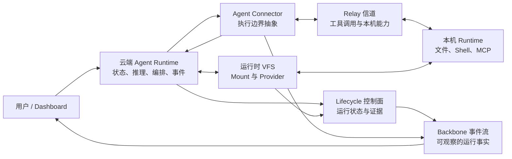
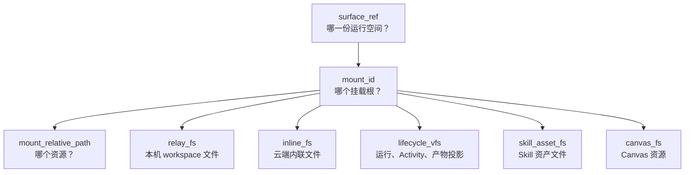
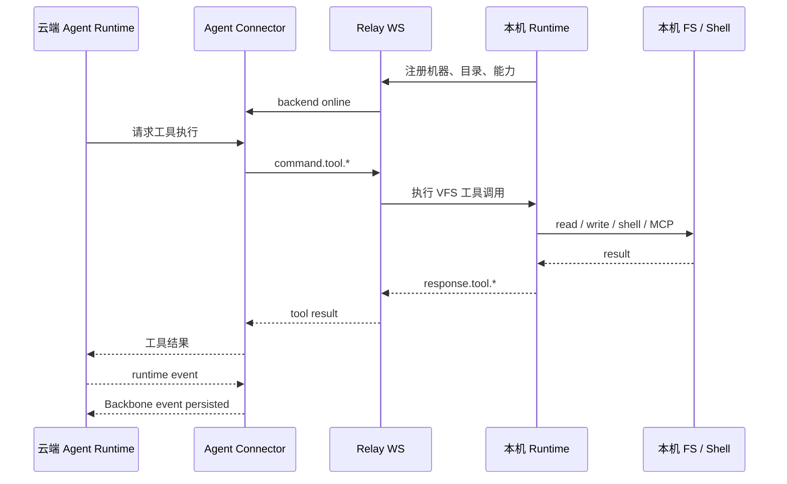
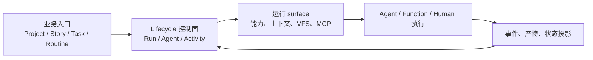

# AgentDash


**AgentDash 是面向 AI Agent 工作生命过程的 Lifecycle 控制面。**

它不是“把很多 Agent 放进一个列表”的看板，也不是把会话记录包装成项目管理工具。AgentDash 把业务对象、运行拓扑、运行空间和事件证据收敛成可寻址、可观察、可恢复的控制面。

## 运行时形态



## 为什么需要它

| 普通 Agent Runner | AgentDash |
| --- | --- |
| 从会话或日志倒推业务归属 | 业务入口先进入 Lifecycle 控制面 |
| 把 session 当成任务状态真相 | 控制面记录状态，事件流提供证据 |
| 每次启动临时拼 prompt / tools | 运行前生成稳定的上下文和能力投影 |
| 靠列表顺序串联步骤 | 复杂 SOP 展开成显式 Activity graph |
| 本机路径和工具直接暴露给 Agent | 通过 VFS、MCP 和 capability projection 进入运行空间 |
| 云端和本机边界含混 | 云端持有控制面事实，本机负责物理执行 |

`Project`、`Story`、`Task`、`Routine` 都是有用的业务入口，但它们不拥有 runtime truth。真正稳定的中心是 **Lifecycle 控制面、运行 surface、Connector 投递和事件流**。

## VFS 空间

AgentDash 让所有运行时资源拥有同一种地址形态：

```text
surface_ref / mount_id / mount_relative_path
```



关键点：UI、API、云端 Agent tool、MCP adapter 和 Lifecycle activity 都说同一种 mount 语言。

## Agent Connector

AgentDash 的核心执行主体是云端 Agent Runtime。Connector 层负责把运行 surface 和 launch projection 生成的 `ExecutionContext` 投影到不同执行边界，而不是让产品主线绑定到某一种 Agent 进程形态。


外部 Agent 可以被接入，但它只是 Connector 的一个适配方向。AgentDash 更重要的能力，是在云端 Agent Runtime 内直接使用 VFS、Lifecycle、Runtime Gateway 和事件流。

## Relay 信道

云端拥有状态和 Agent Runtime，本机拥有机器资源。Relay 是工具调用抵达本机的边界，不是产品中心。



## Lifecycle 控制面

Lifecycle 不是任务清单，也不等同于单条聊天会话。它记录一次工作生命过程：谁发起、运行到哪里、当前 Agent 使用哪份能力和上下文、哪些事件构成执行证据。

普通 Agent 会话不需要强行制造工作流图；复杂 SOP 可以展开为显式 Activity graph。两者都回到同一套控制面，因此 Dashboard、API、取消、恢复、审计和业务投影不需要从 session 标题或日志内容倒推归属。

查询视图和真实 Agent 启动来自同一份控制面事实。启动期可以生成 `ExecutionContext` 等投递投影，但它们服务本次执行，不替代 Lifecycle 对业务归属、运行状态和事件证据的表达。



## 产品界面

| 界面 | 展示内容 |
| --- | --- |
| Agent 工作台 | Agent run、Live session、执行状态、运行时事件流 |
| Project / Story / Task 视图 | 面向项目下 Agent 事务的管理入口 |
| Assets | Workflow、Agent procedure、VFS mount、Skill、MCP preset、Canvas 资产 |
| Lifecycle 编辑器 | Activity graph、端口、edge 和运行状态 |
| VFS 浏览器 | 本机、云端、资产、Lifecycle 控制面中的挂载资源 |
| 本机 Runtime 设置 | 机器身份、可访问目录、Relay 健康状态、本机能力 |

## 其它能力

这些能力围绕运行时主链展开，但不是 README 的叙事中心：

| 能力 | 用途 |
| --- | --- |
| Shared Library / Marketplace | 管理可复用的 Agent、Workflow、Skill 等资产来源 |
| MCP Preset | 为 Agent runtime surface 组织外部工具入口 |
| Canvas | 承载可运行的前端资产和可视化结果 |
| Routine | 用定时、Webhook 或插件事件触发运行过程 |
| Hook Runtime | 在执行边界注入约束、上下文、完成判定和后续动作 |
| Desktop Shell | 通过 Tauri 托管 Dashboard 与本机 Runtime 管理面 |

## 代码地图

```text
crates/
  agentdash-application      Session、VFS、Lifecycle、Runtime Gateway
  agentdash-api              REST、NDJSON、WebSocket endpoint
  agentdash-relay            云端 / 本机共享 Relay 协议类型
  agentdash-local            本机 Runtime、工具、MCP、Shell / 文件
  agentdash-executor         Agent Connector 与执行适配
  agentdash-agent-protocol   Backbone 事件协议
  agentdash-agent            云端 Agent Runtime

packages/
  app-web                    Web Dashboard
  app-tauri                  桌面端壳
  core / ui / views          共享前端包
```

## 运行

```bash
pnpm install
pnpm dev
```

`pnpm dev` 会编译 Rust binary，然后依次启动云端后端、本机 runtime 和 Web Dashboard。

| 服务 | 地址 |
| --- | --- |
| Cloud API | `http://127.0.0.1:3001` |
| Web Dashboard | `http://127.0.0.1:5380` |

Rust 后端修改后需要完整重启。

## 检查

```bash
pnpm run check
```

常用分项：

```bash
pnpm run backend:check
pnpm run backend:test
pnpm run frontend:check
pnpm run frontend:test
```

## 延伸阅读

- [VFS 访问契约](.trellis/spec/backend/vfs/vfs-access.md)
- [VFS 本机物化](.trellis/spec/backend/vfs/vfs-materialization.md)
- [项目总览](.trellis/spec/project-overview.md)
- [Workflow Architecture](.trellis/spec/backend/workflow/architecture.md)
- [Lifecycle Subject Association](.trellis/spec/backend/workflow/lifecycle-run-link.md)
- [Execution Context Frames](.trellis/spec/backend/session/execution-context-frames.md)
- [Session 启动主链](.trellis/spec/backend/session/session-startup-pipeline.md)
- [Activity Lifecycle](.trellis/spec/backend/workflow/activity-lifecycle.md)
- [Lifecycle Edge 契约](.trellis/spec/backend/workflow/lifecycle-edge.md)
- [Backbone Protocol](.trellis/spec/cross-layer/backbone-protocol.md)
- [Relay Protocol](docs/relay-protocol.md)

## License

MIT
