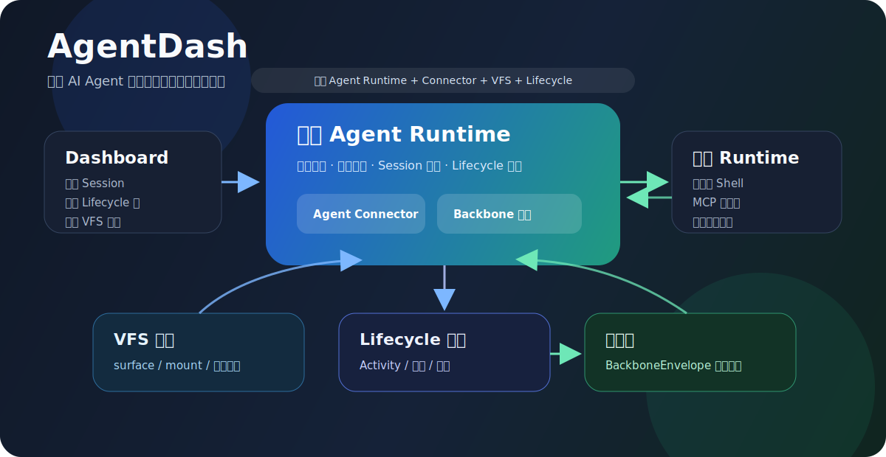

# AgentDash

English | [简体中文](README.zh-CN.md)



AgentDash is an enterprise-ready agent workspace platform for turning AI agent
work from scattered chats and local processes into governed, extensible,
observable workspaces.

It gives every piece of agent work a home: a Project, an AgentRun workspace, a
durable mailbox, a runtime surface, local or server-side execution, extension
modules, and an evidence stream that can be inspected, resumed, shared, and
automated.

## The Idea

AI agents are becoming teammates, but most agent tools still behave like
temporary terminals: launch a process, stream a chat, hope the logs are enough.
That breaks down when a team needs shared projects, private workspaces,
server-side runners, reusable capabilities, human review, automation, and
traceable execution.

AgentDash starts from a different assumption:

> Agent work should be a managed workspace with identity, permissions,
> capabilities, runtime context, artifacts, and audit evidence.

This makes AgentDash a fit for enterprise collaboration and platform extension,
not only for personal agent experiments.

## What Makes It Different

| Capability | What AgentDash Adds |
| --- | --- |
| Project-centered collaboration | Projects anchor permissions, settings, agents, assets, workspace bindings, runner access, and shared context. |
| AgentRun workspaces | Each run gets a workspace with chat, mailbox, lifecycle trace, VFS, terminal output, inspector panels, canvas, and extension tabs. |
| Durable mailbox | Human input, companion responses, routine triggers, hooks, and system commands enter one recoverable delivery channel instead of ad hoc chat events. |
| Cloud/local execution | The cloud owns control-plane facts; desktop, local, or server runners connect outward and execute close to the workspace. |
| Runtime surfaces | VFS mounts, MCP servers, skills, context frames, capabilities, and workspace modules are projected before an agent starts. |
| Extension platform | Packaged TypeScript extensions can add runtime actions, protocol channels, workspace panels, permissions, and agent-visible operations. |
| Workspace modules | Extensions, canvases, and platform capabilities become unified modules agents can list, inspect, invoke, and present. |
| Evidence-first events | Connector output is normalized into Backbone events for streaming, replay, UI rendering, bounded artifacts, and audit. |

## Core Experience

### For Teams

- Create a Project as the collaboration and permission boundary.
- Share the Project with users or groups.
- Attach workspace bindings and runner access.
- Configure project agents, skills, MCP presets, VFS mounts, routines, canvases,
  workflows, and extensions.
- Start an AgentRun and keep the conversation, mailbox, runtime evidence,
  artifacts, and workspace tools together.

### For Agent Operators

- Run agents against cloud-owned context while executing tools on authorized
  local or server machines.
- Route file, shell, MCP, VFS, extension, and terminal operations through a
  single Relay boundary.
- Recover from delivery failures through mailbox receipts, source identity,
  claim tokens, and scheduler outcomes.
- Inspect what context and capabilities were actually visible to the agent.

### For Platform Builders

- Package internal systems as AgentDash extensions.
- Expose protocol adapters as typed channels instead of one-off scripts.
- Promote canvas experiences into reusable workspace modules.
- Add runtime operations that agents can invoke with structured permissions and
  trace metadata.
- Use generated contracts and a shared event protocol to keep frontend,
  backend, local runtime, and extension surfaces aligned.

## Platform Shape

```text
Project
  -> ProjectAgent / Story / Task / Routine / Workflow
  -> AgentRun workspace
  -> LifecycleRun + AgentFrame
  -> Runtime surface
       VFS mounts
       MCP servers
       Skills and memory
       Context frames
       Workspace modules
       Extension operations
  -> Connector / Runtime Gateway
  -> Cloud agent, function activity, local runner, server runner, or extension host
  -> Backbone events, artifacts, mailbox receipts, lifecycle evidence
```

The important boundary is simple:

- The cloud server owns collaboration state, permissions, lifecycle facts,
  runtime surfaces, session events, extension installation facts, and deployment
  discovery.
- Local and desktop runners own machine-near execution: filesystem, shell, MCP,
  terminal, third-party agents, and extension host calls.
- Relay connects the two without requiring inbound access to developer machines.

## Extensibility

AgentDash extensions are designed for real workspace integration rather than
decorative plugin buttons.

An extension package can provide:

- runtime actions for agent or UI invocation;
- protocol channels for reusable provider APIs;
- workspace tabs and panels;
- permissions and install-time metadata;
- packaged TypeScript host bundles with artifact digests;
- panel-to-runtime bridge calls through `@agentdash/extension-ui`.

Workspace Modules then turn extension operations, canvases, and built-ins into
a single agent-facing catalog. An agent does not need to know whether a
capability came from an extension, a canvas, or the platform. It can ask what
modules are available, inspect schemas, invoke operations, and present UI.

Start with:

- [Extension system](docs/extension-system.md)
- [Protocol demo extension](examples/extensions/protocol-demo/README.md)
- [Local hello extension](examples/extensions/local-hello/README.md)

## Enterprise Collaboration

AgentDash is still pre-release, but the core architecture is already shaped
around enterprise needs:

- personal and enterprise authentication modes;
- Project-level user and group grants;
- owner/editor/viewer access roles;
- system, user, and project settings scopes;
- project-scoped runner registration;
- backend access and workspace routing;
- server-issued relay credentials;
- durable AgentRun mailbox receipts;
- bounded Backbone events and lifecycle VFS artifacts;
- cloud image, migration, doctor, version, and discovery endpoints.

The goal is not to hide complexity behind a chat UI. The goal is to make agent
work governable enough for teams while keeping it flexible enough for local,
desktop, server, and extension-driven workflows.

## Quick Start

```bash
pnpm install
pnpm dev
```

`pnpm dev` builds the Rust debug binaries, runs cloud migrations, starts the
cloud backend, starts the local runtime, and starts the Web Dashboard.

| Service | URL |
| --- | --- |
| Cloud API | `http://127.0.0.1:3001` |
| Web Dashboard | `http://127.0.0.1:5380` |
| Relay WebSocket | `ws://127.0.0.1:3001/ws/backend` |

Rust backend binaries do not hot reload. After changing Rust code, stop the
previous dev process and start it again.

Useful commands:

| Command | Purpose |
| --- | --- |
| `pnpm dev` | Start the default web profile: cloud backend, local runtime, Web Dashboard. |
| `pnpm dev:desktop` | Start the desktop profile with the Tauri shell. |
| `pnpm dev:web:no-local` | Start without the local runtime. |
| `pnpm run check` | Run contracts, backend checks/tests, frontend checks/tests, and critical e2e. |
| `pnpm run docker:cloud:build` | Build the cloud deployment image. |

## Repository Map

```text
crates/
  agentdash-api                         Cloud API, Relay endpoint, web serving
  agentdash-domain                      Project, AgentRun, mailbox, permission, workflow facts
  agentdash-application-*               Runtime session, VFS, lifecycle, workflow, hooks, skills
  agentdash-workspace-module            Agent-facing modules from extensions and canvases
  agentdash-agent / agentdash-executor  Agent runtime and connector execution
  agentdash-relay / agentdash-local     Cloud/local protocol and runner
  agentdash-contracts                   Rust-to-TypeScript DTO generation
  agentdash-agent-protocol              Backbone event protocol

packages/
  app-web                               Web Dashboard
  app-tauri                             Desktop shell frontend
  core / ui / views                     Shared frontend foundations
  extension-sdk / extension-ui          Extension authoring and panel bridge
  extension-dev                         Extension dev, validate, pack, install tooling

examples/extensions/
  local-hello                           Minimal extension
  protocol-demo                         Runtime action + channel + panel example
```

## Deeper Reading

These documents are useful when you want to understand or extend the platform:

- [Project overview](.trellis/spec/project-overview.md)
- [Extension system](docs/extension-system.md)
- [Local execution backend](docs/local-execution-backend.md)
- [Backbone protocol](.trellis/spec/cross-layer/backbone-protocol.md)
- [VFS access contract](.trellis/spec/backend/vfs/vfs-access.md)
- [AgentRun mailbox](.trellis/spec/backend/session/agentrun-mailbox.md)
- [Deployment entry](deploy/README.md)

## Status

AgentDash is under active research and product development. It is not yet a
stable public product, and the project intentionally favors the correct
architecture over compatibility with early assumptions.

## License

MIT
