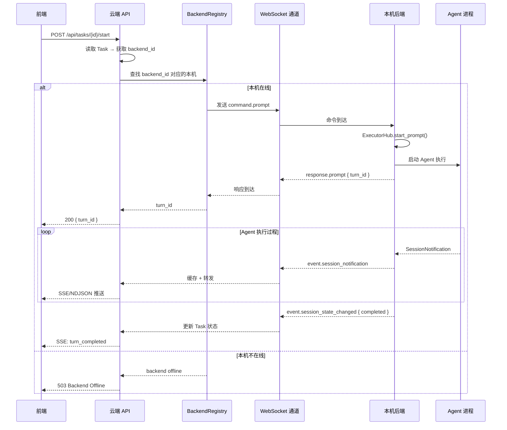

# 模块：中继层（Relay）

## 定位

管理云端与本机后端之间的 WebSocket 通信，实现命令下发、执行结果回传、能力发现、工具调用路由和生命周期管理。

**中继层是云端/本机架构的通信骨干，承载两类 Agent 的不同通信模式。**

## 两类 Agent 的通信模式

| 维度 | 本地第三方 Agent（Claude Code 等） | 云端原生 PiAgent |
|------|---|---|
| 通信方向 | 云端 → 本机 `command.prompt` 下发整段任务 | 云端 AgentLoop → 本机 `command.tool.*` 逐次路由工具调用 |
| 输出回传 | 本机 → 云端 `event.session_notification` 流 | 云端直接产生 SessionNotification（不经 WS） |
| 本机角色 | 完整执行者（Agent 进程 + 工具链） | 纯工具执行环境（文件 I/O + Shell） |

## 职责

- 维护云端 ↔ 本机的 WebSocket 长连接
- 云端侧：接受本机注册、路由命令、缓存转发执行输出、路由 PiAgent tool call
- 本机侧：主动连接云端、接受命令、上报状态和结果、执行 PiAgent 工具调用
- 连接生命周期管理（鉴权、心跳、断线重连）

## 在系统中的位置

```
┌─────────────────────────────────────────┐
│  08 View（视图层）                       │
└─────────────────────────────────────────┘
                    ↓
┌─────────────────────────────────────────┐
│  01 Connection（连接层）                 │
│  ┌───────────────────────────────────┐  │
│  │  09 Relay（中继层）  ← 新增        │  │
│  │  云端 ↔ 本机 WebSocket 通信       │  │
│  └───────────────────────────────────┘  │
└─────────────────────────────────────────┘
                    ↓
┌─────────────────────────────────────────┐
│  02 State（状态层）— 归云端             │
└──────────────┬──────────────────────────┘
               ↓
┌─────────────────────────────────────────┐
│  05 Execution（执行层）                 │
│  ├ 本机：第三方 Agent 执行              │
│  └ 云端：PiAgent AgentLoop             │
└─────────────────────────────────────────┘
```

中继层是 **01 Connection** 模块的核心子模块，横跨云端和本机两个部署单元。

## Backend 与 Workspace 关系

**一个 Backend = 一台机器，管理多个 Workspace 目录。**

```
本机后端（per-machine 进程）
├── accessible_roots[0]: /home/alice/projects/frontend  → 云端 Workspace W1
├── accessible_roots[1]: /home/alice/projects/backend   → 云端 Workspace W2
└── accessible_roots[2]: /home/alice/projects/infra     → 云端 Workspace W3
```

- 本机启动时通过 `register` 消息上报 `accessible_roots`（可访问的目录列表）
- 云端 `Workspace` 实体需要 `backend_id` 字段，记录物理文件所在本机
- 命令路由基于 `Workspace.backend_id`：云端通过 `Task.workspace_id → Workspace.backend_id` 找到目标本机
- `Project.backend_id` / `Story.backend_id` 作为创建子实体时的默认偏好，不参与运行时路由

> 详见 [relay-protocol.md §8](../relay-protocol.md)

## 核心概念

### 云端 BackendRegistry（后端注册表）

云端维护的在线本机列表，是命令路由的核心数据结构。

```
BackendRegistry {
  backends: Map<BackendId, ConnectedBackend>
}

ConnectedBackend {
  backend_id: string
  ws_sender: WebSocketSender
  capabilities: Capabilities
  accessible_roots: Vec<string>
  status: "online" | "offline"
  connected_at: timestamp
  last_heartbeat: timestamp
}

Capabilities {
  executors: ExecutorInfo[]
  supports_cancel: bool
  supports_workspace_files: bool
  supports_discover_options: bool
}
```

**职责：**
- 追踪本机在线状态
- 按 `backend_id` 路由命令到正确的 WebSocket 通道
- 心跳超时检测 → 标记 offline
- 聚合所有在线本机的能力列表（供前端 Agent 发现使用）

### 本机 RelayClient（中继客户端）

本机启动时创建，负责维护到云端的连接。

```
RelayClient {
  cloud_url: string
  token: string
  connection: WebSocketConnection
  accessible_roots: Vec<PathBuf>
  executor_hub: ExecutorHub
  tool_executor: ToolExecutor
  reconnect_state: ReconnectState
}
```

**职责：**
- 建立并维护到云端的 WebSocket 连接
- 将 `command.prompt` / `command.cancel` 路由到本地 ExecutorHub（第三方 Agent）
- 将 `command.tool.*` 路由到本地 ToolExecutor（PiAgent 工具调用）
- 将 ExecutorHub 产出的 SessionNotification 转发到云端
- 断线时自动重连

### 本机 ToolExecutor（工具执行器）

处理来自云端 PiAgent 的工具调用请求，在本机文件系统和 Shell 环境中执行。

```
ToolExecutor {
  accessible_roots: Vec<PathBuf>

  fn file_read(path, workspace_root): Result<String>
  fn file_write(path, content, workspace_root): Result<()>
  fn shell_exec(command, workspace_root, timeout): Result<ShellResult>
  fn file_list(path, pattern, recursive, workspace_root): Result<Vec<FileEntry>>
}
```

每个方法接收 `workspace_root`（绝对路径），ToolExecutor 验证该路径在 `accessible_roots` 内后执行操作。

### 云端 RelayConnector（中继连接器）

云端实现 `AgentConnector` trait 的适配器，用于**本地第三方 Agent** 的中继执行。使上层逻辑对远程执行透明。

```
RelayConnector implements AgentConnector {
  registry: BackendRegistry

  fn prompt(session_id, prompt, context) {
    // 根据 context 中的 backend_id 找到对应本机
    // 将 prompt 请求封装为 command.prompt
    // 通过 WebSocket 发送
    // 返回一个 Stream，从 WS 接收 event.session_notification
  }
}
```

### 云端 PiAgent AgentLoop（云端原生执行）

PiAgent 的 AgentLoop 运行在云端，直接访问云端 DB 获取 Story/Task/Context 等上下文。其工具调用通过 BackendRegistry 路由到目标本机。

```
PiAgentLoop {
  llm_client: LlmApiClient
  registry: BackendRegistry
  context_provider: CloudContextProvider

  async fn run(session_id, prompt, task_context) {
    loop {
      let llm_response = llm_client.call(messages).await;
      match llm_response {
        ToolCall(file_read) => registry.send_command(backend_id, command.tool.file_read),
        ToolCall(shell_exec) => registry.send_command(backend_id, command.tool.shell_exec),
        TextResponse => emit SessionNotification to frontend,
        Done => break,
      }
    }
  }
}
```

> PiAgent 的 SessionNotification 由云端直接产生并推送到前端 SSE 流，**不经过** WebSocket 中继。

## 数据归属模型

### 云端拥有

| 实体 | 说明 |
|------|------|
| `Project` | 项目定义（名称、描述、配置） |
| `Workspace`（元数据） | 工作空间名称、类型、关联 Project、指向本机的物理路径 |
| `Story` | 用户价值单元（含 `backend_id` 标记执行目标） |
| `Task` | 执行单元定义（含 `backend_id`、`agent_binding`） |
| `Backend` | 已注册本机列表、token、在线状态 |
| `View` / `UserPreferences` | 用户偏好和看板视图 |
| `Settings` | 全局/用户级设置 |
| `StateChange` | 不可变事件日志 |
| `SessionNotification` 缓存 | 从本机接收后缓存，用于前端 Resume |
| `MCP` | Model Context Protocol 对外暴露服务 |

### 本机拥有

| 实体 | 说明 |
|------|------|
| `ExecutorHub`（运行时） | 第三方 Agent 会话的内存态 + JSONL 持久化 |
| `AgentConnector` 实例 | 本地第三方 Agent 进程（Claude Code、Codex 等） |
| `ToolExecutor` | PiAgent tool call 的本地执行环境 |
| Workspace 物理文件 | 实际的 Git worktree、代码文件、构建产物 |
| Agent 执行中间状态 | 正在流式产出的 SessionNotification（仅第三方 Agent） |
| 能力声明 | 可用第三方执行器列表、版本、变体 |

### 共享 / 流经

| 数据 | 流向 | 说明 |
|------|------|------|
| `SessionNotification`（第三方 Agent） | 本机 → 云端 | 本机产出，云端缓存并转发到前端 |
| Executor 配置 | 云端 → 本机 | 云端在 command.prompt 中下发 |
| 能力列表 | 本机 → 云端 | 本机注册/变更时上报 |
| 文件内容 | 双向 | 按需读取；PiAgent tool call 的文件读写结果 |
| Tool call 请求/结果 | 云端 → 本机 → 云端 | PiAgent 的工具调用路由 |

## 中继模型

### 前端请求 → 云端 → 本机 → 执行



### 本机断线处理

当云端检测到本机断线：

1. `BackendRegistry` 标记该 backend 为 `offline`
2. 该本机正在执行的所有 session 标记为 `interrupted`
3. 对应 Task 状态迁移为 `interrupted`
4. 通过全局事件流通知前端
5. 本机重连并重新注册后，恢复 `online` 状态

**注意**：断线不会导致数据丢失 — 本机的 ExecutorHub 仍保有完整会话历史。重连后如需恢复，可由云端查询本机的 session 状态。

## Crate 结构

### `agentdash-relay`（共享 crate）

被云端和本机同时依赖的通信协议层。

```
crates/agentdash-relay/
├── Cargo.toml
└── src/
    ├── lib.rs
    ├── protocol.rs       # RelayMessage、命令/响应/事件的类型定义
    ├── error.rs          # RelayError、错误码常量
    ├── codec.rs          # JSON 序列化/反序列化
    ├── client.rs         # RelayClient — 本机使用
    │                     #   连接管理、命令监听、事件上报
    ├── server.rs         # RelayServer — 云端使用
    │                     #   WebSocket 端点、消息分发
    ├── registry.rs       # BackendRegistry — 云端使用
    │                     #   在线本机管理、路由
    └── connector.rs      # RelayConnector — 云端使用
                          #   实现 AgentConnector trait，透明中继
```

### 依赖关系

```
agentdash-local ──依赖──► agentdash-relay (client.rs)
                          agentdash-executor      # 第三方 Agent 执行
                                                  # (不依赖 agentdash-agent)

agentdash-cloud ──依赖──► agentdash-relay (server.rs, registry.rs, connector.rs)
                          agentdash-agent          # PiAgent AgentLoop（云端原生）
                          agentdash-domain
                          agentdash-infrastructure
                          agentdash-mcp
                          agentdash-injection
```

> **关键变更**：`agentdash-agent`（PiAgent）从本机依赖移至云端依赖。PiAgent 作为云端原生 Agent，直接访问云端 DB 获取完整上下文。

## 接口定义

### 云端侧

```
BackendRegistry {
  register(backend_id, ws_sender, capabilities): Result<()>
  unregister(backend_id): void
  get_backend(backend_id): Option<ConnectedBackend>
  list_online_backends(): Vec<ConnectedBackend>
  aggregate_executors(): Vec<ExecutorInfo>
  send_command(backend_id, command): Result<Response>
  is_online(backend_id): bool
}

RelayConnector: AgentConnector {
  // 通过 BackendRegistry 路由到远程本机
  prompt(session_id, prompt, context) → ExecutionStream
  cancel(session_id) → Result<()>
  list_executors() → Vec<ExecutorInfo>  // 聚合所有在线本机
  discover_options_stream(...) → BoxStream<Patch>
}
```

### 本机侧

```
RelayClient {
  connect(cloud_url, token): Result<()>
  reconnect(): void  // 自动重连
  send_event(event): Result<()>
  
  // 内部命令处理路由
  handle_command(command) → Response {
    match command.type {
      // 第三方 Agent 命令
      "command.prompt" → executor_hub.start_prompt(...)
      "command.cancel" → executor_hub.cancel(...)
      "command.discover" → connector.list_executors()
      "command.workspace_files.*" → read local files
      // PiAgent tool call
      "command.tool.file_read" → tool_executor.file_read(...)
      "command.tool.file_write" → tool_executor.file_write(...)
      "command.tool.shell_exec" → tool_executor.shell_exec(...)
      "command.tool.file_list" → tool_executor.file_list(...)
      ...
    }
  }
}
```

## 关键设计决策

### 决策 1：消息协议选择 JSON over WebSocket

**原因**：
- ACP `SessionNotification` 已是 JSON 格式，直接嵌入避免转换
- 可读性好，便于调试
- 性能在预研阶段不是瓶颈

**替代方案**：MessagePack / Protobuf — 留作后续优化选项。

### 决策 2：云端实现 `RelayConnector`（AgentConnector trait）

**原因**：
- 使云端的上层逻辑（Task 执行、Session 管理）对远程执行透明
- 可以在云端复用现有的 ExecutorHub 协调逻辑
- 如果未来需要云端本地执行能力，只需添加新的 Connector

### 决策 3：SessionNotification 透传不转换

**原因**：
- 保持 `_meta.agentdash` 元信息完整（source、trace 等）
- 前端渲染逻辑无需为中继场景做任何适配
- 云端只负责缓存和转发，不解析 notification 内容

### 决策 4：PiAgent AgentLoop 运行在云端

**原因**：
- PiAgent 需要直接访问 Story/Task/Context/Injection 等云端业务数据，在本机运行会形成"数据中继"的反模式
- PiAgent 的 tool call 可通过 Relay 路由到任意在线本机，天然支持跨工作空间操作
- PiAgent 可作为编排层的"Agent PM"角色，参与 Task 拆解和调度
- 本地第三方 Agent 是不可控的外部进程必须在本机运行，PiAgent 作为完全自研的 Agent 运行位置可选

**影响**：
- `agentdash-agent` 从 `agentdash-local` 依赖移至 `agentdash-cloud` 依赖
- 本机新增 `ToolExecutor` 组件处理 `command.tool.*`
- WebSocket 协议新增 `command.tool.*` 命名空间

## 暂不定义

- [ ] 消息压缩策略（WebSocket permessage-deflate）
- [ ] 多云端实例间的 Backend 路由
- [ ] 云端主动推送配置变更到本机
- [ ] 本机之间的直接通信
- [ ] 断线恢复时的 session 状态同步细节
- [ ] **消息背压/流控**：高频 `event.session_notification` 的缓冲堆积和背压策略
- [ ] **tool call 超时与重试**：file_read/write/list 的超时定义；断线导致 response 丢失时 AgentLoop 的恢复策略
- [ ] **accessible_roots 动态变更**：本机新增/移除工作空间目录时的通知机制

---

**锚点**：本机必须能够主动连接云端，云端必须能够路由命令到任意在线本机  
**策略可插拔**：鉴权方式、消息序列化格式、重连策略、缓存策略

---

*状态：设计定义阶段*  
*更新：2026-03-10 — v0.3 澄清 Backend-Workspace 关系（一机多 workspace）、修正路由模型*  
*更新：2026-03-10 — v0.2 增加两类 Agent 模型、PiAgent 云端执行、ToolExecutor*
